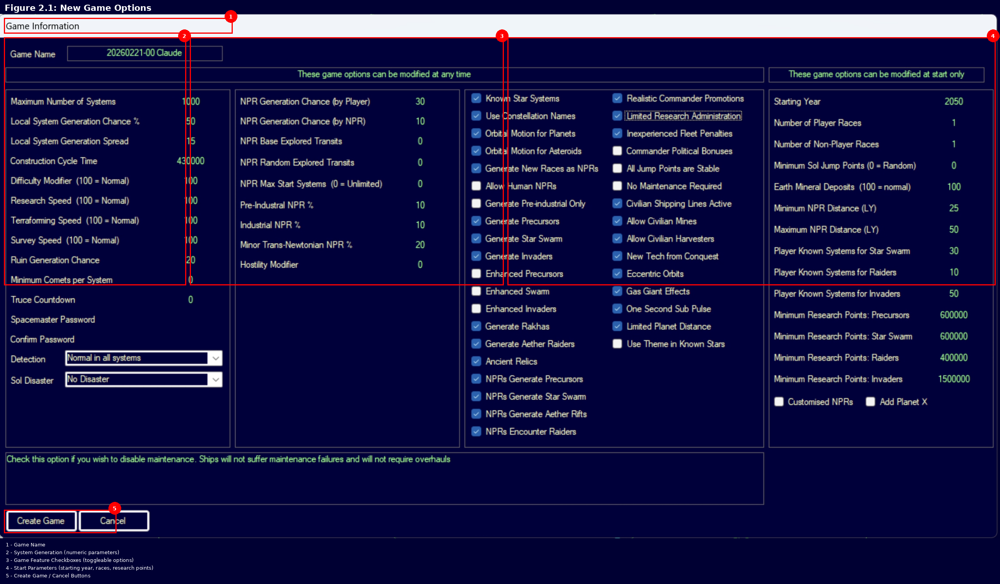

# Aurora 4X Manual - Project Instructions

## Project Overview

This is a comprehensive reference manual for Aurora C# (space strategy game by Steve Walmsley). The manual is written in Markdown, organized by numbered sections, and compiled to PDF via `build-pdf.sh` using pandoc + tectonic.

## Answering Game Mechanics Questions

When answering questions about Aurora mechanics using manual content:

1. **Always indicate if the answer depends on unverified claims** — If the relevant manual section contains `*(unverified)*` markers, explicitly state this in the response
2. **Cite the specific manual section** — Reference the section number and file (e.g., "Section 12.2.2.3 in `12-combat/12.2-beam-weapons.md`")
3. **Distinguish verified vs unverified** — Verified claims have `\hyperlink{ref-X.Y-N}{[N]}` references; unverified claims have `*(unverified)*` markers
4. **Recommend authoritative sources for unverified claims** — Aurora Forums, in-game testing, or database queries

### Forum-Ready Responses

When preparing answers suitable for posting to Aurora Forums or Discord:

- **Tone:** Respectful and "light" — helpful without being condescending
- **Structure:** Lead with the direct answer, then explain the mechanics
- **References:** Cite the original source (AuroraWiki, database, forum post)
- **Links:** Include specific section anchors to GitHub Pages manual. Use `.html` extension (not `.md`) for formatted pages:
  ```
  https://erikevenson.github.io/aurora-manual/12-combat/12.2-beam-weapons.html#12223-damage-gradient-armor-column-spread
  ```
- **Verification status:** Clearly note if claims come from community sources (AuroraWiki) vs authoritative sources (game database, Steve Walmsley posts)
- **Unverified claims:** Explicitly state when something is unverified and recommend verification methods

## Game Fundamentals

- **Turn-based, not real-time:** Aurora advances time only when the player clicks an increment button (5 sec, 30 sec, 5 min, etc.). There is no "pause" — time never runs automatically.
- **Conventional start:** Earth in 2025 with existing population, installations, and officers
- **Space start:** Single ship, minimal resources, no established infrastructure

## YouTube Source Attribution

**MANDATORY:** When extracting content from YouTube videos for manual updates:

1. **Issue Creation:** Every issue sourced from a YouTube video MUST include:
   - The video title and URL in the issue body under "## Source"
   - A comment on the issue crediting the creator: `**Source Credit:** [Creator Name](channel_url) — description`

2. **Manual References:** Credit YouTube sources in the References section of the relevant manual file (not in README). Example:
   ```
   \hypertarget{ref-X.Y-N}{[N]}. [Creator Name] YouTube — "[Video Title]" — [specific detail verified]
   ```

3. **Identifying Creators:** Use `yt-dlp --print channel --print channel_url <URL>` to get the official channel name and URL.

**Note:** Specific YouTube channel names should NOT appear in README.md — only in manual references where content was sourced.

## Content Standards

- **Section numbering:** Decimal hierarchy (e.g., 8.2.1 is a heading within file 8.2)
- **Cross-references:** Always use `[Section X.Y Title](../path/to/file.md)` format — never bare "see Section X.Y"
- **Version tags:** New sections get `*Added: v2026.01.24*` after the top heading
- **Callouts:** Use `> **Tip:**`, `> **Note:**`, `> **Warning:**` blockquote format
- **Tables:** Ensure blank lines before and after tables for pandoc compatibility

## Inline References (MANDATORY for all new content)

Every factual claim (numeric values, game mechanics, formulas, component specs) MUST include an inline reference verified against an authoritative source.

**Inline citation format:** `\hyperlink{ref-X.Y-N}{[N]}` where X.Y is the section number and N is sequential within that section.

**Reference definition format** (in a `## References` section at the bottom of each file):
```
\hypertarget{ref-X.Y-N}{[N]}. Aurora C# game database (AuroraDB.db v2.7.1) — [table_name] [field/details verified]
```

**Rules:**
- Use section-specific prefixes (`ref-8.3-`, `ref-14.1-`) to avoid PDF link ID collisions
- NEVER place `\hyperlink` references inside markdown headings — this causes TeX stack overflow. Place them on the line after the heading instead.
- Verify claims against `~/Downloads/Aurora271Full/AuroraDB.db` (SQLite) first; fall back to Aurora Forums / AuroraWiki
- Claims that cannot be verified against any authoritative source must be marked with `*(unverified)*` inline
- For forum-sourced references: `\hypertarget{ref-X.Y-N}{[N]}. Aurora Forums — [topic URL] — [description]`
- Keep reference numbers sequential within each file
- Each markdown file maintains its own References section

**Example:**
```markdown
Fuel Refineries cost 120 BP and require 120 Boronide per installation \hyperlink{ref-14.1-2}{[2]}

## References

\hypertarget{ref-14.1-2}{[2]}. Aurora C# game database (AuroraDB.db v2.7.1) — DIM_PlanetaryInstallation PlanetaryInstallationID=3 (Fuel Refinery). Cost=120 BP, Boronide=120.
```

## Build System

- **Build command:** `bash build-pdf.sh` (auto-increment) or `bash build-pdf.sh VERSION` (explicit)
- **PDF output:** `releases/aurora-manual-VERSION.pdf`
- **File list:** All source files must be listed in `build-pdf.sh` FILES array
- **Validation:** Build script validates all listed files exist before compilation
- **Releases:** PDFs are .gitignored; attach to GitHub releases via `gh release create`
- **Release versioning:** `vYYYY.MM.DD.##` where `##` is zero-padded (01, 02, etc.) and increments per release within a day

**IMPORTANT: Release version, PDF filename, AND PDF internal version MUST all match.**

When creating a release:

1. Check the next release number: `gh release list --limit 1`
2. Build the PDF with explicit version:
   ```bash
   bash build-pdf.sh 2026.01.28.07
   ```
3. Create the release with matching version:
   ```bash
   gh release create v2026.01.28.07 releases/aurora-manual-2026.01.28.07.pdf --title "..."
   ```

For development/testing builds, use `bash build-pdf.sh` without arguments (auto-increments).

## Game Database

- **Location:** `~/Downloads/Aurora271Full/AuroraDB.db` (SQLite)
- **Use:** Verify formulas, values, and mechanics claims against actual game data
- **Caution:** Values from YouTube videos or forum posts should be cross-checked against the database when possible

## Issue Workflow

- Group related issues into parallel waves for background agents
- Close issues with commit reference comments
- Push all commits before closing issues
- Build PDF and create GitHub release after completing a wave

## Unverified Claims Tracking

**MANDATORY:** All unverified claims must be tracked via GitHub issues.

### When Adding Unverified Content

When adding content that cannot be verified against authoritative sources:
1. Mark the claim with `*(unverified — #NNN)*` inline, where NNN is the tracking issue number
2. Create a GitHub issue to track verification using label `unverified`
3. Issue title format: `Verify: [Section] [Brief description of claim]`
4. Issue body must include:
   - The exact unverified claim text
   - File path and line number
   - Suggested verification sources (database table, forum topic, changelog)

**Inline format examples:**
- `*(unverified — #728)*` — simple unverified claim
- `*(unverified — #728 -- version-specific change)*` — with context

### When Finding Existing Unverified Claims

When discovering unverified claims without tracking issues:
1. Search existing issues to avoid duplicates
2. Create verification issues for any untracked claims
3. Group multiple claims from the same file into a single issue

### When Verifying Claims

When a claim is verified against an authoritative source:
1. Remove the `*(unverified)*` marker from the text
2. Add a numbered reference with the verification source
3. Close the tracking issue with a commit reference
4. Comment format: `Verified in commit [hash]. Source: [reference details]`

### Verification Priority

Prioritize verification of:
1. Formulas and numeric values (directly affect gameplay calculations)
2. Core mechanics (combat, movement, construction)
3. Version-specific changes (may be outdated)
4. UI/UX claims (easily testable in-game)

## README Maintenance

**Keep README.md synchronized with project state.** Check and update when:

1. **Game version changes** — Update the version number in both locations:
   - Line 5: "This manual covers Aurora C# vX.Y.Z"
   - Community Review section: "This manual covers Aurora C# vX.Y.Z"
   - Must match the database version cited in references (currently v2.7.1)

2. **Section structure changes** — Update the Structure table if:
   - New chapters are added
   - Chapter descriptions change significantly
   - Sections are renamed or reorganized

3. **Build system changes** — Update the "Building the PDF" section if:
   - New dependencies are added
   - Build commands change
   - New build options are added

4. **New contributors** — Add to Contributors section (see Contributor Attribution below)

**Version consistency rule:** The README version, database references throughout the manual, and the Game Database section in this file must all reference the same Aurora version.

## Contributor Attribution

All repo contributors must appear in three locations:

1. **README.md** — Contributors section: `- **[@username](https://github.com/username)**`
2. **1-introduction/1.1-what-is-aurora.md** — Manual Contributors list (ensures they appear in PDF)
3. **Release notes** — Contributors section when creating releases

To get the current contributor list: `gh api repos/ErikEvenson/aurora-manual/contributors --jq '.[].login'`

## LaTeX Compatibility

- Avoid Unicode symbols that don't render in LaTeX (e.g., use `<=` instead of `≤`)
- Long tables may overflow; consider breaking into multiple tables or using shorter column content

## SVG Images

SVG images are supported via automatic conversion:

- **Source:** Place `.svg` files in `images/tech-trees/`
- **Generated:** Build script converts to PDF in `images/.generated/` (gitignored)
- **Reference in markdown:** ``
- **Conversion tool:** `rsvg-convert` (must be installed)
- **Tech tree generation:** Use Graphviz DOT format, convert with `dot -Tsvg`

The build script only reconverts if the SVG is newer than the PDF.

## Screenshots

Screenshots are stored in `images/screenshots/` with subdirectories mirroring chapter structure.

### Directory Structure

```
images/screenshots/
  2-game-setup/
    2.1-new-game-options.png
  3-user-interface/
    3.1-main-window-overview.png
  ...
```

### Screenshot Issues

Screenshot requests use the `screenshot` label. Issue body includes:
- Target filename and path
- Description of what to capture
- Annotation suggestions
- Capture notes

### Incorporating Screenshots from Issues

When a user uploads a screenshot to an issue:

1. **Fetch the image URL:**
   ```bash
   gh api repos/ErikEvenson/aurora-manual/issues/NNN/comments --jq '.[].body'
   ```

2. **Download the image:**
   ```bash
   curl -sL "[image_url]" -o /tmp/screenshot-base.png
   ```

3. **Add annotations with Python/Pillow:**
   ```python
   from PIL import Image, ImageDraw, ImageFont

   img = Image.open('/tmp/screenshot-base.png')

   # Add figure header (expand canvas)
   header_height = 40
   new_img = Image.new('RGB', (img.width, img.height + header_height), '#000033')
   new_img.paste(img, (0, header_height))
   draw = ImageDraw.Draw(new_img)

   font = ImageFont.truetype('/System/Library/Fonts/Helvetica.ttc', 32)
   font_header = ImageFont.truetype('/System/Library/Fonts/Helvetica.ttc', 24)

   # Draw figure header
   draw.text((15, 8), "Figure X.Y: Description", fill='white', font=font_header)

   # Draw box (adjust Y coordinates by +header_height)
   draw.rectangle((x1, y1 + header_height, x2, y2 + header_height), outline='#FF0000', width=3)

   # Draw numbered circle
   draw.ellipse([cx-18, cy-18, cx+18, cy+18], fill='#FF0000')
   draw.text((cx-8, cy-12), "1", fill='white', font=font)

   # Add legend bar at bottom
   draw.rectangle([10, 930, 700, 985], fill='#000033', outline='#FF0000')
   draw.text((20, 940), "1 - Label", fill='white', font=font_small)

   new_img.save('/tmp/screenshot-annotated.png')
   ```

4. **Verify quality and accuracy:**
   - View the annotated image using `Read` tool
   - Confirm boxes highlight the correct UI elements
   - Verify callout numbers are visible and properly positioned
   - Check figure header text is correct
   - If annotations are misaligned, adjust coordinates and regenerate

6. **Copy to proper location:**
   ```bash
   cp /tmp/screenshot-annotated.png images/screenshots/[chapter]/[section]-[name].png
   ```

7. **Add to manual section:**
   ```markdown
   
   ```

8. **Commit with issue closure:**
   ```bash
   git add -A && git commit -m "Add screenshot for Section X.Y

   Closes #NNN"
   ```

### Annotation Guidelines

- **Figure header:** "Figure X.Y: Description" at top, white text on dark background (#000033)
- **Box color:** Red (#FF0000), 3px stroke
- **Callout circles:** Red fill, 18px radius, white number
- **Legend:** Dark background bar at bottom with callout explanations
- **Font:** System Helvetica or similar sans-serif

### Quality Verification Checklist

Before committing a screenshot, verify:
- [ ] Figure header displays correct section number and description
- [ ] Annotation boxes correctly highlight the intended UI elements
- [ ] Callout numbers (1, 2, 3) are visible and not obscured
- [ ] Legend text matches the callout descriptions
- [ ] Image is not blurry or distorted
- [ ] All text is legible at normal viewing size

### Identifying Correct UI Element Positions

Do NOT guess coordinates. Use systematic grid analysis to find element positions:

**Step 1: Find X positions using vertical strips**
```python
from PIL import Image
img = Image.open('/tmp/screenshot.png')

# Create vertical strips (400px wide) across the image
for x_start in range(0, img.width, 400):
    strip = img.crop((x_start, 100, x_start + 400, 200))
    strip.save(f'/tmp/x_strip_{x_start}.png')
```

**Step 2: Find Y positions using horizontal strips**
```python
# Once X range is known (e.g., x=408-780 for NPR), find Y position
for y_start in range(0, 400, 50):
    strip = img.crop((408, y_start, 780, y_start + 50))
    strip.save(f'/tmp/y_strip_{y_start}_{y_start+50}.png')
```

**Step 3: Refine with narrow strips**
```python
# Narrow down to exact Y range (e.g., found text around y=150)
for y_start in [140, 150, 160]:
    strip = img.crop((408, y_start, 780, y_start + 30))
    strip.save(f'/tmp/precise_y_{y_start}.png')
```

**Step 4: View strips** with Read tool to identify text labels

**Step 5: Record actual coordinates** based on where text/controls appear

Example workflow:
- Looking for "NPR Generation Chance" - need both X and Y
- Vertical strips: find text appears in x=400-800 range
- Horizontal strips in that X range: find text at y=140-175
- Final box coordinates: (408, 140, 780, 175)

**Never assume coordinates based on UI layout descriptions.** Always visually verify using systematic grid analysis of the actual screenshot.

### Markdown Reference

```markdown

```

Both PDF (pandoc) and web (Jekyll) handle PNG images natively.
