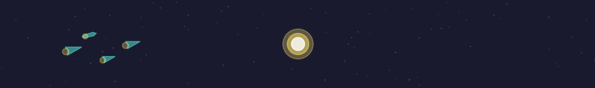
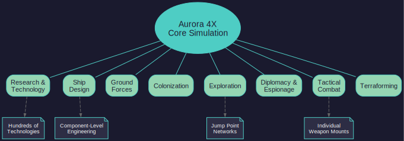
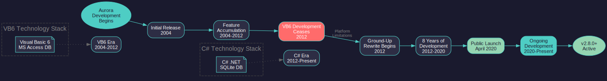
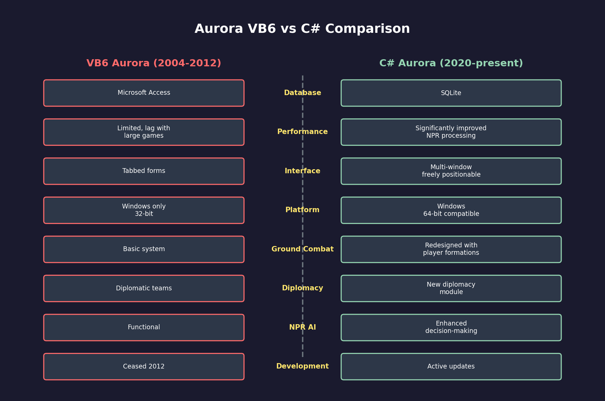
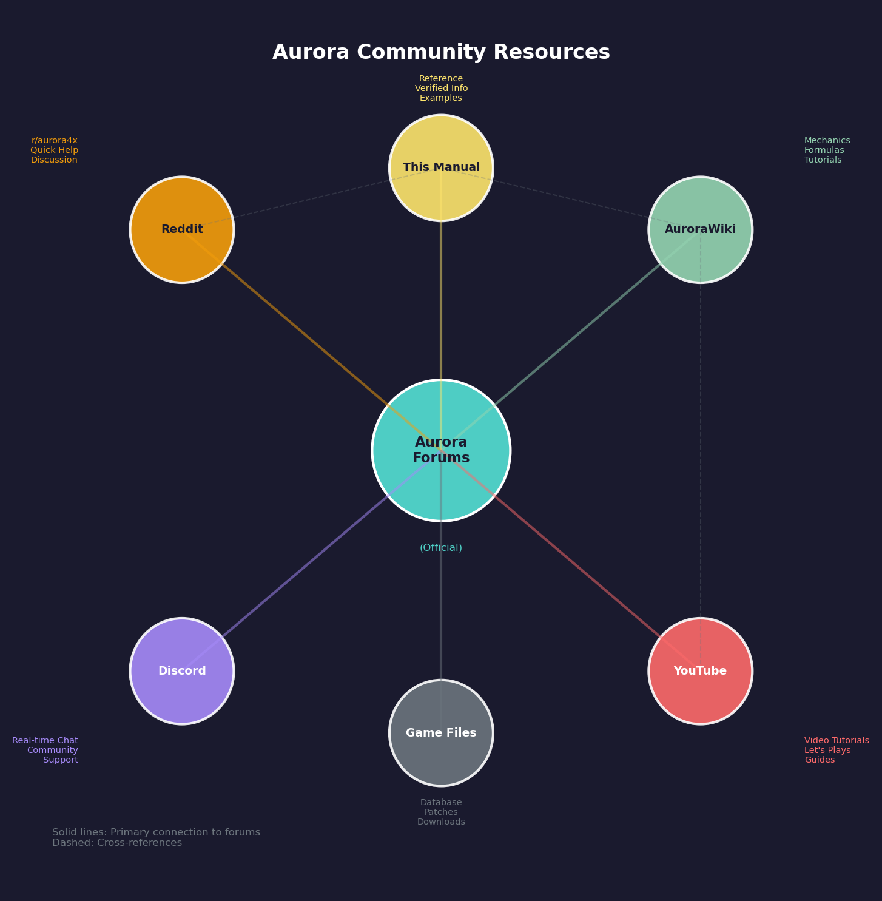

# 1.1 What is Aurora

*Updated: v2026.01.30*

Aurora 4X is a deeply detailed space strategy game created by Steve Walmsley. It simulates the full scope of interstellar expansion — from researching propulsion technologies and designing warships to colonizing alien worlds and fighting tactical space battles.

## 1.1.1 Genre and Scope

*Updated: v2026.01.30*

Aurora belongs to the 4X genre (eXplore, eXpand, eXploit, eXterminate), but it pushes far beyond what most 4X games attempt. Where typical strategy games abstract logistics, crew management, and ship design into simple sliders or tech trees, Aurora models these systems with granular precision.

The game covers:

- **Research and Technology**: Hundreds of individual technologies across dozens of fields, from engine design and armor materials to sensors and missile warheads (see [Section 7.1 Technology Tree](../7-research/7.1-technology-tree.md)). Each breakthrough unlocks new component designs and strategic possibilities.
- **Ship Design**: You design every ship from the keel up, selecting engines, armor, weapons, sensors, fuel tanks, cargo holds, and crew facilities (see [Section 8.1 Design Philosophy](../8-ship-design/8.1-design-philosophy.md)). A destroyer is not a unit you build from a menu — it is an engineering project you create.
- **Ground Forces**: Infantry, armor, and support units can be designed, trained, transported, and deployed for planetary invasions or garrison duty (see [Section 13.1 Unit Types and Formation Design](../13-ground-forces/13.1-unit-types.md)).
- **Colonization and Terraforming**: Worlds have detailed atmospheric compositions, gravity, and temperature. Colonies must be established, supplied, and potentially terraformed over decades to become habitable.
- **Exploration**: Jump points connect star systems in a web you must discover through dedicated survey vessels (see [Section 17.1 Geological Survey](../17-exploration/17.1-geological-survey.md)). Each new system may contain resources, habitable worlds, alien ruins, or hostile civilizations.
- **Diplomacy and Espionage**: Interact with other spacefaring races through trade, diplomacy, or intelligence operations (see [Section 15.1 Alien Races](../15-diplomacy/15.1-alien-races.md)).
- **Tactical Combat**: Battles resolve at the individual weapon mount level, with missile volleys, beam weapon engagements, and point defense all modeled in detail (see [Section 12.1 Fire Controls](../12-combat/12.1-fire-controls.md)).

Aurora is often compared to Dwarf Fortress in its depth and complexity. It is not a casual game — it rewards players who enjoy mastering intricate systems and crafting emergent narratives from the simulation's output.

**Scale**: A single game can span centuries of in-game time, encompassing dozens of star systems, hundreds of ships, and billions of colonists. The simulation runs in discrete time increments (from 5 seconds to 30 days) \hyperlink{ref-1.1-5}{[5]}, allowing you to manage everything from individual missile salvos to decades-long terraforming projects.

## 1.1.2 History

*Updated: v2026.01.30*

Aurora's development stretches back over two decades and represents one person's sustained vision for the ultimate space strategy simulation.

**VB6 Era (2004-2012)**: The original Aurora was released in 2004 \hyperlink{ref-1.1-1}{[1]} and was written in Visual Basic 6, using a Microsoft Access database as its backend \hyperlink{ref-1.1-6}{[6]}. Despite the aging technology stack, this version accumulated an enormous feature set and a dedicated community. The VB6 version reached a remarkably complete state but was limited by its platform — it could only run on Windows, struggled with large games, and the Access database imposed performance constraints. Development on the VB6 version ceased in 2012 when Steve Walmsley began porting the game to C# \hyperlink{ref-1.1-2}{[2]}.

**C# Rewrite (2012-present)**: Steve Walmsley undertook a ground-up rewrite in C# with a SQLite database backend \hyperlink{ref-1.1-7}{[7]}. The C# version (sometimes called "Aurora C#" or "Aurora 2") launched publicly in April 2020 \hyperlink{ref-1.1-3}{[3]} and brought significant improvements:

- Dramatically improved performance, especially for large games with many NPR (Non-Player Races) \hyperlink{ref-1.1-8}{[8]}
- A proper windowed interface replacing the VB6 tabbed form approach \hyperlink{ref-1.1-8}{[8]}
- Enhanced AI for computer-controlled races *(unverified — [#700](https://github.com/ErikEvenson/aurora-manual/issues/700))*
- Improved ground combat and diplomatic systems \hyperlink{ref-1.1-9}{[9]}
- Better stability and reduced database corruption issues *(unverified — [#700](https://github.com/ErikEvenson/aurora-manual/issues/700))*
- No dependency on Microsoft Access \hyperlink{ref-1.1-7}{[7]}

**Development Philosophy**: Aurora is developed entirely by Steve Walmsley as a personal project, released for free. There is no monetization, no microtransactions, and no commercial pressure. Updates arrive when they are ready, and the game's design reflects one person's coherent vision rather than a committee's compromises. This results in remarkable depth but also means the interface prioritizes function over visual polish.

## 1.1.3 Community

*Updated: v2026.01.30*

Aurora has cultivated a passionate community despite (or perhaps because of) its complexity and niche appeal.

**Aurora Forums** (https://aurora2.pentarch.org/): The primary hub for Aurora discussion, hosted on Steve Walmsley's own forum since 2003 \hyperlink{ref-1.1-4}{[4]}. This is where patch notes are posted, mechanics are discussed, and after-action reports (AARs) are shared. Steve actively participates in discussions and often implements community suggestions. The pentarch.org domain is the official home of Aurora and its community — all forum links in this manual reference this authoritative source.

Key forum sections include:

- **C# Aurora Changes List**: Patch notes and development updates
- **C# Aurora Suggestions**: Community feature requests
- **C# Aurora Bug Reports**: Issue tracking
- **Academy**: Tutorials and guides written by experienced players
- **Fiction**: After-action reports and narrative playthroughs

**Reddit** (r/aurora4x and r/aurora): Active subreddits with beginner questions, gameplay discussions, screenshots, and links to community resources. A good starting point for new players looking for quick answers.

**Discord**: Community-run Discord servers provide real-time help and discussion. These are particularly useful for getting immediate answers to gameplay questions.

**Community Resources**:

- **[Aurora Wiki](https://aurorawiki2.pentarch.org)**: Community-maintained wiki with mechanics documentation, hosted on the official pentarch.org domain
- **YouTube Tutorials**: Several community members produce video tutorials and let's-play series:
  - **[Defran Strategy](https://www.youtube.com/channel/UCQEGuZWLqCs0c8vaJ0trM3A)** — Aurora 4x v2.7.1 tutorial series covering ground combat, colonization, and early-game strategy
  - **[MO Chad](https://www.youtube.com/channel/UCC_GG3BqJqdf9tEoZfxJ1kw)** — Complete Beginner's Guide 2025 series covering installation, setup, and early-game fundamentals
- **Quill18's Aurora Series**: One of the more well-known video introductions to the game (covers the VB6 version — mechanics may differ from C#)
- **Community Spreadsheets**: Players have created various spreadsheets and calculators for ship design optimization, mineral planning, and other complex tasks, often shared on the Aurora Forums and Reddit communities

**After-Action Reports (AARs)**: One of the community's great traditions is the detailed AAR — a narrative account of a player's game, complete with screenshots, fleet compositions, and dramatic battle reports. These serve both as entertainment and as learning resources for new players, demonstrating strategies and mechanics in context.

**Manual Contributors**: This manual has benefited from community contributions:

- [@ErikEvenson](https://github.com/ErikEvenson)
- [@ManzoorAhmedShaikh](https://github.com/ManzoorAhmedShaikh)

## 1.1.4 Verification Status

*Updated: v2026.01.30*

> **Important Notice**: This manual was initially generated using AI assistance (Claude) and has undergone systematic verification against authoritative sources. All 18 chapters and 4 appendices have been verified, with 485+ numbered references added and 80+ factual corrections applied. Claims that could not be verified against authoritative sources are individually marked with *(unverified — [#700](https://github.com/ErikEvenson/aurora-manual/issues/700))* in the text.

**Verification Methodology**:

This manual covers Aurora C# through v2.8.0. Formulas and values were verified against the Aurora C# game database (AuroraDB.db v2.7.1), Steve Walmsley's forum posts, and the AuroraWiki. Verified claims include numbered references (e.g., [1]) linking to their sources. Claims marked *(unverified)* could not be confirmed from available sources and should be treated as community knowledge or approximations.

**Authoritative Sources** (in order of priority):

1. **Aurora C# game database** (AuroraDB.db) — definitive for game values and mechanics
2. **Steve Walmsley forum posts** (aurora2.pentarch.org) — developer statements on design and mechanics
3. **AuroraWiki** (aurorawiki2.pentarch.org) — community-maintained documentation
4. **In-game screenshots** — visual confirmation of UI elements and values
5. **YouTube tutorials** — gameplay demonstrations from community creators

**How to Help**: If you find an error or can provide a source for unverified content, please submit an issue or pull request at the GitHub repository.

## Related Sections

- [Section 7.1 Technology Tree](../7-research/7.1-technology-tree.md) -- Research and technology mechanics
- [Section 8.1 Design Philosophy](../8-ship-design/8.1-design-philosophy.md) -- Designing ships from components
- [Section 12.1 Fire Controls](../12-combat/12.1-fire-controls.md) -- Tactical combat resolution
- [Section 15.1 Alien Races](../15-diplomacy/15.1-alien-races.md) -- Diplomatic interactions with other races
- [Section 17.1 Geological Survey](../17-exploration/17.1-geological-survey.md) -- Survey operations and jump point discovery
- [Appendix B: Glossary](../appendices/B-glossary.md) -- Key terms and definitions

## References

\hypertarget{ref-1.1-1}{[1]}. LaunchBox Games Database, "Aurora 4x" — Release year 2004. [gamesdb.launchbox-app.com](https://gamesdb.launchbox-app.com/games/details/144446-aurora-4x)

\hypertarget{ref-1.1-2}{[2]}. EverybodyWiki, "Aurora 4x" — VB6 development ceased in 2012 when Steve Walmsley began porting to C#. [en.everybodywiki.com](https://en.everybodywiki.com/Aurora_4x)

\hypertarget{ref-1.1-3}{[3]}. Multiple sources confirm C# Aurora launched publicly in April 2020: EverybodyWiki, TV Tropes, AuroraWiki.

\hypertarget{ref-1.1-4}{[4]}. Aurora 4X Main Forum — Forum active since 2003 with development history. [aurora2.pentarch.org](https://aurora2.pentarch.org/)

\hypertarget{ref-1.1-5}{[5]}. AuroraWiki, "Time, Turns and Interrupts" — "Time increments can be selected in the main game window, or in the Galactic Map — options range from 5 seconds to 30 days." [aurorawiki2.pentarch.org](https://aurorawiki2.pentarch.org/index.php?title=5-day_increment)

\hypertarget{ref-1.1-6}{[6]}. GitHub aurora4x-tools — VB6 Aurora used a Microsoft Access database (`Stevefire.mdb`) as its backend. [github.com/wisq/aurora4x-tools](https://github.com/wisq/aurora4x-tools)

\hypertarget{ref-1.1-7}{[7]}. Aurora C# game file inspection — `AuroraDB.db` confirmed as SQLite 3.x database; `Aurora.exe.config` references `System.Data.SQLite` provider; `System.Data.SQLite.dll` included in installation.

\hypertarget{ref-1.1-8}{[8]}. Aurora Forums, "C# Meta compared to VB6" — Community comparison of VB6 and C# versions covering performance, interface, and feature changes. [aurora2.pentarch.org](https://aurora2.pentarch.org/index.php?topic=12418.0)

\hypertarget{ref-1.1-9}{[9]}. Aurora Forums, "C# Ground Combat" — Redesigned ground combat system with player-designed formations and new mechanics. AuroraWiki, "C-Ground Combat" documents the overhauled system. Aurora Forums, "Diplomacy module" — New diplomacy module replacing VB6 Diplomatic Teams. [aurora2.pentarch.org](https://aurora2.pentarch.org/index.php?topic=9792.0)

