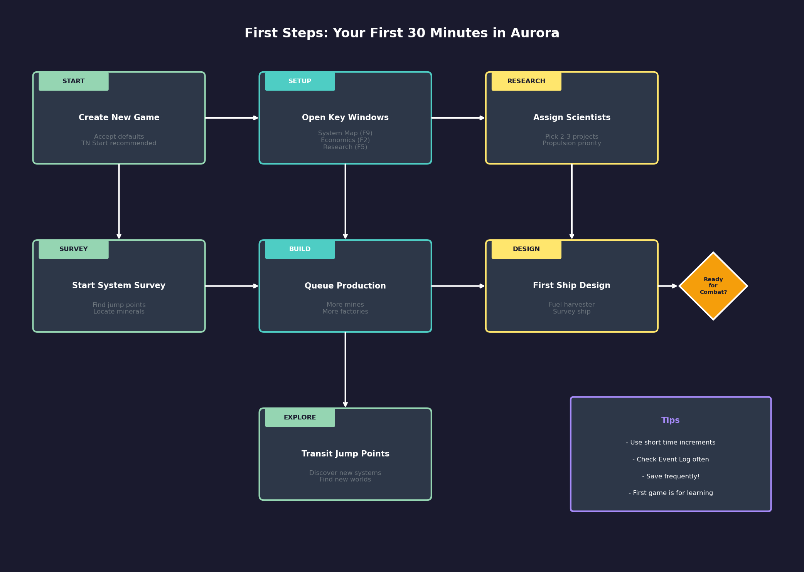
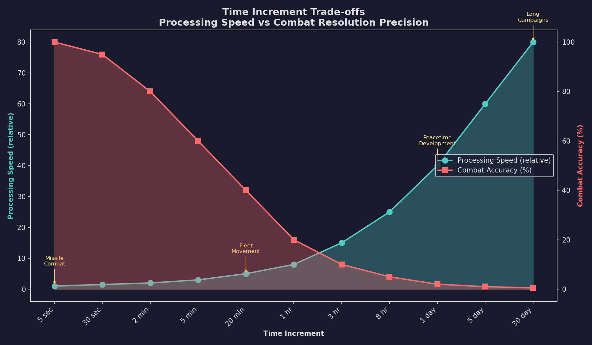

# 1.3 First Launch

*Updated: v2026.01.30*

> **[Screenshot Pending — #1060]** Main Window Overview with key UI elements labeled

## 1.3.1 Main Menu

*Updated: v2026.01.30*

When you launch Aurora, you are presented with the main game window. Unlike many games, Aurora does not have a traditional "main menu" screen. Instead, you are immediately in the game interface with access to all controls and windows.

On first launch with a fresh database, there will be no existing game data. The primary actions available are:

- **Create a New Game**: Use the **Game** menu at the top left of the main window, or the Game Setup toolbar button, to access game creation and set up a new galaxy with your race
- **Open Various Windows**: The toolbar and menus provide access to all game management windows even before a game is started (though most will be empty)
- **SpaceMaster Mode**: A toggle that gives you omniscient control over all races and systems — useful for learning, testing, or managing NPRs manually

**The Aurora Window**: The main window serves as the system map display and primary interface hub. From here you can access every other window in the game through the menu bar or toolbar buttons. The game does not use a tabbed interface like the old VB6 version — instead, each function opens in its own window, allowing you to arrange them however you prefer across your screen (multiple monitors are very helpful).

## 1.3.2 Saving and Loading

*Updated: v2026.01.30*

Aurora uses a manual save system. The game does not autosave, and unsaved progress is lost if you exit without saving.

**How Saving Works:**

- The game database (`AuroraDB.db`) stores all game state
- You must manually save using the **Save** button (disk icon) on the main toolbar \hyperlink{ref-1.3-launch-1}{[1]}
- The game will NOT remind you to save, and it does NOT autosave \hyperlink{ref-1.3-launch-2}{[2]}
- "C# does NOT save as you go. Nothing gets saved to the database until you click save" \hyperlink{ref-1.3-launch-3}{[3]}
- To maintain multiple save points, you can manually copy the database file
- A save reminder mod exists in the community for players who want automated reminders

> **Warning:** Save frequently. Aurora does not autosave \hyperlink{ref-1.3-launch-2}{[2]}. If the game crashes or you exit without saving, all progress since your last manual save is lost.

**Starting a New Game:**

1. From the menu bar, select **Game** > **Create New Game** (or use the Game Setup toolbar button)
2. This takes you through game setup (covered in detail in [Section 2.1 New Game Options](../2-game-setup/2.1-new-game-options.md))
3. Once created, the game is immediately active

**Switching Between Games:**
Aurora supports multiple games in the same database. If you have created multiple games (races), you can switch between them:
1. Use the race selection to change which race you are currently controlling
2. Each race has its own view of the galaxy, its own ships, colonies, and research

**Restoring a Backup:**

1. Close Aurora completely
2. Replace the current `AuroraDB.db` with your backup copy
3. Restart Aurora
4. The game will load in whatever state the backup represents

**Fresh Start:**
To start completely fresh (erasing all existing game data):
1. Close Aurora
2. Delete or rename the existing `AuroraDB.db`
3. The next launch will create a new empty database (or you can extract a fresh copy from the download RAR archive)

## 1.3.3 Quick Start Checklist

*Updated: v2026.01.30*

For players who want to get into a game as quickly as possible, here is the minimal path from installation to playing:

**Fastest Path to Playing:**

1. **Extract and Launch**: Extract Aurora to a folder, run `Aurora.exe`
2. **Create New Game**: Select **Game** > **Create New Game** from the menu bar
3. **Accept Defaults**: For your first game, the default settings are reasonable:
   - Use a Trans-Newtonian start (you begin with Trans-Newtonian technology, which "breaks the laws of Newton, giving you access to a wider technological tree") \hyperlink{ref-1.3-launch-4}{[4]}
   - Use Sol as your starting system (familiar reference point)
   - Default race settings are playable (Earth-like species)
4. **Open Key Windows**: Once your game is created, open these windows to get oriented:
   - **System Map**: Your primary view of the star system
   - **Economics**: Shows your colonies, production, and resources
   - **Fleet Window**: Where you manage ships and give movement orders
   - **Research**: Assign scientists to research projects (see [Section 7.1 Technology Tree](../7-research/7.1-technology-tree.md))
5. **Advance Time**: Use the time increment buttons to advance the game clock. Nothing happens until you advance time.

**Recommended First Steps in a New Game:**

1. **Survey Your System**: You should have a gravitational survey ship. Set it to survey the system — this reveals jump points to other stars.
2. **Start Research**: Open the Research window, assign your scientists to projects. Early priorities include propulsion (faster ships), construction (build faster), and sensors (see farther).
3. **Build Mines and Factories**: On the Economics window, queue up additional mines (see [Section 6.2 Mining](../6-economy-and-industry/6.2-mining.md)) and construction factories (see [Section 6.3 Construction](../6-economy-and-industry/6.3-construction.md)) to build things faster.
4. **Design a Ship**: Once you have some basic tech, open the Ship Design window (see [Section 8.1 Design Philosophy](../8-ship-design/8.1-design-philosophy.md)) and try creating a simple vessel — perhaps a fuel harvester or a second survey ship.
5. **Explore**: Once you find jump points, send ships through to discover new systems.

> **Tip:** Do not worry about optimizing your first game. Aurora has enormous depth, and your first game is for learning, not winning.

**SpaceMaster Mode:** Toggle SpaceMaster mode with Ctrl+S to enable, Ctrl+O to disable, or use the lightbulb icon on the toolbar \hyperlink{ref-1.3-launch-5}{[5]}. SpaceMaster "offers access to many world-building functions within the game itself" and lets you alter planets, teleport ships, and manipulate game state for learning purposes. Toggle it on to peek at how things work, then toggle it off to resume normal play.

> **Tip:** Pay attention to the Event Log -- it is how Aurora communicates with you about important events. Time increments matter: use short increments (5 seconds to 30 seconds) during combat, longer increments (days to months) during peacetime development \hyperlink{ref-1.3-launch-6}{[6]}. If nothing seems to be happening, you probably need to advance time further. Early game development takes in-game years.

## Related Sections

- [Section 2.1 New Game Options](../2-game-setup/2.1-new-game-options.md) -- Game creation settings
- [Section 3.1 Main Window](../3-user-interface/3.1-main-window.md) -- Interface overview and toolbar
- [Section 7.1 Technology Tree](../7-research/7.1-technology-tree.md) -- Research priorities and technology
- [Section 8.1 Design Philosophy](../8-ship-design/8.1-design-philosophy.md) -- Creating your first ship designs
- [Section 9.1 Shipyards](../9-fleet-management/9.1-shipyards.md) -- Ship construction and shipyard management
- [Section 17.1 Geological Survey](../17-exploration/17.1-geological-survey.md) -- Survey operations and exploration

## References

\hypertarget{ref-1.3-launch-1}{[1]}. Aurora Forums Full Installation Thread, "DON'T FORGET TO SAVE!! (Use the disk icon)." [aurora2.pentarch.org](https://aurora2.pentarch.org/index.php?topic=10635.0)

\hypertarget{ref-1.3-launch-2}{[2]}. AuroraWiki Tips for Beginners, "Currently there is no autosave function." [aurorawiki2.pentarch.org](https://aurorawiki2.pentarch.org/index.php?title=Tips_for_beginners)

\hypertarget{ref-1.3-launch-3}{[3]}. Aurora Forums Autosave Discussion, Moderator response. [aurora2.pentarch.org](https://aurora2.pentarch.org/index.php?topic=12239.0)

\hypertarget{ref-1.3-launch-4}{[4]}. AuroraWiki on Trans-Newtonian Start. [aurorawiki2.pentarch.org](https://aurorawiki2.pentarch.org/index.php?title=One_Newbie's_Guide_to_a_Conventional_Start)

\hypertarget{ref-1.3-launch-5}{[5]}. AuroraWiki C-SM Mode, "SM mode can be activated by selecting 'Spacemaster on' Ctrl+S (or 'Spacemaster off' Ctrl+O) from the main menu bar, or by the lightbulb on the upper right of the main screen." [aurorawiki2.pentarch.org](https://aurorawiki2.pentarch.org/index.php?title=C-SM_Mode)

\hypertarget{ref-1.3-launch-6}{[6]}. AuroraWiki, "Time, Turns and Interrupts" — "when you are under missile attack you will probably select 5 second increments"; "Early in a campaign when not much is happening you may be using 5-day or even 30-day increments." [aurorawiki2.pentarch.org](https://aurorawiki2.pentarch.org/index.php?title=5-day_increment)
