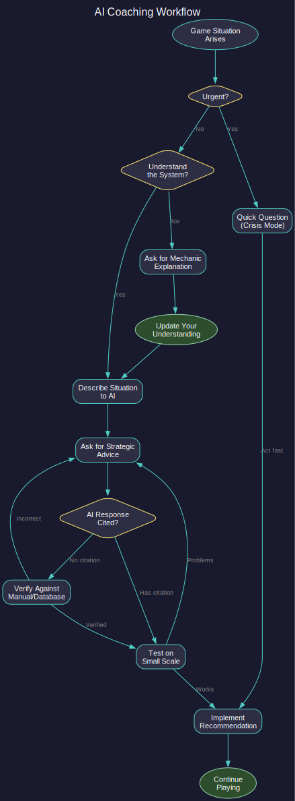

# 1.4 AI-Assisted Play

*Updated: v2026.02.01*

Aurora's depth creates a paradox: the comprehensive documentation needed to play well can itself become overwhelming. This section describes how to use AI assistants (Claude, ChatGPT, or similar) as a real-time coach, leveraging this manual as a verified knowledge base.

## 1.4.1 Why AI-Assisted Play Works for Aurora

*Updated: v2026.01.31*

Aurora is uniquely suited to AI assistance because:

- **Turn-based pacing**: You can pause indefinitely to consult your AI coach without time pressure
- **Database-driven mechanics**: Most game rules are deterministic formulas that can be precisely explained
- **Dense documentation**: This manual exists specifically to provide AI with verified, citation-backed information
- **Complex interdependencies**: AI excels at explaining how system A affects system B affects system C

AI assistance does not replace learning the game — it accelerates it by providing context-aware guidance when you need it.

## 1.4.2 Setting Up Your AI Coach

*Updated: v2026.02.01*

### 1.4.2.1 Providing Context

For best results, give the AI access to this manual. Options include:

- **Direct file access**: Tools like Claude Code can read the manual files directly
- **Repository reference**: Point the AI to the GitHub repository (github.com/ErikEvenson/aurora-manual)
- **Copy relevant sections**: Paste specific manual sections into your conversation when asking about those topics

### 1.4.2.2 Establishing Game State

Begin each session by telling the AI your current situation:

```
I'm playing Aurora C# v2.7.1 with a conventional start.
Current year: 2031
Population: 850 million on Earth
I have 400 construction factories and 200 mines.
I just researched my first engine technology.
```

The more context you provide, the more relevant the AI's guidance will be.

### 1.4.2.3 Direct Database Access

AI assistants with file system access (such as Claude Code) can query your game database directly. The Aurora database (`AuroraDB.db`) is a SQLite file containing all game mechanics, your current game state, and reference data.

**Location**: Typically in your Aurora installation folder (e.g., `~/Downloads/Aurora271Full/AuroraDB.db`)

**What AI can query directly**:

- **Reference tables** (`DIM_*`): Component stats, tech trees, installation costs, mineral requirements
- **Game state** (`FCT_*`): Your ships, colonies, populations, fleets, research progress
- **Tech system** (`FCT_TechSystem`): All technologies with costs, prerequisites, and effects

**Example prompts using database access**:

```
Query my game database and tell me:
- How many construction factories do I have on Earth?
- What technologies have I researched?
- What ships are in my fleet?
```

```
Look up the exact mineral cost for a Fuel Refinery
in DIM_PlanetaryInstallation and tell me what I need.
```

```
Query FCT_TechSystem for all engine technologies and
show me the research progression with costs.
```

**Advantages of direct database access**:

- **Real-time accuracy**: AI sees your actual game state, not your description of it
- **No transcription errors**: Values come directly from the database
- **Deep queries**: AI can correlate data across tables (e.g., "which of my ships are low on fuel?")
- **Verification**: AI can confirm manual claims against the actual game database

**Setup for Claude Code**:

```
My Aurora database is at: ~/Downloads/Aurora271Full/AuroraDB.db
You can query it with sqlite3. Use this for accurate game data.
```

**Example database query and output**:

When you ask "What are the mineral costs for a Fuel Refinery?", an AI with database access can run:

```sql
sqlite3 AuroraDB.db "SELECT Name, Cost, Duranium, Neutronium, Boronide
FROM DIM_PlanetaryInstallation WHERE Name='Fuel Refinery';"
```

Output:
```
Fuel Refinery|120.0|0.0|0.0|120.0
```

This shows directly from the database: 120 BP cost, 120 Boronide required, no Duranium or Neutronium. No ambiguity, no outdated wiki information.

This transforms AI from a coach working from your descriptions to an analyst with direct visibility into your game state.

## 1.4.3 Effective Prompting Patterns

*Updated: v2026.02.01*



The workflow above illustrates the decision process for AI-assisted play. The key insight: always verify AI responses against citations before committing to major decisions, but allow quick action in urgent situations.

### 1.4.3.1 Situation Assessment

When you're unsure what to focus on:

```
Given my game state [describe], what should my priorities be
for the next 5 years? Reference the manual for recommended
build orders or strategic guidance.
```

### 1.4.3.2 Problem Diagnosis

When something seems wrong:

```
My ships keep running out of fuel before reaching their
destination. What am I doing wrong? Cite relevant manual
sections about fuel consumption and ship design.
```

### 1.4.3.3 Decision Support

When facing a choice:

```
I can build either 50 more mines or 20 more construction
factories. Which is better for my current situation?
Explain the trade-offs using the manual's economy section.
```

### 1.4.3.4 Mechanic Explanation

When you need to understand a system:

```
Explain how maintenance facilities and [MSP](../appendices/B-glossary.md#msp) (Maintenance Supply Points) production work
in C# Aurora. I keep seeing "lack of MSP" warnings.
Cite the manual sections and any relevant database values.
```

### 1.4.3.5 UI Navigation

When you can't find something:

```
I need to design a ground force formation. Which window
do I open and what buttons do I click? Walk me through
the process step by step.
```

## 1.4.4 Session Patterns

*Updated: v2026.01.31*

### 1.4.4.1 Pre-Session Briefing

Before playing:

```
I'm about to start a new Aurora session. Last time I:
- Colonized my first moon
- Started building a shipyard
- Detected an NPR 3 jumps away

What should I focus on this session? What threats should
I be watching for?
```

### 1.4.4.2 Mid-Session Consultation

During play, keep the AI conversation open. Ask quick questions as situations arise:

- "An NPR fleet just appeared in my home system. What do I do?"
- "My colony is showing 40% unrest. How do I fix this?"
- "I need to design a missile. What are the key trade-offs?"

### 1.4.4.3 Post-Session Review

After playing:

```
I just finished a session where [describe what happened].
What did I do well? What mistakes did I make? What should
I read in the manual before my next session?
```

## 1.4.5 Verification Habits

*Updated: v2026.01.31*

AI assistants can make mistakes. Develop these verification habits:

### 1.4.5.1 Demand Citations

Always ask the AI to cite manual sections:

```
What is the formula for population growth?
Cite the specific manual section and reference number.
```

If the AI cannot cite a source, treat the answer as unverified.

### 1.4.5.2 Cross-Check Critical Values

For important numbers (costs, formulas, tech requirements), verify against:

- The manual's database references
- The in-game tooltips
- The actual game database if you're comfortable with SQLite queries

### 1.4.5.3 Distinguish VB6 from C#

Aurora C# differs significantly from the older VB6 version. If an AI response mentions mechanics that seem unfamiliar, ask:

```
Is this mechanic from VB6 Aurora or C# Aurora?
This manual covers C# only.
```

### 1.4.5.4 Test Before Committing

For strategic advice, test on a small scale before full commitment:

- Build one ship of a new design before queuing ten
- Try a tactic with a single fleet before your entire navy
- Save before major decisions so you can revert if needed

## 1.4.6 What AI Cannot Do

*Updated: v2026.01.31*

Understand the limitations:

- **No direct game access**: AI cannot see your game state unless you describe it
- **No real-time updates**: AI doesn't know what happened since you last described your situation
- **Potential hallucination**: AI may confidently state incorrect game mechanics — always verify critical information
- **No substitute for experience**: Reading about missile combat is not the same as fighting a missile duel

AI assistance accelerates learning but does not replace playing the game.

## 1.4.7 Example Coaching Session

*Updated: v2026.02.01*

The following illustrates a typical AI-assisted play session:

**Player**: I'm in year 2028, conventional start. I just finished researching Trans-Newtonian Technology. What do I do now?

**AI**: Congratulations — this unlocks the entire TN economy. Your immediate priorities:

1. **Convert Conventional Industry** to dedicated TN installations. Per Section 2.5.1, CI converts at 20 BP each (vs 120 BP to build new). Priority order:
   - Construction Factories (to build more installations faster)
   - Mines (to feed your construction)
   - Fuel Refineries (you'll need fuel for ships)

2. **Research propulsion** — you need engines before you can build useful ships. See Section 7.4 for the engine tech tree.

3. **Don't neglect maintenance** — per Section 14.2.3, Maintenance Facilities produce MSP at 20/year base rate. Build some early or your future fleet will deteriorate.

**Player**: How many construction factories should I aim for?

**AI**: There's no fixed answer, but community convention suggests:
- 400-800 for a comfortable pace
- 1000+ for aggressive expansion

Per Section 6.3, each CF produces 10 BP/year. With 500 CFs, you produce 5,000 BP/year — enough to build roughly 40 mines or a small warship annually.

**Player**: I converted 200 CI to construction factories. Now my mineral stockpiles are dropping fast. Is that normal?

**AI**: Yes — each conversion costs minerals (Section 2.5.1 table). Construction Factories cost 10 Duranium + 10 Neutronium per conversion. With 200 conversions, you spent 2,000 Duranium and 2,000 Neutronium.

Check your mineral stockpiles in the Economics window. If you're running low, prioritize converting some CI to Mines next, or pause conversions until stockpiles recover.

---

This coaching pattern — situation, guidance, follow-up, adjustment — represents how AI can serve as a knowledgeable companion throughout your Aurora journey.

### 1.4.7.2 Mid-Game Crisis: NPR Invasion

This example shows AI coaching during an urgent situation:

**Player**: HELP. An NPR fleet just jumped into my home system. 12 ships, I have 4 destroyers. What do I do RIGHT NOW?

**AI**: Don't panic. Immediate actions:

1. **Pause and assess** — Click the smallest time increment. How far are they from Earth? What are their ship classes?

2. **Check their stance** — Are they already hostile or just present? Look at the Diplomacy window. If they haven't fired, you may have time.

3. **If hostile and close:**
   - Set your destroyers to maximum military speed (burns fuel fast but you need distance)
   - Retreat toward Earth if you have PDCs, or away if you don't
   - DO NOT engage 4v12 unless they're clearly inferior tech

4. **If you have time (they're far out):**
   - Query database: What are your PDC defenses on Earth?
   - Can you rush-build missiles from ordnance factories?
   - Are there any other ships in nearby systems you can recall?

**Player**: They're 200 million km out, heading toward Earth at 2000 km/s. I have 2 [PDCs](../appendices/B-glossary.md#pdc) (Planetary Defence Centres) with lasers.

**AI**: You have roughly 28 hours game-time. That's workable.

1. **Don't intercept with your destroyers** — they'll die. Use them as scouts at maximum sensor range.

2. **Position destroyers to track the NPR fleet** — you need to know their exact approach vector.

3. **Your PDCs are your main defense.** Per Section 12.7, PDCs don't need fuel or maintenance. They'll fight until destroyed.

4. **Check your PDC designs** — what's their range? If the NPR has missiles and you only have beam PDCs, you need to consider evacuation planning.

**Player**: PDCs have 200k km range lasers. NPR ships look like they have missile launchers.

**AI**: That's a problem. Missile range typically exceeds 200k km. They may be able to stand off and bombard.

Options:
1. **Hope your PDCs survive long enough** — fortification level matters (Section 12.7.2). What's Earth's fortification?
2. **Evacuate critical personnel** — do you have any freighters? You might not save the colony but you can save commanders.
3. **Diplomatic Hail Mary** — try opening communications. Some NPRs will negotiate if you catch them before combat starts.

This is a survival situation. Learn from it for next game: always have mobile missile ships, not just beam PDCs.

---

Crisis coaching requires faster responses with less verification. The AI provides options and trade-offs rather than optimal solutions, because in Aurora, there often isn't one right answer — only choices with consequences.

## 1.4.8 How This Manual Prevents AI Hallucination

*Updated: v2026.01.31*

A common concern with AI-assisted learning is "hallucination" — AI confidently stating incorrect information. This manual is specifically designed to minimize this problem when used as an AI knowledge base.

### 1.4.8.1 Database-Verified References

Every factual claim in this manual includes a numbered reference linking to its source. The primary source is the Aurora game database itself (`AuroraDB.db`), with citations specifying exact table names, column names, and values:

```
Maintenance Facilities produce MSP at a base rate of 20 per year [3].

[3]. Aurora C# game database (AuroraDB.db v2.7.1) — FCT_TechSystem
     TechTypeID=209, AdditionalInfo=20.0, TechDescription="Annual
     production rate for a single maintenance facility"
```

When an AI cites this manual, it is citing database-verified facts, not forum posts, wiki summaries, or community folklore.

### 1.4.8.2 Explicit Uncertainty Marking

Claims that cannot be verified against authoritative sources are explicitly marked:

```
*(unverified — #837, requires live testing)*
```

This marking serves two purposes:
1. It warns human readers that the information needs verification
2. It signals to AI that this specific claim should be treated with lower confidence

When an AI encounters an unverified marker, it can appropriately caveat its response rather than presenting the information as established fact.

### 1.4.8.3 Structural Separation

The manual separates different types of content:

| Content Type | Indicator | AI Should Treat As |
|--------------|-----------|-------------------|
| Database-verified facts | `\hyperlink{ref-X.Y-N}{[N]}` citation | High confidence |
| Unverified claims | `*(unverified — #NNN)*` marker | Low confidence, recommend verification |
| Community recommendations | "Tip:" or "community convention" language | Opinion/guidance, not game mechanics |
| Editorial content | Explicitly labeled sections | Author perspective, not game facts |

This structure allows AI to distinguish between "the game works this way" (verifiable) and "players recommend doing this" (subjective).

### 1.4.8.4 Why This Matters

Traditional game documentation sources are problematic for AI:

- **Forum posts** mix accurate information with outdated advice, speculation, and version-specific mechanics
- **Wiki articles** may describe VB6 Aurora mechanics that no longer apply to C# Aurora
- **YouTube tutorials** become outdated as the game updates
- **AI training data** includes all of the above without distinguishing quality

This manual addresses these problems by:

1. **Version pinning**: All references cite the specific database version (currently v2.7.1)
2. **C# focus**: The manual explicitly covers only C# Aurora, eliminating VB6 confusion
3. **Active maintenance**: Unverified claims are tracked via GitHub issues and resolved over time
4. **Testable claims**: Database references can be independently verified by anyone with SQLite access

### 1.4.8.5 Demonstrated Reliability

The manual's anti-hallucination design has been tested against common misconceptions circulating in the Aurora community:

| Claimed "Hallucination" | Manual's Position | Verification |
|------------------------|-------------------|--------------|
| "MSP is produced by Construction Factories" | Section 14.2.3 states Maintenance Facilities produce MSP | Database: FCT_TechSystem TechTypeID=209 confirms "production rate for a single maintenance facility" |
| "Static units use old PDC logic" | Section 13.1.3.6 clearly distinguishes Static Weapons (ground units) from PDCs (Section 12.7, ship-like installations) | Architectural separation verified |

When challenged with "known AI hallucinations," the manual's database-backed citations provide definitive resolution.

### 1.4.8.6 Verification Workflow for AI Users

If you suspect an AI response based on this manual might be incorrect:

1. **Ask for the citation**: "Which manual section and reference number supports that claim?"
2. **Check the reference**: Look up the cited reference in the manual's References section
3. **Verify against the database**: If you have SQLite access, run the query yourself
4. **Check for unverified markers**: If the claim has `*(unverified)*`, treat it as provisional
5. **Report discrepancies**: File a GitHub issue if you find an error — the manual improves through community verification

This workflow transforms AI-assisted play from "trust the AI" to "trust but verify" — with verification made practical by the manual's citation infrastructure.

## 1.4.9 Frequently Asked Questions

*Updated: v2026.02.01*

### What if my AI can't access files?

Not all AI interfaces support file system access. Alternatives:

1. **Copy-paste relevant sections** — When asking about a specific topic, paste the relevant manual section into the conversation
2. **Link to the GitHub repository** — Some AI tools can fetch web content from github.com/ErikEvenson/aurora-manual
3. **Use the PDF** — Upload the manual PDF if your AI supports document uploads
4. **Summarize your question with context** — "According to the Aurora manual, maintenance facilities produce MSP. Can you explain how the production rate scales with technology?"

### How do I find my database path?

The Aurora database location depends on your installation:

| Platform | Typical Path |
|----------|--------------|
| Windows | `C:\Games\Aurora\AuroraDB.db` or wherever you extracted Aurora |
| macOS (via Wine/Crossover) | `~/Library/Application Support/CrossOver/Bottles/[bottle]/drive_c/Aurora/AuroraDB.db` |
| Linux (via Wine) | `~/.wine/drive_c/Aurora/AuroraDB.db` |

If you can't find it, search your system for `AuroraDB.db`. There should be only one file with this name.

### The AI gave me advice that seems wrong. What do I do?

1. **Ask for the citation** — "Which manual section supports that claim?"
2. **If no citation exists** — The AI may be drawing from general training data (forums, wikis) rather than this manual. Ask it to re-answer using only the manual.
3. **If the citation exists but seems wrong** — Check the manual's References section for that citation. The database query is listed there.
4. **If you find an actual error** — File a GitHub issue. The manual improves through community verification.

### Can AI help me cheat or exploit the game?

AI can explain any mechanic, including ones that might be considered exploitative. Whether to use that knowledge is your choice. Aurora is single-player (or cooperative multiplayer) — there's no competitive harm in optimizing your play. Many "exploits" are simply deep understanding of intended mechanics.

### How do I get AI to remember my game state across sessions?

Most AI conversations don't persist between sessions. Options:

1. **Keep a game journal** — Maintain a text file with your current state that you paste at the start of each AI session
2. **Use AI with memory features** — Some AI tools offer conversation memory or project context
3. **Rely on database queries** — If your AI can query `AuroraDB.db`, it can rediscover your game state each session

### The AI is hallucinating mechanics that don't exist. Why?

The AI may be:

1. **Confusing VB6 and C# Aurora** — Many mechanics changed between versions. Explicitly state "C# Aurora only"
2. **Drawing from forum speculation** — Ask it to cite manual sections, not general knowledge
3. **Inventing plausible-sounding mechanics** — Aurora is complex enough that fabricated mechanics can sound real. Always verify critical claims.

## 1.4.10 Community Contribution

*Updated: v2026.02.01*

This manual improves through community verification. You can help:

### Verifying Unverified Claims

Claims marked `*(unverified — #NNN)*` need testing. To help:

1. **Browse open issues** at github.com/ErikEvenson/aurora-manual/issues
2. **Filter by the `unverified` label** to see claims needing verification
3. **Test in-game** — Run the experiment described in the issue
4. **Report results** — Comment on the issue with your findings, including:
   - Aurora version tested
   - Steps you took
   - Results observed
   - Any database queries you ran

### Reporting Errors

If you find an error in the manual:

1. **Search existing issues** to avoid duplicates
2. **Create a new issue** with:
   - The section and line containing the error
   - What the manual claims
   - What the game actually does
   - How you verified (database query, in-game test, etc.)

### Contributing Content

The manual accepts contributions via GitHub pull requests. See the repository README for contribution guidelines. Priority areas:

- Screenshots of UI elements referenced in the manual
- Verification of `*(unverified)*` claims
- Corrections to outdated information after Aurora updates

Every verified claim makes AI-assisted play more reliable for all players.

## 1.4.11 Multiplayer Considerations

*Updated: v2026.02.01*

Aurora supports multiplayer via hotseat (players take turns at the same computer). AI coaching in multiplayer contexts requires additional considerations.

### Information Boundaries

In competitive multiplayer, each player should only access information about their own faction:

- **Don't query other players' data** — Even if the AI can access the full database, avoid queries that reveal opponent ship designs, fleet positions, or research progress
- **Faction-specific queries** — Filter database queries by your RaceID to see only your own data
- **Honor the fog of war** — If your sensors haven't detected something, don't ask the AI about it

Example faction-filtered query:
```sql
SELECT Name, Cost FROM FCT_ShipClass WHERE RaceID = [YourRaceID];
```

### Coaching Etiquette

In multiplayer games, agree on AI coaching rules upfront:

| Approach | Description |
|----------|-------------|
| No AI | Pure human play; AI assistance considered cheating |
| Mechanics only | AI can explain rules but not provide strategic advice |
| Full coaching | AI assistance permitted for all players equally |
| Asymmetric | New players may use AI; experienced players may not |

There's no "right" answer — multiplayer Aurora is about the experience you and your partners want.

### Turn Time Considerations

AI consultation takes time. In multiplayer:

- **Set turn time expectations** — Agree on reasonable turn lengths
- **Prepare questions in advance** — Think about what you'll ask during opponents' turns
- **Don't abuse pauses** — Extended AI consultation during your turn can frustrate other players

### Cooperative Multiplayer

In cooperative games (humans vs. NPRs), AI coaching benefits everyone:

- Share AI insights openly
- Use AI to coordinate strategy between factions
- Query the database together to plan joint operations

Cooperative Aurora with AI coaching can feel like having a shared advisor helping your alliance succeed.

## Related Sections

- [Section 1.1 What is Aurora](1.1-what-is-aurora.md) — Game overview and community resources
- [Section 2.1 New Game Options](../2-game-setup/2.1-new-game-options.md) — Starting a new game
- [Section 6.1 Economic Overview](../6-economy-and-industry/6.1-economic-overview.md) — Understanding the economy
