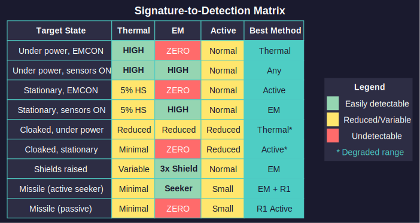

# 11 Sensors and Detection Overview

*Updated: v2026.01.30*

Aurora's sensor and detection systems form an intricate web of signatures, sensors, and countermeasures. Before diving into the detailed mechanics of each component, this overview provides a conceptual framework for understanding how detection works and how to design effective sensor suites.

## 11.0.1 Detection Workflow Summary

*Updated: v2026.01.30*

Detection in Aurora follows a predictable sequence that every commander should understand:

**Step 1: Target Generates Signatures**

Every ship and installation produces detectable signatures based on its current state:

- **Thermal Signature:** Generated by engines (proportional to current speed) and a baseline idle signature (5% of hull size in HS) \hyperlink{ref-11.0-1}{[1]}
- **EM Signature:** Generated by active sensors, shields, and ECM when those systems are powered on
- **Physical Cross-Section:** The ship's tonnage, detectable by active sensor sweeps regardless of emissions

**Step 2: Sensors Attempt Detection**

Your sensors compare their detection capability against the target's signatures:

- **Passive Thermal Sensors:** Detect thermal signatures without emitting anything
- **Passive EM Sensors:** Detect EM signatures without emitting anything
- **Active Sensors:** Emit energy to detect physical cross-sections, revealing your position

**Step 3: Resolution Matching**

Each sensor has a resolution setting (tonnage class it is optimized for). Detection range scales based on how the target's actual size/signature compares to the sensor's resolution:

- Target larger than resolution: Full detection range
- Target smaller than resolution: Reduced range proportional to size ratio

**Step 4: Contact Classification**

Once detected, contacts provide varying levels of information:

- Passive detection reveals signature strength and approximate location
- Active detection reveals tonnage class and precise location
- Repeated observations build intelligence over time: each beam weapon firing reveals weapon type, power, and count; each missile launch reveals launcher count and size (see [Section 11.1.4 Weapon Fire and Missile Launch Detection](11.1-thermal-em-signatures.md)). ELINT modules provide additional intelligence-gathering capability (see [Section 11.2.4 ELINT](11.2-passive-sensors.md))

## 11.0.2 Sensor Type Decision Tree

*Updated: v2026.01.30*

Use this decision tree when designing ships or choosing which sensors to activate:

```
What do you need to detect?
|
+-- Ships under power, possibly silent (EMCON)?
|   --> Thermal Sensors (passive, no emissions)
|   |
|   +-- Large warships at extreme range?
|       --> High resolution (100+ HS / 5000+ tons)
|   |
|   +-- Small craft or missiles?
|       --> Low resolution (1-6 HS / 50-300 tons)
|
+-- Ships using active sensors or shields?
|   --> EM Sensors (passive, no emissions)
|   |
|   +-- Detecting enemy sensor pickets?
|       --> Match resolution to expected scout size
|   |
|   +-- Detecting shielded capitals?
|       --> High resolution for maximum range
|
+-- Silent, stationary targets?
|   --> Active Sensors (emits EM, reveals your position)
|   |
|   +-- Need to remain stealthy?
|       --> Accept limited detection capability
|   |
|   +-- Combat or pursuit situation?
|       --> Activate active sensors, accept detection
|
+-- Missiles or fighters specifically?
    --> Resolution 1-6 sensors (thermal, EM, or active)
    --> Consider dedicated missile detection sensors
```

**Key Principle:** Passive sensors keep you hidden but only detect emitting targets. Active sensors find everything but announce your presence.

## 11.0.3 Signature-to-Detection Cross-Reference

*Updated: v2026.01.30*



This table shows which sensor types can detect each signature type and the tactical implications:

| Target State | Thermal Sig | EM Sig | Cross-Section | Best Detection Method |
|--------------|-------------|--------|---------------|----------------------|
| Under power, EMCON | High | Zero | Normal | Thermal sensor |
| Under power, sensors active | High | High | Normal | Any sensor type |
| Stationary, EMCON | Idle only (5% HS) | Zero | Normal | Active sensor |
| Stationary, sensors active | Idle only | High | Normal | EM sensor |
| Cloaked, under power, EMCON | Reduced | Reduced | Reduced | Thermal (degraded) |
| Cloaked, stationary | Minimal | Zero/Reduced | Reduced | Active (degraded) |
| ECM active | Variable | Present (jammer is electronic system) \hyperlink{ref-11.0-9}{[9]} | Normal | EM sensor |
| Shields raised | Variable | Very High (3x shield) \hyperlink{ref-11.0-2}{[2]} | Normal | EM sensor |
| Missile (active seeker) | Minimal | Seeker rating \hyperlink{ref-11.0-3}{[3]} | Small | EM sensor + Res-1 active |
| Missile (passive/semi-active) | Minimal | Zero | Small | Res-1 active sensor |

**Reading the Table:**

- "High" means easily detectable at long range with appropriate sensors
- "Reduced" means cloaking device reduces the signature by its percentage
- "Idle only" means the 5% of HS baseline -- very short detection range
- "Zero" means undetectable by that sensor type

## 11.0.4 Designing a Sensor Suite

*Updated: v2026.01.30*

A well-designed fleet requires sensors at multiple resolutions covering different detection modes:

**Minimum Viable Coverage:**

1. One thermal sensor (resolution matched to expected threats)
2. One EM sensor (resolution matched to expected threats)
3. One active sensor (for finding silent targets in combat)

**Comprehensive Fleet Coverage:**

| Sensor Role | Type | Resolution | Purpose |
|-------------|------|------------|---------|
| Fleet search | Active | 100-500 HS | Find capitals at extreme range |
| Escort detection | Active/Thermal | 10-50 HS | Detect destroyers and frigates |
| Missile warning | Active/Thermal | 1 HS | Detect incoming missiles |
| Picket detection | EM | 10-50 HS | Find enemy scouts using active sensors |
| Silent approach | Thermal | Various | Detect targets without emitting |

**Design Questions:**

1. **What threats do you expect?** Match resolution to enemy ship sizes
2. **Will you operate offensively or defensively?** Offense may accept active emissions; defense may prioritize stealth
3. **Single ship or fleet operations?** Fleets can distribute sensor roles across multiple hulls
4. **Dedicated sensor ships or distributed sensors?** Both approaches are viable in C# Aurora's area-based model

## 11.0.5 Sensor Technology Priorities

*Updated: v2026.01.30*

Research priorities depend on your strategic situation:

| Priority | Technology | Benefit |
|----------|------------|---------|
| High | Thermal Sensor Sensitivity | Longer passive detection range \hyperlink{ref-11.0-4}{[4]} |
| High | EM Sensor Sensitivity | Better detection of active emitters \hyperlink{ref-11.0-5}{[5]} |
| Medium | Active Sensor Strength | Longer active detection range \hyperlink{ref-11.0-6}{[6]} |
| Medium | Cloaking Sensor Reduction | Better stealth if pursuing that doctrine \hyperlink{ref-11.0-7}{[7]} |
| Lower | Active Sensor Sensitivity | Marginal range improvements |

**C# Aurora Note:** The area-based sensor model means extreme-range detection is harder to achieve than in VB6 Aurora. Multiple smaller sensors distributed across scouts are now strategically equivalent to monolithic sensor installations, so technology investments should consider fleet composition. \hyperlink{ref-11.0-8}{[8]}

## Chapter Contents

*Updated: v2026.01.30*

- [Section 11.1 Thermal and EM Signatures](11.1-thermal-em-signatures.md) -- How ships generate detectable emissions
- [Section 11.2 Passive Sensors](11.2-passive-sensors.md) -- Thermal and EM sensor mechanics
- [Section 11.3 Active Sensors](11.3-active-sensors.md) -- Active sensor detection and fire control
- [Section 11.4 Stealth](11.4-stealth.md) -- Cloaking, EMCON, and stealth tactics

## Related Sections

- [Section 8.4 Sensors](../8-ship-design/8.4-sensors.md) -- Sensor component design in ship designer
- [Section 12.1 Fire Controls](../12-combat/12.1-fire-controls.md) -- Using active sensors as missile fire controls
- [Section 12.5 Electronic Warfare](../12-combat/12.5-electronic-warfare.md) -- ECM effects on sensor range
- [Appendix A: Formulas](../appendices/A-formulas.md) -- Detection range calculation formulas

## References

\hypertarget{ref-11.0-1}{[1]}. Aurora C# game mechanics -- Idle thermal signature equals 5% of hull size in HS. A 200 HS (10,000-ton) ship produces idle thermal of 10. Confirmed via consistent community documentation and [Appendix A](../appendices/A-formulas.md).

\hypertarget{ref-11.0-2}{[2]}. Aurora C# game database (AuroraDB.db v2.7.1) -- Shield\_EM\_Signature = Shield\_Strength x 3. See FCT\_TechSystem TechTypeID=16 for shield strength values. Cross-referenced with [Appendix A ref-A-5](../appendices/A-formulas.md).

\hypertarget{ref-11.0-3}{[3]}. Aurora C# game mechanics -- Active homing missiles emit EM signature equal to their onboard sensor's rating, making them detectable by EM sensors. *(Forum-documented; not directly in database tables.)*

\hypertarget{ref-11.0-4}{[4]}. Aurora C# game database (AuroraDB.db v2.7.1) -- FCT\_TechSystem TechTypeID=19 (Thermal Sensor Sensitivity): 12 levels from 5 (1,000 RP) through 75 (2,000,000 RP).

\hypertarget{ref-11.0-5}{[5]}. Aurora C# game database (AuroraDB.db v2.7.1) -- FCT\_TechSystem TechTypeID=125 (EM Sensor Sensitivity): 12 levels from 5 (1,000 RP) through 75 (2,000,000 RP). Identical progression to thermal sensitivity.

\hypertarget{ref-11.0-6}{[6]}. Aurora C# game database (AuroraDB.db v2.7.1) -- FCT\_TechSystem TechTypeID=20 (Active Grav Sensor Strength): 12 levels from 10 (1,000 RP) through 180 (2,000,000 RP), plus Conventional strength 2 (500 RP).

\hypertarget{ref-11.0-7}{[7]}. Aurora C# game database (AuroraDB.db v2.7.1) -- FCT\_TechSystem TechTypeID=154 (Cloak Sensor Reduction): 10 levels from 75% (4,000 RP) through 99.5% (2,000,000 RP).

\hypertarget{ref-11.0-8}{[8]}. Aurora Forums, "Sensor Model for C# Aurora" -- Steve Walmsley described the area-based sensor model replacing VB6's linear model. The sqrt-based formula creates diminishing returns for larger sensors. [aurora2.pentarch.org](https://aurora2.pentarch.org/index.php?topic=9465.0)

\hypertarget{ref-11.0-9}{[9]}. Aurora C# game database (AuroraDB.db v2.7.1) -- Sensor Jammers and Missile Jammers are ElectronicSystem=1 in FCT\_ShipDesignComponents (ComponentTypeID=20). Both types are 3 HS in size with ComponentValue equal to the jammer level. As electronic systems, they contribute to EM signature when active, but the exact EM output value is not stored in the database. *(Exact EM contribution unverified -- jammer EM output formula not directly represented in the database.)*
