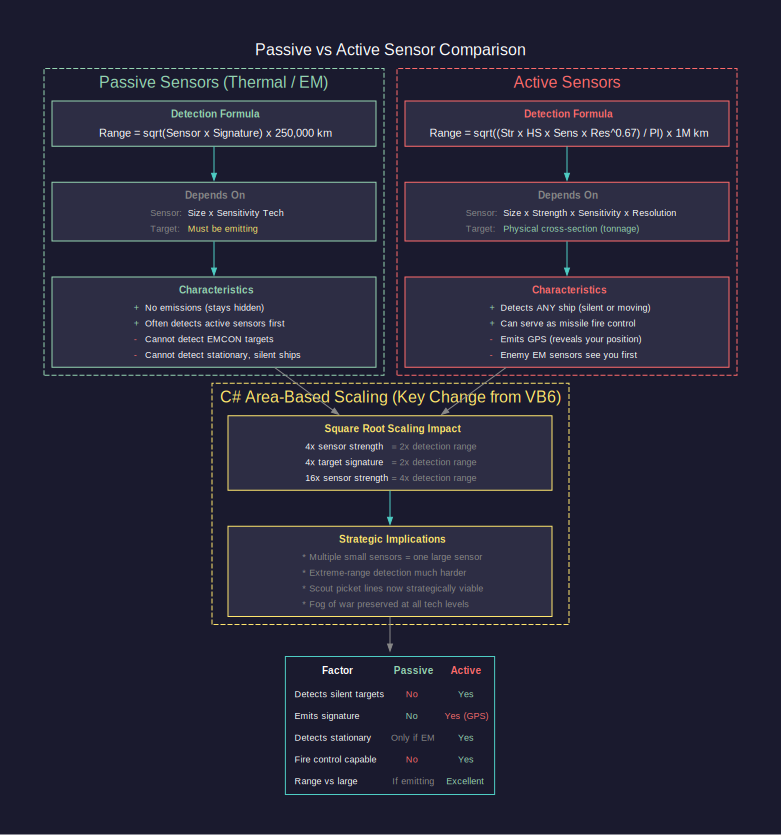
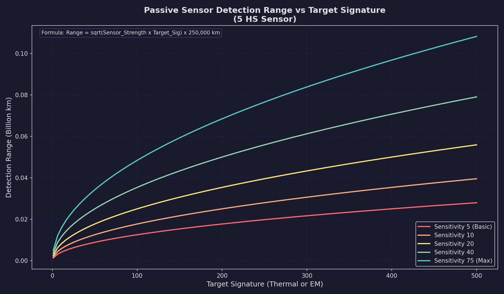

# 11.2 Passive Sensors

*Updated: v2026.01.30*


Passive sensors detect the emissions produced by other ships and installations without emitting any energy themselves. This makes them the foundation of stealthy operations: a ship using only passive sensors is invisible to EM detection (at least from its sensors). Aurora features two types of passive sensors -- thermal sensors that detect engine heat, and EM sensors that detect electromagnetic emissions from active systems.

**C# Passive Sensor Model Changes**

The C# passive sensor model was redesigned from the VB6 version to substantially improve small passive sensors (particularly against small signatures) while dramatically reducing the benefits of creating large numbers of deep space tracking stations. Similar to the active sensor overhaul, the passive model shifts from linear scaling to area-based detection with diminishing returns for larger sensor arrays. This means multiple smaller scout ships with modest sensors are now strategically equivalent to monolithic sensor installations, fundamentally changing fleet detection doctrine.



## 11.2.1 Thermal Detection

*Updated: v2026.01.30*


Thermal sensors detect the heat signatures produced by ship engines. They are the primary means of locating ships that are under power but maintaining emission control.

**How Thermal Sensors Work**

A thermal sensor passively monitors for infrared and heat emissions in its vicinity. It does not emit anything itself, so it adds nothing to the detecting ship's signature. The detection range depends on three factors:

1. The sensitivity of the sensor (determined by its size and technology level)
2. The thermal signature of the target
3. The sensor's resolution matching the target's tonnage class

**Detection Range Formula**

The C# passive sensor model uses a square-root formula that creates diminishing returns for larger sensors:

```
Detection Range (km) = SQRT(Passive Sensor Strength * Target Signature) * 250,000
```
\hyperlink{ref-11.2-1}{[1]}

Where:

- **Passive Sensor Strength** = Sensor Size (HS) * Thermal Sensor Sensitivity tech level \hyperlink{ref-11.2-2}{[2]}
- **Target Signature** is the current thermal output of the target

This formula differs significantly from VB6's linear calculation (`Sensor Strength * Target Signature * 1,000 km`). The square root means that quadrupling sensor strength only doubles detection range, making multiple smaller sensors distributed across scouts strategically equivalent to a single massive sensor installation. \hyperlink{ref-11.2-3}{[3]}



The sensor range displayed in the component design window represents the range at which the sensor can detect a target with a signature matching the sensor's rated resolution (in HS).

**Impact of the Area-Based Formula**

The shift to an area-based formula has several important consequences:

- A 200 HS sensor provides notably less range advantage than five 40 HS sensors distributed across multiple ships
- Extreme-range detection is substantially reduced compared to VB6 Aurora
- Multi-ship picket lines are now strategically equivalent to monolithic detection vessels
- The fog of war is preserved even at high technology levels
- Small ships with modest sensors remain viable detection platforms

**Idle Signature Detection**

Since ships in C# Aurora always have a non-zero thermal signature (5% of HS when idle), passive thermal sensors can detect stationary ships. However, the idle signature is small enough that only large alien warships are detectable at meaningful ranges when stationary. For example, a 10,000-ton (200 HS) idle ship has a thermal signature of only 10, dramatically limiting passive detection range.

**Sensor Design Parameters**

When designing a thermal sensor in the Component Design window (see [Section 8.4 Sensors](../8-ship-design/8.4-sensors.md)), you set:

- **Sensor Size (HS):** Larger sensors have better range but take more hull space. Sizes range from 0.1 HS to 50 HS. \hyperlink{ref-11.2-4}{[4]}
- **Resolution (tons):** The tonnage class the sensor is optimized for. Standard options range from 50 tons to 25,000 tons, in increments. \hyperlink{ref-11.2-5}{[5]}
- **Technology Level:** The Thermal Sensor Sensitivity tech determines the base capability.

The sensor's rated detection range is:

```
Base Range = Size (HS) * Thermal Sensor Sensitivity * Resolution Modifier
```

> **Note:** This simplified linear formula approximates the component design window display. The actual detection calculation uses the area-based SQRT formula shown in [Section 11.2.1 Thermal Detection](#1121-thermal-detection) above, where the 250,000 km multiplier already incorporates the division by PI (unlike the active sensor full formula in [Section 11.3](11.3-active-sensors.md) which shows PI explicitly with a 1,000,000 km multiplier). The linear formula is useful for quick estimation, while the SQRT formula governs actual in-game detection ranges.

**Resolution and Range Scaling**

A thermal sensor's resolution determines what size of target it can detect most efficiently. When a target's tonnage differs from the sensor's resolution:

- If the target is **larger** than the resolution, detection range increases (you are looking for a bigger heat source than your minimum threshold)
- If the target is **smaller** than the resolution, detection range decreases proportionally

For passive sensors, the detection range depends on the target's actual thermal signature rather than its tonnage. Since thermal signature is generated by engines (and a 5% idle floor), the scaling is driven by engine output rather than hull size. A ship with larger engines has a higher thermal signature and is detected at longer range.

The practical effect is that a sensor with resolution 5,000 tons will detect a ship with double the expected thermal signature at approximately 1.41x its rated range (sqrt of 2), while a ship with only 20% of the expected signature is detected at only about 0.45x its rated range (sqrt of 0.2).

**Important:** In C# Aurora, all ships have a non-zero idle thermal signature (5% of HS), so thermal sensors can theoretically detect any ship. However, the idle signature is so small that practical detection ranges against stationary ships are extremely short unless using very large or technologically advanced sensors. Thermal detection remains primarily useful against ships with active movement orders.

**Practical Tips**

- Mount at least one thermal sensor on every warship -- it provides detection capability with zero EM cost
- Higher resolution sensors (set to larger tonnage) have longer absolute ranges but may miss small targets like missiles or FACs
- Lower resolution sensors (set to small tonnage like 50-100 tons) are essential for detecting missiles and small craft
- Multiple thermal sensors on one ship do not stack; only the best detection result counts for each contact *(community-documented -- the area-based sensor model processes each sensor independently and uses the best range result; this is consistent with the sqrt-based formula where combining sensor values would not match game behavior)*
- Thermal sensors on different ships in a task group share their detections with the entire group *(community-documented -- task group sensor sharing is a core game mechanic confirmed in Aurora Forums sensor model discussions)*

## 11.2.2 EM Detection

*Updated: v2026.01.30*


EM sensors detect the electromagnetic emissions from active sensors, shields, and other electronic systems. They are the other half of the passive detection picture and are essential for locating ships that are actively scanning.

**How EM Sensors Work**

An EM sensor monitors for radio-frequency, microwave, and other electromagnetic emissions. Like thermal sensors, EM sensors are completely passive and add nothing to your own ship's signature. They detect the EM signature of targets as described in [Section 11.1.2 EM Signature](11.1-thermal-em-signatures.md#1112-em-signature).

**Detection Range Formula**

The detection range for an EM sensor follows the same mathematical structure as thermal sensors:

```
Detection Range (km) = SQRT(Passive Sensor Strength * Target EM Signature) * 250,000
```
\hyperlink{ref-11.2-6}{[6]}

Where Passive Sensor Strength = Sensor Size (HS) * EM Sensor Sensitivity tech level \hyperlink{ref-11.2-7}{[7]}. The key difference from thermal sensors is that EM signature comes from active systems (sensors, shields) rather than engines. A target that is running under EMCON with all active systems off has an EM signature of zero and cannot be detected by EM sensors, regardless of their power.

**Sensor Design Parameters**

EM sensor design mirrors thermal sensor design:

- **Sensor Size (HS):** Larger = better range, more hull space
- **Resolution (tons):** Optimized detection tonnage class
- **Technology Level:** The EM Sensor Sensitivity tech determines base capability

**When EM Sensors Are Most Useful**

EM sensors excel in specific scenarios:

1. **Detecting active scanners:** Any ship using active sensors is broadcasting its position. Your EM sensors will typically detect these ships at greater range than the active sensor itself can see, giving you an intelligence advantage. \hyperlink{ref-11.2-8}{[8]}
2. **Detecting shielded ships:** Ships with active shields produce EM equal to three times their shield strength (see [Section 11.1.2 EM Signature](11.1-thermal-em-signatures.md#1112-em-signature)) \hyperlink{ref-11.2-13}{[13]}.
3. **Locating sensor pickets:** The enemy's forward scouts using active sensors are your EM sensors' primary prey.
4. **Missile detection:** Active homing missiles emit from their onboard sensors and can be detected by EM sensors.

**EM vs. Thermal: When Each Matters**

| Situation | Thermal | EM |
|-----------|---------|-----|
| Target under power, EMCON | Detectable | Not detectable |
| Target stationary, sensors active | Barely detectable (idle signature) | Detectable |
| Target under power, sensors active | Detectable | Detectable |
| Target stationary, EMCON | Barely detectable (idle signature) | Not detectable |

**Practical Tips**

- An EM sensor will often detect an enemy's active sensor at greater range than that active sensor can detect you -- this is a fundamental asymmetry that favors passive play
- Pair EM sensors with thermal sensors on every scout ship for complete passive coverage
- EM sensors are critical for detecting cloaked ships that use active sensors (the cloak reduces but does not eliminate EM signature)
- In fleet battles, your EM sensors may provide the first warning of incoming active-homing missiles

## 11.2.3 Sensor Resolution

*Updated: v2026.01.30*


Resolution is one of the most important and commonly misunderstood aspects of Aurora's sensor system. It determines the size of target your sensor is optimized to detect and directly affects detection ranges against targets of different sizes.

**How Resolution Works**

Every sensor (thermal, EM, or active) has a resolution setting expressed in tons. This represents the smallest target the sensor is designed to detect at its rated range. The resolution is set during component design and cannot be changed after manufacturing.

Standard resolution options in Aurora C# range from 1 HS (50 tons) to 500 HS (25,000 tons), though the exact increments available depend on the game version. Common resolution values include \hyperlink{ref-11.2-5}{[5]}:

| Resolution (HS) | Resolution (tons) | Typical Use |
|-----------------|-------------------|-------------|
| 1 | 50 | Missile detection |
| 2 | 100 | Fighter/FAC detection |
| 4 | 200 | Small craft |
| 6 | 300 | Corvettes |
| 10 | 500 | Frigates |
| 20 | 1,000 | Destroyers |
| 50 | 2,500 | Light cruisers |
| 100 | 5,000 | Cruisers |
| 200 | 10,000 | Battlecruisers |
| 320 | 16,000 | Battleships |
| 500 | 25,000 | Large warships |

**The Resolution Trade-Off**

Higher resolution (larger tonnage) sensors have longer absolute detection ranges because the detection formula includes resolution as a multiplier. However, they suffer severe penalties when trying to detect targets smaller than their resolution.

Lower resolution sensors have shorter absolute ranges but can detect smaller targets. A resolution-1 sensor designed for missile detection will detect a missile at its rated range, but its rated range is much shorter than a resolution-500 sensor looking for battleships.

**Key Rules:**

1. A sensor can always detect a target larger than its resolution. The range increases proportionally.
2. A sensor can detect targets smaller than its resolution, but at reduced range scaling by the size ratio.
3. The most important decision is matching sensor resolution to the threats you expect to face.

**Resolution and Tonnage Matching**

When a target's tonnage matches the sensor resolution exactly, the sensor operates at its full rated range. The detection range scales as:

```
Effective Range = Rated Range * (Target Actual Size / Sensor Resolution)
```
\hyperlink{ref-11.2-9}{[9]}

For passive sensors, the target's signature further modifies this:

```
Final Range = Effective Range * sqrt(Target Signature / Expected Signature for that tonnage)
```
\hyperlink{ref-11.2-10}{[10]}

**Fleet Sensor Coverage**

A well-designed fleet typically includes sensors at multiple resolutions:

- **Resolution 1-2 (50-100 tons):** Dedicated missile/fighter detection sensors (see [Section 12.4 Point Defense](../12-combat/12.4-point-defense.md)), often on specialized picket ships or the main fleet flagship
- **Resolution 10-20 (500-1,000 tons):** General-purpose sensors for detecting escorts and destroyers
- **Resolution 100+ (5,000+ tons):** Long-range search sensors for finding capital ships at maximum distance

**Practical Tips**

- Do not design all your sensors at the same resolution; you need a spread of resolutions to cover different threat types
- Missile detection requires resolution 1 sensors -- without them, you may not see incoming missiles until they are very close
- A single large ship with multiple resolution sensors can serve as an effective sensor platform for an entire fleet
- Remember that resolution affects both passive and active sensors identically in terms of the size-matching calculation
- Survey ships exploring unknown space should carry high-resolution sensors (looking for large unknowns at maximum range) paired with low-resolution sensors (for spotting small, fast scouts)

## 11.2.4 Electronic Intelligence (ELINT) Gathering

*Updated: v2026.01.30*


ELINT represents a dedicated intelligence-gathering system in C# Aurora that uses specialized ship components to monitor alien populations and active sensors. ELINT modules function as secondary EM sensors but serve primarily for intelligence collection rather than detection.

**ELINT Module Specifications**

| Parameter | Value |
|-----------|-------|
| Size | 10 Hull Spaces |
| Crew | 15 personnel |
| Cost | 20x strength value |
| Strength Progression | Follows EM Sensor technology advancement \hyperlink{ref-11.2-11}{[11]} |
| Prerequisite | Corresponding EM Sensor technology level |

**Intelligence Gathering Rate**

Intelligence accumulates at a base rate of 1 intelligence point per day *(unverified — [#720](https://github.com/ErikEvenson/aurora-manual/issues/720) -- base collection rate documented in community sources)*. This rate is modified by:

- **Commander Bonus:** The ELINT ship commander's Intelligence bonus multiplies the collection rate
- **Xenophobia Modifier (populations only):** Rate is multiplied by (100 - Population Species Xenophobia) / 100, making high-xenophobia targets significantly harder to monitor *(unverified — [#720](https://github.com/ErikEvenson/aurora-manual/issues/720) -- xenophobia modifier formula documented in community sources)*
- **Language Barrier:** Without translation of the alien language, all intelligence is reduced by 80% *(unverified — [#720](https://github.com/ErikEvenson/aurora-manual/issues/720) -- 80% reduction documented in community sources)*

**Target Requirements:** The target must be detectable by the ELINT module's built-in EM sensors to enable intelligence collection.

**Intelligence Thresholds**

Intelligence accumulation triggers progressive information disclosure at the following thresholds:

| Points | Information Revealed (Ship Contacts) | Information Revealed (Populations) |
|--------|--------------------------------------|-----------------------------------|
| 100 | Alien sensor range and resolution (previously only strength displayed) | Population size in millions and installation count |
| 200 | -- | Factory and mine counts; spaceport/cargo shuttle station status |
| 300 | -- | Refinery and maintenance facility counts; refueling/ordnance station status |
| 500 | -- | Research facility counts; naval headquarters/sector command presence |

**Intelligence Decay**

Intelligence points for a specific population reduce at approximately 25% per year if ELINT monitoring ends. *(unverified — [#720](https://github.com/ErikEvenson/aurora-manual/issues/720) -- decay rate documented in community sources)* Historical information obtained at peak intelligence levels remains accessible but is displayed in red when viewing alien populations on the Diplomacy window, while current data appears in green.

**Racial Intelligence Integration**

Population-level intelligence converts to racial intelligence points at a 1:1 ratio. For populations under 100 million, this conversion is modified by (Population in millions / 100). At 100 accumulated racial intelligence points, automated espionage checks occur, potentially yielding:

- New technologies
- Survey data
- Ship class details
- Sensor information

**ELINT Design Considerations**

- ELINT ships should be designed with good EM sensors to detect targets at range
- A commander with high Intelligence bonus dramatically improves collection rate
- Language research should be prioritized for maximum intelligence yield
- ELINT ships monitoring hostile populations should be prepared for xenophobic responses
- Multiple ELINT ships can monitor the same target to increase overall collection

## 11.2.5 Group Contacts and Lost Contacts

*Updated: v2026.01.30*


The tactical map provides two important contact management features that affect how passive (and active) sensor contacts are displayed and tracked.

**Group Contacts**

When the Group Contacts checkbox is activated on the Tactical Map sidebar, contacts sharing identical characteristics are consolidated into a single display entry. Contacts are grouped when they share:

- The same alien ship type
- The same current coordinates
- The same coordinates from the previous increment
- The same active sensor emissions
- The same contact status

Grouped contacts display a numerical prefix indicating the quantity of ships in that group, rather than individual designations (001, 002, etc.). Single contacts at a location bypass grouping and display normally without a prefix.

This feature reduces visual clutter when monitoring large formations of identical hostile or neutral vessels.

**Lost Contacts**

The Lost Contacts feature allows players to view ship contacts that are no longer currently detected but were observed within a specified timeframe.

Players can activate either a "Lost Contacts 1 Month" or "Lost Contacts 1 Year" checkbox on the tactical map. If both are enabled, the one-year window takes priority. When active, the tactical map displays any ship contacts less than one month (or one year) old, rather than only current contacts.

**Contact Status Indicators:**

- **[LOST]:** A contact visible only through the lost contacts feature, with no current detection
- **[PARTIAL]:** A contact combining both current sensor readings and older contact information

The Lost Contacts system works with layered sensor data. For example, you may be currently tracking an alien ship by its thermal emissions only, but you had an active contact a week ago. When Lost Contacts is active, you will see both the current thermal contact combined with the older active contact data, providing a more complete picture.

Lost Contacts can be paired with Group Contacts, allowing players to simultaneously organize contacts into groups while viewing historical contact data across the specified timeframe.

## 11.2.6 Wreck Detection and Monitoring

*Updated: v2026.01.26*


Passive sensor infrastructure enables detection of combat events and salvage operations in monitored systems, providing strategic intelligence without requiring active engagement.

**Wreck Detection Events:**

When a ship belonging to another faction is destroyed in the same system as either a ship or deep space tracking station of your race, an event notification is generated. This alerts your faction to combat occurring in nearby space, even if you are not directly involved.

**Alien Salvage Events:**

An "Alien Salvage" event is generated when a detected wreck disappears from a monitored system without being salvaged by your own forces. This indicates that another faction has recovered the destroyed vessel's remains, providing intelligence about rival salvage operations and resource recovery capabilities.

**Detection Requirements:**

Both event types require the presence of at least one of:

- An active ship belonging to your race in the system
- A deep space tracking station in the system

**Deep Space Tracking Stations:** These are ground-based installations that provide passive sensor coverage for an entire system. They are built via construction factories on any colony (see [Section 5.4 Infrastructure](../5-colonies/5.4-infrastructure.md) for construction details). Each station has a base sensor rating of 250 (upgradeable via research through the Planetary Sensor Strength technology line) \hyperlink{ref-11.2-12}{[12]} and detects vessels using the same passive sensor mechanics as ship-mounted sensors. DSTs are essential for monitoring systems where you cannot maintain a permanent ship presence.

> **Note:** An earlier version of this section stated the DSTT base sensor rating was 200. The correct starting value is 250, as confirmed by the game database.

Without either of these assets present, wreck creation and disappearance events pass unnoticed.

**Strategic Applications:**

- Monitor contested systems for signs of third-party conflict by maintaining sensor pickets or tracking stations
- Track which races are conducting salvage operations and where
- Detect combat between NPR factions that may affect your strategic situation
- Identify opportunities to salvage wrecks before rival factions reach them

**Integration with Other Systems:**

Wreck detection events feed into the broader intelligence picture:

- Combined with ELINT data ([Section 11.2.4 Electronic Intelligence (ELINT) Gathering](#1124-electronic-intelligence-elint-gathering)), they help build a comprehensive view of alien military activity
- Deep space tracking stations serve dual purposes: providing sensor coverage and enabling wreck monitoring
- Events are logged in the standard event system and can be filtered using event colour configurations

## Related Sections

- [Section 8.4 Sensors](../8-ship-design/8.4-sensors.md) -- Sensor component design and sizing
- [Section 11.1 Thermal/EM Signatures](11.1-thermal-em-signatures.md) -- How targets generate detectable signatures
- [Section 11.3 Active Sensors](11.3-active-sensors.md) -- Active sensor detection mechanics
- [Section 11.4 Stealth](11.4-stealth.md) -- Countering passive sensor detection
- [Section 16.2 Skills and Bonuses](../16-commanders/16.2-skills-and-bonuses.md) -- Commander intelligence bonuses for ELINT
- [Appendix A: Formulas](../appendices/A-formulas.md) -- Detection range formulas

## References

\hypertarget{ref-11.2-1}{[1]}. Aurora Wiki, "Thermal Sensor" and [Appendix A ref-A-12](../appendices/A-formulas.md) -- C# passive sensor formula: Detection\_Range (km) = sqrt(Sensor\_Sensitivity x Target\_Signature) x 250,000. The 250,000 km multiplier is specific to C# Aurora.

\hypertarget{ref-11.2-2}{[2]}. Aurora C# game database (AuroraDB.db v2.7.1) -- FCT\_TechSystem TechTypeID=19 (Thermal Sensor Sensitivity): 12 levels from 5 (1,000 RP) through 75 (2,000,000 RP). Verified that ComponentValue in FCT\_ShipDesignComponents equals Size x Sensitivity for thermal sensors (e.g., TH6-48: 6 x 8 = 48).

\hypertarget{ref-11.2-3}{[3]}. Aurora Forums, "Sensor Model for C# Aurora" -- Steve Walmsley confirmed the area-based (sqrt) sensor model replacing VB6's linear model. Quadrupling strength doubles range: sqrt(4S) = 2 x sqrt(S). [aurora2.pentarch.org](https://aurora2.pentarch.org/index.php?topic=9465.0)

\hypertarget{ref-11.2-4}{[4]}. Aurora C# game database (AuroraDB.db v2.7.1) -- FCT\_ShipDesignComponents confirms sensor sizes from 0.1 HS to 50 HS for thermal, EM, and active sensors.

\hypertarget{ref-11.2-5}{[5]}. Aurora C# game database (AuroraDB.db v2.7.1) -- FCT\_ShipDesignComponents confirms resolution values from 1 HS (50 tons) through 500 HS (25,000 tons) for sensor components.

\hypertarget{ref-11.2-6}{[6]}. Aurora Wiki and [Appendix A ref-A-12](../appendices/A-formulas.md) -- EM passive sensor formula uses the same structure as thermal: Detection\_Range (km) = sqrt(Sensor\_Sensitivity x Target\_EM\_Signature) x 250,000. **Correction:** The original formula in this section used a different notation (Sensor Rating x sqrt(Target EM / Reference)) which was replaced with the standard form consistent with [Appendix A](../appendices/A-formulas.md).

\hypertarget{ref-11.2-7}{[7]}. Aurora C# game database (AuroraDB.db v2.7.1) -- FCT\_TechSystem TechTypeID=125 (EM Sensor Sensitivity): 12 levels from 5 (1,000 RP) through 75 (2,000,000 RP). Identical progression to thermal sensitivity (TechTypeID=19).

\hypertarget{ref-11.2-8}{[8]}. Aurora C# game mechanics -- An active sensor's GPS (EM output) is typically much larger than the active sensor's own detection capability against the EM-listening ship, creating a fundamental advantage for passive EM detection. Documented in Aurora Forums sensor model discussion.

\hypertarget{ref-11.2-9}{[9]}. Aurora C# game mechanics -- For active sensors, detection range scales proportionally with target size vs. resolution. For passive sensors, the scaling is based on signature rather than physical size. Cross-referenced with [Appendix A](../appendices/A-formulas.md).

\hypertarget{ref-11.2-10}{[10]}. Aurora C# game mechanics -- Passive sensor final range adjustment uses sqrt(actual\_signature / expected\_signature). This produces the 1.41x range for double expected signature and 0.45x for 20% expected signature cited in the text: sqrt(2) = 1.414, sqrt(0.2) = 0.447.

\hypertarget{ref-11.2-11}{[11]}. Aurora C# game database (AuroraDB.db v2.7.1) -- FCT\_TechSystem TechTypeID=242 (Electronic Intelligence and Analysis Module): 5 levels from Strength 5 (2,000 RP) through Strength 14 (30,000 RP). Strength values mirror the first five levels of EM Sensor Sensitivity (TechTypeID=125).

\hypertarget{ref-11.2-12}{[12]}. Aurora C# game database (AuroraDB.db v2.7.1) -- DIM\_PlanetaryInstallation PlanetaryInstallationID=11 (Deep Space Tracking Station): SensorValue=1.0. FCT\_TechSystem TechTypeID=28 (Planetary Sensor Strength): starting tech is 250 (1,000 RP), upgradeable through 12 levels to 3,750 (2,500,000 RP). **Correction:** The original text stated base rating of 200; the correct starting value is 250.

\hypertarget{ref-11.2-13}{[13]}. Aurora C# game database (AuroraDB.db v2.7.1) -- Shield\_EM\_Signature = Shield\_Strength x 3. Cross-referenced with [Section 11.0 ref-11.0-2](11.0-sensor-overview.md), [Section 11.1 ref-11.1-8](11.1-thermal-em-signatures.md), and [Appendix A ref-A-5](../appendices/A-formulas.md). **Correction:** The original text stated EM was "equal to shield strength" -- the correct multiplier is 3x.
