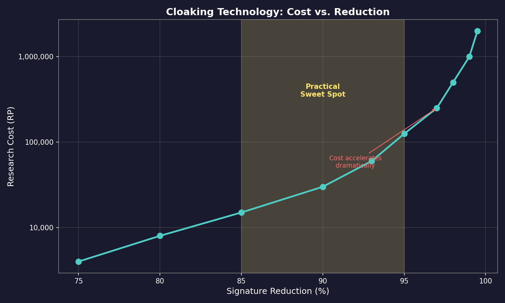

# 11.4 Stealth

*Updated: v2026.01.30*

Stealth in Aurora is not a single technology but a combination of design choices, equipment, and tactical decisions that reduce a ship's detectability. From dedicated cloaking devices to the simple expedient of turning off your sensors, stealth operations require understanding exactly how detection works and exploiting its limitations.

## 11.4.1 Cloaking Technology

*Updated: v2026.01.30*

Cloaking devices are specialized components that reduce a ship's thermal and EM signatures by a percentage. They represent advanced materials and energy absorption systems that mask a ship's emissions.

**How Cloaking Works**

A cloaking device reduces a ship's effective signatures as follows:

```
Effective Thermal Signature = Base Thermal Signature * (1 - Cloak Percentage)
Effective EM Signature = Base EM Signature * (1 - Cloak Percentage)
```
\hyperlink{ref-11.4-1}{[1]}

Cloaking technology is researched through the Sensors and Fire Control tech tree (see [Section 7.4 Tech Categories](../7-research/7.4-tech-categories.md)). Two separate research lines interact:

1. **Cloaking Sensor Reduction** -- determines the percentage of signature reduction (what percentage of thermal and EM signatures are masked)
2. **Cloaking Efficiency** -- determines the efficiency multiplier (3 to 15), which controls how large the cloak device needs to be

The available signature reduction levels are:

| Technology | Signature Reduction | Research Cost |
|-----------|-------------------|---------------|
| Cloak Sensor Reduction 75% | 75% reduction | 4,000 RP |
| Cloak Sensor Reduction 80% | 80% reduction | 8,000 RP |
| Cloak Sensor Reduction 85% | 85% reduction | 15,000 RP |
| Cloak Sensor Reduction 90% | 90% reduction | 30,000 RP |
| Cloak Sensor Reduction 93% | 93% reduction | 60,000 RP |
| Cloak Sensor Reduction 95% | 95% reduction | 125,000 RP |
| Cloak Sensor Reduction 97% | 97% reduction | 250,000 RP |
| Cloak Sensor Reduction 98% | 98% reduction | 500,000 RP |
| Cloak Sensor Reduction 99% | 99% reduction | 1,000,000 RP |
| Cloak Sensor Reduction 99.5% | 99.5% reduction | 2,000,000 RP |

\hyperlink{ref-11.4-2}{[2]}



**Cloaking Device Size**

The cloaking device must be sized appropriately for the ship. The device's size is proportional to the ship's total hull size:

```
Cloak Size = Ship Size (HS) * Cloak Size Multiplier
```

The cloak size multiplier is the inverse of the Cloaking Efficiency level (i.e., Ship Size / Efficiency = Cloak Size) \hyperlink{ref-11.4-3}{[3]}.

**Cloaking efficiency multiplier:** The efficiency multiplier ranges from 3 to 15 depending on the researched technology level. Higher efficiency means a smaller cloak device for the same percentage of signature reduction:

| Efficiency Level | Research Cost |
|-----------------|---------------|
| Efficiency 3 | 4,000 RP |
| Efficiency 4 | 8,000 RP |
| Efficiency 5 | 15,000 RP |
| Efficiency 6 | 30,000 RP |
| Efficiency 8 | 60,000 RP |
| Efficiency 10 | 125,000 RP |
| Efficiency 12 | 250,000 RP |
| Efficiency 15 | 500,000 RP |

\hyperlink{ref-11.4-4}{[4]}

**Cloaking device size constraints:**

- **Minimum cloak component size:** The smallest cloaking device component that can be manufactured, ranging from 25 HS (starting tech) down to 2 HS (highest tech). This is the minimum size of the cloaking device itself, not the ship being cloaked. A ship must be large enough that Ship Size / Efficiency produces a cloak at or above this minimum:

| Minimum Size | Research Cost |
|-------------|---------------|
| 25 HS | 1,000 RP |
| 20 HS | 2,000 RP |
| 15 HS | 4,000 RP |
| 12 HS | 8,000 RP |
| 10 HS | 15,000 RP |
| 8 HS | 30,000 RP |
| 6 HS | 60,000 RP |
| 4 HS | 125,000 RP |
| 3 HS | 250,000 RP |
| 2 HS | 500,000 RP |

\hyperlink{ref-11.4-5}{[5]}

- **Maximum size:** The game database contains cloaking devices exceeding 100 HS (e.g., a device for a 636 HS ship at Efficiency 6 produces a 106 HS cloak) \hyperlink{ref-11.4-6}{[6]}. No hard maximum is evident in the database; the previously cited 100 HS limit appears outdated.
- At early tech levels, a cloaking device might consume 20-30% of a ship's total hull space, making it a significant design commitment.

**Practical sweet spot:** The sensor reduction percentage determines how effectively the cloak masks the ship. Research costs escalate dramatically at higher percentages. The practical sweet spot is typically 85-95% reduction, as the RP cost for the final few percentage points (97% and above) is extremely high relative to the marginal benefit.

As of v1.11.0, the ship designer enforces a minimum size requirement: cloaking devices must be large enough to physically fit within the ship design. Designs that attempt to mount undersized cloaking devices will be rejected, preventing non-functional cloak installations. *(changelog-sourced -- v1.11.0 changelog; not directly verifiable from the database)*

**Cloaking and Cross-Section (v2.0.0 Changes)**

In v2.0.0, important changes were made to how cloaking interacts with a ship's cross-section for detection and combat purposes:

- **Cloaked Cross-Section:** A ship with an operational cloak is always treated as having its cloaked (reduced) cross-section for both detection and combat targeting purposes. *(changelog-sourced -- v2.0.0 changelog; cross-section reduction is the intended current behavior)*
- **Damaged Cloak Behavior (v2.0.0):** In v2.0.0+, the current state of the cloak is taken into account. If the cloak is damaged, the cross-section reverts to normal for both detection and combat purposes. This differs from v1.13.0 where a damaged cloak still provided the full cloaked cross-section. *(changelog-sourced -- v2.0.0 changelog)*
- **Fire Control Lock-On:** In v2.0.0, missile fire controls properly use the reduced cloaked cross-section when targeting cloaked vessels. A previous bug allowed missile fire controls to lock on using the full (uncloaked) cross-section, which has been fixed. *(changelog-sourced -- v2.0.0 bug fix)*

These changes mean that maintaining cloak integrity is now tactically critical during combat. A damaged cloak becomes a liability as it provides no cross-section reduction while still consuming hull space.

**Cloaking Limitations**

- Cloaking devices reduce but do not eliminate signatures. A large ship with powerful engines and a 50% cloak still has a substantial thermal signature.
- Cloaking reduces a ship's effective cross-section for active sensor detection and fire control targeting (v2.0.0+). This is a significant defensive benefit as it reduces both detection range and weapon accuracy.
- Cloaking devices consume power and hull space, reducing the capacity for other systems.
- If the cloak is damaged, the ship reverts to its full uncloaked cross-section immediately (v2.0.0+).
- The reduction applies multiplicatively with other signature management (thermal reduction engines plus cloaking provides compounding stealth benefit). \hyperlink{ref-11.4-1}{[1]}

**Cloaking and Sensor Detection**

Cloaking interacts with all three sensor detection formulas described in [Section 11.2 Passive Sensors](11.2-passive-sensors.md) and [Section 11.3 Active Sensors](11.3-active-sensors.md):

- **Passive thermal detection:** The cloak reduces the Target Signature in the formula `Detection Range = sqrt(Sensor_Strength * Target_Signature) * 250,000 km` \hyperlink{ref-11.4-1}{[1]}. Because detection range uses a square root, a 90% cloak reduction (reducing signature to 10%) reduces thermal detection range to approximately 31.6% of uncloaked range (sqrt of 0.1).
- **Passive EM detection:** Same formula applies to EM signature. A cloaked ship with active sensors emitting GPS of 24,000 and a 90% cloak still emits 2,400 -- detectable but at much shorter range.
- **Active sensor detection:** In v2.0.0+, cloaking reduces the ship's effective cross-section used in active sensor detection, shortening the range at which active sensors can detect the cloaked vessel.

**Cloaking and Active Sensor Emissions**

A cloaked ship that turns on its active sensors still produces EM emissions. The cloak reduces those emissions, but a ship with a 240 EM output from active sensors and a 50% cloak still emits 120 -- easily detectable. Cloaked ships typically operate under EMCON to maximize their stealth advantage.

**Design Considerations**

- Cloaking devices work best on small, slow ships with thermal-reduced engines. The percentage reduction compounds with low base signatures.
- On large battleships with massive engines, even 80% cloaking still leaves detectable signatures at significant ranges.
- The hull space cost of cloaking is substantial. You are trading weapon, sensor, or engine capacity for stealth.
- Consider whether the stealth benefit justifies the cost: a ship that must fight at close range may be better served by more armor and weapons than by a cloak.
- In v2.0.0+, cloak integrity is critical in combat. Armor and redundancy to protect the cloak component should be considered in the design, as a damaged cloak provides zero cross-section benefit.
- The cross-section reduction from cloaking affects both enemy fire control lock-on and active sensor detection range, making cloaked ships harder to target with missiles as well as harder to detect.

**Example:** A 5,000-ton scout with thermal-reduced engines (signature 400) and a 60% cloak:

- Effective thermal signature: 400 * 0.4 = 160
- Effective cross-section for active sensors: also reduced by cloak percentage
- This ship is extremely hard to detect thermally, with detection ranges roughly 63% of what they would be against its uncloaked thermal signature (sqrt of 0.4)
- If the cloak is damaged in combat, the ship immediately reverts to full thermal signature (400) and full cross-section

## 11.4.2 Emission Control

*Updated: v2026.01.30*

Emission Control (EMCON) is the tactical practice of restricting a ship's electronic emissions to reduce its EM signature. Unlike cloaking, EMCON is a command decision that can be activated or deactivated instantly, but it comes with significant operational restrictions.

**Activating EMCON**

EMCON can be set at the task group level or individual ship level. When a ship is under EMCON:

- All active sensors are turned off
- No active sensor emissions contribute to EM signature
- The ship relies entirely on passive sensors (thermal and EM)
- Shields can be raised or lowered independently of EMCON status, though raising shields defeats the purpose of EMCON since shields produce EM signature
- Fire controls are not available (cannot guide missiles or engage with beam weapons) *(community-documented -- EMCON disables all active emitters including fire controls; this is a core EMCON mechanic)*

**EMCON Levels**

Aurora C# supports multiple EMCON settings that allow graduated emission control:

- **Full EMCON:** All active emissions suppressed. Ship is completely passive. *(community-documented -- EMCON levels are configured through the fleet management interface)*
- **EMCON with distance threshold:** Active sensors activate automatically when a target is detected within a specified range by passive sensors. *(community-documented -- distance-threshold EMCON is a fleet management option)*
- **No EMCON:** All systems operate normally.

The distance-threshold option allows a ship to remain stealthy during approach but automatically activate weapons and sensors when the enemy reaches engagement range.

**Trade-offs of EMCON**

| Advantage | Disadvantage |
|-----------|-------------|
| Zero EM from sensors | Cannot use active sensors |
| Enemy cannot detect via EM | Reduced detection capability |
| Tactical surprise | Cannot guide missiles |
| Can approach undetected | Must rely on passive data only |

**When to Use EMCON**

- **Approach phase:** Moving into engagement range without being detected
- **Ambush operations:** Waiting on a jump point or along a transit route
- **Evasion:** Breaking contact when outnumbered
- **Reconnaissance:** Observing enemy fleet movements without revealing your presence
- **Picket operations:** Listening posts that passively monitor for thermal/EM contacts

**EMCON Impact on Missile Guidance**

Activating EMCON has critical implications for missile operations. Because fire controls are active sensors, EMCON shuts them down along with all other active emitters:

- **In-flight missiles lose guidance:** If a ship activates EMCON while its missiles are in flight, the missile fire control can no longer provide course updates. Missiles without onboard sensors go ballistic (flying to the target's last known position). *(community-documented -- missile guidance loss on fire control deactivation is a core game mechanic documented in Aurora Forums)*
- **Missiles with onboard active sensors** continue to track independently using their own seekers, regardless of the launching ship's EMCON status. These missiles are self-guiding after launch and do not require fire control updates to find their target. See [Section 12.3 Missiles](../12-combat/12.3-missiles.md) for missile sensor design.
- **Missiles with passive-only sensors** can still home on thermal or EM emissions from the target, but cannot detect targets that are also under EMCON.
- **Semi-active missiles** (relying on the fire control's active illumination reflected off the target) lose their guidance entirely under EMCON, as the illuminating sensor is shut down.

The tactical trade-off is significant: activating EMCON reduces your EM signature but may sacrifice an entire missile salvo's effectiveness. The recommended practice is to launch missiles and maintain fire control guidance until impact, then activate EMCON during the reload phase when fire controls are not needed. Alternatively, design missiles with onboard active sensors to achieve fire-and-forget capability that is immune to EMCON decisions.

See [Section 12.1 Fire Controls](../12-combat/12.1-fire-controls.md) for MFC guidance requirements and [Section 12.3 Missiles](../12-combat/12.3-missiles.md) for missile guidance modes.

**When NOT to Use EMCON**

- Active combat (you need fire controls)
- When you have already been detected (the advantage is lost)
- When you need to detect targets that are also under EMCON (only active sensors find silent targets)
- When guiding missiles that lack onboard sensors

**Combining EMCON with No Movement Orders**

The ultimate stealth configuration combines EMCON (zero EM) with cancelling movement orders (idle thermal only). A ship under EMCON with no movement orders produces only its idle thermal signature (5% of HS) and zero EM signature, making it nearly invisible to passive sensors -- though not completely undetectable as it was in VB6 Aurora.

For example, a 6,000-ton destroyer (120 HS) under EMCON with no movement orders:

- Thermal signature: 6 (120 * 0.05)
- EM signature: 0
- Detection by passive thermal sensors: extremely short range only
- Detection by EM sensors: impossible
- Detection by active sensors: based on full tonnage (6,000 tons) at normal active sensor range

This combination requires careful pre-planning: you must cancel movement orders (the ship will remain at its current position) or accept that you cannot maneuver without increasing your thermal signature. Only an active sensor sweep can reliably detect such a ship at meaningful range.

## 11.4.3 Stealth Tactics

*Updated: v2026.01.30*

Understanding detection mechanics enables several tactical approaches that exploit the limitations of enemy sensors.

**The Passive Fleet Approach**

Designate one expendable scout ship as the active sensor platform. All other ships in the fleet operate under EMCON, receiving detection data from the scout via shared task group sensors. The enemy sees only one contact (the scout) while the main fleet remains hidden until engagement range.

Variations:

- Use a cheap, fast FAC as the sensor ship -- it can flee or be sacrificed
- Position the sensor ship ahead of the main fleet to draw fire
- Use the sensor ship's active ping to force the enemy to reveal their position through maneuvering

**The Silent Approach**

For attacking a known position (enemy colony, orbital station, jump point):

1. Approach under EMCON at reduced speed to minimize thermal signature
2. At a calculated distance, cancel movement orders to drop to idle thermal (5% of HS) -- note this stops the ship rather than maintaining drift as in VB6
3. Resume movement at the last moment, approaching at maximum speed for a short burst
4. At optimal range, activate all sensors, raise shields, and fire simultaneously

In C# Aurora, ships without movement orders are stationary rather than drifting ballistically \hyperlink{ref-11.4-7}{[7]}. This changes the silent approach from a drift-and-coast maneuver to a stop-and-sprint tactic. The advantage is precision positioning; the disadvantage is the ship must remain stationary during the silent phase.

**Jump point ambush**

Station a fleet on a jump point under full EMCON with no movement orders:

1. Ships produce only idle thermal signature (5% of HS) and zero EM -- nearly undetectable by passive sensors
2. When an enemy transits the jump point, they appear at close range
3. Immediately activate sensors and weapons for a point-blank engagement
4. The enemy has no warning and minimal time to react

This remains one of the most powerful tactical positions in Aurora, as the transiting fleet suffers from jump shock (reduced sensor capability) and cannot retreat immediately. The idle thermal signature of ambushing ships is typically too small to be detected before transit.

**Jump Point Sensor Mechanics:** When a fleet transits a jump point, it arrives in the destination system subject to jump shock. During jump shock, active sensors and fire controls are **disabled** (not merely reduced), making the transiting fleet completely vulnerable to ambush \hyperlink{ref-11.4-9}{[9]}. Both standard and squadron transits incur jump shock, but the duration differs significantly: standard transits impose 121-180 seconds of shock, while squadron transits impose only 11-30 seconds \hyperlink{ref-11.4-9}{[9]}. Higher crew grade and morale reduce shock duration through the Ship Bonus modifier. See [Section 10.2.4 Transit Effects](../10-navigation/10.2-jump-transit.md#1024-transit-effects----jump-point-transit-shock) for complete jump shock mechanics and formulas.

**Missile Approach Vectors**

When launching missiles at a stealthy target:

- Missiles with active onboard sensors (see [Section 12.3 Missiles](../12-combat/12.3-missiles.md)) will emit EM, making them detectable but self-guiding
- Missiles without onboard sensors require continuous fire control guidance but are harder to detect
- Consider launching passive-guided missiles under fire control until close range, then switching to a low-resolution sensor for final approach targeting

**Counter-Stealth Operations**

To find hidden enemies:

1. **Broad active sweeps:** Use high-power active sensors at multiple resolutions to scan the system
2. **Patrol patterns:** Cover likely approach vectors with active sensor-equipped scouts
3. **Gravitational survey:** Newly detected jump points may indicate where enemies entered the system
4. **Missile scouts:** Launch long-range missiles with onboard sensors on search patterns (expensive but effective)
5. **Buoy networks:** Deploy sensor buoys at strategic locations for passive detection coverage. Sensor buoys are designed as no-engine missiles (0 MSP allocated to engine) that remain stationary at their deployment point \hyperlink{ref-11.4-8}{[8]}. They can carry thermal and EM sensors for passive surveillance without requiring a crewed ship to remain on station. See [Section 12.3 Missiles](../12-combat/12.3-missiles.md) for buoy design details.

**Stealth Ship Design Principles**

For a dedicated stealth combatant:

- Small hull (1,000-5,000 tons) to minimize active sensor cross-section
- Thermal-reduced engines (0.25x or lower) to minimize thermal signature
- Cloaking device (highest available percentage)
- Primarily passive sensors with one small active sensor for emergency/attack use
- Missiles with onboard sensors (reduces need for fire control emissions)
- Minimal or no shields (shield EM is counter-productive for stealth ships)
- Sufficient fuel for ballistic approach followed by powered withdrawal

**Common Stealth Mistakes**

- Forgetting that shields generate EM: raising shields on approach breaks stealth
- Designing a cloaked ship with oversized engines: the thermal signature overwhelms the cloak benefit
- Relying on EMCON against an enemy with active sensors: EMCON only defeats passive EM detection, not active sweeps
- Launching missiles without onboard sensors from a ship under EMCON: the missiles cannot be guided without an active fire control
- In C# Aurora, ships without movement orders are stationary (not drifting). Plan your approach accordingly -- you cannot coast toward a target, only stop and restart engines
- In v2.0.0+, relying on a cloak for combat survivability without protecting it: a single hit to the cloak component removes all cross-section reduction benefits

## UI References and Screenshots

*Updated: v2026.01.30*

- **Forum screenshots:**
  - [ELINT](http://www.pentarch.org/steve/Screenshots/ELINT02.PNG) — signature detection and analysis

## Related Sections

- [Section 8.1 Design Philosophy](../8-ship-design/8.1-design-philosophy.md) -- Stealth ship design trade-offs
- [Section 8.3 Engines](../8-ship-design/8.3-engines.md) -- Thermal reduction engine options
- [Section 11.1 Thermal/EM Signatures](11.1-thermal-em-signatures.md) -- How signatures are generated
- [Section 12.5 Electronic Warfare](../12-combat/12.5-electronic-warfare.md) -- ECM and ECCM interactions
- [Section 12.6 Damage and Armor](../12-combat/12.6-damage-and-armor.md) -- Protecting cloak components
- [Section 7.4 Tech Categories](../7-research/7.4-tech-categories.md) -- Cloaking technology research

## References

\hypertarget{ref-11.4-1}{[1]}. Aurora C# game mechanics and [Appendix A](../appendices/A-formulas.md) -- Cloaking formula: Effective\_Signature = Base\_Signature x (1 - Cloak\_Percentage/100). Cloak Sensor Reduction database values store the remaining fraction (e.g., 75% reduction stores 0.25). Multiplicative stacking with thermal reduction engines confirmed.

\hypertarget{ref-11.4-2}{[2]}. Aurora C# game database (AuroraDB.db v2.7.1) -- FCT\_TechSystem TechTypeID=154 (Cloak Sensor Reduction): 10 levels from 75% reduction (4,000 RP, stored as 0.25) through 99.5% reduction (2,000,000 RP, stored as 0.005). All values and costs verified.

\hypertarget{ref-11.4-3}{[3]}. Aurora C# game database (AuroraDB.db v2.7.1) -- FCT\_ShipDesignComponents confirms Cloak Size = Ship\_Size / Efficiency. Example: "Cloaking Device: HS216-90.0%" has Size=36 (216/6=36 at Efficiency 6); "HS426-90.0%" has Size=71 (426/6=71).

\hypertarget{ref-11.4-4}{[4]}. Aurora C# game database (AuroraDB.db v2.7.1) -- FCT\_TechSystem TechTypeID=153 (Cloaking Efficiency): 8 levels from 3 (4,000 RP) through 15 (500,000 RP). All values and costs verified.

\hypertarget{ref-11.4-5}{[5]}. Aurora C# game database (AuroraDB.db v2.7.1) -- FCT\_TechSystem TechTypeID=155 (Minimum Cloak Size): 10 levels from 25 HS (1,000 RP) through 2 HS (500,000 RP). All values and costs verified.

\hypertarget{ref-11.4-6}{[6]}. Aurora C# game database (AuroraDB.db v2.7.1) -- FCT\_ShipDesignComponents contains "Cloaking Device: HS636-90.0%" with Size=106 HS, exceeding the previously claimed 100 HS maximum. The 100 HS limit may be outdated or specific to earlier game versions.

\hypertarget{ref-11.4-7}{[7]}. Aurora C# game mechanics -- Ships without movement orders are stationary in C# Aurora, unlike VB6 where ships would drift ballistically. This is a fundamental design difference confirmed in Aurora Forums discussions and community testing.

\hypertarget{ref-11.4-8}{[8]}. Aurora C# game mechanics -- Sensor buoys are designed as ordnance with 0 MSP engine allocation. They remain stationary at deployment coordinates and carry sensors for passive surveillance. Documented in missile design discussions on Aurora Forums.

\hypertarget{ref-11.4-9}{[9]}. Aurora C# game database (AuroraDB.db v2.7.1) and Section 10.2.4 -- FCT\_Ship.SensorDelay field stores current shock duration. Jump shock disables active sensors and fire controls. Standard transit: 121-180 seconds; Squadron transit: 11-30 seconds. Ship Bonus modifier based on crew grade, morale, and overhaul factor. Cross-referenced from AuroraWiki "Jump shock" article.
