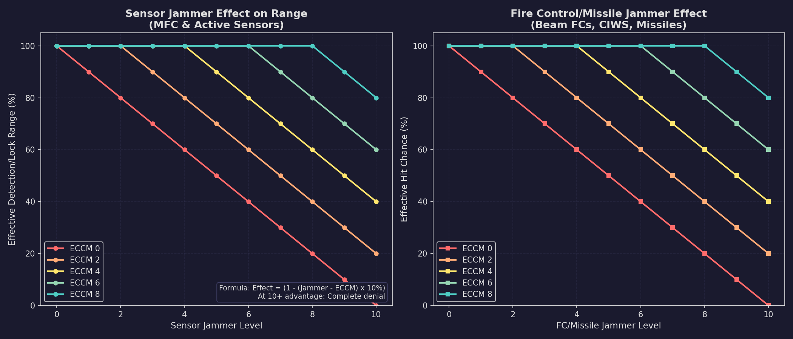

# 12.5 Electronic Warfare

*Updated: v2026.01.30*


Electronic warfare (EW) in v2.2.0 has been fundamentally restructured. The previous unified ECM/ECCM system has been split into three independent Electronic Warfare systems, each countering a different aspect of enemy targeting. ECCM has been integrated directly into fire controls rather than existing as standalone components. This section covers the new EW framework.

## 12.5.1 Electronic Warfare Systems (v2.2.0)

*Updated: v2026.01.30*

The game splits ECM into three independent Electronic Warfare systems, each representing a separate technology line with ten levels:

**Three EW System Types:**

| System | Target | Effect |
|--------|--------|--------|
| Sensor Jammers | Active sensors and missile fire controls | Reduces detection and lock range |
| Fire Control Jammers | Beam fire controls, CIWS, STO weapons | Degrades tracking accuracy |
| Missile Jammers | Missile fire control links and onboard guidance | Disrupts missile guidance |

Each system has 10 technology levels with research costs ranging from 2,500 RP (level 1) to 1,200,000 RP (level 10).\hyperlink{ref-12.5-1}{[1]} Note: as of v2.4.0, the development cost for Sensor Jammer 8 was corrected from 30,000 RP to 300,000 RP to match the intended progression curve.

**Important Distinctions:**

- Only ships mount EW systems in this form
- Missiles use a different ECM system (see [Section 12.3 Missiles](12.3-missiles.md) for missile ECM/decoys)
- EW systems and ECCM both use a 1-10 rating scale

**What Can Mount ECCM:**

- Active sensors
- Missile fire controls
- Beam fire controls
- CIWS fire controls
- STO (Space-to-Orbit) weapons
- Missiles (separate missile ECCM component)

## 12.5.2 Sensor Jammers

*Updated: v2026.01.30*

Sensor Jammers reduce the effective range at which enemy active sensors and missile fire controls can detect and lock your ship.

**How Sensor Jammers Work**

The combat formula reduces detection range:

```
ECM Penalty = max(0, Sensor Jammer Level - Target ECCM Level)
Range Reduction = 10% * ECM Penalty
Effective Detection Range = Base Range * (1 - Range Reduction)
```

This means each point of Sensor Jammer advantage over the attacker's ECCM reduces detection/lock range by 10%. At 10+ advantage, the sensor is completely jammed (zero range).

**What Sensor Jammers Affect:**

1. **Enemy active sensors** attempting to detect the jammer-equipped ship
2. **Enemy missile fire controls** attempting to maintain lock
3. **Missile onboard sensors** attempting to acquire the target

**Sensor Jammer and Missile Combat:**

- If jamming reduces the enemy MFC effective range below actual engagement distance, lock is lost
- Missiles lose guidance and go ballistic (fly to last known position)
- Missiles with onboard active sensors are also affected: acquisition range reduced
- This can cause missiles to fly past their target without acquiring it

**Example:** Enemy MFC has 200M km range. Your ship has Sensor Jammer level 6, enemy has ECCM-2:

- ECM Penalty = 6 - 2 = 4
- Range Reduction = 10% * 4 = 40%
- Effective MFC range = 200M * 0.6 = 120M km

## 12.5.3 Fire Control Jammers

*Updated: v2026.01.30*

Fire Control Jammers degrade the accuracy of enemy beam fire controls, CIWS, and STO weapons targeting the jammer-equipped ship.

**How Fire Control Jammers Work**

The formula directly reduces hit probability:

```
ECM Penalty = max(0, Fire Control Jammer Level - Attacker's ECCM Level)
Chance to Hit = Base Hit Chance * (1 - (ECM Penalty * 0.1))
```

This represents a 10% hit chance reduction per point of jammer advantage. At 10+ advantage, the hit chance drops to zero -- the target cannot be hit by beam weapons.\hyperlink{ref-12.5-2}{[2]}

**What Fire Control Jammers Affect:**

- Beam Fire Control accuracy (tracking calculations)
- CIWS hit probability against the jammer-equipped ship's missiles
- STO weapon accuracy

**Key Difference from Sensor Jammers:**

- Sensor Jammers reduce detection/lock RANGE
- Fire Control Jammers reduce hit PROBABILITY
- Both use the same 10% per level formula but apply to different values

**Example:** Enemy beam FC has 80% base hit chance. Your ship has FC Jammer level 4, enemy has ECCM-1:

- ECM Penalty = 4 - 1 = 3
- Hit modifier = 1 - (3 * 0.1) = 0.7
- Effective hit chance = 80% * 0.7 = 56%

## 12.5.4 Missile Jammers

*Updated: v2026.01.30*

Missile Jammers disrupt the guidance of enemy missiles during their terminal approach phase. All Missile Jammer components are 3 HS in size, with cost scaling linearly from 10 BP (level 1) to 60 BP (level 5). \hyperlink{ref-12.5-3}{[3]}

**How Missile Jammers Work**

The same formula as Fire Control Jammers but applied to missile terminal guidance:

```
ECM Penalty = max(0, Missile Jammer Level - Missile's ECCM Level)
Missile Hit Chance = Base Hit Chance * (1 - (ECM Penalty * 0.1))
```

**What Missile Jammers Affect:**

- **Missile terminal hit probability:** Each point of jammer advantage reduces the missile's chance to hit by 10%
- **Missile onboard guidance systems:** Active seekers and semi-active guidance links are degraded
- **Missile fire control link accuracy:** The guidance connection between the launching ship's MFC and the missile is disrupted

At 10+ jammer advantage, missiles have zero hit probability -- they cannot strike the target even at point-blank range.

**Worked Example:** Your ship has Missile Jammer 5. Incoming missiles have Missile ECCM-2:

- ECM Penalty = 5 - 2 = 3
- Hit modifier = 1 - (3 x 0.1) = 0.7
- Missiles that would normally hit at 100% now hit at 70%
- Against a 32-missile salvo, approximately 10 missiles miss that would otherwise have struck

**Interaction with Other Jammer Types:**

Missile Jammers operate independently from Sensor Jammers and Fire Control Jammers. A comprehensive EW suite uses all three:

1. **Sensor Jammers** reduce the enemy MFC's effective range (may prevent launch entirely)
2. **Missile Jammers** reduce hit probability of missiles that reach you (terminal phase)
3. **Fire Control Jammers** reduce beam weapon accuracy (separate from missile defense)

**Important:** Missile ECCM (0.25 MSP per missile) is separate from fire control ECCM. The missile's own ECCM component counters the target's Missile Jammers, while the MFC's ECCM counters Sensor Jammers. This means the defender must invest in Missile Jammers AND Sensor Jammers for full missile defense, while the attacker must invest in both Missile ECCM and MFC ECCM.

**When to Prioritize Missile Jammers:**

- Against missile-heavy enemies where you expect salvos to reach your ships
- When Sensor Jammers alone cannot prevent launches (enemy has high ECCM on MFCs)
- On high-value ships (carriers, flagships) where even partial hit reduction is valuable
- Less useful against enemies relying primarily on beam weapons -- prioritize Fire Control Jammers instead

## 12.5.5 ECCM (Restructured)

*Updated: v2026.01.30*

ECCM has been fundamentally changed in v2.2.0. The standalone ECCM, Compact ECCM, and Small Craft ECCM components have been removed from the game. ECCM is now integrated directly into fire controls and sensors.

**ECCM Integration:**

| Component | ECCM Cost |
|-----------|-----------|
| Beam Fire Controls | 10% of total FC cost per ECCM level |
| Missile Fire Controls | 10% of total FC cost per ECCM level |
| CIWS | 5% of CIWS FC cost per ECCM level (no size penalty) |
| STO Weapons | 10% of FC component cost per ECCM level |
| Missiles | 0.25 MSP (separate component) |

**Combat Formula:**

All three jammer types use the same interaction model:

```
ECM Penalty = max(0, Jammer Level - ECCM Level)
Effect = 1 - (ECM Penalty * 0.1)
```

At ECM Penalty 0: No effect (ECCM fully counters jamming)
At ECM Penalty 10+: Maximum effect (zero hit chance or zero detection range)

**When to Include ECCM:**

- **Always** on missile fire controls if you expect Sensor Jammers (maintains offensive reach)
- **Always** on CIWS if you expect missile-mounted Fire Control Jammers (maintains PD effectiveness)
- **Strongly recommended** on beam fire controls facing Fire Control Jammer-equipped targets
- **Consider** on search sensors for early warning against Sensor Jammer ships
- Match ECCM level to expected enemy jammer levels -- over-investing wastes cost

## 12.5.6 Jamming Effects in Practice

*Updated: v2026.01.30*



Understanding how the three jammer types and ECCM interact in practice helps predict combat outcomes and design effective fleets.

**Effect on Detection Ranges (Sensor Jammers)**

When a target has Sensor Jammers and your sensors have ECCM:

```
ECM Penalty = max(0, Sensor Jammer Level - Your ECCM Level)
Net Detection Range = Base Range * (1 - ECM Penalty * 0.1)
```

Examples (Jammer vs. ECCM):

- Level 3 vs. Level 0: 30% range reduction
- Level 5 vs. Level 3: 20% range reduction
- Level 4 vs. Level 4: 0% reduction (fully countered)
- Level 2 vs. Level 5: 0% reduction (ECCM exceeds jammer)
- Level 10 vs. Level 0: 100% reduction (complete sensor denial at 10+ penalty)

**Effect on Beam Combat (Fire Control Jammers)**

When your ship has Fire Control Jammers and the enemy fires beam weapons:

```
ECM Penalty = max(0, Your FC Jammer Level - Enemy ECCM Level)
Hit Chance = Base Hit Chance * (1 - ECM Penalty * 0.1)
```

This directly reduces hit probability. At 10+ penalty, the enemy cannot hit your ship with beam weapons at all. This affects:

- Standard beam fire control accuracy
- CIWS hit probability
- STO weapon accuracy

**Effect on Missile Engagement (Sensor Jammers + Missile Jammers)**

The most tactically significant EW interactions occur during missile combat:

1. **Launch phase:** Sensor Jammers reduce MFC effective range, limiting maximum launch distance
2. **Mid-course:** If Sensor Jammers reduce MFC effective range below current distance, fire control loses lock; missiles go ballistic
3. **Terminal phase:** Missile Jammers reduce missile hit probability directly
4. **Result:** Combined jammer investment can cause missiles to both miss guidance and miss on arrival

**Scenario Analysis (v2.2.0)**

*Without EW:*

- Your MFC range: 200M km, ECCM-0
- Target: No jammers
- Launch at 180M km, full guidance, full hit chance
- Result: Full salvo on target at maximum accuracy

*Target has Sensor Jammer 5, you have ECCM-2:*

- ECM Penalty = 5 - 2 = 3
- Effective MFC range = 200M * (1 - 0.3) = 140M km
- Must close to 140M km to launch with guidance
- Result: Noticeably reduced engagement range

*Target has FC Jammer 4, your beams have ECCM-1:*

- ECM Penalty = 4 - 1 = 3
- Hit modifier = 1 - (3 * 0.1) = 0.7
- All beam weapons hit at 70% of normal rate
- Result: Moderate accuracy degradation

**Effect on Point Defense**

Fire Control Jammers on incoming missiles affect beam PD accuracy:

- CIWS hit probability reduced by jammer advantage * 10%
- ECCM on CIWS fire controls (cheap at 5% per level) counters this
- AMM fire controls affected by Sensor Jammers (reduced guidance range)

**Missile ECM vs. Ship EW**

Missiles and ships use different ECM systems:

- **Ship EW (3 jammer types):** Protects the ship from detection, beam fire, and incoming missiles
- **Missile ECM (0.25 MSP):** Makes the missile 10% harder to hit per level; reduces enemy MFC lock by 10% per level
- **Missile Decoys (0.5 MSP each):** Probabilistic protection against individual PD shots
- **Missile ECCM (0.25 MSP):** Counters target's Missile Jammers for terminal hit probability

**EW Arms Race**

The three-system structure creates more nuanced tech investment decisions:

1. Must scout enemy EW doctrine to know which ECCM to prioritize
2. Sensor Jammers protect against missiles but not beams
3. FC Jammers protect against beams but not missiles
4. Missile Jammers protect against terminal hits
5. Each requires separate ECCM investment on different components

This creates genuine intelligence and scouting value -- knowing which jammers the enemy uses determines your ECCM allocation.

**Home-on-Jam (HOJ) Missiles**

HOJ missiles counter Sensor Jammers by using them as a targeting signal:

- HOJ sensors home on jammer emissions directly
- Stronger enemy Sensor Jammers makes HOJ missiles MORE effective (stronger signal)
- Forces a dilemma: use jammers and attract HOJ missiles, or turn off jammers and face standard missiles
- HOJ missiles are a strong counter to heavy Sensor Jammer doctrines

**Practical Tips**

- The three-jammer system means you must choose which threats to counter (hull space is finite)
- FC Jammers are most cost-effective for ships expecting beam combat
- Sensor Jammers are most valuable for ships targeted by missiles
- Missile Jammers protect against the terminal phase but do nothing for detection
- ECCM on CIWS is cheap (5% per level) -- always include it against missile-heavy enemies
- ECCM on MFCs is essential to maintain offensive reach against Sensor Jammer ships
- HOJ missiles remain the hard counter to Sensor Jammer doctrines
- When unsure about enemy doctrine, moderate investment across all three jammer types hedges effectively
- Missiles with decoys + ECM create layered survivability against PD
- ECCM advantage of 5+ over missile ECM completely negates decoy protection (decoy weight formula is separate from the 10%-per-level jammer coefficient)

## References

\hypertarget{ref-12.5-1}{[1]}. Aurora C# game database (AuroraDB.db v2.7.1) -- FCT_TechSystem: Sensor Jammer (TechSystemID 12017-12026), Fire Control Jammer (TechSystemID 12037-12046), Missile Jammer (TechSystemID 55-64). All three jammer types follow identical cost progression: 2,500/5,000/10,000/20,000/40,000/80,000/150,000/300,000/600,000/1,200,000 RP per level (1-10).

\hypertarget{ref-12.5-2}{[2]}. Aurora Wiki (ECM, ECCM articles) and Naval Gazing tutorials -- ECM/ECCM formula: 10% effect reduction per point of jammer advantage over ECCM. At 10+ advantage, complete denial (zero hit chance or zero detection range). Applied identically to all three jammer types.

\hypertarget{ref-12.5-3}{[3]}. Aurora C# game database (AuroraDB.db v2.7.1) -- FCT\_ShipDesignComponents ComponentTypeID=20: Missile Jammer levels 1-10, all 3.0 HS, ElectronicSystem=1. Cost scales: 10/20/30/40/60 BP for levels 1-5. Material: Corbomite only (10/20/30/40/60 units). Crew=5 for all levels. Identical size, crew, and material pattern to Sensor Jammers and Fire Control Jammers.

## Related Sections

- [Section 7.4 Tech Categories](../7-research/7.4-tech-categories.md) -- EW technology research lines
- [Section 8.5 Weapons](../8-ship-design/8.5-weapons.md) -- ECCM integration in weapon design
- [Section 11.3 Active Sensors](../11-sensors-and-detection/11.3-active-sensors.md) -- Sensor jammer effects on detection
- [Section 11.4 Stealth](../11-sensors-and-detection/11.4-stealth.md) -- EW as part of stealth doctrine
- [Section 12.3 Missiles](12.3-missiles.md) -- Missile ECM and decoy components
- [Section 12.4 Point Defense](12.4-point-defense.md) -- PD accuracy vs. jammed missiles
- [Section 12.7 Planetary Defence Centres](12.7-planetary-defence-centres.md) -- ECM/ECCM interactions with PDC sensors and fire controls
