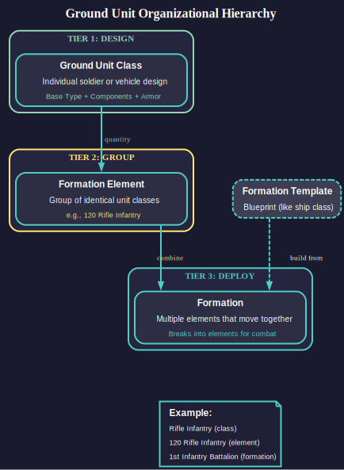
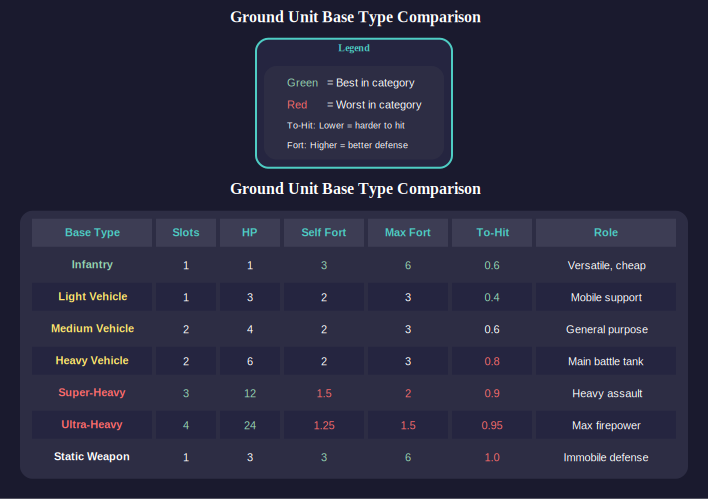
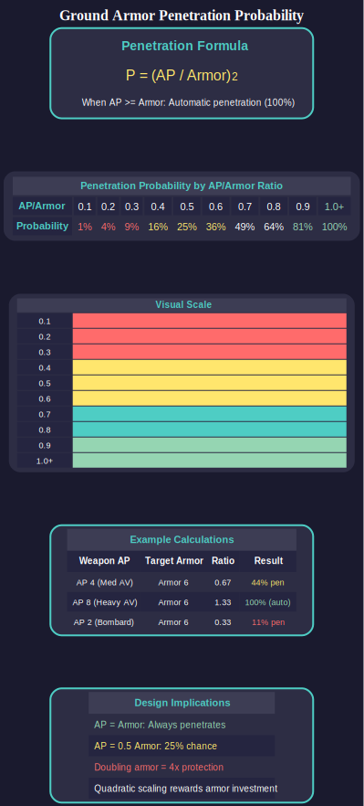
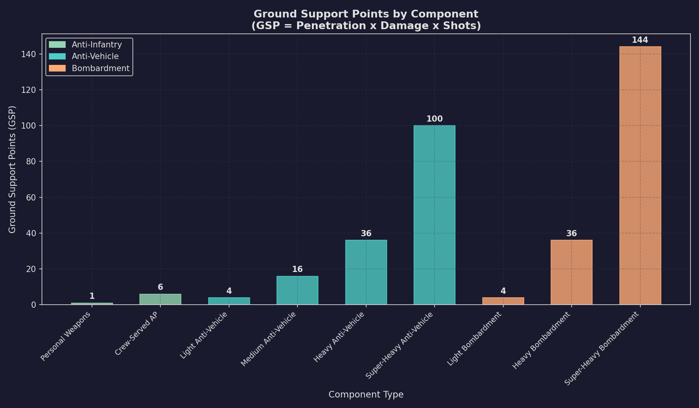

# 13.1 Unit Types and Formation Design

*Updated: v2026.01.30*


> **[Screenshot Pending — #845]** Ground Forces window showing unit roster, formation details, and training status.

Aurora's ground forces system uses a three-tier organizational hierarchy. Individual soldiers or vehicles are designed as **Ground Unit Classes**. These are combined into **Formation Elements** (groups of identical unit classes). Multiple Formation Elements then compose a **Formation**, which moves as a cohesive unit but breaks down into individual elements during combat. Formation Templates serve as blueprints (analogous to ship classes) from which formations are constructed.



---

## Contents

*Updated: v2026.01.30*

{: .no_toc }

- TOC
{:toc}

## 13.1.1 Ground Unit Class Design

*Updated: v2026.01.30*

Ground Unit Classes are the fundamental building blocks of all ground forces. Each unit class is designed by selecting a base type, adding components to available slots, selecting armor levels, and optionally choosing combat capabilities.

### 13.1.1.1 Base Types

Each base type has inherent attributes affecting survivability, mobility, and component capacity:



| Base Type | Slots | Self-Fortification | Max Fortification | Notes |
|-----------|-------|-------------------|-------------------|-------|
| Infantry | 1 | 3 | 6 | Smallest, cheapest, most versatile \hyperlink{ref-13.1-1}{[1]} |
| Light Vehicle | 1 | 2 | 3 | Mobile fire support \hyperlink{ref-13.1-1}{[1]} |
| Medium Vehicle | 2 | 2 | 3 | General-purpose platform \hyperlink{ref-13.1-1}{[1]} |
| Heavy Vehicle | 2 | 2 | 3 | Main battle tank equivalent \hyperlink{ref-13.1-1}{[1]} |
| Super-Heavy Vehicle | 3 | 1.5 | 2 | Heavy assault platform \hyperlink{ref-13.1-1}{[1]} |
| Ultra-Heavy Vehicle | 4 | 1.25 | 1.5 | Maximum firepower platform \hyperlink{ref-13.1-1}{[1]} |
| Static Weapon | 1 | 3 | 6 | Immobile; towed guns, artillery emplacements \hyperlink{ref-13.1-1}{[1]} |

**Key Attributes per Base Type:**

- **Size (tons):** Determines transportation requirements and serves as cost foundation. Modifiers apply based on components and armament selections.
- **Hit Points:** Used in destruction calculations. When hit, destruction probability = (Weapon Damage / Hit Points)^2. \hyperlink{ref-13.1-2}{[2]}
- **Slots:** Component mounting capacity (1-4 depending on base type).
- **To-Hit Modifier:** Reflects unit mobility; mobile units are harder to hit. Static units suffer increased hit probability. Fortified units ignore this penalty.
- **Maximum Fortification:** Highest defensive level achievable with construction support. Divides incoming accuracy by this value.
- **Maximum Self-Fortification:** Defensive capability achievable without external construction assistance.

### 13.1.1.2 Armor System

Armor uses comparative analysis rather than absolute values:



- **Base Armor Rating:** Multiplied by unit size to calculate construction cost. A unit with 6 armor costs 50% more than an identical unit with 4 armor. *(unverified — [#837](https://github.com/ErikEvenson/aurora-manual/issues/837) -- cost formula requires live testing)*
- **Racial Armor Rating:** Base rating multiplied by the faction's highest armor technology level. Technologies progress through: Conventional Advanced Composite (3), Duranium (4), High Density Duranium (6), and higher tiers through advanced ceramics and composites. \hyperlink{ref-13.1-3}{[3]}
- **Armor Penetration Calculation:** When a weapon hits, penetration probability = (Armor Penetration / Armor)^2. If AP >= Armor, penetration is automatic. \hyperlink{ref-13.1-4}{[4]}

### 13.1.1.3 Component System

Components mount in available slots and determine unit specialization. Each component has the following attributes:

- **Size Contribution:** Added to base unit tonnage
- **Armor-Penetration Rating:** Multiplied by Racial Weapon Strength
- **Damage Value:** Multiplied by Racial Weapon Strength
- **Fire Rate:** Shots per combat phase
- **CIWS Capability:** Designates Close-In Weapon System components for planetary missile defense
- **STO Functionality:** Surface-To-Orbit energy weapons capable of engaging orbital vessels within range
- **Headquarters Capacity:** Tons of formation controllable by a unit-based commander
- **Forward Fire Direction (FFD):** Enables coordination of support unit fire, ground support fighters, and orbital bombardment
- **Construction Value:** Measured in Construction Factory Equivalents (CFEs) for fortification work

Certain components are restricted to specific base types. For example, Super-Heavy Anti-Vehicle weapons can only mount on super-heavy or ultra-heavy platforms.

### 13.1.1.4 Ground Support Points (GSP) Formula

Ground Support Points measure a weapon component's overall combat effectiveness. The formula is:

```
GSP = Penetration Value x Damage Value x Shots
```

**GSP Examples by Component Type:**

| Component | Penetration | Damage | Shots | GSP |
|-----------|-------------|--------|-------|-----|
| Personal Weapons | 1 | 1 | 1 | 1 |
| Crew Served AP | 1 | 1 | 6 | 6 |
| Medium Anti-Vehicle | 4 | 4 | 1 | 16 |
| Heavy Bombardment | 2 | 6 | 3 | 36 |

\hyperlink{ref-13.1-5}{[5]}



GSP provides a standardized comparison metric across weapon types. Higher GSP indicates greater total combat output per element, though the distribution between penetration, damage, and rate of fire affects tactical suitability against different target types (e.g., high penetration matters more vs. armored vehicles, while high shots matter more vs. infantry).

### 13.1.1.5 Research Costs

Ground combat technologies (see [Section 7.4 Tech Categories](../7-research/7.4-tech-categories.md)) have reduced research costs (as of v2.2.0) compared to earlier versions. The general pattern is approximately 50% reduction from prior costs, making ground force development more accessible earlier in campaigns:

**Starting Technologies (Conventional Start):**

| Technology | Research Cost (RP) |
|-----------|-------------------|
| Troop Transport Bay | 1,000 |
| Troop Transport Boarding Bay | 2,500 |
| Troop Transport Drop Bay | 2,500 |

\hyperlink{ref-13.1-6}{[6]}

**Equipment and Capabilities (2,500 RP each):** \hyperlink{ref-13.1-7}{[7]}

- Geosurvey Equipment, Construction Equipment, Xenoarchaeology Equipment, Decontamination Equipment
- Ground unit capabilities (Boarding, Desert, High-Gravity, Low-Gravity, Extreme Temperature, Extreme Pressure, Mountain, Jungle, Rift Valley)

**Vehicle Armor Progression:**

| Armor Tier | Research Cost (RP) | Prerequisite (v2.4.0+) |
|-----------|-------------------|------------------------|
| Heavy Armor | 2,500 | Heavy Vehicle type |
| Super-Heavy Armor | 5,000 | Super-Heavy Vehicle type |
| Ultra-Heavy Armor | 10,000 | Ultra-Heavy Vehicle type |

\hyperlink{ref-13.1-8}{[8]}

As of v2.4.0, the Heavy, Super-Heavy, and Ultra-Heavy Vehicle base types are prerequisites for researching their respective armor tiers. You must have access to the vehicle type before you can research the corresponding armor technology.

**Weapons Systems:**

- Most bombardment, anti-vehicle, and anti-air weapons: 2,500 RP \hyperlink{ref-13.1-9}{[9]}
- Super-heavy weapon variants: 5,000 RP \hyperlink{ref-13.1-9}{[9]}

### 13.1.1.6 Racial Strength Modifiers

Two fundamental racial metrics govern equipment effectiveness:

- **Racial Armor Strength:** Derived from the highest armor technology tier researched. Conventional Advanced Composite = 3; Duranium = 4; High Density Duranium = 6; progression continues through advanced materials. \hyperlink{ref-13.1-3}{[3]}
- **Racial Weapon Strength:** Based on the maximum tech level across laser focal sizes, railgun types, meson focal sizes, particle beam strength, and carronade caliber. This links weapon and armor development so they scale together. The WeaponStrengthModifier is stored per unit class in the database (values of 10.0 and 12.0 observed) but the derivation formula requires live testing. *(unverified — [#837](https://github.com/ErikEvenson/aurora-manual/issues/837) -- derivation formula requires live testing)*

### 13.1.1.7 Combat Capabilities

Optional specializations that double targeting accuracy within designated terrain or tactical scenarios. Available capabilities include:

- **Mountain Warfare:** 0.5x modifier in mountain/rift valley terrain \hyperlink{ref-13.1-10}{[10]}
- **Jungle Warfare:** 0.5x modifier in jungle/rainforest terrain \hyperlink{ref-13.1-10}{[10]}
- **Desert Warfare:** 0.5x modifier in desert/arid terrain \hyperlink{ref-13.1-10}{[10]}
- **Boarding Combat:** Required for ship boarding operations; provides two distinct bonuses: (1) doubles the transfer success probability during the boarding attempt phase, and (2) doubles the to-hit chance during internal combat rounds once aboard the target vessel \hyperlink{ref-13.1-11}{[11]}

Multiple capabilities stack multiplicatively. A unit with both Mountain and Jungle Warfare gains a 0.25x modifier (4x accuracy) in jungle-mountain terrain. *(unverified — [#837](https://github.com/ErikEvenson/aurora-manual/issues/837) -- multiplicative stacking requires live testing)*

Each capability selection increases unit cost proportionally.

### 13.1.1.8 Genetically Enhanced Soldiers

Infantry units can receive genetic enhancement through Biology/Genetics technology research. Three tiers are available after completing Genome Sequence Research (5,000 RP): \hyperlink{ref-13.1-13}{[13]}

| Enhancement Tier | Research Cost (RP) | HP Multiplier | Cost Multiplier |
|-----------------|-------------------|---------------|-----------------|
| Basic Enhancement | 5,000 | x1.25 | x1.5 |
| Improved Enhancement | 10,000 | x1.6 | x2.0 |
| Advanced Enhancement | 20,000 | x2.0 | x2.5 |

\hyperlink{ref-13.1-12}{[12]}

Enhancements provide multiplicative bonuses to hit points, making soldiers substantially more resilient. These are selected as capabilities during unit design.

### 13.1.1.9 Class Design Highlighting

The Ground Unit Class design interface provides visual indicators to identify outdated or alien-origin components:

**Component-Level Highlighting (in the class treeview):**

- **Orange:** Obsolete components (superseded by newer research)
- **Red:** Components where the owning race lacks research data (typically alien-origin)

**Class-Level Highlighting:**

- An "Obsolete Comp" checkbox below the class treeview enables class-level visualization
- **Orange classes** contain at least one obsolete component
- **Red classes** contain non-researched (alien) components
- The Race Components list also shows obsolete components in orange when the Obsolete checkbox is enabled

In longer games, most classes will contain obsolete components, so the checkbox-based filtering helps players quickly identify which designs need updating.

### 13.1.1.10 Design-to-Deployment Workflow

Ground unit classes follow a mandatory **design-then-research** workflow before they can be built. Unlike ship classes which become immediately available after design, ground unit classes must be individually researched:

1. **Design:** Create the unit class in the Unit Class Design tab, selecting base type, components, armor, and capabilities. This produces a blueprint only.
2. **Research:** Navigate to the Research tab of the Economics window and queue the new unit class design for research. The game displays "Research the new class on the research tab of the economics window" when a design is completed.
3. **Build:** Once research completes, the unit class becomes available for inclusion in Formation Templates and can be constructed at Ground Force Construction Complexes.

**Research Costs for Unit Classes:**

Unit class research costs are very low compared to ship component research, making ground force development accessible early:

| Unit Class Type | Typical Research Cost (RP) |
|----------------|---------------------------|
| Basic infantry elements | 20-44 |
| Battalion-level HQ | ~80 |
| Vehicle-based units | Varies by complexity |

> **Tip:** Because research costs are so low (often under 50 RP), you can research multiple infantry variants simultaneously without significantly impacting your overall research budget. A single research lab can complete a basic infantry class design in days rather than months.

**Deleting Erroneous Designs:**

The Research window provides a **Delete Tech** button that removes accidentally-created or duplicate unit class designs. This button only appears when viewing technologies you have created; standard game technologies cannot be accidentally deleted.

### 13.1.1.11 Avoid Combat Flag

The unit class design interface includes an **Avoid Combat** checkbox that designates the unit as non-combat. When enabled:

- The text "(Non-Combat)" is appended to the unit class name
- The unit will not be used as a frontline combatant during ground combat
- The unit avoids being assigned to front-line attack or front-line defence positions

**Recommended for:**

- **Headquarters units** (especially company-level HQs) -- preserves command capacity
- **Forward Fire Direction units** -- keeps fire coordination assets out of direct combat
- **Logistics units** -- protects supply vehicles from frontline attrition

> **Warning:** Without the Avoid Combat flag, support units like HQs and logistics vehicles may be placed in combat positions where they are destroyed, causing the formation to lose command capacity or supply access at critical moments.

### 13.1.1.12 Design Constraints

- Armor, hit points, and components freeze at design-time technology levels and do not automatically upgrade when superior technology becomes available (similar to naval ship design).
- Research must establish baseline technology for components before they become available.
- Ground unit class designs must be individually researched before they become available for construction (see Design-to-Deployment Workflow above).
- Construction cost in Build Points incorporates size, armor selection, component choices, and selected capabilities.

## 13.1.2 Infantry

*Updated: v2026.01.30*

Infantry represent personnel-heavy combat elements. They are inexpensive, require minimal transport capacity, and excel in defensive operations. Infantry is the only base type that can receive genetic enhancements and use the Small Logistics Module. \hyperlink{ref-13.1-14}{[14]}

**Characteristics:**

- 1 component slot
- Self-fortification to level 3; maximum fortification level 6 with construction support
- Smallest transport size (lowest tonnage per element)
- Lowest individual hit points but formations contain many elements
- Can carry Small Logistics Modules (10 tons, 100 GSP) for self-supply \hyperlink{ref-13.1-15}{[15]}

**Infantry Variants by Component Choice:**

- **Standard Infantry:** Anti-personnel weapons; effective against other infantry
- **Heavy Infantry:** Anti-vehicle weapons mounted; effective against armored targets
- **Garrison Infantry:** Reduced offensive capability, full defensive strength at lower cost
- **Combat Engineers:** Construction components for fortification work
- **Logistics Infantry:** Small Logistics Modules for formation supply (can only supply own formation)
- **HQ Infantry:** Headquarters components for command and control
- **AA Infantry:** Anti-aircraft components for air defense
- **STO Infantry:** Surface-to-orbit weapons for engaging orbital targets

## 13.1.3 Vehicles and Armor

*Updated: v2026.01.30*

Vehicle elements represent ground combat platforms ranging from light reconnaissance to ultra-heavy assault vehicles. They provide concentrated firepower and resilience but require significantly more transport capacity than infantry.

### 13.1.3.1 Light Vehicles

- 1 component slot \hyperlink{ref-13.1-1}{[1]}
- Self-fortification to level 2; maximum fortification level 3 \hyperlink{ref-13.1-1}{[1]}
- Can mount Standard Logistics Modules (50 tons, 1,000 GSP) \hyperlink{ref-13.1-15}{[15]}
- Vehicle-based logistics can supply other formations (unlike infantry logistics) \hyperlink{ref-13.1-15}{[15]}
- Mobile fire support and reconnaissance role

### 13.1.3.2 Medium Vehicles

- 2 component slots \hyperlink{ref-13.1-1}{[1]}
- Self-fortification to level 2; maximum fortification level 3 \hyperlink{ref-13.1-1}{[1]}
- General-purpose combat platform
- Balance of firepower, protection, and transport cost

### 13.1.3.3 Heavy Vehicles

- 2 component slots \hyperlink{ref-13.1-1}{[1]}
- Self-fortification to level 2; maximum fortification level 3 \hyperlink{ref-13.1-1}{[1]}
- Main battle tank equivalent with dual weapon mounts
- Significant transport tonnage requirement

### 13.1.3.4 Super-Heavy Vehicles

- 3 component slots \hyperlink{ref-13.1-1}{[1]}
- Self-fortification to level 1.5; maximum fortification level 2 \hyperlink{ref-13.1-1}{[1]}
- Can mount Super-Heavy Anti-Vehicle weapons (restricted to this tier and above) \hyperlink{ref-13.1-16}{[16]}
- Very high transport cost
- Reduced fortification capability reflects difficulty of concealing large platforms

### 13.1.3.5 Ultra-Heavy Vehicles

- 4 component slots \hyperlink{ref-13.1-1}{[1]}
- Self-fortification to level 1.25; maximum fortification level 1.5 \hyperlink{ref-13.1-1}{[1]}
- Maximum firepower potential with 4 weapon/component mounts
- Enormous transport requirement
- Minimal fortification ability; these platforms rely on armor and firepower rather than concealment

### 13.1.3.6 Static Weapons

- 1 component slot \hyperlink{ref-13.1-1}{[1]}
- Immobile platforms (towed guns, artillery emplacements)
- Self-fortification to level 3; maximum fortification level 6 \hyperlink{ref-13.1-1}{[1]}
- Suffer increased hit probability due to immobility (to-hit modifier: 1.0) \hyperlink{ref-13.1-1}{[1]}
- Cannot relocate without being loaded onto transport
- Excellent for permanent defensive positions

## 13.1.4 Support Units

*Updated: v2026.01.30*

Support elements provide essential combat multipliers, command and control, logistics, and specialized capabilities. Their presence dramatically improves overall formation effectiveness.

### 13.1.4.1 Headquarters Elements

HQ components provide command capacity measured in tons of formation controllable. A formation without adequate HQ capacity suffers proportional penalties to effectiveness.

- Every combat formation should include HQ elements
- HQ capacity must match or exceed the total tonnage of the formation commanded
- If commanding forces exceed HQ capacity, bonus effectiveness reduces proportionally

### 13.1.4.2 Forward Fire Direction (FFD) Elements

FFD components coordinate external fire support:

- Each FFD component permits support from up to 6 ground support fighters \hyperlink{ref-13.1-17}{[17]}
- Each FFD component also enables 1 orbital bombardment support ship \hyperlink{ref-13.1-17}{[17]}
- Without FFD, formations cannot receive fighter or orbital fire support
- If a formation loses FFD capability during combat, assigned support ships automatically seek alternative formations

### 13.1.4.3 Artillery / Bombardment Elements

Artillery provides indirect fire support from the Support field position:

- Fires simultaneously with ground support fighters and orbital bombardment
- Cannot directly attack from the support position but provides bombardment
- Target selection options match heavy bombardment parameters
- Effectiveness improved by commander's Ground Combat Artillery (GCA) bonus

**Super-Heavy Bombardment (v2.0.0+):** As of v2.0.0, a Super-Heavy Bombardment ground component is available, providing a larger and more destructive bombardment option beyond standard heavy bombardment. This gives ground forces access to extremely powerful indirect fire support at the cost of increased transport tonnage and build points.

### 13.1.4.4 Construction Elements

Construction-equipped units enable fortification beyond self-fortification limits:

- **Construction capacity:** Each Construction Equipment component contributes 0.05 CFE (Construction Factory Equivalents) to the unit's construction rating \hyperlink{ref-13.1-20}{[20]}. The complete formula (unit count x racial construction modifier x commander bonus) is hardcoded in game logic. *(unverified — [#837](https://github.com/ErikEvenson/aurora-manual/issues/837) -- complete formula requires live testing)*
- Can fortify other elements from self-fortification maximum to absolute maximum in 90 days (given sufficient capacity) *(unverified — [#837](https://github.com/ErikEvenson/aurora-manual/issues/837) -- fortification timing requires live testing)*
- Only works on elements already at their self-fortification maximum
- Essential for achieving maximum fortification levels on vehicles

### 13.1.4.5 Anti-Aircraft Elements

AA elements defend against ground support fighters:

- Participate in normal ground combat using standard values
- Can draw supply twice if engaged in both ground-to-ground and ground-to-air combat
- Targeting formula: (10% x (Tracking Speed / Aircraft Speed) x (Morale / 100)) / Environment Modifier *(unverified — [#837](https://github.com/ErikEvenson/aurora-manual/issues/837) -- AA targeting formula requires live testing)*
- Damage against aircraft: ((Ground Damage Value / 20)^2) rounded down *(unverified — [#837](https://github.com/ErikEvenson/aurora-manual/issues/837) -- AA damage formula requires live testing)*
- All AA damage applies after all attacks resolve in combat sequence

**AA Targeting Priority:**

1. AA units in a formation directly attacked by aircraft each select a random attacking aircraft
2. Medium/Heavy AA in parent formations target aircraft engaging subordinates
3. Heavy AA units engage random hostile aircraft, including those on combat air patrol

### 13.1.4.6 CIWS Elements

Close-In Weapon System components provide planetary missile defense, protecting the colony from incoming missile attacks.

### 13.1.4.7 STO (Surface-to-Orbit) Elements

STO-designated energy weapons can engage orbital vessels within range:

- Tracking speed and ECCM can be updated when formation templates are copied/updated
- Provides ground-based defense against ships in orbit
- Makes orbital bombardment riskier for attacking fleets

### 13.1.4.8 Logistics Elements

Two logistics component types provide battlefield supply:

| Module Type | Size (tons) | GSP Provided | Mountable On |
|------------|-------------|--------------|--------------|
| Standard Logistics Module | 50 | 1,000 | Light vehicles and larger |
| Small Logistics Module | 10 | 100 | Infantry only |

\hyperlink{ref-13.1-15}{[15]}

- Vehicle-based logistics can supply other formations
- Infantry-based logistics can only supply their own formation
- Logistics vehicles are consumed as supply is drawn

### 13.1.4.9 Decontamination Elements

A specialized component for radiation reduction:

- Same size/cost as Xenoarchaeology components (100 tons) \hyperlink{ref-13.1-18}{[18]}
- Mountable on medium or larger vehicles \hyperlink{ref-13.1-18}{[18]}
- Each component increases radiation reduction by 0.01% per year \hyperlink{ref-13.1-18}{[18]}
- Commanders can gain rare Decontamination bonus

## 13.1.5 Formation Templates

*Updated: v2026.01.30*

Formation Templates function analogously to naval ship classes, serving as blueprints from which formations are constructed. Templates comprise multiple Template Elements, each specifying quantities of particular Ground Unit Classes.

### 13.1.5.1 Template Structure

Each Template Element tracks:

- Unit class designation
- Quantity of units
- Aggregate tonnage and build point cost
- Combined hit points
- Headquarters capacity
- Forward Fire Direction component counts
- CIWS and STO weapon quantities
- Construction value in CFEs

Template-level totals aggregate across all constituent elements, establishing transport requirements and resource expenditures for complete formation construction.

### 13.1.5.2 Rank Assignment

Templates receive a default rank suggested by the program, although this can be overridden by the player. This rank is used by the Automated Assignment process for formations built using the template.

### 13.1.5.3 Ordinal Numbering (v1.13.0+)

Formation templates use per-template ordinal numbering rather than a unified sequence. Each template type maintains its own independent counter:

- **Per-Template Basis:** The 1st Infantry Regiment and 1st Armoured Regiment are numbered independently
- **Roman Numeral Option:** A "Use Roman" checkbox enables Roman numeral suffixes (e.g., Infantry Regiment I, Infantry Regiment II, Infantry Regiment III)
- **Sort by Creation:** Since Roman numerals do not sort alphabetically well, a "Sort Creation" option on the Ground Design and Economics windows sorts units by creation order rather than alphabetically when they share the same abbreviation

### 13.1.5.4 Template Management

- **Copy + Upgrade (v2.2.1):** Previously named "Copy + Update" (v2.2.0), this button creates evolved formation templates by duplicating them with year suffixes and automatically generating upgraded unit classes when racial armor/weapon modifiers, tracking speed, or ECCM values have changed. The upgraded unit classes are organized into Unit Series for automated replacement. Renamed in v2.2.1 to better reflect its purpose of creating upgraded versions and updating the Organization tab.
- **Copy Temp (v2.2.1):** Duplicates templates without modifying unit classes. Use this when you want an exact copy of a template for organizational purposes without triggering the automatic unit class upgrade process.
- **Element Management:** Players can add, edit quantities, and delete elements or entire templates.
- **Drag-and-Drop Creation:** Elements can be dragged from existing formations to create new formations on the Order of Battle tab.

### 13.1.5.5 Creating Formations from Elements

Players can create new formations by dragging element nodes from existing formations to population nodes on the Order of Battle tab:

1. **Drag** an element node from an existing formation to a population node
2. **Enter Name:** A popup appears requesting the new formation name
3. **Enter Abbreviation:** A second popup requests the formation abbreviation
4. **Optional Amount:** If the "Amount Popup" checkbox is enabled, a third dialog allows specifying the quantity to transfer (e.g., transfer 40 of 120 tanks to create a smaller formation)
5. **Result:** A new formation is created containing only the transferred elements

**Location Requirement:** The target population must be on the same system body as the source formation (unless SpaceMaster mode is active, which permits transfers to any population).

This feature enables tactical restructuring and splitting of formations without requiring complete reformation procedures.

### 13.1.5.6 Design Guidelines

When designing formation templates, consider:

- **Transport Budget:** Total tonnage determines transport ship requirements (see [Section 13.2 Training and Transport](13.2-training-and-transport.md))
- **Command Coverage:** Include sufficient HQ capacity for the formation's total tonnage
- **FFD Coverage:** Include FFD elements if you want fighter or orbital bombardment support
- **Supply Autonomy:** Include logistics elements for sustained combat (each unit has inherent supply for only 10 combat rounds)
- **Construction Support:** Include construction elements if the formation needs to fortify vehicle elements beyond self-fortification levels
- **Balance:** Mix combat types (anti-personnel, anti-vehicle) based on expected threats

### 13.1.5.7 Organizational Best Practices

The following guidance reflects community consensus on effective formation sizing and logistics placement:

**Minimum Formation Size for Combat:**

| Role | Minimum Size (tons) | Typical Formation | Notes |
|------|--------------------|--------------------|-------|
| Colony garrison/security | ~1,000 | Company | Acceptable for policing only |
| Frontline combat | 5,000+ | Battalion | Minimum for sustained combat effectiveness |
| Combined arms | 25,000+ | Brigade | Optimal for integrated operations |

> **Warning:** Building combat formations at company level (~1,000 tons) results in excessive micromanagement with minimal combat impact. The community consensus is that battalion level (5,000 tons) is the minimum effective combat formation. Company-level formations should only be used for garrison/security roles, not frontline combat.

**Brigade-Level Logistics:**

Rather than creating separate logistics battalions (which introduces hierarchy and assignment complexity), embed logistics elements at the brigade level:

1. **Create a Brigade HQ formation** (25,000 ton capacity) containing the HQ element and logistics elements
2. **Attach combat battalions** as subordinate formations beneath the brigade
3. **Logistics flows downward:** Logistics at the HQ level automatically supports all subordinate formations through the supply hierarchy (see [Section 13.2 Training and Transport](13.2-training-and-transport.md))

This pattern works because vehicle-based logistics can supply other formations (unlike infantry logistics which only supply their own formation). By placing logistics at the brigade HQ level, all attached battalions draw supply through the hierarchy without requiring individual logistics attachments.

> **Tip:** The brigade-level logistics pattern avoids the complexity of managing separate logistics battalions for each combat unit. A single brigade HQ with logistics vehicles supporting four combat battalions is far simpler than attempting to assign individual logistics formations to each battalion.

**Formation Hierarchy Example:**

```
Brigade HQ (25,000 tons capacity)
├── HQ elements + Logistics vehicles + Construction elements
├── 1st Infantry Battalion (5,000 tons)
├── 2nd Infantry Battalion (5,000 tons)
├── 3rd Infantry Battalion (5,000 tons)
└── 4th Armored Battalion (5,000 tons)
```

## 13.1.6 Unit Series

*Updated: v2026.01.30*

Unit Series provide an organizational mechanism for grouping similar unit designs across technology generations, enabling the automated replacement system to substitute upgraded versions without requiring template modifications.

### 13.1.6.1 Purpose

When a formation takes casualties and needs replacement units, the system uses Unit Series to determine which unit class to provide. Rather than requiring the exact same unit class specified in the original template, the system selects the most current unit from the matching Unit Series.

### 13.1.6.2 Management

- Unit Series are managed through a dedicated tab using drag-and-drop functionality
- Similar unit designs (e.g., successive generations of a rifle infantry class) are grouped into the same series
- When replacements occur, the system uses the Unit Series of each unit in the Replacement Template rather than the specific unit class
- This enables automatic substitution with upgraded versions without requiring template updates

### 13.1.6.3 Example

If "Rifle Infantry Mk I" and "Rifle Infantry Mk II" are in the same Unit Series, formations originally built with Mk I will receive Mk II replacements when available, automatically upgrading the formation composition over time.

## 13.1.7 Ground Force Organizations

*Updated: v2026.01.30*

Formations can be organized hierarchically:

- Parent formations can contain subordinate formations
- Logistics supply draws from higher formation levels first, checking at each hierarchy stage
- Commander bonuses apply through the hierarchy based on command capacity
- Elements can be reorganized between formations at the same location

### 13.1.7.1 HQ Hierarchy Pattern

The standard ground force hierarchy uses dedicated HQ formations at each command echelon:

| Echelon | HQ Capacity (tons) | Typical Subordinates | Default Rank |
|---------|--------------------|-----------------------|-------------|
| Division HQ | 125,000 | 3-5 Brigades | Major General |
| Brigade HQ | 25,000 | 4-5 Battalions | Colonel |
| Battalion HQ | 5,000 | 3-5 Companies | Lieutenant Colonel |

HQ capacity is set per unit class design and stored in the database (e.g., 24,000 tons for example infantry HQ, 45,000 tons for medium command units, 250,000 tons for high command) \hyperlink{ref-13.1-21}{[21]}. The echelon values in the table above (5,000/25,000/125,000 tons) represent community convention for organizing formations, not game-enforced limits.

**Two approaches for HQ placement:**

1. **HQ in its own formation (recommended):** Create a separate formation containing only the HQ element, then attach company/battalion formations as subordinates. This provides a more organic hierarchy and keeps the HQ in rear echelon where it is protected.
2. **HQ embedded in a combat formation:** Place the HQ element directly in one of the combat formations. Simpler but less hierarchical, and risks the HQ being destroyed in frontline combat.

### 13.1.7.2 Building a Battalion Hierarchy (Worked Example)

The following procedure creates a battalion with subordinate security companies for colony garrison:

**Step 1: Design the HQ unit class**

1. Create a Battalion HQ unit class with an HQ component providing 5,000 tons capacity
2. Enable the **Avoid Combat** flag (prevents the HQ from frontline placement)
3. Research the unit class (typically ~80 RP)

**Step 2: Design subordinate unit classes**

1. Create security infantry classes (light infantry with personal weapons, ~960 tons per company)
2. Optionally include light AA or light anti-vehicle variants
3. Research each unit class (typically 20-44 RP each)

**Step 3: Create formation templates**

1. Create a "Battalion HQ" template containing only the HQ element
2. Create a "Security Company" template with the infantry elements (~960 tons total)
3. Set the Battalion HQ template rank to **Lieutenant Colonel** (use "Change Rank" on the formation template -- the default Major is insufficient for battalion command)

**Step 4: Build and organize**

1. Queue the Battalion HQ formation for construction
2. Queue the Security Company formations (typically 3-5 per battalion)
3. Once built, assign the company formations as subordinates of the Battalion HQ via the Order of Battle tab

**Step 5: Assign commander**

1. Open the commander management interface
2. Filter by Ground Officer and appropriate rank (Major or Lieutenant Colonel)
3. Assign an officer to the Battalion HQ formation
4. If the officer's rank is too low, promote manually (officers with ~1,000+ experience points are within normal promotion range)

> **Tip:** Changing rank on the formation template only affects formations built after the change. If you change a template from Major to Lieutenant Colonel after a formation is already built, the existing formation retains its original rank assignment. Use the manual promotion interface for already-built formations.

### 13.1.7.3 Security Company Garrison Workflow

For colony security operations, the security company workflow provides an efficient pattern:

1. **Design phase:** Create a lightweight security company template (~960 tons) with light infantry, optional light AA, and an HQ element with Avoid Combat flag
2. **Research phase:** Research all unit classes (minimal RP investment)
3. **Build phase:** Queue security companies at colonies with Ground Force Construction Complexes
4. **Deploy phase:** Transport completed companies to target colonies via troop transport ships
5. **Organize phase:** Optionally group under a Battalion HQ for hierarchical command (one Battalion HQ per 3-5 companies)
6. **Station phase:** Leave formations on the colony surface to provide police strength and reduce unrest (see [Section 13.1.8 Colony Garrison and Security](#1318-colony-garrison-and-security))

This workflow can be repeated for each colony requiring garrison forces. A single Battalion HQ (5,000 tons capacity) supports approximately 5 security companies of ~960 tons each.

### 13.1.7.4 Element Transfer Between Formations

The system uses an intelligent drag-and-drop interface for transferring elements between formations:

- **Whole Element Transfer:** By default, dragging an element to a new formation transfers the entire element. If the receiving formation already contains units of the same class, the additional units merge with the existing element.
- **Partial Transfer:** Enable the "Amount" checkbox to transfer only a portion of an element. A popup box appears after the drag-drop allowing specification of how many units to move.
- **Location Constraint:** Units must be on the same system body to transfer between formations (prevents cross-planetary transfers).
- **Hierarchy Display:** Formation elements are shown under their own node in the hierarchy tree to avoid clutter.
- **Morale Penalty:** Transferring units between Brigade HQs (different parent formations) **halves their morale**. *(unverified — [#837](https://github.com/ErikEvenson/aurora-manual/issues/837) -- morale penalty requires live testing)* This represents the disruption of unit cohesion, loss of familiar leadership, and adjustment to new command structures. Avoid reorganizing units between brigades during active combat operations, as the morale penalty can render transferred units combat-ineffective until they recover.

> **Warning:** The morale halving on inter-brigade transfer is severe. A unit at 100 morale drops to 50 morale upon transfer -- below the threshold where combat effectiveness degrades significantly. Plan force reorganizations during peacetime or lulls in combat, and allow transferred units time to recover morale under their new commander's training bonus before committing them to action.

### 13.1.7.5 Scrapping Formations (v1.14.0+)

Formations that are no longer needed can be scrapped for partial resource recovery:

- **Process:** Select a formation in the Ground Forces window and click the "Scrap Formation" button
- **Resource Recovery:** Yields 30% of the formation's original wealth and mineral value \hyperlink{ref-13.1-19}{[19]}
- **Wealth:** Recovered wealth is added to the racial balance
- **Minerals:** Recovered minerals are added to the parent population's stockpile
- **Scope:** All elements within the formation are scrapped together (cannot scrap individual elements this way)

### 13.1.7.6 Class Default Ground Forces

Ship classes can be assigned default ground force formations (similar to ordnance loadouts and strikegroup assignments):

- **Assignment:** Ship classes receive default ground forces assignments during design
- **Automatic Loading:** When a ship is built, the system searches for matching ground formations at the same population as the shipyard
- **Eligibility Criteria:** Formations must match the required template, be at full strength with no losses, and be stationed at the same population
- **Instant Loading:** Qualifying formations load instantly (same mechanism as ordnance loading)
- **Instant Build Integration:** When using instant build with the "Include Assigned Templates" checkbox enabled, all default ground formation templates are created immediately and loaded into transport bays

**Instant Organisation (v2.3.1+):**

The Instant Organisation feature (SpaceMaster tool for immediately creating formations) now consumes build points as of v2.3.1. Previously, instant formations were created without resource cost; they now deduct the appropriate BP from the colony's available build points, maintaining economic balance even when using this convenience feature.

**Ground Unit Cost:** Calculated using size, armor, components, and capabilities, rounded to 3 decimal places for precision in build point allocation. *(unverified — [#837](https://github.com/ErikEvenson/aurora-manual/issues/837) -- exact cost formula requires live testing)*

## 13.1.8 Colony Garrison and Security

*Updated: v2026.01.30*

Ground forces serve a critical non-combat role as colony security, providing the police strength that suppresses population unrest. Every colony with significant population should eventually have security forces assigned.

### 13.1.8.1 Security vs. Combat Formations

Ground forces fulfill two distinct roles requiring different formation designs:

| Role | Formation Size | Equipment Level | Purpose |
|------|---------------|-----------------|---------|
| Colony garrison/security | ~1,000 tons (company) | Light | Unrest suppression and policing |
| Frontline combat | 5,000+ tons (battalion) | Full | Engaging enemy ground forces |

Security formations use lighter equipment (light infantry, light AA, light anti-vehicle) since they are not expected to face heavy opposition. Their primary purpose is maintaining order, not winning battles against peer forces.

### 13.1.8.2 How Garrison Forces Reduce Unrest

Colonies experience two distinct stability challenges (see [Section 5.2 Population](../5-colonies/5.2-population.md)):

1. **Internal unrest** -- managed by ground forces acting as police
2. **External protection** -- managed by armed ships in-system

Ground forces stationed on a colony contribute **occupation strength** that functions as policing:

- **Element Occupation Strength:** (Square Root of Size x Units x Morale) / 10,000 per element *(unverified — [#837](https://github.com/ErikEvenson/aurora-manual/issues/837) -- occupation strength formula requires live testing)*
- When total occupation strength exceeds the population's required threshold, the surplus acts as **police strength**
- Police strength above the threshold actively **reduces unrest over time** at a rate of 100 x Police Modifier points per year *(unverified — [#837](https://github.com/ErikEvenson/aurora-manual/issues/837) -- unrest reduction rate requires live testing)*
- The Police Modifier = Police Strength / Effective Population Size *(unverified — [#837](https://github.com/ErikEvenson/aurora-manual/issues/837) -- police modifier formula requires live testing)*

### 13.1.8.3 Unrest Consequences

| Unrest Level | Effect |
|-------------|--------|
| 1-10 | Negligible impact |
| 10-39 | Minor morale penalties, no production loss |
| 40+ | Production penalties begin |
| Severe | Significant production loss, potential instability spiral |

### 13.1.8.4 Garrison Formation Design

For colony security, design compact formations optimized for policing rather than combat:

- **Light infantry** with personal weapons or crew-served weapons (provides police presence at low cost)
- **Light AA elements** (provides token air defense for the colony)
- **Light anti-vehicle elements** (deters minor threats)
- **HQ element** (maintains formation effectiveness; mark with Avoid Combat flag)
- Total formation size of approximately 960-1,000 tons

> **Tip:** Security companies are inexpensive to build and maintain compared to combat formations. Even a single company of light infantry provides meaningful unrest reduction for a developing colony. As population grows, add additional security companies to maintain sufficient police strength above the threshold.

### 13.1.8.5 Required Garrison Strength Formula

The garrison strength required to maintain order on a colony is determined by:

```
Required Garrison Strength = Population (millions) x (Racial Determination / 100) x (Racial Militancy / 100)
```

The database confirms Determination and Militancy fields exist in FCT_Species, and OccupationForceMod exists in DIM_PopPoliticalStatus for political status modifiers \hyperlink{ref-13.1-22}{[22]}. *(unverified — [#837](https://github.com/ErikEvenson/aurora-manual/issues/837) -- exact formula calculation requires live testing)*

- **Population:** The colony's population in millions
- **Racial Determination:** The conquered race's determination rating (higher = more resistant to occupation)
- **Racial Militancy:** The conquered race's militancy rating (higher = more prone to armed resistance)

For your own populations, determination and militancy still factor in but are offset by loyalty. Conquered populations with high determination and militancy values require substantially more garrison strength than docile populations of equivalent size.

### 13.1.8.6 Garrison Planning

Every colony that will develop significant population should receive security forces:

- **Homeworld:** Naturally resistant to unrest; garrison is optional early but recommended as population grows
- **Established colonies:** Assign security companies as population reaches levels where unrest becomes possible
- **Conquered populations:** Require significantly more garrison strength due to the Political Status Modifier (see [Section 5.2 Population](../5-colonies/5.2-population.md))
- **Outer colonies:** More sensitive to unrest than the homeworld; prioritize these for early garrison deployment

### 13.1.8.7 Dual Stability Requirements

A fully stable colony requires both systems satisfied simultaneously:

1. **Ground forces on-surface** providing police strength above the unrest threshold
2. **Armed ships in-system** meeting the Protection Required value (even a single armed frigate covers small colonies)

Failure to address either system independently can drive unrest increases, even if the other system is fully satisfied.

## UI References and Screenshots

*Updated: v2026.01.28*

- [Ground Forces Window Layout](../images/ground-forces-window.md) — formation design, unit class configuration
- **Forum screenshots** *(archived -- pentarch.org URLs no longer accessible as of 2026-01)*:
  - Ground Forces Interface (was: pentarch.org/steve/Screenshots/Ground010.PNG)
  - Ground Rules (was: pentarch.org/steve/Screenshots/GroundRules004.PNG)
  - Elements (was: pentarch.org/steve/Screenshots/Elements001.PNG)
  - Dominant Terrain (was: pentarch.org/steve/Screenshots/DominantTerrain.PNG)

## Related Sections

- [Section 6.3 Construction](../6-economy-and-industry/6.3-construction.md) -- Build point allocation for formation construction
- [Section 7.4 Tech Categories](../7-research/7.4-tech-categories.md) -- Ground combat technology research
- [Section 12.6 Damage and Armor](../12-combat/12.6-damage-and-armor.md) -- Orbital bombardment and planetary defense
- [Section 13.2 Training and Transport](13.2-training-and-transport.md) -- Moving formations between colonies
- [Section 15.5 Intelligence Gathering](../15-diplomacy/15.5-intelligence-gathering.md) -- Intelligence gathering via ELINT and interrogation; naval officer Intelligence skill
- [Section 16.2 Skills and Bonuses](../16-commanders/16.2-skills-and-bonuses.md) -- Commander ground combat bonuses
- [Appendix D: Reference Tables](../appendices/D-reference-tables.md) -- Ground unit component tables
- [UI Reference: Ground Forces Window](../images/ground-forces-window.md) -- Annotated interface diagram

## References

\hypertarget{ref-13.1-1}{[1]}. Aurora C# game database (AuroraDB.db v2.7.1) -- DIM_GroundUnitBaseType table. Confirmed slots, self-fortification, max fortification, hit points, size, and to-hit modifier for all 7 base types: Infantry (1 slot, 3/6 fort, 1 HP, 0.6 THM), Light Vehicle (1 slot, 2/3 fort, 3 HP, 0.4 THM), Medium Vehicle (2 slots, 2/3 fort, 4 HP, 0.6 THM), Heavy Vehicle (2 slots, 2/3 fort, 6 HP, 0.8 THM), Super-Heavy Vehicle (3 slots, 1.5/2 fort, 12 HP, 0.9 THM), Ultra-Heavy Vehicle (4 slots, 1.25/1.5 fort, 24 HP, 0.95 THM), Static (1 slot, 3/6 fort, 3 HP, 1.0 THM). Note: "Standard Vehicle" corrected to "Medium Vehicle" per database; Static Weapon has 1 slot, not 0.

\hypertarget{ref-13.1-2}{[2]}. Aurora C# game database (AuroraDB.db v2.7.1) -- DIM_GroundUnitBaseType. Hit points confirmed per base type: Infantry 1, Light Vehicle 3, Medium Vehicle 4, Heavy Vehicle 6, Super-Heavy Vehicle 12, Ultra-Heavy Vehicle 24, Static 3. Destruction formula (Damage/HP)^2 from Steve Walmsley's ground combat mechanics posts on Aurora Forums.

\hypertarget{ref-13.1-3}{[3]}. Aurora C# game database (AuroraDB.db v2.7.1) -- FCT_TechSystem (TechTypeID=84). Armor technology progression: Conventional Steel (1), Conventional Composite (2), Conventional Advanced Composite (3), Duranium (4), High Density Duranium (6), Composite (8), Ceramic Composite (10). Manual previously stated "Conventional (3), Duranium (5)" -- corrected to Conventional Advanced Composite (3), Duranium (4).

\hypertarget{ref-13.1-4}{[4]}. Aurora C# game database (AuroraDB.db v2.7.1) -- DIM_GroundComponentType. Penetration and damage values confirmed for all weapon components. Armor penetration formula (AP/Armor)^2 from Steve Walmsley's ground combat mechanics documentation.

\hypertarget{ref-13.1-5}{[5]}. Aurora C# game database (AuroraDB.db v2.7.1) -- DIM_GroundComponentType table. Confirmed: Personal Weapons (AP 1, DAM 1, Shots 1, GSP=1), Crew-Served AP (AP 1, DAM 1, Shots 6, GSP=6), Heavy Bombardment (AP 2, DAM 6, Shots 3, GSP=36). Corrected: Medium Anti-Vehicle has AP 4, DAM 4 (not 6), Shots 1, yielding GSP=16 (not 24).

\hypertarget{ref-13.1-6}{[6]}. Aurora C# game database (AuroraDB.db v2.7.1) -- FCT_TechSystem. Confirmed: Troop Transport Bay - Standard (ID 33426) = 1,000 RP; Troop Transport Boarding Bay - Standard (ID 65454) = 2,500 RP; Troop Transport Drop Bay - Standard (ID 55438) = 2,500 RP.

\hypertarget{ref-13.1-7}{[7]}. Aurora C# game database (AuroraDB.db v2.7.1) -- FCT_TechSystem. Confirmed at 2,500 RP each: Geosurvey Equipment (65897), Construction Equipment (65813), Xenoarchaeology Equipment (66653), Decontamination Equipment (78587), Boarding Combat (65822), High Gravity (65823), Low Gravity (65824), Extreme Temperature (65825), Jungle Warfare (65826), Mountain Warfare (65827), Desert Warfare (65828), Extreme Pressure (65829), Rift Valley Warfare (65898). Fighter Pods removed per v2.8.0.

\hypertarget{ref-13.1-8}{[8]}. Aurora C# game database (AuroraDB.db v2.7.1) -- FCT_TechSystem. Confirmed: Heavy Vehicle Armour (65783) = 2,500 RP with prerequisite Heavy Vehicle base type (65818); Super-Heavy Vehicle Armour (65784) = 5,000 RP with prerequisite Super-Heavy Vehicle (65819); Ultra-Heavy Vehicle Armour (65785) = 10,000 RP with prerequisite Ultra-Heavy Vehicle (65820).

\hypertarget{ref-13.1-9}{[9]}. Aurora C# game database (AuroraDB.db v2.7.1) -- FCT_TechSystem. Confirmed: Heavy Bombardment (65794) = 2,500 RP, Heavy Anti-Vehicle (65796) = 2,500 RP, Heavy Anti-Air (65860) = 2,500 RP, Heavy Autocannon (65875) = 2,500 RP. Super-Heavy Anti-Vehicle (65808) = 5,000 RP, Super-Heavy Bombardment (86937) = 5,000 RP. Note: lighter variants cost 600-1,250 RP, not 2,500.

\hypertarget{ref-13.1-10}{[10]}. Aurora C# game database (AuroraDB.db v2.7.1) -- DIM_GroundUnitCapability. Mountain Warfare (ID 5), Jungle Warfare (ID 6), Desert Warfare (ID 7) all have CostMultiplier=1.25. FCT_TechSystem TechDescription confirms "twice the normal chance to hit" (i.e., 0.5x environmental modifier).

\hypertarget{ref-13.1-11}{[11]}. Aurora C# game database (AuroraDB.db v2.7.1) -- DIM_GroundUnitCapability. Boarding Combat (ID 1) is infantry-only (InfantryOnly=1), CostMultiplier=2.5. Prerequisite: Powered Infantry Armour (65779). Double transfer probability and double to-hit from Steve Walmsley's boarding mechanics documentation.

\hypertarget{ref-13.1-12}{[12]}. Aurora C# game database (AuroraDB.db v2.7.1) -- DIM_GroundUnitCapability and FCT_TechSystem. Basic Genetic Enhancement: 5,000 RP, HP x1.25, Cost x1.5. Improved: 10,000 RP, HP x1.6, Cost x2.0. Advanced: 20,000 RP, HP x2.0, Cost x2.5. All confirmed exactly as stated.

\hypertarget{ref-13.1-13}{[13]}. Aurora C# game database (AuroraDB.db v2.7.1) -- FCT_TechSystem. Genome Sequence Research (ID 37979) = 5,000 RP. Confirmed as prerequisite for Basic Genetic Enhancement (67771, Prerequisite1=37979).

\hypertarget{ref-13.1-14}{[14]}. Aurora C# game database (AuroraDB.db v2.7.1) -- DIM_GroundUnitCapability. All genetic enhancements (IDs 10-12) have InfantryOnly=1. DIM_GroundComponentType: Logistics Module - Small (ID 58) has Infantry=1, confirming infantry-only restriction.

\hypertarget{ref-13.1-15}{[15]}. Aurora C# game database (AuroraDB.db v2.7.1) -- DIM_GroundComponentType. Logistics Module (ID 57): Size=50 tons, LogisticsPoints=1,000, LightVehicle=1 (light vehicles and larger). Logistics Module - Small (ID 58): Size=10 tons, LogisticsPoints=100, Infantry=1 (infantry only). Note: Standard Logistics Module provides 1,000 GSP, not 500 as previously stated.

\hypertarget{ref-13.1-16}{[16]}. Aurora C# game database (AuroraDB.db v2.7.1) -- DIM_GroundComponentType. Super-Heavy Anti-Vehicle (ID 7): SuperHeavyVehicle=1, UltraHeavyVehicle=1, Vehicle=False, Infantry=False, HeavyVehicle=0. Confirmed restricted to super-heavy and ultra-heavy platforms only.

\hypertarget{ref-13.1-17}{[17]}. Aurora C# game database (AuroraDB.db v2.7.1) -- DIM_GroundComponentType. Forward Fire Direction (ID 20): FireDirection=1. The "6 fighters per FFD" and "1 orbital bombardment ship per FFD" values are from Steve Walmsley's ground combat rules documentation.

\hypertarget{ref-13.1-18}{[18]}. Aurora C# game database (AuroraDB.db v2.7.1) -- DIM_GroundComponentType. Decontamination Equipment (ID 65): Size=100 tons, Decontamination=0.01. Xenoarchaeology Equipment (ID 64): Size=100 tons. Both confirmed same size. FCT_TechSystem: both cost 2,500 RP.

\hypertarget{ref-13.1-19}{[19]}. Aurora Forums, v2.0.0 Changes List (v1.14.0) -- "you can scrap ground units for thirty percent of their wealth and minerals." Wealth added to racial balance; minerals added to parent population stockpile.

\hypertarget{ref-13.1-20}{[20]}. Aurora C# game database (AuroraDB.db v2.7.1) -- DIM_GroundComponentType. Construction Equipment (ID 25): Construction=0.05, Size=150 tons. This confirms each Construction Equipment component contributes 0.05 CFE to unit construction rating.

\hypertarget{ref-13.1-21}{[21]}. Aurora C# game database (AuroraDB.db v2.7.1) -- FCT_GroundUnitClass.HQCapacity field. Example values from game data: Infantry HQ = 24,000 tons, Praetorian Leader = 45,000 tons, Praetorian High Leader = 250,000 tons. HQ capacity is set per unit class design, not computed from a formula.

\hypertarget{ref-13.1-22}{[22]}. Aurora C# game database (AuroraDB.db v2.7.1) -- FCT_Species contains Determination and Militancy fields for each species. DIM_PopPoliticalStatus contains OccupationForceMod for political status modifiers (e.g., Conquered=1.0, Occupied=0.75, Subjugated=0.25, Slave Colony=1.5).
