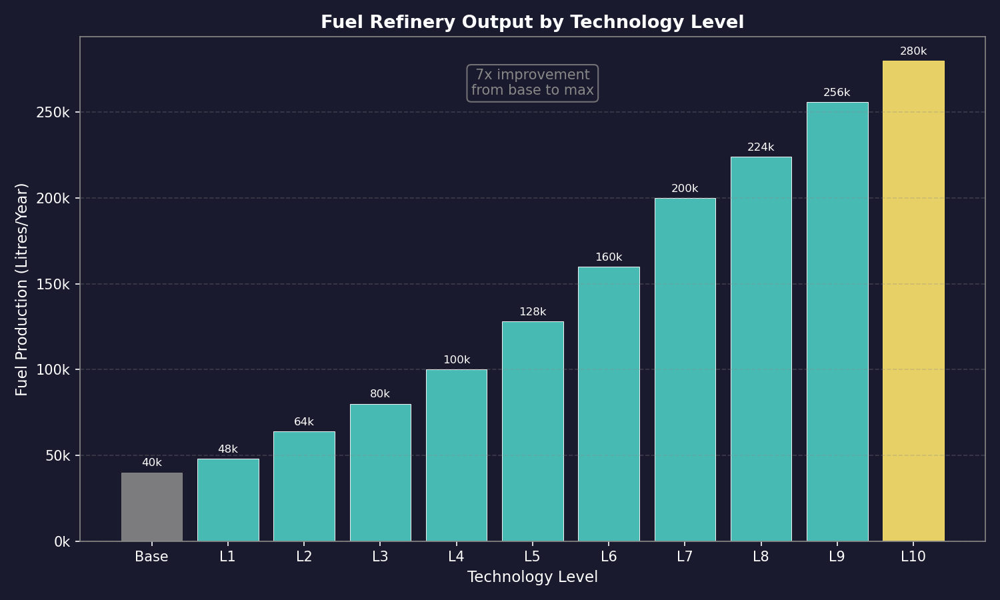
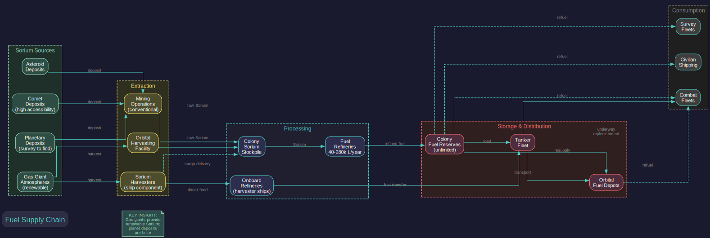
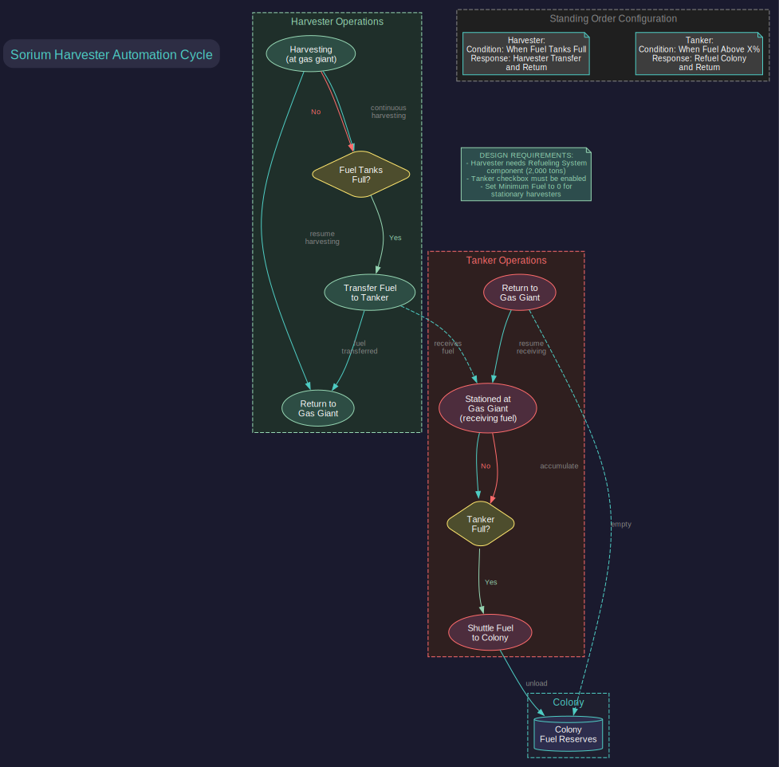
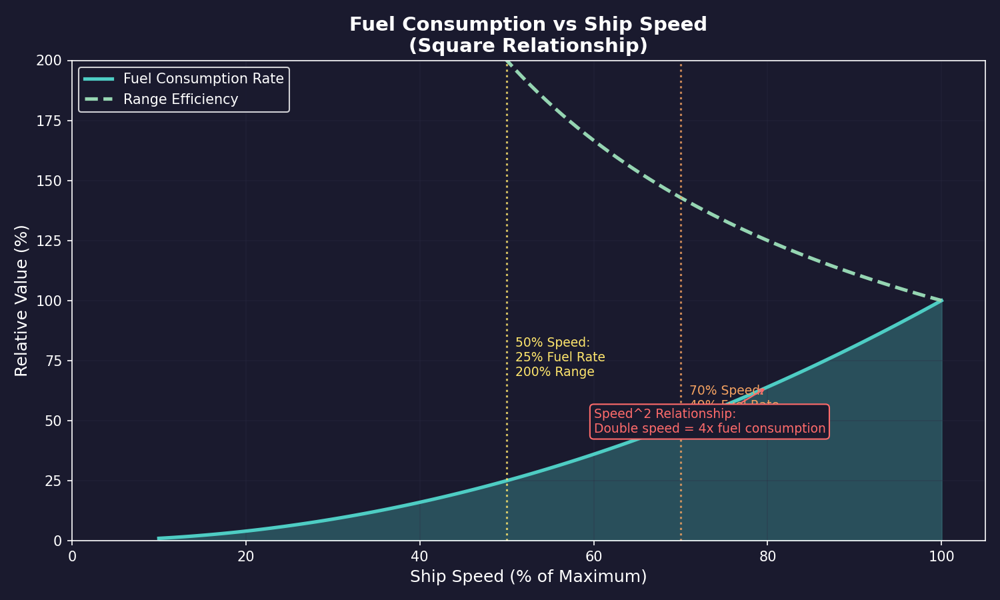

# 14.1 Fuel

*Updated: v2026.01.30*

Fuel is the lifeblood of any interstellar navy. Without it, ships cannot move, fleets cannot deploy, and your empire grinds to a halt. Fuel management is one of the most critical logistical challenges in Aurora C#, requiring careful attention to production capacity, consumption rates, and distribution across your colonies and fleets.

## 14.1.1 Sorium and Fuel Production

*Updated: v2026.01.30*

All ship fuel in Aurora is refined from Sorium, one of the eleven trans-newtonian minerals. Converting raw Sorium into usable fuel requires dedicated refinery installations on your colonies.

**Sorium as a Resource**

Sorium is found through geological surveys (see [Section 10.3 Survey Operations](../10-navigation/10.3-survey-operations.md)) on planets, moons, asteroids, and comets:

- **Planetary Deposits:** Most colonies will have some Sorium deposits, though accessibility and quantity vary widely
- **Gas Giant Harvesting:** Gas giants are a rich source of Sorium. Sorium Harvester modules on ships can extract Sorium directly from gas giant atmospheres, providing a renewable supply independent of mineral deposits
- **Asteroid Mining:** Asteroids may contain Sorium deposits that can be mined conventionally
- **Comets:** Comets occasionally contain significant Sorium deposits with high accessibility

**Fuel Refineries**

Fuel Refineries are the colony installation that converts raw Sorium into refined fuel:

- **Conversion Rate:** Each refinery converts a fixed amount of Sorium into fuel per year. The base rate is 40,000 litres of fuel per refinery per year at the starting technology level \hyperlink{ref-14.1-1}{[1]}
- **Technology Improvement:** Researching fuel production technology increases the output per refinery across 11 tech levels, from 48,000 up to 280,000 litres/year \hyperlink{ref-14.1-1}{[1]}
- **Mineral Consumption:** Each unit of fuel produced consumes a corresponding amount of Sorium from the colony's mineral stockpile
- **Build Cost:** Refineries cost 120 BP and require 120 Boronide per installation \hyperlink{ref-14.1-2}{[2]}

**Sorium Harvesters**

For empires with access to gas giants, Sorium Harvesters provide an alternative fuel supply chain:

- **Ship Component:** Sorium Harvester modules are installed on ships during the design phase
- **Base Harvesting Rate:** Each harvester module has a base mining rate of 10 \hyperlink{ref-14.1-3}{[3]}. Higher technology levels increase this rate proportionally
- **Operation:** Ships with harvesters orbit a gas giant and automatically extract Sorium over time
- **Yield:** Harvester output depends on the module size and the gas giant's Sorium concentration
- **Delivery:** Harvested Sorium is stored in the ship's cargo hold and must be delivered to a colony for refining, or the ship can be designed with both harvesters and onboard refineries
- **Orbital Harvesting Facility:** An alternative is the orbital Sorium harvesting installation, which can be built in orbit of gas giants without requiring dedicated ships

**Fuel Transfer from Harvesters:**

To transfer harvested fuel to other ships, harvesters require specific components and design flags:

- **Refueling System Component:** A harvester ship must be equipped with a Refueling System component (2,000-ton / 40 HS ship component) to transfer fuel to other vessels \hyperlink{ref-14.1-1}{[1]}. Without this component, the harvester can accumulate fuel but cannot distribute it
- **Tanker Checkbox:** The "Tanker" checkbox must be enabled in the ship designer for the harvester class to be recognized as a fuel transfer-capable vessel. Without this flag, the ship is not treated as a tanker by the refueling order system
- **Minimum Fuel Setting:** For stationary harvesters that remain permanently at a gas giant and do not need to transit elsewhere, set Minimum Fuel to 0. This allows the harvester to transfer its entire fuel reserve to other ships without retaining an operational reserve it will never use

**Harvester Design Options:**

Harvesters can be designed using alternative construction methods:

- **Orbital Habitats:** Harvesters can be designed as orbital habitats rather than conventional ships. Orbital habitats are buildable by planetary industry (factories) without requiring shipyard capacity, making them accessible earlier in the game and freeing shipyard slots for combat vessel construction
- **Civilian Construction:** Civilian shipping lines can build their own harvesters if the appropriate technology and designs are available. This offloads fuel harvesting to the civilian sector, reducing military shipyard burden

**Harvester Automation:**

Fuel harvesters can be set to operate autonomously using standing order conditions:

- **Trigger Condition:** Set the "When Fuel Tanks Full" standing order condition on the harvester fleet
- **Response Order:** Pair it with the "Harvester Transfer and Return" response, which directs the harvester to transfer its accumulated fuel to a designated tanker or depot, then return to its gas giant harvesting position
- **Result:** The harvester operates in a continuous cycle -- harvesting fuel until full, transferring to a collection point, and returning to harvest more -- without player intervention
- **Collection Tanker:** Station a tanker at the gas giant to receive fuel transfers, then have the tanker shuttle accumulated fuel to your colonies on its own automated schedule

**Fuel Production Planning**

To maintain adequate fuel supplies, consider:

1. **Current Consumption:** Calculate how much fuel your fleet burns per year at current operational tempo
2. **Growth Projection:** As your fleet expands, fuel needs will increase proportionally
3. **Reserve Target:** Maintain at least 6-12 months of fuel reserves on your primary colonies
4. **Distributed Production:** Build refineries at multiple colonies to avoid single points of failure
5. **Gas Giant Access:** Prioritize colonizing or establishing harvesters in systems with accessible gas giants

**Practical Tips:**

- Fuel shortages are one of the most common crises in mid-game Aurora; plan your refinery capacity well ahead of need
- Gas giant harvesting provides a very large but finite Sorium supply. An event notification triggers when a gas giant or superjovian exhausts its Sorium reserves, alerting you to find alternative fuel sources
- Consider building dedicated harvester ships early; the upfront cost pays dividends in fuel security
- Monitor your fuel balance regularly; a negative trend means your consumption exceeds production and reserves will eventually run dry
- Refineries are cheap to build; when in doubt, build more than you think you need

## 14.1.2 Fuel Consumption

*Updated: v2026.01.30*

Ships consume fuel whenever they move. Understanding fuel consumption mechanics is essential for planning operations, designing ships with adequate range, and managing your logistics pipeline.

**Base Fuel Consumption**

Fuel consumption in Aurora C# is determined by the engine design and ship speed:

- **Engine Fuel Consumption:** Each engine type has a base fuel consumption rate measured in litres per hour per engine power unit
- **Speed Relationship:** Fuel consumption increases with the square of speed. A ship traveling at twice its cruise speed burns four times as much fuel (see [Appendix A: Formulas -- Fuel Consumption Rate](../appendices/A-formulas.md))
- **Ship Mass:** Heavier ships require more engine power to achieve the same speed, indirectly increasing total fuel consumption
- **Maximum Speed:** Ships always travel at their maximum speed unless specifically ordered to match a slower vessel in the task group

**Fuel Efficiency Technology**

Research in engine technology (see [Section 7.4 Tech Categories](../7-research/7.4-tech-categories.md)) affects fuel efficiency:

- **Fuel Consumption Modifier:** Engine designs include a fuel consumption modifier that can be set during the design phase. Lower consumption means less fuel used but also less engine power
- **Technology Progression:** Higher engine technology levels provide better power-to-fuel ratios
- **Engine Power Impact:** Fuel efficiency is heavily linked to engine power -- lower-power engines are vastly more fuel-efficient than high-power engines running at maximum output
- **Engine Size Impact:** Fuel efficiency is also somewhat linked to engine size -- larger engines are modestly more efficient than smaller engines at equivalent power settings
- **Design Trade-offs:** A ship designer must balance speed, fuel efficiency, and engine size. Maximum speed engines burn fuel rapidly; high-efficiency engines are slower but can operate for longer. Commercial vessels should prioritize fuel efficiency to prevent empire-wide shortages, while combat ships may sacrifice efficiency for higher power output

**Task Group Fuel Consumption**

When ships operate in task groups, fuel consumption follows specific rules:

- **Slowest Ship Speed:** A task group travels at the speed of its slowest member
- **Individual Consumption:** Each ship burns fuel based on its own engine characteristics at the group's travel speed
- **Matching Speed:** Ships with higher maximum speed consume less fuel when traveling at a slower ship's pace, since they are operating below their maximum

**Range Calculation**

A ship's range is displayed in the ship design window and represents the maximum distance it can travel on a full fuel load:

- **Range = Fuel Capacity / Consumption Rate x Speed** (see [Appendix A: Formulas -- Range Calculation](../appendices/A-formulas.md))
- Range is calculated at maximum speed; traveling slower extends effective range
- The ship design window shows range in billions of kilometers
- Compare range to the distances between systems in your empire to ensure ships can reach their destinations

**Running Out of Fuel**

Ships that exhaust their fuel supply are stranded:

- The ship stops moving and cannot execute further movement orders
- The ship remains functional for sensors, weapons, and other systems (which do not consume fuel)
- Rescue requires sending a tanker to the stranded ship's location to transfer fuel
- Stranded ships are extremely vulnerable; they cannot evade threats

**Practical Tips:**

- Always check range before sending ships on long deployments; arriving at the destination on fumes with no local refueling is a common beginner mistake
- Design ships with fuel reserves appropriate to their mission; combat ships need enough fuel for patrol duty, not just a one-way trip
- Fuel consumption at maximum speed is dramatic; if you are sending ships on routine transits through safe space, consider lower-speed designs that save fuel
- Keep an eye on task group fuel levels during operations; the task group display shows current fuel as a percentage
- Station tankers at key waypoints along your supply lines to extend operational range of combat fleets
- The square-of-speed fuel consumption rule means that the fastest possible engine is rarely the most practical choice for most ships

## 14.1.3 Fuel Storage Components

*Updated: v2026.01.30*

Ship-mounted fuel storage in C# Aurora uses a tiered system offering improved economy of scale for larger modules.

**Fuel Storage Module Costs:** \hyperlink{ref-14.1-4}{[4]}

| Module Size | Size (HS) | Capacity | Cost (BP) |
|-------------|-----------|----------|-----------|
| Minimal | 0.002 | 100 litres | 0.01 |
| Fighter | 0.02 | 1,000 litres | 0.08 |
| Tiny | 0.1 | 5,000 litres | 0.3 |
| Small | 0.2 | 10,000 litres | 0.5 |
| Standard | 1.0 | 50,000 litres | 2 |
| Large | 5.0 | 250,000 litres | 5 |
| Very Large | 20.0 | 1,000,000 litres | 10 |
| Ultra Large | 100.0 | 5,000,000 litres | 25 |

Larger fuel modules are proportionally more economical, making tanker designs more practical for extended operations. The cost reduction also significantly reduces build times for fuel-heavy ships such as tankers, since build time correlates with component costs adjusted for vessel size.

## 14.1.4 Fuel Management

*Updated: v2026.01.30*

Effective fuel management requires infrastructure for storage, transport, and distribution across your empire. This includes colonial fuel reserves, orbital fuel depots, tanker fleets, and careful planning of refueling points.

**Colony Fuel Reserves**

Each colony maintains a fuel stockpile that serves as both production output and consumption source:

- **Storage:** Colonies can store unlimited fuel in their reserves
- **Production Input:** Refineries deposit produced fuel directly into colony reserves
- **Consumption Source:** Ships in orbit can refuel directly from colony reserves
- **Transfer:** Fuel can be loaded onto tankers for transport to other locations
- **Monitoring:** The colony summary shows current fuel reserves and production/consumption rates

**Automated Refuel Toggle:** Each colony can be toggled to be ignored for automated refuelling orders. When ships execute standing or conditional orders involving refueling, the system normally selects the closest colony with fuel and suitable installations. By designating specific colonies as off-limits for automated refueling, players can reserve fuel supplies at strategic locations, direct fuel traffic toward distribution hubs, or prevent ships from detouring to nearby colonies when other refueling points are preferred.

**Fuel Depots**

For locations where you need fuel availability but do not have a full colony, fuel can be stored in space:

- **Orbital Fuel Depots:** Dedicated fuel storage facilities that can be placed in orbit of any body or at a waypoint
- **Capacity:** Each depot holds a fixed amount of fuel determined by its design
- **Refueling:** Ships can refuel from depots just as they would from a colony
- **Construction:** Depots are built at shipyards and towed or transported to their operating location

**Tanker Operations**

Tankers are ships designed with fuel storage capacity beyond their own needs, allowing them to refuel other ships:

- **Fuel Tankage Component:** The ship component that provides excess fuel capacity for distribution to other vessels
- **Refueling Orders:** Tankers can be ordered to refuel specific ships or entire task groups
- **Underway Replenishment:** Tankers can refuel combat ships without requiring them to return to a colony (see [Section 14.3 Supply Ships](14.3-supply-ships.md))
- **Shuttle Runs:** A common logistics pattern is having tankers make regular runs between refineries and forward operating areas
- **Tanker Selection Order:** When a fleet executes refueling from multiple tankers, tankers are accessed by fuel capacity ratio (current fuel / maximum capacity). This means tankers with higher proportional fuel loads are drawn from first, optimizing the distribution of fuel across a mixed tanker fleet and preventing situations where some tankers are emptied while others remain full. *Added: v2.6.0*

**Minimum Fuel Level:** Ship classes can be configured with a minimum fuel threshold. Ships will not unload or transfer fuel below this level, ensuring they retain operational reserves for contingencies. This replaces the VB6 system where tankers would only unload 90% of their fuel, giving players explicit control over logistics reserves. The minimum fuel setting applies to all fuel transfer and unloading operations.

**Fuel Distribution Strategy**

A well-designed fuel logistics network includes:

1. **Production Centers:** Colonies with abundant Sorium and many refineries, serving as primary fuel sources
2. **Forward Depots:** Fuel depots positioned along major transit routes and near operational areas
3. **Tanker Fleet:** Sufficient tanker capacity to keep forward depots supplied and refuel operational fleets
4. **Emergency Reserves:** Designated fuel reserves that are not drawn upon for routine operations

**Fuel as a Strategic Resource**

Fuel availability constrains your strategic options:

- **Offensive Operations:** Long-range offensive missions require extensive tanker support or pre-positioned fuel depots
- **Defensive Operations:** Ships defending their home system can refuel easily from colony reserves, giving defenders a significant logistical advantage
- **Chokepoint Control:** Controlling systems with gas giants gives you fuel access while denying it to enemies
- **Economic Warfare:** Destroying enemy fuel infrastructure (refineries, harvesters, tankers) can cripple their fleet operations

**Population Fuel Warnings**

Colonies can be configured to alert you when fuel stockpiles fall below a customizable threshold: *Added: v2.6.0*

- **Threshold Configuration:** Set a fuel reserve warning level for each population
- **Notification Modes:** Choose between single notification (one alert when the threshold is crossed) or constant notification (repeated alerts while below threshold)
- **Strategic Planning:** Use these warnings to trigger resupply missions before critical shortages develop
- **Per-Colony Settings:** Each colony can have different thresholds based on its strategic importance and consumption patterns

**Practical Tips:**

- Build tankers early; they are unsexy but absolutely essential for sustained operations beyond your home system
- Pre-position fuel depots at jump points along your major transit routes; this extends effective fleet range enormously
- Design your tankers with enough speed to keep up with your fleet train but prioritize fuel capacity over combat capability
- Monitor fuel production vs. consumption empire-wide; a growing fleet means growing fuel needs
- Gas giant systems are strategically valuable out of proportion to their other resources due to the renewable fuel supply they provide
- Consider fuel implications when planning colony locations; a colony with no local Sorium and no nearby gas giant will be dependent on fuel imports forever
- In wartime, protect your tankers; losing your tanker fleet can strand your combat ships far from home
- Configure fuel warnings on forward bases and high-consumption colonies to receive early alerts before stockpiles are depleted

## UI References and Screenshots

*Updated: v2026.01.26*

- **Forum screenshots** *(archived -- pentarch.org URLs no longer accessible as of 2026-01)*:
  - Fuel Model V2 (was: pentarch.org/steve/Screenshots/FuelModelV2.PNG) -- fuel consumption and refining model
  - Logistics (was: pentarch.org/steve/Screenshots/Logistics003.PNG) -- logistics management interface
  - Supply Vehicle (was: pentarch.org/steve/Screenshots/SupplyVehicle02.PNG) -- tanker and supply ship operations

## Related Sections

- [Section 6.1 Minerals](../6-economy-and-industry/6.1-minerals.md) -- Sorium as a mineral resource
- [Section 8.3 Engines](../8-ship-design/8.3-engines.md) -- Engine design and fuel efficiency trade-offs
- [Section 10.1 Movement Mechanics](../10-navigation/10.1-movement-mechanics.md) -- Fuel consumption during movement
- [Section 10.3 Survey Operations](../10-navigation/10.3-survey-operations.md) -- Finding Sorium deposits
- [Section 12.7 Planetary Defence Centres](../12-combat/12.7-planetary-defence-centres.md) -- PDCs require no fuel, reducing logistics burden
- [Section 14.3 Supply Ships](14.3-supply-ships.md) -- Tanker design and underway replenishment
- [Appendix A: Formulas](../appendices/A-formulas.md) -- Fuel consumption formulas

## References

\hypertarget{ref-14.1-1}{[1]}. Aurora C# game database (AuroraDB.db v2.7.1) -- FCT_TechSystem TechTypeID=32 (Fuel Production): 11 tech levels from 48,000 litres (3,000 RP) to 280,000 litres (2,500,000 RP). Base refinery output 40,000 litres/year. FCT_ShipDesignComponents: Refuelling System (SDComponentID=65717+) Size=40 HS (2,000 tons). Fuel Storage modules (SDComponentID=38117, 26266, 600, 43529, 43531, 43530) verified costs and capacities.

\hypertarget{ref-14.1-2}{[2]}. Aurora C# game database (AuroraDB.db v2.7.1) -- DIM_PlanetaryInstallation table, PlanetaryInstallationID=3 (Fuel Refinery). Verified: Cost=120 BP, Boronide=120. No other minerals required.

\hypertarget{ref-14.1-3}{[3]}. Aurora C# game database (AuroraDB.db v2.7.1) -- FCT_ShipDesignComponents, SDComponentID=25148 (Sorium Harvester). Verified: ComponentValue=10 (base mining rate), Size=50 HS (2,500 tons), Cost=30 BP.

\hypertarget{ref-14.1-4}{[4]}. Aurora C# game database (AuroraDB.db v2.7.1) -- FCT_ShipDesignComponents. All 8 Fuel Storage modules verified: Minimal (ID 43535) 0.002 HS/100L/0.01 BP; Fighter (ID 67058) 0.02 HS/1,000L/0.08 BP; Tiny (ID 38117) 0.1 HS/5,000L/0.3 BP; Small (ID 26266) 0.2 HS/10,000L/0.5 BP; Standard (ID 600) 1.0 HS/50,000L/2 BP; Large (ID 43529) 5.0 HS/250,000L/5 BP; Very Large (ID 43531) 20.0 HS/1,000,000L/10 BP; Ultra Large (ID 43530) 100.0 HS/5,000,000L/25 BP. Table corrected to include Minimal and Fighter sizes previously omitted.
