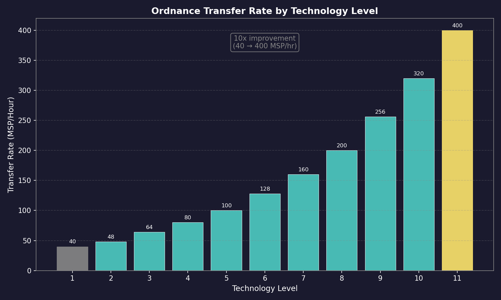

# 14.3 Supply Ships

*Updated: v2026.01.30*

Supply ships are the logistical backbone of extended fleet operations in Aurora C#. They carry fuel, ordnance, maintenance supplies, and other consumables to keep combat fleets operational far from their home bases. A well-designed logistics train is the difference between a fleet that can sustain offensive operations and one that must constantly retreat to resupply.

## 14.3.1 Colliers and Tankers

*Updated: v2026.01.30*

The two primary types of supply ships are tankers (carrying fuel) and colliers (carrying ordnance). Each fills a distinct role in fleet logistics.

**Tankers**

Tankers carry excess fuel for distribution to other ships in their task group or to other task groups:

- **Fuel Tankage Component:** The dedicated ship component (see [Section 8.6 Other Components](../8-ship-design/8.6-other-components.md)) for carrying distributable fuel. This is distinct from the ship's own fuel tanks; fuel in tankage is explicitly for transfer to other vessels
- **Capacity:** Tanker capacity is determined by the number and size of fuel tankage components installed
- **Refueling Operations:** Tankers can transfer fuel to other ships through the task group orders system
- **Design Priority:** Tankers should prioritize fuel capacity, with just enough engine power and self-fuel for transit operations

**Colliers**

Colliers carry missile ordnance and other ammunition for resupply of combat ships:

- **Magazine Component:** Colliers use magazine capacity to store ordnance for distribution. This is the same component type used on combat ships for their own ammunition
- **Ordnance Transfer System:** Colliers must be equipped with an Ordnance Transfer System (10 HS / 500-ton ship component, 20-200 BP depending on tech level) \hyperlink{ref-14.3-1}{[1]} to transfer ordnance to other ships in space. Without this system, transfers can only occur at stationary facilities (see Ordnance Transfer Infrastructure below). Only one Ordnance Transfer System can be added per ship.
- **Transfer Rate:** The rate is governed by the Ordnance Transfer System technology level, ranging from 40 MSP per hour (baseline) to 400 MSP per hour (tech level 11), across 11 tech levels \hyperlink{ref-14.3-2}{[2]}. Ship-mounted systems can only service one vessel at a time
- **Ordnance Selection:** Colliers must be loaded with the correct ordnance types for the combat ships they support; a collier loaded with anti-ship missiles cannot resupply a point defense frigate that needs defensive missiles
- **Fleet Transfer Orders:** Colliers can be assigned Load, Replace, or Remove fleet/sub-fleet statuses to automate ordnance distribution (see Ordnance Transfer Infrastructure below for details)
- **Reload Time:** Transferring ordnance takes time proportional to the MSP value of missiles being transferred and the technology level of the transfer system

**Combined Supply Ships**

Some players design combined logistics vessels that carry both fuel and ordnance:

- **Advantages:** Fewer ship classes to manage, a single vessel can provide both types of resupply
- **Disadvantages:** Less efficient per ton of hull than dedicated designs; if you need fuel but not ordnance (or vice versa), you are transporting unused capacity
- **Decision Point:** For small navies, combined ships reduce complexity. For large navies, dedicated tankers and colliers provide better efficiency

**Supply Ship Classes Example**

A typical logistics fleet might include:

| Ship Type | Primary Cargo | Typical Size | Role |
|-----------|--------------|--------------|------|
| Fleet Tanker | Fuel | 30,000-50,000 tons | Accompanies combat fleet |
| Station Tanker | Fuel | 50,000-100,000 tons | Shuttle runs between base and depot |
| Fleet Collier | Ordnance | 20,000-40,000 tons | Accompanies missile-heavy fleet |
| Supply Ship | Fuel + Ordnance + MSP | 40,000-60,000 tons | General purpose logistics |

**Practical Tips:**

- A missile-heavy fleet without collier support is a one-shot weapon; after the magazines are empty, your ships become expensive sensor platforms
- Tankers are needed by virtually every fleet; fuel consumption during combat maneuvering can be dramatic
- Load colliers with the specific ordnance types your combat ships use before departing; loading the wrong missiles is a surprisingly common error
- Consider the transit time between your supply base and operational area when determining how many supply ships you need; longer distances require more ships to maintain continuous supply

## 14.3.2 Supply Ship Design

*Updated: v2026.01.30*

Designing effective supply ships requires balancing capacity, speed, protection, and cost. A supply ship that cannot keep up with its fleet or that is destroyed at the first sign of combat provides no logistical value.

**Speed Considerations**

Supply ship speed relative to the combat fleet they support is a critical design parameter:

- **Fleet Speed Match:** If supply ships accompany the combat fleet, they must match fleet speed or they slow the entire formation
- **Convoy Speed:** Alternatively, supply ships can operate in separate, slower convoys that meet the combat fleet at predetermined points
- **Speed vs. Capacity Trade-off:** Faster engines consume hull space that could be used for cargo capacity. A 5,000 km/s tanker carries significantly more fuel than a 10,000 km/s tanker of the same tonnage
- **Recommendation:** For most navies, supply ships should be designed at 60-80% of combat fleet speed, operating in a logistics train that follows the combat force rather than integrating with it

**Protection**

Supply ships are high-value targets that must survive long enough to complete their mission:

- **Armor:** A single layer of armor provides protection against minor damage but adds significant mass. Consider the threat environment when deciding on armor levels
- **Shields:** Shields protect without permanent mass cost but require power generation capacity
- **Point Defense:** Minimal point defense capability can protect against missile attack during resupply operations
- **Escort:** The most effective protection for supply ships is dedicated escort vessels rather than self-defense capability
- **Signature:** Supply ships are typically large and have notable thermal/EM signatures; stealth is generally impractical

**Capacity Optimization**

Maximizing useful cargo capacity per ton of hull:

- **Minimize Combat Systems:** Supply ships should not carry offensive weapons; every ton of weapons is a ton of lost cargo capacity
- **Efficient Engines:** Use fuel-efficient (low power) engines rather than high-performance ones; supply ships rarely need to sprint
- **Engineering Spaces:** Include adequate engineering spaces for maintenance life, but do not over-allocate
- **Crew Quarters:** Minimum crew requirements only; supply ships do not need extra crew

**MSP Supply Ships**

Some designs carry Maintenance Supply Points rather than fuel or ordnance:

- **Maintenance Storage Component:** Provides MSP capacity for distribution to fleet ships
- **Use Case:** Fleets on extended deployments far from colonies benefit from MSP resupply
- **Combined Design:** MSP capacity can be included on tankers or colliers as a secondary capability

**Example Supply Ship Design Philosophy**

For a fleet operating 3-4 jump points from home:

1. **Speed:** 4,000-6,000 km/s (slower than combat fleet but fast enough for timely resupply)
2. **Fuel Capacity:** Enough to refuel the entire combat fleet at least once
3. **Ordnance:** Enough missiles for one full reload of all missile ships
4. **MSP:** Enough for 6 months of anticipated maintenance needs
5. **Protection:** One layer of armor, minimal shields
6. **Range:** Sufficient fuel for own transit plus reserve

**Practical Tips:**

- Design supply ships to be built in commercial shipyards if possible; commercial yards are typically larger and cheaper to operate, and supply ships do not require naval yard construction
- Build supply ships larger rather than smaller; the per-ton efficiency of logistics capacity improves with scale
- Include a small fuel reserve beyond what you plan to distribute; a tanker that runs out of its own fuel delivering cargo is useless
- Consider designing modular supply ships that can be quickly refitted between tanker and collier roles as needs change
- Your supply fleet should be sized to support your combat fleet's worst-case consumption; if your battle plan calls for three missile salvos, your colliers should carry three full reloads

## 14.3.3 Ordnance Transfer Mechanics

*Updated: v2026.01.30*

In C# Aurora, ordnance transfer is no longer instantaneous. Transfers now require specialized equipment and time, adding a significant logistical dimension to fleet ordnance management.

### 14.3.3.1 Transfer Infrastructure

Ships cannot exchange ordnance in space without specific infrastructure. Valid transfer locations include:

| Facility | Cost (BP) | Size | Simultaneous Ships | Notes |
|----------|-----------|------|--------------------|-------|
| Spaceport | 3,000 | 1,000,000 cargo points | Unlimited | Uses highest tech transfer rate \hyperlink{ref-14.3-3}{[3]} |
| Ordnance Transfer Station | 1,200 | 250,000 cargo points | Unlimited | Frontier ordnance support \hyperlink{ref-14.3-4}{[4]} |
| Ordnance Transfer Hub | 2,400 | 2,000 HS / 100,000 tons (ship component) | Unlimited | Deep-space stations \hyperlink{ref-14.3-5}{[5]} |
| Ordnance Transfer System | 20-200 | 10 HS / 500 tons (ship component) | 1 ship at a time | Tech-dependent cost \hyperlink{ref-14.3-1}{[1]} |
| Military Hangar Bay | Varies | Ship component | Varies | Built into carriers |

All stationary facilities (Spaceports, Transfer Stations) use the highest available tech level and can service unlimited ships simultaneously, provided those ships remain stationary.

**Important:** Multiple installations at the same colony do not stack transfer rates -- they function as a single transfer point. However, multiple Ordnance Transfer Hubs on different bases provide redundant ordnance supplies (though not increased rates).

### 14.3.3.2 Ordnance Transfer Technology

A dedicated technology line governs transfer speed:

- **Baseline:** Ordnance Transfer System: 40 MSP per hour \hyperlink{ref-14.3-2}{[2]}
- **Maximum (Tech Level 11):** 400 MSP per hour (research cost: 1,000,000 RP) \hyperlink{ref-14.3-2}{[2]}
- Ten intermediate tech levels exist between baseline and maximum (48, 64, 80, 100, 128, 160, 200, 256, 320 MSP/hr) \hyperlink{ref-14.3-2}{[2]}

The ship-mounted Ordnance Transfer System (500 tons) can only transfer to or from one vessel at a time, unlike stationary facilities.

### 14.3.3.3 Fleet Ordnance Transfer Orders

Seven ordnance transfer statuses can be assigned to colliers for fleet-based operations:

**Load Operations** (Load Fleet / Load Sub-Fleet):

- Colliers automatically refill magazines matching the target ship's class loadout
- Loading starts with the largest missiles first
- Only adds missiles -- does not remove non-matching ordnance already aboard

**Replace Operations** (Replace Fleet / Replace Sub-Fleet):

- Removes non-matching missiles while adding class loadout ordnance
- Alternates between removal and loading as needed to achieve correct configurations
- Use this when ships have been loaded with incorrect ordnance types

**Remove Operations** (Remove Fleet / Remove Sub-Fleet):

- Unloads all missiles from target ships into collier storage
- Used to clear ship magazines entirely

### 14.3.3.4 Specialized Transfer Orders

**Join and Transfer Orders:** Six variants allow a collier to join a target fleet and automatically begin ordnance transfer operations with the appropriate status (load/replace/remove for fleet or sub-fleet).

**Ordnance Transfer Hub Orders:**

- Load from Ordnance Transfer Hub
- Replace at Ordnance Transfer Hub
- Unload to Ordnance Transfer Hub

**Colony-Based Operations:** Colonies require either a Spaceport or an Ordnance Transfer Station to facilitate transfers. Ships in orbit of a colony without either facility cannot load or unload ordnance.

### 14.3.3.5 Ship Ordnance Templates

Ship ordnance templates allow individual vessels to override their parent class ordnance loadout, providing flexible per-ship customization.

**Template Hierarchy:**

- If a template exists at the individual ship level, it overrides the parent class template when the ship loads ordnance
- If no ship-level template exists, the system defaults to the parent class template

**Template Management:**

- Accessed through the Naval Organization window's Ship section (dedicated Ordnance Template tab)
- Displays: current class template, individual ship template (if any), and actual current loadout
- You can copy the existing class template into the ship template for minor modifications
- You can rename and obsolete missiles from this tab

**Practical Application:** This enables tactical specialization within a class. For example, one destroyer might use an anti-ship missile loadout while a sister ship of the same class carries an anti-missile defensive loadout, without requiring separate class definitions. This is especially useful for reconnaissance variants, electronic warfare specializations, or mixed-role squadrons.

### 14.3.3.6 Underway Replenishment Technology

The Underway Replenishment technology allows ordnance transfers while ships are in motion:

- **Early Technology:** Enables transfers at 20% of the normal stationary rate (research cost: 2,500 RP) \hyperlink{ref-14.3-6}{[6]}
- **Maximum Technology:** Enables transfers at 100% of the normal rate while fleets remain together and moving (research cost: 40,000 RP) \hyperlink{ref-14.3-6}{[6]}
- Three intermediate tech levels exist (30%, 45%, 70%) \hyperlink{ref-14.3-6}{[6]}

This capability is critical for sustained operations where stopping to rearm exposes the fleet to attack or delays time-critical missions.

> **Tip:** The ordnance transfer system requires significantly more logistical planning than the instantaneous transfers of VB6 Aurora. Establish ordnance infrastructure at every major base and frontier colony. A fleet that expends its missiles far from a transfer facility is combat-ineffective until it can return or a collier reaches it.

> **Tip:** Use ship-level ordnance templates to create specialized loadouts within a class rather than designing entirely new ship classes. This is far more economical than maintaining separate designs for each missile mix.

## 14.3.4 Cargo Handling and Load Times

*Updated: v2026.01.30*

Cargo loading and unloading times in Aurora C# are governed by a multiplicative modifier system that accounts for ship equipment, command structure, and planetary facilities.

### 14.3.4.1 Base Transfer Rates

The base transfer rates in C# Aurora are \hyperlink{ref-14.3-8}{[8]}:

- **Cargo:** 20 seconds per cargo point
- **Colonists:** 10 seconds per colonist
- **Maintenance Supplies:** 6 minutes per MSP

These rates have been reduced approximately 45% from VB6 Aurora (which used 36 seconds per cargo point and 18 seconds per colonist).

### 14.3.4.2 Load Time Reduction

Load times are reduced by dividing by various factors \hyperlink{ref-14.3-8}{[8]}:

1. **Cargo Shuttle Bays:** Divide by the cargo handling multiplier (based on shuttle technology level)
2. **Spaceports/Cargo Shuttle Stations:** Divide by (facility level + 1)
3. **Logistics Bonuses:** Multiply by (1 - bonus percentage) for:
   - Ship's Naval Admin Command logistics bonus
   - Ship commander's logistics bonus
   - Colony governor's logistics bonus

**Example Calculation:**

A freighter with five cargo holds (5 x 50 hours = 250 hours base) with two cargo shuttle bays (dividing by 2 x 5 = 10) = 25 hours. At a level 1 spaceport (divide by 2) = 12.5 hours. With a 15% admin command logistics bonus (x 0.85) = 10.6 hours. With a 25% governor bonus (x 0.75) = 8 hours. With a 10% commander bonus (x 0.9) = 7.2 hours.

### 14.3.4.3 Facility Bonuses

If there are one or more Spaceports or Cargo Shuttle Stations on the planet, the load time is divided by (combined facility level + 1) \hyperlink{ref-14.3-8}{[8]}. Multiple facilities at the same colony do not stack transfer rates beyond the single facility bonus.

### 14.3.4.4 Command Structure Rules

- An admin command must have a commander for its bonus to apply
- That bonus applies even if the individual ship does not have its own commander
- Higher-level admin commands in an unbroken chain of command contribute their bonuses simultaneously
- Planetary and system governors also contribute their logistics bonuses to the calculation

### 14.3.4.5 Setting Up a Logistics Admin Command

To benefit from the Admin Command Bonus in the cargo handling formula, you must establish a Logistics-type admin command and assign your cargo ships to it. The setup process is as follows:

1. **Create the Admin Command:** Open the Naval Organization window (F12) and create a new Admin Command under your top-level command. Set its type to "Logistics" (see [Section 9.4 Fleet Organization](../9-fleet-management/9.4-fleet-organization.md) for the seven command types).

2. **Assign a Commander:** Assign an officer with a strong logistics bonus to the Logistics Admin Command. The commander's logistics rating directly multiplies cargo loading speed through the Cargo Handling Modifier formula. Without a commander assigned, the admin command provides no bonus.

3. **Attach Fleets:** Attach your cargo and transport fleets to the Logistics Admin Command. All ships within attached fleets receive the commander's logistics bonus for cargo operations, even if the individual ships lack their own commanders.

4. **Verify Chain of Command:** Ensure an unbroken chain of command exists between the Logistics Admin Command and your top-level command. If higher-level admin commands in the chain also have commanders with logistics bonuses, those bonuses compound multiplicatively.

5. **Command Radius:** Confirm that your cargo ships operate within the admin command's command radius. The radius doubles with each level increase (see [Section 9.4 Fleet Organization](../9-fleet-management/9.4-fleet-organization.md) for radius progression).

**Logistics Command Bonuses:**

The Logistics admin command type provides the following bonuses to attached fleets:

| Bonus Type | Effect |
|-----------|--------|
| Cargo Load/Unload Speed | Commander's logistics bonus multiplies cargo handling modifier |
| Mining Operations | Reduced bonus (secondary effect) |
| Terraforming Operations | Reduced bonus (secondary effect) |

**Automated Logistics:**

For automated cargo operations (standing orders, conditional resupply runs), ships must be properly assigned to a Logistics Admin Command structure. Ships not attached to any admin command, or attached to a non-Logistics command type, do not receive the cargo handling speed bonus. This makes the difference between a 20-hour loading cycle and a 5-hour one for large freighters.

**Practical Example:**

A 50,000-ton freighter with 2 cargo shuttle bays, operating under a Logistics Admin Command with a commander who has a 150% logistics bonus, loading at a colony with a Spaceport:

- Without admin command: 2 (shuttle bays) x 1 (no command bonus) x 1 (spaceport) = modifier of 2
- With Logistics admin command: 2 (shuttle bays) x 1.5 (command bonus) x 1 (spaceport) = modifier of 3
- Loading time reduction: 33% faster with the admin command in place

Adding a governor with logistics bonus and a sector command with its own logistics-rated commander compounds further.

> **Tip:** To minimise load times, ensure your cargo ships have adequate cargo shuttle bays, operate under a Logistics admin command with a commander who has a strong logistics bonus, and load/unload at colonies with a Spaceport. The multiplicative nature of the formula means even small bonuses at each level compound significantly.

> **Tip:** When setting up automated cargo runs between colonies, always attach the transport fleet to a Logistics Admin Command first. The speed difference for repeated loading cycles over dozens of trips is substantial -- potentially saving months of game time over the course of a campaign.

## 14.3.5 Shipping Line Earnings and Tax

*Updated: v2026.01.30*

Civilian shipping lines generate income based on distance traveled. In C# Aurora, the payment and tax system was redesigned to account for multi-system distances.

**Payment Structure:**

- All VB6 payment rates are halved as a baseline but multiplied by the number of systems traveled \hyperlink{ref-14.3-9}{[9]}
- A ship traveling two systems receives the equivalent of the old VB6 payment rate \hyperlink{ref-14.3-9}{[9]}
- A ship traveling five systems receives 250% of the original VB6 rate \hyperlink{ref-14.3-9}{[9]}

**Same-System Travel:**

- Compensation is half of the one-system rate (which is itself half what was paid in VB6)
- This reduced rate applies to both shipping line payments and government taxes

**Tax Revenue:**

- Tax rates scale similarly with distance but are NOT halved as a baseline
- This means overall government tax revenue from civilian shipping is higher than the equivalent VB6 scenario
- Multi-system trade routes generate proportionally more tax revenue

**Distance Multiplier Formula:**

- Payment = (Base Rate / 2) x Number of Systems Traveled \hyperlink{ref-14.3-9}{[9]}
- Tax = Base Rate x Number of Systems Traveled (tax rates are not halved as a baseline) \hyperlink{ref-14.3-9}{[9]}

**Design Intent:** This mechanic reduces early-game civilian traffic bloating (when distances are short and ships make frequent short trips) while making long-distance trade viable in the later game when jump point generation creates routes spanning many systems. The system rewards players who develop extensive trade networks across multiple systems.

> **Tip:** Encourage civilian shipping to use longer routes by establishing colonies and outposts across multiple systems. The distance multiplier means a five-system trade route generates far more revenue and tax than five one-system routes.

## 14.3.6 Deployment, Overcrowding, and Life Support

*Updated: v2026.01.30*

Military ships and geological survey vessels maintain a deployment clock that tracks how long they have been away from rest. This clock directly affects crew morale and combat effectiveness.

### 14.3.6.1 Deployment Clock

- The deployment clock is displayed in months and advances when ships are away from recreational locations
- **Recreational Locations**: Ships with recreational modules, or populations of at least 50,000 people \hyperlink{ref-14.3-7}{[7]}
- At recreational sites, deployment clocks reduce at 10x the passage rate \hyperlink{ref-14.3-7}{[7]}
- **Parasites in Hangars**: Clock reduction = Time Passed x 10 x (1 - Mothership Deployment Modifier) *(unverified — [#837](https://github.com/ErikEvenson/aurora-manual/issues/837), requires live testing -- formula from AuroraWiki)*
- **Mothership Modifier** = Mothership Deployment Clock / Mothership Class Intended Deployment Time *(unverified — [#837](https://github.com/ErikEvenson/aurora-manual/issues/837), requires live testing -- formula from AuroraWiki)*

**Morale Calculations:**

- Baseline morale is 100% unless deployment clock exceeds intended deployment time
- When exceeded: Morale = Intended Deployment Time / Deployment Clock \hyperlink{ref-14.3-7}{[7]}
- Reduced crews multiply morale by: (Current Crew / Class Crew) x 2 \hyperlink{ref-14.3-7}{[7]}
- Morale floor: 25% minimum \hyperlink{ref-14.3-7}{[7]}

### 14.3.6.2 Overcrowding Rules

Personnel count includes crew, rescued survivors beyond cryogenic capacity, and flight crew berth capacity.

**Overcrowding Modifier:**

> Overcrowding Modifier = (Required Accommodation / Actual Accommodation)^2 \hyperlink{ref-14.3-7}{[7]}

For example, if a ship is 25% overcrowded, the modifier is 1.25 x 1.25 = 1.5625.

**Effects:**

- Deployment clock increases at Overcrowding Modifier x normal rate \hyperlink{ref-14.3-7}{[7]}
- If the modifier exceeds 1.5, life support risks damage \hyperlink{ref-14.3-7}{[7]}
- Failure chance per construction phase = Overcrowding Modifier x 100 x (Increment Length / Year Length) *(unverified — [#837](https://github.com/ErikEvenson/aurora-manual/issues/837), requires live testing -- formula from AuroraWiki)*
- Failed checks cause crew quarters damage (preventable with maintenance supplies)

### 14.3.6.3 Life Support Failure

When life support is destroyed, the consequences are severe:

- Deployment clock increases at 12x normal rate \hyperlink{ref-14.3-7}{[7]}
- Morale drops immediately to 10% \hyperlink{ref-14.3-7}{[7]}
- The crew takes casualties from 4% to 80% (4d20 roll) of the remaining crew each construction phase \hyperlink{ref-14.3-7}{[7]}
- Commanders have a death chance equal to half the crew casualty percentage \hyperlink{ref-14.3-7}{[7]}

## 14.3.7 Resupply Mechanics

*Updated: v2026.01.30*

Resupply in C# Aurora is no longer instantaneous. Ships must be stationary to receive supplies, and those without cargo shuttles cannot exchange maintenance supplies in space.

> **Note:** Aurora uses three distinct logistics terms that are often confused:
>
> - **Refuel** -- Transfer fuel (from tankers or colonies)
> - **Resupply** -- Transfer Maintenance Supply Points (MSP) specifically (from supply ships or colonies)
> - **Load Ordnance / Rearm** -- Transfer missiles and ammunition (from colliers or colonies)
>
> **Underway Replenishment** (UNREP) is a separate technology that allows any of these three transfers to occur while the fleet is moving, rather than requiring ships to be stationary. See [Section 14.3.8 Underway Replenishment Patterns](#1438-underway-replenishment-patterns) for details.

### 14.3.7.1 Supply Hierarchy

The supply hierarchy in Aurora C# flows top-down: parent commands supply their subordinate fleets and ships, not the reverse. This means:

- **Fleet-Level Tankers:** A tanker assigned to a fleet with "Refuel Fleet" status distributes fuel downward to all ships within that fleet. The parent fleet's logistics assets push supplies to subordinate vessels.
- **Sub-Fleet Distribution:** A tanker with "Refuel Sub-Fleet" status distributes fuel downward to ships within its own sub-fleet hierarchy.
- **Admin Command Structure:** Logistics Admin Commands at higher levels coordinate supply distribution to their attached subordinate fleets. The command hierarchy determines which assets are responsible for supplying which formations.
- **Collier Operations:** Colliers with Load/Replace/Remove Fleet or Sub-Fleet status push ordnance downward to subordinate combat ships based on their class templates.

This top-down model means you should position supply assets at or above the organizational level of the ships they support. A tanker attached to a parent fleet supplies all ships in that fleet; it does not push supplies upward to a higher-level command. Design your logistics organization so that supply ships are peers of or superior to the combat ships they serve.

### 14.3.7.2 Valid Resupply Locations

Ships can only resupply maintenance supplies at:

- Populations with spaceports
- Cargo shuttle stations
- Facilities with maintenance capability
- Ships equipped with cargo shuttles

### 14.3.7.3 Maintenance Supply Transfer Rates

Maintenance supplies are transferred at the rate of 10 per hour, multiplied by the number of cargo shuttle bays and the racial shuttle technology \hyperlink{ref-14.3-8}{[8]}. Multiple ships can resupply simultaneously from spaceports, stations, and facilities, though they must remain stationary during the process.

### 14.3.7.4 Supply Transfer Process

Maintenance supplies transfer incrementally as time passes, similar to underway fuel replenishment. Supply ships can transfer supplies during each movement increment until target vessels reach full capacity.

### 14.3.7.5 Resupply Orders

There are five fleet orders specifically for Maintenance Supply Point (MSP) transfers:

1. **Resupply from Colony** -- Load MSP from a colony's maintenance stockpile
2. **Resupply Target Fleet** -- Transfer MSP to a target fleet from your supply ships
3. **Resupply from Target Fleet** -- Receive MSP from a target fleet's supply ships
4. **Resupply from own Supply Ships** -- Draw MSP from supply ships within your own fleet
5. **Unload 90% Maint Supplies to Colony** -- Deposit MSP at a colony, retaining 10% reserves

Combination orders allow resupply to occur simultaneously with other logistics actions (see [Section 9.5.3.4 Combination Orders](../9-fleet-management/9.5-orders.md#9534-combination-orders)), such as "Refuel, Resupply, Load Ordnance from Colony" which performs all three in parallel.

### 14.3.7.6 Minimum Supply Levels

Ship classes can specify minimum maintenance supply and fuel levels to prevent complete depletion during transfers.

## 14.3.8 Underway Replenishment Patterns

*Updated: v2026.01.30*

Underway replenishment (UNREP) is the process of resupplying ships while deployed, without requiring them to return to a colony or base. This capability is essential for sustained offensive operations and long-range deployments.

**UNREP Mechanics**

Underway replenishment in Aurora C# works through the task group order system and the Ordnance Transfer technology line (see Ordnance Transfer Infrastructure above for detailed transfer infrastructure):

- **Proximity Requirement:** The supply ship and receiving ship must be in the same location (orbit of the same body, or the same spatial coordinates)
- **Order Types:** Refuel from tanker, rearm from collier (using Load/Replace/Remove fleet orders), resupply MSP
- **Transfer Rate:** Ordnance transfer rate is governed by the Ordnance Transfer System technology (40-400 MSP/hour). Underway replenishment tech allows 20-100% of normal rate while moving
- **Automatic Resupply:** Task groups can be configured to automatically resupply from attached logistics vessels when supplies drop below a threshold
- **Equipment Required:** Ordnance transfers require either a ship-mounted Ordnance Transfer System or proximity to a stationary facility (Spaceport, Transfer Station, or Transfer Hub)

**Resupply Patterns**

Several common UNREP patterns are used by experienced players:

**1. Embedded Logistics**

Supply ships travel as part of the combat task group:

- Advantages: Always available, no coordination required
- Disadvantages: Supply ships slow the task group to their speed, and are present during combat (vulnerable)
- Best for: Defensive operations, patrol circuits

**2. Trailing Logistics Train**

Supply ships travel in a separate task group behind the combat fleet:

- Advantages: Combat fleet moves at full speed, supply ships not exposed to initial combat
- Disadvantages: Requires coordination, combat fleet may outrun its logistics
- Best for: Offensive operations, fleet advances into enemy territory

**3. Forward Depot Shuttle**

Supply ships make regular runs between a forward depot and the combat fleet:

- Advantages: Combat fleet never waits for supply ships, continuous resupply pipeline
- Disadvantages: Requires established forward depot, shuttle ships are vulnerable to interdiction
- Best for: Sustained operations in a fixed area, siege operations

**4. Rally Point Resupply**

Combat fleet and supply ships meet at predetermined points for resupply:

- Advantages: Supply ships avoid combat entirely, predictable scheduling
- Disadvantages: Rigid schedule, combat fleet must disengage to resupply
- Best for: Long-range raids, independent operations

**Refueling Considerations**

When conducting fuel UNREP:

- Ships refuel proportionally; each ship in the task group receives fuel based on its capacity relative to available fuel
- Monitor fuel levels after refueling to ensure all ships received adequate fuel
- Plan refueling intervals based on the most fuel-hungry ship in the task group
- A ship with 0% fuel is immobile; always refuel before reaching critical levels

**Rearming Considerations**

When conducting ordnance UNREP:

- The collier must carry the exact ordnance types needed by the receiving ships
- Ships reload their magazines to capacity if sufficient ordnance is available
- Rearming takes longer than refueling; plan for the time required
- Partially loaded magazines still provide combat capability; do not wait for full reload if the tactical situation demands immediate action

**Practical Tips:**

- Establish a fuel threshold for your combat task groups (e.g., refuel when any ship drops below 40%); do not wait until ships are nearly empty
- After a major missile engagement, immediately check ordnance levels and arrange resupply; a fleet without missiles is a fleet without its primary weapon
- When operating multiple task groups, designate one as the logistics coordinator to avoid duplicate resupply requests
- Practice your UNREP procedures during peacetime; working out the logistics before combat ensures smooth operations when it matters
- Protect your supply lines; an enemy that interdicts your logistics train can defeat your combat fleet without ever engaging it directly
- Consider the fuel cost of the UNREP itself; supply ships burn fuel too, and a tanker that uses half its cargo reaching the fleet is only half as useful

## Related Sections

- [Section 8.6 Other Components](../8-ship-design/8.6-other-components.md) -- Fuel tankage, magazine, and cargo component design
- [Section 9.5 Orders](../9-fleet-management/9.5-orders.md) -- Fleet orders for resupply operations
- [Section 12.3 Missiles](../12-combat/12.3-missiles.md) -- Ordnance types and missile consumption
- [Section 14.1 Fuel](14.1-fuel.md) -- Fuel production and distribution
- [Section 14.2 Maintenance](14.2-maintenance.md) -- MSP supply and maintenance operations
- [Section 16.2 Skills and Bonuses](../16-commanders/16.2-skills-and-bonuses.md) -- Logistics commander bonuses

## References

\hypertarget{ref-14.3-1}{[1]}. Aurora C# game database (AuroraDB.db v2.7.1) -- FCT_ShipDesignComponents, ComponentTypeID=63 (Ordnance Transfer System). Baseline: SDComponentID=65765, Size=10 HS (500 tons), Cost=20 BP, ComponentValue=40 (MSP/hr). Maximum: SDComponentID=65775, Cost=200 BP, ComponentValue=400 (MSP/hr).

\hypertarget{ref-14.3-2}{[2]}. Aurora C# game database (AuroraDB.db v2.7.1) -- FCT_TechSystem, TechTypeID=217 (Ordnance Transfer System). 11 tech levels from 40 MSP/hr (1,000 RP) to 400 MSP/hr (1,000,000 RP). Intermediate values: 48, 64, 80, 100, 128, 160, 200, 256, 320 MSP/hr.

\hypertarget{ref-14.3-3}{[3]}. Aurora C# game database (AuroraDB.db v2.7.1) -- DIM_PlanetaryInstallation, PlanetaryInstallationID=33 (Spaceport). Verified: Cost=3,000 BP, CargoPoints=1,000,000. Minerals: 400 Duranium, 400 Corbomite, 1,400 Boronide, 400 Mercassium, 400 Uridium.

\hypertarget{ref-14.3-4}{[4]}. Aurora C# game database (AuroraDB.db v2.7.1) -- DIM_PlanetaryInstallation, PlanetaryInstallationID=45 (Ordnance Transfer Station). Verified: Cost=1,200 BP, CargoPoints=250,000. Minerals: 300 Duranium, 900 Boronide.

\hypertarget{ref-14.3-5}{[5]}. Aurora C# game database (AuroraDB.db v2.7.1) -- FCT_ShipDesignComponents, SDComponentID=65776 (Ordnance Transfer Hub). Verified: Size=2,000 HS (100,000 tons), Cost=2,400 BP. Minerals: 600 Duranium, 1,800 Boronide.

\hypertarget{ref-14.3-6}{[6]}. Aurora C# game database (AuroraDB.db v2.7.1) -- FCT_TechSystem, TechTypeID=212 (Underway Replenishment). 5 tech levels: 20% (2,500 RP), 30% (5,000 RP), 45% (10,000 RP), 70% (20,000 RP), 100% (40,000 RP).

\hypertarget{ref-14.3-7}{[7]}. AuroraWiki -- C-Ship_Crew (http://aurorawiki2.pentarch.org/index.php?title=C-Ship_Crew) -- Deployment clock, morale, overcrowding, and life support mechanics.

\hypertarget{ref-14.3-8}{[8]}. AuroraWiki -- C-Ship_Tasks and C-Ship_Modules (https://aurorawiki2.pentarch.org/index.php?title=C-Ship_Tasks, https://aurorawiki2.pentarch.org/index.php?title=C-Ship_Modules) -- Cargo transfer rates, MSP transfer rates, shuttle bay mechanics.

\hypertarget{ref-14.3-9}{[9]}. AuroraWiki -- C-Civilian_Economy (https://aurorawiki2.pentarch.org/index.php?title=C-Civilian_Economy) -- Shipping line payment and tax mechanics, VB6 vs C# differences.
