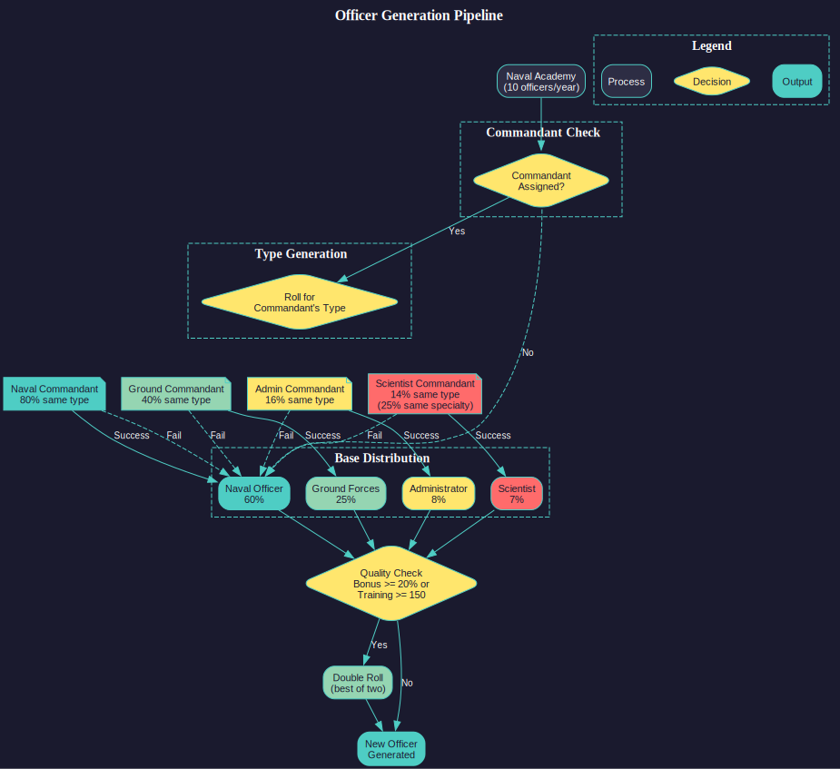
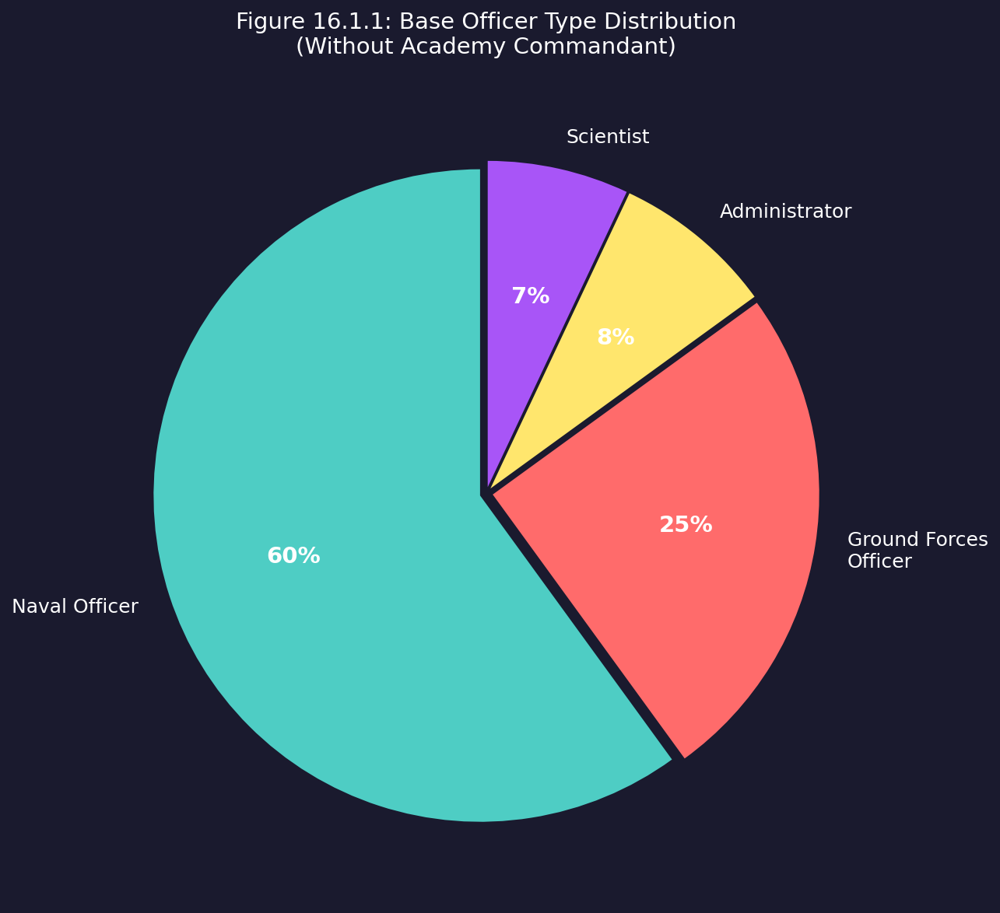
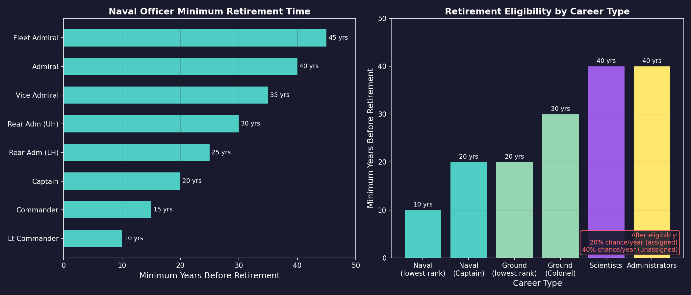

# 16.1 Officer Generation

*Updated: v2026.01.30*

## 16.1.1 How Officers Are Created

*Updated: v2026.01.30*

Officers in Aurora C# are the named individuals who command your ships, govern your colonies, lead your research, and manage your military installations. They are generated automatically by the game and possess unique names, skills, and attributes that affect their performance in assigned roles.

### 16.1.1.1 Initial Officers

When you start a new game, your empire begins with a pool of officers already available. As of v2.0.3, the minimum number of starting commanders is **300** (doubled from the previous 150) *(unverified — [#709](https://github.com/ErikEvenson/aurora-manual/issues/709))*, ensuring adequate initial coverage for fleet and ground force assignments. The initial officer corps is generated during race setup using a ratio-based promotion system before gameplay begins, distinct from the on-demand promotion system used during the game.

**Initial Promotion Ratios:**

- Naval officers: 2:1 (two officers at each lower rank for every one promoted) *(unverified — [#709](https://github.com/ErikEvenson/aurora-manual/issues/709))*
- Ground force officers: 4:1 *(unverified — [#709](https://github.com/ErikEvenson/aurora-manual/issues/709))*

Once gameplay commences, promotion is on-demand (or manual) only -- no further automatic ratio-based promotions occur.

**Promotion Mechanics:** *(unverified — [#867](https://github.com/ErikEvenson/aurora-manual/issues/867))*

- **One-year cooling-off period:** Officers cannot receive multiple consecutive promotions. After being promoted, an officer must wait at least one year before becoming eligible for another promotion.
- **Promotion score as tiebreaker:** When multiple officers are eligible for promotion with the same primary skill, the promotion score determines precedence. Otherwise, primary skill is the deciding factor.
- **Naval ranks:** Cannot be manually changed (except "Senior Officer" checkbox)
- **Ground ranks:** Can be manually overridden via "Change Rank" button -- default ground ranks are often incorrect and need adjustment

**Starting Commander Ages:**

Starting commanders receive calculated ages to reflect appropriate seniority:

- **Base Age**: 21 + Random(5) years old *(unverified — [#709](https://github.com/ErikEvenson/aurora-manual/issues/709))*
- **Rank Adjustment**: For each rank promoted during initial creation, age increments by 2 + Random(5) years *(unverified — [#709](https://github.com/ErikEvenson/aurora-manual/issues/709))*

Aurora tracks age by calculating career start date versus current date plus 21 years. Starting officers have their career start dates set prior to game start, creating experienced commanders with appropriate ages from the beginning.

### 16.1.1.2 Naval Academies

The primary mechanism for generating new officers is the Naval Academy (also called Military Academy). These are ground installations (see [Section 5.4 Infrastructure](../5-colonies/5.4-infrastructure.md)) costing 2,400 BP and 1,200 Duranium \hyperlink{ref-16.1-5}{[5]} that produce new officers over time. Each academy produces ten officers per year. *(unverified — [#709](https://github.com/ErikEvenson/aurora-manual/issues/709) -- generation rate is game logic)*

**Base Officer Type Distribution:**

Without a commandant influencing the academy, new officers are generated with the following type distribution \hyperlink{ref-16.1-1}{[1]}:

| Type | Probability |
|------|------------|
| Naval Officer | 60% |
| Ground Forces Officer | 25% |
| Administrator | 8% |
| Scientist | 7% |

You can construct additional academies to increase your officer generation rate. Larger empires with many ships and colonies need more academies to avoid officer shortages.

**Academy Quality Setting:**

*Added: v2026.01.28*

The Race window's Academies tab contains a quality vs quantity setting that affects all academies empire-wide. Values range from 1 to 5:

| Setting | Effect |
|---------|--------|
| 1 | Maximum quantity, minimum quality (default) |
| 3 | Balanced |
| 5 | Maximum quality, minimum quantity |

This setting trades off officer production rate against the quality of graduates. Higher quality settings produce officers with better starting skills and bonuses, but at a reduced rate. Lower quality settings produce more officers but with average or below-average capabilities.

> **Tip:** The default setting of 1 prioritizes quantity, which is appropriate for early game when you need to fill many ship commands quickly. Once your officer corps is established, consider increasing to 3-5 to produce higher-quality officers.

### 16.1.1.3 Academy Commandants

Academy Commandants are commanders assigned to military academies at populated worlds. They influence both the type and quality of officers generated from those academies.

**Commandant Display:**

The Academy Commandant at each colony (see [Section 5.1 Establishing Colonies](../5-colonies/5.1-establishing-colonies.md)) with one or more military academies is displayed in the Economics window on the Governor tab, beneath the planetary governor information. This allows players to easily identify and monitor military academy leadership across their colonies.

**Commandant Eligibility \hyperlink{ref-16.1-1}{[1]}:**

Different commander types have specific eligibility criteria to serve as commandant:

- **Civilian Administrators**: Admin Rating must equal or exceed the number of military academies at that population.
- **Scientists**: Research Administration rating must be at least five times the number of military academies.
- **Naval/Ground Officers**: Rank must be equal to or greater than the number of military academies (rank 1 = lowest).

**Effect on Officer Type Generation:**

When a commandant is assigned, the academy first checks whether the new officer matches the commandant's type before applying the base distribution \hyperlink{ref-16.1-1}{[1]}:

| Commandant Type | Chance to Generate Same Type |
|----------------|------------------------------|
| Naval Officer | 80% |
| Ground Forces Officer | 40% |
| Scientist | 14% |
| Administrator | 16% |

If the commandant check fails, the normal officer type distribution is used.

**Effect on Officer Quality:**

When a commandant possesses percentage-based bonuses at 20% or higher, or crew/ground training ratings of 150+, newly graduated commanders receive two rolls for each qualifying bonus and use the superior result \hyperlink{ref-16.1-1}{[1]}. This allows specializing academies across different colonies to cultivate tailored officer corps for specific military roles.

When a scientist serves as commandant, there is a 25% chance any scientist generated from that academy will have the same research specialization as the commandant \hyperlink{ref-16.1-1}{[1]}.

### 16.1.1.4 Academy Name Themes (v2.7.0)

Individual naval academies can be assigned their own name theme, independent of the race-level naming themes *(unverified — [#709](https://github.com/ErikEvenson/aurora-manual/issues/709))*. Graduates of an academy use that academy's assigned theme, allowing different colonies to produce officers with different cultural naming conventions. This is purely cosmetic but provides narrative flavor -- a colony established by settlers from a specific cultural background can produce appropriately-named officers.

### 16.1.1.5 Population-Based Generation

Beyond academies, your population passively generates a small number of officers over time. Larger populations produce more candidates. This represents talented individuals rising through civilian or military channels outside formal academy training.

## 16.1.2 Crew and Junior Officer Generation

*Updated: v2026.01.30*

While officers command ships, the enlisted crew and junior officers who operate them are generated separately based on your empire's population. The Race window displays annual crew and junior officer generation rates, which represent the finite manpower pool available to staff your navy.

### 16.1.2.1 Annual Generation Rates

The Race window shows two key crew generation figures:

- **Annual Crew Generation:** The number of enlisted crew members produced per year, derived from your total population size. Larger populations generate more crew annually.
- **Annual Junior Officer Generation:** The number of junior officers (distinct from the academy-trained commanders discussed above) produced per year, also population-based.

These rates update automatically as your population grows or shrinks across all colonies.

### 16.1.2.2 The Crew Pool

All generated crew and junior officers enter a shared pool from which ships draw when they are commissioned, transferred, or require replacement crew:

- **Finite Resource:** The crew pool is not unlimited. If your fleet requires more crew than the pool contains, newly constructed ships cannot be fully crewed until sufficient personnel become available.
- **Accumulation:** Crew generated each year accumulates in the pool if not immediately consumed by new ship commissions or crew replacements.
- **Consumption:** Each ship design specifies a crew requirement (see [Section 8.1 Design Philosophy](../8-ship-design/8.1-design-philosophy.md)) based on its components. When a ship is commissioned, its full crew complement is drawn from the pool.

### 16.1.2.3 Fleet Size Constraints

The annual crew generation rate is a fundamental constraint on fleet expansion:

- **Crew-Hungry Designs:** Ships with large crew requirements (carriers, battleships, ships with extensive engineering or combat departments) consume a disproportionate share of the crew pool. A single 50,000-ton battleship may require as many crew as ten 5,000-ton escorts.
- **Simultaneous Crewing:** The crew pool limits how many ships can be simultaneously crewed and operational. Building more ships than your crew pool can support results in unmanned vessels sitting idle in orbit.
- **Growth Planning:** When planning fleet expansions, check your annual crew generation rate against the total crew requirements of your planned ship classes. A navy that builds faster than it can crew is wasting mineral resources.
- **Population Investment:** Increasing crew generation requires growing your population through colonization, immigration, or natural growth. There is no technology that directly accelerates crew generation -- it is purely population-driven.

### 16.1.2.4 Design Implications

The crew generation mechanic has direct implications for ship design philosophy:

- **Automation vs. Crew:** Components that reduce crew requirements (automation systems, reduced crew quarters) become more valuable when crew is scarce. A design that requires 200 crew instead of 300 allows you to field 50% more ships from the same crew pool.
- **Small vs. Large Ships:** Many small ships typically require more total crew than fewer large ships of equivalent tonnage, though this depends on the specific designs. Evaluate total crew consumption when choosing between fleet doctrines.
- **Reserve Fleet:** Ships that are mothballed or placed in reserve release their crew back to the pool, making crew available for active vessels. Rotating ships through active and reserve status can stretch a limited crew pool.

> **Tip:** Check the Race window early in each campaign to understand your crew generation rate. If you are planning a large navy, ensure your population growth can sustain it. A common mistake is designing crew-intensive ships and then wondering why newly built vessels sit uncrewed for years.

> **Tip:** When crew is scarce, consider designing "lean" ship variants with reduced crew requirements for non-combat roles (survey ships, transports, tankers). Reserve your crew budget for the combat vessels that need full manning.

### 16.1.2.5 Ship Commander Rank Requirements

The required rank of a ship commander is set automatically by Aurora and defaults to the lowest race rank, unless one of the following component rules is activated:

**Rank +1 Requirements \hyperlink{ref-16.1-2}{[2]}:**

- Ships with geological/gravitational survey sensors, auxiliary control, science department, or jump drive

**Rank +2 Requirements \hyperlink{ref-16.1-2}{[2]}:**

- Ships with weapons, military hangar bays, main engineering, CIC, or flag bridge

**Exception:** Ships of 1000 tons or less default to the lowest rank requirement unless they contain control station components (Auxiliary Control, Science Department, Main Engineering, CIC) \hyperlink{ref-16.1-2}{[2]}.

**Senior C.O. Override:**

The Class Window includes a "Senior C.O." checkbox that allows players to manually designate specific ship classes as requiring one rank higher than the automatic rules determine. This provides control over command prestige for particular vessel types.

### 16.1.2.6 Additional Officer Positions

Ships can carry multiple officers in addition to the commander, with tiered rank requirements \hyperlink{ref-16.1-2}{[2]}:

- **Executive Officer, Science Officer, CAG**: One rank below the ship commander requirement.
- **Chief Engineer, Tactical Officer**: Two ranks below the ship commander requirement.

### 16.1.2.7 Officer Names and Name Themes

Aurora C# generates officer names using a robust Name Theme system managed through the Race window. Races can have unlimited Commander Name Themes, a significant expansion from earlier versions.

**Name Theme Configuration:**

- **Initial Setup**: When creating a race, you select a single theme as the default. Unless modified, 100% of generated commanders use this initial theme \hyperlink{ref-16.1-3}{[3]}.
- **Multiple Themes**: Players can assign additional themes, with each receiving a weighted value. When a new commander is generated, the name will be randomly assigned a theme based on the weight of each theme.
- **Visual Indicator**: The Race window displays the primary theme plus the count of additional themes in the top-left section.

**Key Features:**

- **Weighted Distribution**: Each theme has an assigned weight determining selection probability.
- **Automatic Assignment**: The system randomly selects themes when creating new commanders based on these weights.
- **Flexible Customization**: Players can adjust theme weights and add/remove themes at any point during the game.

**Commander Name Themes (v2.4.0):**

In addition to real-world cultural naming themes, the following science-fiction themed commander name options are available (primarily useful for NPRs) \hyperlink{ref-16.1-3}{[3]}:

- Andorian, Bajoran, Cardassian, Ferengi, Gorn, Klingon, Nausicaan, Tellarite, Vulcan

These themes use random name generation for the given theme and are intended for non-player races to establish thematic consistency across alien civilizations.

**Ship and System Naming Themes (v2.4.0):**

v2.4.0 also includes 80+ naming themes for ships, systems, and other entities across diverse categories \hyperlink{ref-16.1-3}{[3]}:

- **Geographic/Natural**: Antarctic/British Columbia/European Volcanoes, European/Indian Rivers, Himalayan Peaks, Scottish Lochs, Welsh Islands/Lakes/Mountains/Waterfalls
- **Cultural/Historical Cities**: Chinese, Indian, German, Dutch Towns and Cities, Texas locations (Cities, Counties, Rivers, Animals, Birds, Reptiles), Brazilian States, Italian Regions, Spanish Communities, French Provinces
- **Fantasy/Fictional**: Dragons, Tigers, Mythological Birds, Foundation Characters, Star Trek vessel themes (Bajoran, Ferengi, Vulcan, Andorian)
- **Literary/Abstract**: Shakespearean Idioms, Biblical Idioms, Virtues (standard, Benjamin Franklin, Roman variants)
- **Military/Historical**: British East India Company Ships, Clipper Ships, Irish Navy Ships, Space Shuttles
- **Scientific**: Constellations, Exoplanet Names, Four-Digit Numbers, Insect Species (Latin)

**Rank Structures (v2.4.0):**

Eight additional rank structures are available for NPR customization, themed around science-fiction species \hyperlink{ref-16.1-3}{[3]}:

- Klingon, Romulan, Cardassian, Bajoran, Ferengi, Vulcan, Andorian, Gorn

These function as cosmetic naming conventions for military ranks and can be selected during NPR setup alongside commander naming themes.

This system enables diverse commander naming conventions within a single race, supporting varied cultural or historical naming traditions within your empire.

### 16.1.2.8 The Commander Window

All officer management is handled through the Commanders window, accessible from the main toolbar. This window displays:

- **Available Officers**: Officers not currently assigned to any role.
- **Assigned Officers**: Officers currently filling a position, organized by assignment type.
- **Officer Details**: Selecting an officer shows their full attribute and skill breakdown.
- **Assignment Controls**: Tools for assigning, reassigning, and managing officer positions.

**Tip**: Keep an eye on your officer pipeline. If you are planning a major fleet expansion, start building additional academies well in advance. Ships without commanding officers suffer significant penalties, and you do not want a beautiful new task group sitting idle because you have no one qualified to lead it.

## 16.1.3 Officer Attributes

*Updated: v2026.01.30*

Every officer in Aurora C# has a set of fundamental attributes that define their capabilities and suitability for various roles.

### 16.1.3.1 Rank

Officers hold military ranks that determine which positions they can fill:

- **Ensign/Lieutenant**: Junior officers suitable for small ship commands or staff positions.
- **Commander/Captain**: Mid-rank officers who can command larger vessels or small task groups.
- **Rear Admiral/Vice Admiral**: Flag officers capable of commanding task groups and fleets.
- **Admiral/Fleet Admiral**: Senior flag officers for the largest fleet commands.

Rank increases through promotion (see [Section 16.2 Skills and Bonuses](16.2-skills-and-bonuses.md)). Higher-rank positions require officers of appropriate rank -- you cannot assign an Ensign to command a battlefleet.

### 16.1.3.2 Age

Officers have a birth date and age over time. Age affects several aspects of gameplay:

- **Career Duration**: Officers eventually retire or die of old age, removing them from your available pool.
- **Experience**: Older officers have typically accumulated more experience and higher skills (though not always).
- **Health**: Very old officers have an increasing chance of health issues or death each year.

### 16.1.3.3 Traits

Officers may possess special traits that provide unique bonuses or penalties. Traits are randomly assigned at generation and are permanent:

- **Positive Traits**: Examples include "Brilliant Tactician" (combat bonus), "Inspirational Leader" (crew morale bonus), or "Gifted Researcher" (research speed bonus).
- **Negative Traits**: Examples include "Cautious" (slower reaction in combat), "Abrasive" (crew morale penalty), or "Political Appointee" (reduced effectiveness but cannot be easily dismissed).
- **Neutral Traits**: Some traits have situational value, such as "Aggressive" (good for attack commands, poor for defensive positions).

Not all officers have traits -- many are perfectly competent but unremarkable individuals. Traits can make an otherwise average officer exceptional in a specific role or conversely unsuitable for certain positions.

### 16.1.3.4 Loyalty and Morale

Officers have internal loyalty and morale states that can be affected by events:

- **Successful Operations**: Completing missions and winning battles improves officer morale.
- **Defeats and Losses**: Suffering significant casualties or losing ships under their command can reduce morale.
- **Promotion**: Being promoted improves loyalty and morale.
- **Stagnation**: Officers left in the same position for extended periods without promotion may become dissatisfied.

**Tip**: When evaluating officers, do not focus solely on their highest skill. An officer with a moderate skill in the right area and a positive trait can outperform one with a higher base skill but a negative trait. Read the trait descriptions carefully before making assignments.

## 16.1.4 Retirement and Death

*Updated: v2026.01.30*

Officers are not permanent assets. They age, retire, and eventually die, requiring you to maintain a continuous pipeline of new talent.

### 16.1.4.1 Retirement

Officers retire based on career-specific minimum service times and a probability system.

**Minimum Retirement Times by Career \hyperlink{ref-16.1-4}{[4]}:**

| Career Type | Minimum Retirement Period | Additional Rank Time |
|-------------|--------------------------|---------------------|
| Naval Officers | 10 years from lowest rank | +5 years per rank above minimum |
| Ground Forces | 20 years from lowest rank | +5 years per rank above minimum |
| Scientists | 40 years | N/A |
| Administrators | 40 years | N/A |

For example, if Lieutenant Commander is the lowest naval rank, minimum retirement would be 10 years after career start for a Lieutenant Commander, 15 years for a Commander, 20 years for a Captain, and so on \hyperlink{ref-16.1-4}{[4]}.

**Retirement Probability \hyperlink{ref-16.1-4}{[4]}:**

The chance of retirement occurring is 20% for each year beyond the minimum retirement date. This probability is doubled if the commander has no current assignment. Each game increment checks retirement using:

> Retirement Chance = (Increment Length / One Year) x Base Chance (20% or 40% if unassigned)

**Other Retirement Triggers:**

- **Medical Retirement**: Officers who suffer injuries (from combat or accidents) may be forced to retire if the injury is severe enough.

When an officer retires, they are removed from their current assignment and from your available officer pool. Any position they held becomes vacant and must be filled by another qualified officer.

### 16.1.4.2 Death

Officers can die from several causes:

- **Combat**: Officers aboard ships that are destroyed in battle (see [Section 12.1 Fire Controls](../12-combat/12.1-fire-controls.md)) may be killed. The chance of death depends on the severity of the damage and whether the crew managed to evacuate. Ship commanders face the highest risk.
- **Old Age**: Officers beyond a certain age have an annual mortality check. The older they get, the more likely this becomes.
- **Accidents**: Rare random events can kill officers through accidents, illness, or other misfortunes.
- **Ground Combat**: Officers commanding ground forces (see [Section 13.1 Unit Types and Formation Design](../13-ground-forces/13.1-unit-types.md)) that are overrun may be killed or captured.

### 16.1.4.3 Story Characters

A commander can be flagged as a "Story Character," which provides special protections \hyperlink{ref-16.1-3}{[3]}:

- **Immunity to Accidents/Illness**: Story Characters will not suffer accidents or ill health that normally lead to injury or retirement.
- **Retirement Prevention**: Story Characters will not be automatically retired from service.
- **Do Not Promote Flag**: Separately, any commander can be flagged with "Do Not Promote" to keep them at their current rank and prevent automatic promotion.

This feature is intentionally left to player discretion. It can be exploited (particularly with scientists who might otherwise retire), but the design philosophy trusts players to roleplay their preferred management style.

### 16.1.4.4 Retained Commanders (Retired/Dead)

When commanders leave active service through retirement or death, they receive a default "(DNR)" suffix designation (Do Not Retain). This indicates the commander will be permanently removed when the game closes unless manually changed.

**Retention Options:**

- Select a retired or dead commander and click "Retain" to toggle the DNR status
- Commanders saved without the DNR tag are preserved in the database and restored when reloading
- Retained commanders appear in a dedicated "Retired / Dead" node in the commanders window tree structure
- Only ranks containing former officers are displayed, reducing visual clutter

**History Preservation:**

Dead and retired commanders retain all of their history and medals and are listed under the rank at which they left the service. They can also receive posthumous medals.

**Restoration (SM Mode Only):**

In SuperModerator mode, a "Restore" button reintegrates the commander into active service at perfect health as the most junior member of their former rank.

### 16.1.4.5 Impact of Officer Loss

Losing an experienced officer, particularly one in a critical role, can have significant consequences:

- **Command Vacancy**: Ships and fleets without commanders operate at reduced effectiveness until a replacement is assigned.
- **Skill Loss**: A veteran officer with high skills cannot be instantly replaced -- their successor will likely be less experienced.
- **Research Disruption**: If a lead scientist dies, their current research project continues but at a reduced rate until a replacement is assigned.
- **Morale Effects**: The death of a popular or famous officer (such as a fleet admiral who won major battles) can have morale effects on nearby crews.

### 16.1.4.6 Managing Attrition

To avoid officer shortages:

- **Succession Planning**: Identify backup candidates for critical positions before the incumbent retires or is killed.
- **Academy Investment**: Maintain enough academies to replace officers at roughly the rate they are lost.
- **Risk Management**: Consider whether your most skilled officers should be in the most dangerous positions, or whether preserving them in safer roles provides greater long-term value.
- **Promotion Pipeline**: Ensure junior officers are gaining experience and earning promotions so they are ready for senior roles when needed.

**Tip**: Your best fleet admiral is irreplaceable in the short term. If they are commanding your main battle fleet on a dangerous offensive, consider what happens to your strategic situation if they are killed. Sometimes the second-best admiral leading the assault while your best stays in reserve is the wiser choice.

## Related Sections

- [Section 5.1 Establishing Colonies](../5-colonies/5.1-establishing-colonies.md) -- Colony governors and academy placement on populated worlds
- [Section 8.1 Design Philosophy](../8-ship-design/8.1-design-philosophy.md) -- Ship rank requirements and command module components
- [Section 9.1 Shipyards](../9-fleet-management/9.1-shipyards.md) -- Fleet command hierarchy and officer assignments
- [Section 12.1 Fire Controls](../12-combat/12.1-fire-controls.md) -- Officer death risks during combat operations
- [Section 13.1 Unit Types and Formation Design](../13-ground-forces/13.1-unit-types.md) -- Ground force officer assignments and combat risks

## References

\hypertarget{ref-16.1-1}{[1]} Steve Walmsley, "C# Aurora Changes List v1.00," Aurora 4x Forums, [aurora2.pentarch.org](https://aurora2.pentarch.org/index.php?topic=8495.45) (Academy commandants, officer type distribution, quality bonuses)

\hypertarget{ref-16.1-2}{[2]} Steve Walmsley, "C# Aurora Changes List v1.00," Aurora 4x Forums, [aurora2.pentarch.org](https://aurora2.pentarch.org/index.php?topic=8495.30) (Ship commander rank requirements, officer positions)

\hypertarget{ref-16.1-3}{[3]} Aurora C# Game Database (AuroraDB.db), Tables: DIM_CommanderNameTheme (79 commander name themes), DIM_NamingThemeTypes (478+ ship/entity naming themes), DIM_RankThemeTypes (rank structures), FCT_RaceNameThemes (weighted theme selection, default 100%), FCT_Commander (story character flags)

\hypertarget{ref-16.1-4}{[4]} "Scientists & Officers," Aurora 4x Forums, [aurora2.pentarch.org](https://aurora2.pentarch.org/index.php?topic=11358.0) (Retirement mechanics, minimum service times)

\hypertarget{ref-16.1-5}{[5]}. Aurora C# game database (AuroraDB.db v2.7.1) -- DIM_PlanetaryInstallation, PlanetaryInstallationID=14 (Military Academy). Cost=2,400 BP, AcademyValue=1.0, Duranium=1,200. Confirms installation exists and mineral costs.
