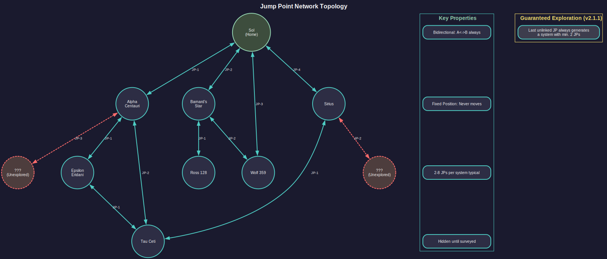
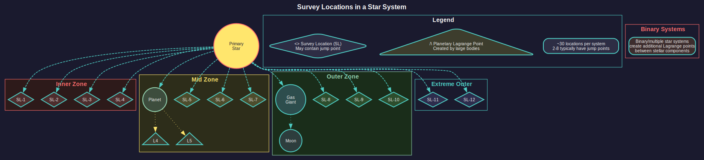

# 17.2 Gravitational Survey

*Updated: v2026.01.30*

## 17.2.1 Finding Jump Points

*Updated: v2026.01.30*

Gravitational surveys are the mechanism by which your empire discovers jump points -- the interstellar connections that allow ships to travel between star systems. Without gravitational surveys, you are confined to your starting system. Finding and mapping jump points is essential for expansion and exploration.

### 17.2.1.1 What are jump points?

Jump points are gravitational anomalies in space where the fabric of spacetime is thin enough to allow transit between star systems. Each jump point connects exactly two systems, creating a network of interstellar pathways.\hyperlink{ref-17.2-3}{[3]}

Key properties:

- **Bidirectional**: A jump point (see [Section 10.2 Jump Transit](../10-navigation/10.2-jump-transit.md)) always has a corresponding exit point in the destination system. Transiting in either direction is possible.
- **Fixed Position**: Jump points do not move. Once discovered, their position in the system is permanent.
- **Variable Number**: Each system has a random number of jump points, typically between 2 and 8, though extremes in either direction are possible.\hyperlink{ref-17.2-3}{[3]}
- **Guaranteed Exploration Path (v2.1.1)**: The jump point generation system prevents "closed universe" situations by ensuring at least one unexplored avenue always exists. Systems generated from the last unlinked jump point are guaranteed to contain a minimum of two jump points, ensuring exploration can always continue.\hyperlink{ref-17.2-6}{[6]}
- **Hidden Until Found**: Jump points are invisible until detected by a gravitational survey. You cannot stumble upon them accidentally during normal operations.

### 17.2.1.2 Gravitational Survey Points

Similar to geological surveys, gravitational surveys work on a point-based system:

- Each survey location in a system requires a certain number of gravitational survey points to fully investigate.
- Gravitational survey sensors aboard your survey ships generate these points over time. The base sensor generates 1 survey point per hour, with higher-tech versions generating more: Improved (2/hour), Advanced (3/hour), Phased (5/hour).\hyperlink{ref-17.2-1}{[1]}\hyperlink{ref-17.2-2}{[2]}
- When sufficient points accumulate at a survey location, any jump point present at that location is revealed.

However, unlike geological surveys which target individual bodies, gravitational surveys target specific locations in space -- the gravitational survey locations within a system.

### 17.2.1.3 How Detection Works

The gravitational survey process differs from geological survey in a critical way:

- Survey locations are predefined positions within each system where jump points may exist.
- Your survey ship must travel to each location and spend time surveying.
- Upon completion of a location's survey, the game reveals whether a jump point exists there (it may not -- many locations are empty).
- If a jump point is found, it becomes visible on the system map and can be transited by any ship with a jump drive (or through a jump gate, if one is later constructed).

### 17.2.1.4 Survey Order Types

You can assign gravitational survey orders through the Task Group Orders window (see [Section 9.5 Orders](../9-fleet-management/9.5-orders.md)):

- **Survey Specific Location**: Order your ship to survey a particular gravitational survey location. Useful when you want to investigate a specific part of the system.
- **Survey All Locations**: The ship will automatically move between and survey all unsurveyed locations in the system. This is the most common order for exploration ships.
- **Survey Nearest**: Begin with the closest unsurveyed location and work outward.

**Tip**: Jump points tend to be scattered throughout a system at varying distances from the primary star. Some may be very close to the star, while others are at the system's outer edge. A fast ship saves significant time on the transit between locations compared to a slow one.

## 17.2.2 Survey Locations

*Updated: v2026.01.30*

Understanding where jump points can be found and how survey locations work is key to efficient gravitational survey operations.

### 17.2.2.1 Lagrange Points

In Aurora C#, gravitational survey locations are typically associated with Lagrange points and other gravitational features of the system. These are positions where the gravitational influences of the system's bodies create conditions favorable for jump point formation.

Survey location types include:

- **Stellar Lagrange Points**: Points defined by the primary star's interaction with the galactic center of mass. These are the most common jump point locations. *(unverified — [#837](https://github.com/ErikEvenson/aurora-manual/issues/837) -- requires live testing; Lagrange point mechanics not documented in database)*
- **Planetary Lagrange Points**: Points created by large planets' gravitational influence. Less common but possible. *(unverified — [#837](https://github.com/ErikEvenson/aurora-manual/issues/837) -- requires live testing; Lagrange point mechanics not documented in database)*
- **Binary Star Points**: In binary or multiple star systems, the interaction between stellar components creates additional potential jump point locations. *(unverified — [#837](https://github.com/ErikEvenson/aurora-manual/issues/837) -- requires live testing; Lagrange point mechanics not documented in database)*

### 17.2.2.2 Number of Survey Locations

Each system has a fixed number of gravitational survey locations, determined at system generation. Each system typically has approximately 30 survey locations.\hyperlink{ref-17.2-3}{[3]}\hyperlink{ref-17.2-4}{[4]}

Not every location will contain a jump point. Many (often the majority) will be empty. A typical system has 2-6 jump points, though extremes in either direction are possible.\hyperlink{ref-17.2-3}{[3]}

### 17.2.2.3 Survey Location Distance

Survey locations are distributed at varying distances from the system center:

- **Inner Locations**: Close to the primary star, quick to reach but survey them regardless as jump points can appear anywhere.
- **Mid-System Locations**: At moderate distances, near the orbits of inner planets.
- **Outer Locations**: Far from the star, near outer planet orbits or beyond. These take the longest to reach but are just as likely to contain jump points.
- **Extreme Outer Locations**: Some locations may be very far from the primary, requiring significant transit time even for fast ships.

### 17.2.2.4 Viewing Survey Locations

The system map displays gravitational survey locations as markers:

- **Unsurveyed**: Locations that have not yet been investigated appear as a distinct marker.
- **Surveyed (Empty)**: Locations that have been surveyed and found to contain no jump point are marked differently.
- **Jump point found**: Discovered jump points appear with their own icon and show the destination system name (once transited or if known through other means).

### 17.2.2.5 Prioritizing Survey Locations

When time is limited, consider surveying locations strategically:

- **Inner locations first**: Faster to reach, get them checked quickly.
- **Clusters**: If multiple locations are near each other, survey the cluster before moving to distant isolated locations.
- **Known directions**: If you know the rough direction of a specific system you want to reach (from the galactic map), prioritize locations in that direction.

**Tip**: In a new system, look at the galactic map to identify which direction neighboring systems lie. Jump points connecting to a specific neighboring system are more likely to be found on the side of the system facing that neighbor. This is not guaranteed, but it can help prioritize survey locations when you are specifically looking for a route to a known system.

### 17.2.2.6 Gravitational vs. Geological Survey Priority

When resources are limited, players must decide whether to prioritize finding new systems (gravitational survey) or cataloging minerals in known systems (geological survey).

#### 17.2.2.6.1 When to prioritize jump points

Focus on gravitational surveys when:

- **Early game**: Finding your expansion options takes precedence over cataloging every asteroid in Sol.
- **Searching for habitable worlds**: Jump points lead to new systems that may contain colonization candidates.
- **Seeking specific resources**: If your starting system lacks a critical mineral, finding new systems may be faster than hoping for lucky asteroid surveys.
- **Strategic positioning**: Knowing where jump points lead allows planning defensive positions and expansion corridors.

#### 17.2.2.6.2 When to Prioritize Minerals

Focus on geological surveys when:

- **Resource-constrained**: You need to know exactly what you have before committing to expensive colony infrastructure.
- **Consolidating gains**: After rapid expansion, pause to catalog minerals in systems you intend to develop.
- **Defensive posture**: If hostile forces threaten, knowing your local resources helps plan self-sufficient defense industries.
- **Late game**: With dozens of systems explored, finding more jump points provides diminishing returns compared to developing existing territory.

*(Community Tip)* Most successful campaigns alternate between phases: aggressive gravitational surveying to find promising systems, followed by thorough geological surveying of the best finds. Do not neglect either capability for too long.

### 17.2.2.7 Survey Ship Design Considerations for Dual-Role Vessels

Some players prefer ships that can perform both gravitational and geological surveys, trading efficiency for flexibility.

#### 17.2.2.7.1 Dual-Role Ship Advantages

- **Simplified Logistics**: One ship type handles all survey needs. Fewer designs to maintain and fewer ships to coordinate.
- **Flexibility**: Can switch tasks based on immediate needs without waiting for the other ship type to arrive.
- **Efficiency in Small Systems**: For systems with few bodies and few survey locations, one ship can complete both survey types before moving on.

#### 17.2.2.7.2 Dual-Role Ship Disadvantages

- **Larger Hull Required**: Fitting both sensor types plus adequate fuel, engines, and jump drive requires more tonnage.
- **Higher Cost**: More expensive to build and operate than either specialized type alone.
- **Opportunity Cost**: While surveying minerals, the ship is not finding jump points (and vice versa). Specialized ships working in parallel complete both tasks faster.

#### 17.2.2.7.3 Design Recommendations

*(Community Tip)* If building dual-role survey ships:

- Prioritize gravitational survey sensors slightly (finding jump points is usually more time-critical than cataloging minerals).
- Include a jump drive (essential for the gravitational survey role).
- Size the ship around 4,000-6,000 tons to accommodate all required components without excessive cost.
- Accept that two specialized ships will outperform one dual-role ship in most scenarios, but the logistics simplification may be worth it for smaller empires.

For larger empires with established shipbuilding capacity, specialized survey ships working in coordinated pairs are more efficient than dual-role vessels.

## 17.2.3 Exploration Strategy

*Updated: v2026.01.30*

Effective exploration in Aurora C# requires strategic thinking about how to deploy your limited survey assets for maximum benefit. A systematic approach to exploration prevents wasted effort and ensures you discover the routes and resources your empire needs.

### 17.2.3.1 Early Game Exploration

In the first decades of a campaign, exploration priorities should focus on:

1. **Survey Sol (or Starting System)**: Find all jump points in your home system. This reveals your immediate options for expansion.
2. **Transit first jump points**: Send ships through discovered jump points to identify neighboring systems.
3. **Survey Neighbors**: Conduct gravitational surveys of adjacent systems to find further connections.
4. **Geological Survey Simultaneously**: While grav survey ships find jump points, send geo survey ships to check bodies for minerals.
5. **Expand Gradually**: Do not rush too far ahead. Secure knowledge of your immediate neighborhood before pushing deep into unknown space.

### 17.2.3.2 Gravitational Survey Ship Design

Gravitational survey ships have the same design philosophy as geological survey ships but mount Gravitational Survey Sensors instead:

- **Gravitational Survey Sensor**: The specialized component required. Higher-tech versions survey locations faster.
- **Speed**: Gravitational survey ships benefit even more from speed than geological survey ships because they spend significant time transiting between widely-spaced survey locations.
- **Jump Drive**: Almost essential for gravitational survey ships (see [Section 8.1 Design Philosophy](../8-ship-design/8.1-design-philosophy.md)), as their primary purpose is finding and transiting jump points. A grav survey ship without a jump drive is limited to systems with jump gates.
- **Range**: Must have enough fuel for extended operations, including transit to distant survey locations and through newly discovered jump points.

### 17.2.3.3 Exploration Patterns

Several strategic approaches to exploration exist:

#### 17.2.3.3.1 Depth-First
Push as far as possible along one chain of systems before branching. This finds distant systems quickly but leaves your flanks unexplored.

- **Good for**: Finding specific targets (alien homeworlds, resource-rich systems).
- **Risk**: May miss threats in unexplored branches near your home.

#### 17.2.3.3.2 Breadth-First
Fully survey each "ring" of systems (1 jump away, then 2 jumps, then 3) before pushing further. This ensures comprehensive knowledge of your neighborhood.

- **Good for**: Security-conscious play, ensuring no threats are behind you.
- **Risk**: Slower to find distant valuable targets.

#### 17.2.3.3.3 Priority-Based
Focus exploration on the most promising directions based on:

- System star types (certain star types are more likely to have habitable worlds). *(unverified — [#837](https://github.com/ErikEvenson/aurora-manual/issues/837) -- requires live testing; star type habitability correlation not documented in database)*
- Known galactic geography (heading toward regions with many stars).
- Strategic needs (looking for specific resources or routes).

### 17.2.3.4 Managing Multiple Survey Ships

For efficient exploration with multiple ships:

- **Assign Different Systems**: Do not send two gravitational survey ships to the same system. Split them to cover more ground.
- **Leap-Frogging**: When a grav survey ship finds a jump point, have it transit immediately while a second ship finishes the current system. The first ship starts the new system while the second catches up.
- **Geo/Grav Pairing**: Send a geological survey ship into each system after (or alongside) the gravitational survey ship. The grav ship finds jump points and moves on; the geo ship catalogs mineral deposits.
- **Escort Consideration**: In dangerous areas (near known hostile races), consider attaching an armed escort to your survey groups. A destroyed survey ship represents lost investment and wasted time.

### 17.2.3.5 Dealing with Hostile Space

When exploration brings you near hostile forces:

- **Scout Carefully**: Enter new systems cautiously. A passive-sensor-only approach (see [Section 11.1 Thermal and EM Signatures](../11-sensors-and-detection/11.1-thermal-em-signatures.md)) reduces your chances of being detected.
- **Military Escort**: If a system is known to be hostile, only enter with military protection or accept the risk of losing your survey ship.
- **Retreat Plans**: Ensure survey ships have orders to flee if fired upon. A surviving crew with partial survey data is better than a dead crew with none.
- **Stealth Designs**: Consider designing survey ships with reduced emissions (smaller engines, no active sensors) for operations in contested space.

### 17.2.3.6 When to Stop Exploring

Exploration is theoretically infinite, but practical considerations limit how far you should push:

- **Resource Limits**: Each survey ship costs resources. If you are resource-constrained, focus on exploiting what you have found rather than finding more.
- **Defense Perimeter**: Every new jump point you discover is a potential invasion route. Only explore what you can defend.
- **Diminishing Returns**: After surveying 20-30 systems, you likely have more resources identified than you can exploit for decades. Further exploration provides diminishing marginal value.
- **Threat Assessment**: If you have encountered hostiles, shifting resources from exploration to defense may be prudent.

**Tip**: Never transit an unknown jump point with your only survey ship unless you are certain you can get back. Some jump points lead to systems where the return jump point is very far from the entry point. If your ship lacks the fuel to reach the return jump point, it may be stranded in an unexplored system with no way home. Always carry excess fuel or have a tanker available for rescue operations.

## 17.2.4 Anomalies and Ancient Constructs

*Updated: v2026.01.28*

Gravitational surveys can also discover anomalies at survey locations. These anomalies may contain Ancient Constructs -- structures left behind by a precursor civilization that provide research bonuses and serve as defenses against Aether Rifts.\hyperlink{ref-17.2-5}{[5]}

### 17.2.4.1 Anomaly Discovery

- Anomalies are found during the gravitational survey process, appearing at survey locations alongside (or instead of) jump points
- Not all anomalies contain Ancient Constructs; they may represent other types of findings
- The presence of an anomaly is revealed when the survey location is completed

### 17.2.4.2 Ancient Construct Activation

Discovered Ancient Constructs remain dormant and provide no benefits until activated:

1. **Deploy xenoarchaeology formations**: Ground forces with xenoarchaeology components must be transported to the body nearest the construct (or the body the construct is associated with)
2. **Survey the construct**: The xenoarchaeological formation surveys the dormant construct
3. **Activation**: Once surveyed, the construct's research field and bonus percentage are revealed and it becomes active

For full details on Ancient Construct mechanics, research bonuses, and their role in countering Aether Rifts, see [Section 18.3.5 Ancient Constructs](../18-advanced-topics/18.3-spoiler-races.md).

## Related Sections

- [Section 4.1 Star Systems](../4-systems-and-bodies/4.1-star-systems.md) -- Star system composition and Lagrange points
- [Section 8.1 Design Philosophy](../8-ship-design/8.1-design-philosophy.md) -- Designing gravitational survey ships with jump drives
- [Section 10.2 Jump Transit](../10-navigation/10.2-jump-transit.md) -- Jump point transit mechanics and jump gates
- [Section 11.1 Thermal and EM Signatures](../11-sensors-and-detection/11.1-thermal-em-signatures.md) -- Passive vs active sensor considerations for exploration
- [Section 18.3 Spoiler Races](../18-advanced-topics/18.3-spoiler-races.md) -- Ancient Constructs, anomalies, and spoiler encounters during exploration

## References

\hypertarget{ref-17.2-1}{[1]}. Aurora Wiki, "Gravitational Survey Sensors" -- Base sensor provides 1 survey point per hour.

\hypertarget{ref-17.2-2}{[2]}. Aurora C# game database (AuroraDB.db v2.7.1) -- FCT_TechSystem (TechTypeID=88): Gravitational survey sensor progression confirmed: Base (1 pt/hr, 2,000 RP), Improved (2 pt/hr, 10,000 RP), Advanced (3 pt/hr, 35,000 RP), Phased (5 pt/hr, 100,000 RP). TechDescription field explicitly states survey points per hour for each level.

\hypertarget{ref-17.2-3}{[3]}. Aurora Wiki, "Survey" -- Each system has approximately 30 survey locations with typically 2-6 jump points.

\hypertarget{ref-17.2-4}{[4]}. Aurora C# game database (AuroraDB.db v2.7.1) -- FCT_SurveyLocation: 30 survey locations per system confirmed (60 total locations across 2 systems = 30.0 average).

\hypertarget{ref-17.2-5}{[5]}. Aurora C# game database (AuroraDB.db v2.7.1) -- FCT_AncientConstruct: Ancient Constructs confirmed with ResearchField and ResearchBonus columns. FCT_AetherRift and FCT_AetherGates tables confirm Aether mechanics exist.

\hypertarget{ref-17.2-6}{[6]}. Aurora Forums — https://aurora2.pentarch.org/index.php?topic=13070.0 — v2.1.1 Changes List. Confirmed: "Any new system generated with the last un-linked jump point in known space will have a minimum of two jump points." Implements safeguards to ensure "at least one avenue of exploration will always exist."
