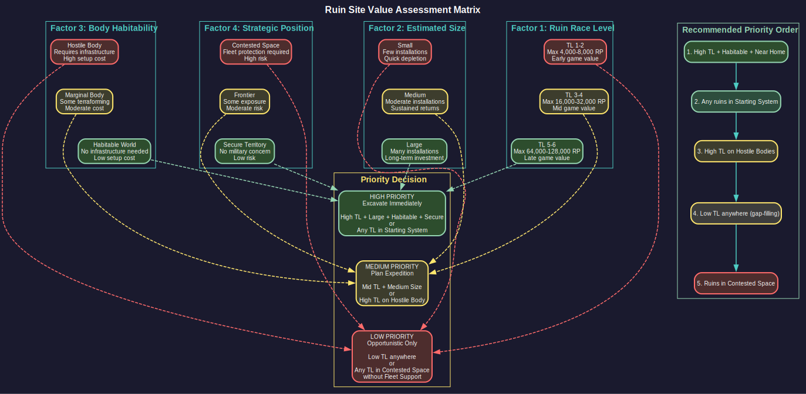
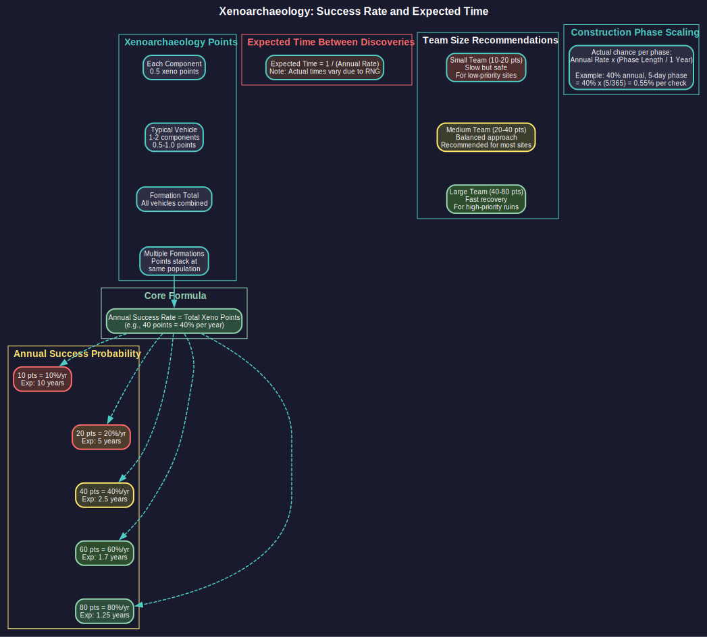

# 17.3 Xenoarchaeology

*Updated: v2026.01.30*


---

## Contents

*Updated: v2026.01.30*

{: .no_toc }

- TOC
{:toc}

## 17.3.1 Ruins Discovery

*Updated: v2026.01.30*

Xenoarchaeology in Aurora C# deals with the discovery and excavation of ancient alien ruins left behind by extinct civilizations. These ruins can contain invaluable technological artifacts that dramatically accelerate your research or provide unique capabilities.

### 17.3.1.1 How Ruins Are Generated

Alien ruins are generated during galaxy creation based on specific eligibility criteria:

- **Eligible Body Types**: Ruins can appear on terrestrial worlds, terrestrial moons, and small terrestrial moons (provided gravity exceeds 0.4G).\hyperlink{ref-17.3-1}{[1]}
- **Environmental Conditions**: Bodies must meet climate requirements to host ruins:
  - **Temperature**: Between 200K and 360K (approximately -73C to +87C)\hyperlink{ref-17.3-1}{[1]}
  - **Gravity**: Greater than 0.4G\hyperlink{ref-17.3-1}{[1]}
- **Base Probability**: The default chance of ruins appearing on a qualifying body is **20%**.\hyperlink{ref-17.3-2}{[2]} This value is adjustable through the game settings window.
- **Tech Level Variation**: Ruins represent civilizations of varying technological advancement (rated by "Ruin Race Level" from 1 to 6; TL6 was added in v2.8.0).\hyperlink{ref-17.3-6}{[6]} Some contain only marginally useful artifacts, while others hold technologies far beyond your current capabilities.
- **Independent of NPRs**: Ruins are remnants of extinct civilizations, distinct from any living NPR races you may encounter. The builders are long dead.

### 17.3.1.2 Ruins in Sol

Within the Sol system, ruins can appear on specific bodies with varying probabilities:

- **Mars**: Approximately 5% chance\hyperlink{ref-17.3-3}{[3]}
- **Mercury**: Approximately 3% chance\hyperlink{ref-17.3-3}{[3]}
- **Titan or Ganymede**: Approximately 1% chance each\hyperlink{ref-17.3-3}{[3]}
- **Other eligible bodies** (Galilean Moons, Triton, Pluto, Eris): Fractions of a percent

These probabilities are derived from each body's characteristics (temperature, gravity) intersecting with the base ruins chance. Sol ruins provide an early-game discovery opportunity without requiring interstellar travel.

### 17.3.1.3 Discovering Ruins

Ruins are found through the geological survey process (see [Section 17.1 Geological Survey](../17-exploration/17.1-geological-survey.md)):

- When a geological survey of a body completes, any ruins present on that body are revealed alongside mineral deposits.
- An event message specifically notifies you of the ruins discovery, separate from mineral reports.
- The ruins appear in the body's information panel, showing that xenoarchaeological sites are present.

You cannot find ruins without conducting a geological survey. This means your survey ships serve double duty -- finding minerals and identifying ruin sites for later excavation.

### 17.3.1.4 Ruins Characteristics

When ruins are discovered, the following information is revealed:

- **Presence**: You know ruins exist on the body, but not their full extent or contents until excavation begins.
- **Location**: The body where the ruins are located. This determines what infrastructure you need to exploit them.
- **Estimated Size**: A rough indication of how extensive the ruins are, which correlates with how many artifacts might be recovered.

### 17.3.1.5 Where Ruins Are Commonly Found

While ruins can appear anywhere, some patterns tend to emerge:

- **Habitable Worlds**: More likely to host ruins, as the extinct civilization presumably needed habitable conditions.
- **Resource-Rich Bodies**: Bodies with good mineral deposits sometimes also have ruins, suggesting the builders valued the same resources.
- **System Cores**: Inner system bodies (closer to the star) are slightly more common ruin sites than distant outer system bodies.
- **Any Body Type**: Moons, asteroids, and planets can all host ruins. Do not neglect small bodies in your survey efforts.

**Tip**: When you discover ruins, evaluate how urgently you need the potential technology boost versus the cost of establishing an excavation operation. Early-game ruins near your homeworld are extremely valuable and worth immediate investment. Ruins discovered in distant, hostile systems may need to wait until you can secure the area.

### 17.3.1.6 Ruin Site Assessment

When deciding which ruin sites to prioritize, consider multiple factors that affect the risk-versus-reward calculation.

#### 17.3.1.6.1 Evaluating Site Value



Not all ruins are worth the investment required to excavate them. Assess each site against these criteria:

- **Installation Count**: Larger ruins (indicated by the estimated size) typically contain more recoverable installations and technologies. A ruin with many installations justifies the transport and colony costs more readily than a small site.
- **Ruin Race Level**: Higher-level ruins (3-6) can yield more advanced technologies with higher RP costs. If you need a significant technology leap, prioritize higher-level sites. Lower-level ruins (1-2) are still valuable for early-game players but may become less attractive as your own research advances.
- **Location Accessibility**: Ruins on habitable worlds cost less to exploit than those on hostile moons or asteroids. Factor in the infrastructure colony requirements when calculating total investment.
- **Strategic Position**: Ruins in secure, well-defended space can be exploited without military risk. Ruins in contested territory may require significant fleet investment to protect.

#### 17.3.1.6.2 Risk vs. Reward Calculation

*(Community Tip)* When deciding whether to excavate a ruin site, weigh the potential gains against the costs:

| Factor | Low Value | High Value |
|--------|-----------|------------|
| Ruin Race Level | 1-2 (max 8,000 RP tech) | 4-6 (max 64,000+ RP tech) |
| Estimated Size | Small (few installations) | Large (many installations) |
| Body Habitability | Requires infrastructure colony | Naturally habitable |
| Distance from Core | Many jumps, hard to supply | Close, easy logistics |
| Security Situation | Contested or hostile space | Secure territory |

The Ruin Race Level values in this table are derived from the maximum tech cost formula.\hyperlink{ref-17.3-6}{[6]}

A site scoring "High Value" on most factors deserves immediate priority. Sites scoring mostly "Low Value" may be worth deferring until more convenient, or exploited opportunistically when your xeno teams would otherwise be idle.

#### 17.3.1.6.3 Priority Factors

*(Community Tip)* Experienced players often prioritize ruin sites in this order:

1. **High-level ruins on habitable worlds near your home system** -- maximum return for minimum investment
2. **Any ruins in your starting system** -- the transport cost is nearly zero
3. **High-level ruins on hostile bodies** -- worth the infrastructure if the tech potential is high enough
4. **Low-level ruins anywhere** -- better than nothing, useful for filling gaps in your tech tree
5. **Ruins in hostile territory** -- only after you can secure the area

## 17.3.2 Excavation

*Updated: v2026.01.30*

Once ruins are discovered, exploiting them requires dedicated xenoarchaeology teams and a sustained excavation effort. This is not a quick process -- excavation takes significant time and resources.

### 17.3.2.1 Ground-Based Xenoarchaeology Units

In C# Aurora, dedicated Xenology Teams do not exist. Instead, xenoarchaeology capability comes from a specialized ground unit component:

- **Component Size**: 100 tons per xenoarchaeology component\hyperlink{ref-17.3-5}{[5]}
- **Capability**: Each component provides 0.5 xenoarchaeology points\hyperlink{ref-17.3-5}{[5]}
- **Integration**: The component is mounted on ground combat vehicles or support vehicles (see [Section 13.1 Unit Types and Formation Design](../13-ground-forces/13.1-unit-types.md)), making xenoarchaeology part of your ground force structure
- **Combined Capability**: All formations at the same population with a xenoarchaeology capability combine their xenoarchaeology points, enabling collective progress toward translation and excavation goals
- **Transport**: Xenoarchaeology formations must be transported to the target body using troop transports or other suitable vessels

### 17.3.2.2 Excavation Process

The excavation process works as follows:

1. **Deploy Formations**: Transport ground formations with xenoarchaeology components to the body with ruins.

2. **Automatic Excavation**: Formations automatically begin working on the ruins. No additional orders are required.

3. **Translation Success**: The annual translation probability equals the total xenoarchaeology points available on the planet.\hyperlink{ref-17.3-4}{[4]} For example, a formation with 40 vehicles each providing 1 point generates a 40% annual success rate.

4. **Construction Phase Scaling**: For shorter construction phases, the actual chance per phase is: annual probability multiplied by (construction phase duration / one year).\hyperlink{ref-17.3-4}{[4]} This scaling ensures proportional progress regardless of time increment settings.

5. **Artifact Recovery**: When a recovery is successful, you receive a notification indicating what was found (see Alien Artifacts below).

6. **Site Depletion**: Ruins are not infinite. Over time, the site is gradually exhausted as artifacts are recovered. Eventually, the ruins yield no more discoveries.

### 17.3.2.3 Recovery Rate



The rate at which artifacts are recovered depends on several factors:

- **Total Xenoarchaeology Points**: The combined points from all formations at the same population determine the annual probability of successful translation/recovery.
- **Ruin Richness**: Larger, more extensive ruins have more to find and yield discoveries more frequently.
- **Technology Level of Ruins**: Higher-tech ruins may be harder to excavate (the artifacts are more complex) but yield more valuable discoveries.
- **Random Chance**: Recovery has a stochastic element. Sometimes formations go long periods without finding anything, then discover multiple artifacts in quick succession.

### 17.3.2.4 Establishing Excavation Colonies

For many ruin sites, you will need to establish a colony on the body:

- **Habitable Bodies**: If the ruins are on a habitable world (see [Section 5.1 Establishing Colonies](../5-colonies/5.1-establishing-colonies.md)), simply land colonists and xeno teams together. The colony supports the excavation naturally.
- **Inhospitable Bodies**: If the ruins are on an airless moon, a hostile-atmosphere planet, or an asteroid, you need an infrastructure colony. This requires:
  - Colony cost infrastructure to support population.
  - Life support installations if the environment is hostile.
  - Sufficient population to operate the xeno teams.
  - Supply routes to keep the colony operational.

### 17.3.2.5 Managing Excavation Operations

Best practices for xenoarchaeology:

- **Concentrate Teams**: It is generally better to focus many teams on one site rather than spreading single teams across many sites. Concentrated effort produces results faster. As of v1.12.0, multiple xenoarchaeology formations can survey the same Ancient Construct simultaneously, with their points combining for faster activation. *(unverified — [#837](https://github.com/ErikEvenson/aurora-manual/issues/837) -- requires live testing; v1.12.0 changelog does not document this change)* This is particularly important when Aether Rifts threaten and rapid construct activation is critical.
- **Rotate Sites**: Once a site is depleted, redeploy teams to the next known ruin location.
- **Maintain Supply**: Distant excavation colonies need regular supply shipments. Do not forget them.
- **Patience**: Excavation is a long-term investment. Months or years may pass between significant discoveries. Do not give up or abandon sites prematurely.

**Tip**: The transport cost of getting xeno teams to a distant ruin site is a one-time investment that can pay dividends for decades. Even if a site only yields one or two major discoveries, those technologies can advance your empire by years of research equivalent. Always excavate known ruins when feasible.

### 17.3.2.6 Team Composition Optimization

How you configure your xenoarchaeology formations affects both the speed of excavation and the risk to your teams.

#### 17.3.2.6.1 Speed vs. Safety Tradeoffs

Xenoarchaeology formations face hazards during excavation -- ancient traps, unstable structures, and environmental dangers can cause casualties. The composition of your teams affects how you balance progress against losses:

- **Larger Teams (More Components)**: Generate more xenoarchaeology points, completing translations faster. However, if casualties occur, more personnel are at risk in each incident.
- **Smaller Teams (Fewer Components)**: Progress more slowly but limit exposure. If an incident occurs, fewer personnel are affected.
- **Multiple Small Teams**: Provide redundancy. If one team suffers heavy losses, others continue working. Total xenoarchaeology points combine, so overall progress is maintained.

*(Community Tip)* Most players find that medium-sized formations (20-40 xenoarchaeology points total) provide a good balance. This generates meaningful progress without catastrophic losses from a single incident.

#### 17.3.2.6.2 Equipment Considerations

When designing xenoarchaeology ground units, consider:

- **Vehicle Chassis**: Mounting the xenoarchaeology component on armored vehicles provides some protection against site hazards.
- **Support Equipment**: Including engineering or medical components in the formation can reduce casualties from incidents.
- **Transport Requirements**: Larger formations require more transport capacity to deploy. Balance excavation capability against logistical constraints.

#### 17.3.2.6.3 Single Large Team vs. Multiple Teams

*(Community Tip)* The decision between one large team and multiple smaller teams depends on your situation:

**One Large Team:**
- Pros: Maximum excavation speed, simpler logistics, faster site depletion
- Cons: All eggs in one basket, potential for heavy losses, idle when moving between sites
- Best for: Secure sites with high-level ruins where speed matters

**Multiple Smaller Teams:**
- Pros: Redundancy against losses, can excavate multiple sites simultaneously, flexible deployment
- Cons: Slower progress per site, more complex logistics, requires more transport capacity
- Best for: When you have multiple known ruin sites, or when operating in uncertain environments

For most empires, a mixed approach works well: maintain one primary excavation team for your highest-priority site, plus one or two smaller teams that can handle secondary sites or serve as replacements if your primary team suffers significant casualties.

## 17.3.3 Recovered Technology

*Updated: v2026.01.30*

The real payoff of xenoarchaeology is the technology recovered from ruins. These discoveries can range from minor curiosities to game-changing breakthroughs that vault your empire ahead of its rivals.

### 17.3.3.1 Types of Discoveries

Excavation can yield several categories of finds:

#### 17.3.3.1.1 Technology Components
The most common and valuable finds are individual technology items:

- **Weapons Technology**: Beam weapons, missile warheads, kinetic weapons, or fire control systems more advanced than your current capabilities.
- **Propulsion Technology**: Engine designs, fuel efficiency improvements, or exotic propulsion systems.
- **Defensive Technology**: Armor compounds, shield generators, or ECM systems.
- **Sensor Technology**: Advanced sensors, fire control systems, or communication equipment.
- **Power Technology**: Reactor designs, power plant improvements, or energy storage systems.
- **Construction Technology**: Manufacturing techniques, hull materials, or shipyard improvements.

Each technology component recovered grants you the knowledge of that specific technology as if you had researched it yourself (see [Section 7.1 Technology Tree](../7-research/7.1-technology-tree.md)). This can save years of research time, particularly if the technology is far ahead of your current level.

### 17.3.3.2 Alien Installation Recovery

Beyond individual technology components, excavation can uncover functional alien installations that provide immediate operational capability.

#### 17.3.3.2.1 Recoverable Installation Types

The following installation types may be recovered from ruins: *(unverified — [#837](https://github.com/ErikEvenson/aurora-manual/issues/837) -- requires live testing; specific recoverable types not documented in forum/wiki)*

- **Construction Factories**: Alien manufacturing facilities that can be repurposed for your industrial base.
- **Research Facilities**: Labs that generate research points in specific fields, potentially in areas you have not yet developed.
- **Fuel Refineries**: Facilities for converting Sorium into usable fuel.
- **Ordnance Factories**: Manufacturing capability for missiles and other ordnance.
- **Ground Force Training Facilities**: Installations that accelerate ground unit development.
- **Terraforming Installations**: Equipment for atmospheric modification (rare but extremely valuable).

#### 17.3.3.2.2 Installation Condition and Integration

Recovered installations integrate with your economy in specific ways:

- **Immediate Availability**: Once recovered, installations appear in your population's installation list and begin functioning automatically.
- **No Repair Required**: Recovered installations are assumed to be operational. Unlike shipwrecks, there is no salvage or repair phase. *(unverified — [#837](https://github.com/ErikEvenson/aurora-manual/issues/837) -- requires live testing; forum sources suggest immediate availability but mechanics not confirmed)*
- **Technology Independence**: Alien installations function regardless of whether you have researched equivalent technology. You can operate a recovered research lab even if you have not researched that facility type yourself.
- **Cannot Be Duplicated**: Recovered installations are unique artifacts. You cannot build copies unless you have independently researched the underlying technology. *(unverified — [#837](https://github.com/ErikEvenson/aurora-manual/issues/837) -- requires live testing; duplication mechanics not documented)*

#### 17.3.3.2.3 Research Bonus from Recovered Technology

When you recover technology (not installations) from ruins, you gain more than just the technology itself:

- **Prerequisite Bypass**: Recovered technologies bypass normal prerequisite chains. *(unverified — [#837](https://github.com/ErikEvenson/aurora-manual/issues/837) -- requires live testing; database shows techs have prerequisites but bypass behavior undocumented)* If you recover an advanced sensor, you can use it immediately even without having researched intermediate sensor technologies.
- **Research Acceleration**: Recovered technologies in a field provide insight that can accelerate related research. If ruins give you Beam Weapon Tech Level 5, your scientists have examples to study that may inform their work on Tech Level 6.
- **Design Options**: Each recovered technology immediately becomes available for ship designs, expanding your design space without waiting for research completion.

*(Community Tip)* The most valuable recoveries are often installations rather than technologies. A recovered research facility generates ongoing value forever, while a recovered technology provides a one-time benefit that diminishes as your own research catches up. Prioritize ruins likely to contain installations (larger sites tend to have more).

#### 17.3.3.2.4 Research Points
Some finds do not grant complete technologies but instead provide research point bonuses:

- **Partial Knowledge**: Incomplete artifacts that provide insight but not full understanding. These add research points toward a specific technology, accelerating (but not completing) your research.
- **General Knowledge**: Broad scientific data that can be applied to various research fields. Less focused but still valuable.

### 17.3.3.3 Maximum Technology Level from Ruins

The system prevents unbalanced technological advancement by capping recovered tech based on the ruin race's development level. The maximum development cost for recoverable technology is:

**(2 ^ (Ruin Race Level + 1)) x 1000 RP**\hyperlink{ref-17.3-6}{[6]}

This creates the following progression:

| Ruin Race Level | Maximum Tech Cost |
|----------------|-------------------|
| 1 | 4,000 RP |
| 2 | 8,000 RP |
| 3 | 16,000 RP |
| 4 | 32,000 RP |
| 5 | 64,000 RP |
| 6 | 128,000 RP |

\hyperlink{ref-17.3-6}{[6]}

When selecting standard components for recovery (such as gravitational survey sensors or asteroid mining modules), the system retrieves the best available component within the above limit. If no qualifying component exists within the tech cost threshold for that ruin race level, nothing is recovered from that particular selection. This mechanic ensures that excavating ruins cannot catastrophically accelerate a player's technological progression beyond what the ruin race's level would naturally allow.

### 17.3.3.4 Alien Autopsy Research

*Updated: v2.6.0*

When you encounter and defeat alien forces (whether NPRs or spoiler races), recovered biological samples can be studied through the Alien Autopsy research project.

**Research Cost:** 1,000 RP \hyperlink{ref-17.3-9}{[9]}

Prior to v2.6.0, Alien Autopsy research cost 5,000 RP. The reduction to 1,000 RP makes this research more accessible in the early-to-mid game, when players are most likely to encounter their first alien contacts and have limited research capacity.

Alien Autopsy provides insights into the biology and capabilities of the studied species, which can inform diplomatic relations, combat tactics, and understanding of their technology. The reduced cost encourages players to invest in this research whenever alien samples become available rather than deferring it indefinitely.

### 17.3.3.5 Technology Integration

When you recover a technology from ruins:

- **Immediate Availability**: The technology is immediately available for use in ship designs, ground installations, or whatever context it applies to.
- **Prerequisite Bypass**: Recovered technology can bypass normal research prerequisites. *(unverified — [#837](https://github.com/ErikEvenson/aurora-manual/issues/837) -- requires live testing; see Section 17.3.3.1.1)* You might obtain an advanced sensor without having researched intermediate sensor technologies.
- **No Ongoing Cost**: Once recovered, the technology requires no further investment. It is yours permanently.
- **Design Updates**: You may need to create new ship designs to take advantage of recovered technologies, as existing designs use older components.

### 17.3.3.6 Value Assessment

Not all recovered technologies are equally useful:

- **Ahead of Current Level**: Technologies significantly ahead of your current research are the most valuable, as they save the most research time.
- **Behind Current Level**: Technologies you have already researched or surpassed are worthless beyond historical interest.
- **Niche Technologies**: Some recovered tech may be for systems you do not use or in fields you have not prioritized. These are still valuable as they expand your options.
- **Synergy**: A recovered engine technology is most valuable if you are also advancing in related fields like fuel efficiency and reactor technology. Isolated advances are useful but less transformative.

### 17.3.3.7 Strategic Implications of Recovered Technology

Technology recovery from ruins has significant strategic implications:

- **Asymmetric Advantage**: Early ruin exploitation can give you technologies that NPRs have not yet developed, creating a temporary but exploitable military advantage.
- **Research Redirection**: If ruins provide technologies in one field, you can redirect your own research effort to other fields, developing a broader tech base faster.
- **Leapfrogging**: In rare cases, recovering a very advanced technology can allow you to skip entire generations of intermediate research, jumping directly to capabilities that would normally take decades to develop.
- **Competition**: If NPRs also have access to ruins in their territory, they may be recovering technologies as well. You are not the only civilization that can benefit from ancient knowledge.

### 17.3.3.8 Maximizing Ruin Value

To get the most from xenoarchaeology:

1. **Prioritize Ruins in Useful Fields**: If you know (from the ruin's estimated tech level) that the ruins are likely to contain advanced propulsion technology, and propulsion is your weakest area, that site is extremely high priority.

2. **Excavate Early**: The earlier you recover advanced technology, the longer you benefit from the advantage it provides. A technology recovered in year 20 gives you 80 years of use by year 100. The same technology recovered in year 90 gives you only 10 years of advantage.

3. **Multiple Sites**: If you have access to multiple ruin sites, excavate all of them. Different sites contain different technologies, and each discovery compounds your advantage.

4. **Protect Ruin Sites**: If ruins are in contested or vulnerable territory, defend them. Losing a ruin site to an alien race means they benefit from the technology instead of you.

**Tip**: When you recover a technology significantly ahead of your current level, immediately review your ship designs and research priorities. That advanced beam weapon technology is useless if you never build ships that mount it. Similarly, if ruins give you advanced sensors, consider redirecting your sensor research budget to other fields where you are still behind. The goal is not just to recover technology but to integrate it into your strategic capabilities as quickly as possible.

## 17.3.4 Alien Artifacts (Updated v2.8.0)

*Updated: v2026.01.30*

Alien artifacts are recovered from ruins and held as population-level stockpiles.

### 17.3.4.1 Artifact Stockpile

As of v2.8.0, artifacts are no longer trade goods.\hyperlink{ref-17.3-8}{[8]} Instead:

- **Direct stockpile**: Artifacts recovered from ruins are held directly at the population where they were excavated
- **Display location**: Shown at the top of the third column on the population display, below constructs/ruins and above the capability section\hyperlink{ref-17.3-8}{[8]}
- **Yield Per Recovery**: Each successful artifact recovery yields between 4 and 200 artifacts (4D50)\hyperlink{ref-17.3-8}{[8]}

### 17.3.4.2 Artifact Reserve (v2.8.0)

After the main ruin items (technologies, installations) are recovered, the ruin site is removed but leaves behind an **Artifact Reserve** — a hidden quantity of remaining artifacts that can be extracted over time:

- **Reserve size**: Ranges from hundreds to tens of thousands of artifacts, influenced by the original ruin scope
- **Unknown to player**: The exact reserve size is not displayed; players must infer it from recovery rate
- **Xenoarchaeology unit extraction**: Xenoarchaeology units assigned to the population continue searching with a two-step success check:
  1. Standard recovery check (same as normal ruin excavation)
  2. Secondary check with success chance: `Artifact Reserve / 50,000`\hyperlink{ref-17.3-8}{[8]}

- **Recovery amount**: Successful secondary recovery yields 4D50 (4-200) artifacts\hyperlink{ref-17.3-8}{[8]}
- **Depletion**: The reserve is depleted by each successful recovery, making artifacts progressively harder to find
- **Purpose**: Provides continued use for xenoarchaeology units when no other excavation tasks are available, and rewards sustained archaeological investment

### 17.3.4.3 TL6 Ruins (v2.8.0)

As of v2.8.0, TL6 (Tech Level 6) ruins can spawn.\hyperlink{ref-17.3-6}{[6]} The maximum research cost formula for recoverable technology is:

```
Max Research Cost = 2^(TL+1) * 1000
```

For TL6 ruins, this means technologies up to 128,000 RP cost can be recovered.\hyperlink{ref-17.3-6}{[6]} Additionally, component development cost can never be lower than build cost.\hyperlink{ref-17.3-8}{[8]}

### 17.3.4.4 Strategic Implications

The artifact reserve mechanic rewards sustained excavation operations even after primary ruin items are recovered. Bodies with large ruins remain valuable resource sites for extended periods, providing ongoing artifact income that justifies maintaining excavation infrastructure.

## 17.3.5 Survey Site List

*Updated: v2026.01.30*

Given the number of potential ground survey and xenoarchaeological sites across a galaxy, C# Aurora includes a dedicated management interface for tracking them.

### 17.3.5.1 Interface Location

The survey site list is accessible as a dedicated tab on the Tactical Map window. *(unverified — [#837](https://github.com/ErikEvenson/aurora-manual/issues/837) -- requires live testing; interface location not documented in forum/wiki)* This placement integrates site management with ground operations planning.

### 17.3.5.2 Functionality

The survey site list provides:

- **Centralized Tracking**: View all currently known survey sites across all explored systems in one location
- **Site Status**: Monitor which sites are being actively excavated, which have been discovered but not yet reached, and which are depleted
- **Operational Planning**: Coordinate deployment of xenoarchaeology formations and geological survey units across multiple sites

This feature reduces the player burden of manually tracking dozens or hundreds of potential survey sites across an expanding empire, ensuring no discovered ruins or survey opportunities are forgotten.

## 17.3.6 Ruin-Only Technology: Aether Gate Systems

*Updated: v2026.01.28*

Certain technologies can only be recovered from ruins and cannot be researched independently. These unique artifacts represent knowledge lost to time that your scientists cannot rediscover through conventional research.

### 17.3.6.1 Aether Gate Prevention Technology

Aether Gates are a dangerous phenomenon that can appear in systems, posing significant threats to established populations. Ruin excavation can yield specialized technology to detect and prevent their formation.

**Technology Tiers:**

| Tier | Research Points | Effect |
|------|-----------------|--------|
| Tier 1 | 10,000 RP | Basic Aether Gate detection and monitoring capability |
| Tier 2 | 25,000 RP | Advanced prevention technology that blocks gate formation |

These technologies are exclusively obtainable through xenoarchaeology. No amount of independent research will unlock them -- your empire must locate and excavate ruins containing these artifacts.\hyperlink{ref-17.3-7}{[7]}

### 17.3.6.2 Aether Gate Monitoring Stations

Once Tier 1 Aether Gate technology is recovered, you can construct specialized planetary installations to detect Aether Gate activity.

**Installation Specifications:**

| Attribute | Value |
|-----------|-------|
| Build Cost | 3,600 BP |
| Corbomite Required | 1,200 units |
| Uridium Required | 2,400 units |
| Function | Detect Aether Gates in the system |

\hyperlink{ref-17.3-7}{[7]}

Aether Gate Monitoring Stations provide early warning of gate formation, giving your empire time to respond before a threat fully materializes. The Tier 2 prevention technology, once recovered, enables countermeasures that can block gate formation entirely.

> **Note:** The mineral requirements (Corbomite and Uridium) are relatively rare trans-Newtonian elements. Ensure your empire has adequate stockpiles or access to bodies containing these minerals before committing to widespread monitoring station deployment.

### 17.3.6.3 Strategic Implications

The ruin-exclusive nature of Aether Gate technology creates important strategic considerations:

- **Prioritize ruins** that might contain these technologies, particularly if your empire has encountered Aether-related threats
- **Protect excavation sites** that yield these technologies, as they represent irreplaceable knowledge
- **Stockpile rare minerals** (Corbomite and Uridium) in anticipation of monitoring station construction
- **Deploy stations strategically** in systems most vulnerable to Aether Gate formation

Unlike conventional technologies that can be researched given enough time and resources, Aether Gate technology represents a true archaeological treasure -- unique knowledge that separates prepared empires from those caught unaware.

## Related Sections

- [Section 5.1 Establishing Colonies](../5-colonies/5.1-establishing-colonies.md) -- Establishing excavation colonies on ruin sites
- [Section 7.1 Technology Tree](../7-research/7.1-technology-tree.md) -- How recovered technologies integrate with the research system
- [Section 13.1 Unit Types and Formation Design](../13-ground-forces/13.1-unit-types.md) -- Designing xenoarchaeology ground units
- [Section 14.1 Fuel](../14-logistics/14.1-fuel.md) -- Transporting xenoarchaeology formations to distant sites
- [Section 18.3 Spoiler Races](../18-advanced-topics/18.3-spoiler-races.md) -- Ancient Constructs and Precursor technology connections

## References

\hypertarget{ref-17.3-1}{[1]}. Aurora Wiki, "Ruins" -- Ruin eligibility: terrestrial bodies with gravity greater than 0.4G, temperature 200K-360K.

\hypertarget{ref-17.3-2}{[2]}. Aurora C# game database (AuroraDB.db v2.7.1) -- FCT_Game.NewRuinCreationChance: Default value 20 confirmed (20% base chance). Column exists with DEFAULT 20 in schema.

\hypertarget{ref-17.3-3}{[3]}. Aurora Wiki, "C-System Bodies" -- Sol ruin probabilities: Mars ~5%, Mercury ~3%, Titan/Ganymede ~1%.

\hypertarget{ref-17.3-4}{[4]}. Aurora Forum, C# Changes -- Xenoarchaeology annual probability equals total xeno points; scaled by construction phase length (annual probability x phase duration / one year).

\hypertarget{ref-17.3-5}{[5]}. Aurora C# game database (AuroraDB.db v2.7.1) -- DIM_GroundComponentType (ComponentTypeID=64): Xenoarchaeology Equipment: Size=100 tons, Xenoarchaeology=0.5 points. Vehicle-class component (Vehicle=1, HeavyVehicle=1).

\hypertarget{ref-17.3-6}{[6]}. Aurora Forum, "Tech Level with Ruins" -- Maximum tech cost formula: 2^(TL+1) x 1000 RP. TL6 added in v2.8.0. Progression: TL1=4,000, TL2=8,000, TL3=16,000, TL4=32,000, TL5=64,000, TL6=128,000 RP.

\hypertarget{ref-17.3-7}{[7]}. Aurora Forums — https://aurora2.pentarch.org/index.php?topic=13884.msg176533 — Steve Walmsley, January 22, 2026. Aether Gate ruin-only technology: Tier 1 (10,000 RP), Tier 2 (25,000 RP). Monitoring Stations: 3,600 BP, 1,200 Corbomite, 2,400 Uridium.

\hypertarget{ref-17.3-8}{[8]}. Aurora Forums — https://aurora2.pentarch.org/index.php?topic=13884.0 — Steve Walmsley, v2.8.0 Changes List. Artifacts no longer trade goods, held at population, displayed third column below constructs/ruins. Artifact reserve mechanics: success chance = reserve / 50,000, yield = 4D50. Component development cost >= build cost.

\hypertarget{ref-17.3-9}{[9]}. Aurora Forums — v2.6.0 Changes List (https://aurora2.pentarch.org/index.php?topic=13463.0) — "Alien Autopsy research cost reduced from 5000 to 1000 RP."
