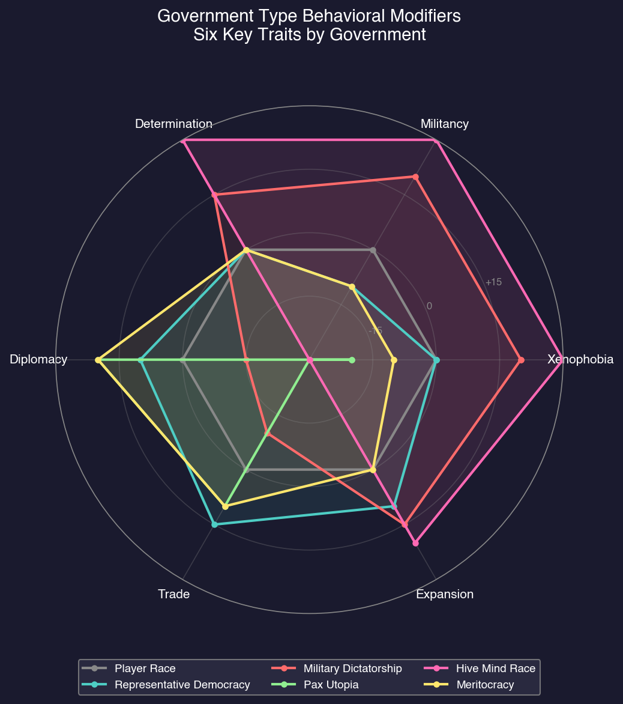

# 2.2 Race Creation

*Updated: v2026.01.30*

## 2.2.1 Race Identity

*Updated: v2026.01.30*

The top of the Create New Race window contains text fields for basic race identification \hyperlink{ref-2.2-1}{[1]}:

- **Race Title**: The full name of your race or empire (e.g., "Player Race").

- **Race Short Name**: An abbreviated name (e.g., "Player Race").

- **Homeworld Name**: The name of your species' home planet (e.g., "Earth").

## 2.2.2 Race Creation Checkboxes

*Updated: v2026.01.30*

The Create New Race window includes several checkboxes that control fundamental race behavior \hyperlink{ref-2.2-1}{[1]}:

- **Non-Player Race**: Designates whether the race is controlled by the AI or the player \hyperlink{ref-2.2-8}{[8]}. When enabled, the race becomes an NPR (Non-Player Race) with autonomous AI behavior. When disabled, you control the race directly.

- **Industrial (Low Tech)**: Sets the race to start with pre-industrial or basic conventional technology levels with minimal infrastructure \hyperlink{ref-2.2-8}{[8]}. When disabled (recommended for most players), the race starts with Trans-Newtonian (TN) technology already researched.

  **Conventional Start** (checkbox enabled):
  - Your race begins at roughly current-day technology levels with no Trans-Newtonian technology
  - No advanced materials, no efficient drives, no energy weapons
  - The game begins with a research phase to discover TN elements and develop basic spacefaring capability
  - Adds 20-50 years of gameplay before you are truly spacefaring *(community estimate)*
  - Advantages: Longer gameplay arc, teaches research system, more time to learn interface

  **Trans-Newtonian Start** (checkbox disabled):
  - Your race begins with TN technology already researched (basic engines, fuel refineries, mines, construction capability)
  - Ships can be designed and built immediately; homeworld has TN-grade industry operating
  - You typically begin with: basic nuclear thermal or nuclear pulse engines, basic sensors, standard armor, fuel harvesting/refining, basic missile and beam weapons, and gravitational survey sensors
  - Advantages: Get into the core gameplay faster, can begin exploring within first few in-game years, better for players focused on ship design and fleet operations

- **Neutral Race**: Establishes a guaranteed neutral relationship with other races sharing the same starting system \hyperlink{ref-2.2-8}{[8]}. Useful for multi-faction starts without immediate conflict.

- **Auto-Assign Tech Points**: Automatically researches starting technologies rather than requiring manual selection \hyperlink{ref-2.2-8}{[8]}. Recommended for new players.

- **Auto-Design Ground Forces**: Automatically generates starting ground unit designs and templates \hyperlink{ref-2.2-8}{[8]}. When disabled, you must manually design all ground force units.

  The auto-design system uses 12 player-usable formation templates \hyperlink{ref-2.2-16}{[16]}. When enabled, the game auto-generates formations in proportion to available resources, prioritized by a built-in priority order (lower number = built first):

  | Template | Abbr | Priority | Auto-Generated | Tech Required |
  |---|---|---|---|---|
  | Planetary Defence Regiment | PDR | 1 | Yes | -- |
  | Armour Regiment | ARM | 2 | Yes | -- |
  | Infantry Regiment | INF | 3 | Yes | -- |
  | Armour Brigade HQ | BHA | 4 | Yes | -- |
  | Infantry Brigade HQ | BHI | 5 | Yes | -- |
  | Garrison | GAR | 6 | Yes | -- |
  | Civilian Garrison | CGR | 7 | No | -- |
  | Preindustrial Regiment | PRE | 8 | No | -- |
  | Xenoarchaeology Expedition | XEN | 9 | Yes | Xenoarchaeology Equipment |
  | Survey Expedition | GEO | 10 | Yes | Geosurvey Equipment |
  | Construction Regiment | CON | 11 | Yes | Construction Equipment |
  | Decontamination Expedition | DEC | 12 | No | Decontamination Equipment |

  Templates marked "Yes" in the Auto-Generated column have a standard production proportion greater than zero, meaning the game produces them automatically in quantity. Templates marked "No" (Civilian Garrison, Preindustrial Regiment, Decontamination Expedition) are defined but not auto-generated -- they are available for manual production only.

  > **Note:** An additional 9 templates exist for spoiler factions (Precursor, Swarm, Rakhas, and Eldar) and are not available to player races \hyperlink{ref-2.2-16}{[16]}.

- **Auto-Design Ship Classes**: Automatically generates starting ship class designs \hyperlink{ref-2.2-8}{[8]}. When disabled, you must manually design all ship classes from scratch.

  The auto-design system uses 67 player-usable ship templates spanning civilian and military roles \hyperlink{ref-2.2-17}{[17]}. When enabled, the game selects components for each template based on your researched technology -- for example, it picks the best available engine, weapon type, and sensor from your tech tree. Templates are parameterized, so the same template produces different designs at different technology levels.

  **Civilian templates** include freighters, colony ships, terraformers, sorium harvesters, geological and gravitational surveyors, passenger liners, mining ships, salvagers, diplomatic ships, tankers, assault transports, jump tenders, orbital habitats, maintenance stations, and construction ships.

  **Military templates** include beam combatants (destroyer, cruiser, and battlecruiser sizes), missile combatants (same size range), point-defence escorts, scouts, fighters, FACs, carriers, dreadnoughts, defence bases, FAC-killers, fighter-killers, military tankers, and jump-capable variants of most combat types.

  **Key technology gates:** Many templates only generate a design if prerequisite technology has been researched \hyperlink{ref-2.2-17}{[17]}:

  - Colony ships require Cryogenic Transport
  - Sorium harvesters require Sorium Harvester
  - Terraformers require Terraforming Module
  - Fighters require Reduced-size Launcher and Hangar Deck
  - Carriers require Hangar Deck
  - Mining ships require Orbital Mining Module
  - Salvagers require Salvage Module
  - Survey ships require the corresponding survey sensor technology (Geological Survey Sensors or Gravitational Survey Sensors)
  - Jump tenders require jump drive technology

  Templates without tech prerequisites (freighters, basic beam and missile combatants, point-defence escorts, defence bases) are generated immediately at game start.

  > **Note:** An additional 21 templates exist for spoiler race factions (Swarm and Invaders) and are not available to player races \hyperlink{ref-2.2-17}{[17]}.

  > **Tip:** Experienced players often disable both auto-design checkboxes to maintain full control over ship classes and ground formations. This is recommended if you have specific fleet doctrines in mind or find the auto-generated designs do not match your preferred approach. See [Section 8.1 Design Philosophy](../8-ship-design/8.1-design-philosophy.md) for manual ship design and [Section 13.1 Unit Types](../13-ground-forces/13.1-unit-types.md) for ground force details.

- **Home System Geo Surveyed**: When enabled, your home system starts with geological surveys complete, revealing all mineral deposits \hyperlink{ref-2.2-8}{[8]}. When disabled, you must survey your own home system.

- **Home System Grav Surveyed**: When enabled, your home system starts with gravitational surveys complete, revealing all jump points \hyperlink{ref-2.2-8}{[8]}. When disabled, you must discover jump points in your own system.

## 2.2.3 Visual Customization

*Updated: v2026.01.30*

The center of the Create New Race window displays visual elements for your race. Each element can be customized using the corresponding button in [Section 2.2.8 Interface Buttons](#228-interface-buttons):

- **Race Portrait**: The leader/representative image for your race, shown in diplomacy screens and race displays.

- **Ship Hull Silhouette**: A preview of the default ship hull appearance for this race.

- **Station Silhouette**: A preview of the default orbital station appearance for this race.

- **Race Flag**: The flag image representing your race, displayed in diplomacy screens and fleet identifiers.

## 2.2.4 Species Attributes

*Updated: v2026.01.30*

The left side of the race creation window displays species attributes. These determine biological preferences, production modifiers, and behavioral traits \hyperlink{ref-2.2-9}{[9]}. Listed in order as they appear on screen:

- **Species Name**: The name of your species (e.g., "Human"). Appears in species-related displays and intelligence reports.

- **Ideal Gravity (G)**: The gravity your species is most comfortable at (Earth = 1.0) \hyperlink{ref-2.2-9}{[9]}.

- **Ideal Temperature (C)**: The surface temperature your species prefers (Earth = approximately 14C) \hyperlink{ref-2.2-9}{[9]}.

- **Ideal Oxygen Pressure (atm)**: The oxygen partial pressure your species requires (Earth = 0.20 atm) \hyperlink{ref-2.2-9}{[9]}.

- **Maximum Atmospheric Pressure (atm)**: The maximum total atmospheric pressure your species can tolerate (Earth default = 4.0 atm) \hyperlink{ref-2.2-9}{[9]}.

- **Maximum Gravity Deviation (G)**: How far from ideal gravity your species can tolerate (Earth default = 0.9, yielding range 0.1G to 1.9G) \hyperlink{ref-2.2-9}{[9]}. Colonies outside this range suffer productivity penalties.

- **Maximum Temperature Deviation (C)**: How far from ideal temperature your species can tolerate (Earth default = +/-24C) \hyperlink{ref-2.2-9}{[9]}. Worlds outside this range require infrastructure modifications.

- **Maximum Oxygen Deviation (atm)**: How far from ideal oxygen pressure your species can tolerate (Earth default = +/-0.1 atm) \hyperlink{ref-2.2-9}{[9]}.

- **Population Density Modifier**: Multiplier affecting max population, infrastructure, and habitat capacity (default 1.0) \hyperlink{ref-2.2-9}{[9]}.

- **Population Growth Modifier**: Multiplier on natural reproduction rate (default 1.0) \hyperlink{ref-2.2-9}{[9]}.

- **Research Rate Modifier**: Multiplier on all scientist productivity (default 1.0) \hyperlink{ref-2.2-9}{[9]}.

- **Factory Production Modifier**: Multiplier on factories, refineries, and shipbuilding (default 1.0) \hyperlink{ref-2.2-9}{[9]}.

- **Determination (1-100)**: How steadfastly the race pursues goals; affects population resistance to occupation \hyperlink{ref-2.2-9}{[9]}.

- **Diplomacy (1-100)**: Ability to negotiate; adds to political modifier annually when diplomatic teams are active \hyperlink{ref-2.2-9}{[9]}.

- **Expansion (1-100)**: Desire to expand territory; affects NPR colonization speed \hyperlink{ref-2.2-9}{[9]}.

- **Militancy (1-100)**: Likelihood of choosing military force; affects garrison requirements \hyperlink{ref-2.2-9}{[9]}.

- **Trade (1-100)**: Willingness to establish trade relationships \hyperlink{ref-2.2-9}{[9]}.

- **Translation (-25 to +25)**: Bonus/penalty to first contact communication attempts \hyperlink{ref-2.2-9}{[9]}.

- **Xenophobia (1-100)**: Fear and distrust of other races; subtracts from political modifier annually \hyperlink{ref-2.2-9}{[9]}.

- **Officer Graduation Age**: The age at which new officers enter service (default 21) \hyperlink{ref-2.2-9}{[9]}. Affects how long officers serve before retirement.

**Key Dynamic**: A high-diplomacy race with low xenophobia can quickly build alliances, while a high-xenophobia, low-diplomacy race will have lasting hostility regardless of peaceful actions. The occupation force requirement for a population is calculated as: Population × ((Determination + Militancy + Xenophobia) / 300) × Political Status Occupation Modifier \hyperlink{ref-2.2-19}{[19]}.

## 2.2.5 Theme Dropdowns

*Updated: v2026.01.30*

The race creation window includes several theme dropdowns that control naming conventions throughout the game. All themes are purely cosmetic with no mechanical effects.

**Species**: Selects a predefined species template. Changing this dropdown loads preset values for species attributes (gravity, temperature, atmosphere preferences, etc.). You can select a template as a starting point and then customize individual attributes.

**System Theme**: Controls automatic naming of newly discovered star systems. For example, using the US theme generates names derived from US cities. Any system can be manually renamed during gameplay.

**Class Theme**: Controls automatic naming of newly designed ship classes. The US theme generates names like Essex, Lexington, Spruance, and Ticonderoga (historical US Navy vessels). Any ship class can be manually renamed.

**Rank Theme**: Controls military rank structures for officers (ship captains, fleet admirals, ground commanders). Available themes include:
- Real-world military structures (US, German/Deutschland, ASEAN)
- Science fiction ranks (Andromeda High Guard, Terran Federation/Starship Troopers)
- Fantasy-inspired ranks (Tolkien, Rigelian swordsman titles)
- 77 additional cultural and fictional themes \hyperlink{ref-2.2-2}{[2]}

**Name Theme**: Controls auto-generation of commander first and last names. Name counts vary widely by theme -- for example, the Japanese (Nihon) theme includes 1,703 first names and 50,000 surnames, while most themes range from a few hundred to several thousand names each \hyperlink{ref-2.2-3}{[3]}. The database contains 130,843 total name entries across 79 commander name themes. Cultural variants apply different naming conventions (e.g., Roman praenomen/nomen/cognomen structure).

## 2.2.6 Starting Installations

*Updated: v2026.01.30*

The right side of the race creation window displays starting values for population and installations. Listed in order as they appear on screen:

- **Population (m)**: Starting population in millions on your homeworld.

- **Shipyards**: Naval and commercial shipyards for ship construction (400 BP/year per slipway at base tech) \hyperlink{ref-2.2-4}{[4]}.

- **Research Facilities**: Generate research points (200 RP/year per lab at base tech) \hyperlink{ref-2.2-5}{[5]}.

- **Conventional Industry**: Pre-TN factories (only present in conventional starts). Default quantity is approximately 1,600 units for a 1-billion population start, scaling with manufacturing population. See [Section 2.5.1](2.5-starting-conditions.md) for details on CI mechanics and conversion options.

- **Construction Factories**: Build installations and infrastructure (10 BP/year per factory) \hyperlink{ref-2.2-6}{[6]}.

- **Ordnance Factories**: Build missiles and expendable ordnance (10 BP/year) \hyperlink{ref-2.2-6}{[6]}.

- **Fighter Factories**: Produce light naval craft under 1,000 tons (10 BP/year) \hyperlink{ref-2.2-6}{[6]}.

- **Mines**: Extract minerals from planetary deposits (10 tons/year per mine at 100% accessibility) \hyperlink{ref-2.2-6}{[6]}.

- **Automated Mines**: Unmanned mining operations for remote locations. Same base output as conventional mines (10 tons/year at base tech) but require no population to operate. Cost: 240 BP \hyperlink{ref-2.2-10}{[10]}.

- **Fuel Refineries**: Process Sorium into usable fuel (40,000 litres/year per refinery) \hyperlink{ref-2.2-6}{[6]}.

- **Financial Centres**: Generate wealth (FinancialProductionValue of 0.25 per centre per construction cycle) \hyperlink{ref-2.2-7}{[7]}.

- **Maintenance Facilities**: Produce Maintenance Supply Points (MSP) to prevent ship degradation. Cost: 60 BP (30 Duranium, 30 Neutronium) \hyperlink{ref-2.2-11}{[11]}.

- **Ground Force Construction Complexes**: Build ground combat units. Cost: 2,400 BP (2,400 Vendarite) \hyperlink{ref-2.2-12}{[12]}.

- **Deep Space Tracking Stations**: Planetary sensor installations that provide detection capability. Cost: 300 BP (100 Duranium, 200 Uridium) \hyperlink{ref-2.2-13}{[13]}.

- **Military Academies**: Train and generate officers. Cost: 2,400 BP (1,200 Duranium, 300 Corbomite, 300 Tritanium, 300 Uridium, 300 Corundium) \hyperlink{ref-2.2-14}{[14]}.

- **Fuel Stockpile (litres)**: Starting fuel reserves for fleet operations.

- **Maintenance Stockpile (MSP)**: Starting maintenance supplies.

- **Starting Tech Points**: Pre-researched technology allocation.

- **Starting Ship Build Points**: Initial shipyard production capacity.

## 2.2.7 Government Type

*Updated: v2026.01.30*

The Government Type dropdown selects a predefined template that affects starting installations, species behavioral traits, and ground force composition \hyperlink{ref-2.2-18}{[18]}. The game includes 38 government types ranging from peaceful democracies to aggressive dictatorships.

**For player races**, the "Player Race" type is the default. This is a neutral template with no behavioral modifiers, allowing you to set all values manually. Selecting a different government type pre-populates the race creation fields with that government's characteristic values, which you can then customize further.

**For NPRs**, government type is randomly assigned during generation based on weighted probability. More common types (Fascist, Despotism, Tyranny) appear frequently, while rare types (Pax Utopia, Peaceful Anarchy) are uncommon. Government type significantly influences NPR behavior -- a Military Dictatorship NPR will be more aggressive and militaristic than a Representative Democracy.

### 2.2.7.1 Behavioral Modifiers

Government types apply modifiers to six species behavioral traits \hyperlink{ref-2.2-18}{[18]}. Positive values increase the trait; negative values decrease it:

| Modifier | Effect When Higher | Effect When Lower |
|----------|-------------------|-------------------|
| Xenophobia | More hostile to aliens, slower diplomacy | More accepting, faster rapport |
| Diplomacy | Better at negotiations, faster treaties | Worse negotiations, slower treaties |
| Militancy | More likely to use force, larger military | Less aggressive, smaller military |
| Expansionism | Faster colonization, more territorial | Slower expansion, less territorial |
| Determination | Stronger resistance to occupation | Weaker resistance to occupation |
| Trade | More willing to establish trade | Less interested in commerce |

**Example Government Modifiers:**

| Government Type | Xenophobia | Diplomacy | Militancy | Expansionism | Determination | Trade |
|-----------------|------------|-----------|-----------|--------------|---------------|-------|
| Player Race | 0 | 0 | 0 | 0 | 0 | 0 |
| Representative Democracy | 0 | +10 | -10 | +10 | 0 | +15 |
| Military Dictatorship | +20 | -15 | +20 | +15 | +15 | -10 |
| Pax Utopia | -20 | +20 | -30 | -30 | -30 | +10 |
| Hive Mind Race | +30 | -30 | +30 | +20 | +30 | -30 |
| Meritocracy | -10 | +20 | -10 | 0 | 0 | +10 |

\hyperlink{ref-2.2-18}{[18]}

### 2.2.7.2 Starting Installation Modifiers

Government types also modify starting installation counts (as percentages of the base values shown in [Section 2.2.6](#226-starting-installations)) \hyperlink{ref-2.2-18}{[18]}:

| Government Type | Shipyards | Labs | Construction | Refineries | Mines | Sensors |
|-----------------|-----------|------|--------------|------------|-------|---------|
| Player Race | 20 | 20 | 30 | 10 | 20 | 4 |
| Representative Democracy | 20 | 20 | 30 | 10 | 20 | 3 |
| Military Dictatorship | 30 | 10 | 25 | 15 | 20 | 5 |
| Corporate Government | 15 | 20 | 30 | 5 | 30 | 5 |
| Contemplative | 10 | 40 | 30 | 10 | 10 | 1 |
| Hive Mind Race | 30 | 5 | 25 | 15 | 25 | 5 |

Note the trade-offs: Military Dictatorship has more shipyards but fewer research labs, while Contemplative governments have extensive research capacity but limited industrial base.

### 2.2.7.3 Ground Force Composition

Government types influence the default composition of auto-generated ground forces through four parameters representing percentages of total ground force allocation \hyperlink{ref-2.2-18}{[18]}:

| Government Type | Heavy Armor | Mech. Infantry | Armored Infantry | Garrison |
|-----------------|-------------|----------------|------------------|----------|
| Player Race | 20% | 40% | 20% | 20% |
| Representative Democracy | 20% | 40% | 20% | 20% |
| Military Dictatorship | 30% | 20% | 40% | 10% |
| Pax Utopia | 0% | 20% | 0% | 80% |
| Fascist | 40% | 20% | 40% | 0% |
| Confederation | 10% | 25% | 10% | 55% |

Militaristic governments emphasize offensive capabilities (Heavy Armor, Armored Infantry), while peaceful governments allocate more to defensive Garrison forces.

### 2.2.7.4 Other Government Parameters

Additional parameters vary by government type \hyperlink{ref-2.2-18}{[18]}:

- **Training Level**: Military training grade (1-3). Higher values indicate better-trained officers. Military governments typically have level 2-3.
- **Shipyards per Academy**: How many shipyards can be supported by each military academy. Lower values indicate more academies needed for the same fleet size.
- **Growth Modifier**: Population growth rate multiplier. Most governments use 1.0; Hive Mind Race uses 1.5.
- **Construction Modifier**: Construction efficiency multiplier. All standard governments use 1.0.

### 2.2.7.5 Complete Government Type List

The 38 available government types, grouped by general category \hyperlink{ref-2.2-18}{[18]}:

**Democracies and Republics:**
Representative Democracy, Absolute Democracy, Rigid Democracy, Republic, Confederation, Religious Democracy

**Peaceful/Utopian:**
Pax Utopia, Peaceful Anarchy, Contemplative, Benevolent Dictatorship, Meritocracy

**Theocracies:**
Peaceful Theocracy, Belligerent Theocracy, Federal Theocracy, Military Theocracy, Religious Aristocracy

**Monarchies and Aristocracies:**
Feudal States, High Imperial Monarchy, Imperial Monarchy, Imperial Council, Clan/Family Council, Oligarchy

**Authoritarian:**
Autocracy, Dictatorship, Despotism, Enlightened Despotism, Tyranny, Plutocracy

**Military:**
Military Anarchy, Military Dictatorship

**Ideological:**
Communism, Stalin Communist, Ordered Socialism, Fascist, Corporate Government

**Special:**
Player Race (neutral template), Hive Mind Race (alien collective)

> **Tip:** For a first game, the "Player Race" default is recommended. It provides balanced starting values with no extreme modifiers. For subsequent games, selecting a government type that matches your intended playstyle can provide thematic consistency and appropriate starting conditions.

## 2.2.8 Interface Buttons

*Updated: v2026.01.30*

The bottom of the Create New Race window contains several buttons:

- **Create Race**: Finalizes the race configuration and adds the race to the game. Use this when you are finished configuring all settings.

- **Change Flag / Change Image / Change Hull / Change Station**: Open dialogs to customize the corresponding visual elements described in [Section 2.2.3 Visual Customization](#223-visual-customization).

- **Random Name**: Randomizes the race name. **Warning:** This button resets most configuration on the screen, not just the name \hyperlink{ref-2.2-15}{[15]}. Do not press it after configuring your race settings or you will lose all your changes.

## 2.2.9 Custom Race Tips

*Updated: v2026.01.30*

Experienced players optimize race creation for specific strategies. Here are common approaches and considerations.

**Earth-Normal (Safe Default)**:

- Standard gravity, temperature, and atmosphere settings
- Works well for a first game
- Many tutorial resources assume these settings
- The largest body of community advice applies to Earth-normal races

**Extreme Environment Species**:

- Designing a species that thrives in conditions hostile to Earth-life (high gravity, extreme temperatures, unusual atmospheres)
- Fewer competing NPRs can use your preferred worlds
- But fewer worlds are habitable overall, making each discovery more valuable
- Terraforming targets differ from standard guides

**Fast Growth Strategy**:

- Maximize population growth rate
- Prioritize early colonization of even marginal worlds
- Numbers compensate for individual colony productivity
- Works well with abundant mineral settings

**Research Focus**:

- Allocate creation points toward research bonuses
- Accept slower population growth or narrower habitability
- Aim to out-tech opponents rather than out-produce them
- Pairs well with fewer but more developed colonies

**Military Focus**:

- Prioritize attributes that support faster ship construction and crew training
- Accept other trade-offs
- Designed for players who expect early conflict or want to play aggressively

> **Warning:** Common Mistakes to Avoid
>
> - Do not make gravity tolerance too narrow — you will struggle to find colonizable worlds
> - Do not neglect temperature range — it is one of the most common reasons worlds are unsuitable
> - Extremely exotic atmospheric requirements (breathing chlorine, etc.) make the game harder without proportional benefit for new players
> - Population growth rate compounds over time — even small differences become enormous over centuries of game time

## Related Sections

- [Section 2.4 Racial Traits](2.4-racial-traits.md) -- Detailed mechanics and strategic implications of trait choices
- [Section 2.5 Starting Conditions](2.5-starting-conditions.md) -- Authoritative reference for starting assets by start type
- [Section 5.5 Terraforming](../5-colonies/5.5-terraforming.md) -- Modifying planetary atmospheres for habitability
- [Section 7.1 Technology Tree](../7-research/7.1-technology-tree.md) -- Technology progression and research
- [Section 8.1 Design Philosophy](../8-ship-design/8.1-design-philosophy.md) -- Designing ships for your fleet
- [Section 13.1 Unit Types](../13-ground-forces/13.1-unit-types.md) -- Ground force unit types and formation design
- [Section 16.1 Officer Generation](../16-commanders/16.1-officer-generation.md) -- Commander generation and skills
- [Appendix A: Formulas](../appendices/A-formulas.md) -- Population growth and colony cost formulas

## References

\hypertarget{ref-2.2-1}{[1]}. Aurora C# v2.7.1 Create New Race window screenshot

\hypertarget{ref-2.2-2}{[2]}. Aurora C# game database (AuroraDB.db v2.7.1) -- DIM\_RankThemeTypes table contains 77 rank themes including cultural (US, Japan, Russia, etc.), sci-fi (Andromeda, Terran Federation, Warhammer 40K), and fantasy (Tolkien, Barsoom) options

\hypertarget{ref-2.2-3}{[3]}. Aurora C# game database (AuroraDB.db v2.7.1) -- DIM\_CommanderNames table contains 130,843 total name entries across 79 DIM\_CommanderNameTheme entries. Name counts per theme vary from ~200 to 51,703 (Japanese theme: 1,703 first names, 50,000 surnames)

\hypertarget{ref-2.2-4}{[4]}. Aurora C# game database (AuroraDB.db v2.7.1) -- FCT\_Race.ShipBuilding = 400.0 (base shipbuilding rate per slipway per year). First researchable upgrade: Shipbuilding Rate 560 BP (TechTypeID=30)

\hypertarget{ref-2.2-5}{[5]}. Aurora C# game database (AuroraDB.db v2.7.1) -- FCT\_Race.Research = 200 (base RP per lab per year). First researchable upgrade: Research Rate 240 RP (TechTypeID with AdditionalInfo=240)

\hypertarget{ref-2.2-6}{[6]}. Aurora C# game database (AuroraDB.db v2.7.1) -- FCT\_Race default production rates: ConstructionProduction=10.0, MineProduction=10.0, FuelProduction=40000.0. DIM\_PlanetaryInstallation confirms matching production values (ConstructionValue=1.0, OrdnanceProductionValue=1.0, FighterProductionValue=1.0, MiningProductionValue=1.0, RefineryProductionValue=1.0)

\hypertarget{ref-2.2-7}{[7]}. Aurora C# game database (AuroraDB.db v2.7.1) -- DIM\_PlanetaryInstallation: Financial Centre FinancialProductionValue=0.25 per construction cycle. Workers field=0.05 (workers per installation needed to operate)

\hypertarget{ref-2.2-8}{[8]}. Aurora C# game database (AuroraDB.db v2.7.1) -- FCT\_Race table contains columns for NPR (boolean), NeutralRace (boolean), and race configuration checkboxes visible on the Create New Race window

\hypertarget{ref-2.2-9}{[9]}. Aurora C# game database (AuroraDB.db v2.7.1) -- FCT\_Species table. Human defaults: Gravity=1.0, GravDev=0.9, Temperature=287.03K (14C), TempDev=24.0, Oxygen=0.2 atm, OxyDev=0.1, PressMax=4.0, ProductionRateModifier=1.0, ResearchRateModifier=1.0, PopulationGrowthModifier=1.0, PopulationDensityModifier=1.0, GraduationAge=21, Xenophobia/Diplomacy/Translation/Militancy/Expansionism/Determination/Trade all present as integer columns

\hypertarget{ref-2.2-10}{[10]}. Aurora C# game database (AuroraDB.db v2.7.1) -- DIM\_PlanetaryInstallation "Automated Mine" (ID 12): Cost=240, Workers=0, MiningProductionValue=1.0, CargoPoints=25000. Mineral cost: 240 Corundium

\hypertarget{ref-2.2-11}{[11]}. Aurora C# game database (AuroraDB.db v2.7.1) -- DIM\_PlanetaryInstallation "Maintenance Facility" (ID 21): Cost=60, Workers=0.05, MaintenanceValue=1.0. Mineral cost: 30 Duranium, 30 Neutronium

\hypertarget{ref-2.2-12}{[12]}. Aurora C# game database (AuroraDB.db v2.7.1) -- DIM\_PlanetaryInstallation "Ground Force Construction Complex" (ID 17): Cost=2400, Workers=1.0, GroundTrainingValue=1.0. Mineral cost: 2400 Vendarite

\hypertarget{ref-2.2-13}{[13]}. Aurora C# game database (AuroraDB.db v2.7.1) -- DIM\_PlanetaryInstallation "Deep Space Tracking Station" (ID 11): Cost=300, Workers=0, SensorValue=1.0. Mineral cost: 100 Duranium, 200 Uridium

\hypertarget{ref-2.2-14}{[14]}. Aurora C# game database (AuroraDB.db v2.7.1) -- DIM\_PlanetaryInstallation "Military Academy" (ID 14): Cost=2400, Workers=0, AcademyValue=1.0. Mineral cost: 1200 Duranium, 300 Corbomite, 300 Tritanium, 300 Uridium, 300 Corundium

\hypertarget{ref-2.2-15}{[15]}. Aurora Forums -- Community reports confirm Random Name button resets species attributes and other configuration fields, not just the race name. This is a well-known UI behavior reported by multiple players

\hypertarget{ref-2.2-16}{[16]}. Aurora C# game database (AuroraDB.db v2.7.1) -- DIM\_AutomatedGroundTemplateDesign table contains 21 entries: 12 player-usable (SpecialNPR=0) and 9 spoiler faction templates (SpecialNPR>0: 3 Precursor, 2 Swarm, 3 Rakhas, 1 Eldar). Player templates with StandardProportion>0 are auto-generated; those with StandardProportion=0 (Civilian Garrison, Preindustrial Regiment, Decontamination Expedition) are available but not auto-produced. RequiredTechID links to FCT\_TechSystem for tech-gated templates (Geosurvey Equipment=65897, Xenoarchaeology Equipment=66653, Construction Equipment=65813, Decontamination Equipment=78587)

\hypertarget{ref-2.2-17}{[17]}. Aurora C# game database (AuroraDB.db v2.7.1) -- DIM\_AutomatedClassDesign table contains 88 entries: 67 player-usable (SurrenderStatus>0) and 21 spoiler faction templates (SurrenderStatus=0: 15 Swarm/SwarmDesign=1, 6 Invader). Player templates span commercial (freighters, colony ships, terraformers, harvesters, surveyors, liners, miners, salvagers, diplomatic ships, tankers, transports, jump tenders, habitats, maintenance stations) and military (beam and missile combatants in DD/CA/BC sizes, PD escorts, scouts, fighters, FACs, carriers, dreadnoughts, defence bases, FAC-killers, fighter-killers). KeyTechA/KeyTechB reference FCT\_TechSystem for tech prerequisites (e.g., Cryogenic Transport=479, Sorium Harvester=25148, Hangar Deck=26276, Reduced-size Launcher=26237)

\hypertarget{ref-2.2-18}{[18]}. Aurora C# game database (AuroraDB.db v2.7.1) -- GovType table contains 38 government types with columns for behavioral modifiers (XenophobiaMod, DiplomacyMod, MilitancyMod, ExpansionismMod, DeterminationMod, TradeMod), starting installation multipliers (Shipyards, Labs, Construction, Refineries, Mines, Sensors), ground force composition percentages (HA=Heavy Armor, MI=Mechanized Infantry, AI=Armored Infantry, GAR=Garrison), and other parameters (TrainingLevel, SYPerAcademy, GrowthMod, ConstMod, MaxChance for NPR generation probability). GovTypeID=1 "Player Race" has all behavioral modifiers set to 0 and MaxChance=0 (never randomly assigned to NPRs)

\hypertarget{ref-2.2-19}{[19]}. AuroraWiki, "Political Status" and "Unrest" -- Occupation force requirement formula: Population × ((Determination + Militancy + Xenophobia) / 300) × Political Status Occupation Modifier. Database FCT\_Species confirms Determination, Militancy, and Xenophobia as integer columns; DIM\_PopPoliticalStatus confirms OccupationForceMod values by status level.
