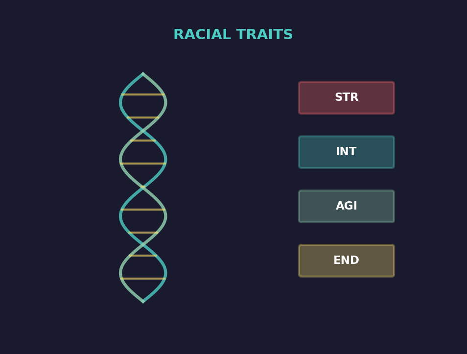
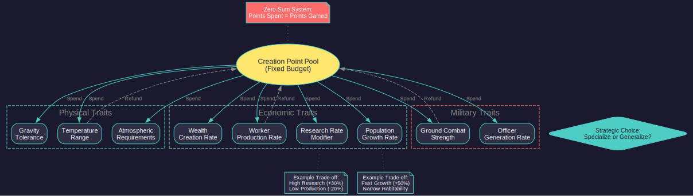
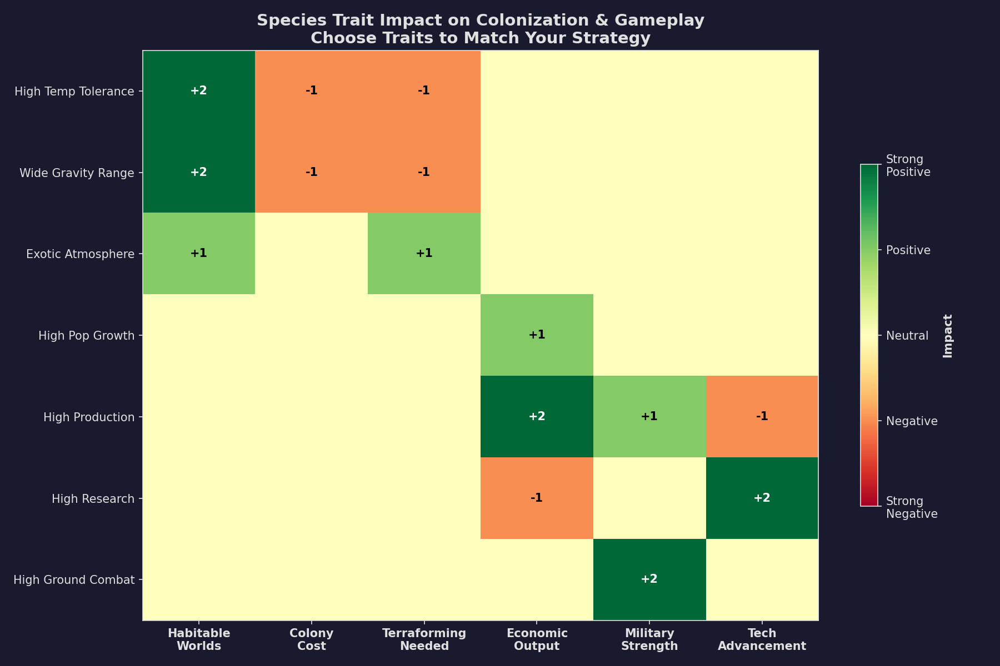
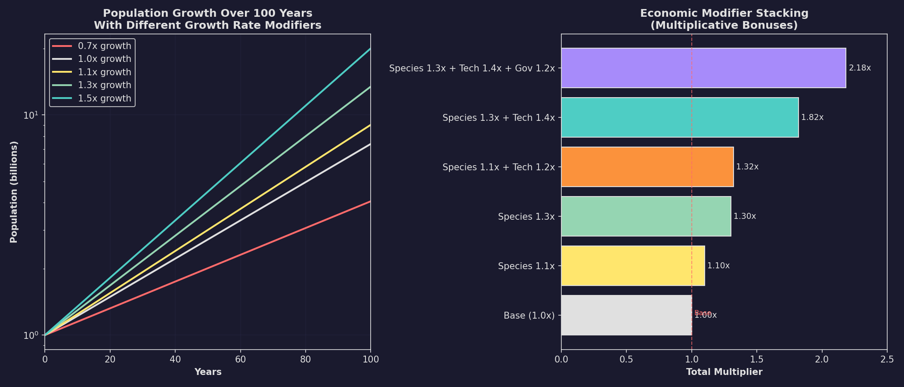
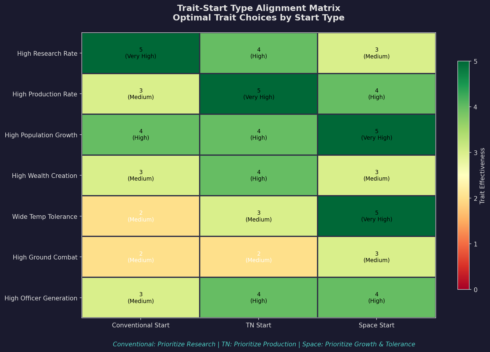

# 2.4 Racial Traits and Species Customization

*Updated: v2026.01.30*

Aurora's race creation system uses a point-buy approach to define your species' biological, economic, and military characteristics \hyperlink{ref-2.4-1}{[1]}. These choices are permanent once the game begins and fundamentally shape how your civilization develops across all phases of play.

> **Note:** This section covers the trait point allocation system. For species biological attributes (gravity, temperature, atmosphere), see [Section 2.2 Race Creation](2.2-race-creation.md). For starting technology and installations, see [Section 2.5 Starting Conditions](2.5-starting-conditions.md).

## 2.4.1 Race Creation Overview

*Updated: v2026.01.30*

When creating a custom race, you are allocated a pool of creation points to distribute among various traits. Each trait can be improved above the default at the cost of creation points, or reduced below the default to gain additional points for use elsewhere. This zero-sum system forces meaningful trade-offs -- a species cannot excel at everything simultaneously.

**The Creation Point System:**

- Each race receives a fixed pool of creation points at creation \hyperlink{ref-2.4-1}{[1]}
- The exact number of creation points and per-trait costs are not exposed in the game database; the system uses an internal point budget visible only on the race creation screen *(unverified — [#702](https://github.com/ErikEvenson/aurora-manual/issues/702) -- exact point pool and cost curve not confirmed in DB)*
- Improving a trait above 1.0 (default) costs points
- Reducing a trait below 1.0 refunds points
- All points must be allocated before the game begins
- Trait values are permanent and cannot be changed after game start

**Design Philosophy:**

The trait system encourages specialization. A species optimized for rapid population growth will necessarily sacrifice research speed or production efficiency. Understanding these trade-offs and aligning them with your intended strategy is the core of race design.

> **Tip:** New players should use the default settings (all traits at 1.0) for their first game. The defaults produce a balanced species that does not punish any particular playstyle. Experiment with custom traits once you understand which aspects of gameplay you want to emphasize.

## 2.4.2 Physical Traits

*Updated: v2026.01.30*

Physical traits define your species' biological tolerances and determine which worlds can be colonized without terraforming or environmental infrastructure. These are the most impactful traits for long-term colonization strategy.

### 2.4.2.1 Ideal Temperature Range

| Parameter | Default (Human) | Effect |
|-----------|-----------------|--------|
| Ideal Temperature | 14C (57F) \hyperlink{ref-2.4-2}{[2]} | Center of your comfort range |
| Temperature Tolerance | +/- 24C \hyperlink{ref-2.4-2}{[2]} | Width of the habitable band |
| Colony Cost Impact | 0 within range | Increases proportionally outside range |

Worlds with surface temperatures outside your species' tolerance range incur colony cost -- an ongoing infrastructure expense per unit of population. The further outside the range, the higher the cost.

> **Warning:** Temperature is often the single most restrictive habitability factor. A narrow temperature tolerance dramatically reduces the number of naturally habitable worlds in the galaxy.

### 2.4.2.2 Gravity Tolerance

| Parameter | Default (Human) | Effect |
|-----------|-----------------|--------|
| Homeworld Gravity | 1.0G \hyperlink{ref-2.4-2}{[2]} | Your species' ideal gravity |
| Minimum Gravity | 0.1G \hyperlink{ref-2.4-2}{[2]} | Lowest tolerable gravity |
| Maximum Gravity | 1.9G \hyperlink{ref-2.4-2}{[2]} | Highest tolerable gravity |

Colonies on worlds outside the gravity tolerance range suffer significant productivity penalties. Unlike temperature, gravity cannot be modified through terraforming -- it is a permanent property of each world.

### 2.4.2.3 Atmospheric Requirements

Your species requires a specific atmospheric composition to survive unprotected:

| Requirement | Description |
|-------------|-------------|
| Breathable Gas | The gas your species respires (oxygen for humans) |
| Minimum Pressure | Lowest atmospheric pressure tolerable (too thin = suffocation) |
| Maximum Pressure | Highest atmospheric pressure tolerable (too dense = crushing) |
| Toxic Gases | Gases lethal to your species even in trace amounts |

**Terraforming Interaction:** Atmospheres can be modified over time using terraforming installations (see [Section 5.5 Terraforming](../5-colonies/5.5-terraforming.md)). Adding breathable gas, removing toxic gases, and adjusting pressure are all possible but require decades of sustained effort.

### 2.4.2.4 Radiation and Colony Cost

Radiation levels are a property of individual system bodies (tracked via the RadiationLevel field in the game database) and contribute to colony cost \hyperlink{ref-2.4-6}{[6]}. However, radiation tolerance is **not a configurable species trait** during race creation -- there is no radiation tolerance column in the FCT\_Species table. All species are affected equally by radiation levels on colony worlds. Higher radiation increases colony cost, which can be mitigated through infrastructure and terraforming.

> **Tip:** Exotic species designs (unusual atmosphere, extreme temperature preference) can find habitable worlds that would be hostile to Earth-standard life. This provides a strategic advantage against NPRs with different biological requirements, as you will not compete for the same worlds.

## 2.4.3 Economic Traits

*Updated: v2026.01.30*

Economic traits are species-level multipliers that affect the productivity of your entire civilization. These operate as innate biological modifiers and stack multiplicatively with empire-level bonuses from technology research.

| Trait | Default | Effect | Strategic Impact |
|-------|---------|--------|-----------------|
| Worker Production Rate | 1.0 \hyperlink{ref-2.4-3}{[3]} | Multiplier on factory, refinery, and shipyard output | Higher = faster ship construction, more installations built per year |
| Wealth Creation Rate | 1.0 \hyperlink{ref-2.4-3}{[3]} | Multiplier on wealth generated per population unit | Higher = more available funding for civilian operations |
| Research Rate Modifier | 1.0 \hyperlink{ref-2.4-3}{[3]} | Multiplier on all scientist research output | Higher = faster technology advancement across all fields |
| Population Growth Rate | 1.0 \hyperlink{ref-2.4-3}{[3]} | Multiplier on natural reproduction | Higher = faster colony growth, more workers sooner |

### 2.4.3.1 Worker Production Rate

Affects the output of all production installations:

- Factories produce more construction capacity per installation
- Fuel refineries process more fuel per installation
- Shipyards complete hulls faster
- Mining installations extract minerals more efficiently

A species with a 1.2 production rate effectively gets 20% more output from the same number of installations. Over centuries of gameplay, this compounds enormously.

### 2.4.3.2 Wealth Creation Rate

Wealth is Aurora's abstraction for civilian economic activity. Higher wealth creation supports:

- Larger civilian shipping fleets
- More civilian mining operations
- Greater tax revenue
- Faster civilian sector growth

### 2.4.3.3 Research Rate Modifier

Directly multiplies the research points generated by each assigned scientist. A species with a 1.3 research rate discovers technologies 30% faster than a 1.0 species with equivalent scientists and labs.

> **Tip:** Research rate compounds with scientist skill bonuses and research lab quantities. A high research rate species with skilled scientists can achieve a dramatic technological edge over neighbors.

### 2.4.3.4 Population Growth Rate

Controls how quickly colonies gain population through natural reproduction. Population is Aurora's fundamental resource -- more people means more workers, more tax revenue, and more commanders generated.

| Growth Rate | Long-term Effect |
|-------------|-----------------|
| 0.7 | Slow growth; colonies take much longer to become productive |
| 1.0 | Standard growth rate |
| 1.3 | Fast growth; colonies reach full productivity decades earlier |
| 1.5+ | Very fast growth; can outpopulate opponents but may strain resources |

> **Warning:** Population growth rate compounds over centuries of game time. A seemingly small difference (1.0 vs 1.2) results in dramatically different population totals after 200+ years of gameplay.

> **Note:** The Population Growth Rate modifier is a **species-level** trait that applies only to your own species \hyperlink{ref-2.4-3}{[3]}. It does not affect NPR growth rates. To slow NPR growth, use the **Difficulty Modifier** in [Section 2.1 New Game Options](2.1-new-game-options.md). Lowering your own growth rate to 0.5 without also reducing NPR difficulty will put you at a significant disadvantage.

## 2.4.4 Military Traits

*Updated: v2026.01.30*

Military traits affect your species' innate combat capabilities, separate from technological advantages gained through research.

| Trait | Default | Effect |
|-------|---------|--------|
| Ground Combat Strength | 1.0 \hyperlink{ref-2.4-4}{[4]} | Multiplier on ground force combat effectiveness |
| Officer Generation Rate | 1.0 *(unverified — [#702](https://github.com/ErikEvenson/aurora-manual/issues/702))* | Multiplier on commander generation frequency |

### 2.4.4.1 Ground Combat Strength Modifier

This modifier applies to all ground combat units fielded by your species. A species with a 1.3 ground combat strength has forces that are 30% more effective in ground engagements, independent of technology or training level.

**Practical effects:**

- Fewer ground units needed to garrison colonies
- Better odds in planetary invasions
- Reduced casualties in defensive engagements
- Does not affect space combat (ship weapons, shields, etc.)

### 2.4.4.2 Officer Generation Rate

Controls how frequently new commanders (officers, scientists, administrators) are generated from your population. More officers means:

- More scientists available for research assignments
- More ship captains and fleet admirals for naval operations
- More governors for colony administration
- More ground force commanders for army operations

> **Tip:** Officer generation rate is often overlooked but becomes critical in large empires. Running out of qualified commanders can bottleneck expansion even when ships and colonies are plentiful. See [Section 16.1 Officer Generation](../16-commanders/16.1-officer-generation.md) for detailed mechanics.

## 2.4.5 Starting Conditions and Trait Interactions

*Updated: v2026.01.30*

Starting conditions interact with racial traits to define your initial capabilities. For the authoritative reference on starting assets (population, installations, and resources), see [Section 2.5 Starting Conditions](2.5-starting-conditions.md).

**Key Trait Interactions:**

**Conventional Start** pairs well with research-focused species traits, as the long pre-spacefaring phase benefits from faster research output. A high research rate can cut decades off the bootstrapping period.

**Trans-Newtonian Start** pairs well with production-focused species traits, as immediate access to shipyards and factories lets high-production species capitalize on their advantage from turn one.

## 2.4.6 Pre-Designed Species and Race Templates

*Updated: v2026.01.30*

Aurora provides pre-configured species templates accessible via the **Species** dropdown on the race creation screen. The dropdown loads preset values for species attributes (gravity, temperature, atmosphere preferences, production modifiers, and behavioral traits), which can then be customized. The default species is "Human" with Earth-normal parameters \hyperlink{ref-2.4-7}{[7]}.

**Using Species Templates:**

1. Open the Create New Race window
2. Select a species from the **Species** dropdown
3. The species attributes (left side of the window) are populated with preset values
4. Customize individual attributes as desired
5. Configure naming themes and starting installations separately

> **Note:** The number and names of available species templates are defined in the game's internal configuration. The database includes spoiler race species (Eldar, Precursor, Ancients, Invaders) which are not available as player race templates -- they are used internally by the game for spoiler factions \hyperlink{ref-2.4-7}{[7]}.

**Custom Race Design Flexibility:**

The race creation system is highly flexible -- virtually any combination of traits is valid, allowing for:

- Extreme specialization (all points in one area)
- Broad generalization (slightly above average in everything)
- Exotic biology (non-standard atmospheres, extreme temperatures)
- Narrative-driven design (traits chosen for story rather than optimization)

> **Tip:** For a first game, use the default Human species template with default starting installations. This provides balanced defaults that do not penalize any particular playstyle.

**Common Custom Approaches:**

| Strategy | Key Traits | Trade-offs |
|----------|-----------|------------|
| Research Rush | High research rate, moderate production | Slower fleet construction, fewer workers |
| Population Boom | High growth rate, high density | Lower individual productivity per worker |
| Industrial Powerhouse | High production rate, high wealth | Slower research, fewer habitable worlds |
| Military Supremacy | High ground combat, high officer gen | Weaker economy, slower expansion |
| Adaptive Colonizer | Wide environmental tolerances | Lower economic modifiers across the board |

## Related Sections

- [Section 2.2 Race Creation](2.2-race-creation.md) -- Species biological attributes and commander themes
- [Section 2.5 Starting Conditions](2.5-starting-conditions.md) -- Detailed starting assets for each start type
- [Section 5.1 Establishing Colonies](../5-colonies/5.1-establishing-colonies.md) -- Colonization mechanics and colony cost
- [Section 5.5 Terraforming](../5-colonies/5.5-terraforming.md) -- Modifying planetary environments
- [Section 7.1 Research](../7-research/7.1-technology-tree.md) -- Research system and technology progression
- [Section 16.1 Officer Generation](../16-commanders/16.1-officer-generation.md) -- Commander generation mechanics
- [Appendix A: Formulas](../appendices/A-formulas.md) -- Population growth and trait modifier formulas

## References

\hypertarget{ref-2.4-1}{[1]}. Aurora C# v2.7.1 Create New Race window -- point-buy trait allocation system with fixed creation point pool

\hypertarget{ref-2.4-2}{[2]}. Aurora C# game database (AuroraDB.db v2.7.1) -- FCT\_Species table, Human defaults: Temperature=287.03K (13.88C, approximately 14C), TempDev=24.0 (+/-24C tolerance, corrected from previously stated +/-22C), Gravity=1.0G, GravDev=0.9 (minimum 0.1G, maximum 1.9G, corrected from previously stated 3.0G)

\hypertarget{ref-2.4-3}{[3]}. Aurora C# game database (AuroraDB.db v2.7.1) -- FCT\_Species table, Human defaults: ProductionRateModifier=1.0, ResearchRateModifier=1.0, PopulationGrowthModifier=1.0, PopulationDensityModifier=1.0

\hypertarget{ref-2.4-4}{[4]}. Aurora C# game database (AuroraDB.db v2.7.1) -- FCT\_Race table: GUStrength=10, TrainingLevel=1 for default Player Race. The "1.0" ground combat modifier refers to the species-level multiplier

\hypertarget{ref-2.4-5}{[5]}. Aurora Forums, "v2.1.1 Changes List" -- TN start population increased from 500 million to one billion

\hypertarget{ref-2.4-6}{[6]}. Aurora C# game database (AuroraDB.db v2.7.1) -- FCT\_SystemBody.RadiationLevel column exists, confirming radiation is a per-body property. FCT\_Species table has no radiation tolerance column, confirming it is not a configurable species trait during race creation

\hypertarget{ref-2.4-7}{[7]}. Aurora C# game database (AuroraDB.db v2.7.1) -- FCT\_Species table contains 5 species: Human, Eldar, Precursor, Ancients, Invaders. Human species defaults used for player races; others are spoiler faction species
