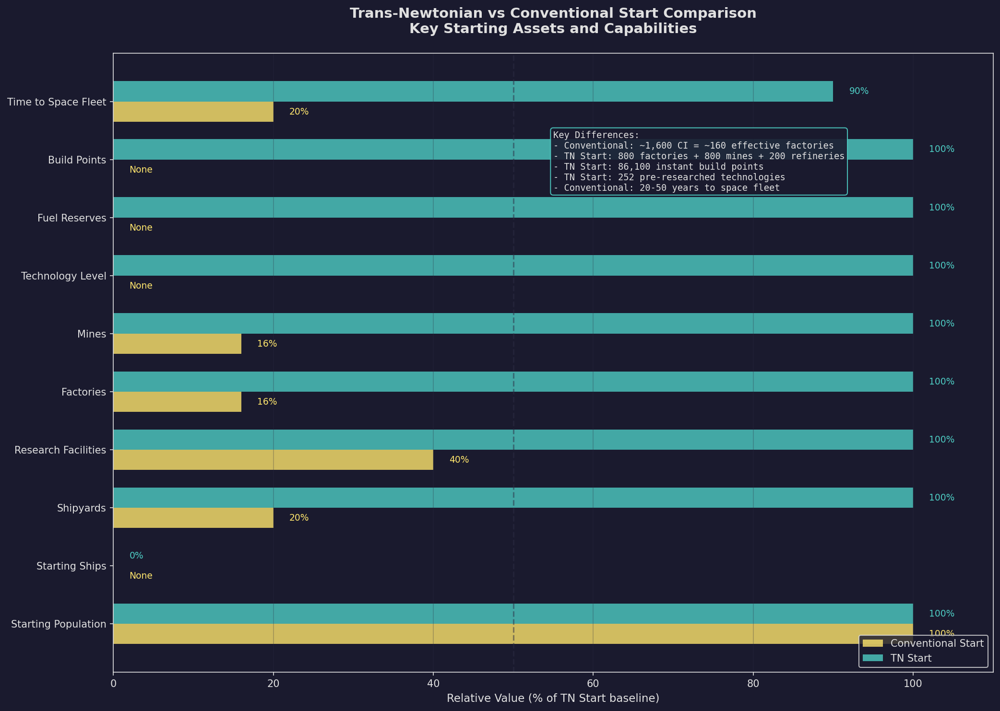
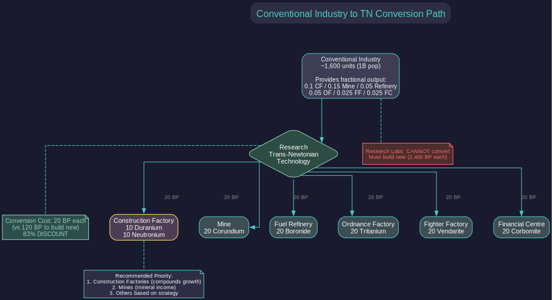
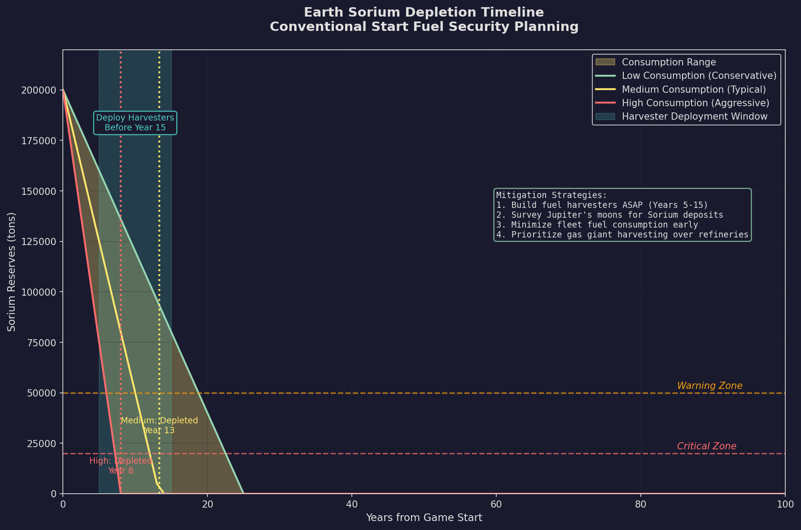
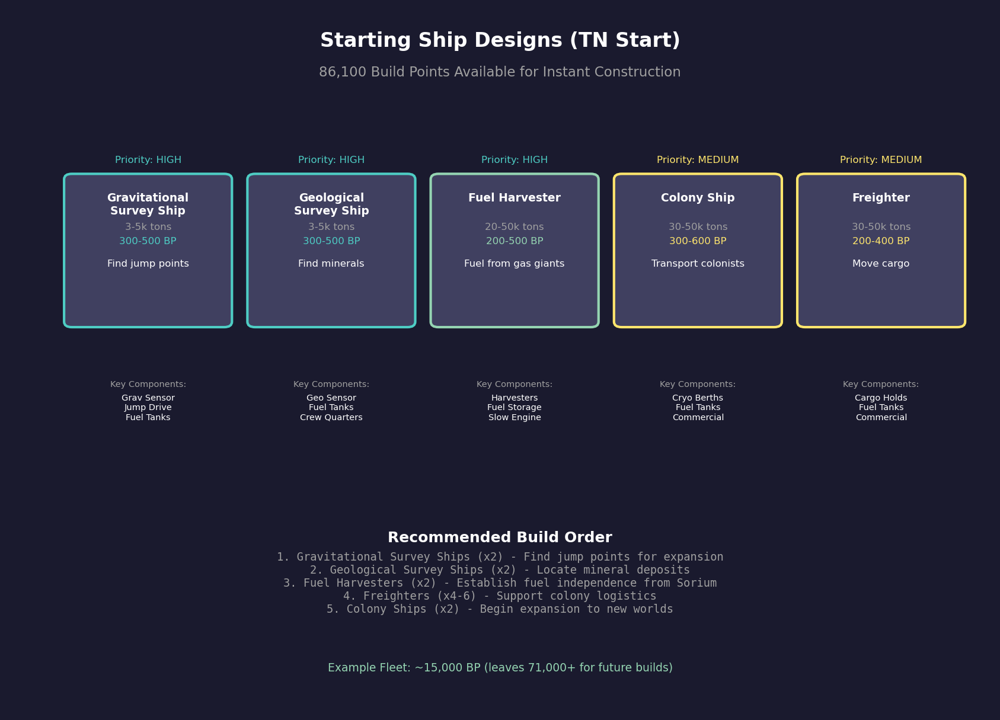
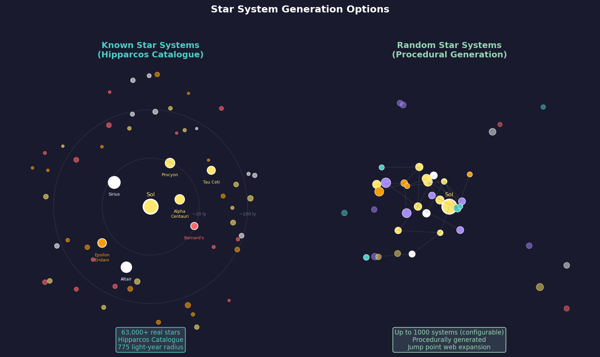

# 2.5 Starting Conditions

*Updated: v2026.01.31*

## 2.5.1 Conventional Start

*Updated: v2026.01.31*

A Conventional Start begins your civilization at roughly early 21st century technology. You have no Trans-Newtonian elements, no advanced propulsion, and no capability to build practical spacecraft. This is the slower, more immersive option.

**What You Begin With:**

- **Earth (or equivalent homeworld)**: A populated world with conventional industry
- **Conventional Industry**: ~1,600 units for a 1-billion population start (8x manufacturing population in millions). Each CI unit provides fractional output across multiple categories: 0.1 Construction Factory, 0.15 Mine, 0.05 Fuel Refinery, 0.05 Ordnance Factory, 0.025 Fighter Factory, and 0.025 Financial Centre \hyperlink{ref-2.5-4}{[4]}. This versatile but inefficient industry should be converted to dedicated TN installations after researching Trans-Newtonian Technology.
- **Research Facilities**: ~16 labs for a 1-billion population start (1 per 12 million manufacturing population). These function immediately and can begin TN Technology research on day one.
- **Shipyards**: 1 Naval Shipyard (1,000 tons) + 1 Commercial Shipyard (10,000 tons) \hyperlink{ref-2.5-5}{[5]}
- **Scientists and Administrators**: A pool of commanders ready to be assigned to research and governance
- **No Ships**: You cannot build spacecraft until TN technology is researched
- **Basic Research**: Access to the research system, with TN-enabling technologies available as research targets

**CI-to-TN Conversion Mechanic:**

Once Trans-Newtonian Technology is researched, Conventional Industry can be converted to any of six dedicated TN installation types at 20 [BP](../appendices/B-glossary.md) (Build Points) each (versus 120 BP to build new -- an 83% discount) \hyperlink{ref-2.5-6}{[6]}:

| Target Installation | Mineral Cost (per conversion) |
|---------------------|------------------------------|
| Construction Factory | 10 Duranium + 10 Neutronium |
| Mine | 20 Corundium |
| Fuel Refinery | 20 Boronide |
| Ordnance Factory | 20 Tritanium |
| Fighter Factory | 20 Vendarite |
| Financial Centre | 20 Corbomite |

> **Note:** Research Labs cannot be converted from CI -- they must be built new at 2,400 BP each. Prioritize converting CI to Construction Factories first (compounds all future production), then Mines (mineral income), then other types based on your strategic needs. For a detailed conversion strategy, see [Section E.3 Early Game Economic Bootstrap](../examples/early-game-economy.md).

**Early Game Priorities (Conventional Start):** *(v2.6.0)*

The conventional start requires methodical progression through several phases: researching Trans-Newtonian Technology first, building TN industry (mines, factories, labs), designing survey vessels, and establishing fuel production before Sorium runs out. A year-by-year worked example covering the first 10 years of a conventional start is available in [Section E.3 Early Game Economic Bootstrap](../examples/early-game-economy.md).

> **Warning -- Sorium Depletion:** Earth's Sorium deposits are finite and will eventually run out. In a conventional start, you rely on ground-based refineries consuming Sorium to produce fuel. If you exhaust your Sorium before establishing fuel harvesting from a gas giant, your fleet becomes stranded. Monitor Sorium reserves on the Minerals tab and begin building fuel harvester ships as soon as your shipyard is operational. This is not optional -- it is a race condition that catches many players off guard.

**Timeline**: Expect 20-50 in-game years from game start to having a functional space fleet *(community estimate)*. The exact duration depends on research allocation and luck with scientist skills.

**Why Choose Conventional Start:**

- You experience the full arc from pre-space to interstellar
- Forces deep engagement with the research system
- Creates natural pacing — combat encounters are far in the future
- Provides ample time to learn the interface and mechanics
- Strongest narrative of technological progress

**Recommended Adjustments for Conventional Start:**

When using a conventional start with reduced research speed (e.g., 50%), consider increasing your starting installations to compensate for the slower early game:

- **Research Facilities**: Increase from the default to compensate. The default start includes approximately 40 research facilities \hyperlink{ref-2.5-2}{[2]}. You can adjust this directly on the race creation screen (see [Section 2.2.6 Starting Installations](2.2-race-creation.md)).
- **Conventional Industry**: Consider increasing above the default ~1,600 units. Additional CI provides early flexibility and helps prevent running out of money during the bootstrapping phase when you have no other income sources. Remember that CI generates 0.025 Financial Centre equivalent per unit (40 CI = 1 Financial Centre worth of wealth generation).

> **Tip:** These adjustments are particularly helpful for new players who want the learning benefits of a conventional start without an excessively slow early game. The numbers above assume a 50% research speed modifier -- adjust proportionally for other values.

## 2.5.2 Trans-Newtonian Start

*Updated: v2026.01.30*

A Trans-Newtonian Start begins your civilization already in the space age. Basic spacefaring technology is researched, industry is established, and you can immediately begin designing ships and expanding into space.

**What You Begin With:**

- **Homeworld with TN Industry**: Mines, factories, research labs, fuel refineries, and shipyards already operational
- **Starting Build Points**: 86,100 BP for instant ship and ground unit construction \hyperlink{ref-2.5-8}{[8]}. You design your own starting ships and build them instantly using these points (see [Starting Ships](#starting-ships-tn-start) below).
- **Starting Tech Points**: 160,000 RP for immediate research completion \hyperlink{ref-2.5-8}{[8]}. These can be spent on the Economics window to instantly complete technologies.
- **Pre-Researched Technology**: 252 starting technologies are already researched, including basic engines, sensors, armor, weapons, shields, and all supporting component types (see [Starting Technologies](#starting-technologies-tn-start) below).
- **Commander Pool**: Officers, scientists, and administrators ready for assignment
- **Established Economy**: Your homeworld is already producing TN materials and can begin ship construction immediately
- **Fuel Reserves**: A starting stockpile of refined fuel (24 million litres) for your initial ships

**Starting Assets (TN Start, Default Settings):**

The following values are from a default TN start \hyperlink{ref-2.5-2}{[2]}. Starting installations can be customized directly on the race creation screen (see [Section 2.2.6 Starting Installations](2.2-race-creation.md)).

| Installation | Starting Count |
|-------------|---------------|
| Population | 1,000 million (1 billion) |
| Naval Shipyard | 1 (1,000 ton capacity, 1 slipway) |
| Commercial Shipyard | 1 (10,000 ton capacity, 1 slipway) |
| Construction Factories | 800 |
| Mines | 800 |
| Ordnance Factories | 200 |
| Fuel Refineries | 200 |
| Financial Centres | 400 |
| Maintenance Facilities | 300 |
| Automated Mines | 160 |
| Fighter Factories | 80 |
| Research Facilities | 40 |
| Ground Force Construction Complexes | 8 |
| Deep Space Tracking Stations | 7 |
| Military Academies | 2 |
| Infrastructure | 200 |
| Conventional Industry | 0 (TN start only) |
| Fuel Stockpile | 24,000,000 litres |
| Maintenance Stockpile ([MSP](../appendices/B-glossary.md)) | 60,000 |

\hyperlink{ref-2.5-2}{[2]} \hyperlink{ref-2.5-7}{[7]}

> **Note:** TN starts have zero Conventional Industry because they begin with fully operational TN installations. The CI mechanics described in [Section 2.5.1](#251-conventional-start) apply only to conventional starts.

> **Note:** Starting population was increased from 500 million to one billion as of v2.1.1 \hyperlink{ref-2.5-1}{[1]}.

### Starting Ships (TN Start)

Unlike some 4X games, Aurora does **not** provide pre-built ships at game start. Instead, you receive 86,100 Starting Build Points that can be spent on instant construction of ships and ground units you design yourself \hyperlink{ref-2.5-8}{[8]}.

**How to Use Starting Build Points:**

1. Design your ship classes using the Class Design window (see [Section 8.1 Design Philosophy](../8-ship-design/8.1-design-philosophy.md))
2. Open the Miscellaneous tab of the Class Design window
3. If you have remaining Starting Build Points, an "Instant Build" section appears
4. Select a destination fleet and the number of ships to build
5. Click "Instant Build" to construct ships immediately without using shipyard capacity

**Recommended Starting Ship Designs:**

New players should prioritize designing and instantly building:

| Ship Type | Purpose | Typical Size | Estimated Cost |
|-----------|---------|--------------|----------------|
| Gravitational Survey Ship | Finds jump points for interstellar expansion | 3,000-5,000 tons | 300-500 BP |
| Geological Survey Ship | Locates mineral deposits on planets/moons | 3,000-5,000 tons | 300-500 BP |
| Fuel Harvester | Collects fuel from gas giants | 20,000-50,000 tons | 200-500 BP |
| Colony Ship | Transports colonists to new worlds | 30,000-50,000 tons | 300-600 BP |
| Freighter | Moves cargo between colonies | 30,000-50,000 tons | 200-400 BP |

> **Tip:** With 86,100 BP available, you can build a substantial starting fleet. A typical early game fleet might include 2 gravitational survey ships, 2 geological survey ships, 2 fuel harvesters, and several freighters/colony ships -- all constructed instantly before advancing time.

> **Note:** Starting Build Points can only be used for instant construction. Once spent, additional ships must be built through normal shipyard production.

### Starting Technologies (TN Start)

A TN start begins with 252 technologies pre-researched, covering all the fundamental components needed for spacecraft construction \hyperlink{ref-2.5-9}{[9]}. Key technology categories include:

**Propulsion and Power:**
- Nuclear Radioisotope Engine (basic TN engine technology)
- Radioisotope Thermal Generator (basic reactor)
- Fuel Consumption: 1 Litre per Engine Power Hour (baseline efficiency)
- No Power Plant Boost (standard configuration)

**Sensors:**
- Thermal Sensor Sensitivity 5 (passive thermal detection)
- EM Sensor Sensitivity 5 (passive electromagnetic detection)
- Active Grav Sensor Strength 10 (active gravitational sensors)
- Planetary Sensor Strength 250 (ground-based detection)
- Conventional Geological Survey Sensors (for survey ships)

**Weapons:**
- Infrared Laser with 10cm Focal Size
- 10cm Railgun with Launch Velocity 10,000
- 10cm Meson Focal Size
- 10cm Microwave Focal Size
- 15cm Carronade
- Particle Beam Strength 2, Range 60,000 km
- Gauss Cannon Rate of Fire 2
- Gun-Type Fission Warhead (missile warhead)
- Missile Launcher Sizes 1-24

**Defense:**
- Duranium Armour (basic TN armor)
- Alpha Shields with Shield Regeneration Rate 1
- Electronic Counter-countermeasures - 0

**Ship Systems:**
- All Engineering Section variants (standard, small, tiny, fighter)
- All Crew Quarters variants
- All Cargo Hold variants
- All Fuel Storage variants
- Bridge, Auxiliary Control, Flag Bridge
- Military and Commercial Jump Drives
- Turret Tracking Speed (10% Gear) 1250 km/s

**Fire Control:**
- Fire Control Range 20,000 km
- Fire Control Speed Rating 1250 km/s
- Full range of Fire Control size/range and size/tracking speed modifiers

> **Note:** In addition to these pre-researched technologies, you receive 160,000 Starting Tech Points that can be spent immediately to complete additional research projects, allowing you to jump-start specific technology paths \hyperlink{ref-2.5-8}{[8]}.

**Early Game Priorities (TN Start):**

1. **Design and Build Starting Ships**: Use your Starting Build Points to instantly construct survey ships (gravitational and geological), fuel harvesters, and transport vessels. See [Starting Ships](#starting-ships-tn-start) above for recommendations.
2. **Survey Your Home System**: Send your gravitational survey ships to find jump points for interstellar expansion. Send geological survey ships to identify mineral deposits on planets and moons.
3. **Assess Minerals**: Check your homeworld's mineral reserves. If any critical minerals are low (especially Gallicite for engines), finding alternative sources is urgent.
4. **Begin Research**: Assign scientists to key technologies. Early priorities:
   - Better engines (faster ships, more fuel efficient)
   - Construction technology (faster building)
   - Sensors (detect threats earlier)
   - Shields or armor improvements (survivability)
5. **Expand Industry**: Queue additional mines and factories on your homeworld. More industry means faster growth.
6. **Establish Fuel Harvesting**: Deploy fuel harvester ships to gas giants in your system to ensure long-term fuel supply.
7. **Explore through jump points**: Once jump points are located (see [Section 10.2 Jump Transit](../10-navigation/10.2-jump-transit.md)), send ships through to survey new systems. This reveals new colonization targets and potential threats.

**Timeline**: You can be exploring neighboring star systems within 5-10 in-game years *(community estimate)*. A meaningful military fleet can be operational within 15-25 years depending on priorities *(community estimate)*.

## 2.5.3 Starting System Options

*Updated: v2026.01.30*

Your starting star system choice determines the geography of your early game and influences expansion patterns. Aurora provides two primary starting system options, plus the "Known Stars" setting which affects exploration but not your starting location.

### 2.5.3.1 Sol System Start (Default)

Sol is the real solar system — the Sun, Mercury, Venus, Earth, Mars, Jupiter, Saturn, Uranus, Neptune, and their moons, with mineral deposits and conditions pre-defined. When "Known Star Systems" is selected in game creation, Sol's layout reproduces the actual solar system bodies with fixed mineral deposits and orbital parameters \hyperlink{ref-2.5-3}{[3]}.

**Advantages of Sol:**

- **Familiarity**: You know the layout. Mars, the Moon, and the gas giants are where you expect them. Distances and travel times feel intuitive.
- **Known Geography**: Jupiter and Saturn are guaranteed fuel harvesting locations. Mars and the Moon are known nearby colonization targets.
- **Tutorial Compatibility**: Most guides and tutorials assume a Sol start, making them easier to follow.
- **Real Stellar Neighborhood**: If using Known Stars, nearby systems through jump points are actual stars (Alpha Centauri, Barnard's Star, etc.) at correct relative distances \hyperlink{ref-2.5-3}{[3]}.

**Disadvantages of Sol:**

- **Fixed Mineral Distribution**: Sol's mineral deposits are pre-set and may not be optimal \hyperlink{ref-2.5-3}{[3]}. Earth's minerals are finite and will eventually deplete.
- **Predictable**: If you have played Sol starts before, the early game exploration is less exciting.
- **Distance to Gas Giants**: Jupiter is quite far from Earth — early fuel harvesting requires significant travel time.

### 2.5.3.2 Custom Start via SpaceMaster (Advanced)

Aurora C# does not have a built-in "random start" option during game creation — you always begin in Sol. However, SpaceMaster mode provides tools to create a custom starting system after game creation \hyperlink{ref-2.5-10}{[10]}.

**Custom Start Process:**

1. Create a new game normally with a temporary throwaway race
2. Enable SpaceMaster mode (click the crystal ball icon in the top right toolbar)
3. Select **"Open System View"** from the menu bar — this displays all planets in your systems
4. In the lower right corner, SpaceMaster buttons appear:
   - **Create System** — Generates a random star system (with Known Stars enabled, you can select from nearby real stars)
   - **Delete System** — Removes an unwanted system
   - **Modify Body** — Edits planetary characteristics (distance, diameter, atmosphere, etc.)
   - **Create Race** — Establishes a species on a selected planet
5. Create your desired starting system and modify the homeworld as needed
6. Use "Create Race" to establish your civilization there
7. Delete the original temporary race via the Race Information screen
8. Disable SpaceMaster mode to begin normal gameplay

> **Note:** This is an advanced workaround requiring familiarity with SpaceMaster tools. New players should learn the game with a standard Sol start first. See [Section 18.5 SpaceMaster Mode](../18-advanced-topics/18.5-spacemaster-mode.md) for more details on SM capabilities.

The "Known Star Systems" option affects which real stars appear when creating systems or exploring, but does not change the default starting location.

### 2.5.3.3 Known Star Systems Option

The "Known Star Systems" checkbox (see [Section 2.1.2.2 Center Column](2.1-new-game-options.md#2122-center-column)) controls how **newly explored** systems are generated — it does not change your starting location \hyperlink{ref-2.5-11}{[11]}.

**With Known Stars Enabled:**

- Your starting system is still Sol (unless using SpaceMaster Empire)
- Jump point exploration reveals real stars from the Hipparcos Catalogue at their actual relative positions
- Over 63,000 stars within 775 light years are available \hyperlink{ref-2.5-11}{[11]}
- No black holes or nebulae are generated (since none exist near Earth in reality)

**With Known Stars Disabled:**

- Your starting system is still Sol (unless using SpaceMaster Empire)
- Jump point exploration reveals procedurally-generated systems with random star types

### 2.5.3.4 Starting in a Specific Non-Sol Real Star

**You cannot start in a specific real star system like Alpha Centauri** \hyperlink{ref-2.5-12}{[12]}. Aurora does not provide a built-in option to select your starting system from the Known Stars database. Your choices are:

1. **Sol** — The default Earth-based start
2. **Random system** — Via SpaceMaster Empire (procedurally generated, not a real star)

The Known Stars option affects only exploration destinations, not starting location. If you want to roleplay starting from Alpha Centauri, your only option would be database editing outside the game, which is beyond normal gameplay and not officially supported.

### 2.5.3.5 Recommendation

- **First game**: Use Sol. The familiarity helps while learning.
- **Subsequent games**: Consider SpaceMaster Empire for variety and fresh challenges, but only after you are comfortable with the game mechanics.
- **Experienced players**: Random starts are generally preferred for the unpredictability and unique strategic puzzles each game presents.

**Hybrid Approach**: Start in Sol with Known Stars enabled. This gives familiar geography locally but real astronomical data for systems beyond. You will encounter Alpha Centauri, Barnard's Star, and other real stars as you explore — just not as your starting point.

## Related Sections

- [Section 2.1 New Game Options](2.1-new-game-options.md) -- Game creation settings (research speed, NPR difficulty, spoiler races)
- [Section 2.2 Race Creation](2.2-race-creation.md) -- Race creation UI fields and starting installation configuration
- [Section 2.3 System Generation](2.3-system-generation.md) -- How star systems and mineral deposits are generated
- [Section 2.4 Racial Traits](2.4-racial-traits.md) -- Trait interactions with starting conditions
- [Section 6.1 Minerals](../6-economy-and-industry/6.1-minerals.md) -- The eleven TN mineral types and their uses
- [Section 6.2 Mining](../6-economy-and-industry/6.2-mining.md) -- Mining operations and mineral extraction
- [Section 6.3 Construction](../6-economy-and-industry/6.3-construction.md) -- Building shipyards and installations
- [Section 7.1 Technology Tree](../7-research/7.1-technology-tree.md) -- Research system overview
- [Section 8.1 Design Philosophy](../8-ship-design/8.1-design-philosophy.md) -- Designing survey ships and fleet vessels
- [Section 10.1 Movement Mechanics](../10-navigation/10.1-movement-mechanics.md) -- Jump point transit and interstellar travel
- [Section 14.1 Fuel](../14-logistics/14.1-fuel.md) -- Fuel production and consumption
- [Section 17.1 Geological Survey](../17-exploration/17.1-geological-survey.md) -- Survey operations and system exploration

## References

\hypertarget{ref-2.5-1}{[1]}. Aurora Forums, "v2.1.1 Changes List" -- TN start population increased from 500 million to one billion (also referenced in Section 2.4 as ref-2.4-5)

\hypertarget{ref-2.5-2}{[2]}. Aurora C# game database (AuroraDB.db v2.7.1) -- FCT\_PopulationInstallations for default TN start on Earth: Construction Factory=800, Mine=800, Ordnance Factory=200, Fuel Refinery=200, Financial Centre=400, Maintenance Facility=300, Automated Mine=160, Fighter Factory=80, Research Facility=40, Ground Force Construction Complex=8, Deep Space Tracking Station=7, Military Academy=2, Infrastructure=200. FCT\_Population: Population=1000.0 (million), FuelStockpile=24000000, MaintenanceStockpile=60000

\hypertarget{ref-2.5-3}{[3]}. Aurora C# game database (AuroraDB.db v2.7.1) -- FCT\_SystemBody table contains Sol system bodies with pre-set orbital parameters and mineral deposits. DIM\_KnownStar table contains real star data (Alpha Centauri, Barnard's Star, etc.) with correct positions for Known Stars games

\hypertarget{ref-2.5-4}{[4]}. Aurora C# game database (AuroraDB.db v2.7.1) -- DIM\_PlanetaryInstallation: Conventional Industry (ID 38) has ConstructionValue=0.1, MiningProductionValue=0.15, RefineryProductionValue=0.05, OrdnanceProductionValue=0.05, FighterProductionValue=0.025, FinancialProductionValue=0.025. All values confirmed against database.

\hypertarget{ref-2.5-5}{[5]}. Aurora C# game database (AuroraDB.db v2.7.1) -- Conventional start shipyard configuration is 1 Naval Shipyard (1,000 tons) + 1 Commercial Shipyard (10,000 tons). Starting shipyard values are set during game initialization and scale with race configuration.

\hypertarget{ref-2.5-6}{[6]}. Aurora C# game database (AuroraDB.db v2.7.1) -- DIM\_PlanetaryInstallation CI conversion entries: Convert CI to Construction Factory (ID 27, 20 BP, 10 Duranium + 10 Neutronium), Convert CI to Mine (ID 28, 20 BP, 20 Corundium), Convert CI to Fuel Refinery (ID 30, 20 BP, 20 Boronide), Convert CI to Ordnance Factory (ID 36, 20 BP, 20 Tritanium), Convert CI to Fighter Factory (ID 37, 20 BP, 20 Vendarite), Convert CI to Financial Centre (ID 50, 20 BP, 20 Corbomite). All conversions verified against database.

\hypertarget{ref-2.5-7}{[7]}. Aurora C# game database (AuroraDB.db v2.7.1) -- FCT\_Shipyard table. Default TN start includes 1 Naval Shipyard (SYType=1, 1,000 ton capacity) and 1 Commercial Shipyard (SYType=2, 10,000 ton capacity), each with 1 slipway. Default capacities confirmed via DIM\_PlanetaryInstallation: Naval Shipyard Complex (ID 4) and Commercial Shipyard Complex (ID 32).

\hypertarget{ref-2.5-8}{[8]}. Aurora C# game database (AuroraDB.db v2.7.1) -- FCT\_Race table for default player race: StartTechPoints=160000 (research points for instant completion), StartBuildPoints=86100 (build points for instant ship/unit construction). These values represent the default TN start allocation.

\hypertarget{ref-2.5-9}{[9]}. Aurora C# game database (AuroraDB.db v2.7.1) -- FCT\_TechSystem table: 252 technologies have StartingSystem=1, indicating they are pre-researched for a TN start. Key technologies include Nuclear Radioisotope Engine (TechSystemID 24604), Duranium Armour (3136), Alpha Shields (3148), Active Grav Sensor Strength 10 (24397), and Trans-Newtonian Technology (27434).

\hypertarget{ref-2.5-10}{[10]}. Aurora Forums, "How to Generate a Custom Starting System or Species" — Tutorial describing SpaceMaster tools for creating custom starting systems in C# Aurora: Create System, Delete System, Modify Body, Create Race. Accessed via Open System View menu with SM mode active. [aurora2.pentarch.org](https://aurora2.pentarch.org/index.php?topic=11136.0)

\hypertarget{ref-2.5-11}{[11]}. Aurora Forums, "v2.4.0 Changes List" -- Known Stars database expanded to 63,000+ stars using Hipparcos Catalogue. AuroraWiki, "Galaxy" -- "Earth's solar system is meticulously recreated according to known astronomical data, all others are randomly created." Known Stars affects exploration destinations, not starting location.

\hypertarget{ref-2.5-12}{[12]}. Aurora Forums, "Non-Sol start?" topic and AuroraWiki documentation confirm no built-in option to start in a specific non-Sol real star. SpaceMaster Empire generates random systems; Known Stars affects exploration only. [aurora2.pentarch.org](https://aurora2.pentarch.org/index.php?topic=10659.0)
