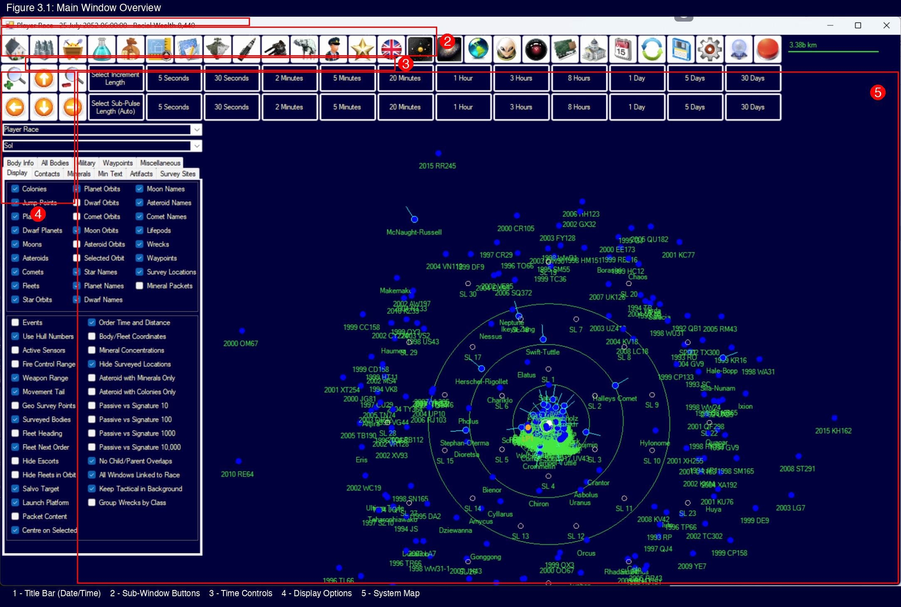
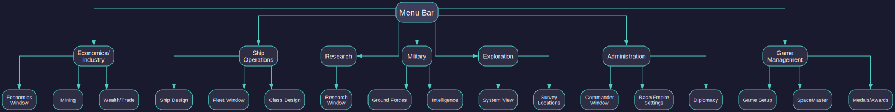
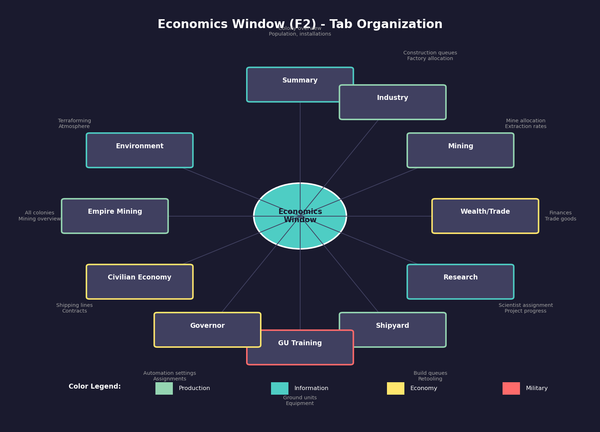
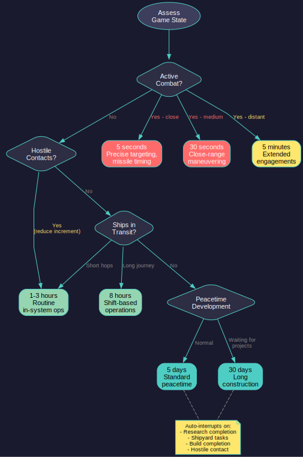
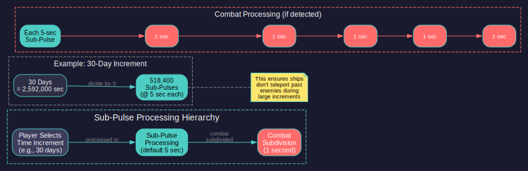

# 3.1 Main Window

*Updated: v2026.01.30*

> **[Screenshot Pending — #1135]** Toolbar Button Reference showing all toolbar options

## 3.1.1 Menu Bar

*Updated: v2026.01.30*

The menu bar along the top of the Aurora window provides access to all game windows and functions. It is organized into logical categories.

**Key Menu Categories:**

**Economics / Industry:**

- **Economics Window**: The central hub for colony management -- shows populations, installations, production queues, mineral stockpiles, and industry assignments for each colony
- **Mining**: Detailed view of mining operations across your empire
- **Wealth/Trade**: Financial systems including trade routes and civilian economy

**Ship Operations:**

- **Ship Design**: Create and modify ship classes (see [Section 8.1 Design Philosophy](../8-ship-design/8.1-design-philosophy.md)) (the blueprint, not individual ships)
- **Fleet Window / Naval Organization**: Manage fleets, assign ships, give movement orders (see [Section 9.4 Fleet Organization](../9-fleet-management/9.4-fleet-organization.md))
- **Class Design**: Detailed component-level ship design interface

**Research:**

- **Research Window**: Assign scientists to projects, manage research priorities, view the technology tree (see [Section 7.1 Technology Tree](../7-research/7.1-technology-tree.md))

**Military:**

- **Ground Forces**: Design, train, and manage army units (see [Section 13.1 Unit Types and Formation Design](../13-ground-forces/13.1-unit-types.md))
- **Intelligence**: Espionage and counter-intelligence operations

**Exploration:**

- **System View / Galactic Map**: Navigate between star systems and view the known galaxy
- **Survey Locations**: Track survey progress across your explored territory

**Administration:**

- **Commander Window**: View and assign all commanders (officers, scientists, governors, admirals)
- **Race / Empire Settings**: Manage high-level empire configuration
- **Diplomacy**: Interact with known races (see [Section 15.1 Alien Races](../15-diplomacy/15.1-alien-races.md))

**Game Management:**

- **Game Setup**: Access game creation and configuration
- **SpaceMaster**: Toggle omniscient mode for game management
- **Medals / Awards**: View service records and decorations

Most players quickly develop the habit of keeping certain windows open at all times (Economics, Fleet, and the System Map being the most common persistent windows) while opening others as needed.

## 3.1.2 Economics Window Structure

*Updated: v2026.01.30*

The Economics Window is the most frequently used window in Aurora C#, serving as the central management hub for all colony-level operations. It is organized into 11 tabs \hyperlink{ref-3.1-1}{[1]}, each addressing a distinct aspect of colony and empire management.

**Tab Overview:**

| Tab | Purpose |
|-----|---------|
| Summary | Colony overview displaying population, installations, and mineral stockpiles |
| Industry | Construction queues, factory allocation, and build orders |
| Mining | Mine allocation, mineral deposits, and extraction rates |
| Wealth/Trade | Trade goods, wealth generation, and financial summary |
| Research | Research project assignments and scientist allocation (see [Section 7.1 Technology Tree](../7-research/7.1-technology-tree.md)) |
| Shipyard | Shipyard management, build queues, and retooling (see [Section 9.1 Shipyards](../9-fleet-management/9.1-shipyards.md)) |
| GU Training | Ground unit training and equipment (see [Section 13.1 Unit Types](../13-ground-forces/13.1-unit-types.md)) |
| Governor | Governor assignment and automated assignment settings (see [Section 16.3 Assignments](../16-commanders/16.3-assignments.md)) |
| Civilian Economy | Civilian shipping lines, contracts, and subsidies |
| Empire Mining | Empire-wide mining overview across all colonies |
| Environment | Terraforming progress and atmospheric composition |

**Window Behaviour:**

- The colony selector (left-hand tree view) displays all populations ranked by significance
- Switching tabs retains the selected colony, allowing rapid inspection across categories
- Multiple Economics windows can be open simultaneously (Shift+click or Ctrl+Shift+F4) to compare colonies side-by-side \hyperlink{ref-3.1-6}{[6]}
- The window supports linked mode, synchronizing the displayed race with other open windows (see [Section 3.1.9 Linked Windows](#319-linked-windows))

**Keyboard Shortcuts:**

Each tab can be opened directly via Ctrl+F4 through Ctrl+Shift+F4 variants, with the Industry tab being the default when no specific tab is requested.

## 3.1.3 Save System

*Updated: v2026.01.30*

C# Aurora uses a manual save system rather than continually updating to disk (as VB6 Aurora did), which is one of the reasons the C# version runs much faster.

**Save Button:**

A dedicated Save Button on the toolbar triggers the save process. When activated:

1. The database prior to the save is copied to a new file called `AuroraDBSaveBackup.db` \hyperlink{ref-3.1-2}{[2]}
2. The `AuroraDB.db` file is then updated with the current game state
3. The previous `AuroraDBSaveBackup.db` is automatically copied to `AuroraDBPreviousSaveBackup.db` \hyperlink{ref-3.1-2}{[2]}

This provides automatic backups of your last two saves at all times.

**Save Performance:**

As of v1.10.0, the entire database save runs within a single transaction, resulting in significantly faster save times \hyperlink{ref-3.1-3}{[3]}. This improvement becomes increasingly beneficial as campaign databases grow in size.

**Data Loss Prevention:**

- If you close Aurora without saving, your game reverts to the last save
- To restore a previous save, delete `AuroraDB.db` and rename the desired backup file to `AuroraDB.db`

For event colour import/export functionality, see [Section 3.4.2 Event Display and Colours](3.4-event-log.md).

## 3.1.4 Toolbar

*Updated: v2026.01.30*

Below the menu bar, the toolbar provides quick-access buttons for the most commonly used windows and functions. These duplicate menu functions but save navigation time.

**Common Toolbar Buttons:**

- **Economics**: One-click access to colony management
- **Fleet/Naval**: Open fleet management and movement orders
- **Research**: Jump directly to the research interface
- **Ship Design**: Open the ship design system
- **System Map Controls**: Zoom, center, and display toggles for the map
- **SpaceMaster Toggle**: Quick toggle for SpaceMaster mode
- **Time Controls**: Adjacent to or integrated with the time increment system

**Toolbar Tips:**

- Hovering over toolbar buttons typically shows a tooltip identifying the function
- The toolbar layout is fixed -- it cannot be customized or rearranged
- Learning the toolbar layout saves significant time compared to menu navigation for frequently accessed windows
- Some toolbar buttons may appear grayed out if their function is not currently available (e.g., certain SpaceMaster-only functions when SpaceMaster is disabled)

## 3.1.5 Logistics Reports

*Updated: v2026.01.30*

The Fleet Window includes a Logistics Reports tab that provides a comprehensive overview of fleet supply status across five categories (Fuel, MSP, Ordnance, Deployment Time, and Time Since Overhaul). Ships are sorted by urgency within each category. For detailed fleet logistics, see [Section 14.1 Fuel](../14-logistics/14.1-fuel.md) and [Section 9.1 Shipyards](../9-fleet-management/9.1-shipyards.md).

## 3.1.6 Race Comparison Window

*Updated: v2026.01.30*

The Race Comparison Window is a read-only interface that displays side-by-side comparisons between different player races within a single game. The window automatically scales to accommodate the number of player races present. It is designed as a quick reference tool rather than an interactive editing interface.

## 3.1.7 Mineral Search Window

*Updated: v2026.01.30*

The Mineral Search Window enables systematic location of celestial bodies meeting specific mineral requirements. It provides enhanced flexibility compared to earlier versions.

**Search Capabilities:**

- Specify minimum amounts and accessibilities for every mineral simultaneously
- Results are ordered by the mineral with the highest minimum amount specified
- Filters operate sequentially from left to right (e.g., selecting gas giants exclusively makes asteroid specifications irrelevant)
- Amounts are aligned in columns for straightforward comparison across multiple celestial bodies

**Example Usage:**

Search for all bodies with at least 1,000 tons of Duranium with 0.3 accessibility or higher, then further refine by adding a minimum of 1 ton of Sorium to narrow results.

**Mineral Search Flag:**

Players can mark individual systems with a "Mineral Search Flag" from the Galactic Map interface (see [Section 3.5.5 Fleet Disposition](3.5-galactic-map.md) for details on setting flags). The Mineral Search Window can then restrict searches to flagged systems only, enabling targeted mineral searching within a subset of known space.

## 3.1.8 Screen Resolution

*Updated: v2026.01.30*

C# Aurora launches with a minimum resolution of **1440 x 900** \hyperlink{ref-3.1-4}{[4]}. Most windows maintain fixed, non-resizable layouts to ensure consistent UI presentation across different monitor configurations \hyperlink{ref-3.1-5}{[5]}.

**Resizable Windows:**

- **Tactical Map and Galactic Map**: These windows can be resized and expanded to fill the entire screen, allowing players to maximize their viewing area for strategic purposes.
- **Class Design Window**: Includes a dedicated "Wide" option that expands the interface *(unverified — [#706](https://github.com/ErikEvenson/aurora-manual/issues/706))*, providing additional horizontal space for reviewing complex ship design specifications.
- **System View Window**: Has a "Wide" variant *(unverified — [#706](https://github.com/ErikEvenson/aurora-manual/issues/706))*, displaying an extra six columns of system body data. This is particularly useful for monitoring eccentric orbit information.

All other windows use fixed dimensions and cannot be resized.

## 3.1.9 Linked Windows

*Updated: v2026.01.30*

C# Aurora includes a feature to synchronize multiple open windows. When the linked windows option is activated, changing the current Race in one window automatically updates the race/faction displayed across all other open windows simultaneously. This eliminates the need to manually switch each window individually when reviewing or managing information for a different civilization.

This feature is particularly useful when managing multiple player races in the same game or when using SpaceMaster mode to oversee different factions.

## 3.1.10 Multiple Window Instances

*Updated: v2026.01.30*

In C# Aurora, players can open multiple instances of most windows simultaneously. Several windows remain limited to a single instance, including the tactical map, Create Project, Missile Design, Turret Design, and the Medals window \hyperlink{ref-3.1-6}{[6]}.

**Supported Windows for Multiple Instances:**

- Class windows
- Galactic map windows
- Fleet windows
- Ground Forces windows
- Economics windows
- And most other standard interface windows

**Practical Applications:**

- Transferring ships between fleets displayed in separate fleet windows via drag-and-drop
- Moving ground units between different Ground Forces window hierarchies
- Comparing ship classes side-by-side using multiple class windows
- Viewing different colonies simultaneously in separate Economics windows

**Opening Additional Instances:**

- Hold **Shift** while clicking a toolbar button to open a second instance of that window
- Hold **Shift** while using keyboard shortcuts (e.g., Ctrl+Shift+F4 opens a second Economics window at the Industry tab)

## 3.1.11 Keep Tactical Map in Background

*Updated: v2026.01.30*

The Tactical Map serves as the main game window in C# Aurora. When opening other windows from the toolbar, the Tactical Map normally gains focus and moves to the front, placing previously-opened windows behind it.

The **"Keep Tactical in Background"** option addresses this. When enabled, after pressing a toolbar button on the Tactical Map to open a new window, the Tactical Map automatically moves to the background, leaving all other windows in front of it and the newly opened window on top.

This allows players to maintain visibility of multiple windows simultaneously without manual repositioning, making multi-window gameplay significantly more efficient.

## 3.1.12 Status Bar

*Updated: v2026.01.30*

The status bar (typically at the bottom or top of the main window) displays critical game state information and provides the time advancement controls.

**Game Time Display:**
The current in-game date and time are always visible. Aurora uses a date format showing year, month, day, and time of day. This is your primary reference for when events occur and how much time has passed.

**Time Increment Controls:**

The time increment system is how you advance the game clock. Aurora is not real-time -- nothing happens until you explicitly advance time. The available increments are \hyperlink{ref-3.1-7}{[7]}:

| Increment | Typical Use |
|-----------|-------------|
| 5 seconds | Detailed combat resolution, precise timing |
| 30 seconds | Combat, close-range tactical maneuvering |
| 2 minutes | Short-range combat, orbital operations |
| 5 minutes | Extended combat, in-system transits |
| 20 minutes | In-system travel, patrol operations |
| 1 hour | Routine in-system operations |
| 3 hours | Standard movement periods |
| 8 hours | Shift-based operations |
| 1 day | Peacetime development, short construction |
| 5 days | Standard peacetime increment |
| 30 days | Extended peacetime, long construction projects |

**How Time Advancement Works:**

1. Select your desired increment using the controls
2. Click the advance button (or use the keyboard shortcut)
3. Aurora processes all events, movement, construction, research, and other activities for that time period
4. If an interrupt event occurs (hostile contact, research completion, etc.), the advance stops at that point regardless of the selected increment
5. Event messages appear in the Event Log for anything notable that occurred

**Practical Time Management:**

- During peacetime development: Use 5-day or 30-day increments to progress quickly
- When ships are in transit: Match your increment to expected arrival times
- During combat: Drop to 5-30 second increments for fine control
- After any hostile contact: Immediately reduce increment length until the situation is resolved
- The game auto-interrupts on significant events, but you should still match increment to situation -- a 30-day increment during an active battle means 30 days of uncontrolled combat

**Auto-Advance Toggle:**

The auto-advance button provides continuous time advancement without requiring repeated manual clicks. When activated, the button changes to a brighter color to indicate that auto-advance is engaged. *(unverified — [#706](https://github.com/ErikEvenson/aurora-manual/issues/706) -- visual indicator behavior not confirmed in available sources)*

- **Activation**: Click the auto-advance toggle so it highlights, then click any time increment button. The game will repeatedly advance by that increment automatically.
- **Stopping**: Auto-advance continues until an interrupt event occurs or the player manually stops it.

**Interrupt Events (stop auto-advance):** \hyperlink{ref-3.1-11}{[11]}

| Event Type | Example |
|------------|---------|
| Research completion | A research project finishes |
| Shipyard task completion | A slipway is added, a ship finishes construction |
| Industry build completion | An installation or component batch completes |
| Unassigned research labs | Labs available but no project assigned (safeguard against wasted capacity) |

**Non-Interrupt Events (do NOT stop auto-advance):** \hyperlink{ref-3.1-11}{[11]}

- Medals awarded
- New officers generated
- Other routine administrative notifications

> **Tip:** Auto-advance paired with 5-day increments is the standard approach for peacetime development. The interrupt system ensures you never miss a research completion or shipyard delivery, while the unassigned-labs safeguard prevents accidentally wasting research capacity after a project finishes.

**Sub-Pulse Processing**: Within each time increment, Aurora processes events in sub-pulses \hyperlink{ref-3.1-8}{[8]}. The default sub-pulse length is 5 seconds \hyperlink{ref-3.1-9}{[9]}, though this is a game setting rather than combat-specific. This means even a 30-day advance will correctly resolve combat encounters that occur during transit -- ships do not "teleport past" enemies.

**Sub-Pulse Length Controls:**

Below the time increment buttons is a second row of buttons labeled "Select Sub Pulse Length (Auto)". These controls allow manual override of the sub-pulse granularity used when processing time increments.

- **Auto Mode (Default)**: When set to Auto, Aurora automatically selects appropriate sub-pulse lengths based on the situation *(unverified — [#871](https://github.com/ErikEvenson/aurora-manual/issues/871))*:
  - 5-second sub-pulses during active combat within sensor range
  - Longer sub-pulses (e.g., 15-minute / 900-second) during peaceful operations with large increments *(unverified — [#871](https://github.com/ErikEvenson/aurora-manual/issues/871))*

- **Manual Override**: Clicking a specific sub-pulse length button forces the game to use that granularity regardless of context *(unverified — [#871](https://github.com/ErikEvenson/aurora-manual/issues/871))*. This might be useful for:
  - Forcing finer checks during a tense approach phase before combat begins
  - Debugging movement or detection timing issues
  - Performance optimization by using coarser sub-pulses during peaceful periods

- **Database Fields**: The sub-pulse length is stored in `FCT_Game.SubPulseLength` \hyperlink{ref-3.1-9}{[9]}. A value of 0 indicates Auto mode; other values specify the sub-pulse length in seconds. The `FCT_Game.OneSecondSubPulse` field (default: enabled) controls whether combat is further subdivided into 1-second sub-pulses within each 5-second increment \hyperlink{ref-3.1-13}{[13]}.

> **Tip:** Most players leave sub-pulse length on Auto. If time advancement behaves unexpectedly after changing this setting, check the Event Log (Ctrl+F3) -- the issue may be task group orders triggering frequent interrupts rather than the sub-pulse setting itself.

For detailed information on sub-pulse processing order and combat resolution timing, see [Section 18.2 Time Increments](../18-advanced-topics/18.2-time-increments.md).

**Current Race Indicator**: The status bar also shows which race you are currently controlling. In a game with multiple player races or when using SpaceMaster mode, this confirms whose perspective you are viewing.

## 3.1.13 Numeric Display Format

*Updated: v2026.01.30*

Aurora C# uses standardized numeric formatting regardless of the player's system locale \hyperlink{ref-3.1-12}{[12]}:

**Display Format (GB Culture):**

- **Decimal separator**: Period (.) -- e.g., 12.34
- **Thousands separator**: Comma (,) -- e.g., 1,234,567

**User Input Requirements:**

- All numeric input must use US/UK decimal format (period for decimals)
- Entering "12,34" will not be interpreted as 12.34
- This fixed format ensures consistent behavior across all installations

This standardization prevents locale-related confusion where different players might see or enter the same values differently. Players in locales that use comma as the decimal separator should note that Aurora always expects and displays decimals with a period.

## UI References

- [System Map Window Layout](../images/system-map-window.md) -- tactical map and primary navigation
- [Event Log Window Layout](../images/event-log-window.md) -- notification and event system
- [Fleet Window Layout](../images/fleet-window.md) -- fleet management interface
- [Colony Window Layout](../images/colony-window.md) -- colony management interface
- [Research Window Layout](../images/research-window.md) -- technology research interface
- [Ship Design Window Layout](../images/ship-design-window.md) -- class design interface

## Related Sections

- [Section 7.1 Technology Tree](../7-research/7.1-technology-tree.md) -- Research window and technology management
- [Section 8.1 Design Philosophy](../8-ship-design/8.1-design-philosophy.md) -- Ship design interface
- [Section 9.1 Shipyards](../9-fleet-management/9.1-shipyards.md) -- Fleet window and naval organization
- [Section 13.1 Unit Types and Formation Design](../13-ground-forces/13.1-unit-types.md) -- Ground forces management
- [Section 14.1 Fuel](../14-logistics/14.1-fuel.md) -- Fleet logistics and supply reports
- [Section 15.1 Alien Races](../15-diplomacy/15.1-alien-races.md) -- Diplomatic interface

## References

\hypertarget{ref-3.1-1}{[1]} Aurora Wiki, "Population and Production" (aurorawiki2.pentarch.org/index.php?title=Population_and_Production) -- Economics window structure with 11 tabs confirmed

\hypertarget{ref-3.1-2}{[2]} Aurora Forums, "Recovering Past Saves" (aurora2.pentarch.org/index.php?topic=11078.0) -- Save backup file names `AuroraDBSaveBackup.db` and `AuroraDBPreviousSaveBackup.db` confirmed

\hypertarget{ref-3.1-3}{[3]} Aurora Forums, "C# Aurora Changes List" (aurora2.pentarch.org/index.php?topic=10666.0) -- v1.10.0 "Faster Save" confirmed; specific "5x" and "under five seconds" claims could not be independently verified and were removed

\hypertarget{ref-3.1-4}{[4]} Aurora Forums, "Screen Resolution Advices" (aurora2.pentarch.org/index.php?topic=10694.0) -- Minimum resolution 1440x900 confirmed

\hypertarget{ref-3.1-5}{[5]} Aurora Forums, "How do we resize windows?" (aurora2.pentarch.org/index.php?topic=10657.0) -- Window resize limitations confirmed

\hypertarget{ref-3.1-6}{[6]} Aurora Forums, "C# Aurora Changes List v1.9.0" (aurora2.pentarch.org/index.php?topic=11010.msg126959) -- Multiple window instances: Create Project, Missile Design, Turret Design, and Medals remain single-instance; previous claim that tactical map was the "sole exception" corrected

\hypertarget{ref-3.1-7}{[7]} Aurora Fandom Wiki, "Time, Turns and Interrupts" (aurora4x.fandom.com/wiki/Time,_Turns_and_Interrupts) -- Time increment range from 5 seconds to 30 days confirmed

\hypertarget{ref-3.1-8}{[8]} Aurora Fandom Wiki, "Time, Turns and Interrupts" (aurora4x.fandom.com/wiki/Time,_Turns_and_Interrupts) -- Sub-pulse processing within time increments

\hypertarget{ref-3.1-9}{[9]} Aurora C# game database (AuroraDB.db v2.7.1), `FCT_Game.SubPulseLength` = 5 -- Default sub-pulse length is 5 seconds

\hypertarget{ref-3.1-10}{[10]} AuroraWiki, "C-Game Interface" (aurorawiki2.pentarch.org/index.php?title=C-Game_Interface) -- Mineral Search Window features

\hypertarget{ref-3.1-11}{[11]} Aurora C# game database (AuroraDB.db v2.7.1) -- DIM\_EventType: PlayerInterrupt column confirms interrupt events. Research Completed (EventTypeID=60, PlayerInterrupt=1), Ship Construction (EventTypeID=2, PlayerInterrupt=1), Production (EventTypeID=1, PlayerInterrupt=1), Inactive Lab (EventTypeID=63, PlayerInterrupt=1). Commander Update (EventTypeID=10, PlayerInterrupt=0) confirms non-interrupt status for administrative notifications.

\hypertarget{ref-3.1-12}{[12]} Aurora Forums, "v2.7.0 Changes List" (aurora2.pentarch.org/index.php?topic=13814.0) -- All displays fixed to GB culture (period for decimals, comma for thousands). User input requires US/UK decimal format.

\hypertarget{ref-3.1-13}{[13]} Aurora C# game database (AuroraDB.db v2.7.1) -- FCT\_Game: OneSecondSubPulse (INTEGER, DEFAULT 1) toggles 1-second sub-pulses within 5-second combat increments. See Section 18.2.2.1 for details on this v2.0.0+ mechanic.
