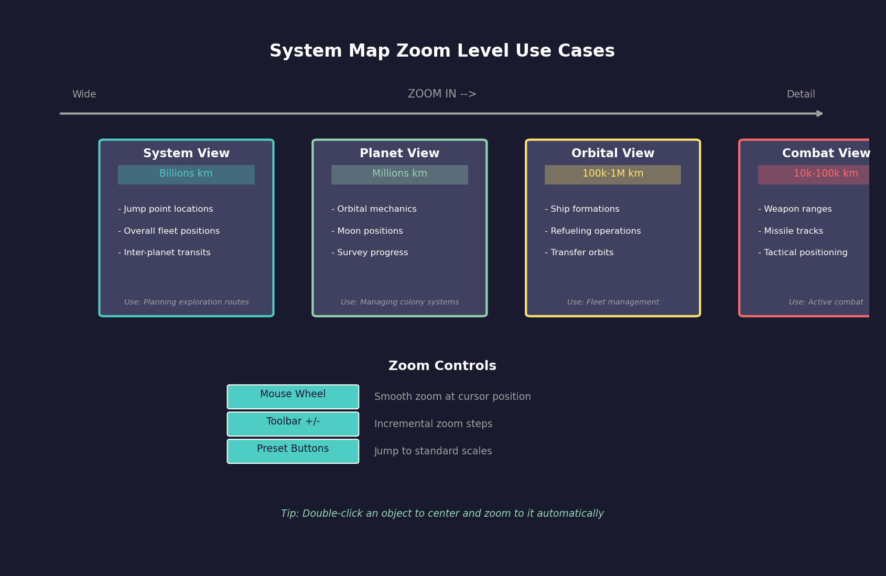
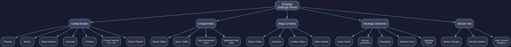
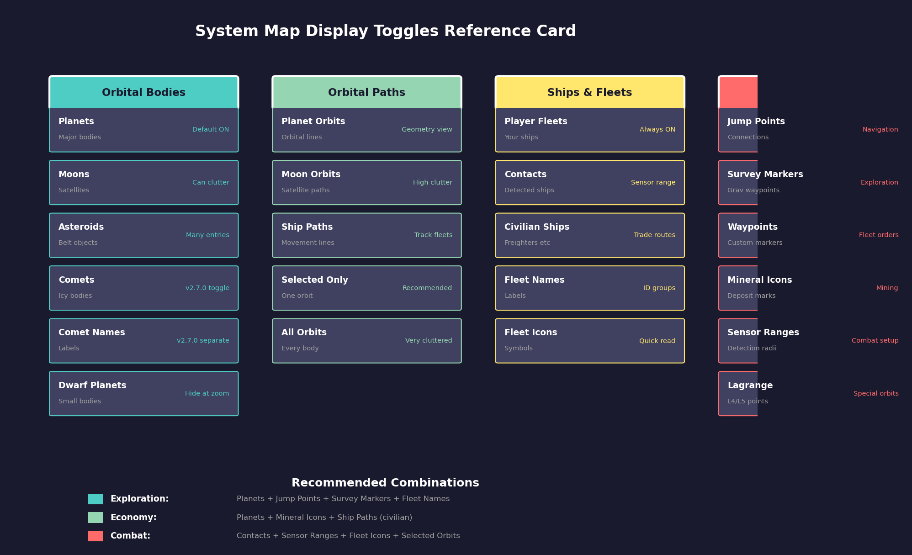
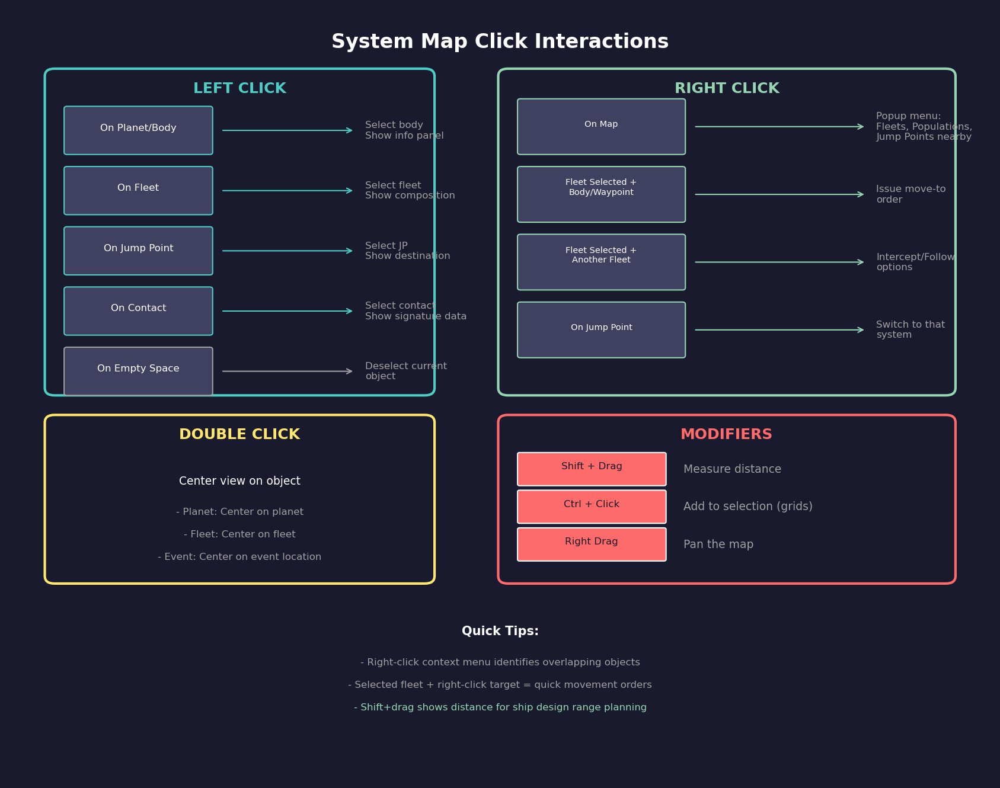

# 3.2 System Map

*Updated: v2026.01.30*

> **[Screenshot Pending — #839]** System Map window showing a developed system with multiple planets, fleet icons, zoom controls, and layer toggles.

---

## Contents

*Updated: v2026.01.30*

{: .no_toc }

- TOC
{:toc}

## 3.2.1 Navigation and Zoom

*Updated: v2026.01.30*

The system map is the primary visual representation of a star system. It displays stars, planets, moons, ships, fleets, jump points, and other objects in their orbital positions. Understanding map navigation is essential for effective gameplay.

**Zoom Controls:**

- **Mouse Wheel**: Scroll up to zoom in, scroll down to zoom out. The zoom centers on the cursor position.
- **Zoom Buttons**: Toolbar buttons for incremental zoom in/out
- **Preset Zoom Levels**: Quick buttons to jump to specific scale levels (inner system, full system, etc.)
- The map can zoom from showing the entire system (potentially billions of kilometers across) down to individual orbit details

**Panning:**

- **Right-click and Drag**: Hold the right mouse button and drag to pan the view across the system
- **Center on Object**: Double-clicking an object (or using center commands) reframes the view on that object
- **Center on Star**: A quick-center button returns the view to the system primary star

**Centering Options:**

- Center on the primary star (home position)
- Center on a selected fleet or ship
- Center on a planet or moon
- Center on a jump point
- The currently centered object may be highlighted or indicated in the display

**Scale Indicator**: The map displays a scale reference so you can judge distances. Distances in Aurora are measured in millions of kilometers (Mkm) or astronomical units (AU) depending on scale.

**System Selection**: A dropdown or selector allows you to switch which star system the map displays. Only systems you have explored (sent ships to) are available for viewing, unless SpaceMaster mode is active.

**Automatic Population Selection:** When you select a system on the galactic map and then open an Economics window tab, the most important population in that system is automatically selected. For galactic map features including distance calculations, see [Section 3.5 Galactic Map](3.5-galactic-map.md).

**Multi-Star Systems**: In binary or trinary systems, the map shows all stars and their associated orbital bodies. You can zoom and pan between the components of the system.

## 3.2.2 Display Layers

*Updated: v2026.01.30*

The system map can show or hide various categories of information. Managing display layers prevents visual clutter while ensuring you see what you need.

**Orbital Bodies:**

- **Stars**: Always displayed as the central reference point(s)
- **Planets**: Major planetary bodies shown at their orbital positions
- **Moons**: Can be toggled; showing moons adds detail but increases clutter around gas giants with many satellites
- **Asteroids**: Individual asteroids or asteroid belt indicators
- **Comets**: Distant icy bodies, usually hidden by default (see Comet Display Toggle below)
- **Dwarf Planets**: Smaller bodies that may not be shown at all zoom levels

**Comet Display Toggle:**

*Added: v2.7.0*

Comets and comet names can be toggled independently on the Tactical Map \hyperlink{ref-3.2-8}{[8]}. This allows players to:

- Hide comet icons entirely to reduce visual clutter
- Show comet positions but hide their labels
- Display both comets and their names

This is particularly useful in systems with many comets, where the labels can obscure other map elements.

**Orbital Paths:**

- **Planet Orbits**: Circular or elliptical lines showing planetary orbits. Helpful for understanding system geometry.
- **Moon Orbits**: Orbital paths of moons around their parent planets
- **Ship Movement Lines**: Lines showing the planned path of moving ships/fleets

**Ships and Fleets:**

- **Player Fleets**: Your own ships and fleet formations, typically shown as distinct icons
- **Contacts**: Detected objects belonging to other races (shown based on sensor data)
- **Civilian Ships**: Player-owned civilian shipping (freighters, colony ships operating autonomously)
- **Fleet Names/Labels**: Text labels identifying fleets, which can clutter the display in busy systems

**Strategic Elements:**

- **Jump points**: The connection points between star systems, shown as icons at their locations in the system
- **Survey Markers**: Indicators showing which bodies have been geologically surveyed
- **Waypoints**: Custom markers you have placed for navigation reference
- **Mineral Icons**: Indicators showing mineral availability on surveyed bodies

**Sensor Information:**

- **Sensor Ranges**: Circles showing the detection range of active sensors (see [Section 11.1 Thermal and EM Signatures](../11-sensors-and-detection/11.1-thermal-em-signatures.md)) (thermal, electromagnetic)
- **Missile Markers**: Missile salvos in flight (during combat)
- **Gravitational Survey Progress**: Areas that have been surveyed for jump points vs. unsurveyed regions

**Display Tips:**

- Reduce clutter by hiding moon orbits and asteroid details when viewing the full system
- Enable fleet names only when you need to identify specific groups
- Sensor range circles are invaluable during combat setup but distracting during peacetime
- Save your preferred display configuration once you find settings you like

## 3.2.3 Visual Indicators and Display Toggles

*Updated: v2026.01.30*

The system map communicates game state through several visual indicators. Understanding these markers allows players to quickly assess survey status, orbital geometry, and body characteristics without opening additional windows.

**Geological Survey Indicator:**

Bodies that have been geologically surveyed display a distinctive inner white circle within their standard body icon on the map. Unsurveyed bodies show only their standard circle. This provides an at-a-glance indication of which bodies still require geological survey teams.

**Orbit Display Options:**

Individual body orbits can be toggled via the Display settings panel:

- **Selected**: Shows only the currently selected body's orbit path
- **All Orbits**: Displays orbit paths for all bodies simultaneously (can become cluttered in complex systems)

> **Tip:** Use the "Selected" orbit display mode during normal gameplay. Enabling all orbits simultaneously makes the map difficult to read, especially in systems with many moons.

**Display Toggles:**

The Display settings panel provides checkboxes controlling visibility of map elements:

| Element | Description |
|---------|-------------|
| Asteroids | Individual asteroid bodies |
| Comets | Distant icy bodies (icon toggle) |
| Comet Names | Labels for comet bodies (separate toggle, v2.7.0) \hyperlink{ref-3.2-8}{[8]} |
| Jump points | System connection points |
| Survey Locations | Gravitational survey waypoints |
| Moon Names | Labels for planetary satellites |
| Lagrange Points | L4/L5 gravitational equilibrium points |

**Survey Locations:**

Survey locations are arranged in concentric rings around the system center, representing waypoints where ships conduct gravitational surveys to discover jump points \hyperlink{ref-3.2-1}{[1]}:

- **Inner ring**: Survey locations 1-6 (at approximately 2,000 Mkm from center) \hyperlink{ref-3.2-1}{[1]}
- **Middle ring**: Survey locations 7-18 (at approximately 4,000 Mkm from center) \hyperlink{ref-3.2-1}{[1]}
- **Outer ring**: Survey locations 19-30 (at approximately 6,000 Mkm from center) \hyperlink{ref-3.2-1}{[1]}

Ships assigned to gravitational survey orders will move between these locations systematically (see [Section 17.2 Gravitational Survey](../17-exploration/17.2-gravitational-survey.md)).

**Body Info Panel:**

Clicking on any body in the system map populates the Body Info panel with detailed information including:

- Body name and type (asteroid, terrestrial planet, gas giant, moon)
- Diameter and mass
- Orbital characteristics (semi-major axis, eccentricity, orbital period)
- Colony cost and habitability factors
- Mineral survey status

**System View Body List -- Mineral Indicators:**

The System View window displays a list of all bodies in the current system. Bodies containing minerals are marked with an **"M"** in the minerals column, providing a quick visual indicator of which bodies are worth mining.

**Filtering the body list:**

- Show only planets, only moons, or hide asteroids to reduce list length
- Filter to show only mineral-bearing bodies (those with the "M" indicator)
- Adding asteroids to the view significantly increases list length but reveals all mineral-bearing asteroids
- The Wide view displays additional columns including maximum supported population for each body

> **Tip:** Use the mineral-only filter in the System View to quickly identify mining candidates without scrolling through dozens of barren asteroids.

## 3.2.4 Sidebar Tabs

*Updated: v2026.01.30*

The system map window includes a sidebar with 9 tabs providing categorized access to system information without leaving the map view.

**Tab Overview:**

| Tab | Purpose |
|-----|---------|
| Display | Layer visibility toggles for orbits, names, contacts, and other map elements |
| Body Info | Detailed information for the currently selected body (minerals, atmosphere, colony data) |
| All Bodies | Sortable list of all system bodies with key attributes in columns |
| Military | Military contacts and fleet positions within the current system |
| Minerals | Mineral survey results for all geologically surveyed bodies |
| Sensors | Active sensor coverage display showing detection radii |
| Contacts | Detected contacts list with bearing, speed, and signature details |
| Waypoints | Custom navigation waypoints for fleet orders |
| History | Event log filtered to the currently displayed system |

**Usage Notes:**

- The Display tab controls persist between sessions and apply per-system
- Body Info updates automatically when clicking any body on the map
- The All Bodies list supports column sorting (click column headers) for quick identification of mining candidates or habitable worlds
- The Military and Contacts tabs update in real-time as sensors detect or lose track of objects
- Waypoints created here can be used as destinations in fleet movement orders (see [Section 9.5 Orders](../9-fleet-management/9.5-orders.md))

## 3.2.5 Selecting Objects

*Updated: v2026.01.30*

Interacting with objects on the system map is how you inspect planets, give fleet orders, and gather information about your empire and contacts.

**Clicking Objects:**

- **Left-Click**: Selects an object, displaying its information in the associated panel or status area
- **Left-Click on Fleets**: Selects the fleet, showing its composition, current orders, and speed
- **Left-Click on Planets**: Selects the body, showing summary information (name, type, colony status if applicable)
- **Left-click on jump points**: Shows the jump point details and destination (if explored)

**Right-Click Popup Menu:**
Right-clicking on the tactical map activates a popup menu that identifies game objects within a few pixels of the click location. The menu presents nearby fleets, populations, and jump points as selectable options:

- **Object Identification**: The popup scans a pixel radius around the click location, identifying all game objects (fleets, populations, jump points, contacts) within that area. Objects are listed in the popup ordered by proximity to the click point, with the closest object first.
- **Fleet Selection**: Choosing a fleet from the popup list opens the Naval Organization window with that fleet already selected, allowing immediate access to fleet management tools.
- **Population Selection**: Selecting a population loads the Economics window with the chosen population highlighted, providing quick access to economic management for that settlement.
- **Jump point navigation**: Selecting a jump point (displayed as the destination system name) causes the tactical map to transition to display that destination system, enabling rapid system-to-system navigation.

**Interaction with Selected Fleet:**

When a fleet is already selected in the Fleet Window, right-clicking a target object on the map provides order shortcuts:

- Right-clicking a body or waypoint issues a move-to order for the selected fleet
- Right-clicking another fleet offers intercept or follow order options
- These map-issued orders integrate with the fleet's existing order queue (see [Section 9.5 Orders](../9-fleet-management/9.5-orders.md))

**Fleet Selection Panel Interaction:**

The fleet selection panel (left sidebar or popup) works in conjunction with the right-click menu. Selecting a fleet in the panel highlights it on the map and vice versa -- clicking a fleet icon on the map updates the selection panel to show that fleet's details.

**Selection Panel:**
When an object is selected, detailed information appears (typically in a side panel or popup):

- **For Planets**: Name, type, gravity, temperature, atmosphere summary, colony cost, mineral survey status, population (if colonized)
- **For Fleets**: Fleet name, number of ships, current orders, speed, fuel status, assigned commander
- **For jump points**: Destination system name (if explored), transit status, any assigned patrol fleets
- **For Contacts**: Detected type (thermal/electromagnetic signature), estimated size, bearing, speed

**Fleet Orders from the Map:**
You can issue basic movement orders directly from the system map:
1. Select a fleet
2. Right-click (or use the appropriate control) on a destination (planet, jump point, coordinates)
3. The fleet will plot a course and begin moving on the next time advance

For complex orders (conditional movement, patrol routes, survey assignments), use the Fleet Window instead (see [Section 9.5 Orders](../9-fleet-management/9.5-orders.md)). The map provides quick point-to-point movement commands.

**Multiple Object Overlap:**
In crowded areas (near planets with moons, or systems with many fleets in one location), multiple objects may overlap visually. Clicking in these areas may:

- Select the topmost/nearest object
- Provide a selection list letting you choose which overlapping object you intend
- Zoom in to separate overlapping elements

**Keyboard Interaction:**

- Arrow keys may pan the map
- Certain hotkeys select the next/previous fleet
- Keyboard shortcuts can toggle display layers without using the toolbar

**Practical Map Usage:**

- Keep the map centered on areas of current activity (your home system, a system under survey, a combat zone)
- Use the map to visually verify fleet positions match your expectations before advancing time
- Regularly check the map for unidentified contacts -- these could be NPR ships entering your space
- The map's visual representation helps catch errors (ships heading the wrong direction, fleets stuck in orbit) that text-only displays might miss

## 3.2.6 Distance Measuring

*Updated: v2026.01.30*

The tactical map includes a distance measuring tool that allows players to calculate distances between arbitrary points during gameplay \hyperlink{ref-3.2-2}{[2]}. The distance unit displayed matches the scale used in ship design range calculations *(unverified — [#710](https://github.com/ErikEvenson/aurora-manual/issues/710) -- exact display unit not confirmed in available sources; may be billions of kilometers or another unit)*.

**How to Use:**

- Hold down **Shift** and click-and-hold, then drag the mouse on the tactical map
- The system displays a line connecting the two points along with the calculated distance
- While the Shift key remains pressed, the start of the line remains static while the end of the line can be dragged around to measure different distances from the same reference point

**System Scale Reference:**

- In the game database, Neptune orbits at 30 AU (~4.5 billion km) from Sol's center, while dwarf planets like Eris reach ~68 AU (~10.2 billion km). Including trans-Neptunian objects, the system spans roughly 20 billion km across \hyperlink{ref-3.2-3}{[3]}
- Comets can extend far beyond the planetary region. In the database, Comet C/2017 K2 orbits at 24,500 AU (~3,665 billion km), well exceeding 100 billion km \hyperlink{ref-3.2-3}{[3]}
- Survey ships accumulate distance as they travel between multiple survey targets, making total route distance far greater than single-leg measurements

**Fuel Range Planning:**

The distance measurement tool is critical for ship design. Use it to determine the longest route ships will need to fly, then compare against the ship's range displayed in the Ship Designer.

- Measure from the system center to the outermost destination, then double the value for a round trip
- Example: If the outermost body is 12 billion km from the center, a freighter needs at least 24 billion km range for a round trip
- Survey ships that bounce between multiple targets need substantially more range than a single round trip
- Comets at extreme distances (100+ billion km) are generally impractical targets for early-game freighters

> **Tip:** When designing freighters or survey ships, always measure the longest planned route in your system first, then verify the ship design's range exceeds that distance with a comfortable margin.

**Additional Applications:**

- Determine engagement ranges for fleet positioning
- Evaluate sensor coverage gaps between picket stations
- Verify weapon engagement envelopes during combat setup
- Plan jump point patrol routes with adequate fuel reserves

## 3.2.7 Cycle Previous Locations

*Updated: v2026.01.30*

Aurora maintains a location history tracking system for the system map, recording positions whenever the map is centered. This occurs through player actions such as clicking objects, using Centre On features for fleets, conducting mineral searches, or double-clicking map-related events.

**Navigation Controls:**

- **Alt+F11**: Move backward through location history
- **Alt+F12**: Move forward through location history

**Behavior Details:**

- When cycling through the history, the location you move to becomes the "current location"
- If you center the map through normal gameplay (outside of cycling), everything in the list after the current location is discarded and the new location is added after the current position
- The cycling functionality works across all systems, allowing navigation between multiple areas of space seamlessly

This feature eliminates the need to manually search for previously-viewed locations, providing quick navigation back to areas of interest.

## 3.2.8 Tactical Map Events Display

*Updated: v2026.01.30*

The tactical map can display event information directly on the map, controlled by an Events checkbox toggle. Events use the same colour coding and interaction as the Events Window. For details on tactical map event display, colour configuration, and SpaceMaster multi-race event viewing, see [Section 3.4.2 Event Display and Colours](3.4-event-log.md).

## 3.2.9 Ship Status Indicators

*Updated: v2026.01.30*

The ship list in various windows displays status indicators in a dedicated column to communicate ship readiness at a glance.

**Jump Shock Indicator:**

*Added: v2.8.0*

Ships experiencing jump shock display a **"J"** in the status column \hyperlink{ref-3.2-9}{[9]}. Jump shock occurs immediately after transiting a jump point and temporarily disrupts fire control accuracy and sensor effectiveness (see [Section 4.4 Jump Points](../4-systems-and-bodies/4.4-jump-points.md)). The indicator helps track fleet readiness after transit operations, showing which ships have recovered and which remain affected.

## 3.2.10 Wide System View

*Updated: v2026.01.30*

The System View window has a "Wide" variant designed for larger monitors:

- **Normal view width**: 1440 pixels *(unverified — [#710](https://github.com/ErikEvenson/aurora-manual/issues/710))*
- **Wide view width**: 1900 pixels *(unverified — [#710](https://github.com/ErikEvenson/aurora-manual/issues/710))*
- The wide variant displays an extension of the system body list showing an extra six columns beyond what appears in the standard view
- Includes several new fields connected to eccentric orbits, enabling comprehensive monitoring of bodies with non-circular orbital paths
- The wide system view functions similarly to the wide view available for the Class Design window

## UI References and Screenshots

*Updated: v2026.01.29*

- [System Map Window Layout](../images/system-map-window.md) -- annotated tactical map interface with layer controls and navigation

## Related Sections

- [Section 9.5 Orders](../9-fleet-management/9.5-orders.md) -- Fleet orders and movement commands
- [Section 10.1 Movement Mechanics](../10-navigation/10.1-movement-mechanics.md) -- System travel and jump point navigation
- [Section 11.1 Thermal and EM Signatures](../11-sensors-and-detection/11.1-thermal-em-signatures.md) -- Sensor ranges and contact detection
- [Section 12.1 Fire Controls](../12-combat/12.1-fire-controls.md) -- Tactical combat on the system map
- [Section 17.1 Geological Survey](../17-exploration/17.1-geological-survey.md) -- Survey progress and exploration display

## References

\hypertarget{ref-3.2-1}{[1]} Aurora C# game database (AuroraDB.db v2.7.1), `FCT_SurveyLocation` -- Survey locations for Sol (SystemID 21591): locations 1-6 at 2,000 Mkm, 7-18 at 4,000 Mkm, 19-30 at 6,000 Mkm from system center

\hypertarget{ref-3.2-2}{[2]} Aurora Forums, "how do i create a measurement line" (aurora2.pentarch.org/index.php?topic=10075.0) -- Shift+drag distance measuring confirmed

\hypertarget{ref-3.2-3}{[3]} Aurora C# game database (AuroraDB.db v2.7.1), `FCT_SystemBody` -- Sol system orbital distances: Neptune at 30.069 AU, Eris at 67.894 AU, Comet C/2017 K2 at 24,500 AU

\hypertarget{ref-3.2-4}{[4]} AuroraWiki, "System Map" (aurorawiki2.pentarch.org/index.php?title=System_Map) -- Navigation controls, sidebar tabs, display toggles

\hypertarget{ref-3.2-5}{[5]} Aurora Fandom Wiki, "Basics of the System Map" (aurora4x.fandom.com/wiki/Basics_of_the_System_Map) -- Body Info, Minerals, Sensors, Contacts tabs

\hypertarget{ref-3.2-6}{[6]} Aurora Forums, "1.12.0 Changes List" (aurora2.pentarch.org/index.php?topic=11593.0) -- Alt+F11/Alt+F12 location history cycling

\hypertarget{ref-3.2-7}{[7]} AuroraWiki, "Survey" (aurorawiki2.pentarch.org/index.php?title=Survey) -- Geological survey indicator (white circle)

\hypertarget{ref-3.2-8}{[8]} Aurora Forums, "v2.7.0 Changes List" (aurora2.pentarch.org/index.php?topic=13814.0) -- Comets and comet names can be toggled off on Tactical Map

\hypertarget{ref-3.2-9}{[9]} Aurora Forums, "v2.8.0 Changes List" -- Jump shock indicated by "J" in ship list status column
