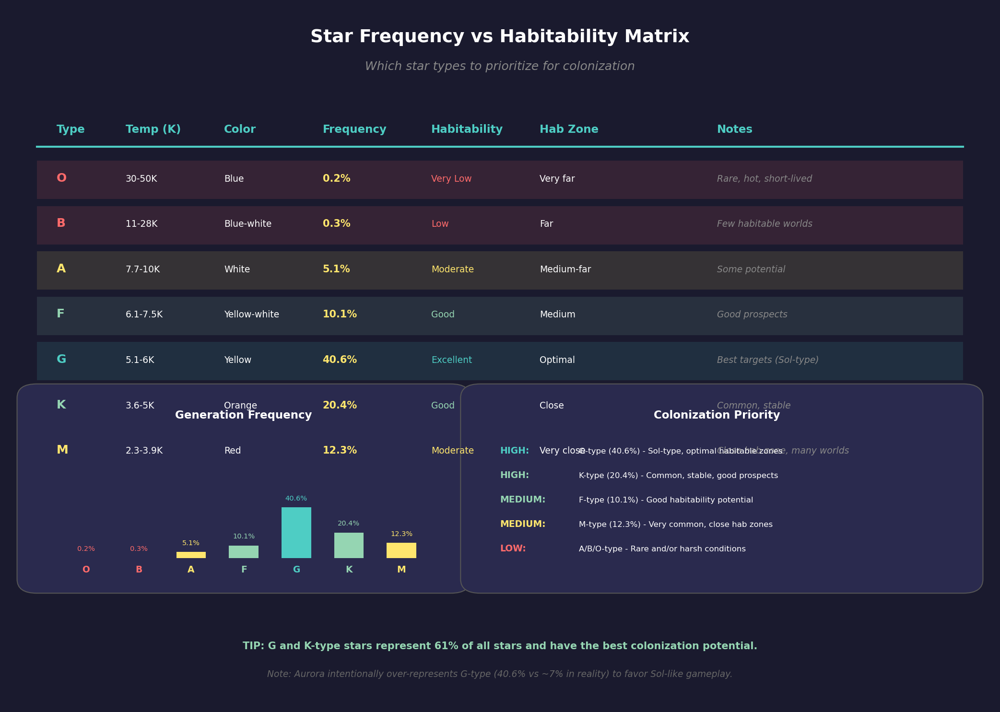
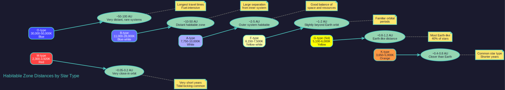
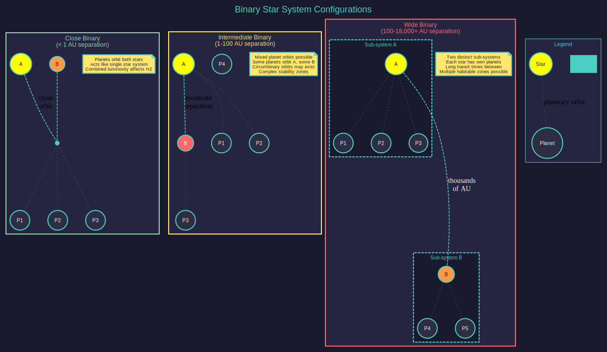

# 4.1 Star Systems

*Updated: v2026.01.30*

## 4.1.1 Star Classification

*Updated: v2026.01.30*

Aurora C# generates star systems using realistic stellar classification based on the Hertzsprung-Russell diagram. Each star is assigned a spectral type and luminosity class that determines its characteristics and profoundly influences the system it hosts.

### 4.1.1.1 Spectral Types

Stars are classified by spectral type using the standard OBAFGKM sequence, from hottest to coolest \hyperlink{ref-4.1-1}{[1]}:

| Spectral Type | Temperature (K) | Color | Frequency in Aurora |
|---|---|---|---|
| O | 30,000-50,000 | Blue | 0.2% \hyperlink{ref-4.1-1}{[1]} |
| B | 11,000-28,000 | Blue-white | 0.3% \hyperlink{ref-4.1-1}{[1]} |
| A | 7,750-10,000 | White | 5.1% \hyperlink{ref-4.1-1}{[1]} |
| F | 6,150-7,500 | Yellow-white | 10.1% \hyperlink{ref-4.1-1}{[1]} |
| G | 5,100-6,000 | Yellow | 40.6% (Sol-type, most common) \hyperlink{ref-4.1-1}{[1]} |
| K | 3,650-5,000 | Orange | 20.4% \hyperlink{ref-4.1-1}{[1]} |
| M | 2,300-3,920 | Red | 12.3% \hyperlink{ref-4.1-1}{[1]} |

Each spectral type is further subdivided with a numeral from 0-9 (e.g., G2, which is our Sun's classification). Lower numbers indicate hotter stars within the class \hyperlink{ref-4.1-2}{[2]}.

### 4.1.1.2 Luminosity Classes

Luminosity class indicates the star's size and evolutionary state:

- **Ia, Ib** - Supergiants (extremely luminous, rare)
- **II** - Bright giants
- **III** - Giants (evolved stars)
- **IV** - Subgiants (transitioning off main sequence)
- **V** - Main sequence (dwarf stars, most common)
- **VI** - Subdwarfs

### 4.1.1.3 Effects on the System

A star's type directly influences several important gameplay factors:

**Habitable Zone Distance:** Hotter, more luminous stars push the habitable zone further out, while dim M-class stars have very close habitable zones. This affects orbital periods and travel times within the system.

**Number of Planets:** Larger, more luminous stars tend to generate more orbital bodies during system creation, giving players more potential colony sites and resource deposits to exploit.

**System Illumination:** The star's luminosity affects sensor performance within the system (see [Section 11.1 Thermal and EM Signatures](../11-sensors-and-detection/11.1-thermal-em-signatures.md)). Brighter stars can make thermal detection more difficult due to background radiation.

**Stellar Energy:** Stars with higher luminosity provide more energy for potential future technologies and affect the temperature calculations of orbiting bodies.

### 4.1.1.4 Special Star Types

Aurora also generates several special stellar objects:

- **White Dwarfs (D type)** - Collapsed remnants of low-mass stars, with ten subtypes (D0-D9) ranging from 0.35 to 1.3 solar masses and temperatures from 4,000 to 30,000K \hyperlink{ref-4.1-3}{[3]}. Systems around white dwarfs tend to have fewer planets and may contain unusual mineral distributions.
- **Brown Dwarfs (L, T, Y types)** - Sub-stellar objects too small to sustain hydrogen fusion, spanning L0-L9, T0-T9, and Y0-Y2 subtypes with temperatures from 400 to 2,200K \hyperlink{ref-4.1-4}{[4]}. These generate very dim systems with close-in, cold planets.
- **Neutron Stars/Pulsars** - Extremely dense remnants of massive stars. Rare but can be generated. Systems tend to be sparse.
- **Black Holes** - Stellar-mass black holes ranging from 1 to 120 solar masses across fifteen types \hyperlink{ref-4.1-5}{[5]}. Key characteristics:
  - Always planetless and do not affect ship movement \hyperlink{ref-4.1-20}{[20]}
  - **Random Stars games:** 1.5% chance of generation \hyperlink{ref-4.1-20}{[20]}; may have companion stars \hyperlink{ref-4.1-20}{[20]}
  - **Known Stars games:** Eighty random black holes are added to the Known Stars list \hyperlink{ref-4.1-20}{[20]} using random XYZ coordinates within plus or minus one hundred light years from Sol, representing undetected objects; these lack companion stars \hyperlink{ref-4.1-20}{[20]}
  - Black holes with a mass of 20 or more gain a fixed number of additional jump points \hyperlink{ref-4.1-6}{[6]} beyond the increased chance already associated with massive stars, making them strategically important navigation hubs despite being difficult to survey

> **Tip:** When exploring, don't ignore M-class and K-class star systems. While they tend to have closer-in habitable zones, they are by far the most numerous star type and often contain rich mineral deposits.

## 4.1.2 Binary and Trinary Systems

*Updated: v2026.01.30*

Aurora C# models multi-star systems with realistic orbital mechanics. In **Random Stars games**, approximately 30-40% of generated systems contain more than one star. In contrast, the **Known Stars database** reflects real astronomical data where only about 0.9% of catalogued systems are binary \hyperlink{ref-4.1-21}{[21]}.

### 4.1.2.1 Binary Star Configurations

In a binary system, two stars orbit their common center of mass (barycenter). Aurora models three configurations:

**Close Binaries:** The two stars orbit very close together, effectively acting as a single light source for the purposes of planetary orbits. Planets orbit both stars at a distance. These systems function similarly to single-star systems for gameplay purposes, though the combined luminosity of both stars affects the habitable zone.

**Wide Binaries:** The companion star orbits at a significant distance from the primary. Each star can have its own set of planets in stable orbits. In gameplay terms, this creates two distinct "sub-systems" within a single star system, connected by the system map. Travel between the two stellar groups requires crossing significant distances.

**Intermediate Binaries:** The companion orbits at a moderate distance. Planets may orbit the primary, the secondary, or both (circumbinary orbits), depending on stability calculations.

### 4.1.2.2 Trinary Systems

Trinary (triple) star systems are less common but do occur. Typically, they consist of a close binary pair with a distant tertiary companion, or a primary star with two distant companions. The same orbital principles apply, with planets potentially orbiting individual stars or the system barycenter.

### 4.1.2.3 Gameplay Implications

**Navigation:** Ships traveling within multi-star systems must account for the greater distances between stellar components. Companion stars orbit at distances ranging from 0.03 AU (close binaries) to over 18,000 AU (wide binaries) \hyperlink{ref-4.1-21}{[21]}.

**Jump points:** Each star in a multi-star system can have its own set of jump points, meaning binary and trinary systems may have more connections to other systems.

**Surveying:** Multi-star systems take longer to fully survey due to the additional bodies and greater distances involved (see [Section 17.1 Geological Survey](../17-exploration/17.1-geological-survey.md)). Plan your gravitational survey missions accordingly.

**Strategic Value:** Wide binary systems with habitable worlds around different stars can be particularly valuable, as they provide multiple colonization targets within a single system entry point.

> **Tip:** When you discover a binary or trinary system, check both stellar components for habitable worlds and mineral-rich bodies. Players often focus on the primary star and overlook excellent colony sites orbiting the companion.

## 4.1.3 System Display

*Updated: v2026.01.30*

The primary interface for viewing star systems is the System Map window, which displays the system in a top-down orbital view showing stars, orbital paths, planets, jump points, ships, and colony markers \hyperlink{ref-4.1-18}{[18]}. For detailed documentation of system map navigation, display layers, filters, sidebar tabs, and object interaction, see [Section 3.2 System Map](../3-user-interface/3.2-system-map.md).

> **Note:** Star properties (spectral type, luminosity class, mass, temperature) can be viewed by selecting the star in the System Map and checking the sidebar panel, or via the System View window's star details tab.

For the broader strategic view of explored space showing all known star systems and jump point connections, see [Section 3.5 Galactic Map](../3-user-interface/3.5-galactic-map.md).

## 4.1.4 System Naming

*Updated: v2026.01.30*

Aurora C# uses a hierarchical system for naming newly discovered star systems \hyperlink{ref-4.1-22}{[22]}. When a system is first discovered, names are assigned using this priority sequence \hyperlink{ref-4.1-22}{[22]}:

1. **Actual System Name** - For known real stars in Known Stars games.
2. **Naming Theme from Origin System** - If the exploring ship's home system has an assigned naming theme, that theme is used. Any future exploration beyond that point will continue using the selected naming theme.
3. **Racial System Theme** - The default race-level naming convention.
4. **Generic Designation** - "System #" followed by a number.

### 4.1.4.1 Naming Themes

Players can optionally assign one of the available naming themes to any system \hyperlink{ref-4.1-19}{[19]}. This choice persists, so all future exploration beyond that point will use the selected naming theme \hyperlink{ref-4.1-22}{[22]}. This enables different jump point chains to have distinct naming conventions, helping players organize their galactic nomenclature by region or faction preference.

Players retain the ability to manually rename systems at any time and can select names from any available naming theme or use custom text.

### 4.1.4.2 Star Component Suffixes (v2.0.0+)

As of v2.0.0, single-star systems no longer receive the "-A" suffix that was previously appended to star component names \hyperlink{ref-4.1-20}{[20]}. Binary and trinary systems still use component suffixes ("-A", "-B", "-C") to distinguish their individual stars. This reduces name clutter for the majority of star systems encountered during gameplay.

### 4.1.4.3 Constellation Names (Known Stars)

An optional constellation naming system is available for Known Stars games, based on historical astronomical designations. This feature uses two centuries-old star cataloguing systems:

- **Bayer Designation (1603):** German astronomer Johann Bayer's system uses Greek letters followed by constellation names in genitive form (e.g., Alpha Centauri, Tau Ceti), ordered roughly by brightness.
- **Flamsteed Designation (1700s):** English Astronomer Royal John Flamsteed's numbering system uses numerals followed by constellation names, ordered by celestial position.

The implementation identifies unused Greek letters and numbers from both historical systems across all 88 modern constellations, then assigns them to Known Stars ordered by distance from Earth based on each star's celestial constellation. For example:

- DEN 1048-3956 becomes Beta Antliae \hyperlink{ref-4.1-7}{[7]}
- WISE 0855-0714 becomes 61 Hydrae \hyperlink{ref-4.1-7}{[7]}
- GJ 1061 becomes Epsilon Horologii \hyperlink{ref-4.1-7}{[7]}

This feature is optional through game settings, allowing players to retain catalogue designations if preferred.

## 4.1.5 Known Stars Database

*Updated: v2026.01.30*

In Known Stars games, Aurora C# uses a substantial database of real stellar data. As of v2.4.0, this database contains over 63,000 stars \hyperlink{ref-4.1-8}{[8]} representing every star within 775 light-years of Sol, plus a few hundred further out \hyperlink{ref-4.1-9}{[9]}.

### 4.1.5.1 Data Sources

The Known Stars database is compiled from multiple astronomical catalogues:

- **Hipparcos Catalogue (HIP):** Created by the European Space Agency, providing spectral class and naming data.
- **Gliese Catalogue:** Used for binary star designations (A and B components), containing about 3,800 stars.
- **Simbad Database:** Maintained by the Strasbourg Astronomical Data Center, employed for data validation and calculating distances from parallax measurements.

### 4.1.5.2 Coordinate Calculation

Three-dimensional coordinates relative to Sol are calculated using Right Ascension, Declination (ICRS coordinates), and parallax data. Accuracy decreases with distance but remains suitable for gameplay purposes.

### 4.1.5.3 Star Type Distribution

The expanded database reveals a high proportion of red dwarfs, particularly within 100 light-years, due to detection limitations affecting distant observations. This creates a much larger sandbox for Known Stars games without changing the theoretical game size, since Aurora only generates systems that players discover.

### 4.1.5.4 Sol System Details

The Sol System in Known Stars games includes numerous real celestial bodies with historically accurate properties:

- **Dwarf Planets:** Includes Salacia \hyperlink{ref-4.1-10}{[10]} and Gonggong (formerly 2007 OR10) \hyperlink{ref-4.1-11}{[11]}, upgraded to dwarf planet status due to their size.
- **Trans-Neptunian Objects:** Includes 2015 RR245 (~700 km), 2015 KH162 (~700 km) \hyperlink{ref-4.1-12}{[12]}, and Ultima Thule (~30 km) \hyperlink{ref-4.1-13}{[13]}.
- **Comets:** Includes C/2017 K2 (non-periodic) \hyperlink{ref-4.1-14}{[14]}. *(Note: Oumuamua was not found in the game database.)*
- **Centaurs:** Includes 2017 UV43 \hyperlink{ref-4.1-15}{[15]}.
- **Extreme Objects:** Includes 2017 MB7, an asteroid/comet with the furthest known orbit \hyperlink{ref-4.1-16}{[16]}.

### 4.1.5.5 Planet X (Optional)

Known Stars games include an optional feature to add a hypothetical distant planet to the Sol system \hyperlink{ref-4.1-23}{[23]}, inspired by real scientific theories about undiscovered bodies affecting Kuiper Belt object orbits.

**Generation Rules:**

- The planet spawns at a distance of 125% to 225% of the orbit of the most distant dwarf planet in the system \hyperlink{ref-4.1-23}{[23]}.
- Planet type distribution: 10% terrestrial, 60% gas giant, 30% superjovian \hyperlink{ref-4.1-23}{[23]}.
- May generate associated moons, Trojan asteroids, and Lagrange points (Jupiter also receives a Lagrange point if Planet X has one) \hyperlink{ref-4.1-23}{[23]}.
- The planet is designated "Minerva." \hyperlink{ref-4.1-17}{[17]}

## 4.1.6 Supernovae

*Updated: v2026.01.30*

Supernovae are an optional SpaceMaster-triggered catastrophic event available in Known Stars games (v2.2.0+) \hyperlink{ref-4.1-24}{[24]}. These events create expanding radiation waves that propagate through real space at light speed.

### 4.1.6.1 Triggering

The SpaceMaster can trigger a supernova at any star system, regardless of scientific accuracy \hyperlink{ref-4.1-24}{[24]}. This feature is restricted to Known Stars games because it requires mapped 3D locations in real space \hyperlink{ref-4.1-24}{[24]}. When triggered, all jump points, system bodies, and military forces in the affected system are destroyed \hyperlink{ref-4.1-24}{[24]}.

### 4.1.6.2 Radiation Wave Propagation

The supernova creates an expanding spherical radiation front that weakens as surface area increases \hyperlink{ref-4.1-24}{[24]}. When the wave reaches a new star system, it irradiates every body in that system and may damage ships and missiles \hyperlink{ref-4.1-24}{[24]}.

### 4.1.6.3 Damage Mechanics

- **Atmospheric bodies:** Radiation impact is divided by (100 x atmospheric pressure in atm), providing significant protection for planets with dense atmospheres \hyperlink{ref-4.1-24}{[24]}.
- **Ships:** Suffer strength-1 hits equal to Radiation / 100,000 \hyperlink{ref-4.1-24}{[24]}.
- **Missiles:** If radiation reaches 100,000 or more, all missiles in the affected system are destroyed \hyperlink{ref-4.1-24}{[24]}.

### 4.1.6.4 Galactic Map Display

New Galactic Map options for supernovae include:

- Real space distance in light-years between systems \hyperlink{ref-4.1-24}{[24]}
- Time to supernova impact for the nearest radiation wave \hyperlink{ref-4.1-24}{[24]}
- Projected radiation levels upon impact \hyperlink{ref-4.1-24}{[24]}

### 4.1.6.5 Customization

The SpaceMaster can adjust supernova power with linear effects: doubling the power doubles radiation damage at all distances \hyperlink{ref-4.1-24}{[24]}. This allows for calibrating the threat level of individual events.

## Related Sections

- [Section 2.1 New Game Options](../2-game-setup/2.1-new-game-options.md) -- Known Stars vs. Random Stars game mode selection
- [Section 2.3 System Generation](../2-game-setup/2.3-system-generation.md) -- System generation settings and configuration
- [Section 10.1 Movement Mechanics](../10-navigation/10.1-movement-mechanics.md) -- Interstellar travel and route planning
- [Section 11.1 Thermal and EM Signatures](../11-sensors-and-detection/11.1-thermal-em-signatures.md) -- Stellar effects on sensor performance
- [Section 17.1 Geological Survey](../17-exploration/17.1-geological-survey.md) -- Gravitational surveys and system discovery
- [Appendix A: Formulas](../appendices/A-formulas.md) -- Habitable zone and temperature calculations
- [Appendix B: Glossary](../appendices/B-glossary.md) -- Stellar classification terminology

## References

\hypertarget{ref-4.1-1}{[1]}. Aurora C# game database (AuroraDB.db v2.7.1) -- `DIM_StellarType` table. Temperature ranges from main sequence (SizeID=5) entries. Generation frequencies calculated from cumulative MaxChance probability bands across ALL luminosity classes (not just main sequence): the database defines probability bands summing to 10,000 for standard stars. Each spectral class spans: O=20 slots (0.2%), B=30 (0.3%), A=510 (5.1%), F=1,010 (10.1%), G=4,060 (40.6%), K=2,040 (20.4%), M=1,230 (12.3%). Remaining slots: white dwarfs D=500 (5.0%), brown dwarfs L=360 (3.6%), T=240 (2.4%). G-type dominance (~40.6%) is a deliberate Aurora design choice; in real-world astrophysics, M-type red dwarfs dominate.

\hypertarget{ref-4.1-2}{[2]}. Aurora C# game database (AuroraDB.db v2.7.1) -- `DIM_StellarType` table. Confirmed: within each spectral class, lower spectral numbers correspond to higher temperatures (e.g., G0V = 6,000K, G9V = 5,100K).

\hypertarget{ref-4.1-3}{[3]}. Aurora C# game database (AuroraDB.db v2.7.1) -- `DIM_StellarType` table. White dwarfs (SpectralClass='D', SizeID=7) span D0-D9 with Mass 0.35-1.3 solar, Temperature 4,000-30,000K, 10 subtypes total.

\hypertarget{ref-4.1-4}{[4]}. Aurora C# game database (AuroraDB.db v2.7.1) -- `DIM_StellarType` table. Brown dwarfs include L0-L9 (1,300-2,200K), T0-T9 (600-1,200K), and Y0-Y2 (400-500K), all SizeID=8. **Correction:** Y-type brown dwarfs exist in the database but were not mentioned in the original text; added for completeness.

\hypertarget{ref-4.1-5}{[5]}. Aurora C# game database (AuroraDB.db v2.7.1) -- `DIM_StellarType` table. 15 black hole entries (SpectralClass='BH') with masses: 1, 2, 3, 5, 10, 15, 20, 25, 30, 40, 50, 60, 80, 100, 120 solar masses.

\hypertarget{ref-4.1-6}{[6]}. Aurora C# game database (AuroraDB.db v2.7.1) -- `DIM_StellarType`.ExtraJP column. Black holes with Mass >= 20 have ExtraJP values: 20M=1, 25M=1, 30M=2, 40M=2, 50M=3, 60M=4, 80M=5, 100M=6, 120M=8. Black holes with Mass < 20 have ExtraJP=0.

\hypertarget{ref-4.1-7}{[7]}. Aurora C# game database (AuroraDB.db v2.7.1) -- `DIM_KnownSystems`.ConstellationName column. Verified: DEN 1048-3956 = Beta Antliae, WISE 0855-0714 = 61 Hydrae, GJ 1061 = Epsilon Horologii.

\hypertarget{ref-4.1-8}{[8]}. Aurora C# game database (AuroraDB.db v2.7.1) -- `DIM_KnownSystems` table. COUNT(*) = 63,593 entries, confirming "over 63,000 stars."

\hypertarget{ref-4.1-9}{[9]}. Aurora C# game database (AuroraDB.db v2.7.1) -- `DIM_KnownSystems`.Distance column. 63,479 stars within 775 light-years; 114 stars beyond 775 LY (max distance 16,300 LY). Confirms "every star within 775 light-years of Sol, plus a few hundred further out."

\hypertarget{ref-4.1-10}{[10]}. Aurora C# game database (AuroraDB.db v2.7.1) -- `FCT_SystemBody`. Salacia confirmed: BodyClass=1 (terrestrial), Radius=425 km.

\hypertarget{ref-4.1-11}{[11]}. Aurora C# game database (AuroraDB.db v2.7.1) -- `FCT_SystemBody`. Body is named "Gonggong" in the database (not "2007 OR10"). BodyClass=1, Radius=738 km. **Correction:** Updated name from "2007 OR10" to "Gonggong" to match database.

\hypertarget{ref-4.1-12}{[12]}. Aurora C# game database (AuroraDB.db v2.7.1) -- `FCT_SystemBody`. 2015 RR245: Radius=350 km (~700 km diameter). 2015 KH162: Radius=350 km (~700 km diameter). Confirmed.

\hypertarget{ref-4.1-13}{[13]}. Aurora C# game database (AuroraDB.db v2.7.1) -- `FCT_SystemBody`. Ultima Thule: Radius=16 km (~32 km diameter). Manual states "~30 km" which is approximate but close.

\hypertarget{ref-4.1-14}{[14]}. Aurora C# game database (AuroraDB.db v2.7.1) -- `FCT_SystemBody`. C/2017 K2 confirmed: BodyClass=5, Radius=30 km, Eccentricity=0.998. Oumuamua was not found in the database.

\hypertarget{ref-4.1-15}{[15]}. Aurora C# game database (AuroraDB.db v2.7.1) -- `FCT_SystemBody`. 2017 UV43 confirmed: BodyClass=3, Radius=8 km.

\hypertarget{ref-4.1-16}{[16]}. Aurora C# game database (AuroraDB.db v2.7.1) -- `FCT_SystemBody`. 2017 MB7 confirmed: BodyClass=5, Radius=6 km, Eccentricity=0.9974, OrbitalDistance=1,712 AU.

\hypertarget{ref-4.1-17}{[17]}. Aurora C# game database (AuroraDB.db v2.7.1) -- `FCT_SystemBody`. "Minerva" confirmed present in database: BodyClass=3, Radius=71 km.

\hypertarget{ref-4.1-18}{[18]}. AuroraWiki, "System Map" (aurorawiki2.pentarch.org/index.php?title=System_Map) -- System Map displays stars, orbital paths, planets, jump points, ships, and colony markers in a top-down orbital view.

\hypertarget{ref-4.1-19}{[19]}. Aurora C# game database (AuroraDB.db v2.7.1) -- `DIM_CommanderNameTheme` table confirms naming themes exist (e.g., United States, English, Roman, Chinese, Japanese, German, Ancient Egyptian, Norse, etc.); `FCT_RaceNameThemes` links themes to races.

\hypertarget{ref-4.1-20}{[20]}. Aurora Forums -- v2.0.0 changelog (http://aurora2.pentarch.org/index.php?topic=11343.0). Black holes: always planetless, no movement effects, 1.5% generation chance in Random Stars, may have companion stars in Random Stars. Known Stars adds 80 black holes at random XYZ coordinates within +/-100 LY from Sol; these lack companions. Star suffix: single-star systems no longer receive "-A" suffix.

\hypertarget{ref-4.1-21}{[21]}. Aurora C# game database (AuroraDB.db v2.7.1) -- `DIM_KnownSystems` table. Binary systems: 593 entries with non-null Component field out of 63,593 total (0.93%). Companion orbital distances (Component='B' entries): minimum 0.03 AU, maximum 18,350 AU.

\hypertarget{ref-4.1-22}{[22]}. Aurora Forums -- v1.0 changelog (http://aurora2.pentarch.org/index.php?topic=8495.0). System naming: confirmed priority sequence (actual name, origin system theme, racial theme, generic). Theme persistence: exploration beyond a themed system continues using that theme.

\hypertarget{ref-4.1-23}{[23]}. Aurora Forums -- Planet X changelog entry (v1.13.0, http://aurora2.pentarch.org/index.php?topic=10743.0). Planet X: spawns at 125-225% of most distant dwarf planet orbit; 10% terrestrial, 60% gas giant, 30% superjovian; generates moons, Trojans, and Lagrange points; Jupiter receives Lagrange point if Planet X has one.

\hypertarget{ref-4.1-24}{[24]}. Aurora Forums -- v2.2.0 changelog (http://aurora2.pentarch.org/index.php?topic=13055.0). Supernovae: SpaceMaster-triggered, Known Stars only; destroys all JP/bodies/forces; radiation wave propagates at light speed, weakens with distance; atmospheric protection = radiation / (100 x atm); ships take strength-1 hits = radiation / 100,000; missiles destroyed if radiation >= 100,000; Galactic Map shows real-space distance, time to impact, projected radiation; power adjustment has linear effect on damage.
