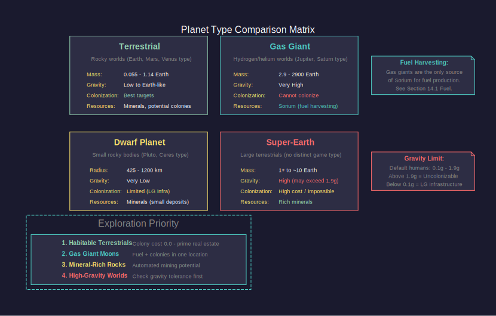
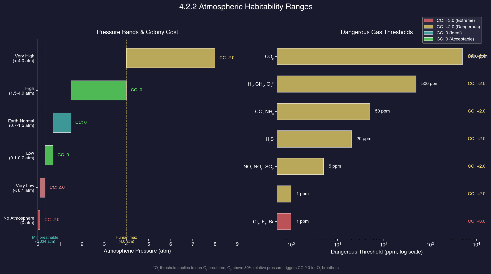
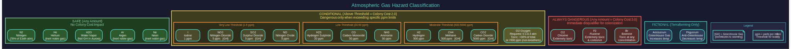
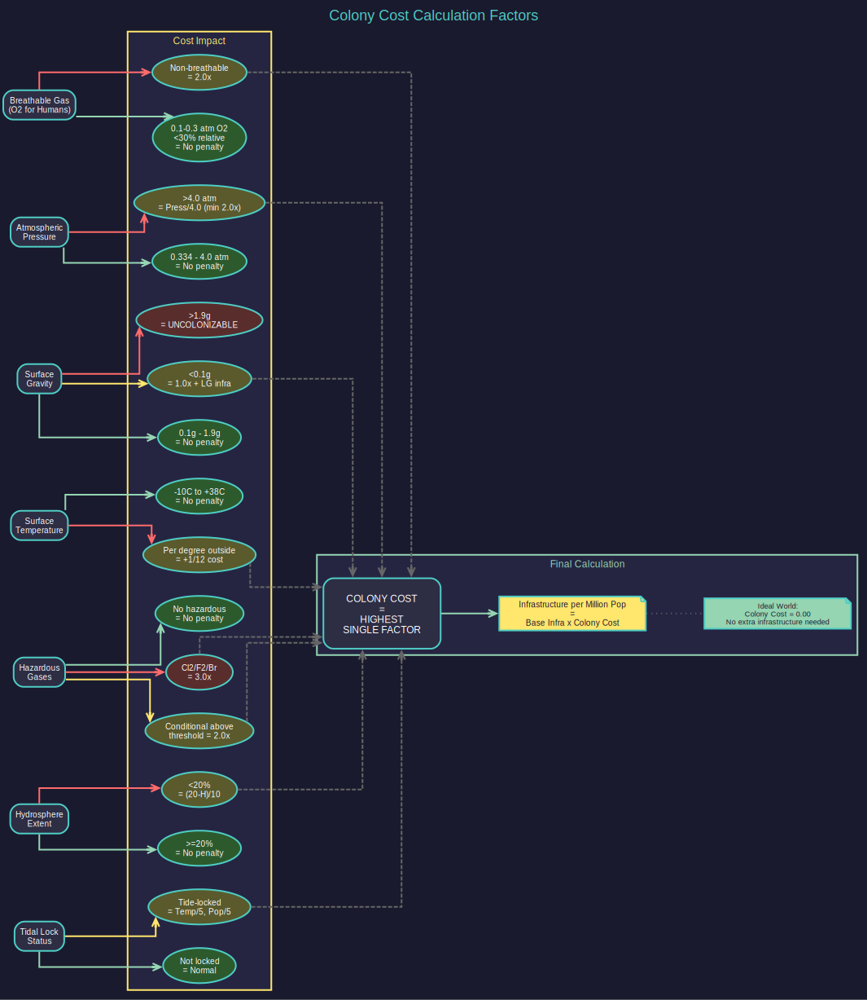

# 4.2 Planets and Moons

*Updated: v2026.01.30*

---

## Contents

*Updated: v2026.01.30*

{: .no_toc }

- TOC
{:toc}

## 4.2.1 Planet Types

*Updated: v2026.01.30*

Aurora C# generates a variety of planet types based on realistic astrophysical models. Each planet type has distinct characteristics that affect colonization potential, mineral availability, and strategic value.

> **Note:** Body properties (atmosphere, gravity, temperature, mineral deposits) can be viewed by selecting any planet, moon, or asteroid in the System Map and checking the sidebar panel. The System View window also provides detailed body information including colony cost calculations and habitability factors.

### 4.2.1.1 Terrestrial Planets

Rocky worlds similar to Earth, Mars, or Venus. These are the primary targets for colonization.

- **Size Range:** 0.055 to 1.14 Earth masses (based on generated terrestrial planets in the database) \hyperlink{ref-4.2-6}{[6]}
- **Composition:** Silicate rock and metal cores
- **Atmosphere:** Ranges from none (like Mercury) to extremely dense (like Venus)
- **Colonization:** Most suitable for large-scale human habitation, especially those in the habitable zone

Terrestrial planets are subdivided based on their characteristics:

- **Habitable Worlds:** Planets with temperatures and atmospheres close to Earth-normal. These are the rarest and most valuable finds in exploration.
- **Mars-like Worlds:** Cold, thin-atmosphere terrestrial planets. Require significant infrastructure investment but are common colonization targets.
- **Venus-like Worlds:** Hot, dense-atmosphere worlds. Extremely high colony costs but may be terraformable over long periods.
- **Airless Rocks:** Bodies with no atmosphere. Low colony cost for infrastructure but no breathable air, requiring enclosed habitation.

### 4.2.1.2 Gas Giants

Massive planets composed primarily of hydrogen and helium, similar to Jupiter and Saturn.

- **Size Range:** 2.9 to 2900 Earth masses (based on generated gas giants in the database, including super-jovians) \hyperlink{ref-4.2-6}{[6]}
- **Composition:** Hydrogen, helium, with possible rocky cores
- **Colonization:** Cannot be directly colonized, but their moons often can be
- **Resources:** Sorium (fuel) can be harvested from gas giant atmospheres using fuel harvesters (see [Section 14.1 Fuel](../14-logistics/14.1-fuel.md))

Gas giants are classified by size:

- **Small Gas Giants:** Neptune-like worlds, sometimes called ice giants
- **Standard Gas Giants:** Jupiter-mass worlds
- **Super Jupiters:** Extremely massive gas giants approaching brown dwarf territory

### 4.2.1.3 Dwarf Planets

Small rocky bodies that have achieved hydrostatic equilibrium but have not cleared their orbital neighborhood.

- **Size Range:** 425-1200 km radius in the database (BodyTypeID=3) \hyperlink{ref-4.2-6}{[6]}
- **Composition:** Rock and ice mixtures
- **Colonization:** Possible but limited by very low gravity and small surface area
- **Resources:** Can contain valuable mineral deposits despite their small size

### 4.2.1.4 Super-Earths

Large terrestrial worlds between Earth and Neptune in size.

- **Size Range:** Between terrestrial and gas giant ranges. The database does not define a distinct "Super-Earth" body type; large terrestrial planets and small gas giants form a continuum \hyperlink{ref-4.2-6}{[6]}.
- **Gravity:** High gravity increases colony cost. Gravity above species tolerance (1.9g for default humans) makes the body uncolonizable \hyperlink{ref-4.2-7}{[7]}
- **Atmosphere:** Frequently retain thick atmospheres due to higher gravity
- **Colonization:** High gravity increases infrastructure requirements but these worlds often have abundant minerals

> **Tip:** Don't dismiss high-gravity worlds outright. While their colony costs are higher, they frequently have exceptional mineral deposits that can justify the investment, especially for automated mining operations.

## 4.2.2 Atmospheric Composition

*Updated: v2026.01.30*

A planet's atmosphere is one of the most critical factors for colonization. Aurora C# models atmospheric composition in detail, tracking individual gas species and their partial pressures.

### 4.2.2.1 Atmospheric Gases

Aurora tracks the following gases in planetary atmospheres \hyperlink{ref-4.2-1}{[1]}:

| Gas | Danger Category | Notes |
|---|---|---|
| Nitrogen (N2) | Safe (any amount) | Inert filler gas, Earth's atmosphere is 78% N2 |
| Oxygen (O2) | Conditional | Required for human breathing; toxic above threshold |
| Carbon Dioxide (CO2) | Conditional | Greenhouse gas, toxic at higher levels |
| Water Vapour (H2O) | Safe (any amount) | Not classified as greenhouse in Aurora |
| Methane (CH4) | Conditional | Greenhouse gas, toxic above threshold |
| Ammonia (NH3) | Conditional | Toxic above threshold |
| Hydrogen (H2) | Conditional | Toxic above threshold |
| Helium (He) | Safe (any amount) | Inert, no danger at any level |
| Sulphur Dioxide (SO2) | Conditional | Greenhouse gas, toxic above threshold |
| Nitrogen Dioxide (NO2) | Conditional | Greenhouse gas, toxic above threshold |
| Chlorine (Cl2) | Always dangerous | Extremely toxic at any amount |
| Fluorine (F2) | Always dangerous | Extremely toxic and corrosive at any amount |
| Bromine (Br) | Always dangerous | Toxic at any amount |
| Iodine (I) | Conditional | Toxic above threshold |
| Argon (Ar) | Safe (any amount) | Inert noble gas |
| Neon (Ne) | Safe (any amount) | Inert noble gas |
| Carbon Monoxide (CO) | Conditional | Toxic above threshold |
| Hydrogen Sulphide (H2S) | Conditional | Toxic above threshold |
| Nitrogen Oxide (NO) | Conditional | Toxic above threshold |

> **Note:** The database also includes two fictional gases: Aestusium (greenhouse gas) and Frigusium (anti-greenhouse gas), used for terraforming mechanics \hyperlink{ref-4.2-2}{[2]}.

### 4.2.2.2 Atmospheric Pressure

Total atmospheric pressure significantly affects habitability:

- **No Atmosphere (0 atm):** Requires fully enclosed habitation. Results in a non-breathable colony cost factor of 2.0 \hyperlink{ref-4.2-8}{[8]}.
- **Very Low (< 0.1 atm):** Insufficient for human breathing even with correct gas mix (minimum breathable O2 partial pressure is 0.1 atm) \hyperlink{ref-4.2-7}{[7]}.
- **Low (0.1-0.7 atm):** Potentially breathable if gas composition is correct. Minimum total atmosphere for breathability is approximately 0.334 atm (to keep O2 below the 30% relative pressure limit) \hyperlink{ref-4.2-8}{[8]}.
- **Earth-Normal (0.7-1.5 atm):** Comfortable range for human habitation with correct gas mix.
- **High (1.5-4.0 atm):** Breathable with correct composition; species maximum atmospheric pressure for default humans is 4.0 atm \hyperlink{ref-4.2-7}{[7]}.
- **Very High (> 4.0 atm):** Exceeds species pressure tolerance, colony cost factor equals AtmosPress / PressMax (minimum 2.0) \hyperlink{ref-4.2-8}{[8]}.

### 4.2.2.3 Dangerous Atmospheres

An atmosphere is considered dangerous (increasing colony cost) if it contains \hyperlink{ref-4.2-3}{[3]}:

- Any amount of always-dangerous gases (Cl2, F2, Br) -- colony cost factor of 3.0 \hyperlink{ref-4.2-3}{[3]}
- Conditionally dangerous gases above their DangerousLevel thresholds -- colony cost factor of 2.0. Thresholds: NO2 and SO2 at 5 ppm, NO at 5 ppm, H2S at 20 ppm, CO and NH3 at 50 ppm, H2 and CH4 at 500 ppm, O2 at 500 ppm (for non-O2 breathers), I at 1 ppm, CO2 at 5000 ppm \hyperlink{ref-4.2-3}{[3]} \hyperlink{ref-4.2-8}{[8]}
- O2 relative pressure above 30% of total atmosphere (fire/toxicity risk) -- colony cost factor of 2.0 \hyperlink{ref-4.2-8}{[8]}
- Total atmospheric pressure exceeding species maximum (4.0 atm for default humans) -- colony cost factor equals AtmosPress / PressMax \hyperlink{ref-4.2-7}{[7]} \hyperlink{ref-4.2-8}{[8]}

### 4.2.2.4 Greenhouse and Anti-Greenhouse Effects

Certain gases trap heat (greenhouse effect) or reflect it (anti-greenhouse effect), modifying the planet's surface temperature from what orbital distance alone would predict:

- **Greenhouse Gases:** CO2, CH4, NO2, SO2, and Aestusium (fictional) - increase surface temperature \hyperlink{ref-4.2-4}{[4]}
- **Anti-Greenhouse:** Frigusium (fictional) reflects incoming radiation \hyperlink{ref-4.2-4}{[4]}

The greenhouse effect is critical for terraforming calculations (see [Section 5.5 Terraforming](../5-colonies/5.5-terraforming.md)), as adding or removing greenhouse gases is the primary mechanism for adjusting planetary temperature.

> **Tip:** When evaluating colonization targets, look at the specific gases present, not just pressure. A 1.2 atm nitrogen-oxygen atmosphere with trace CO2 is ideal, while a 0.8 atm atmosphere with chlorine is deadly regardless of its comfortable pressure.

## 4.2.3 Gravity and Temperature

*Updated: v2026.01.30*

### 4.2.3.1 Surface Gravity

Surface gravity is determined by a planet's mass and radius, expressed in multiples of Earth gravity (g). Gravity has major gameplay implications:

**On Colony Cost:**

- **Below species tolerance:** Any gravity below species minimum (0.1g for default humans) triggers a fixed colony cost factor of 1.0 and requires low-gravity (LG) infrastructure instead of standard infrastructure \hyperlink{ref-4.2-7}{[7]} \hyperlink{ref-4.2-8}{[8]}.
- **Within species tolerance (0.1g to 1.9g for default humans):** No gravity-related colony cost penalty \hyperlink{ref-4.2-7}{[7]}.
- **Above species tolerance:** The body cannot be colonized at all -- gravity above maximum species tolerance makes colonization impossible \hyperlink{ref-4.2-8}{[8]}.

**On Infrastructure:**

- Higher gravity requires more robust construction, increasing the effective cost of infrastructure
- Launch costs for spacecraft increase with gravity (relevant for naval shipyards on planetary surfaces)
- Low gravity can cause long-term health issues for colonists

### 4.2.3.2 Surface Temperature

Surface temperature is derived from orbital distance, stellar luminosity, atmospheric greenhouse effects, and albedo. Temperature is expressed in degrees Celsius and categorized as:

The colony cost factor for temperature is calculated as: degrees outside species tolerance / (TempDev / 2). For default humans, the species base temperature is 287K (14C) with a TempDev of 24, giving a zero-cost range of approximately -10C to 38C \hyperlink{ref-4.2-7}{[7]} \hyperlink{ref-4.2-8}{[8]}. Each degree outside this range incrementally increases colony cost.

Temperature varies with orbital position for planets with eccentric orbits. Aurora calculates colony cost based on the current temperature at each time increment, displaying both current and maximum colony cost values. Worlds with eccentricity above 0.18 can never achieve zero colony cost for unmodified humans \hyperlink{ref-4.2-9}{[9]}.

### 4.2.3.3 Combined Habitability

The ideal colony target (colony cost of 0.00) has \hyperlink{ref-4.2-8}{[8]}:

- Breathable gas (O2 for humans) at 0.1-0.3 atm partial pressure, with relative O2 below 30% of total atmosphere
- Total atmospheric pressure within species tolerance (up to 4.0 atm for humans)
- Surface gravity within species tolerance (0.1g to 1.9g for default humans)
- Surface temperature within species tolerance (approximately -10C to 38C for default humans)
- No dangerous gases above their thresholds
- Hydrosphere extent of at least 20%

Each deviation from these ideals adds to the colony cost multiplier, which determines how much infrastructure (see [Section 5.4 Infrastructure](../5-colonies/5.4-infrastructure.md)) is needed per unit of population.

> **Tip:** A planet with a colony cost of 2.0 requires twice the infrastructure per million colonists compared to an ideal world. When choosing between colony sites, even small differences in colony cost compound significantly at large population scales.

## 4.2.4 Moons

*Updated: v2026.01.30*

Moons in Aurora C# are modeled as full celestial bodies with their own characteristics, atmospheres, and mineral deposits. They orbit their parent planet and can be colonized independently.

### 4.2.4.1 Moon Generation

Moons are generated during system creation based on the parent body:

- **Gas Giants:** Typically have the most moons (13-30 in the database), ranging from small rocky bodies to large terrestrial-class worlds \hyperlink{ref-4.2-10}{[10]}. The largest moons of gas giants are often excellent colonization candidates.
- **Large Terrestrial Planets:** May have 1-7 moons, generally smaller than the parent body \hyperlink{ref-4.2-10}{[10]}.
- **Small Terrestrial Planets:** Rarely have moons; those that exist tend to be very small (Mars has 2, dwarf planets typically have 1-5) \hyperlink{ref-4.2-10}{[10]}.

### 4.2.4.2 Moon Characteristics

Moons share the same property system as planets:

- They have their own gravity, temperature, and atmospheric composition
- They can have mineral deposits independent of their parent planet
- They can be surveyed and colonized separately
- They orbit their parent body with their own orbital period

### 4.2.4.3 Tidal Effects

Aurora C# models tidal forces for moons. The database tracks TidalLock and TidalForce fields for all system bodies \hyperlink{ref-4.2-11}{[11]}. In the database, all 157 moons have TidalLock=1 (tidally locked) and Eccentricity=0.0 (circular orbits). Tidal effects include:

- **Tidal locking:** All moons in Aurora are tidally locked (one face always toward the parent). For tide-locked worlds, the colony cost temperature factor is reduced to 20% of normal \hyperlink{ref-4.2-8}{[8]}. However, population capacity is also reduced by 20% due to habitation being limited to the twilight zone between the permanently lit and dark hemispheres \hyperlink{ref-4.2-8}{[8]}.
- **Tidal heating:** The TidalForce field tracks tidal forces that can affect surface conditions.
- **Tectonic activity:** The TectonicActivity field is tracked for all bodies, though the exact gameplay effect is limited to terrain and geological survey flavor.

### 4.2.4.4 Gameplay Considerations for Moons

**Advantages of Moon Colonies:**

- Proximity to gas giant fuel harvesting operations
- Multiple colonizable bodies in close proximity (moon systems)
- Shared orbital space simplifies fleet logistics
- Some gas giant moons have surprisingly Earth-like conditions

**Disadvantages:**

- Generally smaller than planets, meaning lower total mineral deposits
- Lower gravity is common, increasing colony costs slightly
- Tidal locking can create challenging temperature conditions
- Orbital mechanics can complicate approach vectors for fleets

### 4.2.4.5 Strategic Value of Moon Systems

Gas giant moon systems represent concentrated strategic assets. A single gas giant may have several colonizable moons plus fuel harvesting potential, all within a compact region of space. Establishing a presence around a resource-rich gas giant can provide:

- Fuel production (Sorium harvesting from the gas giant; see [Section 14.1 Fuel](../14-logistics/14.1-fuel.md))
- Multiple mining colonies (across different moons)
- Defensive concentration (easier to protect than scattered colonies)
- Population distribution (spreading population across multiple small colonies reduces risk)

> **Tip:** The largest moons of gas giants (analogous to Ganymede or Titan in our solar system) are often overlooked as colonization targets but can rival small planets in size and mineral wealth. Always check gas giant moon systems during your geological surveys.

## 4.2.5 Eccentric Orbits

*Updated: v2026.01.30*

As of v2.0.0, Aurora C# models eccentric (non-circular) orbits for stars, planets, and other bodies. This significantly affects temperature calculations and colony planning.

### 4.2.5.1 Stellar Orbits

Stars in multi-star systems can have orbital eccentricities up to 0.9 during normal generation (up to 0.95 when manually edited) \hyperlink{ref-4.2-13}{[13]}. Stellar orbits cannot intersect each other \hyperlink{ref-4.2-13}{[13]}. A 0.9 eccentricity creates an aphelion roughly 19 times the perihelion distance \hyperlink{ref-4.2-5}{[5]}.

### 4.2.5.2 Planetary Orbits

Planetary bodies have lower eccentricities than stars:

- The maximum possible eccentricity during generation is 0.65 (without Gas Giant Effects) \hyperlink{ref-4.2-13}{[13]}. In the database, the maximum observed planet eccentricity (non-Sol) is 0.25, though the Sol system includes bodies with eccentricities up to 0.85 (Sedna) \hyperlink{ref-4.2-12}{[12]}.
- Distribution is heavily weighted toward circular: 70% of planets have eccentricity below 0.15, and 90% below 0.25 \hyperlink{ref-4.2-13}{[13]}. The current database shows 67% below 0.15 and 89% below 0.25 for non-Sol planets \hyperlink{ref-4.2-12}{[12]}.
- Unlike stellar orbits, planetary orbits may cross due to eccentricity (similar to Pluto-Neptune dynamics) \hyperlink{ref-4.2-13}{[13]}.

### 4.2.5.3 Temperature and Colony Impact

As planets orbit their star, their distance fluctuates based on eccentricity, causing surface temperature variations throughout the orbital period. This affects habitability calculations:

- Colony costs become ranges rather than fixed numbers.
- The system displays both the current colony cost and the maximum colony cost.
- Players must plan for worst-case habitability conditions when establishing colonies.

### 4.2.5.4 Other Body Types

- **Moons:** All moons in the database have eccentricity of 0.0 (circular orbits) \hyperlink{ref-4.2-12}{[12]}. Their conditions depend primarily on their parent body's eccentricity and current orbital position.
- **Comets:** Comets have eccentricities ranging from 0.26 to 0.998 in the database (BodyClass=5) \hyperlink{ref-4.2-12}{[12]}. Comet tails always point away from the star. *(unverified — [#724](https://github.com/ErikEvenson/aurora-manual/issues/724))*
- **Asteroids:** Approximately 25% have non-zero eccentricities in the database (121 of 482 asteroids), with a maximum of 0.90 \hyperlink{ref-4.2-12}{[12]}.

### 4.2.5.5 Sol System

Real solar system bodies have been assigned historically accurate eccentricity values, with randomized orbital positions at game start.

## 4.2.6 Gas Giant Effects

*Updated: v2026.01.28*

Gas Giant Effects is an optional system generation feature (v2.0.0+) that simulates how massive gas giants influence nearby celestial bodies during planetary formation \hyperlink{ref-4.2-14}{[14]}.

### 4.2.6.1 Triggering Conditions

Only gas giants with a mass of 50 Earth masses or higher trigger these effects \hyperlink{ref-4.2-14}{[14]}. The game processes them in descending order of mass \hyperlink{ref-4.2-14}{[14]}.

### 4.2.6.2 Zone of Influence

The affected zone around a gas giant varies based on its mass \hyperlink{ref-4.2-14}{[14]}:

| Gas Giant Mass | Inner Boundary | Outer Boundary |
|---|---|---|
| 50-200 Earth masses | Perihelion x 0.67 | Aphelion x 1.33 |
| Up to 500 Earth masses | Perihelion x 0.5 | Aphelion x 1.5 |
| Over 500 Earth masses (superjovians) | Perihelion x 0.4 | Aphelion x 2.0 |

### 4.2.6.3 Effects on Dwarf Planets

Dwarf planets within the influence zone face three possible outcomes \hyperlink{ref-4.2-14}{[14]}:

- **40% chance:** Orbital eccentricity increases by D10 x 0.04.
- **30% chance:** Captured as a moon of the gas giant.
- **30% chance:** Ejected from the system entirely.

### 4.2.6.4 Effects on Terrestrial Planets

Terrestrial planets within the influence zone experience four possible outcomes \hyperlink{ref-4.2-14}{[14]}:

- **20% chance:** Orbital eccentricity increases by D10 x 0.04.
- **40% chance:** Replaced by an asteroid belt.
- **20% chance:** Captured as a moon of the gas giant.
- **20% chance:** Ejected from the system.

### 4.2.6.5 Gameplay Implications

Gas Giant Effects creates more varied system compositions, with larger gas giants carving out cleared zones in their orbital neighborhoods. This can result in:

- Systems with extensive asteroid belts where terrestrial planets might otherwise exist.
- Gas giants with captured terrestrial moons that may be habitable.
- Fewer inner-system planets in systems dominated by large gas giants.
- More eccentric orbits for surviving planets near massive gas giants.

## Related Sections

- [Section 2.3 System Generation](../2-game-setup/2.3-system-generation.md) -- System generation options and settings
- [Section 4.1 Star Systems](4.1-star-systems.md) -- Star classifications, binary/trinary systems, and system-level properties
- [Section 5.4 Infrastructure](../5-colonies/5.4-infrastructure.md) -- Colony installations and infrastructure
- [Section 5.5 Terraforming](../5-colonies/5.5-terraforming.md) -- Atmospheric modification for habitability
- [Section 6.2 Mining](../6-economy-and-industry/6.2-mining.md) -- Mineral extraction and fuel harvesting
- [Section 14.1 Fuel](../14-logistics/14.1-fuel.md) -- Fuel harvesting operations and supply
- [Appendix A: Formulas](../appendices/A-formulas.md) -- Colony cost and temperature formulas

## References

\hypertarget{ref-4.2-1}{[1]}. Aurora C# game database (AuroraDB.db v2.7.1) -- `DIM_Gases` table. 22 gas entries (GasID 0-22, with gaps). Safe gases (Dangerous=0): N2, He, H2O, Ne, Ar. Conditionally dangerous (Dangerous=2): H2, CH4, NH3, CO, NO, O2, H2S, CO2, NO2, SO2, I. Always dangerous (Dangerous=3): Cl2, F2, Br. **Corrections:** Table restructured to match database categories. Added Bromine (Br), Iodine (I), and Nitrogen Oxide (NO) which were missing from original. H2O is not a greenhouse gas in Aurora (GHGas=0). Hydrogen and Methane are conditionally dangerous, not unconditionally toxic.

\hypertarget{ref-4.2-2}{[2]}. Aurora C# game database (AuroraDB.db v2.7.1) -- `DIM_Gases` table. Aestusium (GasID=20, GHGas=1) and Frigusium (GasID=22, AntiGHGas=1) are fictional gases used for terraforming.

\hypertarget{ref-4.2-3}{[3]}. Aurora C# game database (AuroraDB.db v2.7.1) -- `DIM_Gases`.Dangerous column. Dangerous=3 (always dangerous): Cl2, F2, Br. **Correction:** Original text listed SO2, NO2, CO, H2S, NH3 as "any amount" toxic, but database shows these as Dangerous=2 (conditional), meaning they are only toxic above their DangerousLevel threshold.

\hypertarget{ref-4.2-4}{[4]}. Aurora C# game database (AuroraDB.db v2.7.1) -- `DIM_Gases`.GHGas and AntiGHGas columns. Greenhouse gases (GHGas=1): CH4, CO2, NO2, SO2, Aestusium. Anti-greenhouse (AntiGHGas=1): Frigusium. **Correction:** H2O vapor is NOT a greenhouse gas in Aurora's database (GHGas=0). NO2 IS a greenhouse gas but was omitted from the original text. Updated accordingly.

\hypertarget{ref-4.2-5}{[5]}. Mathematical verification: aphelion/perihelion ratio = (1+e)/(1-e). At e=0.9: (1.9)/(0.1) = 19. Confirmed.

\hypertarget{ref-4.2-6}{[6]}. Aurora C# game database (AuroraDB.db v2.7.1) -- `FCT_SystemBody`. BodyTypeID=2 (Terrestrial): Mass range 0.055-1.137, Radius 2440-7500. BodyTypeID=3 (Dwarf Planet): Mass range 0.000028-0.0046, Radius 425-1200. BodyTypeID=4 (Gas Giant): Mass range 2.92-317.82, Radius 18000-71500. BodyTypeID=5 (Super-Jovian): Mass 2900, Radius 80000. No distinct "Super-Earth" BodyTypeID exists.

\hypertarget{ref-4.2-7}{[7]}. Aurora C# game database (AuroraDB.db v2.7.1) -- `FCT_Species`. Human species: BreatheID=10 (Oxygen), Oxygen=0.2 (ideal partial pressure), OxyDev=0.1 (breathable range 0.1-0.3 atm), PressMax=4.0 (max atmospheric pressure), Temperature=287.03K (14C base), TempDev=24.0 (tolerance range approx -10C to 38C), Gravity=1.0 (base), GravDev=0.9 (tolerance range 0.1-1.9g).

\hypertarget{ref-4.2-8}{[8]}. Aurora Forums / AuroraWiki -- Colony cost calculation. Colony cost equals the highest single factor from: temperature deviation (degrees outside tolerance / half TempDev), low gravity (fixed 1.0 with LG infrastructure required), dangerous gas (3.0 for Cl2/F2/Br, 2.0 for conditional gases), non-breathable atmosphere (2.0), excess O2 relative pressure above 30% (2.0), excess atmospheric pressure (AtmosPress / PressMax, minimum 2.0), low hydrosphere below 20% ((20 - HydroExtent) / 10). Gravity above species tolerance makes body uncolonizable. Tide-locked worlds get temperature factor reduced to 20% of normal.

\hypertarget{ref-4.2-9}{[9]}. AuroraWiki (Terraforming) -- Worlds with orbital eccentricity above 0.18 can never achieve zero colony cost for unmodified humans because temperature fluctuations throughout the orbital year exceed species tolerance range.

\hypertarget{ref-4.2-10}{[10]}. Aurora C# game database (AuroraDB.db v2.7.1) -- `FCT_SystemBody` moon counts (BodyClass=2) by parent. Gas giants: Jupiter 20, Saturn 28, Uranus 27, Neptune 13, others 16-30. Terrestrial planets: Earth 1, Mars 2, others 2-7. Dwarf planets: Pluto 5, Eris 1, Haumea 2, others 1.

\hypertarget{ref-4.2-11}{[11]}. Aurora C# game database (AuroraDB.db v2.7.1) -- `FCT_SystemBody`.TidalLock and TidalForce columns. All 157 moons (BodyClass=2) have TidalLock=1 and Eccentricity=0.0. TidalForce values vary by moon.

\hypertarget{ref-4.2-12}{[12]}. Aurora C# game database (AuroraDB.db v2.7.1) -- `FCT_SystemBody`.Eccentricity by BodyClass. Planets (BodyClass=1): range 0.007-0.85, non-Sol max 0.25. Moons (BodyClass=2): all 0.0. Asteroids (BodyClass=3): 25.1% non-zero (121/482), max 0.90. Comets (BodyClass=5): range 0.26-0.998, mean 0.80.

\hypertarget{ref-4.2-13}{[13]}. Aurora Forums -- v2.0.0 changelog, Eccentric Orbits entry. Stellar eccentricity up to 0.9 (0.95 when edited), stellar orbits non-crossing. Planetary max eccentricity 0.65 without Gas Giant Effects. Distribution: 70% below 0.15, 90% below 0.25. Planetary orbits may cross (Pluto-Neptune dynamics).

\hypertarget{ref-4.2-14}{[14]}. Aurora Forums -- v2.0.0 changelog, Gas Giant Effects entry. Triggering: gas giants >= 50 Earth masses, processed in descending mass order. Zone boundaries by mass tier (50-200, up to 500, over 500 Earth masses). Dwarf planet outcomes: 40% eccentricity increase, 30% capture, 30% ejection. Terrestrial outcomes: 20% eccentricity increase, 40% asteroid belt, 20% capture, 20% ejection. Eccentricity formula: D10 x 0.04.
