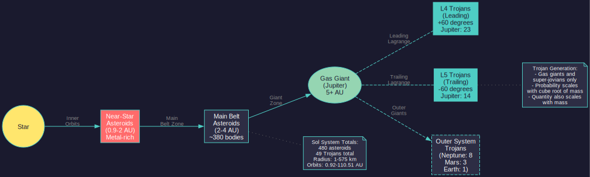

# 4.3 Asteroids and Comets

*Updated: v2026.01.30*

---

## Contents

*Updated: v2026.01.30*

{: .no_toc }

- TOC
{:toc}

## 4.3.1 Asteroid Belts

*Updated: v2026.01.30*

Asteroid belts are collections of rocky and metallic bodies that orbit a star, typically found between the inner rocky planets and the outer gas giants, though Aurora can generate them at various orbital distances.

### 4.3.1.1 Distribution and Generation

During system creation, Aurora generates asteroid belts based on realistic models:

- **Main Belts:** Found between terrestrial and gas giant orbital zones, similar to the asteroid belt between Mars and Jupiter in our solar system.
- **Trojan Asteroids:** Groups of asteroids that share an orbit with a planet, located at the L4 and L5 Lagrange points.
- **Near-Star Asteroids:** Occasionally generated in close orbits, these tend to be metal-rich due to volatile loss from solar heating.

Each asteroid belt contains multiple individual asteroid bodies, each with its own mineral survey results. For example, the Sol system contains 480 asteroids \hyperlink{ref-4.3-11}{[11]}, with radii ranging from 1 to 575 km (average 89.3 km) and orbital distances spanning 0.92 to 110.51 AU.

#### 4.3.1.1.1 Trojan Asteroid Generation

Trojan asteroids occupy the L4 (leading, approximately +60° ahead) and L5 (trailing, approximately -60° behind) Lagrange points of a planet's orbit \hyperlink{ref-4.3-12}{[12]}. These are gravitationally stable regions where asteroids can persist indefinitely.

**Generation Mechanics:**

- **Planet Type:** Trojans generate only around gas giants and super-jovian planets \hyperlink{ref-4.3-13}{[13]}
- **Generation Probability:** Based on the cube root of the planet's mass — more massive planets are more likely to have Trojans \hyperlink{ref-4.3-13}{[13]}
- **Quantity Scaling:** The number of Trojans generated also scales with the cube root of planetary mass \hyperlink{ref-4.3-13}{[13]}

**Sol System Trojans:**

In the Sol system reference data, 49 of the 480 asteroids are Trojans \hyperlink{ref-4.3-11}{[11]}:

| Planet | L4 (Leading) | L5 (Trailing) | Total |
|--------|--------------|---------------|-------|
| Jupiter | 23 | 14 | 37 |
| Neptune | 6 | 2 | 8 |
| Mars | 1 | 2 | 3 |
| Earth | 1 | 0 | 1 |

Jupiter's dominance reflects both its enormous mass and the real-world abundance of known Jupiter Trojans. The cube root relationship means that even very massive planets like Saturn may generate no Trojans in a given system due to probability variance.

### 4.3.1.2 Asteroid Properties

Individual asteroids have the following characteristics:

- **Size:** Ranges from 1 km to 575 km radius in the Sol system reference data \hyperlink{ref-4.3-11}{[11]}, with an average of approximately 89 km. Larger asteroids are less common but may have more total mineral deposits.
- **Composition:** Varies from carbonaceous (carbon-rich, volatile-rich) to silicate (rocky) to metallic (iron-nickel). Composition affects which minerals are likely present.
- **Gravity:** Very low, typically well below 0.1g. This means colony costs related to gravity are minimal, but infrastructure must account for microgravity conditions.
- **Atmosphere:** Asteroids have no atmosphere. Colony cost is determined primarily by the infrastructure requirements for enclosed habitation.
- **Temperature:** Determined by orbital distance from the star. Inner-system asteroids can be quite hot, while outer-belt asteroids are extremely cold.

### 4.3.1.3 Mining Potential

Asteroids are primarily valuable for their mineral deposits. Key considerations:

- **Accessibility:** Each mineral deposit has an accessibility rating (0.1 to 1.0) \hyperlink{ref-4.3-1}{[1]} that determines how efficiently it can be extracted. Higher accessibility means faster mining output per mining installation.
- **Mineral Variety:** Asteroids can contain all eleven mineral types tracked in Aurora \hyperlink{ref-4.3-2}{[2]} (see [Appendix B: Glossary](../appendices/B-glossary.md)). The database does not differentiate asteroid composition types (all asteroids share BodyTypeID=1); mineral deposits are randomly assigned without confirmed affinities for specific asteroid subtypes \hyperlink{ref-4.3-7}{[7]}.
- **Deposit Size:** Individual deposits range from tiny (a few thousand tons) to massive (hundreds of thousands or millions of tons). Survey ships with geological survey sensors reveal both the quantity and accessibility of each mineral.
- **Concentration:** Asteroids sometimes have extremely high-accessibility deposits that make them worth mining even when deposit sizes are moderate.

> **Tip:** When surveying asteroid belts, pay attention to accessibility ratings as much as deposit sizes. A 50,000-ton deposit at 1.0 accessibility will be mined faster than a 200,000-ton deposit at 0.1 accessibility, and the mining installations can be relocated once the high-accessibility deposit is exhausted.

## 4.3.2 Comets

*Updated: v2026.01.30*

Comets are icy bodies that typically have highly eccentric orbits, swinging from the outer reaches of a star system to close perihelion passages near the star.

### 4.3.2.1 Orbital Characteristics

- **Eccentric Orbits:** Comets have orbital eccentricities much higher than planets, ranging from 0.26 to 0.998 in the database (mean 0.80) \hyperlink{ref-4.3-5}{[5]}. This means their distance from the star varies enormously over their orbital period.
- **Long Periods:** Many comets have orbital periods measured in decades or centuries, spending most of their time in the far outer system.
- **Inclination:** Comets often have orbits inclined significantly to the system's ecliptic plane, making them harder to reach efficiently.

### 4.3.2.2 Comet Properties

- **Composition:** Primarily water ice, frozen gases, and rocky/dusty material. Often referred to as "dirty snowballs." Comets in the database are extremely small (mass range 9.2e-13 to 1.1e-6 Earth masses, radius 1-80 km) \hyperlink{ref-4.3-5}{[5]}.
- **Size:** Generally small, ranging from a few kilometers to tens of kilometers in diameter.
- **Volatiles:** Comets are notable sources of volatile materials including water, CO2, and other frozen gases. They can contain Sorium deposits -- 8 of 32 comets in the database have Sorium mineral deposits \hyperlink{ref-4.3-6}{[6]}.
- **Mineral Deposits:** While generally less mineral-rich than asteroids, comets can contain surprising deposits, particularly of rarer minerals.

### 4.3.2.3 Practical Considerations

Comets present unique challenges for exploitation:

**Accessibility Issues:**

- Their eccentric orbits mean mining ships must chase them or wait for favorable orbital positions
- The constantly changing distance from the star means transit times vary dramatically
- Automated mining colonies on comets must deal with extreme temperature variations as the comet's orbit brings it closer to and further from the star

**Strategic Value:**

- Comets in the outer system can serve as remote outposts
- Their water ice content can be valuable for colonies lacking local water
- Rare mineral deposits on comets may justify the logistical challenges

> **Tip:** Comets are generally not your first choice for mining operations due to their eccentric orbits and small sizes. However, if a geological survey reveals a high-accessibility deposit of a rare mineral on a comet, it may be worth the logistical overhead, especially if that mineral is scarce elsewhere in the system.

## 4.3.3 Mining Operations

*Updated: v2026.01.29*

Mining asteroids and comets follows the same fundamental mechanics as mining on planets and moons, but with some important distinctions.

### 4.3.3.1 Establishing Asteroid/Comet Mining

To mine an asteroid or comet, you need:

1. **Geological Survey:** First, survey the body with a ship equipped with geological survey sensors (see [Section 17.1 Geological Survey](../17-exploration/17.1-geological-survey.md)). This reveals mineral deposits and their accessibility ratings.
2. **Mining Colony:** Establish a colony on the body. This requires transporting colonists (even a small population) and mining installations to the body.
3. **Mining Installations:** These are the primary production facilities. Each installation extracts minerals at a rate determined by the deposit's accessibility and the installation's tech level.
4. **Mass Drivers (Optional):** Mass drivers can launch mined minerals to another colony with a mass driver receiver, eliminating the need for freighter transport.

### 4.3.3.2 Automated Mining

For small bodies where maintaining a population is impractical, Aurora provides automated mining:

- **Automated Mines:** These installations do not require population to operate \hyperlink{ref-4.3-3}{[3]}. They have the same base MiningProductionValue as conventional mines in the database \hyperlink{ref-4.3-4}{[4]}, but the effective output difference comes from conventional mines being operated by population (Workers=0.05 per mine). Automated mines eliminate the need to transport and support colonists.
- **Ideal for Asteroids:** Since most asteroids cannot support large populations anyway, automated mines are the practical choice for asteroid mining operations.
- **No Infrastructure Needed:** Since automated mines require no population (Workers=0.0) \hyperlink{ref-4.3-3}{[3]}, infrastructure is unnecessary -- infrastructure only supports population, and automated mines operate without any \hyperlink{ref-4.3-8}{[8]}.

### 4.3.3.3 Conventional vs. Automated Mining Comparison

| Factor | Conventional Mining | Automated Mining |
|---|---|---|
| Requires Population | Yes | No \hyperlink{ref-4.3-3}{[3]} |
| Production Rate | Full (with population) | Same base rate, no population bonus \hyperlink{ref-4.3-4}{[4]} |
| Infrastructure Needed | Yes (based on colony cost) | No |
| Setup Complexity | High | Low |
| Maintenance | Population support required | Minimal |
| Best For | Large, accessible deposits | Small bodies, remote locations |

### 4.3.3.4 Mass Driver Networks

Mass drivers are a key technology for asteroid mining operations:

- **Mass Driver Installation:** Launches mineral packets toward a receiving colony at high speed. Each mass driver launches 5,000 tons of minerals per year \hyperlink{ref-4.3-9}{[9]} (see [Section 6.2 Mining](../6-economy-and-industry/6.2-mining.md)).
- **Mass Driver Receiver:** The target colony must also have a mass driver installation to receive packets. Without a receiver, packets are lost \hyperlink{ref-4.3-9}{[9]}.
- **Range:** Mass drivers can launch to any other colony in the same star system, making them ideal for asteroid belt-to-planet transfers \hyperlink{ref-4.3-9}{[9]}.
- **Throughput:** Each mass driver installation launches 5,000 tons per year. Multiple installations increase throughput linearly. Each mass driver weighs 25,000 tons of cargo capacity \hyperlink{ref-4.3-10}{[10]}.

A common strategy is to establish automated mining colonies on multiple asteroids in a belt, each equipped with mass drivers, all targeting a central collection point (usually your main colony in that system) equipped with mass driver receivers.

### 4.3.3.5 Mining Strategy Considerations

**Prioritizing Deposits:**

- Focus on high-accessibility deposits first for maximum early production
- Consider mineral scarcity: a small deposit of a rare mineral may be more valuable than a large deposit of a common one
- Factor in transport costs: a moderate deposit close to your main colony may be more efficient than a rich deposit far away

**Scaling Operations:**

- Start with your most accessible deposits to build up mineral stockpiles
- Expand to more marginal deposits as your economy grows
- Use mass driver networks to centralize collection
- Rotate mining installations to new deposits as old ones are exhausted

**Infrastructure Investment:**

- Automated mines require only the installations themselves and (optionally) mass drivers
- Conventional mining requires population transport, infrastructure, and ongoing support
- The break-even point favors automated mining for most asteroid operations

> **Tip:** A mass driver network connecting 5-10 asteroid mining colonies to your homeworld can provide a tremendous mineral income with minimal ongoing management. Set up automated mines with mass drivers, point them at your homeworld's receiver, and let them run. Check periodically to see if deposits are exhausted and relocate installations as needed.

## Related Sections

- [Section 4.2 Planets and Moons](4.2-planets-and-moons.md) -- Planetary properties, gravity, atmosphere, and colonization mechanics
- [Section 4.4 Jump Points](4.4-jump-points.md) -- Interstellar travel affecting mining logistics and accessibility
- [Section 6.2 Mining](../6-economy-and-industry/6.2-mining.md) -- Mining operations and mass driver networks
- [Section 8.1 Design Philosophy](../8-ship-design/8.1-design-philosophy.md) -- Designing mining ships and survey vessels
- [Section 14.1 Fuel](../14-logistics/14.1-fuel.md) -- Transport logistics for mining colonies
- [Section 17.1 Geological Survey](../17-exploration/17.1-geological-survey.md) -- Geological survey operations
- [Appendix A: Formulas](../appendices/A-formulas.md) -- Mining rate and accessibility calculations

## References

\hypertarget{ref-4.3-1}{[1]}. Aurora C# game database (AuroraDB.db v2.7.1) -- `FCT_MineralDeposit`.Accessibility column. MIN(Accessibility)=0.1, MAX(Accessibility)=1.0 across all deposits. Confirmed.

\hypertarget{ref-4.3-2}{[2]}. Aurora C# game database (AuroraDB.db v2.7.1) -- `DIM_PlanetaryInstallation` mineral columns. Eleven mineral types confirmed: Duranium, Neutronium, Corbomite, Tritanium, Boronide, Mercassium, Vendarite, Sorium, Uridium, Corundium, Gallicite.

\hypertarget{ref-4.3-3}{[3]}. Aurora C# game database (AuroraDB.db v2.7.1) -- `DIM_PlanetaryInstallation`. Automated Mine: Workers=0.0 (no population required). Conventional Mine: Workers=0.05. Confirmed.

\hypertarget{ref-4.3-4}{[4]}. Aurora C# game database (AuroraDB.db v2.7.1) -- `DIM_PlanetaryInstallation`.MiningProductionValue. Both Mine and Automated Mine have MiningProductionValue=1.0. **Correction:** The original text stated automated mines produce at "roughly half efficiency" / "~50% of conventional." The database shows identical MiningProductionValue. The effective difference comes from conventional mines leveraging population (Workers field), not from a reduced base production rate. The comparison table has been updated accordingly.

\hypertarget{ref-4.3-5}{[5]}. Aurora C# game database (AuroraDB.db v2.7.1) -- `FCT_SystemBody`. Comets (BodyClass=5): 32 entries. Eccentricity range 0.258-0.998, mean 0.795. Mass range 9.2e-13 to 1.12e-6 Earth masses. Radius range 1-80 km.

\hypertarget{ref-4.3-6}{[6]}. Aurora C# game database (AuroraDB.db v2.7.1) -- `FCT_MineralDeposit` joined with `FCT_SystemBody` (BodyClass=5). 8 of 32 comets have Sorium deposits (MaterialID=8), confirming comets can contain Sorium.

\hypertarget{ref-4.3-7}{[7]}. Aurora C# game database (AuroraDB.db v2.7.1) -- `FCT_SystemBody`. All 482 asteroids (BodyClass=3) share BodyTypeID=1. No composition sub-type field exists to differentiate metallic, carbonaceous, or silicate asteroids.

\hypertarget{ref-4.3-8}{[8]}. AuroraWiki -- Infrastructure and Automated Mines. Infrastructure supports population; since automated mines require no population (Workers=0.0), they bypass infrastructure requirements entirely. Automated mines can operate on any colonizable body regardless of colony cost.

\hypertarget{ref-4.3-9}{[9]}. AuroraWiki (Mass Driver) -- Each mass driver launches 5,000 tons of minerals per year to any other colony in the same star system. The receiving colony must also have a mass driver installed; without one, packets are lost. In C# Aurora, the target colony needs its own mass driver to be a valid target.

\hypertarget{ref-4.3-10}{[10]}. Aurora C# game database (AuroraDB.db v2.7.1) -- `DIM_PlanetaryInstallation`. Mass Driver (PlanetaryInstallationID=24): MassDriverValue=1.0, CargoPoints=25000 (25,000 tons cargo capacity to transport).

\hypertarget{ref-4.3-11}{[11]}. Aurora C# game database (AuroraDB.db v2.7.1) -- `DIM_SolSystemBodies`. Sol system asteroids (BodyClass=3): 480 total. Radius range 1-575 km, average 89.3 km. OrbitalDistance range 0.92-110.51 AU. Trojans (TrojanPlanet>0): 49 asteroids distributed across Jupiter (37), Neptune (8), Mars (3), and Earth (1).

\hypertarget{ref-4.3-12}{[12]}. Aurora C# game database (AuroraDB.db v2.7.1) -- `DIM_SolSystemBodies`. TrojanLocation=4 corresponds to L4 (leading point, TrojanOffset approximately -60°), TrojanLocation=5 corresponds to L5 (trailing point, TrojanOffset approximately +60°). Confirmed by examining TrojanOffset values: L4 entries average -58° to -62°, L5 entries average +55° to +62°.

\hypertarget{ref-4.3-13}{[13]}. Aurora Forums -- "Updates to the Sol System" topic 4766, Steve Walmsley post. Trojan asteroid generation: probability based on cube root of planet mass, quantity also scales with cube root. Only gas giants and super-jovians generate Trojans. *(VB6-era post ~2010; generation algorithm may differ in C# Aurora — requires verification #857)*
