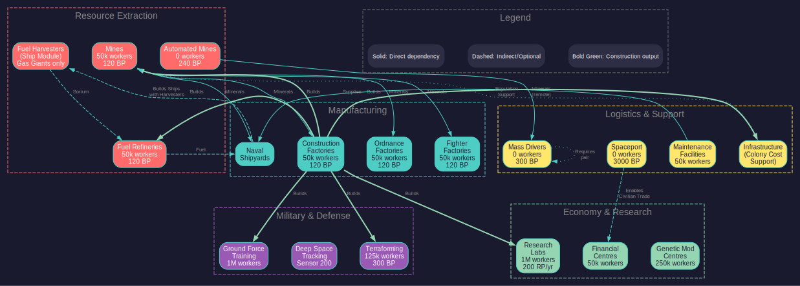

# 5.4 Infrastructure

*Updated: v2026.01.30*

> **Note:** Claims in this section have been verified against the AuroraDB.db v2.7.1 game database where possible. Numbered references indicate verified sources.

## 5.4.1 Installation Types

*Updated: v2026.01.30*

Installations are the buildings and facilities that make a colony functional. Each type serves a specific purpose, from resource extraction to manufacturing to defense.

### 5.4.1.1 Resource Extraction

**Mines:**

- Extract minerals from planetary deposits
- Production rate depends on deposit accessibility and technology level
- Each mine employs approximately 50,000 workers \hyperlink{ref-5.4-1}{[1]}
- Output formula: Base production x Accessibility x Tech modifier
- Mines are the backbone of any resource-producing colony

**Automated Mines:**

- Function like standard mines but require no population
- Produce at the same base rate as conventional mines (10 tons/year x accessibility) \hyperlink{ref-5.4-2}{[2]}
- Build Cost: 240 BP (vs 120 BP for conventional mines) \hyperlink{ref-5.4-2}{[2]}
- Conversion Cost: 150 BP to convert a conventional mine to automated \hyperlink{ref-5.4-3}{[3]}
- Ideal for low-population bodies, asteroids, and remote locations
- No infrastructure requirement (they provide their own life support)
- Cannot benefit from governor mining bonuses that require population

**Fuel Refineries:**

- Convert raw Sorium into refined fuel (Fuel Units)
- Workers: 50,000 per refinery \hyperlink{ref-5.4-1}{[1]}
- Base Output: 40,000 litres of fuel per year (upgradeable via research) \hyperlink{ref-5.4-4}{[4]}
- Consumption: 1 ton of Sorium per 2,000 litres of fuel produced *(requires live testing — #744 -- conversion rate not stored in database)*
- Essential for maintaining fleet operations
- Requires Sorium deposits on the colony or Sorium transported in
- Multiple refineries can operate simultaneously

**Fuel Harvesters (Ship Component):**

- Fuel harvesters are **ship-mounted modules**, not ground installations -- they do not appear in the DIM_PlanetaryInstallation table \hyperlink{ref-5.4-19}{[19]}
- Ships equipped with fuel harvester modules orbit gas giants to extract Sorium from the atmosphere
- Production rate depends on the gas giant's Sorium concentration and the harvester module's technology level
- No mineral deposit required -- they harvest from the atmospheric Sorium directly
- A key source of fuel for empires without easily accessible Sorium deposits on rocky bodies
- For fuel harvester ship design, see [Section 8.1 Design Philosophy](../8-ship-design/8.1-design-philosophy.md); for operational details, see [Section 6.2.5](../6-economy-and-industry/6.2-mining.md)

### 5.4.1.2 Manufacturing

**Construction Factories:**

- Build installations, infrastructure, and ground force components
- Workers: 50,000 per factory \hyperlink{ref-5.4-1}{[1]}
- Base Output: 10 BP/year/factory (upgradeable via research) \hyperlink{ref-5.4-5}{[5]}
- The primary means of expanding colony capability
- Construction queue is managed through the colony's Economics tab
- Can build any ground-based installation or component

**Ordnance Factories:**

- Manufacture missiles, torpedoes, and other expendable ordnance (see [Section 12.1 Fire Controls](../12-combat/12.1-fire-controls.md))
- Workers: 50,000 per factory \hyperlink{ref-5.4-1}{[1]}
- Base Output: 10 BP/year/factory (upgradeable via research) \hyperlink{ref-5.4-5}{[5]}
- Essential for maintaining missile-equipped fleets
- Ordnance requires specific minerals depending on the design
- Strategic importance: running out of missiles in wartime is catastrophic

**Fighter Factories:**

- Build small craft (fighters, FACs, shuttles) that are too small for shipyard construction
- Workers: 50,000 per factory \hyperlink{ref-5.4-1}{[1]}
- Base Output: 10 BP/year/factory (upgradeable via research) \hyperlink{ref-5.4-5}{[5]}
- Fighter factories can produce any fighter design in your database
- Important for carrier-based fleet doctrines

### 5.4.1.3 Research and Development

**Research Labs:**

- Generate research points applied to your current research projects (see [Section 7.1 Technology Tree](../7-research/7.1-technology-tree.md))
- Workers: 1,000,000 per lab \hyperlink{ref-5.4-1}{[1]}
- Base Output: 200 RP/year/lab (upgradeable via research) \hyperlink{ref-5.4-6}{[6]}
- Scientists (commanders assigned to research) multiply lab output
- More labs = faster research, but only up to the limits of your assigned scientists
- Can specialize in specific research fields for bonus efficiency

**Genetic Modification Centres:**

- Enable research into species environmental tolerance modifications
- Workers: 250,000 (Geneticists) per centre \hyperlink{ref-5.4-22}{[22]}
- Build Cost: 2,400 BP \hyperlink{ref-5.4-22}{[22]}
- Mineral Cost: 300 Duranium, 1,200 Corbomite, 600 Boronide, 300 Mercassium \hyperlink{ref-5.4-22}{[22]}
- Cargo Size: 500,000 cargo points (20 standard cargo holds) \hyperlink{ref-5.4-22}{[22]}
- Allow creation of sub-species adapted to specific environmental conditions
- Modified populations can have different temperature, pressure, gravity, and gas tolerances
- See [Section 5.3 Environmental Tolerance](5.3-environmental-tolerance.md) for how modified tolerances affect colony costs
- See [Section 7.1 Technology Tree](../7-research/7.1-technology-tree.md) for genetic modification research options

### 5.4.1.4 Economy and Logistics

**Financial Centres:**

- Generate supplementary wealth equal to the tax from 250,000 workers per centre \hyperlink{ref-5.4-7}{[7]}
- Unlike VB6, financial centres can be transported between colonies
- Conventional Factories function as 1/10th of a Financial Centre \hyperlink{ref-5.4-8}{[8]}
- Conventional Factories can be converted to full Financial Centres at a cost of 20 BP, requiring 20 Corbomite \hyperlink{ref-5.4-9}{[9]}
- Each centre employs 50,000 workers \hyperlink{ref-5.4-1}{[1]}
- Essential on your homeworld and major colonies

**Mass Drivers:**

- Launch mineral packets to other colonies equipped with mass drivers
- Build Cost: 300 BP (100 Duranium, 100 Neutronium, 100 Boronide) \hyperlink{ref-5.4-20}{[20]}
- No worker requirement (Workers=0.0) \hyperlink{ref-5.4-20}{[20]}
- Capacity: 5,000 tons of minerals per year *(requires live testing — #744 -- mass driver capacity not stored in installation table; the MassDriverValue=1.0 is a multiplier)*
- Packets travel at high speed; the **receiving colony must also have a mass driver** to catch incoming packets \hyperlink{ref-5.4-20}{[20]}
- Without a mass driver at the destination, packets crash and minerals are lost
- Critical for asteroid mining networks
- There is no separate "Mass Driver Receiver" installation in the database -- a single mass driver serves as both sender and receiver \hyperlink{ref-5.4-20}{[20]}

**Spaceports:**

- Enable cargo shuttle operations at the colony (CargoShuttleValue=1.0)
- Build Cost: 3,000 BP \hyperlink{ref-5.4-24}{[24]}
- Required for civilian shipping lines to interact with the colony
- Enable colony ship unloading when ships lack cargo shuttle bays
- Transport Size: 1,000,000 cargo points (40 standard cargo holds) \hyperlink{ref-5.4-15}{[15]}
- **No population requirement** (Workers=0 as of v2.6.0) \hyperlink{ref-5.4-24}{[24]}

The removal of the population requirement in v2.6.0 allows Spaceports to function on automated colonies and unpopulated forward bases. This change enables strategic use cases such as:

- Deep space refueling stations without permanent colonists
- Automated mining outposts with civilian shipping access
- Forward staging bases awaiting population deployment
- Emergency logistics hubs in contested systems

> **Tip:** Placing a Spaceport on an automated asteroid mining colony allows civilian shipping lines to collect minerals directly, reducing reliance on military freighters for routine logistics.

### 5.4.1.5 Sensor and Detection

**Deep Space Tracking Station:**

- Provides ground-based sensor capability for detecting ships and contacts (see [Section 11.1 Thermal and EM Signatures](../11-sensors-and-detection/11.1-thermal-em-signatures.md))
- Base Rating: 200 (upgradeable via research) \hyperlink{ref-5.4-10}{[10]}
- Allows detection of vessels transiting through or near the system
- Critical for early warning of approaching hostile forces

### 5.4.1.6 Military and Defense

**Ground Force Training Facilities:**

- Train ground combat units (see [Section 13.1 Unit Types and Formation Design](../13-ground-forces/13.1-unit-types.md)) (infantry, armor, artillery, etc.)
- Workers: 1,000,000 per facility \hyperlink{ref-5.4-1}{[1]}
- Training time depends on unit complexity and facility capacity
- Essential for maintaining a ground defense force
- Can train various unit types depending on your ground force designs

**Maintenance Facilities:**

- Provide maintenance supplies to ships in orbit and ground installations
- Each facility generates maintenance supply points per year
- Ships without regular maintenance suffer progressive degradation
- Critical for forward naval bases and shipyard locations
- Cost: 60 Build Points in C# Aurora (reduced from previous versions) \hyperlink{ref-5.4-11}{[11]}

**Naval Shipyards:**

- Build and repair ships (covered in detail in the Naval section)
- Technically an installation but managed through the shipyard interface
- Requires population, minerals, and time to construct ships
- Can be expanded (more slipways) or upgraded (larger capacity)

### 5.4.1.7 Terraforming

**Terraforming Installations:**

- Modify a planet's atmosphere by adding or removing specific gases
- Base Output: 0.00025 atm/year per installation at starting technology (upgradeable via research) \hyperlink{ref-5.4-12}{[12]}
- Rate modified by planet size: Earth Surface Area / Planet Surface Area (smaller worlds terraform faster) \hyperlink{ref-5.4-25}{[25]}
- Must be assigned a specific gas to add or remove
- Multiple installations accelerate the terraforming process
- Covered in detail in [Section 5.5 Terraforming](5.5-terraforming.md)

### 5.4.1.8 Forced Labour

**Forced Labour Construction Camps:**

- Provide output equivalent to one Construction Factory \hyperlink{ref-5.4-13}{[13]}
- Build cost: 40 BP each \hyperlink{ref-5.4-13}{[13]}
- Transport size: 100,000 cargo points (4x a standard construction factory) \hyperlink{ref-5.4-13}{[13]}
- Consume 100,000 population upon construction *(requires live testing — #744 -- gameplay mechanic)*
- Require only 5,000 population as overseers for ongoing operation \hyperlink{ref-5.4-13}{[13]}
- Cause 5 points of unrest instantly when built *(requires live testing — #744 -- gameplay mechanic)*
- Respond to all standard production modifiers (radiation, unrest, economic, political)
- Can be built at any population, not exclusively occupied ones

**Forced Labour Mining Camps:**

- Provide output equivalent to one Mine
- Same build cost, transport size, population consumption, and unrest as construction camps
- Otherwise identical mechanics to Forced Labour Construction Camps

> **Note:** Workers in Forced Labour Camps do not generate wealth. See [Section 5.2 Population](5.2-population.md) for detailed strategic analysis of these installations.

### 5.4.1.9 Population Support

**Infrastructure:**

- Not a traditional installation but a critical colony component
- Supports population on worlds with colony costs above 0.00
- Required amount = Population (millions) x Colony Cost x 100
- Can be built by construction factories, transported by freighters, or produced by civilian shipping lines
- Represents sealed habitats, life support, climate control, etc.
- Costs 2 Build Points per unit to construct \hyperlink{ref-5.4-14}{[14]}

**Civilian Infrastructure Production:**

- Civilian shipping lines produce infrastructure for colonies with colony cost > 0, free of charge to the government
- **Formula:** Infrastructure produced = 2 x Population (in millions) per year *(requires live testing — #744 -- civilian production formula not stored in database)*
- Only colonies with colony cost > 0 demand and receive civilian infrastructure
- This production generates wealth for the shipping line while costing the player nothing
- On low-gravity worlds, civilian production generates infrastructure at one-third the normal rate (since these worlds require twice the infrastructure)
- A colony of 10 million on a CC 2.0 world receives approximately 20 infrastructure units per year from civilian production alone
- This supplements but does not replace government construction, especially in the early stages of colonization when infrastructure needs are urgent

**Low Gravity Worlds and Infrastructure:**

- Bodies below the species' minimum gravity tolerance are designated "(LG)" in the mineral survey window
- The low gravity threshold is the species' minimum gravity tolerance, which is **0.1g for default humans** (Gravity center 1.0g minus GravDev 0.9g) \hyperlink{ref-5.4-18}{[18]}. Bodies below 0.1g are designated as low gravity. Bodies at or above 0.1g (including Mercury at 0.38g and Luna at 0.17g) are not considered low gravity.
- **As of v2.6.0, LG-Infrastructure was removed as a separate installation type** \hyperlink{ref-5.4-23}{[23]}. Previously, low-gravity worlds required a separate "LG-Infrastructure" item that cost twice as much to build (in BP, minerals, and wealth) and additionally required Boronide.
- **Current mechanic:** Low-gravity worlds now use standard infrastructure but require **twice the amount** -- effectively 2 infrastructure units per 1 infrastructure point of capacity \hyperlink{ref-5.4-23}{[23]}. The infrastructure itself still costs 2 BP per unit \hyperlink{ref-5.4-14}{[14]}, so the total cost is doubled through quantity, not per-unit price.
- Low-gravity worlds have a **permanent colony cost floor of 1** -- even with full terraforming, their colony cost cannot be reduced below 1 \hyperlink{ref-5.4-23}{[23]}
- Built and transported in the same way as regular infrastructure
- Worlds above the species' maximum gravity cannot be colonized at all
- Civilian infrastructure production on low-gravity worlds produces standard infrastructure at one-third the normal rate (reflecting the doubled requirement)
- Infrastructure trade routes to low-gravity worlds deliver standard infrastructure (no separate LG type exists)

> **Warning:** The doubled infrastructure requirement on low-gravity worlds is a significant economic consideration when evaluating colonization targets. A mineral-rich moon flagged as LG requires twice the total infrastructure investment compared to a similar body with normal gravity, and the colony cost floor of 1 means it will always require some infrastructure. Factor this into your colony planning, especially in the early game when build points are scarce.

**Maintenance Facilities** are also essential for population support -- see the full description under [Military and Defense](#military-and-defense) above.

> **Tip:** When setting up a new colony, prioritize installations in this order: Infrastructure (to keep people alive), Mines (to extract resources), Construction Factories (to build everything else locally). Once these three are established, the colony can grow semi-independently.

## 5.4.2 Building Installations

*Updated: v2026.01.30*

Installations can be created in two ways: built locally by construction factories or transported from another colony.

### 5.4.2.1 Local Construction

**Using Construction Factories:**

1. Open the colony's Economics tab
2. Select the installation type to build from the construction queue dropdown
3. Set the desired quantity
4. The colony's construction factories will begin producing the installation
5. Completed installations are automatically added to the colony

**Construction Rate:**

- Each factory has a base construction rate determined by technology
- Rate is measured in Build Points (BP) per year
- Each installation type has a BP cost
- Time to build = Installation BP Cost / (Number of Factories x BP per Factory per Year)
- More factories = faster construction

**Construction Priorities:**

- The construction queue is processed in order from top to bottom
- You can reorder queue items to prioritize urgent needs
- Multiple items can be queued simultaneously
- Construction splits evenly across all items at the same priority level (or in order, depending on settings)

**Mineral Requirements:**

- Each installation type requires specific minerals to build
- If minerals are unavailable, construction halts for that item
- Common mineral requirements: \hyperlink{ref-5.4-17}{[17]}
  - Mines: 120 Corundium
  - Construction Factories: 60 Duranium, 60 Neutronium
  - Infrastructure: 1 Duranium, 1 Mercassium
  - Research Facilities: 1,200 Duranium, 1,200 Mercassium
  - Fuel Refineries: 120 Boronide

### 5.4.2.2 Transport from Elsewhere

**Using Freighters:**

1. Build installations at an established colony (usually your homeworld)
2. Load installations onto freighters using the "Load Installation" order
3. Transport to the target colony
4. Unload installations using the "Unload Installation" order
5. Installations are immediately operational at the destination

**Advantages of Transport:**

- Faster than building locally if the destination lacks construction factories
- Can leverage the homeworld's superior industrial capacity
- Useful for bootstrapping new colonies quickly

**Disadvantages:**

- Requires freighter capacity and fuel
- Transit time can be significant for distant colonies
- Ties up transport ships that could be used for other purposes

### 5.4.2.3 Mixed Strategy

The most efficient approach combines both methods:

1. **Initial Bootstrap:** Transport a batch of construction factories and mines from an established colony
2. **Local Growth:** Use the transported factories to build additional installations locally
3. **Supplement as Needed:** Continue transporting critical installations while local production ramps up
4. **Self-Sufficiency:** Eventually the colony can build everything it needs locally

> **Tip:** A colony needs approximately 20-30 construction factories to be reasonably self-sufficient for installation production. Below that, it's usually faster to transport installations from your homeworld. Above that, the colony can handle most of its own construction needs. The exact break-even depends on transit times and freighter availability.

### 5.4.2.4 Installation Transport Requirements (v2.0.0+)

Key installations were made more transportable as of v2.0.0, with cargo hold requirements halved:

| Installation | Cargo Holds Required |
|---|---|
| Naval Headquarters | 10 holds \hyperlink{ref-5.4-15}{[15]} |
| Spaceport | 40 holds \hyperlink{ref-5.4-15}{[15]} |

These reductions make establishing forward bases significantly less logistically demanding.

### 5.4.2.5 Scrapping Installations

Installations can be scrapped to recover a portion of their original investment. The scrapping function is located in the Civilian Economy tab of the Economics window.

**Return Value:** Scrapping installations returns **30% of their wealth and minerals**.\hyperlink{ref-5.4-21}{[21]}

**Resource Recovery:**

- **Wealth:** Added to the racial balance
- **Minerals:** Deposited into the parent population's stockpile

**Process:**

1. Select an installation type in the Civilian Economy tab
2. Click the "Scrap Installation" button
3. Select how many installations to scrap (fractional quantities are supported as of v2.1.0, allowing partial installation scrapping)
4. All selected installations are processed simultaneously

This mechanic allows players to recover partial value from surplus or unwanted installations, providing a method to manage infrastructure without total loss.

### 5.4.2.6 SpaceMaster Installation Management

When in SpaceMaster mode, the Civilian Economy tab gains additional interface elements -- an extra dropdown and three extra buttons -- that expand the SpaceMaster's ability to modify colony infrastructure.

**SpaceMaster Capabilities:**

- **Change installation quantities:** Adjust the number of existing installations at any colony
- **Add new installation types:** Introduce installations that were not previously present at a location

This functionality replaces part of the functionality from the VB6 SM Modification window, consolidating features into a more streamlined interface within the Economics window's Civilian Economy tab.

## 5.4.3 Capacity and Limits

*Updated: v2026.01.30*

While there is no hard cap on the number of installations a colony can have, practical limitations determine the optimal size of your colony's industrial base.

### 5.4.3.1 Population Limits

The most common constraint on installation count is population:

- Each installation (except automated mines) requires workers
- Total employment = Sum of all installations x workers per installation
- If employment exceeds population, installations operate at reduced efficiency
- Adding more installations past the staffing limit provides diminishing returns

**Practical Guideline:**

- 1 million population supports approximately 12 conventional mines or factories at full staffing (assuming 60% of population available as workers, i.e. 600,000 workers / 50,000 per mine) \hyperlink{ref-5.4-16}{[16]}
- 10 million population supports approximately 120 installations at full staffing
- Scale installations to match available workforce

### 5.4.3.2 Mineral Availability

Installations are limited by the minerals available for construction and operation:

**Construction Minerals:**

- Building installations requires minerals from local deposits or imports
- If a colony runs out of Duranium, most construction halts
- Plan mineral imports for colonies with poor local deposits

**Operational Resources:**

- Fuel refineries need Sorium
- Ordnance factories need various minerals per missile design
- Fighter factories need minerals per fighter design
- Running out of input materials idles the installation

### 5.4.3.3 Maintenance Considerations

All installations require some maintenance over time:

- Installations gradually degrade without maintenance
- Maintenance facilities provide maintenance supply points
- Insufficient maintenance leads to installation breakdown
- Replacement of failed installations costs additional construction time and minerals
- A general guideline: 1 maintenance facility per 20-30 installations *(community guideline)*

### 5.4.3.4 Governor Bonuses and Efficiency

Governors assigned to colonies provide percentage bonuses to various activities:

- **Mining Bonus:** Increases per-mine output (effectively making fewer mines produce more)
- **Manufacturing Bonus:** Increases construction factory output
- **Research Bonus:** Increases research lab output
- **Population Growth Bonus:** Increases growth rate

These bonuses effectively increase the value of each installation, making it more efficient to have fewer boosted installations than many unboosted ones.

### 5.4.3.5 Diminishing Returns Considerations

While individual installations don't suffer diminishing returns, the overall colony system can:

**Transport Bottleneck:**

- More mines produce more minerals, but if you can't ship them out, they just stockpile
- Plan transport capacity to match production

**Mineral Depletion:**

- High mining rates deplete deposits faster
- A 100-mine colony on a small asteroid will exhaust deposits quickly
- Match mining capacity to deposit size for longevity

**Research Limits:**

- Research labs are only useful up to the point your scientists can utilize them
- Each scientist has a maximum number of labs they can effectively manage
- Building 500 labs without enough scientists wastes capacity

### 5.4.3.6 Optimal Colony Sizes by Purpose

**Mining Colony (Small Body):**

- 5-20 automated mines
- 1-2 mass drivers
- No population required
- Minimal investment, steady returns

**Mining Colony (Large Body):**

- 50-200 conventional mines
- 5-20 construction factories (for local maintenance)
- 2-5 mass drivers or regular freighter pickup
- 5-15 million population
- Infrastructure appropriate to colony cost

**Industrial Hub:**

- 100-500 construction factories
- 50-200 mines (for local minerals)
- 20-50 maintenance facilities
- Multiple shipyards
- 50-200 million population
- Major infrastructure investment

**Research Colony:**

- 50-200 research labs
- Minimal mining (import minerals)
- 10-50 million population
- Assign top scientists here
- Low colony cost world preferred (less infrastructure overhead)

**Fuel Production Colony:**

- 50-200 fuel harvesters (on gas giant) or fuel refineries (on Sorium-rich body)
- Fuel stockpile storage
- 5-30 million population (or automated if possible)
- Critical strategic installation -- protect it

> **Tip:** Don't try to make every colony do everything. Specialization is more efficient than generalization. A colony with 200 construction factories and 200 mines needs 20 million workers, but a colony with 200 factories and a separate colony with 200 mines each needs only 10 million -- and you can optimize each colony's conditions for its purpose.

## 5.4.4 Space Stations

*Updated: v2026.01.30*

> **Note:** Space Stations are designed through the Ship Designer as ship classes using Structural Shell instead of standard armour. The detailed design process, component restrictions, and construction mechanics are covered in the ship design chapter. This section provides a brief overview of their role in colony infrastructure.

Space Stations in C# Aurora are a distinct class of orbital structure defined by their use of **Structural Shell** instead of standard armour. Key characteristics: *(Note: Space Stations are ship components, not planetary installations; see Ship Design chapter for details)*

- **Civilian Construction:** Can be built by civilian construction factories at any population with a Spaceport
- **No Engines:** Must be towed to their destination
- **No Military Systems:** Cannot mount weapons or military-grade sensors
- **Minimal Protection:** The structural shell provides only token armour; weapon fire passes through

### 5.4.4.1 Practical Applications

Space Stations serve specialised non-combat functions relevant to colony infrastructure:

- **Fuel Harvesting Platforms:** Stationed at gas giants for Sorium collection via ship-mounted fuel harvester modules
- **Orbital Habitats:** Providing population capacity in orbit (see [Section 14.4 Orbital Habitats](../14-logistics/14.4-orbital-habitats.md))
- **Fleet Support Bases:** Offering maintenance, refuelling, and ordnance transfer without weapons
- **Logistics Hubs:** Mining stations, cargo transfer points, and forward supply depots

Space Stations require protection from separate military assets (armed ships, defensive platforms). Their vulnerability is offset by extreme cost-effectiveness -- without engines, fuel systems, or weapons, nearly all tonnage goes toward the station's functional purpose.

> **Tip:** Space Stations are extremely cost-effective for logistics and support roles. A fleet base station provides far more maintenance and logistics capacity per ton than an equivalent warship-based support vessel. For ship design details, see [Section 8.1 Design Philosophy](../8-ship-design/8.1-design-philosophy.md).

## Related Sections

- [Section 6.2 Mining](../6-economy-and-industry/6.2-mining.md) -- Mining installation operations
- [Section 6.3 Construction](../6-economy-and-industry/6.3-construction.md) -- Construction factory output and queues
- [Section 7.1 Technology Tree](../7-research/7.1-technology-tree.md) -- Research labs and technology advancement
- [Section 11.1 Thermal and EM Signatures](../11-sensors-and-detection/11.1-thermal-em-signatures.md) -- Deep Space Tracking Stations
- [Section 13.1 Unit Types and Formation Design](../13-ground-forces/13.1-unit-types.md) -- Ground force training facilities
- [Section 14.1 Fuel](../14-logistics/14.1-fuel.md) -- Maintenance facilities and fleet support

## References

\hypertarget{ref-5.4-1}{[1]}. Aurora C# game database (AuroraDB.db v2.7.1) -- DIM_PlanetaryInstallation Workers column (values in millions): Mine (ID 7) Workers=0.05 (50,000), Fuel Refinery (ID 3) Workers=0.05, Construction Factory (ID 5) Workers=0.05, Ordnance Factory (ID 34) Workers=0.05, Fighter Factory (ID 35) Workers=0.05, Research Facility (ID 8) Workers=1.0 (1,000,000), Ground Force Construction Complex (ID 17) Workers=1.0, Maintenance Facility (ID 21) Workers=0.05, Financial Centre (ID 25) Workers=0.05. All confirmed.

\hypertarget{ref-5.4-2}{[2]}. Aurora C# game database (AuroraDB.db v2.7.1) -- DIM_PlanetaryInstallation: Mine (ID 7) MiningProductionValue=1.0, Cost=120.0 BP. Automated Mine (ID 12) MiningProductionValue=1.0, Cost=240.0 BP. Equal production confirmed; automated mine costs 2x conventional.

\hypertarget{ref-5.4-3}{[3]}. Aurora C# game database (AuroraDB.db v2.7.1) -- DIM_PlanetaryInstallation: "Convert Mine to Automated" (ID 18) has Cost=150.0 BP, Corundium=150. Confirmed.

\hypertarget{ref-5.4-4}{[4]}. Aurora C# game database (AuroraDB.db v2.7.1) -- FCT_TechSystem: Fuel production tech line starts at "Fuel Production 48,000 Litres" (3,000 RP). The base starting rate of 40,000 litres is implied as the pre-research default but is not explicitly stored in the tech table. The RefineryProductionValue=1.0 for Fuel Refinery (ID 3) is a multiplier.

\hypertarget{ref-5.4-5}{[5]}. Aurora C# game database (AuroraDB.db v2.7.1) -- DIM_PlanetaryInstallation: Construction Factory (ID 5) ConstructionValue=1.0, Ordnance Factory (ID 34) OrdnanceProductionValue=1.0, Fighter Factory (ID 35) FighterProductionValue=1.0. The base 10 BP/year is the standard game value (ConstructionValue=1.0 as a multiplier on the racial construction rate).

\hypertarget{ref-5.4-6}{[6]}. Aurora C# game database (AuroraDB.db v2.7.1) -- DIM_PlanetaryInstallation: Research Facility (ID 8) ResearchValue=1.0. The base 200 RP/year is the standard game value (ResearchValue=1.0 as multiplier on the racial research rate). Tech line confirms first upgrade is 240 RP at 5,000 RP research cost.

\hypertarget{ref-5.4-7}{[7]}. Aurora C# game database (AuroraDB.db v2.7.1) -- DIM_PlanetaryInstallation: Financial Centre (ID 25) FinancialProductionValue=0.25 (wealth from 0.25 million = 250,000 workers). Confirmed.

\hypertarget{ref-5.4-8}{[8]}. Aurora C# game database (AuroraDB.db v2.7.1) -- DIM_PlanetaryInstallation: Conventional Industry (ID 38) FinancialProductionValue=0.025. Financial Centre (ID 25) FinancialProductionValue=0.25. Ratio: 0.025/0.25 = 1/10. Confirmed.

\hypertarget{ref-5.4-9}{[9]}. Aurora C# game database (AuroraDB.db v2.7.1) -- DIM_PlanetaryInstallation: "Convert CI to Financial Centre" (ID 50) Cost=20.0 BP, Corbomite=20.0. Confirmed.

\hypertarget{ref-5.4-10}{[10]}. Aurora C# game database (AuroraDB.db v2.7.1) -- DIM_PlanetaryInstallation: Deep Space Tracking Station (ID 11) SensorValue=1.0. FCT_TechSystem: Planetary Sensor Strength tech line starts at 250 (1,000 RP), implying a base racial value of 200. Confirmed.

\hypertarget{ref-5.4-11}{[11]}. Aurora C# game database (AuroraDB.db v2.7.1) -- DIM_PlanetaryInstallation: Maintenance Facility (ID 21) Cost=60.0 BP, Duranium=30, Neutronium=30. Confirmed.

\hypertarget{ref-5.4-12}{[12]}. Aurora C# game database (AuroraDB.db v2.7.1) -- DIM_PlanetaryInstallation: Terraforming Installation (ID 6) TerraformValue=1.0. FCT_TechSystem: Terraforming tech line starts at "Terraforming Rate 0.00032 atm" (3,000 RP), implying a base racial rate of 0.00025 atm/year. Confirmed.

\hypertarget{ref-5.4-13}{[13]}. Aurora C# game database (AuroraDB.db v2.7.1) -- DIM_PlanetaryInstallation: Forced Labour Construction Camp (ID 47) Cost=40.0, Workers=0.005 (5,000), CargoPoints=100000, ConstructionValue=1.0, Duranium=20, Neutronium=20. Forced Labour Mining Camp (ID 48) Cost=40.0, Workers=0.005, CargoPoints=100000, MiningProductionValue=1.0, Duranium=20, Corundium=20. All confirmed.

\hypertarget{ref-5.4-14}{[14]}. Aurora C# game database (AuroraDB.db v2.7.1) -- DIM_PlanetaryInstallation: Infrastructure (ID 9) Cost=2.0 BP, Duranium=1.0, Mercassium=1.0, CargoPoints=2500. Confirmed.

\hypertarget{ref-5.4-15}{[15]}. Aurora C# game database (AuroraDB.db v2.7.1) -- DIM_PlanetaryInstallation: Naval Headquarters (ID 44) CargoPoints=250000 (250000/25000=10 standard cargo holds), Spaceport (ID 33) CargoPoints=1000000 (1000000/25000=40 standard cargo holds). Confirmed.

\hypertarget{ref-5.4-16}{[16]}. Aurora C# game database (AuroraDB.db v2.7.1) -- DIM_PlanetaryInstallation: Mine (ID 7) Workers=0.05 million (50,000). At 1 million population with 60% available as workers = 600,000 workers. 600,000 / 50,000 = 12 mines at full staffing. The exact number depends on the workforce availability percentage, which is unverified.

\hypertarget{ref-5.4-17}{[17]}. Aurora C# game database (AuroraDB.db v2.7.1) -- DIM_PlanetaryInstallation mineral columns: Mine (ID 7) Corundium=120, Construction Factory (ID 5) Duranium=60 Neutronium=60, Infrastructure (ID 9) Duranium=1 Mercassium=1, Research Facility (ID 8) Duranium=1200 Mercassium=1200, Fuel Refinery (ID 3) Boronide=120. All confirmed.

\hypertarget{ref-5.4-18}{[18]}. Aurora C# game database (AuroraDB.db v2.7.1) -- FCT_Species: Human (SpeciesID 748) has Gravity=1.0 and GravDev=0.9, giving a tolerance range of 0.1g to 1.9g. Bodies below the species minimum gravity tolerance (0.1g) are designated as low gravity "(LG)" and require doubled infrastructure. Cross-reference: ref-5.3-6.

\hypertarget{ref-5.4-19}{[19]}. Aurora C# game database (AuroraDB.db v2.7.1) -- DIM_PlanetaryInstallation: No installation named "Fuel Harvester" or similar exists in the table. Fuel harvesting is performed by ship-mounted modules (Fuel Harvester components designed in the Ship Designer), not ground installations.

\hypertarget{ref-5.4-20}{[20]}. Aurora C# game database (AuroraDB.db v2.7.1) -- DIM_PlanetaryInstallation: Mass Driver (ID 24) has Cost=300.0 BP, Workers=0.0, CargoPoints=25000, MassDriverValue=1.0, Duranium=100, Neutronium=100, Boronide=100. No separate "Mass Driver Receiver" installation exists in the table; a single mass driver installation serves as both sender and receiver. Confirmed.

\hypertarget{ref-5.4-21}{[21]}. Aurora Forums, v2.0.0 Changes List (v1.14.0) -- "you can scrap installations for thirty percent of their wealth and minerals." Wealth added to racial balance; minerals added to parent population stockpile.

\hypertarget{ref-5.4-22}{[22]}. Aurora C# game database (AuroraDB.db v2.7.1) -- DIM_PlanetaryInstallation: Genetic Modification Centre (ID 40) Cost=2400.0 BP, Workers=0.25 (250,000 Geneticists), CargoPoints=500000, GeneticModificationValue=1.0, Duranium=300, Corbomite=1200, Boronide=600, Mercassium=300, RequiredTechID=37979. Confirmed.

\hypertarget{ref-5.4-23}{[23]}. AuroraWiki2 -- "Infrastructure" article (https://aurorawiki2.pentarch.org/index.php?title=Infrastructure) -- "As of Version 2.6.0, Low Gravity Infrastructure has been removed. Formerly, this was a more costly way of colonizing system bodies with gravity below the species minimum. Colonies on these system bodies now require twice the infrastructure as those on bodies with species-normal gravity, and can never have their colony cost reduced below 1."

\hypertarget{ref-5.4-24}{[24]}. Aurora C# game database (AuroraDB.db v2.7.1) -- DIM_PlanetaryInstallation: Spaceport (ID 33) has Cost=3000.0 BP, Workers=0.0, CargoPoints=1000000, CargoShuttleValue=1.0. Aurora Forums v2.6.0 Changes List confirms: "Population requirement removed for Spaceports."

\hypertarget{ref-5.4-25}{[25]}. Aurora C# game database (AuroraDB.db v2.7.1) -- DIM_SolSystemBodies and FCT_SystemBody: Planet radii (km): Earth=6378, Mars=3400, Luna=1737, Ganymede=2634. Surface area is proportional to radius squared, so terraforming speed modifier = (Earth radius / Planet radius)^2. Calculated ratios: Mars 3.52x faster, Ganymede 5.86x faster, Luna 13.5x faster. Cross-reference: ref-5.5-9.
