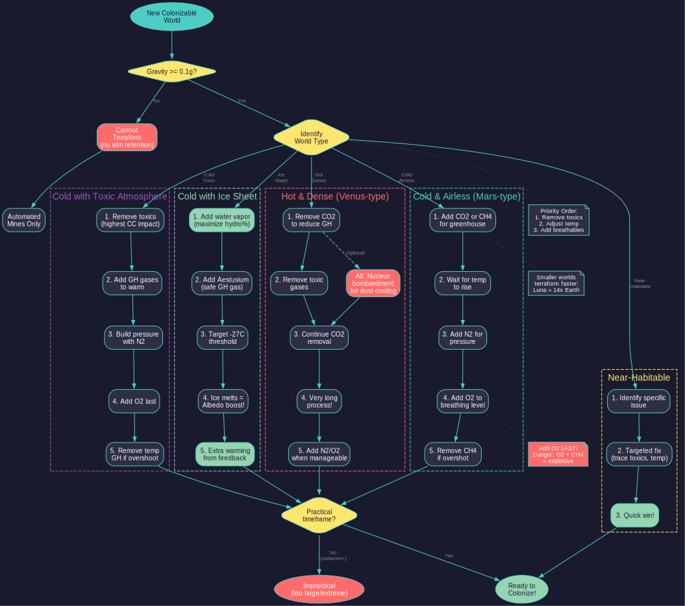

# 5.5 Terraforming

*Updated: v2026.01.30*

> **Note:** Claims in this section have been verified against the AuroraDB.db v2.7.1 game database where possible. Numbered references indicate verified sources.

## 5.5.1 Terraforming Installations

*Updated: v2026.01.30*

Terraforming is the process of modifying a planet's atmosphere to make it more suitable for human habitation. In Aurora C#, this is accomplished through two types of terraforming installations: ground-based installations and space-based terraforming modules.

### 5.5.1.1 Ground-Based Terraforming Installations

**Basic Mechanics:**

- Each terraforming installation processes a fixed amount of atmospheric gas per year
- Installations can either add gas to the atmosphere or remove gas from it
- Each installation is assigned to work on one specific gas at a time
- The rate of atmospheric change depends on the number of installations and the planet's surface area

**Specifications:**

- Size: 50,000 tons (2x the standard installation size of 25,000 tons) \hyperlink{ref-5.5-1}{[1]}
- Worker Requirement: 125,000 workers per installation (0.125 million) \hyperlink{ref-5.5-1}{[1]}
- Base Output: 0.00025 atm/year per installation at starting technology (upgradeable via research) \hyperlink{ref-5.5-2}{[2]}
- Mineral Cost: 150 Duranium + 150 Boronide (300 BP total) \hyperlink{ref-5.5-1}{[1]}

**Installation Assignment:**

1. Build or transport terraforming installations to the target colony
2. Open the colony's Environment tab in the Economics window
3. The Environment tab displays the current atmospheric composition, including partial pressures of each gas present
4. Select the gas to add or remove from the dropdown menu -- the dropdown lists both "Add [Gas]" and "Remove [Gas]" entries for each available gas type
5. Set the number of installations to assign to that task using the quantity field
6. Click "Assign" to begin processing -- installations start working immediately
7. To reassign installations to a different gas, change the dropdown selection and quantity, then click Assign again; installations can be reassigned at any time without delay *(requires live testing — #748 of reassignment delay mechanics)*
8. Installations can be split across multiple gases simultaneously by assigning different quantities to different gas operations in separate assignments *(requires live testing — #748 of multi-gas assignment)*
9. Monitor progress by checking the atmospheric composition values on the Environment tab, which update as terraforming proceeds

> **Note:** Ship-based terraforming modules are assigned their target gas through fleet orders rather than the colony Environment tab. The ship must be in orbit around the target body and given a terraforming order specifying which gas to add or remove. *(requires live testing — #748 of ship-based terraforming fleet orders)*

### 5.5.1.2 Space-Based Terraforming Modules

An alternative to ground-based installations, space-based terraforming modules are mounted on ships or orbital platforms:

- Cost: 500 Build Points per module (100 HS size, requires 250 Duranium + 250 Boronide) \hyperlink{ref-5.5-8}{[8]}
- No population requirement (operated by ship/station crew)
- Smaller transport footprint than ground-based installations
- Designed as ship components in the Ship Designer (see [Section 8.1 Design Philosophy](../8-ship-design/8.1-design-philosophy.md))
- Can be deployed to any body without needing a colony present

Space-based modules require no population to operate and can be deployed to any body, making them highly flexible. Ground-based installations require a colony with sufficient population but have lower mineral costs.

### 5.5.1.3 Technology and Rates

**Terraforming Technology Line:**

- Starting racial rate: 0.00025 atm per year per installation \hyperlink{ref-5.5-2}{[2]}
- First researched level: 0.00032 atm/year (3,000 RP), progressing up to 0.00375 atm/year at the highest tech (5,000,000 RP) \hyperlink{ref-5.5-3}{[3]}
- The technology line is upgradeable through research (see [Section 7.1 Technology Tree](../7-research/7.1-technology-tree.md) and [Appendix A](../appendices/A-formulas.md) for full rate table)

**Speed Modifier (Planet Size Factor):**

- Smaller worlds terraform significantly faster using the modifier: Earth Surface Area / Planet Surface Area \hyperlink{ref-5.5-9}{[9]}
- Mars terraforms approximately 3.5x faster than Earth (ratio: 6378²/3400² = 3.52) \hyperlink{ref-5.5-9}{[9]}
- Ganymede terraforms approximately 6x faster than Earth (ratio: 6378²/2634² = 5.86) \hyperlink{ref-5.5-9}{[9]}
- Luna terraforms approximately 14x faster than Earth (ratio: 6378²/1737² = 13.5) \hyperlink{ref-5.5-9}{[9]}
- This makes small bodies dramatically more practical terraforming targets

**Gravity Constraint:**

- Bodies with gravity below 0.1g cannot retain atmosphere and therefore cannot be terraformed

### 5.5.1.4 Rate of Change

- Base rate is determined by terraforming technology level
- Rate is modified by the planet size factor (smaller = faster)
- The rate is expressed in atm of partial pressure change per year per installation
- Multiple installations multiply the rate linearly
- As of v2.3.1, gas amount calculations correctly account for surface gravity, ensuring that low-gravity worlds require proportionally less gas to achieve the same atmospheric pressure

> **Tip:** When choosing terraforming targets, prefer smaller worlds. A Mars-sized body terraforms 3.5x faster than Earth, and Luna at nearly 14x faster. A handful of installations on a small moon can achieve in years what would take decades on an Earth-sized world. Factor planet size into your terraforming priority decisions.

### 5.5.1.5 Surface Temperature Formula

The surface temperature formula and its components (Greenhouse Factor, Anti-Greenhouse Factor, and Albedo) are defined in [Section 5.3.4 Greenhouse Gases and Surface Temperature](5.3-environment.md). The key points for terraforming are:

- **Greenhouse gases** (CO2, Methane, NO2, SO2, and Aestusium) increase temperature by raising the Greenhouse Factor \hyperlink{ref-5.5-6}{[6]}
- **Anti-greenhouse gases** (Frigusium) and atmospheric dust reduce temperature by raising the Anti-Greenhouse Factor
- Both factors are capped at a maximum of 3.0, limiting the range of temperature modification possible through atmospheric manipulation
- **Albedo** from surface water provides a minor temperature effect: 0.0015 x Hydro Extent %, to a maximum increase of 0.15 *(requires live testing — #748 -- game engine constant, not stored in database)*

Understanding these mechanics is critical for planning temperature adjustments through atmospheric manipulation.

### 5.5.1.6 Dangerous Gas Thresholds

Certain gases become dangerous to colonists above specific concentration thresholds. The presence of dangerous gases at or above these levels adds to the colony cost:

| Gas | Dangerous Level | Colony Cost Impact |
|-----|-----------------|-------------------|
| Hydrogen (H2) | 500 ppm | Colony Cost +2.0 \hyperlink{ref-5.5-7}{[7]} |
| Methane (CH4) | 500 ppm | Colony Cost +2.0 \hyperlink{ref-5.5-7}{[7]} |
| Oxygen (O2) | 500 ppm; also below 0.1 atm or above 30% of atmosphere | Colony Cost +2.0 \hyperlink{ref-5.5-7}{[7]} |
| Carbon Dioxide (CO2) | 5,000 ppm | Colony Cost +2.0 \hyperlink{ref-5.5-7}{[7]} |
| Ammonia (NH3) | 50 ppm | Colony Cost +2.0 \hyperlink{ref-5.5-7}{[7]} |
| Carbon Monoxide (CO) | 50 ppm | Colony Cost +2.0 \hyperlink{ref-5.5-7}{[7]} |
| Hydrogen Sulphide (H2S) | 20 ppm | Colony Cost +2.0 \hyperlink{ref-5.5-7}{[7]} |
| Nitrogen Oxide (NO) | 5 ppm | Colony Cost +2.0 \hyperlink{ref-5.5-7}{[7]} |
| Nitrogen Dioxide (NO2) | 5 ppm | Colony Cost +2.0 \hyperlink{ref-5.5-7}{[7]} |
| Sulphur Dioxide (SO2) | 5 ppm | Colony Cost +2.0 \hyperlink{ref-5.5-7}{[7]} |
| Chlorine (Cl) | 1 ppm | Colony Cost +3.0 \hyperlink{ref-5.5-7}{[7]} |
| Fluorine (F) | 1 ppm | Colony Cost +3.0 \hyperlink{ref-5.5-7}{[7]} |
| Bromine (Br) | 1 ppm | Colony Cost +3.0 \hyperlink{ref-5.5-7}{[7]} |
| Iodine (I) | 1 ppm | Colony Cost +2.0 \hyperlink{ref-5.5-7}{[7]} |

These thresholds determine the priority order for gas removal during terraforming. Halogens (Chlorine, Fluorine, Bromine) at 1 ppm have the highest colony cost penalties (+3.0), making them the highest priority targets. Gases with very low thresholds (such as NO, NO2, SO2 at 5 ppm) are also difficult to fully remove.

### 5.5.1.7 Hydrosphere Effects

The presence or absence of surface water (Hydro Extent) affects habitability:

**Water Vapor Dynamics:**

- Water vapor condenses at a rate of 0.1 atm per year, increasing Hydro Extent *(requires live testing — #748 -- game engine constant, not stored in database)*
- Equilibrium water vapor pressure: Atmospheric Pressure x (Hydro Extent / 100) x 0.01 atm *(requires live testing — #748 -- game engine constant, not stored in database)*
- Water vapor can be added intentionally through terraforming installations

**Low Hydrosphere Penalty (below 20%):**

- Worlds with Hydro Extent below 20% receive up to a Colony Cost +2.0 penalty
- The penalty scales linearly from 0% to 20% (e.g., 10% Hydro = CC +1.0)

**High Hydrosphere Penalty (above 75%):**

- Worlds with Hydro Extent above 75% suffer population capacity loss
- The capacity loss scales from 75% Hydro up to 99% capacity loss at 100% Hydro Extent
- This represents the lack of available land area for colonisation

## 5.5.2 Gas Addition and Removal

*Updated: v2026.01.30*

The core of terraforming is manipulating specific gases in the atmosphere. Understanding which gases to add or remove and in what order is critical for efficient terraforming.

### 5.5.2.1 Gases You Can Add

**Oxygen (O2):**

- Required for breathable atmosphere (0.1-0.3 atm partial pressure, maximum 30% of total atmosphere)
- Usually one of the last gases added to avoid creating a toxic or flammable mix with existing gases
- Adding O2 to a methane-rich atmosphere creates an explosive hazard

**Nitrogen (N2):**

- The primary filler gas in a breathable atmosphere
- Inert and non-toxic at any concentration (Dangerous=0 in game database) \hyperlink{ref-5.5-5}{[5]}
- Used to bring total atmospheric pressure up to breathable levels
- Safe to add in large quantities

**Carbon Dioxide (CO2):**

- Powerful greenhouse gas
- Adding CO2 raises surface temperature through greenhouse effect
- Useful for warming cold worlds
- Must be kept below toxic levels (5,000 ppm / 0.005 atm) for breathability \hyperlink{ref-5.5-4}{[4]}
- Can be added to warm a planet, then removed once temperature is adequate

**Water Vapor (H2O):**

- Contributes to hydrosphere development but is **not** classified as a greenhouse gas in the game database (GHGas=0) \hyperlink{ref-5.5-6}{[6]}
- Adding water vapor may create surface water but does not directly contribute to the Greenhouse Factor
- Water vapor condenses at a rate of 0.1 atm per year, increasing Hydro Extent (surface water coverage) *(requires live testing — #748 -- game engine constant, not stored in database)*
- Equilibrium water vapor pressure: Atmospheric Pressure x (Hydro Extent / 100) x 0.01 atm *(requires live testing — #748 -- game engine constant, not stored in database)*
- Important for long-term habitability and reducing the hydrosphere colony cost factor
- Can be intentionally added like other atmospheric gases for strategic terraforming

**Methane (CH4):**

- Very potent greenhouse gas (more effective per molecule than CO2)
- Useful for rapid warming of very cold worlds
- Toxic and must be removed before the atmosphere becomes breathable
- Often used as a temporary warming agent

**Aestusium:**

- A synthetic greenhouse gas designed specifically for terraforming
- Adds to the Greenhouse Factor, raising surface temperature
- Non-toxic at any concentration -- can be added freely without creating a dangerous atmosphere
- Allows precise temperature increases without the risks associated with CO2 or CH4
- Ideal for warming cold worlds where you want to avoid introducing gases that must later be removed

**Frigusium:**

- A synthetic anti-greenhouse gas designed specifically for terraforming
- Adds to the Anti-Greenhouse Factor, lowering surface temperature
- Non-toxic at any concentration -- can be added freely without creating a dangerous atmosphere
- Allows precise temperature decreases without side effects
- Ideal for cooling hot worlds without needing to remove existing atmospheric gases first

> **Tip:** Aestusium and Frigusium are the safest tools for temperature adjustment. Unlike CO2 or Methane (which are toxic above certain thresholds), these synthetic gases can be added in any quantity without affecting colony cost. Use them for fine-tuning temperature once toxic gases have been dealt with, or as your primary temperature control from the start if you want to avoid multi-phase gas swaps.

### 5.5.2.2 Gases You Can Remove

**Carbon Dioxide (CO2):**

- Remove to reduce greenhouse warming on too-hot worlds
- Remove to bring below the dangerous gas threshold (5,000 ppm / 0.5% of atmosphere)
- In C# Aurora, CO2 is classified as a dangerous gas for oxygen-breathing species
- Common first step on Venus-type worlds

**Methane (CH4):**

- Remove after using it for greenhouse warming
- Dangerous above 500 ppm -- must be removed for breathability \hyperlink{ref-5.5-4}{[4]}
- Can be removed relatively quickly from thin atmospheres

**Toxic Gases (Cl2, F2, SO2, NO2, CO, H2S, NH3):**

- Must be completely removed for a breathable atmosphere
- Each type adds to colony cost while present
- Priority removal targets due to their direct impact on colony cost
- Some toxic gases are present in only trace amounts but still cause significant cost

**Excess Oxygen:**

- If O2 partial pressure exceeds 0.3 atm, it becomes toxic
- Remove excess oxygen to bring levels into the breathable range
- This can happen on worlds with natural oxygen-rich atmospheres

**Hydrogen (H2) and Helium (He):**

- Remove to reduce total atmospheric pressure
- These light gases contribute to pressure but serve no useful purpose for habitability
- Removing them can take a very long time on large worlds

### 5.5.2.3 Terraforming Strategies by World Type

**Cold, Airless World (e.g., Mars-type):**

1. Add CO2 or CH4 for greenhouse warming
2. Wait for temperature to rise toward habitable range
3. Add N2 to build atmospheric pressure
4. Add O2 to breathable levels
5. Remove greenhouse gases (CH4) if temperature overshoots
6. Fine-tune gas levels for ideal breathability

**Hot, Dense Atmosphere (e.g., Venus-type):**

1. Remove CO2 to reduce greenhouse effect and cool the planet
2. Remove toxic gases if present
3. Continue removing CO2 until temperature drops to habitable range
4. This can take a very long time due to the massive atmospheric volume
5. Add N2 and O2 once pressure and temperature are manageable

**Cold World with Toxic Atmosphere:**

1. Remove toxic gases first (highest colony cost impact)
2. Add greenhouse gases (CO2, CH4) to warm the planet
3. Build pressure with N2 if needed
4. Add O2 last
5. Remove temporary greenhouse gases if temperature overshoots

**Cold World with Ice Sheet (Albedo Optimization):**

On very cold worlds with existing ice sheets, exploit the ice melt feedback loop for bonus warming *(unverified — [#850](https://github.com/ErikEvenson/aurora-manual/issues/850), forum-derived strategy)*:

1. Add water vapor first to maximize hydro extent (aim for 75%+ if possible)
2. Add greenhouse gases (Aestusium preferred) to raise temperature toward -27°C (246K)
3. When temperature crosses -27°C, the "Ice Sheet Melted" event triggers
4. The albedo bonus from liquid water (+0.0015 × Hydro Extent %) provides additional warming
5. This feedback loop can push a marginal world to 0.0 CC without additional gas input

**Example — Titan:** With 75% hydro extent and greenhouse factor of 3.0, temperatures reach (-32°C to -18°C). But once ice melts, the +0.11 albedo boost pushes temps to (-5°C to 11°C) — achieving 0.0 CC *(unverified — [#850](https://github.com/ErikEvenson/aurora-manual/issues/850), community calculation)*. See [Section 5.3.4.1](5.3-environment.md) for the ice melt threshold mechanics.

**Near-Habitable World (minor adjustments needed):**

1. Identify the specific issue (slight temperature offset, trace toxins, pressure imbalance)
2. Make targeted adjustments to the specific problem gas
3. These worlds require the least investment and yield results fastest

> **Warning:** Always remove toxic gases before adding oxygen. An atmosphere with both oxygen and methane is explosive, and adding oxygen to a chlorine-rich atmosphere creates dangerous reactions. The general order should be: Remove toxics first, adjust temperature second, add breathable gases last.

### 5.5.2.4 Nuclear Bombardment Cooling *(Community Tip)*

An advanced technique for cooling extremely hot worlds involves using missile bombardment to create atmospheric dust, which acts as an anti-greenhouse agent:

**How It Works:**

- Missile warheads detonated on a planet's surface generate dust in the atmosphere
- Each warhead increases the dust level by an amount equal to its warhead size (strength) *(requires live testing — #748 -- game engine mechanic, not stored in database)*
- Dust Level / 20,000 is added to the planet's Anti-Greenhouse Factor *(community-derived formula — requires live testing — #748)*
- 20,000 dust = 1.0 added to the Anti-Greenhouse Factor (significant cooling) *(requires live testing — #748 -- derived from dust formula above)*
- The cooling effect stacks with any existing anti-greenhouse gases (including Frigusium)

**Trade-Offs:**

- Dust cools the planet but also introduces radiation contamination
- As of v2.2.0, radiation decays at 10% per year or 100 units per year (whichever is greater) -- heavily irradiated worlds (10,000 units) take approximately 32 years to reach zero, not centuries (see [Section 12.6.5](../12-combat/12.6-damage-and-armor.md))
- Dust dissipates over time -- the cooling effect is temporary unless bombardment is sustained
- Sustained bombardment campaigns require ongoing missile production and delivery

> **Tip:** Best Practices
>
> - Target uninhabited worlds only (no casualty or morale concerns)
> - Most viable for Venus-type worlds that are too hot for conventional terraforming to begin efficiently
> - Use bombardment to cool a world into a temperature range where standard terraforming installations can take over
> - Once conventional terraforming (CO2 removal, Frigusium addition) can maintain habitable temperatures, cease bombardment and allow dust/radiation to decay
> - Plan for radiation cleanup time before colonisation -- decades may be needed after bombardment ends (deploy decontamination units to accelerate)

**Example Application:**

A Venus-type world at 700K surface temperature would take centuries of CO2 removal to cool conventionally. A sustained bombardment campaign can reduce temperatures much faster, bringing the world into a range where terraforming installations work more effectively. Once temperature is manageable, stop bombardment and switch to Frigusium or CO2 removal for permanent cooling. Factor in radiation decay time (typically decades, accelerated by decontamination units) before planning colony establishment.

> **Note:** This is a brute-force approach best reserved for strategically valuable worlds where the radiation cleanup period is acceptable. For most worlds, Frigusium addition or CO2 removal are cleaner alternatives. Nuclear cooling shines when you need to pre-cool a world that is simply too hot for any other method to gain traction within a reasonable timeframe.

## 5.5.3 Long-Term Planning

*Updated: v2026.01.30*

Terraforming in Aurora C# is a project measured in decades or centuries. Effective terraforming requires careful long-term planning, resource commitment, and realistic expectations.

### 5.5.3.1 Realistic Timelines

**Quick Wins (5-20 years):**

- Removing trace toxic gases from an otherwise near-habitable world
- Minor temperature adjustments on small worlds
- Raising pressure slightly on thin-atmosphere worlds
- These reduce colony cost incrementally and provide early returns

**Medium Projects (20-100 years):**

- Fully terraforming a Mars-sized world from cold/airless to habitable
- Removing significant toxic gas concentrations from medium worlds
- Raising temperature 50-100C on cold worlds through greenhouse gases
- The typical "reasonable" terraforming project

**Long-Term Projects (100-500+ years):**

- Terraforming Earth-sized or larger worlds with major atmospheric issues
- Venus-type atmospheric removal (extremely dense, hot atmospheres)
- Complete atmospheric replacement on large worlds
- These are generational projects that span most of a game

**Impractical Projects:**

- Terraforming super-Earths with massive hostile atmospheres
- Worlds requiring gravity modification (impossible with terraforming)
- Worlds so far from their star that no practical greenhouse warming is sufficient

### 5.5.3.2 Planning Your Terraforming Investment

**Step 1: Identify Targets**

- Survey all colonized and candidate worlds for colony cost breakdown
- Identify which colony cost components are from terraformable factors (temperature, atmosphere) vs. non-terraformable (gravity)
- Prioritize worlds where terraforming can make the biggest colony cost reduction

**Step 2: Calculate Requirements**

- Determine how much gas needs to be added or removed
- Factor in planet size (larger = more gas needed)
- Estimate timeline based on available installations and tech level
- Compare the investment cost vs. just building more infrastructure

**Step 3: Allocate Resources**

- Decide how many terraforming installations to build/deploy
- Balance terraforming against other construction priorities
- Consider that installations tied up in terraforming aren't available for other tasks
- Set realistic milestones (e.g., "reduce colony cost from 3.0 to 2.0 within 50 years")

**Step 4: Monitor and Adjust**

- Check atmospheric progress regularly
- Adjust gas targets as conditions change
- Watch for overshoot (too much greenhouse warming, too much oxygen, etc.)
- Reassign installations once goals are met

### 5.5.3.3 Cost-Benefit Analysis

**When Terraforming Is Worth It:**

- The world has excellent minerals or strategic value justifying long-term investment
- Colony cost reduction will save more infrastructure than the terraforming installations cost
- The planet is small enough for reasonable timelines
- You plan to maintain the colony for centuries

**When Terraforming Is NOT Worth It:**

- The primary colony cost factor is gravity (unchangeable)
- The world is too large for practical timelines
- The colony is temporary (just mining until deposits exhaust)
- The investment in installations and population would be better spent on a different world
- You have found a naturally habitable world nearby

**Break-Even Calculation:**

- Each terraforming installation requires construction effort, workers, and minerals
- Compare: Cost of X terraforming installations over Y years vs. Cost of building (and maintaining) the extra infrastructure those Y years
- If the world's population will grow significantly, terraforming usually wins long-term because infrastructure costs scale with population while terraforming is a fixed investment

### 5.5.3.4 Target Atmosphere Composition

The ideal target atmosphere for human habitation:

| Gas | Target Partial Pressure | Notes |
|---|---|---|
| Nitrogen (N2) | 0.78 atm | Primary filler gas |
| Oxygen (O2) | 0.21 atm | Breathable range |
| Carbon Dioxide (CO2) | 0.0003 atm | Minimal greenhouse, non-toxic |
| Water Vapor (H2O) | 0.01-0.03 atm | Comfortable humidity |
| All Toxics | 0.0 atm | Complete removal required |
| **Total Pressure** | **~1.0 atm** | **Earth-normal** |

This produces a colony cost contribution of 0.00 from atmospheric factors. However, perfect precision is not required -- anything in the breathable ranges eliminates the atmospheric cost penalty.

### 5.5.3.5 Multi-Phase Terraforming

For complex terraforming projects, consider a phased approach:

**Phase 1 -- Immediate Colony Cost Reduction:**

- Remove the single highest-impact factor first (usually toxic gases)
- This makes the colony cheaper to maintain while further work proceeds
- Deploy early, get benefits immediately

**Phase 2 -- Temperature Adjustment:**

- Add or remove greenhouse gases to move temperature toward habitable range
- This is often the longest phase
- Each degree of temperature improvement reduces colony cost incrementally

**Phase 3 -- Atmospheric Composition:**

- Fine-tune gas levels for breathability
- Add O2 and N2 to appropriate levels
- Remove temporary greenhouse gases if needed

**Phase 4 -- Optimization:**

- Bring all values to ideal ranges
- Fine-tune pressure and composition
- Once complete, the world becomes colony cost 0.00 for atmospheric factors

> **Tip:** Terraforming is a marathon, not a sprint. Start your terraforming projects as early as possible, even if you can only afford 10-20 installations initially. Those installations working for 50 years accomplish the same as 100 installations working for 10 years. The compound benefit of early investment in terraforming is one of the most powerful long-term strategies in Aurora.

## UI References and Screenshots

*Updated: v2026.01.30*

- [Colony Window Layout](../images/colony-window.md) — environment tab with atmospheric composition

## Related Sections

- [Section 5.3 Environment](5.3-environment.md) -- Colony cost factors and habitability assessment
- [Section 6.3 Construction](../6-economy-and-industry/6.3-construction.md) -- Building terraforming installations
- [Section 7.1 Technology Tree](../7-research/7.1-technology-tree.md) -- Terraforming technology upgrades
- [Section 8.1 Design Philosophy](../8-ship-design/8.1-design-philosophy.md) -- Space-based terraforming module design
- [Appendix A: Formulas](../appendices/A-formulas.md) -- Temperature and greenhouse effect formulas
- [Worked Example: Terraforming Colony](../examples/terraforming-colony.md) -- Multi-phase terraforming project walkthrough

## References

\hypertarget{ref-5.5-1}{[1]}. Aurora C# game database (AuroraDB.db v2.7.1) -- DIM_PlanetaryInstallation: Terraforming Installation (ID 6) has Cost=300.0 BP, Workers=0.125 (125,000), CargoPoints=50000 (50,000 tons), Duranium=150, Boronide=150. All confirmed. Standard installation CargoPoints=25000, so terraforming installation is 2x standard size.

\hypertarget{ref-5.5-2}{[2]}. Aurora C# game database (AuroraDB.db v2.7.1) -- DIM_PlanetaryInstallation: Terraforming Installation (ID 6) TerraformValue=1.0. The base racial terraforming rate of 0.00025 atm/year is the standard starting value (TerraformValue=1.0 as multiplier).

\hypertarget{ref-5.5-3}{[3]}. Aurora C# game database (AuroraDB.db v2.7.1) -- FCT_TechSystem: Full terraforming tech progression (TechTypeID 57): 0.00032 atm (3,000 RP), 0.0004 atm (5,000 RP), 0.00048 atm (10,000 RP), 0.0006 atm (20,000 RP), 0.00075 atm (40,000 RP), 0.00096 atm (80,000 RP), 0.0012 atm (150,000 RP), 0.0015 atm (300,000 RP), 0.0019 atm (600,000 RP), 0.0024 atm (1,200,000 RP), 0.003 atm (2,500,000 RP), 0.00375 atm (5,000,000 RP). First level and maximum confirmed.

\hypertarget{ref-5.5-4}{[4]}. Aurora C# game database (AuroraDB.db v2.7.1) -- DIM_Gases dangerous gas thresholds: Oxygen (GasID 10) Dangerous=2 DangerousLevel=500 ppm, Methane (GasID 3) Dangerous=2 DangerousLevel=500 ppm, Ammonia (GasID 4) Dangerous=2 DangerousLevel=50 ppm, Carbon Dioxide (GasID 13) Dangerous=2 DangerousLevel=5000 ppm, Nitrogen Oxide (GasID 9) Dangerous=2 DangerousLevel=5 ppm, Nitrogen Dioxide (GasID 14) Dangerous=2 DangerousLevel=5 ppm, Chlorine (GasID 16) Dangerous=3 DangerousLevel=1 ppm. All values confirmed. Note: the Dangerous column value represents the colony cost factor added (2=+2.0, 3=+3.0).

\hypertarget{ref-5.5-5}{[5]}. Aurora C# game database (AuroraDB.db v2.7.1) -- DIM_Gases: Nitrogen (GasID 7) has Dangerous=0, DangerousLevel=0.0, GHGas=0, AntiGHGas=0. Non-toxic at any concentration and not a greenhouse gas. The manual previously stated "non-toxic 0.0-3.0 atm" -- the database confirms non-toxic with no upper limit.

\hypertarget{ref-5.5-6}{[6]}. Aurora C# game database (AuroraDB.db v2.7.1) -- DIM_Gases: Gases with GHGas=1 (greenhouse): Methane (GasID 3), Carbon Dioxide (GasID 13), Nitrogen Dioxide (GasID 14), Sulphur Dioxide (GasID 15), Aestusium (GasID 20). Water Vapour (GasID 5) has GHGas=0 -- it is NOT a greenhouse gas in the game database. Frigusium (GasID 22) is the only anti-greenhouse gas (AntiGHGas=1).

\hypertarget{ref-5.5-7}{[7]}. Aurora C# game database (AuroraDB.db v2.7.1) -- DIM_Gases: Complete dangerous gas list. Dangerous=2 (+2.0 CC): Hydrogen (GasID 1) 500 ppm, Methane (GasID 3) 500 ppm, Ammonia (GasID 4) 50 ppm, Carbon Monoxide (GasID 8) 50 ppm, Nitrogen Oxide (GasID 9) 5 ppm, Oxygen (GasID 10) 500 ppm, Hydrogen Sulphide (GasID 11) 20 ppm, Carbon Dioxide (GasID 13) 5000 ppm, Nitrogen Dioxide (GasID 14) 5 ppm, Sulphur Dioxide (GasID 15) 5 ppm, Iodine (GasID 19) 1 ppm. Dangerous=3 (+3.0 CC): Chlorine (GasID 16) 1 ppm, Fluorine (GasID 17) 1 ppm, Bromine (GasID 18) 1 ppm. All values confirmed.

\hypertarget{ref-5.5-8}{[8]}. Aurora C# game database (AuroraDB.db v2.7.1) -- FCT_ShipDesignComponents: Terraforming Module (SDComponentID 25241) ComponentTypeID=33, Size=500 (100 HS), Cost=500.0 BP, ComponentValue=10.0, Duranium=250, Boronide=250. Confirmed as ship component, not planetary installation.

\hypertarget{ref-5.5-9}{[9]}. Aurora C# game database (AuroraDB.db v2.7.1) -- FCT_SystemBody: Planet radii (km): Earth=6378, Mars=3400, Luna=1737, Ganymede=2634. Surface area is proportional to radius squared, so terraforming speed modifier = (Earth radius / Planet radius)². Calculated ratios: Mars 3.52x, Ganymede 5.86x, Luna 13.5x.
