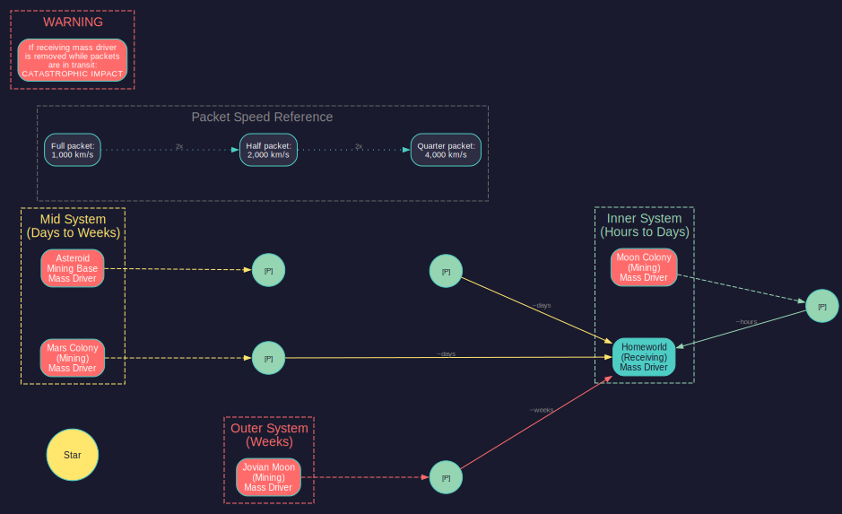

# 6.2 Mining

*Updated: v2026.01.30*

> **Note:** Claims in this section have been verified against the AuroraDB.db v2.7.1 game database where possible. Numbered references indicate verified sources.

Mining is the process of extracting trans-newtonian minerals from planetary bodies and asteroids. Aurora C# provides several methods of mineral extraction, each suited to different situations and stages of development.

## 6.2.1 Conventional Mines

*Updated: v2026.01.30*

Conventional mines are the standard ground-based mining installation, operated by colonists on habitable (or infrastructure-supported) worlds.

**Base Output:**

Each conventional mine produces a base output of 10 tons per mineral per year \hyperlink{ref-6.2-1}{[1]}, modified by the deposit's accessibility. This base rate can be improved through mining technology research in the Construction and Production research category (see [Section 7.4.2 Construction and Production](../7-research/7.4-tech-categories.md)).

**Technology Improvements:**

The "Mining Production" technology line increases the per-mine output:

- Base: 10 tons/year
- Maximum: 70 tons/year at technology level 11 (2,500,000 RP) \hyperlink{ref-6.2-2}{[2]}
- Progression: 10, 12, 14, 16, 20, 25, 30, 36, 42, 50, 60, 70 tons/year per mine \hyperlink{ref-6.2-2}{[2]}

See [Appendix A](../appendices/A-formulas.md) or [Appendix D](../appendices/D-reference-tables.md) for the complete technology progression table with research costs.

The formula for mine output is:

Annual output per mine = Base mining rate x Accessibility x Number of mines x (1 + Governor Bonus)

All mines on a body contribute proportionally to extracting every available mineral deposit on that body. You do not assign mines to specific minerals -- they extract all available minerals simultaneously, with output for each mineral determined by that deposit's accessibility.

**Accessibility Decline:**

On planets and moons, mineral accessibility does not remain constant throughout the life of a deposit. After approximately 50% of a deposit has been mined, accessibility begins to decline, eventually reaching a minimum of 0.1 shortly before the deposit is exhausted. \hyperlink{ref-6.2-10}{[10]} This means mining output gradually decreases as deposits are exploited, making early production significantly more efficient than late-stage extraction from the same deposit. See [Section 6.1.3 Depletion](6.1-minerals.md) for strategic implications of this mechanic.

**Administrator Mining Bonuses:**

Civilian administrators assigned as colony governors (see [Section 16.3 Assignments](../16-commanders/16.3-assignments.md)) provide mining production bonuses ranging from 5% to 50%, depending on their mining skill rating. \hyperlink{ref-6.2-11}{[11]} Additionally, sector commanders apply 25% of their mining skill as a bonus to all colonies within their sector. *(unverified — [#837](https://github.com/ErikEvenson/aurora-manual/issues/837) -- 25% sector commander bonus not directly confirmed in DB; requires live testing)* These bonuses stack, making skilled administrators a significant force multiplier for mining operations.

**Construction:**

- Build Cost: 120 BP \hyperlink{ref-6.2-3}{[3]}
- Workers: 50,000 per mine \hyperlink{ref-6.2-3}{[3]}
- Size: 25,000 tons (one standard cargo hold) \hyperlink{ref-6.2-3}{[3]}
- Mines are built by Construction Factories (see [Section 6.3 Construction](6.3-construction.md)) and can be transported to other colonies via cargo ships.

**Requirements:**

- Conventional mines require population to operate. Each mine requires 50,000 workers from the colony's population.
- Mines on bodies without breathable atmospheres require infrastructure to support the mining population.
- Mines can be built on any body with mineral deposits, including moons, asteroids (if colonized), and other planets.

> **Tip:** In the early game, building additional mines for Earth is one of the most impactful investments you can make. Each mine provides minerals for every deposit on the planet simultaneously, making the return on investment substantial.

> **Strategy -- Comet Mining and High-Accessibility Deposits:** *(v2.7.1)* Comets frequently have high-accessibility mineral deposits, sometimes at 1.0 even when quantities are modest. Early-game players should prioritize high-accessibility deposits (even small ones) over large low-accessibility deposits. A 5,000-ton deposit at accessibility 1.0 delivers minerals ten times faster per mine than a 500,000-ton deposit at accessibility 0.1. "Minerals now is a lot better than minerals later" -- the time value of minerals matters enormously in Aurora. Getting resources into your economy early fuels compound growth through more factories, more mines, and faster research, creating advantages that snowball over decades.

## 6.2.2 Forced Labour Mining Camps (C# Only)

*Updated: v2026.01.30*

Forced Labour Mining Camps are a controversial mining installation unique to C# Aurora. They represent compulsory labour extraction operations with significant trade-offs:

**Key Characteristics:**

- **Cost:** Approximately 1/3 the build cost of standard mines (40 BP) \hyperlink{ref-6.2-4}{[4]}
- **No Population Growth:** Camps consume population over time rather than employing them sustainably
- **Unrest Generation:** Operating forced labour camps generates political unrest on the colony, which can lead to political instability
- **Production:** Comparable extraction rates to conventional mines (MiningProductionValue = 1.0, same as conventional mines) \hyperlink{ref-6.2-4}{[4]}

**When to Consider:**

- Desperate resource shortages where rapid mineral extraction is essential
- Bodies where long-term colonial development is not planned
- Situations where the political unrest consequences are manageable

Forced Labour Mining Camps are a high-risk, low-cost option that trades long-term stability for short-term production gains. Most players avoid them except in dire circumstances.

## 6.2.3 Automated Mines

*Updated: v2026.01.30*

Automated mines function identically to conventional mines in terms of mineral extraction, but they do not require population to operate. This makes them ideal for mining bodies where establishing a full colony would be impractical.

**Key Differences from Conventional Mines:**

- No population required to operate \hyperlink{ref-6.2-5}{[5]}
- Build Cost: 240 BP (twice the cost of a conventional mine at 120 BP) \hyperlink{ref-6.2-5}{[5]}
- Conversion Cost: 150 BP to convert a conventional mine to an automated mine \hyperlink{ref-6.2-6}{[6]}
- Must be transported to the target body via cargo ship (they cannot be built in place unless the body has construction factories)
- Produce at the same base rate as conventional mines (10 tons/year/mine x accessibility, modified by mining technology) \hyperlink{ref-6.2-5}{[5]}
- Size: 25,000 tons (one standard cargo hold) \hyperlink{ref-6.2-5}{[5]}

**Deployment:**

1. Build automated mines at a colony with construction factories.
2. Load them onto a freighter (they are treated as cargo installations).
3. Transport them to the target body.
4. Unload them -- they begin mining immediately upon deployment.

**Ideal Uses:**

- Bodies with no atmosphere or extreme conditions that would require massive infrastructure investment
- Asteroid colonies where population transport is impractical
- Remote systems where you want mineral extraction without the logistical overhead of a full colony
- Moons and dwarf planets with good mineral deposits but poor habitability

**Limitations:**

- Cannot be constructed on-site unless the body already has construction factories and population
- Transportation requires freighter capacity and time
- If the body has no population at all, there is no one to unload cargo -- you may need a small initial colony or use the "unload to body" order

> **Tip:** A common early-game strategy is to build a batch of 50-100 automated mines on Earth, then deploy them to a mineral-rich moon (like Luna or a Jovian moon) with a single freighter run. This provides a steady mineral income from day one without any colony infrastructure.

## 6.2.4 Asteroid Mining

*Updated: v2026.01.30*

Asteroids often contain valuable mineral deposits, sometimes with very high accessibility ratings. Mining asteroids requires either colonizing them or using specialised mining ships.

**Colonizing Asteroids:**

Small asteroids can be colonized like any other body. Deploy automated mines (since population support infrastructure is usually impractical for tiny bodies) and begin extraction. However, minerals must be transported away via cargo ships since asteroids lack the infrastructure for direct use.

**Mass Drivers:**

Mass drivers are installations that electromagnetically launch mineral packets to a designated receiving colony. They provide a zero-fuel-cost method of transferring minerals from a mining outpost to your industrial centres.

- Each mass driver can launch 5,000 tons of minerals per year to any colony in the same system. *(unverified — [#837](https://github.com/ErikEvenson/aurora-manual/issues/837) -- requires live testing; MassDriverValue=1.0 in DB but units unclear)*
- The receiving colony must also have a mass driver installation to catch the incoming packets.
- Mass drivers work within a star system (not between systems).
- They require no fuel and no ships, making them extremely efficient for intra-system mineral transport.
- You designate the destination colony in the colony management screen.

**Mass Driver Setup:**

1. Build mass driver installations on both the mining colony and the receiving colony.
2. On the mining colony, set the destination to the receiving colony.
3. Minerals will be automatically launched as they are mined (up to the mass driver's capacity).
4. As of v1.12.0, mass drivers can be configured to launch only specific mineral types rather than all minerals indiscriminately. This allows fine-grained control over mineral logistics, preventing unneeded minerals from clogging receiving colony stockpiles.

**Packet Travel Time:**

*Added: v2026.01.25*

Mineral packets are physical objects moving through space, not instantaneous transfers. After launch, packets travel at approximately 10,000 km/s toward their destination. *(unverified — [#837](https://github.com/ErikEvenson/aurora-manual/issues/837) -- requires live testing; FCT_MassDriverPackets.Speed stores per-packet speed but base constant appears hardcoded)* This means transit times depend heavily on distance:

- Inner system routes (e.g., Earth to Luna): Minutes to hours
- Mid-system routes (e.g., Earth to Mars at close approach): Hours to days
- Outer system routes (e.g., Earth to a Jovian moon): Days to weeks

Mass driver packets are launched at regular intervals (approximately every 30 days). *(unverified — [#837](https://github.com/ErikEvenson/aurora-manual/issues/837) -- requires live testing; launch interval not directly confirmed in DB)* On the system map, multiple packets may appear at different points along the trajectory, representing successive launches rather than a single slow-moving packet.

> **Warning:** If the receiving mass driver is removed, destroyed, or relocated while packets are en route, the incoming packets will strike the destination colony with devastating kinetic force. This causes massive casualties (potentially millions of deaths) and generates severe political unrest. Always verify that receiving mass drivers remain operational before decommissioning any part of a mass driver network.

**Route Planning Considerations:**

When designing a mass driver network, account for transit times:

- The base speed of a maximum-size mineral packet is 1,000 km/s *(unverified — [#837](https://github.com/ErikEvenson/aurora-manual/issues/837) -- sourced from Aurora Forums; requires live testing to confirm in C#)* \hyperlink{ref-6.2-9}{[9]}
- Packet speed scales inversely with size: a half-size packet travels at 2,000 km/s, a quarter-size packet at 4,000 km/s, and so on \hyperlink{ref-6.2-9}{[9]}
- At 1,000 km/s, a packet takes approximately 1.7 days to cross 1 AU (150 million km), but outer system distances of 10+ AU mean transit times of weeks
- Packets cannot pass through jump points (use freighters for inter-system transport)
- Consider whether fast freighter runs might be more responsive than mass drivers for time-critical mineral needs

> **Note:** Whether mass driver packets can be targeted or intercepted by weapons remains unverified. In practice, they appear to be invulnerable during transit except to the catastrophic "colony drop" scenario when the receiving mass driver is absent.

**Orbital Mining Modules:**

In C# Aurora, Orbital Mining Modules replace the VB6 "Asteroid Mining Modules." These ship components enable mining of small celestial bodies without requiring population support or infrastructure, but are constrained by a technology-gated maximum body diameter.

Ships equipped with Orbital Mining Modules:

- Orbit an eligible body and automatically extract minerals
- **Require a colony to be present on the target body** -- the mining module will not operate without a colony to store extracted minerals. Minerals are deposited on the body's surface colony, not in the ship's cargo hold
- Extracted minerals remain on the body until transported via freighter or mass driver
- Are particularly useful for exploiting scattered small deposits without full colonial infrastructure

**Orbital Mining Module Specifications:**

- Type: Core commercial component
- Size: 100 HS (5,000 tons) \hyperlink{ref-6.2-7}{[7]}
- Cost: 120 BP (120 Corundium) \hyperlink{ref-6.2-7}{[7]}
- Production follows the same accessibility formula as ground-based mines

The key advantage of orbital mining modules is logistical efficiency: each module weighs 5,000 tons \hyperlink{ref-6.2-7}{[7]}, whereas transporting conventional mines requires 25,000 tons of cargo capacity per mine \hyperlink{ref-6.2-3}{[3]}. This allows rapid deployment of mining capability to multiple small bodies without an extensive freighter fleet. Orbital miners are ideal for quickly extracting small, scattered deposits before moving on to the next target.

**Designing an Orbital Mining Platform:**

Orbital mining platforms are designed as ships in the Class Design window, typically as commercial vessels with NO engines and NO fuel. A typical platform includes:

- 20 Orbital Mining Modules (each counts as 1 mine equivalent; total approximately 103,000 tons)
- Auxiliary Control (required bridge alternative for commercial designs)
- Engineering Spaces (for maintenance capability)
- Maintenance Storage (for self-repair)
- Optionally, fuel storage to serve as emergency refuelling for visiting ships
- Armour (minimal protective layer)

**Tractor Beam Requirement:**

Because platforms are designed without engines, they cannot move themselves. A separate tug ship equipped with tractor beams is required to tow the platform to its destination. Tractor beam technology must be researched before tugs can be designed. See [Section 8.7 Design Examples](../8-ship-design/8.7-design-examples.md) for tug design guidance.

**Shipyard Considerations:**

- Platforms must be built at commercial shipyards
- A 20-module platform at 100,000+ tons requires significant shipyard capacity expansion
- Retooling time for large platforms is approximately 2 years *(unverified — [#837](https://github.com/ErikEvenson/aurora-manual/issues/837) -- requires live testing; retooling duration appears calculated from BP cost difference)*

> **Warning:** When adding modules in bulk in the Class Design window, remember to reset the "add quantity" selector afterward. A common UI mistake is to leave the quantity at 20 and accidentally add 20 engineering spaces instead of 1.

**Maximum Orbital Mining Diameter Technology:**

Each race has a dedicated technology line called "Maximum Orbital Mining Diameter" that determines the largest body that can be mined orbitally \hyperlink{ref-6.2-8}{[8]}:

| Technology Level | Maximum Diameter | Research Cost |
|---|---|---|
| Starting | 100 km | 1,000 RP |
| Level 2 | 125 km | 2,000 RP |
| Level 3 | 160 km | 4,000 RP |
| Level 4 | 200 km | 8,000 RP |
| Level 5 | 250 km | 16,000 RP |
| Level 6 | 320 km | 32,000 RP |
| Level 7 | 400 km | 64,000 RP |
| Level 8 (Max) | 500 km | 125,000 RP |

**Eligible Bodies:**

Any system body within the current diameter limit can be mined orbitally, including:

- Asteroids
- Comets
- Moons
- Small dwarf planets

Note that some asteroids may exceed the maximum diameter and be ineligible for orbital mining until higher technology is researched.

**Interface Features:**

The game provides several tools for managing orbital mining:

- Population summary displays parent body diameter and mining eligibility
- System view allows flagging eligible bodies for mining
- The Mineral Search window includes filters specifically for orbital-mining-eligible bodies

> **Tip:** Mass drivers are one of the most efficient investments in the game for intra-system logistics. A pair of mass drivers (one at each end) eliminates the need for an entire freighter fleet to move minerals from a mining colony.

## 6.2.5 Deep Space Mining

*Updated: v2026.01.30*

"Deep space mining" in Aurora refers to establishing mining operations on low-gravity bodies far from your homeworld -- typically moons of gas giants, Kuiper belt objects, or bodies in other star systems.

**Challenges of Remote Mining:**

- **Distance:** Bodies in the outer system or other star systems require significant travel time for cargo ships.
- **Habitability:** Most remote bodies have no atmosphere, extreme temperatures, or very low gravity, requiring infrastructure or automated mines.
- **Logistics:** Getting minerals back to your industrial centres requires either a dedicated freighter fleet or mass driver chains.
- **Defence:** Remote mining colonies may be vulnerable to alien attack with no nearby military assets.

**Gas Giant Sorium Harvesting:**

Gas giants cannot be mined conventionally, but they contain harvestable Sorium that can be processed into fuel. This uses specialised "Fuel Harvester" ship modules:

- Design a ship with Fuel Harvester modules (see [Section 8.7.5 Fuel Harvester](../8-ship-design/8.7-design-examples.md)) and sufficient fuel storage.
- Assign the ship to orbit a gas giant with a harvesting order.
- The ship automatically harvests Sorium from the gas giant's atmosphere and converts it to fuel.
- Harvested fuel can be transferred to a fuel depot, other ships, or a colony.
- Fuel harvesting rate depends on the size and number of harvester modules, plus the gas giant's Sorium availability.

**Fuel Harvesting vs. Ground-Based Sorium Mining:**

- Fuel harvesters convert directly to usable fuel; ground-mined Sorium must be refined at a colony with fuel refineries.
- Gas giants typically have much larger Sorium quantities than terrestrial deposits.
- Harvester ships represent a significant upfront investment but provide fuel independence from ground-based infrastructure.

**Remote Colony Infrastructure:**

For permanent mining colonies on hostile bodies, you typically need:

- Infrastructure installations (to support population in non-habitable environments)
- Either conventional mines + population, or automated mines (no population needed)
- Mass drivers or regular freighter runs to transport minerals home
- Optionally, a fuel depot or fuel harvester support for refuelling transport ships

**Multi-System Mining Networks:**

As your empire expands to multiple star systems, establishing mining colonies in each system becomes important. Key considerations:

- Survey all bodies in a new system promptly to identify the best mineral deposits.
- Prioritize high-accessibility deposits even if they are smaller.
- Consider establishing a local construction capacity to build mines on-site rather than shipping them from the homeworld.
- Jump gate construction enables faster and more fuel-efficient transport of minerals between systems.

> **Tip:** When expanding to a new system, look for a body that combines good mineral deposits with reasonable habitability (or at least one that is cost-effective to support with infrastructure). This body can serve as your local industrial hub, receiving minerals from automated mines on less hospitable bodies in the same system via mass drivers.

## 6.2.6 Empire Mining Production Overview

*Updated: v2026.01.30*

The Economics window includes an **Empire Mining** tab that provides a comprehensive view of your empire's total mining output. This tab shows:

- **Production per Mineral per Colony:** How much of each mineral each colony is producing per year
- **Stockpile Information:** Current reserves of each mineral across your empire
- **Production Totals:** Aggregate production rates for strategic planning

**Important:** The production information will only appear after the first construction phase (after launching the game), as mining production calculations are integrated with the construction phase mechanics. Before the first construction phase completes, the tab shows stockpiles but not production rates.

### 6.2.6.1 Using Empire Mining Data

The Empire Mining tab is essential for strategic resource management:

- **Identify Bottlenecks:** Quickly spot which minerals are being produced too slowly relative to consumption
- **Optimise Allocation:** Determine which colonies are producing which minerals most efficiently
- **Plan Expansion:** Identify where additional mines or new mining colonies would have the most impact
- **Monitor Depletion:** Track production rates over time to anticipate when deposits will become exhausted

### 6.2.6.2 Civilian Mining Complexes

In addition to government mining operations, civilian mining complexes contribute to your empire's mineral production. These are covered in detail in [Section 6.5.2 Civilian Mining](6.5-civilian-economy.md#652-civilian-mining), but key points for the mining overview:

- Civilian mining complexes require no workers to operate
- They are established autonomously by your civilian sector
- Their production appears in the Empire Mining tab alongside government mining
- They score locations based on total minerals with accessibility of 0.5 or higher, with Duranium scoring double

## UI References and Screenshots

*Updated: v2026.01.28*

- [Colony Window Layout](../images/colony-window.md) — mineral deposits and mining installation management
- **Forum screenshots:**
  - [Minerva](http://www.pentarch.org/steve/Screenshots/Minerva.PNG) — mineral survey display

## Related Sections

- [Section 6.1 Minerals](6.1-minerals.md) -- The eleven TN mineral types and their uses
- [Section 6.3 Construction](6.3-construction.md) -- Building mines and mining-related installations
- [Section 14.2 Maintenance](../14-logistics/14.2-maintenance.md) -- Moving minerals between colonies via freighters
- [Section 5.1 Establishing Colonies](../5-colonies/5.1-establishing-colonies.md) -- Setting up remote mining colonies
- [Section 7.4 Tech Categories](../7-research/7.4-tech-categories.md) -- Mining technology research
- [Appendix A: Formulas](../appendices/A-formulas.md) -- Mining output calculations
- [Worked Example: Mining Network Setup](../examples/mining-network-setup.md) -- Multi-body mining infrastructure walkthrough

## References

\hypertarget{ref-6.2-1}{[1]}. Aurora C# game database (AuroraDB.db v2.7.1) -- FCT_TechSystem mining production tech line (TechTypeID=26) starts at base 10 tons/year, confirming base mine output.

\hypertarget{ref-6.2-2}{[2]}. Aurora C# game database (AuroraDB.db v2.7.1) -- FCT_TechSystem mining production entries show progression: 12 (3,000 RP), 14 (5,000 RP), 16 (10,000 RP), 20 (20,000 RP), 25 (40,000 RP), 30 (80,000 RP), 36 (150,000 RP), 42 (300,000 RP), 50 (600,000 RP), 60 (1,250,000 RP), 70 (2,500,000 RP). Confirms 11 tech levels with maximum 70 tons/year at 2,500,000 RP.

\hypertarget{ref-6.2-3}{[3]}. Aurora C# game database (AuroraDB.db v2.7.1) -- DIM_PlanetaryInstallation "Mine" (ID 7): Cost=120, CargoPoints=25000, Workers=0.05 (50,000). Mineral cost: 120 Corundium.

\hypertarget{ref-6.2-4}{[4]}. Aurora C# game database (AuroraDB.db v2.7.1) -- DIM_PlanetaryInstallation "Forced Labour Mining Camp" (ID 48): Cost=40, MiningProductionValue=1.0 (same as conventional mine). Cost is exactly 1/3 of standard mine cost (120 BP). Mineral cost: 20 Duranium, 20 Corundium.

\hypertarget{ref-6.2-5}{[5]}. Aurora C# game database (AuroraDB.db v2.7.1) -- DIM_PlanetaryInstallation "Automated Mine" (ID 12): Cost=240, CargoPoints=25000, Workers=0 (no population needed), MiningProductionValue=1.0 (same base rate as conventional mine). Mineral cost: 240 Corundium.

\hypertarget{ref-6.2-6}{[6]}. Aurora C# game database (AuroraDB.db v2.7.1) -- DIM_PlanetaryInstallation "Convert Mine to Automated" (ID 18): Cost=150, ConversionFrom=7 (Mine), ConversionTo=12 (Automated Mine). Mineral cost: 150 Corundium.

\hypertarget{ref-6.2-7}{[7]}. Aurora C# game database (AuroraDB.db v2.7.1) -- FCT_ShipDesignComponents "Orbital Mining Module": Size=100 HS (5,000 tons), Cost=120 BP, minerals: 120 Corundium.

\hypertarget{ref-6.2-8}{[8]}. Aurora C# game database (AuroraDB.db v2.7.1) -- FCT_TechSystem entries for TechTypeID=245 ("Maximum Orbital Mining Diameter"): 8 levels from 100 km (1,000 RP) to 500 km (125,000 RP).

\hypertarget{ref-6.2-9}{[9]}. Aurora Forums -- "Mass Drivers" thread (aurora2.pentarch.org/index.php?topic=657.0): "The speed of a packet of maximum size is 1000 km/s. Smaller packets than the maximum possible will travel more quickly. Half size would be double speed, quarter size would be 4x speed, etc." This may reflect VB6 behavior; no C# database field stores the base speed constant (FCT\_MassDriverPackets.Speed records per-packet speed at launch but the base value appears hardcoded). No mass driver speed tech progression exists in FCT\_TechSystem or DIM\_TechType.

\hypertarget{ref-6.2-10}{[10]}. Aurora C# game database (AuroraDB.db v2.7.1) -- FCT_MineralDeposit schema includes HalfOriginalAmount and OriginalAcc fields, indicating the game tracks original accessibility and the 50% depletion point. The minimum accessibility of 0.1 is confirmed by FCT_MineralDeposit.Accessibility range MIN=0.1, MAX=1.0.

\hypertarget{ref-6.2-11}{[11]}. Aurora C# game database (AuroraDB.db v2.7.1) -- DIM_CommanderBonusType BonusID=6 (Mining): MaximumBonus=1.5 (50% maximum), confirming governor mining bonus can range from 5% to 50%.
