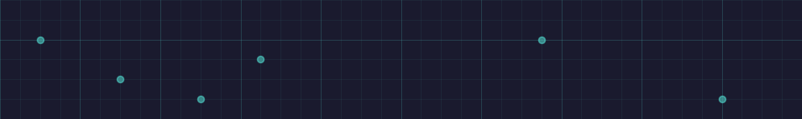
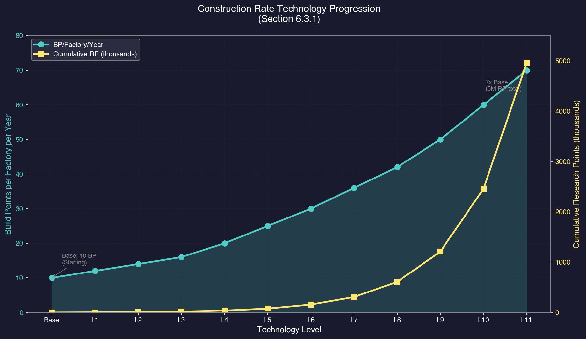
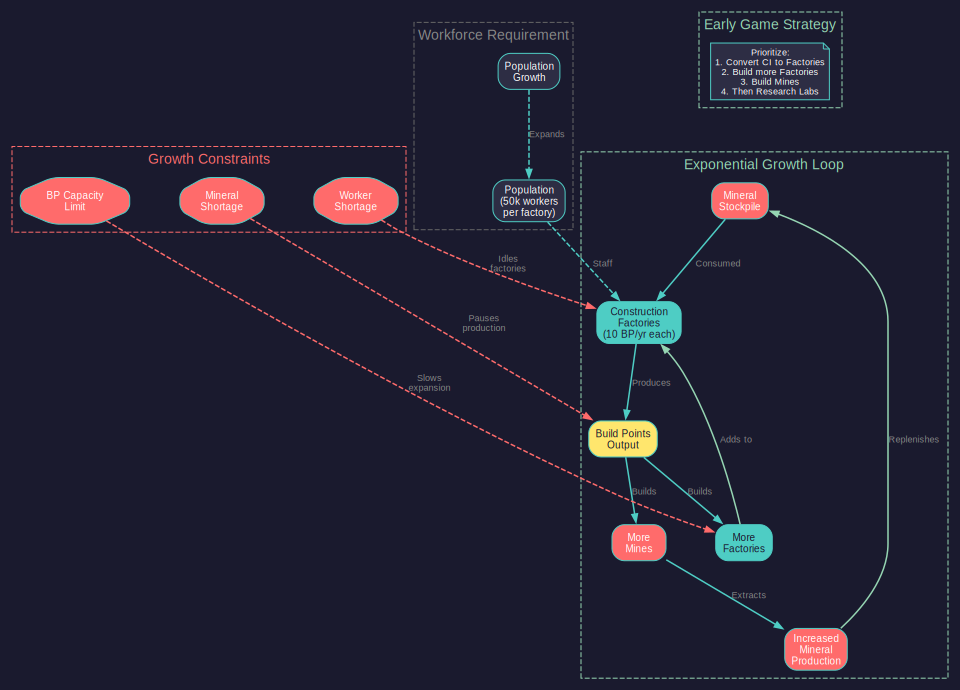

# 6.3 Construction

*Updated: v2026.01.30*



> **[Screenshot Pending — #1077]** Construction Queue Interface with build orders

Construction is the process of turning raw minerals into usable installations, components, and ships. Aurora C# has distinct construction systems for ground installations, ship components, ordnance, and fighters, each with its own facilities and queues.

## 6.3.1 Construction Factories

*Updated: v2026.01.30*

Construction factories are the primary ground-based production facility. They build all planetary installations, ground force equipment, and various other items.

**How They Work:**

Each construction factory contributes a set number of [Build Points (BP)](../appendices/B-glossary.md) per year toward whatever is in the colony's construction queue. The base output is 10 BP per factory per year \hyperlink{ref-6.3-1}{[1]}, improvable through technology research.

**Specifications:**

- Workers: 50,000 per factory \hyperlink{ref-6.3-1}{[1]}
- Size: 25,000 tons (one standard cargo hold) \hyperlink{ref-6.3-1}{[1]}
- Build Cost: 120 BP \hyperlink{ref-6.3-1}{[1]}
- Base Output: 10 BP/year/factory (upgradeable via Construction Rate research) \hyperlink{ref-6.3-2}{[2]}

**What Construction Factories Build:**

- All ground installations (mines, automated mines, research labs, fuel refineries, financial centres, infrastructure, mass drivers, terraforming installations, ground force training facilities, etc.)
- Fighters and small craft (FACs -- Fast Attack Craft)
- Ground force units and equipment
- Prefabricated [PDCs](../appendices/B-glossary.md) (Planetary Defence Centres)
- Maintenance facilities
- Various other colonial infrastructure

**Technology Improvements:**

The "Construction Rate" technology in the Construction and Production category (see [Section 7.4 Tech Categories](../7-research/7.4-tech-categories.md)) increases factory output:

- Each tech level raises the BP per factory per year
- This is one of the highest-impact early research priorities since it accelerates all ground-based production



**Build Point Costs:**

Every item has a BP cost representing how much industrial effort is required to produce it. For example:

- Conventional Mine: 120 BP \hyperlink{ref-6.3-3}{[3]}
- Automated Mine: 240 BP \hyperlink{ref-6.3-3}{[3]}
- Research Lab: 2,400 BP \hyperlink{ref-6.3-3}{[3]}
- Infrastructure: 2 BP per unit \hyperlink{ref-6.3-3}{[3]}
- Construction Factory: 120 BP \hyperlink{ref-6.3-1}{[1]}

**Mineral Requirements:**

In addition to BP costs, every item requires specific minerals. These are consumed as the item is built, drawn from the colony's mineral stockpile. If a required mineral runs out mid-construction, building pauses until more is available.

**Workforce:**

Construction factories require population to operate. Each factory needs workers drawn from the colony's population. A colony with insufficient population cannot run all its factories at full capacity.



> **Tip:** Construction factories building more construction factories is the fundamental economic growth loop in Aurora. In the early game, dedicating a significant portion of your construction queue to building additional factories (and mines to feed them) creates compound growth that pays dividends for decades.

## 6.3.2 Build Queue

*Updated: v2026.01.30*

The build queue (managed through the Economics window's Industry tab) determines what your construction factories produce and in what order.

**Queue Management:**

- Items are built in order from top to bottom.
- You can queue multiple items, each with a specified quantity.
- Production continues 24/7 -- factories never idle if the queue has items and minerals are available.
- You can pause, reorder, or cancel queue items at any time.
- Partially-completed items retain their progress if paused.

**Queue Controls:**

- **Add Item:** Select an item type and quantity, then add it to the queue.
- **Priority:** Move items up or down the queue to change build order.
- **Pause/Resume:** Temporarily halt production of a specific item without removing it.
- **Cancel:** Remove an item from the queue entirely (minerals already consumed are not refunded).
- **Repeat:** Set an item to automatically re-queue when complete (useful for continuous mine or factory production).

**Percentage Allocation:**

You can split your construction capacity across multiple queue items simultaneously by assigning percentage allocations. For example, you might allocate 50% to mines, 30% to factories, and 20% to infrastructure. Each allocation receives its proportional share of total BP output.

**Unused Capacity Display:**

When the total capacity devoted to industrial projects is less than 100%, the unused capacity is displayed alongside active production items. The system tracks unused capacity separately for three distinct production types:

- **Construction** -- Standard factory and installation projects
- **Ordnance** -- Missile and ammunition manufacturing
- **Fighters** -- Fighter craft production

This provides visibility into industrial inefficiency, helping players identify available production resources not currently allocated to active projects. If you see unused capacity in any category, consider adding queue items to maximise your industrial throughput.

**Completion and Delivery:**

- Ground installations are immediately available on the colony where they are built.
- Items built for transport (e.g., automated mines destined for another body) are placed in the colony's stockpile and must be loaded onto ships manually.
- Fighters and FACs appear in the colony's orbit upon completion.

**Idle Notification Behaviour:**

There is an important asymmetry in how the game handles idle notifications for construction versus research:

- **Research:** When labs are idle (unassigned), the game generates a notification EVERY increment, making it easy to notice and reassign them promptly.
- **Construction:** When construction capacity is idle (no build orders), the game notifies you ONLY ONCE that construction has completed. It does NOT generate repeated idle capacity warnings on subsequent increments.

> **Warning:** If you miss the initial construction completion notification (easy to do during fast-forward), your factories can sit idle for months or years without further alerts. Develop a habit of periodically checking the Industry tab for unused capacity, or customize the event log text colour for construction completion events to a distinctive colour so they stand out during time advancement.

**Common Queue Strategies:**

- **Early Game:** Factories (to compound growth) > Mines > Research Labs > Infrastructure
- **Expansion Phase:** Automated mines, freighters (via shipyard), mass drivers
- **Military Buildup:** Ordnance factories, fighter factories, ground force training

> **Tip:** The "Repeat" function is extremely useful for items you always want more of. Set mines or infrastructure to repeat and they will be continuously produced whenever your factories have spare capacity.

## 6.3.3 Naval Shipyards vs Commercial

*Updated: v2026.01.30*

Ships in Aurora are built in orbital shipyards, not construction factories (see [Section 9.1 Shipyards](../9-fleet-management/9.1-shipyards.md) for detailed mechanics). There are two types of shipyards, each with distinct capabilities and limitations.

**Naval Shipyards:**

Naval shipyards build military vessels -- warships, escorts, carriers, scouts, and any ship with exclusively military components.

- Can build ships with any military components (weapons, military sensors, armour beyond civilian standards, etc.)
- Generally smaller capacity (measured in tons) than commercial shipyards, though they can be expanded
- More expensive to build and expand
- Can be retooled to build different ship classes (retooling takes time proportional to the difference in tonnage between old and new class)
- Each shipyard has one or more slipways -- each slipway can build one ship at a time
- Adding slipways increases parallel production but each slipway addition takes time and resources

**Commercial Shipyards:**

Commercial shipyards build civilian and support vessels -- freighters, colony ships, fuel tankers, terraformers, survey ships, and other non-combat vessels.

- Cannot build ships with restricted military components (beam weapons, missile launchers, military-grade sensors, etc.)
- Typically have larger capacity than naval shipyards
- Cheaper and faster to build and expand
- Can build ships with commercial engines (which are larger but cheaper than military engines)
- Ideal for the large, slow vessels that form your logistical backbone

**Shipyard Operations:**

Both shipyard types share these mechanics:

- **Capacity:** Each shipyard has a maximum tonnage it can build. Ships larger than the yard's capacity cannot be built there. Capacity can be expanded through yard modifications.
- **Slipways:** Each slipway builds one ship at a time. More slipways = more simultaneous production. Adding slipways is a yard modification.
- **Retooling:** Changing which ship class a yard builds requires retooling time. Retooling from a 5,000-ton class to a 5,500-ton class is fast; retooling from 5,000 to 50,000 tons takes much longer.
- **Build Rate:** Shipyard output is measured in BP/year, similar to construction factories. The base rate is 400 BP per slipway per year (modifiable by technology) *(unverified — [#837](https://github.com/ErikEvenson/aurora-manual/issues/837) -- requires live testing; no base entry in FCT_TechSystem, first tech level is 560 BP)* \hyperlink{ref-6.3-12}{[12]}.
- **Refits:** Shipyards can refit existing ships to a new design, consuming only the minerals for the changed components (much cheaper than building from scratch if the changes are minor).

**Commercial Ship Rules:**

Ships built at commercial shipyards must adhere to specific restrictions:

- No military components (weapons, military sensors, military-grade armour)
- Minimum 3-month deployment time \hyperlink{ref-6.3-13}{[13]}
- Minimum 50 tons of Engineering Spaces *(unverified — [#837](https://github.com/ErikEvenson/aurora-manual/issues/837) -- requires live testing; not directly confirmed in DB)*
- Must use commercial engines (which provide 10x the size capacity of military engines for the same cost) *(unverified — [#837](https://github.com/ErikEvenson/aurora-manual/issues/837) -- requires live testing; ratio not directly confirmed in DB)*
- Commercial ships do NOT suffer maintenance failures and are also exempt from deployment time morale penalties, making them ideal for indefinite logistics operations. *(unverified — [#837](https://github.com/ErikEvenson/aurora-manual/issues/837) -- requires live testing; maintenance exemption not directly confirmed in DB)* The "minimum 3-month deployment time" listed above is a design floor requirement (ships must be designed with at least 3 months of deployment capability), not a gameplay limitation on how long they can remain deployed

**Shipyard Construction:**

Shipyards themselves are built by other shipyards (there is a "build shipyard" task) or can be part of your starting assets. Building a new shipyard is a major investment that takes years.

**Expanding Shipyard Capacity:**

- **Add Slipway:** Adds a parallel production slot. Takes significant time.
- **Increase Capacity:** Raises the maximum tonnage the yard can handle. Required before building larger ship classes.
- **Retool:** Changes the yard to produce a different ship class.

**Key Differences Summary:**

| Feature | Naval Shipyard | Commercial Shipyard |
|---------|---------------|-------------------|
| Military weapons | Yes | No |
| Military engines | Yes | Yes (but also commercial) |
| Commercial engines | No (military only) | Yes |
| Typical capacity | Smaller | Larger |
| Build cost | Higher | Lower |
| Primary use | Warships | Freighters, tankers, colony ships |

**Ordnance Factories:**

Separate from shipyards, ordnance factories produce missiles, torpedoes, mines, and buoys. These are ground installations built by construction factories and produce ordnance according to your designed missile types.

- Build Cost: 120 BP \hyperlink{ref-6.3-4}{[4]}
- Workers: 50,000 per factory \hyperlink{ref-6.3-4}{[4]}
- Base Output: 10 BP/year/factory (upgradeable via research) \hyperlink{ref-6.3-4}{[4]}

**Fighter Factories:**

Fighter Factories are specialised installations that produce fighters and small military craft. As of v2.8.0, these are also referred to as **Light Naval Factories**, reflecting their expanded role in producing any military ship of 1,000 tons or less *(unverified — [#837](https://github.com/ErikEvenson/aurora-manual/issues/837) -- requires live testing; threshold not directly confirmed in DB)*. The database retains the "Fighter Factory" name \hyperlink{ref-6.3-5}{[5]}. They function similarly to construction factories but are dedicated to small craft production. See [Section 9.6 Light Naval Operations](../9-fleet-management/9.6-light-naval-operations.md) for full details on Light Naval construction and mechanics.

- Build Cost: 120 BP \hyperlink{ref-6.3-5}{[5]}
- Workers: 50,000 per factory \hyperlink{ref-6.3-5}{[5]}
- Base Output: 10 BP/year/factory (upgradeable via research) \hyperlink{ref-6.3-5}{[5]}

**Conventional Industry:**

At game start, empires begin with conventional industry representing pre-TN (trans-newtonian) manufacturing capability. Conventional Industry (CI) is **immobile** -- it cannot be transported between colonies or relocated in any way. It exists only on the body where your empire starts. However, CI can be **converted** to TN installations once Trans-Newtonian Technology is researched (see conversion targets below). *(v2.7.1)*

After researching Trans-Newtonian Technology, the Industry tab shows conversion options for all six major TN installation types listed below. Note that CI-to-TN conversion requires the Trans-Newtonian Technology research to unlock; without it, no conversion options appear. *(v2.7.1)*

**CI vs TN Efficiency:** *(v2.7.1)*

New players should understand the dramatic efficiency gap between conventional and TN industry:

| Facility | Annual Mining Output | Construction Output | Notes |
|----------|---------------------|---------------------|-------|
| 1 Conventional Industry unit | ~1.5 tons of minerals/year | ~1 BP/year | Pre-TN, multi-purpose |
| 1 TN Mine | 10 tons of minerals/year | N/A | Base rate before tech upgrades |
| 1 TN Construction Factory | N/A | 10 BP/year | Base rate before tech upgrades |

CI mining output is 0.15 mine-equivalents (approximately 1.5 tons/year at base tech), while CI construction output is 0.1 factory-equivalents (1 BP/year) \hyperlink{ref-6.3-6}{[6]}. A TN mine produces roughly **6.7x** the mining output of a single CI unit, and a TN construction factory produces **10x** the construction output. Prioritize transitioning to TN installations as early as possible; every year spent relying solely on CI is a year of drastically reduced output. The compound effect of early TN conversion cannot be overstated.

**Available Conversion Targets:**

Each conversion costs 20 BP (1/6th of the normal 120 BP build cost for most installation types) plus 20 units of a type-specific mineral \hyperlink{ref-6.3-7}{[7]}:

| Conversion Target | Mineral Cost |
|-------------------|-------------|
| Construction Factory | 10 Duranium + 10 Neutronium |
| Mine | 20 Corundium |
| Fuel Refinery | 20 Boronide |
| Financial Centre | 20 Corbomite |
| Ordnance Factory | 20 Tritanium |
| Fighter Factory | 20 Vendarite |

Conversions can be queued simultaneously with percentage-based priority allocation.

**Recommended Conversion Strategy:**

For a typical 1,600 CI start, a common split is:

- 800 Construction Factories at highest priority (70%)
- 600 Mines
- 100 Financial Centres
- 100 Fuel Refineries

> **Tip:** Convert Construction Factories FIRST at the highest priority. Each completed CF increases your total build points, which accelerates all remaining conversions. You can watch completion dates for other items drop as each CF comes online -- a compound growth effect.

## 6.3.4 Component Pre-Fabrication

*Updated: v2026.01.30*

Ship components can be pre-built individually and stockpiled before a ship is ordered, reducing future ship construction time. This is managed through the Components section in the Economics window.

**How It Works:**

- Queue individual ship components (bridges, auxiliary controls, engines, etc.) for production by construction factories
- Completed components are stored in the colony's stockpile
- When a ship is subsequently ordered at a shipyard, pre-built components are installed directly from stockpile rather than fabricated during the build
- The same system handles fighters, ordnance, and space station components

**Key Points:**

- Pre-building does NOT save minerals -- the same mineral cost applies regardless of when the component is built
- Pre-building DOES save time on future ship construction, since components are ready for immediate installation
- Available component types depend on current research (e.g., missiles and fighters only appear after relevant technologies are researched)
- This is distinct from construction factories building ground installations -- it specifically targets ship sub-components

> **Tip:** Pre-building common components like bridges in batches of 50 or more ensures they are always available when new ships enter construction. This is especially valuable for components shared across multiple ship classes.

See also [Section 9.2 Construction and Refit](../9-fleet-management/9.2-construction-and-refit.md) for how pre-fabricated components integrate with shipyard build times.

## 6.3.5 Component Development Costs

*Updated: v2026.01.30*

Researching new ship components (see [Section 8.1 Design Philosophy](../8-ship-design/8.1-design-philosophy.md)) requires Research Points (RP), with the cost determined by the component's Build Point (BP) cost. In v1.13.0, the development cost formulas were restructured to address inconsistencies between component types and reduce prohibitive research costs for large components.

Note: Component Development Costs (research to unlock a component design) are separate from Component Pre-Fabrication (building already-researched components in advance). See [Section 6.3.4](#634-component-pre-fabrication) for pre-building stockpiles.

**Current Formulas:**

**Most Ship Components** (Active Sensors, Beam Fire Controls, CIWS, Cloaks, EM Sensors, Engines, Fighter Pod Bays, Gauss Cannons, Jump Engines, Lasers, Magazines, Meson Cannons, Microwaves, Missile Fire Controls, Missile Launchers, Particle Beams, Plasma Carronades, Power Plants, Railguns, Shield Generators, STO Ground Units, Thermal Sensors, Turrets):

```
Development Cost (RP) = SQRT(Cost_in_BP * 5000)
```

\hyperlink{ref-6.3-8}{[8]}

**Missiles and Non-STO Ground Units:**

```
Development Cost (RP) = SQRT(Cost_in_BP * 25000)
```

\hyperlink{ref-6.3-8}{[8]}

**Breakeven Points** (where costs equal the previous version):

- Standard components: 50 BP cost \hyperlink{ref-6.3-9}{[9]}
- Missiles: 2.5 BP cost \hyperlink{ref-6.3-9}{[9]}
- Ground units: 10 BP cost \hyperlink{ref-6.3-9}{[9]}

**Practical Impact:**

- Components costing less than the breakeven point are now MORE expensive to research
- Components costing more than the breakeven point are now LESS expensive to research
- Example: A 10 BP component increased from 100 RP to 224 RP \hyperlink{ref-6.3-9}{[9]}
- Example: A 1,000 BP component decreased from 10,000 RP to 2,236 RP \hyperlink{ref-6.3-9}{[9]}
- Example: A 250,000-capacity minimal armor static HQ reduced from 5,012 RP to 1,583 RP \hyperlink{ref-6.3-9}{[9]}

The net effect is that small, cheap components cost slightly more to research, while large, expensive components (which were previously prohibitively expensive) become much more accessible. This allows NPRs to develop a wider range of combat-capable components and provides more granular balance control.

## 6.3.6 Repair Yards

*Updated: v2026.01.30*

Repair Yards are a specialized third shipyard type introduced in v1.13.0, sitting alongside naval and commercial variants. They are dedicated to restoring damaged vessels rather than constructing new ones.

**Key Characteristics:**

- Begin with a baseline capacity of 10,000 tons *(unverified — [#837](https://github.com/ErikEvenson/aurora-manual/issues/837) -- requires live testing; no repair yards in DB to confirm default capacity)*
- Build cost: 1,200 BP per yard (reduced from 2,400 BP as of v2.0) \hyperlink{ref-6.3-10}{[10]}
- Can repair any ship class without requiring retooling
- Cannot build new ships or perform refits
- Specialized for restoration of battle-damaged or accident-damaged vessels

**When to Use Repair Yards:**

- After combat engagements that damage multiple ships
- For ongoing fleet maintenance at forward bases
- When you need repair capacity without dedicating a construction shipyard to the task
- At frontier colonies where dedicated repair infrastructure is more practical than full shipyards

**Strategic Value:** Repair yards free up your naval and commercial shipyards to focus on new construction while providing dedicated repair capacity. Since they do not require retooling for specific classes, a single repair yard can service your entire fleet regardless of ship diversity.

> **Warning:** A common mistake is building only naval shipyards early on. You need commercial shipyards for freighters and colony ships, which are essential for expanding your empire. Plan to have at least one of each type operational in your first decade. Consider adding a repair yard once your fleet starts seeing combat or operating far from home.

## UI References and Screenshots

*Updated: v2026.01.30*

- [Colony Window Layout](../images/colony-window.md) — construction queue and factory management
- [Shipyard Management Window Layout](../images/shipyard-window.md) — ship construction interface

## Related Sections

- [Section 6.1 Minerals](6.1-minerals.md) -- Raw materials consumed during construction
- [Section 6.2 Mining](6.2-mining.md) -- Producing the minerals needed for construction
- [Section 9.1 Shipyards](../9-fleet-management/9.1-shipyards.md) -- Detailed shipyard capacity and management mechanics
- [Section 9.2 Construction and Refit](../9-fleet-management/9.2-construction-and-refit.md) -- Building and refitting ships in shipyards
- [Section 7.4 Tech Categories](../7-research/7.4-tech-categories.md) -- Construction Rate and Shipyard Operations research
- [Section 13.1 Unit Types and Formation Design](../13-ground-forces/13.1-unit-types.md) -- Ground forces built by construction factories

## References

\hypertarget{ref-6.3-1}{[1]} AuroraDB.db: DIM_PlanetaryInstallation "Construction Factory" (ID 5) shows Cost=120 BP, CargoPoints=25000, Workers=0.05 (50,000), ConstructionValue=1.0 (base 10 BP/year). Mineral cost: 60 Duranium, 60 Neutronium. Note: Previous text incorrectly stated 240 BP; the database confirms 120 BP.

\hypertarget{ref-6.3-2}{[2]} AuroraDB.db: FCT_TechSystem construction rate tech line (TechTypeID=25) shows progression: 12 (3,000 RP), 14 (5,000 RP), 16 (10,000 RP), 20 (20,000 RP), 25 (40,000 RP), 30 (80,000 RP), 36 (150,000 RP), 42 (300,000 RP), 50 (600,000 RP), 60 (1,250,000 RP), 70 (2,500,000 RP). Same progression as mining.

\hypertarget{ref-6.3-3}{[3]} AuroraDB.db: DIM_PlanetaryInstallation confirms: Mine=120 BP, Automated Mine=240 BP, Research Facility=2400 BP, Infrastructure=2 BP.

\hypertarget{ref-6.3-4}{[4]} AuroraDB.db: DIM_PlanetaryInstallation "Ordnance Factory" (ID 34) shows Cost=120 BP, Workers=0.05 (50,000), OrdnanceProductionValue=1.0. Mineral cost: 120 Tritanium.

\hypertarget{ref-6.3-5}{[5]} AuroraDB.db: DIM_PlanetaryInstallation "Fighter Factory" (ID 35) shows Cost=120 BP, Workers=0.05 (50,000), FighterProductionValue=1.0. Mineral cost: 120 Vendarite.

\hypertarget{ref-6.3-6}{[6]} AuroraDB.db: DIM_PlanetaryInstallation "Conventional Industry" (ID 38) shows MiningProductionValue=0.15 (1.5 tons/year at base tech), ConstructionValue=0.1 (1 BP/year), OrdnanceProductionValue=0.05, FighterProductionValue=0.025, FinancialProductionValue=0.025.

\hypertarget{ref-6.3-7}{[7]} AuroraDB.db: DIM_PlanetaryInstallation CI conversion entries, all Cost=20 BP. Construction Factory (ID 27): Duranium=10, Neutronium=10. Mine (ID 28): Corundium=20. Fuel Refinery (ID 30): Boronide=20. Ordnance Factory (ID 36): Tritanium=20. Fighter Factory (ID 37): Vendarite=20. Financial Centre (ID 50): Corbomite=20. Target installations cost 120 BP each, making conversion cost 20/120 = 1/6 of the normal build cost.

\hypertarget{ref-6.3-8}{[8]} Verified mathematically: SQRT(10 * 5000) = 223.6 (rounds to 224 RP for a 10 BP component); SQRT(1000 * 5000) = 2236 RP for a 1000 BP component. Both match the manual's worked examples. Formulas sourced from v1.13.0 developer changelog. Note: the multiplier constants (5,000 and 25,000) are mathematically verified against worked examples but have not been directly confirmed in the game database, as the development cost calculation is performed by the game engine rather than stored as a database value.

\hypertarget{ref-6.3-9}{[9]} Verified mathematically: Standard breakeven at 50 BP (old: 50*10=500, new: SQRT(50*5000)=500); missile breakeven at 2.5 BP (old: 2.5*100=250, new: SQRT(2.5*25000)=250); ground unit breakeven at 10 BP (old: 10*50=500, new: SQRT(10*25000)=500). HQ example: SQRT(501*5000) = 1582.7 (rounds to 1,583 RP), matching claimed value. Source: v1.13.0 developer changelog.

\hypertarget{ref-6.3-10}{[10]} AuroraDB.db: DIM_PlanetaryInstallation "Repair Yard" (ID 51) shows Cost=1200 BP. Mineral cost: 1200 Duranium, 1200 Neutronium.

\hypertarget{ref-6.3-12}{[12]} AuroraDB.db: FCT_TechSystem shipbuilding rate tech line (TechTypeID=30) shows progression starting at 560 BP (3,000 RP), then 750 (5,000 RP), 1000 (10,000 RP), 1300 (20,000 RP), 1600 (40,000 RP), 2100 (80,000 RP), 2750 (150,000 RP), 3500 (300,000 RP), 4600 (600,000 RP), 6000 (1,250,000 RP), 8000 (2,500,000 RP). No starting/base entry found in DB; 400 BP/slipway/year base rate is community-reported.

\hypertarget{ref-6.3-13}{[13]} AuroraDB.db: FCT_ShipClass.PlannedDeployment=3.0 for all commercial ships (Commercial=1), confirming minimum 3-month deployment time requirement.
