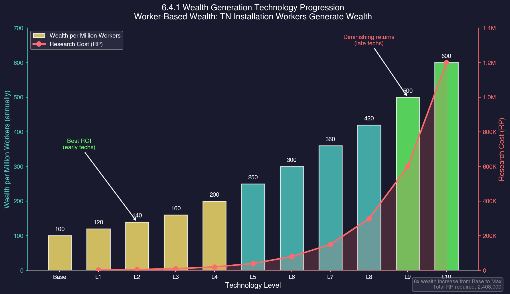
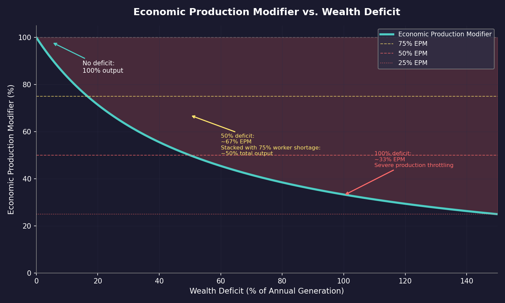
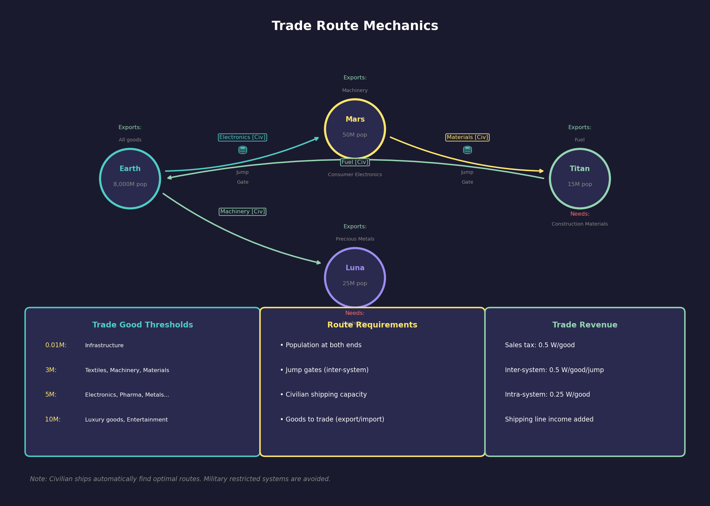

# 6.4 Wealth and Trade

*Updated: v2026.01.30*

Wealth in Aurora C# represents the financial resources of your empire. While minerals are the physical building blocks, wealth covers the economic services, administrative costs, and financial infrastructure that keep your civilisation running.

---

## Contents

*Updated: v2026.01.30*

{: .no_toc }

- TOC
{:toc}

## 6.4.1 Wealth Generation

*Updated: v2026.01.30*

In C# Aurora, wealth generation is fundamentally tied to industrial output rather than total population. This represents a significant departure from VB6 Aurora's population-based wealth system.

### 6.4.1.1 Worker-Based Wealth Production

Each 1 million workers in Trans-Newtonian (TN) installations produces a baseline of **100 wealth per annum** \hyperlink{ref-6.4-1}{[1]}, regardless of whether their assigned installation is actively building or producing. Workers generate wealth simply by being employed at TN installations.

**Excluded Sources:** Workers in Conventional Factories and Forced Labour Camps do not generate wealth. This design encourages building dedicated TN industry rather than relying on raw population numbers.

### 6.4.1.2 Wealth Generation Technology

A dedicated technology line replaces the VB6 Civilian Economy system for improving wealth output:

| Tech Level | Wealth per Million Workers | Research Cost |
|---|---|---|
| Base | 100 | (starting) |
| Level 1 | 120 | 3,000 RP |
| Level 2 | 140 | 5,000 RP |
| Level 3 | 160 | 10,000 RP |
| Level 4 | 200 | 20,000 RP |
| Level 5 | 250 | 40,000 RP |
| Level 6 | 300 | 80,000 RP |
| Level 7 | 360 | 150,000 RP |
| Level 8 | 420 | 300,000 RP |
| Level 9 | 500 | 600,000 RP |
| Level 10 (Max) | 600 | 1,200,000 RP |

\hyperlink{ref-6.4-1}{[1]}

This allows players to improve baseline wealth output through targeted research investment.

### 6.4.1.3 Financial Centres

Financial Centres are ground installations that generate supplementary wealth:

- Each Financial Centre generates wealth equal to the tax from 250,000 workers \hyperlink{ref-6.4-2}{[2]}
- Financial Centres can be transported between colonies (unlike VB6)
- Each centre requires 50,000 workers to staff \hyperlink{ref-6.4-2}{[2]}
- Conventional Industry functions as 1/10th of a Financial Centre \hyperlink{ref-6.4-3}{[3]}
- Conventional Industry can be converted to Financial Centres at a cost of 20 Build Points, requiring 20 Corbomite \hyperlink{ref-6.4-4}{[4]}

**Starting Financial Centres:** New Trans-Newtonian races start with a number of Financial Centres equal to one quarter of their starting Construction Factories. For example, a race beginning with 100 Construction Factories automatically receives 25 Financial Centres. This ensures new races have adequate financial infrastructure proportional to their industrial capacity without requiring manual setup. *(unverified — [#837](https://github.com/ErikEvenson/aurora-manual/issues/837) -- requires live testing: ratio is game startup logic not stored in DB)*

### 6.4.1.4 Wealth Generation Formula

Total wealth income = (TN Installation Workers in millions x Wealth per Million Tech Level) + (Financial Centres x Wealth per Centre) + (Trade Income)

### 6.4.1.5 Trade Good Production Modifiers

Civilian production of trade goods is affected by multiple factors:

- **Population size** of the colony
- **Race wealth creation rate** (racial attribute)
- **Production rate** of each specific trade good
- **Political status** of the colony
- **Wealth modifier** of planetary and sector governors
- **Radiation levels** on the colony (C# addition -- higher radiation reduces trade good output)
- **Unrest levels** on the colony (C# addition -- civil unrest reduces trade good output)

The C# version expands the modifier system beyond the VB6 baseline by incorporating radiation and unrest, making trade good production more dynamic and responsive to colony conditions. Players must consider environmental and social factors when optimising economic output.

### 6.4.1.6 Maximum Wealth Balance

A race's wealth balance can never exceed double the annual wealth income. Any excess beyond that cap is assumed to be spent on improving the lives of its citizens and is automatically removed.

- **Cap Formula:** Maximum Wealth = 2 x Annual Wealth Income \hyperlink{ref-6.4-7}{[7]}
- **Excess Funds:** Any amount exceeding the cap is consumed automatically each cycle
- **Design Purpose:** This addresses a gameplay issue in Conventional Start games where races could accumulate excessive wealth reserves, removing meaningful economic decisions. The cap ensures players face recurring resource allocation choices rather than building unlimited reserves.

### 6.4.1.7 Wealth History

The Economics window's Wealth/Trade tab includes a Wealth History section that tracks wealth balance over time.

**Displayed Data:**

- Construction phase date for each entry
- Duration/length of that phase
- Wealth amount at that point in time
- Total wealth change since the previous recording
- Daily rate of change (normalised across different phase lengths)

The current construction phase appears at the top of the list. By normalising the daily rate of change, the system accounts for varying construction phase durations, providing accurate economic trend analysis. This replaces the wealth change display that previously appeared in the window's title bar.

### 6.4.1.8 Taxes

The tax rate affects wealth generation from population. Higher taxes generate more wealth but can negatively affect population morale and growth.

- Tax rate is adjustable per colony via the Economics window *(unverified — [#837](https://github.com/ErikEvenson/aurora-manual/issues/837) -- requires live testing: UI controls not stored in DB)*
- The tax rate range and default value are not exposed in the game database; they are controlled through the in-game UI *(unverified — [#837](https://github.com/ErikEvenson/aurora-manual/issues/837) -- requires live testing)*
- Very high tax rates reduce population growth and can trigger unrest *(unverified — [#837](https://github.com/ErikEvenson/aurora-manual/issues/837) -- requires live testing: tax effect mechanics not stored in DB)*
- Very low tax rates boost morale and growth but reduce income *(unverified — [#837](https://github.com/ErikEvenson/aurora-manual/issues/837) -- requires live testing)*
- A separate **shipping line tax** (0-100%) can be configured at the race level to tax civilian shipping line profits \hyperlink{ref-6.4-6}{[6]}

> **Note:** Tariff mechanics for inter-empire trade are covered in [Section 15.3 Treaties](../15-diplomacy/15.3-treaties.md) under trade agreement terms.

### 6.4.1.9 Strategic Implications

The worker-based wealth system means:

- **High population, low industry** nations generate minimal wealth (solving a VB6 balance issue)
- **Conventional starts** do not generate excessive wealth reserves
- **Industrial expansion** directly increases wealth income
- Building more TN installations provides both production AND wealth

> **Tip:** Every TN installation you build serves double duty -- it produces its designated output AND generates wealth from its workers. This means expanding your industrial base has a built-in economic benefit beyond the direct production. Prioritise TN installations over Conventional Industry as soon as possible.

## 6.4.2 Wealth Consumption

*Updated: v2026.01.30*

Many activities consume wealth each production cycle \hyperlink{ref-6.4-7}{[7]}. Running a deficit will deplete your reserves and trigger production penalties.

**Wealth Expense Categories:**

The game tracks wealth expenditure across the following categories \hyperlink{ref-6.4-7}{[7]}:

- **Shipbuilding:** Each ship and PDC costs wealth equal to its BP value during construction
- **Shipyard Modifications:** Expanding, retooling, or adding slipways costs wealth
- **Installation Construction:** Factories, mines, and other installations cost wealth to build
- **Research:** All research projects consume wealth
- **Ordnance Production:** Missiles and other ordnance have wealth costs alongside mineral costs
- **Fighter Production:** Fighter construction consumes wealth
- **Ship Component Production:** Prefabricated components cost wealth to produce
- **Maintenance Facility Operation:** Running maintenance facilities costs wealth
- **Maintenance Supply Production:** Producing MSP costs 1 wealth per 4 MSP (plus 0.5 Duranium, 0.25 Uridium, 0.25 Gallicite per 4 MSP)
- **Ground Unit Training:** Training new ground formations costs wealth
- **Ground Unit Maintenance:** All ground units cost 12.5% of their build cost per year in wealth, at all times
- **Ship Repairs and Refits:** Repairing damage and refitting ships costs wealth
- **PDC-related Construction:** Building and modifying PDCs costs wealth
- **Orbital Habitat Construction:** Building orbital habitats costs wealth
- **Civilian Contracts and Subsidies:** Shipping line subsidies and civilian contracts consume wealth

**Wealth Income Categories:**

Income sources include \hyperlink{ref-6.4-7}{[7]}: Worker Taxes (primary source), Financial Centres, Trade Income, Tariff Income, shipping line taxes (on trade goods, exports, colonists, passenger liners, mining, fuel), mineral/installation/ordnance/fighter/technology/ship sales, and scrap recovery.

**Wealth Balance Cap:**

A race's wealth balance can never exceed **double its annual wealth generation**. Any surplus beyond this cap is automatically consumed, representing improved living standards for the population. This prevents indefinite wealth hoarding and means empires must maintain ongoing income rather than relying on savings.

**Maintenance Cost Reduction:**

- Mothballing ships (placing them in reserve) significantly reduces their maintenance costs but makes them unavailable for immediate use *(unverified — [#837](https://github.com/ErikEvenson/aurora-manual/issues/837) -- requires live testing: MaintenanceState column exists but reduction percentage not stored in DB)*.
- Scrapping obsolete ships (see [Section 9.2.3 Scrapping](../9-fleet-management/9.2-construction-and-refit.md)) eliminates their maintenance burden entirely and recovers some minerals.

### 6.4.2.1 Wealth Deficit and the Economic Production Modifier

When an empire's wealth balance drops below zero, the **Economic Production Modifier (EPM)** reduces the output of all installations that consume resources. The EPM is displayed as a percentage of normal output in the Economics window.

**How it works:**

- As long as wealth remains at or above zero, there is **no penalty** -- the EPM stays at 100%
- Once wealth goes negative, the EPM drops below 100%, scaling based on the size of the deficit relative to annual wealth generation
- The deeper the deficit, the worse the penalty -- an empire deeply in debt sees its entire industrial capacity throttled
- The EPM affects: shipbuilding, all factory construction, ordnance and fighter production, maintenance supply production, shipyard expansion, and research

**Stacking with other modifiers:**

The EPM stacks **multiplicatively** with other production modifiers, not additively. For example:

- 75% EPM (wealth deficit) x 75% Manufacturing Efficiency (worker shortage) = 56.25% effective output
- 80% EPM x 90% Political Stability x 100% Manufacturing Efficiency = 72% effective output

Other production modifiers that stack with EPM include:

- **Manufacturing Efficiency:** Reduced when insufficient TN workers are available to staff all installations, or by planetary radiation (0.01% reduction per radiation point; at 10,000 radiation, efficiency drops to 0%)
- **Political Status Modifier:** Reduced for subjugated populations
- **Political Stability Modifier:** Reduced by colony unrest from overcrowding or insufficient protection level

**Recovering from deficit:**

- Mothball excess ships to reduce maintenance costs immediately
- Increase the tax rate for a quick wealth boost
- Expand TN industry to increase worker tax revenue
- Build or convert to Financial Centres for additional wealth generation
- Sell surplus minerals, installations, or ordnance

**Monitoring Wealth:**

The Economics window shows your current wealth reserves, income, and expenditure. The wealth line in the summary section shows your net income (positive or negative) per production cycle. The EPM percentage is displayed when it falls below 100%.

> **Warning:** The multiplicative stacking of production modifiers means a wealth deficit combined with other penalties (worker shortages, unrest) can devastate industrial output far more than any single factor alone. A 25% reduction from each of three sources produces only 42% output, not 25%.

> **Warning:** Before embarking on a major shipbuilding programme, check your projected maintenance costs. A fleet of 50 destroyers might win battles, but if you cannot afford to maintain them, the resulting wealth deficit will throttle your entire empire's production. Balance fleet size against your economic capacity.

## 6.4.3 Trade and Shipping Lines

*Updated: v2026.01.29*

Trade in Aurora C# operates through civilian shipping lines that autonomously transport goods between your colonies. The C# version features a significantly improved civilian trade algorithm compared to VB6.

### 6.4.3.1 Trade Route Selection Process

Civilian freighters without active orders search known space systematically to find profitable routes:

1. **Pickup Location:** Identify the closest population with export trade goods, accounting for other freighters already en route to that location
2. **Delivery Location:** Find the nearest population requiring that trade good as an import
3. **Alternative Routes:** If no suitable destination exists for the first trade good, check other trade goods at the pickup point, then expand to the next-closest populations
4. **Full Search:** The system checks every possible combination of populations and trade good routes in known space before assigning orders

**Performance:** In developer testing, routing 364 civilian freighters across 495 star systems with 345 populations required only 1.01 seconds, creating 1,896 individual movement orders including Lagrange point shortcuts. *(source: developer changelog -- performance figures are historical benchmarks, not verifiable from DB)*

### 6.4.3.2 Infrastructure Transport Priority

Infrastructure transport is checked before other trade goods:

- Freighters distinguish between Low Gravity Infrastructure and normal infrastructure
- They deliver the appropriate type to suitable destinations based on the body's gravity
- This ensures new colonies receive the correct infrastructure type automatically

### 6.4.3.3 Trade Route Pathfinding

Routes include Lagrange point shortcuts where beneficial, optimising travel efficiency across multi-system empires.

### 6.4.3.4 Installation Transport Costs

The cost for civilian transport of installations uses a distance and cargo-based formula:

**Cost = 5 x Installations x Systems Travelled x (Cargo Points / 25,000)** *(unverified — [#837](https://github.com/ErikEvenson/aurora-manual/issues/837) -- requires live testing: formula from changelog, game logic not stored in DB)*

This replaces the flat VB6 fees (10 wealth for multi-system, 5 for same-system) with a more nuanced system that accounts for distance and cargo size.

### 6.4.3.5 Trade Goods

Colonies automatically produce and consume trade goods based on their population. There are 17 types of trade goods \hyperlink{ref-6.4-5}{[5]}, unlocked at specific population thresholds:

| Pop. Threshold | Trade Goods Available |
|---|---|
| 0.01M | Infrastructure* |
| 3M | Construction Materials, Machinery, Textiles |
| 5M | Ancient Artifacts**, Chemicals, Civilian Transport, Consumer Electronics, Pharmaceuticals, Plastics, Precious Metals |
| 10M | Entertainment Products, Furs, Luxury Food, Recreational Drugs, Spices, Wines |

\hyperlink{ref-6.4-5}{[5]}

*\* Infrastructure trade goods convert to actual infrastructure installations upon delivery.*

*\*\* Ancient Artifacts require proximity to ruins sites in addition to the population threshold. A colony at 5M population without nearby ruins will not produce Ancient Artifacts.*

Each trade good occupies 2,500 tons of cargo space (one-tenth of a standard cargo hold), allowing freighters to carry multiple goods per trip. *(unverified — [#837](https://github.com/ErikEvenson/aurora-manual/issues/837) -- requires live testing: cargo size is game logic not stored in DIM_TradeGoods)*

### 6.4.3.6 Supply and Demand Formulas

Trade good production and consumption are governed by:

**Supply per year** = Population (millions) x 2 x (Wealth Creation Tech / 100) x Governor Bonus x Random Factor (10%-300%) *(unverified — [#837](https://github.com/ErikEvenson/aurora-manual/issues/837) -- requires live testing: formula from changelog, game logic not stored in DB)*

**Demand per year** = Population (millions) x 3 x Governor Bonus *(unverified — [#837](https://github.com/ErikEvenson/aurora-manual/issues/837) -- requires live testing: formula from changelog)*

Infrastructure always uses a 100% random factor (no variance), ensuring predictable infrastructure supply. *(unverified — [#837](https://github.com/ErikEvenson/aurora-manual/issues/837) -- requires live testing)*

### 6.4.3.7 Trade Revenue

Trade generates wealth through sales and shipping taxes:

| Revenue Type | Amount (C# Aurora) |
|---|---|
| Sales Tax | 0.5 wealth per good delivered |
| Shipping Tax (inter-system) | 0.5 wealth per good per jump traversed |
| Shipping Tax (intra-system) | 0.25 wealth per good |

*(unverified — [#837](https://github.com/ErikEvenson/aurora-manual/issues/837) -- requires live testing: trade revenue rates from changelog, game logic not stored in DB)*

Shipping lines receive fixed wealth for their services: 1 wealth per good per jump in C# (0.5 for same-system deliveries). *(unverified — [#837](https://github.com/ErikEvenson/aurora-manual/issues/837) -- requires live testing)*

### 6.4.3.8 Trade Route Requirements

For trade to occur between two colonies:

- Both colonies must have population above the relevant trade good unlock threshold
- There must be civilian shipping capacity available (civilian shipping lines must exist with ships)
- The colonies should have goods to trade (trade goods for export and import)
- Inter-system trade requires a two-way Jump Gate network (see [Section 4.4 Jump Points](../4-systems-and-bodies/4.4-jump-points.md); civilian ships cannot use jump drives)
- Trade treaties enable commerce with other empires and allow foreign shipping within your territory
- Goods move point-to-point: each freighter carries a single trade good type to a single destination

### 6.4.3.9 Protecting Trade

Civilian ships are unarmed and vulnerable to hostile action. If alien races or hostile NPR ships destroy civilian traders:

- Trade income decreases
- Civilian shipping lines may reroute away from dangerous systems
- New civilian ships take time to build and replace losses
- Protecting trade lanes is a significant military responsibility as your empire expands

> **Tip:** Trade income scales naturally with empire size. The improved C# algorithm efficiently finds optimal routes across even very large empires. Focus on expanding your number of developed colonies and keeping shipping lanes safe rather than trying to micromanage trade routes.

## Related Sections

- [Section 6.3 Construction](6.3-construction.md) -- Building Financial Centres and industrial installations
- [Section 6.5 Civilian Economy](6.5-civilian-economy.md) -- Civilian shipping lines and trade mechanics
- [Section 5.1 Establishing Colonies](../5-colonies/5.1-establishing-colonies.md) -- Creating new trade destinations
- [Section 4.4 Jump Points](../4-systems-and-bodies/4.4-jump-points.md) -- Jump gate networks enabling inter-system trade
- [Section 14.2 Maintenance](../14-logistics/14.2-maintenance.md) -- Military and civilian freight operations
- [Section 15.3 Treaties](../15-diplomacy/15.3-treaties.md) -- Trade agreements require diplomatic relations
- [Section 15.4 Diplomacy](../15-diplomacy/15.4-diplomacy.md) -- Diplomatic status levels enabling or restricting trade
- [Section 16.3 Assignments](../16-commanders/16.3-assignments.md) -- Governor bonuses affecting wealth generation

## References

\hypertarget{ref-6.4-1}{[1]} AuroraDB.db: FCT_TechSystem wealth generation tech line (TechTypeID=103, "Racial Wealth Creation") shows base 100 wealth per million TN workers, progressing: 120 (3,000 RP), 140 (5,000 RP), 160 (10,000 RP), 200 (20,000 RP), 250 (40,000 RP), 300 (80,000 RP), 360 (150,000 RP), 420 (300,000 RP), 500 (600,000 RP), 600 (1,200,000 RP).

\hypertarget{ref-6.4-2}{[2]} AuroraDB.db: DIM_PlanetaryInstallation "Financial Centre" (ID 25) shows FinancialProductionValue=0.25 (representing 250,000 worker-equivalent wealth), Workers=0.05 (50,000 workers to staff), Cost=120 BP.

\hypertarget{ref-6.4-3}{[3]} AuroraDB.db: DIM_PlanetaryInstallation "Conventional Industry" (ID 38) shows FinancialProductionValue=0.025. Financial Centre FinancialProductionValue=0.25. Ratio: 0.025/0.25 = 1/10. Confirmed.

\hypertarget{ref-6.4-4}{[4]} AuroraDB.db: DIM_PlanetaryInstallation "Convert CI to Financial Centre" (ID 50) shows Cost=20 BP, requires 20 Corbomite. Note: the conversion is from Conventional Industry (CI), not from "Conventional Factories" as previously stated.

\hypertarget{ref-6.4-5}{[5]} AuroraDB.db: DIM_TradeGoods table lists 17 trade goods with population thresholds (PopRequired): Infrastructure (0.01M), Construction Materials/Machinery/Textiles (3M), Ancient Artifacts/Chemicals/Civilian Transport/Consumer Electronics/Pharmaceuticals/Plastics/Precious Metals (5M), Entertainment Products/Furs/Luxury Food/Recreational Drugs/Spices/Wines (10M). Note: Previous text incorrectly placed Ancient Artifacts, Consumer Electronics, and Precious Metals at 10M; the database confirms they unlock at 5M.

\hypertarget{ref-6.4-6}{[6]} AuroraDB.db: FCT\_Race.ShippingLineTax column (Double type, default 0) confirms shipping line tax rate is stored per race. Range: 0-100%.

\hypertarget{ref-6.4-7}{[7]} AuroraDB.db: DIM\_WealthUse table defines 52 wealth categories (income and expense). Expense categories include: Shipbuilding (ID 5), PDC-related Construction (ID 41), Installation Construction (ID 4), Research (ID 7), Ordnance Production (ID 2), Fighter Production (ID 3), Ship Component Production (ID 40), Ground Unit Training (ID 6), Ground Unit Maintenance (ID 1), Maintenance Facility Operation (ID 12), Maintenance Supplies (ID 28), Shipyard Modifications (ID 27), Ship Repairs (ID 49), Ship Refits (ID 50), Orbital Habitat Construction (ID 45), Civilian Contracts (ID 44), Shipping Line Subsidy (ID 42). Income categories include: Worker Taxes (ID 11), Financial Centres (ID 39), Trade Income (ID 9), Tariff Income (ID 10), and various shipping/sale taxes (IDs 32-36, 43, 47). AuroraWiki "C-Wealth" and "Population and Production" pages confirm: Economic Production Modifier (EPM) scales with deficit-to-annual-wealth ratio; production modifiers stack multiplicatively; wealth cap = 2x annual generation; ground unit maintenance = 12.5% of cost/year; MSP cost = 1 wealth per 4 MSP.
