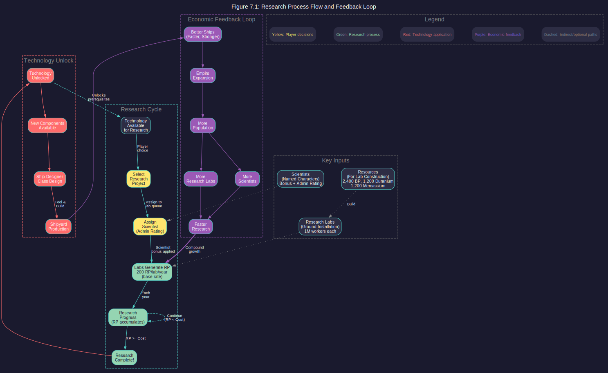
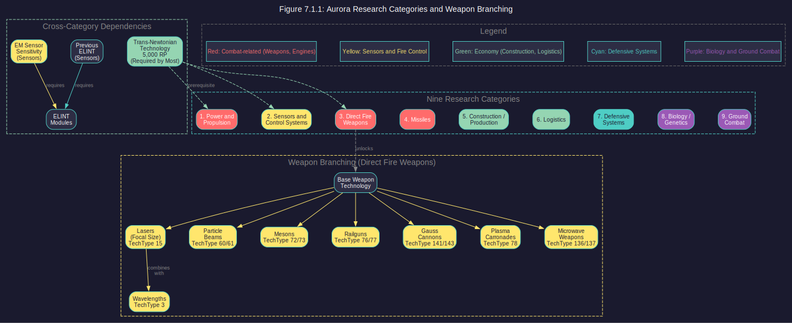
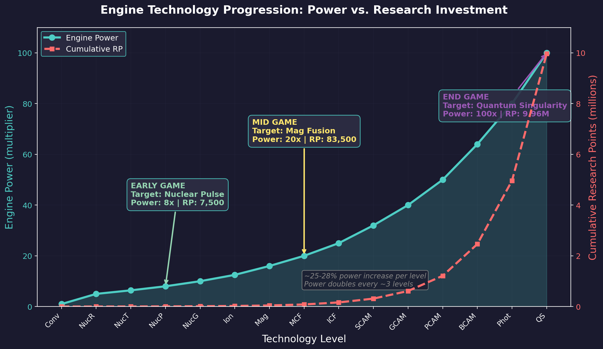
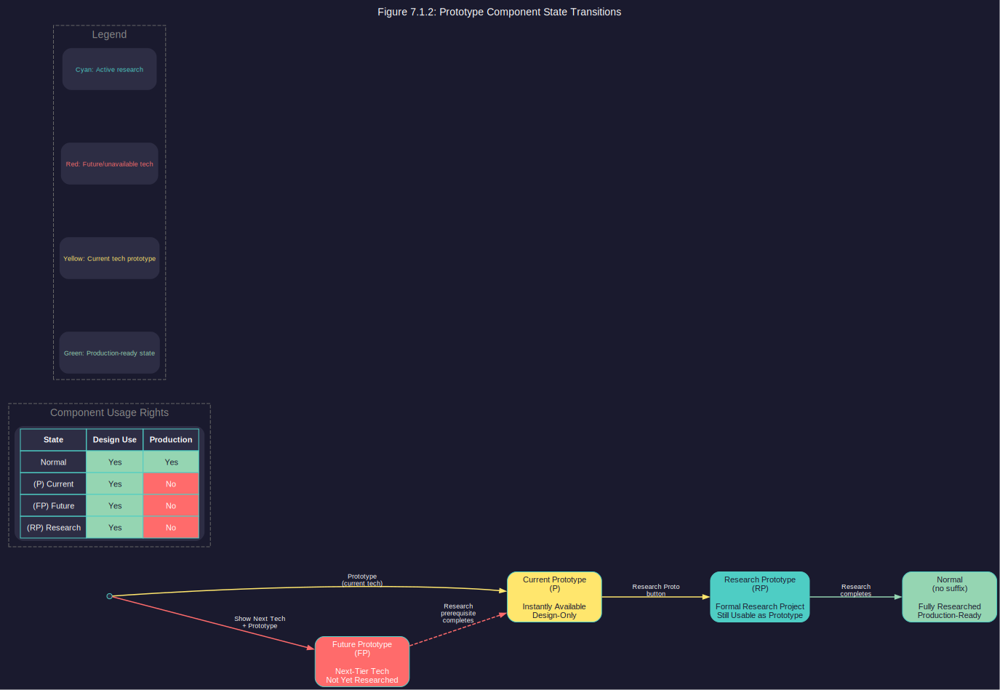
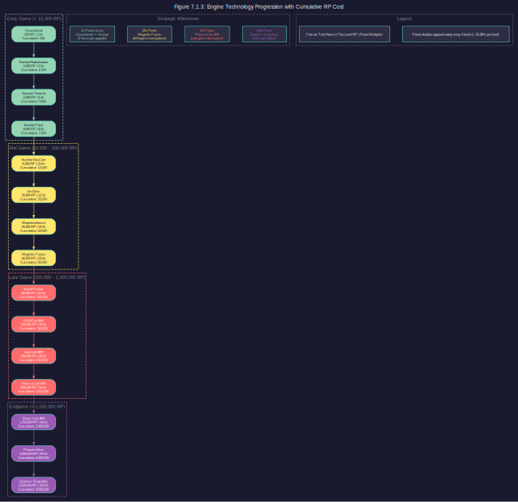

# 7.1 Technology Tree

*Updated: v2026.02.01*

> **[Screenshot Pending — #843]** Research window showing available projects, scientist assignments, category tabs, and research progress.

Research is the engine of progress in Aurora C#. Every improvement to your ships, weapons, engines, sensors, and industrial capacity comes through technological advancement. The technology tree is vast, branching, and full of strategic choices that shape the character of your empire.

## 7.1.1 Tech Structure

*Updated: v2026.02.01*

Aurora's technology tree is organized into nine major research categories, each containing dozens of individual technologies. Technologies within a category form chains of increasing capability, where each new level builds upon the previous one.

**Category-Based Organization:**

Technologies are grouped by function:

1. Power and Propulsion
2. Sensors and Control Systems
3. Direct Fire Weapons
4. Missiles
5. Construction / Production
6. Logistics
7. Defensive Systems
8. Biology / Genetics
9. Ground Combat

> **Note:** The in-game research window displays these categories in a different order than some documentation. "Direct Fire Weapons" encompasses both energy weapons (lasers, particle beams) and kinetic weapons (railguns, gauss cannons). Ground Combat is a separate category from Logistics.\hyperlink{ref-7.1-1}{[1]}

Each category contains multiple technology lines -- sequences of related technologies of increasing power and cost. See [Section 7.1.3 Prerequisite Chains](#713-prerequisite-chains) for a detailed engine technology progression diagram.

**Technology Levels:**

Within each technology line, individual technologies represent discrete improvements. For example, the engine technology line progresses through 15 levels:\hyperlink{ref-7.1-3}{[3]}

The table below provides reference data for calculations (the chart above visualizes the same progression):

| Engine Technology | RP Cost | Engine Power |
|---|---|---|
| Conventional Engine (starting tech) | 500 | 1.0 |
| Nuclear Radioisotope Engine | 1,000 | 5.0 |
| Nuclear Thermal Engine | 2,000 | 6.4 |
| Nuclear Pulse Engine | 4,000 | 8.0 |
| Nuclear Gas-Core Engine | 6,000 | 10.0 |
| Ion Drive | 10,000 | 12.5 |
| Magneto-plasma Drive | 20,000 | 16.0 |
| Magnetic Confinement Fusion Drive | 40,000 | 20.0 |
| Inertial Confinement Fusion Drive | 80,000 | 25.0 |
| Solid Core Anti-matter Drive | 150,000 | 32.0 |
| Gas Core Anti-matter Drive | 300,000 | 40.0 |
| Plasma Core Anti-matter Drive | 600,000 | 50.0 |
| Beam Core Anti-matter Drive | 1,250,000 | 64.0 |
| Photonic Drive | 2,500,000 | 80.0 |
| Quantum Singularity Drive | 5,000,000 | 100.0 |

Each level provides a significant improvement over the previous one. The increase per level is roughly 25-28%, meaning engine power approximately doubles every three levels.\hyperlink{ref-7.1-3}{[3]}

## 7.1.2 Prototype Components

*Updated: v2026.01.30*

The prototype system allows designers to test and experiment with components before committing to full research projects. This enables experimental class designs and strategic planning of future technology transitions.

**Prototype States:**

Components can exist in four states, indicated by suffixes in the component name:

| State | Suffix | Description |
|---|---|---|
| Normal | (none) | Fully researched, production-ready |
| Current Prototype | (P) | Instantly available using current tech, design-only |
| Future Prototype | (FP) | Uses next-tier tech not yet researched |
| Research Prototype | (RP) | Converted to formal research project, still usable as prototype |

**Creating Prototypes:**

In the Create Research Project or Turret Design windows, selecting "Prototype" instead of "Create" produces an instantly-available component marked with the (P) suffix. No research time is required -- the component is immediately available for use in class designs.

**Future Tech Prototypes:**

The Create Project window includes a "Show Next Tech" checkbox. When enabled, it displays the next available technology tier in design options. For example, if you have researched 12cm lasers and Visible Light wavelength, checking "Show Next Tech" adds 15cm and Near Ultraviolet to the available choices. Components created using next-tier technology are marked with an (FP) suffix and are only available as prototypes.

**Converting to Research Prototypes:**

When selecting a current-tech prototype (P) on the Class Design window, a "Research Proto" button appears. Clicking this converts it to a Research Prototype (RP), which then appears in the Research tab of the Economics window in the appropriate Research Field. Research Prototypes can be researched like any standard component, but they remain available for class design as prototypes until research completes. Once research finishes, the prototype designation is removed and the component becomes standard technology.

**Restrictions on Prototype Classes:**

- Classes containing any prototype components display a (P) designation
- Prototype classes cannot be tooled in shipyards (they cannot be produced)
- Prototype energy weapons restrict turrets to prototype status only
- Obsolete prototypes display only when both the Obsolete and Prototype toggles are active

**Strategic Application:**

The prototype system enables a powerful design workflow:

1. Design future components using "Show Next Tech" to create (FP) prototypes
2. Build experimental class designs using multiple prototype components
3. Evaluate the design's effectiveness before committing research resources
4. Convert prototypes to Research Prototypes (RP) and formally research them
5. Once all components are researched, the class loses its (P) designation and becomes production-ready for shipyard tooling

This allows players to plan entire fleet generations in advance, designing ship classes that will become buildable as research progresses.

**Branching:**

Some technology lines branch, offering different specialization paths. For example, weapon technologies branch into different weapon types (lasers, particle beams, mesons, plasma carronades, railguns, and others), each with its own progression chain and distinct TechTypeID in the game database \hyperlink{ref-7.1-5}{[5]}.

**Independent Lines:**

Not all technologies in a category are sequential. A category may contain several independent technology lines that can be researched in parallel. For example, within Defensive Systems you might research armour technology independently from shield technology.

> **Tip:** Study the technology tree early in your game to plan a coherent research strategy. Random research leads to mediocre capabilities across the board. Focused research in key areas creates decisive advantages sooner.

## 7.1.3 Prerequisite Chains

*Updated: v2026.02.01*

Most technologies have prerequisites -- earlier technologies that must be researched before the new one becomes available. These prerequisites create the "tree" structure, with early, cheap technologies unlocking access to later, more expensive ones.

**How Prerequisites Work:**

- Each technology lists its required prerequisite(s) in the research window.
- A technology cannot be assigned to a research lab until all its prerequisites are complete.
- Some technologies have multiple prerequisites from different categories (cross-category requirements).
- A few technologies have no prerequisites and are available from game start.

**Key Research Paths:**

Several research paths are particularly important for early development:

**Engine Path (Power and Propulsion):**
Drives all ship speed improvements (see [Section 8.3 Engines](../8-ship-design/8.3-engines.md)). Higher engine technology means faster ships, which translates directly into strategic mobility and tactical advantage. Engine power increases roughly 25-28% per tech level, approximately doubling every three levels.\hyperlink{ref-7.1-3}{[3]}

**Reactor Path (Power and Propulsion):**
Provides power for ship systems. Higher reactor technology means more power in less space, enabling more capable ship designs with advanced weapons and sensors \hyperlink{ref-7.1-6}{[6]}.

**Weapon Paths (Energy Weapons / Kinetic Weapons / Missiles):**
These branch into specialized weapon types (see [Section 8.5 Weapons](../8-ship-design/8.5-weapons.md)). Choose your doctrine early:

- Energy weapons (lasers, particle beams) for sustained close-range fire
- Kinetic weapons (railguns, gauss cannons) for point defence and close combat
- Missiles for long-range stand-off engagement

**Construction Rate (Construction and Production):**
Increases factory output per year. Early investment here accelerates all subsequent construction, creating compound economic benefits.

**Mining Production (Construction and Production):**
Increases per-mine mineral output. Similar compound benefits to construction rate.

**Early-Game Priority Path: First Survey Ship**

Building your first geological survey ship requires researching specific technologies in a particular order. This is the critical early-game research path that unlocks system exploration:

1. **Trans-Newtonian Technology** (5,000 RP; prerequisite for all other research; ~1.25 years with 20 labs at 200 RP/year)\hyperlink{ref-7.1-4}{[4]}
2. **Radioisotope Thermal Generator** (600 RP; Power and Propulsion; prerequisite for the engine)\hyperlink{ref-7.1-4}{[4]}
3. **Nuclear Radioisotope Engine** (1,000 RP; Power and Propulsion; the survey ship engine)\hyperlink{ref-7.1-4}{[4]}
4. **Fuel Consumption 0.9, then 0.8** (1,000 RP + 2,000 RP; Power and Propulsion; reduces fuel use -- research BEFORE designing the engine, as improvements are not retroactive)\hyperlink{ref-7.1-4}{[4]}
5. **Maximum Engine Size 40** (2,000 RP; Power and Propulsion; enables 25+ HS for commercial engines)\hyperlink{ref-7.1-4}{[4]}
6. **Geological Survey Sensors** (1,000 RP; Sensors and Fire Control; the survey sensor itself)\hyperlink{ref-7.1-4}{[4]}

After all technologies are complete, you must also create the engine component in the Create Research Project window and research it before it becomes available for ship design. The component RP cost depends on the specific engine design parameters.

**Approximate timeline with 20 research labs at 200 RP/year (4,000 RP/year, no scientist bonus):**\hyperlink{ref-7.1-4}{[4]}

| Phase | Technologies (RP Cost) | Duration |
|-------|-------------|----------|
| 1 | Trans-Newtonian Technology (5,000 RP) | ~15 months |
| 2 | RTG (600 RP) + Nuclear Radioisotope Engine (1,000 RP) | ~5 months |
| 3 | Fuel Consumption 0.9 (1,000 RP) and 0.8 (2,000 RP) | ~9 months |
| 4 | Maximum Engine Size 40 (2,000 RP) | ~6 months |
| Parallel | Geological Survey Sensors (1,000 RP, different category) | Runs alongside phases 2-4 |

Total: approximately 2.5-3 years before first ship design is possible (scientist bonuses reduce this significantly).

**Lab allocation tips for this path:**

- Assign your highest-capacity scientist (highest admin rating) to the critical Power and Propulsion chain, even if their bonus is lower. A scientist managing 20 labs at 0% bonus outproduces one managing 5 labs at 20% bonus on long projects.
- Geological Survey Sensors is in the Sensors and Fire Control category, so it can be researched in parallel with the engine path using a second scientist.
- Temporarily redistribute labs from less urgent projects to accelerate the critical path.

> **Tip:** Design your engine component only after Fuel Consumption 0.8 completes. Fuel efficiency improvements do not apply retroactively to already-designed engines, so designing too early locks you into higher fuel consumption.

**Cross-Category Dependencies:**

Some advanced technologies require research from multiple categories. For example:

- Electronic Intelligence modules require both the previous ELINT module and progressively higher EM Sensor Sensitivity technology.\hyperlink{ref-7.1-3}{[3]}
- Jump point theory requires specific physics research before jump drive components become available.\hyperlink{ref-7.1-3}{[3]}
- Many technologies require Trans-Newtonian Technology (Power and Propulsion) as a prerequisite regardless of their own category.\hyperlink{ref-7.1-3}{[3]}

**Planning Ahead:**

Because prerequisites form long chains, starting a research path late means potentially decades of catch-up before you reach useful technologies. Key strategic decisions to make early:

- What is your primary weapon doctrine? (This determines which weapon category to prioritize.)
- Will you focus on speed or armour? (Affects Power and Propulsion vs. Defensive Systems priority.)
- How quickly do you need to expand? (Affects Construction and Production priority.)

> **Tip:** Research the prerequisite chains for your desired endgame technologies and work backwards. If you want Beam Core Anti-Matter engines, you need to start the engine tech line early because there are 13 levels to research.\hyperlink{ref-7.1-3}{[3]} A mid-game decision to switch from missiles to beam weapons means years of catching up on energy weapon prerequisites.

## 7.1.4 Tech Costs

*Updated: v2026.01.30*

Each technology has a research point (RP) cost that determines how long it takes to research given your current research capacity. Costs escalate significantly with each technology level.

**Cost Scaling:**

Technology costs in Aurora scale exponentially within each technology line. Early technologies might cost a few hundred RP, while advanced technologies in the same line can cost tens of thousands or hundreds of thousands of RP. This exponential scaling means each successive level takes proportionally longer to research, even as your research capacity grows.

**Example Cost Progression -- Engine Technology Line:**\hyperlink{ref-7.1-3}{[3]}

Costs vary significantly between technology lines. The engine line illustrates typical exponential scaling: 500 RP (Conventional) to 5,000,000 RP (Quantum Singularity Drive) across 15 levels. The armour line ranges from 125 RP (Conventional Steel) to 2,500,000 RP (Collapsium) across 15 levels. See the engine table in Section 7.1.1 and the armour table in [Section 7.4 Tech Categories](7.4-tech-categories.md) for complete verified progressions.

**Research Point Generation:**

Research points are generated by:

- Research labs (ground installations; see [Section 7.3 Research Facilities](7.3-research-facilities.md)) -- each lab generates **200 RP per year** at the base technology level\hyperlink{ref-7.1-2}{[2]}
- Scientist bonus -- the assigned scientist's skill (see [Section 7.2 Scientists](7.2-scientists.md)) multiplies lab output
- Number of labs assigned to the project -- more labs = faster research (with diminishing returns beyond the scientist's lab cap). Improvable through Research Rate technology.

**Research Time Calculation:**

Time to complete = RP Cost / (Labs assigned x RP per lab per year x Scientist bonus)

The number of labs a scientist can effectively supervise is limited by their administration rating. Labs beyond this cap still contribute but at a reduced rate (see [Section 7.2 Scientists](7.2-scientists.md) for details on the administration rating mechanic).

**Cost Reduction Technologies:**

There are no technologies that directly reduce research costs. However, the Research Rate technology line (in the Biology / Genetics category) increases the RP output per lab, effectively reducing the time required for any given research project.\hyperlink{ref-7.1-2}{[2]}

**Strategic Implications of Cost Scaling:**

- Early technologies provide the best "bang for the buck" -- large capability improvements for modest investment.
- The last few levels of any technology line require enormous investment for incremental improvement.
- It is usually better to have broad technological coverage (level 5 in many areas) than extreme depth (level 12 in one area, level 1 in others).
- Exception: your primary weapon and engine technologies benefit from deep investment because these are your combat differentiators.

> **Tip:** Track your research completion times. If a project will take 30+ years to complete, consider whether that scientist and those labs might produce more total value researching two or three shorter projects instead. The opportunity cost of very long research projects is substantial.

**Player-Designed Component Costs (v2.6.0):**

*Added: v2026.01.28*

Player-designed components (custom missiles, engines, sensors, etc.) have their research point costs scaled by the game's research speed setting. \hyperlink{ref-7.1-8}{[8]}

**Formula:**

Adjusted RP Cost = Base RP Cost x Research Speed

**Examples:**

| Research Speed | Effect on Player-Designed Components |
|---|---|
| 100% (default) | Full RP cost |
| 50% | 0.5x RP cost (halved) |
| 200% | 2x RP cost (doubled) |

This differs from standard (pre-defined) technology research, which is not affected by the research speed setting. The mechanic ensures that player-designed components remain proportionally balanced with the overall research pace of the game, regardless of difficulty settings.

> **Note:** This scaling applies only to research point costs, not to the time required for research (which depends on lab output and scientist bonuses). A 50% research speed game still requires the same effective lab-years to complete a project, but the target RP value is halved for player-designed components.

## 7.1.5 High-Tech Cost Progression (v2.8.0)

*Updated: v2026.01.30*

Starting in Aurora C# v2.8.0, the research cost progression for high-tech research projects has been revised to reduce the extreme cost escalation at advanced technology levels. \hyperlink{ref-7.1-7}{[7]}

**Standard High-Tech Progression:**

Research projects above 60,000 RP now follow a modified cost sequence instead of pure doubling:

| Previous Cost | New Cost | Change |
|---|---|---|
| 100,000 | 100,000 | (unchanged) |
| 200,000 | 160,000 | -20% |
| 400,000 | 240,000 | -40% |
| 800,000 | 360,000 | -55% |
| 1,600,000 | 500,000 | -69% |

The new progression uses factors of approximately 1.6x, 1.5x, 1.5x, and 1.4x between levels rather than the previous 2x doubling. This makes the most advanced technologies significantly more attainable without changing early and mid-game research pacing.

**Production-Based Tech Progression:**

Production technologies (such as Construction Rate and Mining Production) that previously followed a 40,000 → 80,000 → 160,000 RP progression now use:

| Level | Old Cost | New Cost |
|---|---|---|
| First | 40,000 | 40,000 |
| Second | 80,000 | 64,000 |
| Third | 160,000 | 100,000 |
| Fourth+ | (continued doubling) | (follows standard 160k → 240k → 360k → 500k) |

After reaching 100,000 RP, these technologies follow the standard high-tech progression described above.

**Strategic Implications:**

- Endgame technologies (Quantum Singularity Drive, Collapsium armour, etc.) are now more practical research targets
- The reduced cost curve encourages deeper specialization in key technology lines
- Long-running empires benefit more from research investment than under the previous doubling system

## UI References and Screenshots

*Updated: v2026.01.30*

- [Research Window Layout](../images/research-window.md) — technology project selection and progress tracking

## Related Sections

- [Section 7.2 Scientists](7.2-scientists.md) -- Assigning scientists to research projects
- [Section 7.3 Research Facilities](7.3-research-facilities.md) -- Building and managing research labs
- [Section 7.4 Tech Categories](7.4-tech-categories.md) -- Detailed breakdown of each research category
- [Section 8.5 Weapons](../8-ship-design/8.5-weapons.md) -- Weapon components unlocked through research
- [Section 8.3 Engines](../8-ship-design/8.3-engines.md) -- Engine components unlocked through Power and Propulsion research
- [Appendix A: Formulas](../appendices/A-formulas.md) -- Research point calculations
- [UI Reference: Research Window](../images/research-window.md) -- Annotated interface diagram

## References

\hypertarget{ref-7.1-1}{[1]} Nine research categories verified against AuroraDB.db DIM_ResearchField table, Aurora C# v2.7.1.

\hypertarget{ref-7.1-2}{[2]} Base rate of 200 RP/lab/year verified via Aurora Wiki and community sources.

\hypertarget{ref-7.1-3}{[3]} Engine technology progression, costs, and power values verified against AuroraDB.db FCT_TechSystem table (TechTypeID=40), Aurora C# v2.7.1.

\hypertarget{ref-7.1-4}{[4]} Technology costs for early-game research path verified against AuroraDB.db FCT_TechSystem table, Aurora C# v2.7.1. Trans-Newtonian Technology: 5,000 RP; RTG: 600 RP; Nuclear Radioisotope Engine: 1,000 RP; Fuel Consumption 0.9: 1,000 RP; Fuel Consumption 0.8: 2,000 RP; Maximum Engine Size 40: 2,000 RP; Geological Survey Sensors: 1,000 RP.

\hypertarget{ref-7.1-5}{[5]} Weapon type branching verified against AuroraDB.db FCT\_TechSystem table. Distinct TechTypeIDs exist for lasers (focal size TechTypeID=60, wavelength TechTypeID=3), particle beams (TechTypeID=72), mesons (TechTypeID=76), plasma carronades (TechTypeID=148), railguns (TechTypeID=136), microwave weapons (TechTypeID=150), and others.

\hypertarget{ref-7.1-6}{[6]} Reactor technology (TechTypeID=41) verified against AuroraDB.db FCT\_TechSystem table. 8 levels from Conventional Reactor (0.5 power, 150 RP) through Inertial Confinement Fusion Reactor (10.0 power, 45,000 RP). AdditionalInfo stores the power output multiplier per HS of reactor.

\hypertarget{ref-7.1-7}{[7]} Aurora Forums — https://aurora2.pentarch.org/index.php?topic=13884.msg176533 — Steve Walmsley, December 23, 2025. v2.8.0 research cost progression changes for high-tech and production-based technologies.

\hypertarget{ref-7.1-8}{[8]} Aurora Forums — https://aurora2.pentarch.org/index.php?topic=13463.0 — v2.6.0 changelog. "The research point cost for player-designed components is multipled by the research speed."
