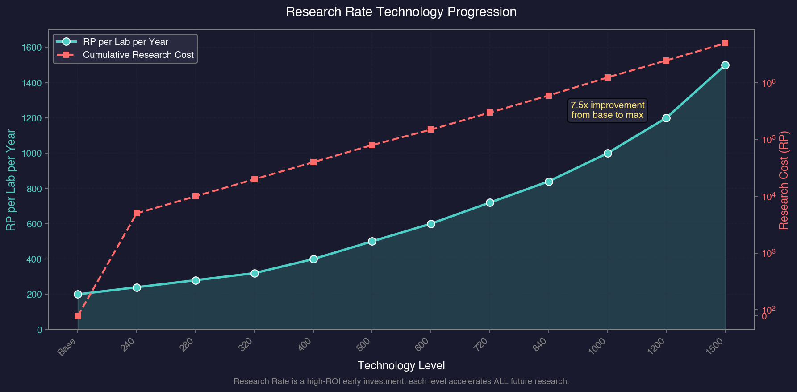

# 7.3 Research Facilities

*Updated: v2026.01.30*

> **[Screenshot Pending — #1103]** Research Lab Controls interface

Research facilities are the physical infrastructure that generates research points. Without labs, even the most brilliant scientist produces nothing. Building and managing your research infrastructure is a critical investment decision that balances immediate production needs against long-term technological advancement.

---

## Contents

*Updated: v2026.01.30*

{: .no_toc }

- TOC
{:toc}

## 7.3.1 Research Labs

*Updated: v2026.01.30*

Research labs are ground installations that generate research points (RP) when assigned to a project led by a scientist.

**Types of Research Labs:**

Aurora C# has a single type of research lab installation. All labs produce the same base RP output regardless of which research category they are assigned to. The same lab can be used for Power and Propulsion research one year and Energy Weapons the next -- they are not specialized.

**Base Output:**

Each research lab generates **200 RP per lab per year** at the starting technology level.\hyperlink{ref-7.3-1}{[1]} This output is improved through the "Research Rate" technology in the **Biology / Genetics** research category.

**Technology Improvements -- Research Rate:**

The "Research Rate" technology line in the Biology / Genetics category\hyperlink{ref-7.3-2}{[2]} increases the RP output of each lab. This should be one of the FIRST technologies researched after Trans-Newtonian Technology itself, because it provides compound benefits to all subsequent research.

Research Rate progression:\hyperlink{ref-7.3-3}{[3]}

| Technology | RP per Lab per Year | Research Cost (RP) |
|-----------|--------------------|--------------------|
| Base | 200 | -- |
| Research Rate 240 RP | 240 | 5,000 |
| Research Rate 280 RP | 280 | 10,000 |
| Research Rate 320 RP | 320 | 20,000 |
| Research Rate 400 RP | 400 | 40,000 |
| Research Rate 500 RP | 500 | 80,000 |
| Research Rate 600 RP | 600 | 150,000 |
| Research Rate 720 RP | 720 | 300,000 |
| Research Rate 840 RP | 840 | 600,000 |
| Research Rate 1000 RP | 1000 | 1,250,000 |
| Research Rate 1200 RP | 1200 | 2,500,000 |
| Research Rate 1500 RP | 1500 | 5,000,000 |

- Each level in this technology provides a significant increase to per-lab RP output.
- The compound benefit is substantial: researching this early means every subsequent technology completes faster.
- A single Research Rate improvement at 20 labs saves more RP-years of time than almost any other early research investment.
- Researching improved research rate early is a high-value investment similar to improved construction rate -- both compound over the entire game.

**Construction:**

Research labs are built by construction factories (see [Section 6.3 Construction](../6-economy-and-industry/6.3-construction.md)):

- They have a Build Point cost of **2,400 BP** for a standard lab.\hyperlink{ref-7.3-4}{[4]}
- They require **1,200 Duranium** and **1,200 Mercassium** to construct.\hyperlink{ref-7.3-4}{[4]}
- Labs are among the more expensive ground installations to build, representing a substantial investment.
- Building labs trades immediate production capacity (construction factories are building labs instead of other things) for long-term technological progress.

**Mineral Uses Quick Reference:**

Research facilities require Mercassium to build. When evaluating colony sites for research potential, consider the availability of key minerals (see [Section 6.1 Minerals](../6-economy-and-industry/6.1-minerals.md) for full details):

| Mineral | Primary Uses |
|---------|-------------|
| Duranium | Ship hulls and general construction |
| Neutronium | Armour |
| Mercassium | Research facilities, life support, infrastructure (1 per unit) |
| Corundium | Mines, laser weapons (critical bottleneck -- cannot mine without it) |
| Vendarite | Fighters and carrier craft |
| Sorium | Fuel and jump drives |
| Uridium | Sensors and weapons control systems |
| Tritanium | Missiles and ordnance |

**Population Requirements:**

Research labs require population to staff. Each lab draws workers from the colony's population pool. On smaller colonies, labs compete with mines and factories for available workers.

**Lab Allocation:**

Labs are allocated to specific research projects through the Research window:

- Each active project receives a number of labs from the colony's total.
- Unallocated labs generate no RP (they must be assigned to a project with a scientist).
- Labs can be reallocated between projects freely and instantly.
- The total labs available equals the number of lab installations on the colony.

**Add RL / Remove RL Interface:**

When you select an active research project in the Research window, controls appear to incrementally adjust lab assignments:

- **Remove RL:** Removes one research lab at a time from the selected project. Each click frees one lab, making it available for assignment to other projects.
- **Add RL:** Adds one available (unassigned) research lab to the selected project.

A practical workflow is to assign maximum labs to a priority project initially, then use Remove RL to redistribute some labs to secondary projects one at a time. This incremental approach is easier to manage than calculating exact allocations upfront.

**Cancel and Pause:**

- **Cancel:** Removes the project entirely. Research progress is preserved and the project can be resumed later with no penalty or progress loss.
- **Pause:** Suspends the project without removing it from the active list.

**Inactive Labs Auto-Stop:**

When auto-advance (automatic time advancement) is running and unassigned research labs exist -- for example, after a project completes and its labs become idle -- the game automatically pauses and displays a warning: "X inactive labs." This safety mechanic prevents accidentally wasting research time when a project finishes and its labs have nowhere to go.

> **Tip:** The inactive labs auto-stop is one of the most useful safety features in the game. It ensures you never accidentally leave research capacity idle for years while time advances. Make sure auto-advance is enabled to benefit from this warning.

**Assign New Labs (v1.12.0+):**

Research projects can be flagged with "Assign New" to automatically receive newly constructed research facilities:

- After selecting a research project and scientist, click the "Assign New" button to mark that project for auto-assignment.
- Projects flagged with Assign New display an "N" indicator next to the project name in the Research window.
- Any new research facilities built on that colony are automatically assigned to the marked project when construction completes.
- Multiple projects can be flagged; new labs are distributed in priority order.
- This eliminates the micromanagement of manually reassigning labs each time new facilities come online.

> **Tip:** Flag your highest-priority long-term research project with Assign New early in the game. As your construction factories build additional labs over months or years, they will automatically reinforce that project without manual intervention.

**Optimal Lab Counts:**

The ideal number of labs depends on your scientist pool:

- Total labs should roughly equal the sum of your scientists' administration ratings.
- Labs beyond what your scientists can supervise are wasted unless you expect new scientists soon.
- If you have more scientists than labs can support, build more labs.
- If you have more labs than scientists can supervise, invest elsewhere until new scientists appear.

> **Tip:** Research labs are expensive to build and represent an opportunity cost against other installations. As a rule of thumb, build labs in proportion to your scientist pool -- there is little value in having 50 labs if your best scientist can only supervise 15 effectively.

## 7.3.2 Orbital Research

*Updated: v2026.01.30*

In addition to ground-based research labs, Aurora C# allows research to be conducted from orbital installations and ships.

**Research Stations:**

Orbital research stations are space-based installations that can host research labs:

- They function identically to ground-based labs in terms of RP output.
- Research stations do not require ground-based population support (they have their own crew).
- They can be placed in orbit around any body, including those that cannot support ground colonies.
- Construction requires a shipyard (they are orbital installations, not ground-based).

**Advantages of Orbital Research:**

- Can be placed in orbit of bodies without habitable surfaces.
- Do not consume colony infrastructure or ground capacity.
- Can be relocated if needed (though this is unusual).
- Protected from ground-based threats (though vulnerable to orbital attack).

**Disadvantages:**

- More expensive to construct than equivalent ground labs (requires shipyard time and materials).
- Cannot benefit from shared colony infrastructure.
- Must be defended against space-based threats.
- Generally less efficient than simply building more ground labs on an established colony.

**Ship-Based Research:**

Some ship designs can incorporate research lab modules:

- These labs function identically to ground or station labs.
- Ship-based labs are useful for research expeditions or mobile research capacity.
- They are relatively rare in practice since ground labs are cheaper and more efficient.
- Specific scenarios where ship labs shine: researching alien technology in the field, or providing research capacity while colonizing a new system.

> **Tip:** For most empires, ground-based research labs on your homeworld or primary colony provide the best value. Orbital research stations are a niche option for specific scenarios (like researching in a system where you have no habitable body). Invest in ground labs first and consider orbital options only when you have specific needs that ground labs cannot meet.

## 7.3.3 Maximizing Output

*Updated: v2026.01.30*

Getting the most research output from your facilities requires careful management of scientists, lab allocation, and technology investments. Here are the key strategies for maximizing research efficiency.

**Strategy 1: Research Rate Technology First**

One of the highest-ROI early research investments is the Research Rate technology itself. Each level increases all lab output, which accelerates all future research. The compound effect means researching this early pays dividends for the entire game.

Calculation example:

- 20 labs at 200 RP/year = 4,000 RP/year baseline \hyperlink{ref-7.3-1}{[1]}
- After researching Research Rate 280 RP: 20 labs at 280 RP/year = 5,600 RP/year
- The 1,600 RP/year increase applies to ALL future research, not just one project.

**Strategy 2: Match Scientists to Fields**

Always assign scientists to their specialty field. The bonus difference is substantial:

- 30% bonus scientist in their specialty field: 30% x 4 = 120% bonus = 2.20x output multiplier (see [Section 7.2.2 Research Bonuses](7.2-scientists.md#722-research-bonuses) for the quadruple bonus mechanic)
- Same scientist outside their field: 1.30x output (30% bonus applies normally, not quadrupled)
- A specialist with a 15% bonus in-field (15% x 4 = 60% bonus = 1.60x) outperforms a 40% bonus scientist working outside their field (1.40x).

**Strategy 3: Respect Administration Caps**

Assigning more labs than a scientist's admin rating wastes lab capacity:

- 10 admin scientist with 10 labs: 100% efficiency on all labs
- 10 admin scientist with 20 labs: 100% on first 10, reduced efficiency on remaining 10 *(exact penalty unverified; community estimates ~50%)*
- Better to split those extra 10 labs to another scientist's project.

**Strategy 4: Minimize Idle Time**

Research capacity sitting idle produces nothing. Minimise gaps between projects:

- Use the research queue to automatically start new projects upon completion.
- Reassign labs immediately when a project completes.
- Keep a prioritized list of "next projects" ready for each scientist.
- Check research status regularly to catch completions early.

**Strategy 5: Focus vs. Breadth**

Concentrating all labs on one project completes it fastest, but leaves other fields unresearched. The optimal approach depends on your situation:

- **Focus** (all labs on one project): Best when one technology will unlock a critical capability (e.g., jump drives, a weapon you desperately need).
- **Breadth** (labs spread across 4-6 projects): Best for steady advancement across multiple fields during peacetime.
- **Hybrid** (60% to priority, 40% spread): A common compromise that advances priority research quickly while maintaining progress elsewhere.

**Strategy 6: Scientist Succession Planning**

Scientists die. Prepare for this:

- Identify which research areas are most dependent on a single scientist.
- When a new scientist appears in a critical field, assign them to a secondary project in that field to build their research queue.
- Never leave a critical technology dependent on a single aging scientist with no replacement.

**Strategy 7: Technology Synergies**

Some technologies amplify each other:

- Research Rate + Construction Rate: Faster labs produce faster factories.
- Engine tech + Fuel Efficiency: Better engines AND lower fuel costs means more fleet capability per mineral invested.
- Sensor Range + Weapon Range: Detection at longer range only matters if you can shoot at that range too.

Plan research to unlock synergistic technologies close together for maximum combined impact.

> **Tip:** The single most impactful research management action is ensuring no lab or scientist is ever idle. Even a suboptimal assignment (wrong field, too many labs) produces more than an idle facility. Fill all assignments first, then optimise second.

## 7.3.4 Alternative Research Point Sources

*Updated: v2026.01.30*

Beyond research labs, several other sources can contribute research points to your empire's technology programme.

### 7.3.4.1 Ancient Constructs

Ancient constructs discovered through xenoarchaeology (see [Section 17.3 Xenoarchaeology](../17-exploration/17.3-xenoarchaeology.md)) can provide a research bonus in one specific field:

- **Bonus Range:** 10% to 100% bonus in a single research area *(unverified — [#715](https://github.com/ErikEvenson/aurora-manual/issues/715))*
- **Population Requirement:** The colony hosting the construct must have at least 1 million population *(unverified — [#715](https://github.com/ErikEvenson/aurora-manual/issues/715))*
- **Local Bonus:** The full construct bonus applies to labs at the colony where the construct is located *(unverified — [#715](https://github.com/ErikEvenson/aurora-manual/issues/715))*
- **Empire-Wide Bonus:** 10% of the construct's bonus applies to all labs empire-wide researching in that field *(unverified — [#715](https://github.com/ErikEvenson/aurora-manual/issues/715))*

This makes colonies with ancient constructs high-priority sites for research lab construction in the relevant field.

### 7.3.4.2 Ruins and Excavation

Excavated installations from alien ruins can yield research benefits in two ways:

- **Component Disassembly:** Recovered alien components can be disassembled to provide RP toward unresearched technologies
- **Blueprint Discovery:** Research labs studying excavated ruins can occasionally discover complete technology blueprints

### 7.3.4.3 Salvage Research

Disassembling components from salvaged alien wrecks provides a small RP contribution:

- Each disassembled ship component yields a small percentage of the RP needed to advance to the next technology level in the relevant field *(exact percentage range unverified)*
- This is a supplementary source rather than a primary research method, but over many engagements it can meaningfully contribute to technology advancement

## 7.3.5 Automatic Research

*Updated: v2026.01.30*

Certain technology systems are flagged as "automatic research." When a tech system is researched, any other tech system that has that tech as a prerequisite AND is also flagged as automatic will be researched immediately at no additional cost.

### 7.3.5.1 Current Automatic Research Technologies

When a qualifying technology is researched, its size variants become available automatically. The following technologies have automatic variants:\hyperlink{ref-7.3-5}{[5]}

| Standard Technology | Automatic Variants |
|---|---|
| Troop Transport Bay | Large, Small, Very Small, and Very Large variants |
| Troop Transport Drop Bay | Large, Small, Very Small, and Very Large variants |
| Troop Transport Boarding Bay | Small and Very Small variants |
| Cryogenic Transport | Small, Large, and Emergency variants |
| Hangar Deck | Small and Tiny variants |
| Passenger Accommodation | Small variant |
| Jump Point Stabilisation Module | Small variant |

### 7.3.5.2 Benefit

This system streamlines research progression by eliminating redundant research tasks for logically dependent technology variants. Once you research the standard bay type, all size variants unlock immediately without consuming additional research points or scientist time. This reduces micromanagement for technologies where size variants are straightforward derivatives of the base design.

> **Tip:** When planning ground force transport research, you only need to queue the standard bay variant. The alternative sizes unlock automatically, saving valuable scientist and lab capacity for more impactful research choices.

## UI References and Screenshots

*Updated: v2026.01.25*

- [Research Window Layout](../images/research-window.md) — lab allocation and research queue management

## Related Sections

- [Section 7.2 Scientists](7.2-scientists.md) -- Scientists who direct research in facilities
- [Section 7.1 Technology Tree](7.1-technology-tree.md) -- Technologies researched in these facilities
- [Section 6.3 Construction](../6-economy-and-industry/6.3-construction.md) -- Building research labs via construction factories
- [Section 5.2 Population](../5-colonies/5.2-population.md) -- Managing population and installations on colonies
- [Section 17.3 Xenoarchaeology](../17-exploration/17.3-xenoarchaeology.md) -- Ancient constructs providing research bonuses

## References

\hypertarget{ref-7.3-1}{[1]} Base research rate verified via Aurora Wiki and community sources.

\hypertarget{ref-7.3-2}{[2]} Research Rate is in Biology / Genetics (CategoryID=8), verified against AuroraDB.db FCT_TechSystem table.

\hypertarget{ref-7.3-3}{[3]} Research Rate values verified against AuroraDB.db FCT_TechSystem table, v2.7.1.

\hypertarget{ref-7.3-4}{[4]} Research Facility construction cost (2,400 BP, 1,200 Duranium, 1,200 Mercassium) verified against AuroraDB.db DIM_PlanetaryInstallation table.

\hypertarget{ref-7.3-5}{[5]} Automatic research technology variants verified against AuroraDB.db FCT_TechSystem AutomaticResearch flag, v2.7.1.
