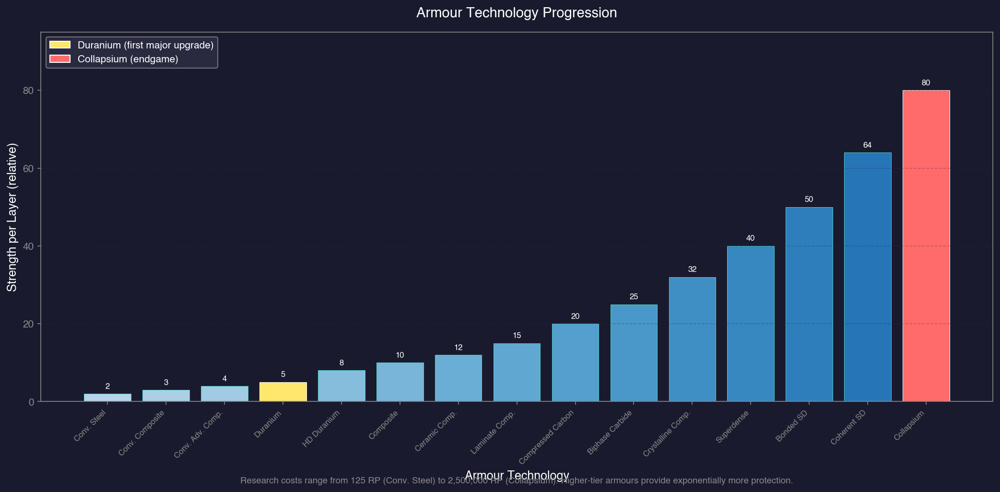
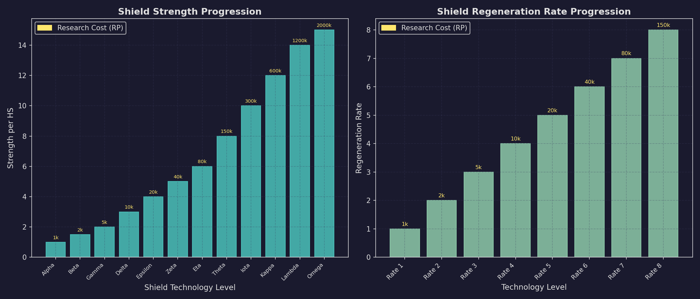
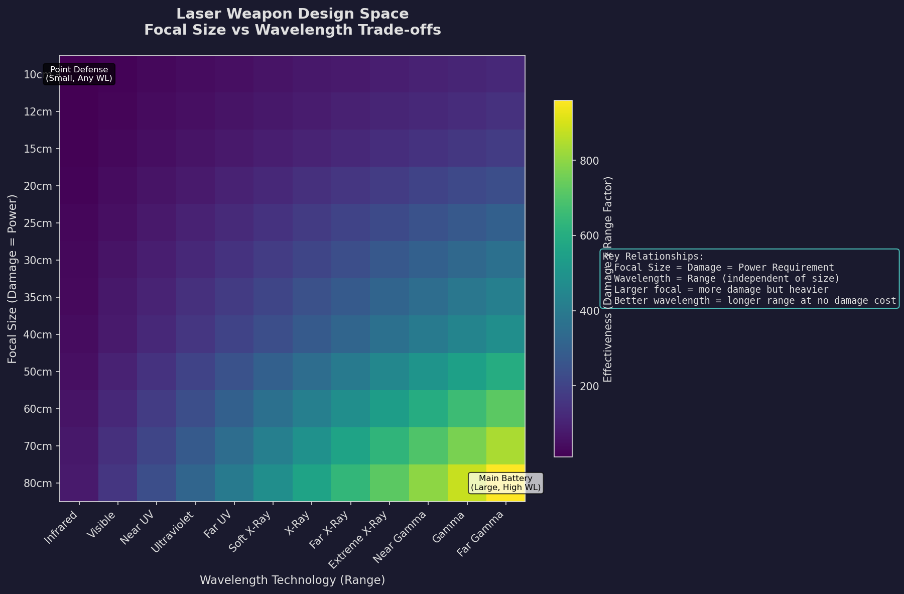

# 7.4 Tech Categories

*Updated: v2026.02.02*

This section provides an overview of each research category, highlighting the most important technologies within each, what they unlock, and their strategic significance. For detailed prerequisite chains, consult the in-game Research window.

---

## Contents

*Updated: v2026.02.02*

{: .no_toc }

- TOC
{:toc}

## 7.4.1 Biology and Genetics

*Updated: v2026.01.30*

Biology and Genetics research affects population growth, terraforming, ground combat, and various biological sciences.

**Key Technology Lines:**

**Terraforming Rate:**
Increases the rate at which terraforming installations (see [Section 5.5 Terraforming](../5-colonies/5.5-terraforming.md)) modify a planet's atmosphere. Higher levels mean faster terraforming, which is critical for making hostile worlds habitable. Each level increases the rate by roughly 20-25% (from 0.00032 atm at level 1 to 0.00375 atm at level 12).\hyperlink{ref-7.4-5}{[5]}

**Genetic Modification:**
Allows modification of your species' environmental tolerances (temperature range, atmospheric preferences, gravity tolerance). Advanced levels can significantly expand the range of worlds your population can colonize without infrastructure support.

**Biology Research:**
Provides improvements to population growth rate, allowing your empire to expand and staff new colonies faster. Also unlocks certain ground combat improvements related to troop endurance and recovery.

**Research Rate:**
Increases the RP per lab per year. Despite being an economic multiplier, this technology is in the Biology / Genetics category, not Construction and Production \hyperlink{ref-7.4-7}{[7]}. Accelerates all future research, creating a compound benefit. One of the highest-ROI early investments. See [Section 7.3 Research Facilities](7.3-research-facilities.md) for the full Research Rate progression table.

**Terraforming Gases:**
Unlocks the ability to add or remove specific atmospheric gases. Different gases require different technology levels. This determines which atmospheres you can modify and which remain beyond your current capability.

**Colonization Cost Reduction (v2.4.0+):**
Reduces the colony cost threshold at which worlds become viable for habitation. The technology line progresses from 5% reduction (5,000 RP) to 50% reduction (1,200,000 RP).\hyperlink{ref-7.4-5}{[5]} As of v2.4.0, the research costs for this technology line were halved, and its effects are now visually reflected in the game: system body colors on the System View and icons on the Galactic Map account for your current Colonization Cost Reduction technology level. *(v2.4.0 visual changes unverified)*

**Strategic Significance:**

Biology and Genetics is a long-term investment category. Its benefits are subtle but cumulative:

- Faster terraforming opens up more colonization options without infrastructure costs.
- Genetic modification eliminates the need for infrastructure on marginal worlds.
- Population growth improvements accelerate all other economic development.
- Not typically a first-priority research area, but neglecting it entirely creates long-term habitability constraints.

> **Tip:** If your home system has a Venus-like or Mars-like world with good minerals, early terraforming research can unlock a second major colony without the infrastructure overhead. Check your system survey results before dismissing this category.

## 7.4.2 Construction and Production

*Updated: v2026.02.02*

Construction and Production research improves your industrial base -- the factories, mines, shipyards, and research facilities that power your economy.

**Key Technology Lines:**

**Construction Rate:**
Increases the Build Points per factory per year. This is one of the most impactful technologies in the game because it accelerates the production of everything else. Each level provides a significant multiplier to all ground-based construction.

**Mining Production:**
Increases the tons per mine per year extraction rate. Directly translates to more minerals from existing mine infrastructure. Critical for maintaining mineral supply as your empire grows.

**Shipyard Construction Rate:**
Increases the build rate of orbital shipyards, meaning ships are produced faster. Essential for maintaining naval production as ship designs grow larger and more complex.

**Fuel Production Rate:**
Increases the output of fuel refineries, which convert mined Sorium into usable fuel. Important for empires with large fleets and high fuel consumption.

**Strategic Significance:**

Construction and Production is the "economic engine" category. Technologies here do not directly improve combat capability, but they accelerate everything else. A strong C&P research programme means:

- More ships built faster.
- More minerals extracted per mine.
- Faster research across all categories.
- Greater overall economic output at every stage of the game.

Many experienced players consider Construction Rate, Mining Production, and Research Rate (in Biology / Genetics -- see [Section 7.4.1](#741-biology-and-genetics)) to be the three highest-priority early research topics regardless of strategic doctrine.

> **Tip:** Research Rate (in Biology / Genetics) and Construction Rate together create a virtuous cycle: better labs research faster, which unlocks better factories faster, which build more labs faster. Prioritize both in your first decade and the compound growth will outpace any other early investment.

## 7.4.3 Defensive Systems

*Updated: v2026.02.01*

Defensive Systems research provides the technologies for armour, shields, and electronic countermeasures that protect your ships and installations.

**Key Technology Lines:**

**Armour Technology:**
Each level of armour technology increases the strength (hit points) per layer of armour on your ships. Higher-tech armour absorbs more damage per ton of ship mass dedicated to armour. This is the most straightforward defensive investment -- tougher armour means ships survive more hits.

Armour progression:\hyperlink{ref-7.4-1}{[1]}

- Conventional Steel Armour (125 RP)
- Conventional Composite Armour (250 RP)
- Conventional Advanced Composite Armour (375 RP)
- Duranium Armour (500 RP)
- High Density Duranium Armour (2,500 RP)
- Composite Armour (5,000 RP)
- Ceramic Composite Armour (10,000 RP)
- Laminate Composite Armour (20,000 RP)
- Compressed Carbon Armour (40,000 RP)
- Biphase Carbide Armour (80,000 RP)
- Crystalline Composite Armour (150,000 RP)
- Superdense Armour (300,000 RP)
- Bonded Superdense Armour (600,000 RP)
- Coherent Superdense Armour (1,250,000 RP)
- Collapsium Armour (2,500,000 RP)

**Shield Technology:**
Shields provide regenerating protection that absorbs damage before it reaches armour. Shield technologies improve \hyperlink{ref-7.4-9}{[9]}:

- Shield strength (total absorption capacity) -- 12 levels from Alpha Shields (1.0 strength, 1,000 RP) through Omega Shields (15.0 strength, 2,000,000 RP)
- Shield regeneration rate (how quickly shields recover between hits) -- 12 levels from Rate 1 (1,000 RP) through Rate 8 (2,000,000 RP)
- Shield size (tonnage required per shield generator)

Shields are power-hungry and require significant reactor capacity to support.

**[Electronic Countermeasures (ECM)](../appendices/B-glossary.md#ecm):**
ECM reduces the effective range of enemy sensors and fire control systems targeting your ships \hyperlink{ref-7.4-10}{[10]}:

- Sensor Jammers (ship ECM): 10 levels from Sensor Jammer 1 (2,500 RP) through Sensor Jammer 10 (1,200,000 RP)
- Missile Jammers (missile ECM): 10 levels from Missile ECM-1 (2,500 RP) through Missile ECM-10 (1,200,000 RP)
- ECM is tonnage-efficient (3 HS per jammer) but only effective against guided weapons.

**Cloaking Technology:**
Allows ships to reduce their thermal and electromagnetic signatures, making them harder to detect (see [Section 11.4.1 Cloaking Technology](../11-sensors-and-detection/11.4-stealth.md)):

- Higher levels provide greater signature reduction (75% to 99.5%).
- Complete cloaking is never possible -- there is always some residual signature.
- Requires significant tonnage and power investment.
- Tactical use: scouting, ambushes, and avoiding detection.

**Strategic Significance:**

Defensive technology determines ship survivability. Your doctrine choice matters:

- **Armour-heavy:** Ships survive sustained fire, work best with short-range weapons. Cheap but heavy.
- **Shield-heavy:** Ships regenerate protection between engagements, work best at range. Expensive in power and tonnage.
- **ECM-focused:** Ships avoid being hit, work best against missile-heavy opponents. Light but vulnerable if ECM is overwhelmed.
- **Balanced:** Most common approach, combining armour with modest shields.

> **Tip:** Match your defensive technology to your weapon doctrine. Beam weapon ships that fight at close range need heavy armour. Missile ships that fight at stand-off range can rely more on ECM and speed to avoid return fire. Mismatching defence and offence leads to suboptimal ship designs.

## 7.4.4 Direct Fire Weapons

*Updated: v2026.02.01*

Direct Fire Weapons research (labeled "Energy Weapons" in some documentation) provides the technology for beam weapons -- direct-fire weapons that hit instantly and require no ammunition. This category encompasses both energy weapons (lasers, particle beams, mesons, plasma carronades) and kinetic weapons (railguns, gauss cannons).\hyperlink{ref-7.4-2}{[2]}

**Key Technology Lines:**

**Laser Focal Size:**
Determines the size and power of laser weapons. Larger focal sizes produce more powerful lasers that deal more damage at greater range. The focal size technology line is the primary determinant of laser effectiveness.

**Laser Wavelength:**
Determines the range of laser weapons independent of focal size. Shorter wavelengths provide greater range. Combined with focal size, this determines a laser's overall capability.

Wavelength progression:\hyperlink{ref-7.4-3}{[3]}

- Infrared (500 RP)
- Visible Light (2,000 RP)
- Near Ultraviolet (4,000 RP)
- Ultraviolet (8,000 RP)
- Far Ultraviolet (16,000 RP)
- Soft X-Ray (30,000 RP)
- X-Ray (60,000 RP)
- Far X-Ray (125,000 RP)
- Extreme X-Ray (250,000 RP)
- Near Gamma Ray (500,000 RP)
- Gamma Ray (1,000,000 RP)
- Far Gamma Ray (2,000,000 RP)

**Particle Beam Technology:**
An alternative to lasers, particle beams: *(weapon properties unverified)*

- Ignore shields (damage passes through to armour)
- Have shorter range than equivalent lasers
- Deal consistent damage regardless of range (no damage fall-off)
- Ideal for anti-shield opponents

**Meson Technology:**
Meson weapons are a specialized energy weapon type that: *(weapon properties unverified)*

- Ignore both shields AND armour (damage goes directly to internal components)
- Have shorter range and lower raw damage than lasers
- Are extremely effective against heavily armoured targets
- Cannot be defended against conventionally (only speed/ECM/cloaking help)

**Plasma Carronade:**
Short-range, high-damage energy weapons: *(weapon properties unverified)*

- Devastating at close range
- Very short effective range
- Ideal for ambush tactics or point-blank combat
- Cannot be used at stand-off range

**Microwave Weapons:**
Specialised weapons that disrupt electronics: *(weapon properties unverified)*

- Damage enemy fire control and sensor systems
- Do not destroy ships directly
- Useful for disabling enemies rather than destroying them
- Effective against automated defences

**Strategic Significance:**

Energy weapons offer sustained fire without ammunition concerns. Choose your energy weapon specialty based on your tactical doctrine:

- Lasers: Versatile, long-range, well-rounded. The default choice for most empires.
- Particle beams: Anti-shield specialist. Effective against shield-heavy opponents.
- Mesons: The ultimate penetrator. Slow to research but devastatingly effective.
- Plasma carronades: Close-range alpha strike doctrine. High risk, high reward.

> **Tip:** Laser technology (focal size + wavelength) is the most versatile energy weapon investment and works well in almost any situation. Specialised weapons (mesons, plasma) are powerful but situational. Start with lasers unless you have a specific reason to specialise.

## 7.4.5 Kinetic Weapons

*Updated: v2026.01.30*

> **Note:** Kinetic weapons are part of the "Direct Fire Weapons" research category in the game, not a separate category. They are presented separately here for organizational clarity.

Kinetic Weapons research provides railguns, gauss cannons, and other projectile-based weapons that fire physical projectiles at high velocity.

**Key Technology Lines:**

**Railgun Technology:**
Railguns fire magnetically accelerated projectiles: *(weapon properties unverified)*

- Medium range (between missiles and lasers typically)
- High rate of fire
- Damage scales with velocity technology
- No ammunition concerns (powered by ship reactor)
- Good all-around combat weapon

**Gauss Cannon Technology:**
Gauss cannons are specialised rapid-fire weapons designed primarily for point defence: *(weapon properties unverified)*

- Very high rate of fire
- Short range
- Low per-shot damage but high sustained DPS at close range
- Primary role: intercepting incoming missiles
- Essential for any empire facing missile-heavy opponents

**Railgun Velocity:**
Increases the speed (and thus damage) of railgun projectiles. Each level provides a significant damage increase.

**Gauss Cannon Rate of Fire:**
Increases the shots per minute of gauss cannons, improving their effectiveness at intercepting missiles and engaging small craft. Progresses from ROF 2 (1,500 RP) through ROF 8 (750,000 RP) \hyperlink{ref-7.4-11}{[11]}.

**Strategic Significance:**

Kinetic weapons serve two distinct roles:
1. **Railguns as primary weapons:** Medium-range combat weapons that combine good damage with no ammunition requirements. Effective against most targets.
2. **Gauss cannons as point defence:** Essential for missile interception. Almost every empire needs some gauss cannon technology regardless of their primary weapon doctrine.

The point defence role makes kinetic weapon research important even for empires focused on energy weapons or missiles. Gauss cannons are the primary defence against incoming missiles, and the **CIWS (Close-In Weapon System)** is a self-contained point defence component that combines a gauss cannon with an integrated fire control sensor into a single unit. CIWS is designed as a compact, autonomous point defence system that does not require a separate beam fire control. See [Section 8.5.6 CIWS](../8-ship-design/8.5-weapons.md) for design details and specifications.

> **v2.8.0+:** CIWS is now under the direct-fire research category.

> **Tip:** Even if your primary doctrine is energy weapons or missiles, invest in at least basic gauss cannon technology for point defence. A fleet without point defence is extremely vulnerable to missile attack, which is one of the most common threats you will face.

## 7.4.6 Logistics

*Updated: v2026.01.30*

Logistics research covers crew, supply systems, jump drives, and various support technologies.

**Key Technology Lines:**

**Crew Grade/Training:**
Improves the quality of ship crews, affecting: *(specific effects unverified)*

- Damage control efficiency (crew repair damage faster)
- Weapon accuracy (better-trained gunners)
- Overall ship performance in combat
- Crew morale and reliability

**Supply and Maintenance:**
Improves logistical capabilities:

- Reduces maintenance facility requirements for fleets
- Extends operational range before requiring resupply
- Improves reliability of deployed forces

**Jump Drive Technology:**
Unlocks the ability to build jump drives for ships (see [Section 4.4 Jump Points](../4-systems-and-bodies/4.4-jump-points.md)):

- Standard jump drives allow individual ships to transit jump points without gates.
- Jump gate construction technology allows building permanent gates for all ships to use.
- Military jump drives (smaller but less efficient) for warships.
- Commercial jump drives (larger but more efficient) for civilian vessels.
- Squadron jump drives allow one ship to "jump" an entire fleet through a jump point.

**Strategic Significance:**

Jump drive technology is essential for interstellar expansion. Without jump-capable ships, you cannot transit jump points (except through existing gates). Jump drive research is particularly time-critical: you need it to explore and expand beyond your home system, and the prerequisite chain can be long.

> **Tip:** Jump drive technology should be an early research priority unless you are playing a single-system game. The ability to build jump-capable survey ships and eventually jump gates is fundamental to interstellar expansion. Do not neglect this -- being trapped in your home system while neighbours expand is a losing position.

## 7.4.7 Missiles and Energy Torpedoes

*Updated: v2026.01.30*

Missiles and Energy Torpedoes research provides the technology for guided weapons -- long-range ordnance that can be launched from beyond beam weapon range.

**Key Technology Lines:**

**Missile Launcher Technology:**
Improves missile launcher size, reload rate, and capacity:

- Each level allows smaller launchers for the same missile size (or larger missiles from the same launcher)
- Faster reload rates mean more missiles fired per minute
- Reduced launcher size means more launchers per ship

**Missile Engine Technology:**
Determines missile speed and range:

- Faster missiles are harder to intercept with point defence
- Longer-range missiles can engage targets from greater stand-off distance
- In v2.2.0+, missile speed directly determines hit chance (speed ratio system)
- Different engine sizes available for different missile roles

**Warhead Technology:**
Determines damage per missile:

- Higher warhead tech = more damage per hit
- Affects both anti-ship and anti-missile warheads
- Larger warheads consume more missile internal space
- Balance between warhead size, engine size, and fuel for range

**Missile Agility (Legacy):**

> *[v2.2.0]: Missile agility was removed from hit calculations. Hit chance is now determined by the speed ratio between missile and target, plus optional Active Terminal Guidance. The agility stat is still displayed in the UI but has no gameplay effect.*

Agility is calculated from missile design parameters but is no longer used in combat resolution. See [Section 12.3 Missiles](../12-combat/12.3-missiles.md) for current hit chance mechanics.

**Energy Torpedo Technology:**
Energy torpedoes are an alternative to physical missiles:

- Use energy weapons technology for their warhead (no mineral cost per shot beyond construction)
- Generally slower than physical missiles
- No magazine explosion risk (physical missile magazines can detonate if hit) *(unverified — [#719](https://github.com/ErikEvenson/aurora-manual/issues/719))*
- Fewer but more powerful shots compared to missile salvos

**Active/Passive Missile Sensors:**
Missiles need sensors to find and track their targets:

- Active sensors emit and detect returns (longer range, but target knows it is being targeted)
- Passive sensors detect emissions (stealthy, but dependent on target emitting)
- Larger/better sensors improve missile accuracy at range
- Sensor size trades off against warhead, engine, and fuel space

**Strategic Significance:**

Missiles are the longest-range weapon system in Aurora and define the stand-off engagement doctrine:

- Missile-heavy fleets engage at extreme range, potentially destroying enemies before they can return fire.
- Disadvantages: ammunition-dependent (magazines must be restocked), vulnerable to point defence, requires ordnance factories and mineral investment for each missile.
- Advantages: extreme range, massed salvos can overwhelm point defence, fire-and-forget capability.

**Missile Design:**

Missiles in Aurora are custom-designed using the Missile Design window. Each missile balances:

- Warhead size (damage)
- Engine size (speed — also determines hit chance in v2.2.0+)
- Fuel (range)
- Sensor (accuracy at range)
- Active Terminal Guidance (optional hit chance bonus, v2.2.0+)
- Total missile size (must fit the launcher)

This design flexibility means missile technology investments translate into increasingly capable custom ordnance.

> **Tip:** Missiles are a "whole system" weapon -- you need launchers, missile engines, warheads, sensors, AND point defence research (to protect against enemy missiles). Going missile-heavy is a significant R&D investment across multiple tech lines, but the stand-off range advantage can be decisive.

## 7.4.8 Power and Propulsion

*Updated: v2026.01.30*

Power and Propulsion research provides the engines and reactors that move your ships and power their systems. This is arguably the most universally important research category.

**Key Technology Lines:**

**Engine Technology:**
The primary determinant of ship speed. Each engine technology level provides dramatically better power-to-weight ratio:

- Higher engine tech = faster ships
- Speed determines strategic mobility (getting fleets where they need to be)
- Speed determines tactical advantage (faster ships can dictate engagement range)
- Faster ships are harder to hit with missiles (speed ratio system, v2.2.0+)

Engine progression (15 levels, each increasing power by roughly 25-28%; see [Section 7.1 Technology Tree](7.1-technology-tree.md) for the complete table with costs and power values):\hyperlink{ref-7.4-6}{[6]}

Conventional Engine, Nuclear Radioisotope Engine, Nuclear Thermal Engine, Nuclear Pulse Engine, Nuclear Gas-Core Engine, Ion Drive, Magneto-plasma Drive, Magnetic Confinement Fusion Drive, Inertial Confinement Fusion Drive, Solid Core Anti-matter Drive, Gas Core Anti-matter Drive, Plasma Core Anti-matter Drive, Beam Core Anti-matter Drive, Photonic Drive, Quantum Singularity Drive

**Engine Power vs. Fuel Efficiency:**
Within each engine tech level, you can trade fuel efficiency for raw power (or vice versa):

- High power multiplier: Ships are faster but consume fuel quickly.
- High efficiency: Ships are slower but have much greater operational range.
- The optimal balance depends on your strategic situation and logistics capability.

**Reactor Technology:**
Provides power for ship systems (weapons, shields, sensors, etc.):

- Each reactor tech level provides more power per ton of reactor.
- Weapons and shields have minimum power requirements -- insufficient reactor capacity means you cannot mount them.
- Higher reactor tech allows smaller ships to carry powerful weapons.

**Fuel Efficiency Technology:**
Reduces the fuel consumption of engines at a given power output:

- Critical for long-range operations
- Reduces logistical burden (fewer tanker runs)
- Allows smaller fuel tanks on ships, freeing space for other systems

**Power Boost (Max Power Multiplier):**
Determines how much you can increase engine power at the cost of fuel efficiency:

- Higher max power = option for faster ships (at greater fuel cost)
- Does not force you to use maximum power, just increases the upper limit

**Jump point theory and jump drive prerequisites:**

Jump point theory (5,000 RP) is the gateway technology for all jump drive capability.\hyperlink{ref-7.4-4}{[4]} It must be researched before any jump engine can be designed, and it unlocks three sub-technologies that ALL must be completed before a jump drive becomes available in the Ship Designer:

| Technology | Effect | First Level (RP Cost) |
|-----------|--------|----------------------|
| Base Jump Drive Efficiency | Determines maximum ship tonnage that can jump; higher levels permit larger ships | Efficiency 4 (1,000 RP) |
| Max Jump Squadron Size | Total ships that can transit together including the jump ship | Size 3 (1,000 RP) = 3 ships total |
| Max Squadron Jump Radius | How spread out ships arrive at the destination jump point | 50,000 km (1,000 RP) |

All three sub-technologies must be researched to at least their first level before the jump engine design options become available. Until then, the jump engine fields in the Ship Designer will show blank entries.\hyperlink{ref-7.4-4}{[4]}

> **Note:** "Max Jump Squadron Size - 3" means 3 ships total can transit together, including the jump-capable ship itself. This is NOT "jump ship + 3 others" -- it is 3 ships total (1 jump ship + 2 escorts).\hyperlink{ref-7.4-4}{[4]}

**Jump Squadron Radius -- Tactical Significance:**

Ships experience disorientation (jump shock) after transit and cannot attack or use sensors effectively during this period. *(exact duration unverified)* The squadron radius determines how spread out a fleet arrives relative to the jump point. A larger radius means ships emerge further from the jump point itself -- this is tactically important because if enemies are defending the jump point, a larger arrival radius reduces the chance of emerging directly on top of hostile forces.

> **Tip:** Research jump point theory early as an expansion prerequisite. The three sub-technologies it unlocks (efficiency, squadron size, squadron radius) all need at least one level of research before you can design any jump engine. Plan your research queue accordingly -- this prerequisite chain takes time to complete.

**Strategic Significance:**

Power and Propulsion is critical for every empire because:

- Every ship needs engines (no engines = no mobility)
- Every weapon system needs reactor power
- Engine tech determines whether you can run from (or catch) enemies
- Speed is both a strategic and tactical advantage
- The technology line is very long (15 levels) so starting early is essential\hyperlink{ref-7.4-6}{[6]}

This category should almost always have at least one scientist assigned to it throughout the game.

> **Tip:** Engine technology is the single most impactful combat technology you can research. A fleet two engine tech levels ahead of an enemy can dictate engagement range, chase down fleeing ships, and escape unfavourable battles. Prioritize engines above almost everything else if you expect combat.

## 7.4.9 Sensors and Fire Control

*Updated: v2026.01.30*

Sensors and Fire Control research provides the detection and targeting systems that find enemies and direct weapons against them.

**Key Technology Lines:**

**Active Sensor Strength:**
Determines the detection range of active sensors (sensors that emit signals):

- Higher strength = longer detection range
- Active sensors reveal your location while operating (the enemy knows they are being scanned)
- Essential for detecting incoming threats at range
- Each level significantly increases maximum detection range

**Active Sensor Resolution:**
Determines what size of object the sensor can detect:

- Resolution must match or exceed target size for detection
- Higher resolution sensors can detect smaller objects (missiles, fighters, FACs)
- Trade-off: high-resolution sensors are larger and consume more tonnage
- Typical fleet sensors: set resolution to detect expected enemy ship sizes

**Passive Sensor (EM Detection):**
Detects electromagnetic emissions from ships and installations:

- Does not reveal your location (passive = listening only)
- Range depends on target's EM signature (active sensors, shields, etc.)
- Essential for stealthy operations and early warning
- Larger targets with active sensors are detected at greater range

**Passive Sensor (Thermal Detection):**
Detects thermal (heat) emissions from ships:

- All ships with engines emit thermal signatures when moving
- Does not reveal your location
- Range depends on target's thermal output (engine power level)
- Complements EM detection for full passive awareness

**Fire Control Range:**
Determines the maximum range at which beam weapons can engage targets:

- Weapons cannot fire beyond their fire control's maximum range, regardless of weapon capability
- Fire control range must match or exceed weapon range for full effectiveness
- Higher levels extend engagement envelopes

**Fire Control Accuracy (Tracking Speed):**
Determines accuracy against targets at various speeds:

- Higher tracking speed = better accuracy against fast targets
- Critical for engaging small, fast ships (fighters, FACs)
- Low tracking speed fire controls may miss fast targets entirely
- Must be matched to expected engagement targets

**Missile Fire Control:**
Specialised fire control for missile systems:

- Determines the range at which missiles can be launched with guidance
- Affects missile initial guidance accuracy
- Higher levels allow engagement at greater stand-off ranges

**ECM/ECCM:**
Electronic warfare capabilities:

- ECM (Electronic Counter-Measures): Reduces enemy targeting accuracy
- ECCM (Electronic Counter-Counter-Measures): Resists enemy ECM
- The ECM vs. ECCM competition determines effective hit rates in combat
- Higher ECM levels make your ships harder to hit; higher ECCM makes your weapons more accurate against ECM-equipped enemies

**Gravitational Survey Sensors:**

A separate research project (in the Sensors and Fire Control category) is required to unlock the gravitational survey sensor component. Without this technology, you cannot design a ship capable of detecting jump points -- even if you have already researched jump point theory under Power and Propulsion. Both technologies are required for jump point exploration: jump point theory for transit capability, and Gravitational Survey Sensors for detection capability.

**Strategic Significance:**

Sensors and Fire Control determine three critical capabilities:
1. **Detection range:** How far away you can spot enemies (who sees whom first often determines the battle).
2. **Engagement range:** How far away your weapons can effectively engage.
3. **Accuracy:** How likely your weapons are to hit, especially against fast or ECM-equipped targets.

The interaction between sensors, fire control, and weapons is crucial:

- A powerful laser with short-range fire control cannot engage at its full potential range.
- A long-range sensor with short-range weapons detects enemies it cannot yet shoot.
- Fast enemies require high tracking speed fire control regardless of weapon type.

**Sensor Design:**

Like missiles, sensors in Aurora are custom-designed (see [Section 8.4 Sensors](../8-ship-design/8.4-sensors.md) and [Section 11.1 Thermal and EM Signatures](../11-sensors-and-detection/11.1-thermal-em-signatures.md)):

- You choose the resolution, range, and purpose of each sensor.
- Active sensors can be tuned for different target sizes.
- Multiple sensors on one ship provide different capabilities (one for long-range detection, one for missile tracking, etc.).
- Sensor design interacts with ship design -- large sensors require significant tonnage.

> **Warning:** Ensure your sensor range exceeds your weapon range, and your fire control range matches your weapon range. A common mistake is mounting powerful weapons with inadequate fire control, resulting in weapons that can only engage at a fraction of their theoretical range. Check all three values (sensor range, fire control range, weapon range) during ship design.

## 7.4.10 Ground Combat

*Updated: v2026.01.30*

Ground Combat is a separate research category from Logistics in the game database \hyperlink{ref-7.4-8}{[8]}. It covers all technologies related to planetary assault and defence.

**Key Technology Lines:**

**Ground Combat Technology:**
Improves ground force effectiveness (see [Section 13.1 Unit Types and Formation Design](../13-ground-forces/13.1-unit-types.md)):

- Weapon strength for ground units
- Armour/protection for ground troops
- Unit organisation and combat efficiency
- Determines the outcome of planetary invasions

**Garrison/Fortification:**
Provides defensive bonuses for ground forces on planets:

- Fortification strength multipliers
- Defensive position effectiveness
- Makes planetary invasion more costly for attackers

**Strategic Significance:**

Ground combat technology determines whether you can conquer enemy colonies or defend your own against invasion. If you expect to face ground combat (either offensively or defensively), this category is critical. Neglecting it means relying entirely on orbital bombardment to deal with enemy colonies.

> **Tip:** Ground combat technology can be deferred until mid-game if you do not anticipate early ground engagements. However, once contact with hostile NPRs is made, investing in ground combat technology becomes urgent for both planetary defence and offensive capability.

## UI References and Screenshots

*Updated: v2026.02.02*

- [Research Window Layout](../images/research-window.md) -- Technology category selection and research project management

## Related Sections

- [Section 7.1 Technology Tree](7.1-technology-tree.md) -- Prerequisite chains and cost scaling
- [Section 8.5 Weapons](../8-ship-design/8.5-weapons.md) -- Ship components unlocked by weapon research
- [Section 8.3 Engines](../8-ship-design/8.3-engines.md) -- Engine components unlocked by Power and Propulsion research
- [Section 8.4 Sensors](../8-ship-design/8.4-sensors.md) -- Sensor components unlocked by Sensors and Fire Control research
- [Section 12.1 Fire Controls](../12-combat/12.1-fire-controls.md) -- How weapon and defensive technologies interact in combat
- [Section 13.1 Unit Types and Formation Design](../13-ground-forces/13.1-unit-types.md) -- Ground combat technology applications

## References

\hypertarget{ref-7.4-1}{[1]} Armour progression and costs verified against AuroraDB.db FCT_TechSystem table (TechTypeID=84), Aurora C# v2.7.1.

\hypertarget{ref-7.4-2}{[2]} Category name "Direct Fire Weapons" verified against AuroraDB.db DIM_ResearchField table (ResearchFieldID=3).

\hypertarget{ref-7.4-3}{[3]} Laser wavelength progression verified against AuroraDB.db FCT_TechSystem table (TechTypeID=3). Note: "Near Infrared" does not exist as a separate technology in the database.

\hypertarget{ref-7.4-4}{[4]} Jump Point Theory (5,000 RP) and sub-technology costs (1,000 RP each for Base Jump Drive Efficiency 4, Max Jump Squadron Size 3, Max Squadron Jump Radius 50k) verified against AuroraDB.db FCT_TechSystem table.

\hypertarget{ref-7.4-5}{[5]} Terraforming Rate progression (0.00032 to 0.00375 atm across 12 levels) and Colonization Cost Reduction progression (5% to 50% across 9 levels) verified against AuroraDB.db FCT_TechSystem table.

\hypertarget{ref-7.4-6}{[6]} Engine technology progression (15 levels from Conventional Engine to Quantum Singularity Drive) verified against AuroraDB.db FCT_TechSystem table (TechTypeID=40), Aurora C# v2.7.1.

\hypertarget{ref-7.4-7}{[7]} Research Rate is in Biology / Genetics (CategoryID=8), verified against AuroraDB.db FCT_TechSystem table (TechTypeID=29). All 11 levels from 240 RP (5,000 RP cost) through 1500 RP (5,000,000 RP cost) are in CategoryID=8. **Correction:** Research Rate was previously listed under Construction and Production in this section.

\hypertarget{ref-7.4-8}{[8]} Ground Combat is a separate research category (ResearchFieldID=9) from Logistics (ResearchFieldID=6) in AuroraDB.db DIM\_ResearchField table, Aurora C# v2.7.1. **Correction:** Ground Combat was previously merged into the Logistics section.

\hypertarget{ref-7.4-9}{[9]} Shield strength (TechTypeID=16): 12 levels from Alpha Shields (1.0, 1,000 RP) through Omega Shields (15.0, 2,000,000 RP). Shield Regeneration Rate (TechTypeID=14): 12 levels from Rate 1 (1,000 RP) through Rate 8 (2,000,000 RP). Both verified against AuroraDB.db FCT\_TechSystem table, v2.7.1.

\hypertarget{ref-7.4-10}{[10]} Sensor Jammer (TechTypeID=82): 10 levels from Sensor Jammer 1 (2,500 RP) through Sensor Jammer 10 (1,200,000 RP). Missile ECM (TechTypeID=279): 11 levels from Missile ECM-0 (1 RP) through Missile ECM-10 (1,200,000 RP). ECCM (TechTypeID=83): 11 levels from ECCM-0 (1 RP) through ECCM-10 (2,500,000 RP). All verified against AuroraDB.db FCT\_TechSystem table, v2.7.1.

\hypertarget{ref-7.4-11}{[11]} Gauss Cannon Rate of Fire (TechTypeID=141): 6 levels from ROF 2 (1,500 RP) through ROF 8 (750,000 RP). Verified against AuroraDB.db FCT\_TechSystem table, v2.7.1.
