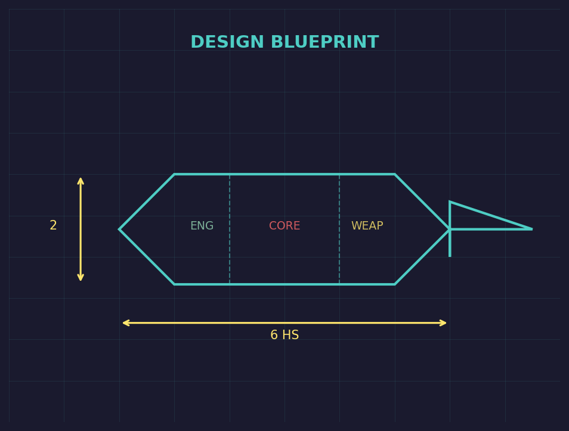
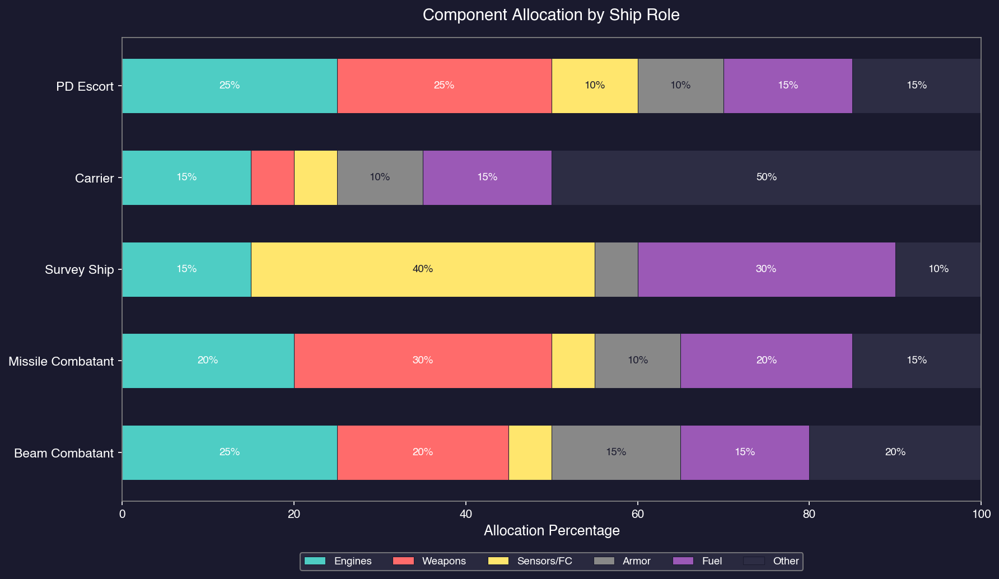
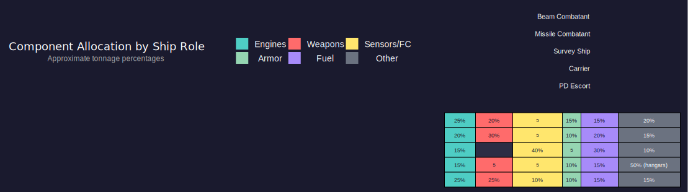

# 8.1 Design Philosophy

*Updated: v2026.01.30*

> **[Screenshot Pending — #840]** Class Design window showing component categories, design summary panel (tonnage, cost, crew), and available components tree.

Ship design is where Aurora's complexity truly shines. The Class Design window lets you combine researched components (see [Section 7.1 Technology Tree](../7-research/7.1-technology-tree.md)) into vessels tailored for specific missions. There is no single "best" design — every ship represents a set of trade-offs between speed, protection, firepower, range, and cost. Understanding those trade-offs before you commit shipyard capacity is the key to building an effective fleet.

> **Note:** If you enabled the "Auto-Design Ship Classes" checkbox during race creation (see [Section 2.2.2 Race Creation Checkboxes](../2-game-setup/2.2-race-creation.md#222-race-creation-checkboxes)), the game generates starting ship designs automatically based on your researched technology. The auto-design system covers 67 templates across civilian and military roles. You can still design additional classes manually even with auto-design enabled, and you can modify or replace auto-designed classes at any time.

## 8.1.1 Role-Based Design

*Updated: v2026.01.30*

Every ship should be designed with a clear primary role in mind. Attempting to build multi-role vessels that do everything usually results in a ship that does nothing particularly well while costing significantly more than specialized alternatives. Aurora rewards focused design.

**Common ship roles include:**

- **Survey Ships** — Carry geological and/or gravitational sensors. Need long range and reasonable speed, but no weapons. Often the first ships you build.
- **Beam Combatants** — Armed with lasers, railguns, plasma carronades, or other direct-fire weapons. Need fire controls, good speed, and enough armor to survive closing to engagement range.
- **Missile Combatants** — Carry missile launchers, magazines, and missile fire controls. Can engage at extreme range but depend on ammunition supply.
- **Carriers** — Transport fighters or FACs via hangars. Require significant tonnage for hangar space (typically 40-60% of hull devoted to hangars). Need organic point defense to protect themselves while fighters are deployed, and benefit from a flag bridge for CAG (Commander Air Group) coordination. Carriers trade raw firepower for flexibility — each fighter group is individually less powerful than equivalent tonnage in dedicated warships, but the ability to rearm fighters with different loadouts and recover damaged craft for repair (rather than losing them outright) provides operational adaptability that fixed-armament ships cannot match. Sortie rate is a key design consideration: fighters must dock, rearm, and relaunch, so the effective combat output depends on how quickly the carrier can cycle its strike groups (see [Section 8.1.9 Design Workflow and Allocation Ratios](#819-design-workflow-and-allocation-ratios) for detailed carrier doctrine).
- **Scouts** — Fast ships with good sensors to find enemies and provide targeting data. Usually lightly armed or unarmed.
- **Tankers** — Haul fuel to support fleet operations far from home. Commercial engines keep costs manageable.
- **Freighters** — Move cargo, colonists, or troops. Almost always use commercial engines.
- **Jump Ships** — Equipped with squadron jump drives to transit non-stabilized jump points while bringing escorts along.
- **Point Defense Escorts** — Specialized in shooting down incoming missiles with fast-tracking beam weapons and advanced fire controls.
- **Fuel Harvesters** — Equipped with sorium harvesters to collect fuel from gas giants.

**The role determines everything else.** Once you know what a ship is for, the required components become obvious: a survey frigate needs survey sensors and fuel for long-range exploration; a beam cruiser needs weapons, fire controls, good speed, and armor.

**Modular Fleet Composition:**

Rather than building massive multi-role battleships, consider treating each ship class as a functional module within a larger fleet structure. This modular approach offers several advantages:

- **Resource Efficiency:** Do not waste mass on redundancy. If your jump-tender stays out of trouble, your warships do not need to be jump-capable themselves. If your sensor ship handles detection, escorts can focus entirely on weapons.
- **Scalability:** Smaller ships build faster in smaller shipyards, require less maintenance infrastructure at smaller colonies, and simplify technology refits when new components become available.
- **Flexibility:** Fleet capability gaps are addressed by adding specialized modules (a new escort type, a dedicated sensor ship) rather than redesigning existing vessels.
- **Reduced Obsolescence:** When one capability needs upgrading, only that ship class requires a redesign rather than the entire fleet architecture.

A typical modular fleet might include: missile destroyers for offense, AMM frigates for defense, beam escorts for point defense, a jump-capable tender for mobility, tankers for range, a collier for ammunition depth, and a dedicated sensor ship for reconnaissance.

**Tip:** Name your classes descriptively. "Tribal-class Survey Frigate" tells you more at a glance than "DD-7" when you have dozens of designs in your fleet list.

## 8.1.2 Size Considerations

*Updated: v2026.01.30*

Ship size in Aurora is measured in tons (displayed in increments of 50 tons for most components) \hyperlink{ref-8.1-1}{[1]}. Size affects nearly every aspect of a ship's capabilities and limitations.

**Advantages of smaller ships (under 6,000 tons):**

- Cheaper and faster to build, allowing more hulls in service
- Harder to hit (smaller cross-section in combat)
- Can be built in smaller shipyards, requiring less initial investment
- Lower crew requirements reduce officer and manpower pressure
- Losses are less catastrophic — losing one frigate hurts less than losing a cruiser

**Advantages of larger ships (10,000+ tons):**

- More internal space allows more weapons, deeper magazines, bigger sensors
- Can carry thicker armor without crippling speed
- More engineering spaces for better maintenance and damage control
- Room for a full sensor suite (active, passive, fire controls)
- Higher absolute speed potential with larger engines
- Better fuel endurance — larger fuel tanks provide more operational range

**The 1,000-ton threshold:** Ships of 1,000 tons or less (20 HS) are classified as **Light Naval** vessels (see [Section 9.6 Light Naval Operations](../9-fleet-management/9.6-light-naval-operations.md)). These can be built in Light Naval Factories rather than shipyards, cannot carry many components, and typically serve specialized roles as part of a larger fleet structure.

> **Note:** The terms "fighter" and "FAC" (Fast Attack Craft) are legacy terminology from before v2.8.0, when there were mechanical distinctions between smaller (~500t) and larger (~1,000t) small craft. As of v2.8.0, "Light Naval" is the unified classification for all vessels of 1,000 tons or less. The older terms persist in community discussions and some UI elements but have no mechanical significance.

**Practical size guidelines:**

- **Scouts and corvettes:** 2,000-4,000 tons
- **Frigates and destroyers:** 4,000-8,000 tons
- **Cruisers:** 8,000-15,000 tons
- **Battlecruisers and battleships:** 15,000-40,000 tons
- **Carriers and flagships:** 25,000-60,000 tons
- **Commercial vessels (freighters, tankers):** 30,000-100,000+ tons

**Tip:** Your first military ships should usually be in the 5,000-8,000 ton range. This provides enough space for meaningful weapons and sensors while remaining affordable for an early-game economy. You can always design larger ships later when your industrial base supports them.

## 8.1.3 Iteration and Obsolescence

*Updated: v2026.01.30*

Ships do not remain competitive forever. As your technology advances, older designs become outclassed. Managing this obsolescence is a critical part of fleet strategy.

**When to redesign:**

- A major engine technology breakthrough gives significantly better power-to-weight ratios
- New weapon technologies open up different tactical options (e.g., researching mesons or particle beams)
- Sensor improvements make your scouts or fleet escorts inadequate
- Combat experience reveals a weakness in your current designs (insufficient armor, poor fuel range, inadequate point defense)
- You gain access to a new armor type that offers better protection per ton

**Redesign strategies:**

- **Incremental updates:** Create a Mark II of an existing class using the same tonnage and shipyard. The shipyard can refit existing hulls to the new standard, which is faster and cheaper than building from scratch. This works best for modest improvements — swapping in better engines or upgrading fire controls. **Refit compatibility note:** Keeping a Mark II design within 20% of the original's total tonnage allows a shipyard refit rather than a full rebuild *(unverified — [#723](https://github.com/ErikEvenson/aurora-manual/issues/723) -- the 20% threshold is community-reported and not directly confirmed in AuroraDB)*. If the new design exceeds this threshold, the shipyard must scrap and reconstruct the hull entirely — negating much of the time and cost savings. The Class Design window's Miscellaneous tab shows the refit cost between any two designs of the same class, letting you verify compatibility before committing (see [Section 9.2 Construction and Refit](../9-fleet-management/9.2-construction-and-refit.md)).
- **Clean-sheet design:** When technology has moved far enough that a refit would change more than 50% of the ship, design a new class from scratch. Build a new shipyard or retool an existing one.
- **Generational naming:** Use consistent naming conventions. If your first cruiser class is "Tribal," the next generation might be "Tribal II" or a new name entirely. Some players use a systematic approach: letter prefixes (A-class, B-class) or era markers.
- **Random Class Naming (v2.7.0):** A checkbox on the class design window auto-generates a random ship class name from the race's Ship/System naming theme when creating a new class. This speeds up prototyping by eliminating manual naming for each design iteration.

**Managing the transition:**

Old ships do not become useless overnight. A fleet of older destroyers can still patrol quiet sectors, escort freighters, or serve as reserves. Consider:

- Assigning older combat ships to secondary theaters or garrison duty
- Converting obsolete warships to training vessels (they retain crew and provide experience; see [Section 9.3.4 Fleet Training](../9-fleet-management/9.3-task-groups.md))
- Scrapping ships (see [Section 9.2.3 Scrapping](../9-fleet-management/9.2-construction-and-refit.md)) only when maintenance costs outweigh their tactical value
- Using older designs as the basis for new classes by loading the design and modifying it

**Tip:** Do not redesign every class every time you research a new component. Wait until you have a meaningful cluster of improvements, then design a new generation. Constant redesign wastes shipyard time and prevents you from building up numbers. A fleet of adequate ships in service beats a perfect design still on the drawing board.

**Planetary Protection Value (PPV) and Fleet Distribution:**

PPV is a defensive metric calculated from the total weapon sizes installed on ships present in a system. Colonies with populations exceeding 10 million require a minimum PPV coverage from ships or Planetary Defence Centres (PDCs) in-system *(unverified — [#874](https://github.com/ErikEvenson/aurora-manual/issues/874) -- the 10 million population threshold is community-reported and not directly confirmed in AuroraDB)* -- without sufficient PPV, the colony generates unrest from insufficient local defence.

This has direct implications for ship design and fleet distribution:

- Garrison ships assigned to protect colonies need weapons partly to satisfy PPV requirements, even if they are unlikely to see combat
- When distributing your fleet across multiple systems, each populated system must have enough armed tonnage to meet its PPV threshold
- PDCs can supplement or replace ship-based PPV, freeing warships for offensive operations
- A ship's PPV contribution is based on its weapon sizes, not its other capabilities -- a heavily armed destroyer contributes more PPV than a lightly armed cruiser twice its tonnage

Consider PPV requirements early in your fleet planning: building dedicated garrison corvettes with oversized weapons (relative to hull) can be a cost-effective way to satisfy PPV across many systems without tying down expensive front-line warships.

See [Appendix A: Formulas](../appendices/A-formulas.md) for PPV calculation details and [Section 5.1](../5-colonies/5.1-establishing-colonies.md) for colony population thresholds.

**Class obsolescence markers:** The game tracks each class's technology date. When browsing your fleet, older classes will show their original design date, helping you identify which ships are falling behind the technology curve.

## 8.1.4 Class Design Window Controls

*Updated: v2026.01.30*

The Class Design window has several non-obvious UI controls for managing components during ship design.

**Adding Components:**

- Double-click a component in the left "Available" list to add it to the ship design.
- The quantity selector at the bottom (1/5/20/100) controls how many instances are added per double-click.
- Category buttons along the top filter the available component list by type (engines, weapons, sensors, etc.).

**Removing Components:**

- Double-click a component in the right "Installed" list to remove one instance from the design.

**Component Filters:**

- **Obsolete checkbox:** Shows components previously marked as obsolete (hidden by default). Useful for reviewing older technology.
- **Prototype checkbox:** Shows components from technologies not yet fully researched.

**View Modes:**

- **Wide View checkbox:** Displays both the Available and Installed component lists simultaneously. Without Wide View, you toggle between them with a radio button. Wide View is strongly recommended for usability.

**Armor Controls:**

- The "No Armour" checkbox removes all armor layers from the design.
- Ships automatically add minimal armor when certain components require it (e.g., nuclear engines need radiation shielding).
- The armor display shows coverage as layers and segments (e.g., "1 layer, 18 segments").

**Technology Report Window:**

The Technology Report (accessible from the toolbar) lists all researched components. From this window you can:

- Rename components (useful for fixing typos in custom names)
- Mark components as obsolete so they no longer appear in the Class Design available list by default

> **Tip:** Enable Wide View immediately when opening the Class Design window. Toggling between Available and Installed lists without it is slow and error-prone when iterating on a design.

## 8.1.5 Ship Type and Class Setup

*Updated: v2026.01.30*

When creating a new ship class, the ship type dropdown determines the class designation (SS for Survey Ship, DD for Destroyer, CA for Cruiser, etc.) and affects how the game categorizes the vessel for automation and fleet organization.

> **Warning:** The ship type dropdown resets to its default value when you navigate away from the Class Design window and return. If you set the type to "Freighter" but switch to another window before finalizing, the dropdown may revert to a different type (e.g., "Colony Ship"). Always verify the ship type selection immediately before creating a construction task, or you may accidentally build the wrong class. Cancelling a mis-ordered build wastes all invested build points.

## 8.1.6 Class Naming and Name Themes

*Updated: v2026.01.30*

Aurora provides a flexible system for naming ship classes and individual ships within a class.

**Selecting a Class Name:**

1. Set the ship type from the dropdown (this assigns the class designation, not the name).

2. Click "New Ship Class" -- the game generates a default name from the race's starting naming theme.

3. Click "Select Name" to browse available name lists (astronomers, cities, battleships, Battlestar Galactica, etc.).

4. Select a name from any list to override the default.

**Setting a Naming Theme for Ships in the Class:**

1. Open the "Priorities and Miscellaneous" tab in the Class Design window.

2. Find the "Naming Theme" section.

3. Select the list to use for future ships built to this class (e.g., Astronomers, US Cities).

4. Choose "Select Randomly" or sequential order for name assignment.

5. Optionally set a Prefix or Suffix (e.g., prefix "USS" or suffix "II").

When building ships, the first vessel is typically named after the class (entered manually in the shipyard). Subsequent ships auto-generate names from the selected theme. The "Select Name" button in the shipyard also allows manual selection at build time.

> **Tip:** The class naming theme set during race creation provides the default names for new classes, but you can override this per-class. Different ship roles can draw from different theme lists for easy identification.

**Custom Name Themes via Text Files:**

Players can create custom naming themes by loading plain text files into the game:

1. Create a plain text file with one name per line (e.g., a list of astronaut names).

2. In the game's admin/settings area, click "Add Name Theme" and select your file.

3. The custom theme appears as a selectable option in the naming theme dropdown when designing new classes.

Custom themes also support commander names with separate files for male first names, female first names, and surnames.

> **Tip:** Prefix custom theme file names with "AAA" or "111" to sort them to the top of the dropdown list. Be aware that names appearing in multiple theme lists (e.g., an astronaut in both Gemini and Apollo programs) can produce duplicates.

## 8.1.7 Design Warnings

*Updated: v2026.01.30*

*Added v2.7.0*

The Class Design window includes automatic warnings to prevent common design mistakes. These warnings appear when a design may not function as intended.

**Cargo Shuttle Warning:**

A design warning is displayed when a ship class has large cargo, colonist, or troop capacity but no cargo shuttle bays. The warning triggers when:

- Cargo capacity >= 25,000 tons with no cargo shuttle bays
- Colonist capacity >= 10,000 with no cargo shuttle bays
- Troop capacity >= 5,000 tons with no cargo shuttle bays

Ships without cargo shuttle bays cannot load or unload cargo at planets that lack a Spaceport or Cargo Shuttle Station (see [Section 8.6.6 Fuel Tanks and Cargo](8.6-other-components.md) for cargo shuttle mechanics). This warning helps prevent the common mistake of designing a large freighter or troopship that cannot actually transfer its payload at most destinations.

> **Tip:** Small craft of 500 tons or less are treated as having a built-in cargo shuttle bay and do not need one explicitly mounted. The warning only applies to larger vessels.

## 8.1.8 Class Lock Behavior

*Updated: v2026.01.30*

A ship class can be freely modified in the Class Design window until the first ship of that class begins construction. Once construction starts, the class becomes locked.

**Before construction begins:**

- All components can be added, removed, or rearranged freely.
- The design can be iterated as many times as needed.
- No commitment is made until a shipyard begins building the class.

**After construction begins:**

- The Class Design window displays "Class is locked because it is in use."
- No modifications can be made to the locked design.
- This applies to all ships of that class currently under construction or in service.

**Workaround for locked classes:**

There is a toggle in the Class Design window that allows some adjustments to locked classes. This is an advanced option that should be used with caution -- modifying a class with ships in service can create inconsistencies between existing hulls and the updated design.

> **Warning:** Verify your design is complete before ordering construction. Once the shipyard begins building, you cannot fix mistakes without using the advanced lock override or designing a new class. See [Section 9.2 Construction and Refit](../9-fleet-management/9.2-construction-and-refit.md) for refit options if a design error is discovered after construction.

## 8.1.9 Design Workflow and Allocation Ratios

*Updated: v2026.01.30*

Designing a ship in Aurora can feel overwhelming given the number of available components. Following a consistent workflow reduces mistakes and produces more coherent designs.

**Typical Design Workflow:**

1. **Pick the role.** Decide what this ship is for (see [Section 8.1.1 Role-Based Design](#811-role-based-design)). Every subsequent decision flows from this.

2. **Determine tonnage.** Choose a hull size appropriate to the role and your current economy (see [Section 8.1.2 Size Considerations](#812-size-considerations)).

3. **Allocate engine percentage.** Military ships typically devote 15-25% of tonnage to engines; commercial vessels use 5-10%. Higher engine allocation means better speed and agility at the cost of payload capacity.

4. **Add primary systems.** Weapons and fire controls for combatants, sensors for scouts and surveyors, hangars for carriers, cargo holds for freighters.

5. **Add armor.** Layer armor according to the ship's expected threat exposure. Front-line combatants need more; rear-echelon support ships can get by with minimal protection.

6. **Fill remaining tonnage with fuel and engineering.** Fuel determines operational range; engineering spaces determine maintenance cycle and damage repair capability. The balance depends on expected deployment duration.

7. **Verify the design.** Check speed against fleet requirements, fuel range against expected patrol distances, and maintenance life against deployment tempo. Adjust allocations until the design meets all mission requirements.

**Common Allocation Ratios by Role:**

These are starting guidelines, not rigid rules. Adjust based on your technology level, expected opposition, and tactical doctrine.

| Component Category | Beam Combatant | Missile Combatant | Survey Ship | Carrier | PD Escort |
|---|---|---|---|---|---|
| Engines | ~25% | ~20% | ~15% | ~15% | ~25% |
| Weapons/Launchers | ~20% | ~30% (launchers + magazines) | — | ~5% (PD only) | ~25% |
| Sensors/FC | ~5% | ~5% | ~40% | ~5% | ~10% |
| Armor | ~15% | ~10% | ~5% | ~10% | ~10% |
| Fuel | ~15% | ~20% | ~30% | ~15% | ~15% |
| Other (engineering, crew, bridge, etc.) | ~20% | ~15% | ~10% | ~50% (hangars) | ~15% |

> **Note:** Notes on the ratios
>
> - Beam combatants need high engine allocation because they must close to engagement range. Speed is survival.
> - Missile combatants can afford less engine mass because they engage at standoff range, but need deep magazines (the "30% launchers + magazines" figure includes both launcher tonnage and ammunition storage).
> - Survey ships prioritize sensors and fuel for extended exploration missions. They should not expect combat and can sacrifice armor and weapons for range.
> - Carriers devote the bulk of their tonnage to hangars and the fighters within them. The "other" category for carriers is dominated by hangar space rather than engineering.
> - PD escorts need fast-tracking weapons and good speed to stay with the fleet, making them engine and weapons heavy.

**The "Design to Threat" Doctrine:**

Generic all-purpose warships are almost always inferior to ships designed to counter a specific expected threat. Once you have intelligence about an enemy's preferred tactics, design your fleet to exploit their weaknesses:

- Enemy uses beam-heavy fleets? Build fast missile ships that engage beyond beam range.
- Enemy relies on missiles? Build AMM-heavy escorts with CIWS and ECM.
- Enemy has slow but heavily armored ships? Design fast ships with meson or microwave weapons that bypass armor.
- Enemy uses fighters? Carrier-based interceptors or dedicated PD platforms counter fighter swarms.
- No intelligence available? Build a balanced fleet with good sensors so you can gather intelligence before committing to a doctrine.

The key insight is that a fleet purpose-built to counter a known threat will beat a larger fleet of generic designs. Intelligence drives design, and design drives procurement. This is why scouts and sensor ships are worth their tonnage — the information they gather shapes every warship you build afterward.

> **Tip:** When designing against a known threat, build a small test class first and run the engagement in a saved game. If the counter-design works, commit to full production. If not, iterate on the design before spending shipyard capacity on a failed concept.

## 8.1.10 Carrier Doctrine and Sortie Planning

*Updated: v2026.01.30*

Carriers occupy a unique role in Aurora fleet design. They do not fight directly — they project power through their embarked fighter groups. This creates design considerations quite different from conventional warships.

**Carrier Design Considerations:**

- **Hangar space** consumes 40-60% of a carrier's total tonnage. Each fighter requires hangar space equal to its hull size, so carrying a full wing of fighters demands a very large hull (typically 30,000+ tons for a meaningful air group).
- **Organic point defense** is essential. When fighters are away on strike missions, the carrier itself is vulnerable. Dedicated CIWS or fast-tracking beam turrets protect against missile attacks during these windows.
- **Flag bridge** enables CAG coordination. Without a flag bridge, the carrier commander cannot effectively direct fighter operations while also commanding the carrier itself. A flag bridge is not strictly required for the fighters to function, but it allows a senior officer to manage the air group as a separate tactical entity.
- **Speed** should match the fleet's battle line. A carrier that cannot keep up with its escorts becomes a liability. Budget sufficient engine tonnage to maintain fleet speed despite the massive hull.
- **Minimal offensive armament** beyond point defense. The carrier's striking power comes from its fighters — mounting heavy weapons on the carrier itself wastes tonnage that could carry more fighters.

**Sortie Rate and Cycle Time:**

Fighter effectiveness is limited by sortie rate — how quickly strike groups can launch, engage, return, rearm, and launch again. The cycle consists of:

1. **Launch** — Fighters depart the hangar and form up.

2. **Transit** — Fighters travel to the target at their (typically high) speed.

3. **Engage** — Fighters attack with their weapons loadout.

4. **Return** — Fighters fly back to the carrier.

5. **Recovery** — Fighters dock in the hangar bay.

6. **Rearm/Repair** — Ordnance is reloaded and damage repaired from hangar stocks.

7. **Ready** — Fighters are available for the next sortie.

The transit phase dominates cycle time in most engagements. Fighters with higher speed complete sorties faster, effectively multiplying the carrier's combat output. Short-range engagements allow rapid cycling; long-range strikes may mean fighters are unavailable for extended periods.

**Fighter Recovery vs. Destruction:**

A major advantage of carrier operations is recoverability. Damaged fighters that survive an engagement can return to the carrier for repair in the hangar bay, restoring them to service without building new airframes. This contrasts with dedicated warships, where battle damage often means permanent loss of capability until a shipyard refit.

However, fighters destroyed in combat (reduced to zero hit points) are lost entirely — there is nothing to recover. Carrier doctrine should therefore avoid sending fighters into engagements where total destruction is likely. Use fighter speed to disengage when losses mount rather than pressing attacks against overwhelming defenses.

**Carrier vs. Dedicated Warship Trade-off:**

The fundamental question: is 30,000 tons of carrier (plus its fighters) more effective than 30,000 tons of conventional warships?

Arguments for carriers:
- Fighters can be rearmed with different loadouts (anti-ship missiles, AMMs, bombs) depending on the mission
- Damaged fighters are repaired rather than lost
- Fighters provide a speed advantage — they can chase down fleeing targets or retreat from losing engagements
- A single carrier can project power across a wider area than a formation of warships

Arguments for dedicated warships:
- Ton-for-ton, a warship's fixed armament delivers more sustained firepower than equivalent tonnage in fighters
- Warships do not need to cycle — they fire continuously until ammunition is expended or they are destroyed
- Warships carry their own armor protection; fighters are fragile
- Losing a carrier means losing both the ship and its entire air group in one blow

In practice, most effective fleets include some carrier capability for flexibility alongside a conventional battle line for sustained engagements. Pure carrier fleets are viable but require careful management of sortie cycles and fighter losses.

> **Tip:** Design your fighters before your carrier. The carrier's hangar allocation should exactly match the tonnage of your intended fighter complement — surplus hangar space is wasted tonnage, and insufficient hangar space means leaving fighters behind.

## 8.1.11 Class Design Window Tabs

*Updated: v2026.01.30*

The Class Design window is organized into several tabs that control different aspects of ship configuration. Understanding what each tab provides helps you access settings that are not immediately obvious from the main design interface.

**Design Tab (Main):**

The primary tab where component selection and placement occurs. This is where you add engines, weapons, sensors, armor, and all other physical components to the ship design. The Available/Installed component lists, category filter buttons, and armor controls all reside here. Most of your design time is spent on this tab.

**Damage Allocation Chart Tab:**

Displays a visual representation of the ship's internal layout and hit location probabilities. When a ship takes damage in combat, incoming hits are distributed across components according to this chart. The tab shows:

- Which components occupy which "slots" in the hull
- The relative probability of each component being hit
- How armor layers protect internal components
- The order in which components are exposed as outer layers are destroyed

This information is critical for understanding ship survivability. Components placed in more exposed positions are destroyed first, while deeply buried components (like engineering spaces or magazines) survive longer. The chart updates automatically as you add or remove components on the Design tab.

> **Tip:** Review the Damage Allocation Chart before finalizing any warship design. If your fire controls or bridge are in exposed positions, a few lucky hits could render the ship combat-ineffective long before its hull is actually destroyed.

**Miscellaneous/Priorities Tab:**

Contains several important settings beyond the naming theme controls described in [Section 8.1.6 Class Naming and Name Themes](#816-class-naming-and-name-themes):

- **Deployment Time** — Sets the intended deployment duration for the class. This affects crew morale calculations and maintenance scheduling. Ships deployed beyond their designed duration suffer increasing morale penalties and maintenance failures. Set this to match your expected patrol or mission length.
- **Intended Crew Grade** — Specifies the target crew training level for the class (green, regular, veteran, elite). This affects crew quarters requirements and morale calculations. A ship designed for elite crews has different internal space requirements than one intended for conscripts.
- **Maintenance Settings** — Controls the maintenance clock parameters for the class, including how many engineering spaces are devoted to preventive maintenance vs. damage repair. Ships with longer intended deployment times need proportionally more maintenance capacity.
- **Naming Theme** — The name list and assignment method for ships built to this class (see [Section 8.1.6 Class Naming and Name Themes](#816-class-naming-and-name-themes) for full details).
- **Preferred Crew Berths** — Determines whether the ship uses standard crew quarters, cramped quarters (saving space but hurting morale), or spacious quarters (costing tonnage but improving long-deployment morale).

These settings do not affect the ship's physical components or tonnage but significantly impact operational performance. A warship with deployment time set too low will suffer morale problems on extended campaigns; one set too high wastes engineering capacity on maintenance systems that shorter patrols do not require.

## UI References and Screenshots

*Updated: v2026.01.30*

- [Ship Design Window Layout](../images/ship-design-window.md) — annotated interface diagram with element descriptions
- [Missile Design Window Layout](../images/missile-design-window.md) — MSP allocation and ordnance configuration interface

## Related Sections

- [Section 2.2 Race Creation](../2-game-setup/2.2-race-creation.md) -- Auto-design ship classes checkbox and template details
- [Section 7.1 Technology Tree](../7-research/7.1-technology-tree.md) -- Technologies that unlock ship components
- [Section 8.7 Design Examples](8.7-design-examples.md) -- Complete worked examples of common ship roles
- [Section 9.1 Shipyards](../9-fleet-management/9.1-shipyards.md) -- Building ships from completed designs
- [Section 9.2 Construction and Refit](../9-fleet-management/9.2-construction-and-refit.md) -- Refitting older ships to newer designs
- [Section 9.6 Light Naval Operations](../9-fleet-management/9.6-light-naval-operations.md) -- Light Naval (fighter/FAC) classification and mechanics
- [Section 12.1 Fire Controls](../12-combat/12.1-fire-controls.md) -- How design choices affect combat performance
- [Worked Example: Beam Cruiser Design](../examples/beam-cruiser-design.md) -- Step-by-step beam warship design walkthrough
- [Worked Example: Missile Destroyer Design](../examples/missile-destroyer-design.md) -- Missile combatant design process
- [UI Reference: Ship Design Window](../images/ship-design-window.md) -- Annotated interface diagram

## References

\hypertarget{ref-8.1-1}{[1]}. AuroraDB.db FCT_ShipDesignComponents: All components use size in HS where 1 HS = 50 tons (e.g., Bridge Size=1.0 HS = 50 tons, Engineering Spaces Size=1.0 HS = 50 tons)
