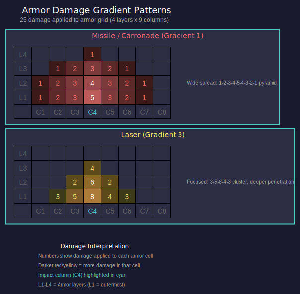

# 8.2 Hull and Armor

*Updated: v2026.01.30*

The hull defines your ship's size and determines how many components you can install. Armor provides protection against incoming damage but adds significant weight. Together, these two decisions form the foundation of every ship design — get them wrong and no amount of clever weapon selection will save you.

## 8.2.1 Hull Size

*Updated: v2026.01.30*

Hull size in Aurora C# is measured in tons and determines the total internal volume available for components. The ship designer displays remaining space as you add components, making it straightforward to see how much room you have left.

**Aurora's ton convention:** Aurora uses displacement tons (volume-based), a convention derived from the Traveller RPG system. One Aurora ton equals the volume occupied by 1,000 kg of liquid hydrogen, approximately 14 cubic meters. One Hull Space (HS) = 50 tons \hyperlink{ref-8.2-5}{[5]}, representing roughly 700 cubic meters of internal volume *(unverified — the 14 cubic meters per ton figure is derived from the Traveller RPG convention and not directly confirmed in AuroraDB; requires external source verification)*. This is not a measure of mass but of the space a component occupies within the hull.

**Key hull mechanics:**

- Ships are designed in multiples of 50 tons (each "hull space" unit = 50 tons)
- There is no hard maximum size, but practical limits exist based on your shipyard capacity and economy
- The total tonnage of all installed components must not exceed the hull size
- Hull size directly affects the ship's thermal signature (larger ships are easier to detect)
- Hull size determines the cross-section for combat hit calculations (larger ships get hit more often)

**Minimum size considerations:**

- Military ships have no hard minimum but need at least enough space for a bridge, engine, and fuel
- A bridge requires 1 HS (50 tons) \hyperlink{ref-8.2-5}{[5]} and is mandatory on all ships
- The smallest practical warship is around 500-1,000 tons (Light Naval range)
- Commercial-engine ships tend to be much larger to offset the lower power density of commercial drives

**Light Naval Classification (v2.8.0):**

Ships of 1,000 tons or less are classified as **Light Naval** units. This replaces the previous fighter/FAC distinction — while the terminology persists informally, there are no longer mechanical differences between "fighters" and "FACs." Key changes:

- The surface interaction limit (previously 500 tons) has been raised to 1,000 tons
- **Light Naval Factories** (renamed from Fighter Factories) can build any ship of <=1,000 tons
- **Light Naval Shipyards** can build any military ship of <=1,000 tons without retooling (see [Section 9.1 Shipyards](../9-fleet-management/9.1-shipyards.md))
- Ships <=1,000 tons receive **full** commander bonuses
- Ships >1,000 tons receive **half** bonuses for: Crew Training, Survey, Engineering, Tactical, Carrier Ops, and Ground Support
- The Fighter Combat bonus has been removed; replaced by **Light Tactical** bonus for <=1,000-ton ship commanders (see [Section 16.2 Skills](../16-commanders/16.2-skills-and-bonuses.md))

For complete details on Light Naval mechanics, see [Section 9.6 Light Naval Operations](../9-fleet-management/9.6-light-naval-operations.md).

**The shipyard connection:**

Your shipyard's maximum tonnage determines the largest ship it can build (see [Section 9.1 Shipyards](../9-fleet-management/9.1-shipyards.md)). Expanding a shipyard is expensive and time-consuming, so plan your hull sizes with your shipyard infrastructure in mind. Common early-game shipyard sizes:

- Naval: 6,000-10,000 tons (for frigates and destroyers)
- Commercial: 30,000-50,000 tons (for freighters and colony ships)

**Crew requirements:**

Each component adds to the ship's total crew requirement. Larger ships need proportionally more crew, which means more crew quarters (adding tonnage), more officers (requiring training), and more life support consumables. The bridge itself has a base crew of 5 plus additional crew based on ship size.

**Tip:** When designing your first ships, start with the hull size that your shipyard can handle. There is no benefit to designing a 12,000-ton cruiser if your largest naval shipyard only handles 8,000 tons — you would need to spend years expanding the yard first.

## 8.2.2 Armor Types

*Updated: v2026.01.30*

Aurora C# features several armor technologies, each unlocked through research (see [Section 7.4.3 Defensive Systems](../7-research/7.4-tech-categories.md)). Better armor provides more protection per layer or weighs less per unit of protection.

**Conventional armour technology:**

In C# Aurora, the single conventional armour technology from VB6 was replaced with three separate conventional armour technologies, providing better granularity between different armour generations. This creates a more graduated progression that allows conventional (pre-TN) forces to remain competitive against early Trans-Newtonian vehicles.

Duranium Armour becomes available (regardless of current armour tech) once Trans-Newtonian Technology is researched, marking the transition from conventional to advanced armour systems.

**Armor technology progression:**

| Technology | Strength per HS | Research Category |
|---|---|---|
| Conventional Steel | 1 | Starting (Pre-TN) |
| Conventional Composite | 2 | Starting (Pre-TN) |
| Conventional Advanced Composite | 3 | Starting (Pre-TN) |
| Duranium | 4 | Defensive Systems (TN) |
| High Density Duranium | 6 | Defensive Systems |
| Composite | 8 | Defensive Systems |
| Ceramic Composite | 10 | Defensive Systems |
| Laminate Composite | 12 | Defensive Systems |
| Compressed Carbon | 15 | Defensive Systems |
| Biphase Carbide | 18 | Defensive Systems |
| Crystalline Composite | 21 | Defensive Systems |
| Superdense | 25 | Defensive Systems |
| Bonded Superdense | 30 | Defensive Systems |
| Coherent Superdense | 36 | Defensive Systems |
| Collapsium | 45 | Defensive Systems |

*All values verified against AuroraDB.db* \hyperlink{ref-8.2-1}{[1]}

Each step up in the armor tech tree provides more protection per ton of armor installed. The strength value represents how many damage points each "column" of armor can absorb before the layer is penetrated. The three conventional tiers sit deliberately below Duranium to maintain meaningful progression during early-game warfare. The progression beyond Crystalline Composite adds four additional tiers (Superdense through Collapsium) for late-game and extreme-tier play.

**Structural Shells:**

Ships designed without conventional armour can use Structural Shells instead. These represent a minimal protective framework rather than true armor:

- Cost: 1 BP per unit (approximately 5% of the cost of normal armour in terms of strength) \hyperlink{ref-8.2-3}{[3]}
- Strength: 20 per unit \hyperlink{ref-8.2-3}{[3]}
- Structural shells do NOT prevent damage — weapon fire passes straight through the "armour"
- Ships with structural shells cannot mount engines or military systems

Ships with structural shells are classified as Space Stations and can be constructed by construction factories at any population with a Spaceport (no shipyard required). Intended applications include:

- Orbital habitats
- Space stations
- Fuel harvesting platforms
- Mining and terraforming stations
- Deep space logistical bases

These vessels require towing to relocate and must rely on external defenses for protection.

**Armor weight calculation:**

The weight of armor depends on three factors:

- The ship's hull size (larger ships need more armor area to cover)
- The number of layers applied
- The armor technology (higher-tech armor is not lighter — it provides more protection at the same weight)

Armor weight scales with hull size. A single layer of armor on a 10,000-ton ship weighs considerably more than a single layer on a 2,000-ton ship, because there is more surface area to protect.

**Tip:** Research armor technology early. The jump from Conventional Advanced Composite (strength 3) to Duranium (strength 4) is a 33% increase in protection for the same weight, and the jump to High Density Duranium (strength 6) doubles conventional protection. This is one of the most impactful early defensive technologies available.

**The "Update Armor" button:**

When you are working on a ship design in the Class Design window, the armor values are set based on the best armor technology available at the time you first configured the design's armor. If you research a new armor type while a design is still in progress, the existing armor values do not automatically update to reflect the new technology. You must manually click the **"Update Armor"** button in the armor configuration area of the Class Design window to recalculate armor values using your latest researched technology.

This is a common oversight when iterating on designs over multiple game-years. You may have started a destroyer design with Duranium armor, spent several years refining weapons and engines, and in the meantime your scientists completed High Density Duranium research. If you finalize and build the design without clicking "Update Armor," every ship of that class will be constructed with obsolete Duranium armor despite having a strictly superior alternative already researched. The game does not warn you about this mismatch.

Make it a habit to click "Update Armor" before finalizing any design that has been sitting in the designer for an extended period. This is especially important for large capital ship designs that tend to go through many revision cycles as supporting technologies mature.

## 8.2.3 Armor Thickness

*Updated: v2026.01.30*

Armor thickness (number of layers) is one of the most consequential decisions in ship design. Each additional layer provides another row of protection across the entire hull but adds substantial mass.

**How armor layers work:**

Aurora models armor as a grid. The width of the grid is determined by the hull size (specifically, the number of hull spaces). The depth of the grid is the number of layers you select. Each cell in the grid has hit points equal to your armor technology's strength value.

When a weapon hits a ship, it strikes a specific column of armor. The damage must chew through each layer in that column before reaching internal components. This means:

- A weapon dealing 3 damage against Duranium armor (strength 4) \hyperlink{ref-8.2-1}{[1]} will damage but not penetrate even a single layer
- A weapon dealing 5 damage will penetrate the first layer and apply 1 point of damage to the second layer
- Multiple hits to the same column will progressively strip armor until internals are exposed

**Practical armor thickness guidelines:**

- **0 layers:** Only for ships never expected to see combat (survey ships, freighters in safe space). Any hit goes directly to internal components.
- **2-3 layers:** Light protection. Stops small-caliber weapons and missile fragments. Appropriate for scouts, escorts, and destroyers where speed matters more than endurance.
- **4-5 layers:** Moderate protection. A good balance for cruiser-weight combatants. Provides meaningful resistance against medium weapons while keeping the ship reasonably fast.
- **6-8 layers:** Heavy protection. Appropriate for battleships and ships expected to absorb sustained fire. The weight penalty is severe — expect to sacrifice significant speed.
- **9+ layers:** Fortress-level protection. Only practical on very large hulls where the percentage of total tonnage devoted to armor remains manageable. Extremely expensive in terms of mass.

**The weight penalty in practice:**

Consider a 10,000-ton ship with Duranium armor:

- 2 layers might add roughly 1,000-1,500 tons
- 4 layers might add roughly 2,500-3,500 tons
- 6 layers might add roughly 4,000-5,500 tons

These are approximate *(unverified — exact armor weight depends on the game's internal hull geometry calculations, which are not exposed in AuroraDB; requires live testing to confirm specific values)* — the exact figures depend on hull geometry and technology. The point is that armor weight grows linearly with layers but the ship's speed decreases non-linearly as you devote more mass to protection rather than engines.

**Armor vs. speed trade-off:**

This is the fundamental tension in warship design. A heavily armored ship is slow; a fast ship is fragile. There is no universal answer — it depends on your doctrine:

- **Speed doctrine:** 2-3 layers, strong engines, rely on maneuver and range control. Works well with missile ships that never want to close to beam range.
- **Armor doctrine:** 5-6+ layers, accept lower speed, plan to absorb fire while closing to optimal beam range. Works well with short-range beam ships (plasma carronades, particle beams).
- **Balanced:** 3-4 layers with moderate engines. The default choice when you are uncertain what threats you will face.

**Damage distribution and armour damage templates:**

In C# Aurora, the damage distribution system was completely redesigned. Rather than using a static database of templates (as in VB6), the game dynamically generates damage templates in real-time using a gradient algorithm. Template generation takes approximately one millisecond, enabling easy addition of new weapon systems.

The algorithm works by starting damage at a single column and spreading it bidirectionally using a "gradient" value. Any column with damage greater than the gradient checks left and right, redistributing damage points when gaps exceed the threshold between adjacent columns. This creates characteristic spread patterns for each weapon type.

**Gradient values and damage patterns by weapon type:**

| Weapon Type | Gradient | Example Pattern (25 damage) |
|---|---|---|
| Missiles | 1 | 1, 2, 3, 4, 5, 4, 3, 2, 1 |
| Carronades | 1 | 1, 2, 3, 4, 5, 4, 3, 2, 1 |
| Ramming | 1 | 1, 2, 3, 4, 5, 4, 3, 2, 1 |
| Railguns | 2 | 1, 3, 5, 7, 5, 3, 1 |
| Particle Torpedoes | 2 | 1, 3, 5, 7, 5, 3, 1 |
| Lasers | 3 | 3, 6, 8, 5, 3 |

**Special weapon types:**

- **Particle Lances:** Single column damage only (all damage applied to one armour column)
- **Gauss Cannons:** Single point of damage (1 damage to 1 column)
- **Meson Weapons:** Bypass armour entirely (damage goes directly to internal components)

A gradient of 1 (missiles, carronades, ramming) produces the widest spread pattern, distributing damage across many columns with a gentle pyramid shape. A gradient of 2 (railguns, particle torpedoes) concentrates damage into fewer columns with steeper falloff. A gradient of 3 (lasers) focuses damage into a tight cluster, making lasers particularly effective at penetrating individual armour columns.

The center columns of armor tend to take more damage than the edges in prolonged engagements. You may see the center armor stripped away while the edges remain intact — at that point, further center hits go straight to internals.

**Tip:** When facing an unknown threat, 4 layers of the best armor you have is a good starting point for general-purpose warships. You can adjust up or down in future generations once you understand the enemy's weapon characteristics. Against missiles (gradient 1, wide spread), more layers of lighter armor work well since damage is distributed. Against lasers (gradient 3, focused), you need deeper armor on critical columns since they concentrate damage for penetration.

## 8.2.4 Shield Generators

*Updated: v2026.01.30*

Shield generators provide an energy barrier that absorbs incoming damage before it reaches armor. In C# Aurora, shields were substantially redesigned to create more strategic depth and differentiation between ship sizes. Shields are covered comprehensively in [Section 8.6.13 Shields](8.6-other-components.md), including shield type progression, regeneration formulas, size scaling, EM emissions, and design considerations.

**Key points for hull design decisions:**

- Shield generators use non-linear square root scaling — larger generators provide proportionally more protection per HS
- Maximum shield generator size is governed by a dedicated research line, from 10 HS (1,000 RP) to 50 HS (120,000 RP) \hyperlink{ref-8.2-2}{[2]}
- Shields no longer require fuel to operate (changed from VB6)
- Shield generators exclusively require Corbomite for construction \hyperlink{ref-8.2-4}{[4]}
- Shield generator HTK = SQRT(size in HS) — one large generator is more space-efficient but a single point of failure
- Active shields generate significant EM emissions (3x shield strength), broadcasting your position

**Shield vs. armor trade-off:**

- **Shields:** First line of defense, regenerate over time, but generate EM signature and can be stripped by meson weapons or high-power microwaves (3x damage)
- **Armor:** Permanent protection, no emissions, but cannot regenerate in combat and adds significant mass
- Most warships benefit from both: shields absorb initial salvos while armor provides the last line of defense

**Tip:** For capital ships, invest in maximum shield generator size research early. A single 50 HS shield provides 224% of the protection of a 10 HS unit while only taking 5x the space. For small combatants limited to 10 HS shields, consider whether the tonnage might be better spent on armor, which cannot be knocked out by a single lucky hit. See [Section 8.6.13 Shields](8.6-other-components.md) for detailed shield design guidance.

## Related Sections

- [Section 7.4 Tech Categories](../7-research/7.4-tech-categories.md) -- Armor and shield technology research (Defensive Systems category)
- [Section 8.3 Engines](8.3-engines.md) -- Speed versus armor weight trade-offs
- [Section 12.1 Fire Controls](../12-combat/12.1-fire-controls.md) -- How armor and shields interact with incoming damage
- [Section 9.1 Shipyards](../9-fleet-management/9.1-shipyards.md) -- Shipyard capacity constraints on hull size
- [Appendix A: Formulas](../appendices/A-formulas.md) -- Armor weight and shield strength calculations

## References

\hypertarget{ref-8.2-1}{[1]}. AuroraDB.db FCT_TechSystem: Armour Technology -- Conventional Steel (1) through Collapsium (45), 15 tiers total

\hypertarget{ref-8.2-2}{[2]}. AuroraDB.db FCT_TechSystem: Maximum Shield Generator Size -- 10 HS (1,000 RP) through 50 HS (120,000 RP), 8 tiers at sizes 10/12/15/20/25/32/40/50

\hypertarget{ref-8.2-3}{[3]}. AuroraDB.db FCT_ShipDesignComponents: Structural Shell -- Size 1.0 HS, Cost 1.0 BP, ComponentValue 20.0 (strength), HTK 0

\hypertarget{ref-8.2-4}{[4]}. AuroraDB.db FCT_ShipDesignComponents: Shield generators require 100% Corbomite (all other mineral columns = 0.0)

\hypertarget{ref-8.2-5}{[5]}. AuroraDB.db FCT_ShipDesignComponents: Bridge -- Size 1.0 HS (50 tons), Cost 20.0 BP, Crew 5, HTK 1. All component sizes measured in HS where 1 HS = 50 tons.
