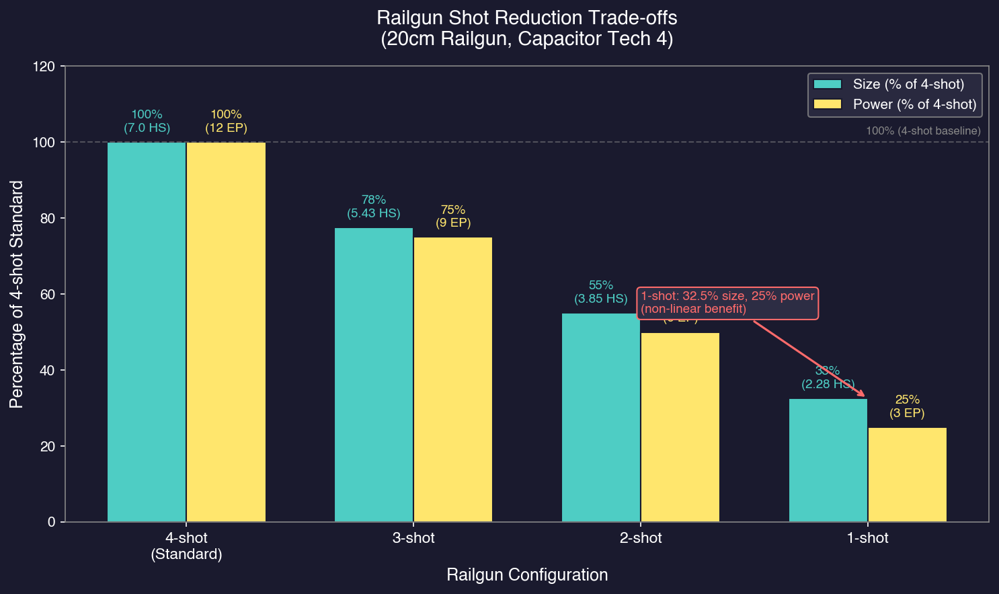

# 8.5 Weapons

*Updated: v2026.01.30*

Weapons in Aurora C# span a broad range of technologies and tactical niches (see [Section 7.4 Tech Categories](../7-research/7.4-tech-categories.md) for research paths). From long-range missile salvos to devastating close-range plasma bursts, each weapon type rewards different tactical approaches and ship design philosophies. This section covers the major weapon categories and their design parameters.

## 8.5.1 Lasers

*Updated: v2026.01.30*

Lasers are the most versatile beam weapon in Aurora. They offer good range, respectable damage, and can serve in both offensive and point defense roles. They are often the first beam weapons players invest in heavily.

**Laser types:**

- **Standard Lasers:** The baseline beam weapon. Balanced range and damage.
- **Reduced-size Lasers:** Smaller and lighter versions that sacrifice some range and damage for lower tonnage. Useful for point defense or cramming more weapons onto small hulls.
- **Spinal Mount Lasers:** Larger, more powerful versions that deal additional damage. Only one spinal mount weapon can be installed per ship, but the firepower increase is substantial.

**Laser design parameters:**

The fundamental relationship in laser design is: **Focal Size = Damage = Power Requirement** for full-size lasers. The focal size (in cm) directly determines both the damage output per shot and the power draw from the ship's reactor. This creates a clean linear scaling where larger lasers deal proportionally more damage but require proportionally more power. *(Note: Reduced-size lasers have proportionally reduced damage and power.)*

**Wavelength = Range:** The laser's wavelength technology determines its maximum engagement range independently of focal size. Higher wavelength technologies extend range without changing damage or power requirements.

**Laser caliber (size):**

Laser caliber is determined by the focal size, measured in centimeters. Available sizes range from 10cm (the smallest) up to 50cm or larger depending on technology. Larger caliber means:

- More damage per shot (equal to focal size value)
- Higher power draw (equal to focal size value)
- Heavier weight and larger component size
- Range is determined independently by wavelength technology

Standard caliber progression: 10cm, 12cm, 15cm, 20cm, 25cm, 30cm, 35cm, 40cm, 50cm, 60cm, 70cm, 80cm \hyperlink{ref-8.5-db-laser-focal}{[1]}

**Damage and range:**

Each caliber has a maximum range and a damage value that decreases with distance. Lasers do full damage at close range and reduced damage at maximum range. The damage fall-off is linear *(unverified — exact falloff percentages require live testing; values below are approximate based on community observations)*:

- At point-blank range: Maximum damage
- At half maximum range: Approximately 75% damage
- At maximum range: 50% damage

Higher wavelength technology (researched in Energy Weapons) extends maximum range without changing the caliber. This means the same 20cm laser will reach further with advanced wavelength tech.

**Wavelength technology:**

The laser wavelength technologies determine maximum beam range. Each wavelength technology provides a specific range in kilometers \hyperlink{ref-8.5-db-wavelength}{[2]}:

| Technology | Range (km) |
|---|---|
| Infrared | 10,000 |
| Visible Light | 20,000 |
| Near Ultraviolet | 30,000 |
| Ultraviolet | 40,000 |
| Far Ultraviolet | 50,000 |
| Soft X-ray | 60,000 |
| X-Ray | 70,000 |
| Far X-Ray | 80,000 |
| Extreme X-ray | 90,000 |
| Near Gamma Ray | 100,000 |
| Gamma Ray | 110,000 |
| Far Gamma Ray | 120,000 |

Higher-wavelength techs provide strictly better combat range. Research these as a priority if you use laser-armed ships.

**Reduced-size lasers:**

Reduced-size (RS) technology allows you to build lasers at fractions of their full size. A 25% reduced-size 20cm laser weighs 25% of a full-size 20cm laser, but deals proportionally less damage and has shorter range. The key use case: point defense turrets, where rate of fire and tracking speed matter more than individual shot damage.

**Laser recharge rate and size reduction:**

Lasers have a recharge time between shots, determined by the Capacitor Recharge Rate technology. Higher recharge rates mean faster firing, which directly translates to more damage per second. This technology applies to all beam weapons, not just lasers.

Recharge rate progression: 1 (base), 2, 3, 4... Each level reduces the time between shots proportionally.

**Size reduction at high recharge rates:** Lasers benefit from physical size reductions at higher recharge multipliers \hyperlink{ref-8.5-db-reduced-laser}{[3]}:

- At **4x recharge rate:** 0.75x size (the laser is 75% of its base size)
- At **20x recharge rate:** 0.5x size (the laser is 50% of its base size)

These reductions make high-recharge lasers more compact, enabling denser point defense batteries or more space-efficient beam armaments on smaller hulls. The size reduction applies to the physical component only -- damage and power requirements remain unchanged.

**Tip:** For your first beam warship, 20cm lasers with the best available wavelength technology offer a good balance of range, damage, and size. As your technology improves, consider moving to 25cm or 30cm for main battery weapons while keeping 10-15cm reduced-size lasers for point defense. Do not neglect Capacitor Recharge Rate research — it is effectively a multiplier on all your beam weapon DPS.

## 8.5.2 Railguns and Gauss Cannons

*Updated: v2026.01.30*

Railguns and gauss cannons are kinetic weapons that fire physical projectiles. They fill different niches than lasers — railguns are heavy hitters at medium range, while gauss cannons are the premier point defense weapon.

**Railguns:**

Railguns fire high-velocity slugs that deal solid damage at medium range. The key design parameters are:

- **Calibre = Damage:** The railgun's calibre directly determines damage per shot, analogous to laser focal size
- **Velocity = Range:** The velocity technology determines maximum engagement range
- **Shots per burst:** 1 to 4 shots per firing cycle (standard is 4)
- Damage does not decrease with range (full damage at any distance within maximum range)
- Shorter maximum range than equivalent-tech lasers

Railgun velocity technology determines maximum range. Available velocities range from 10,000 km to 90,000 km \hyperlink{ref-8.5-db-railgun-velocity}{[7]}. Higher velocity = longer effective range.

The flat damage profile (no fall-off) makes railguns attractive when you expect to fight at consistent medium ranges. A railgun that deals 10 damage does 10 damage whether the target is at 10,000 km or at maximum range.

**Reduced-Shot Railguns:**

Railguns can be designed with fewer shots per firing cycle, ranging from 1 to 4 shots instead of the standard 4-shot configuration. This provides significant size, power, and cost reductions:

- **Power requirements** are reduced by 25% per shot removed (a 2-shot railgun needs 50% power, a 1-shot needs 25%)
- **Size reduction** follows a formula of 10% base reduction plus 22.5% per shot removed: 4 shots = 100%, 3 shots = 77.5%, 2 shots = 55%, 1 shot = 32.5% of original size
- **Cost** is reduced correspondingly due to lower power requirements and recharge rates

Example -- a 20cm railgun with capacitor tech 4 \hyperlink{ref-8.5-db-railgun-example}{[12]}:



| Shots | Size (HS) | Power | Cost |
|-------|-----------|-------|------|
| 4 | 7.0 | 12 | 55.4 |
| 3 | 5.43 | 9 | ~42 |
| 2 | 3.85 | 6 | 29.4 |
| 1 | 2.28 | 3 | ~16 |

Reduced-shot railguns are useful when power budget is constrained, when you want a single precise heavy hit rather than a burst, or when designing compact weapons for smaller hulls.

**When to use railguns over lasers:**

- When you prefer consistent damage output at predictable ranges
- When facing enemies that try to maintain distance (railgun damage does not diminish)
- As a complement to lasers — mixed batteries give you different range profiles
- When power budget is limited (reduced-shot variants are power-efficient)

**Gauss Cannons:**

Gauss cannons are small, rapid-fire kinetic weapons designed almost exclusively for point defense (shooting down incoming missiles). They are the best point defense weapon in the game due to:

- Extremely high rate of fire (measured in shots per 5-second increment)
- Small size per mount at base accuracy
- Each mount fires multiple shots per fire control cycle
- Multiple mounts can be assigned to a single fire control

Design parameters:

- **Rate of fire (ROF):** Determined by technology. Measured in shots per 5-second fire control cycle. ROF ranges from 1 (base) up to 8 at the highest tech level \hyperlink{ref-8.5-db-gauss-rof}{[9]}. Higher Gauss Cannon ROF tech = more shots per cycle.
- **Velocity = Range:** The velocity technology determines the maximum engagement range (10,000 km to 60,000 km) \hyperlink{ref-8.5-db-gauss-velocity}{[10]}, analogous to railgun velocity.
- **Accuracy:** Determines the physical size of the gauss cannon. The base accuracy of 100% corresponds to a size of 6 HS (300 tons) \hyperlink{ref-8.5-db-gauss-accuracy}{[6]}. Size scales with accuracy: 50% accuracy = 3 HS, 33% accuracy = 2 HS, down to 8% accuracy = 0.5 HS. Lower accuracy makes the weapon smaller and cheaper but less effective per shot.
- **Standard size:** At 100% accuracy, each mount is 6 HS (300 tons). Most practical gauss cannon designs use reduced accuracy to achieve a more compact form factor for point defense roles.

A single gauss cannon mount fires multiple rounds per cycle. The number of rounds increases with technology, from 1 round at base to 3+ rounds at higher tech levels. Combined with multiple mounts sharing a fire control, this creates a wall of defensive fire.

**Tip:** Every fleet should include gauss cannon-equipped ships for point defense. Even beam-focused fleets need to intercept incoming missiles. A dedicated PD escort with 6-8 gauss cannon mounts and a high-tracking-speed fire control can protect multiple ships in the task group. Do not neglect this — a fleet without point defense is dangerously vulnerable to missile attack.

## 8.5.3 Missile Launchers

*Updated: v2026.01.30*

Missiles are Aurora's premier long-range weapon system. They can engage targets at ranges far beyond any beam weapon, but they require launchers, magazines, ordnance design, and missile fire controls. The complexity is rewarded with devastating alpha strikes and standoff capability.

**Launcher types:**

- **Standard Launchers:** Reload from magazines after firing. Can be created in fractional sizes starting from 1 HS (e.g., 1.1 HS, 2.7 HS). The launcher size determines the maximum missile size it can fire.
- **Box Launchers:** Fire once and cannot be reloaded in combat (see Reloading below for exceptions). They weigh half of a standard launcher of equivalent size and are cheaper, but once fired they are empty. Excellent for alpha strikes.
- **Reduced-size Launchers:** Take less hull space but reload more slowly. All reduced-size technologies are immediately available without research.

**Reduced-Size Launcher Options** \hyperlink{ref-8.5-db-reduced-launcher}{[4]}:

| Size Multiplier | Reload Penalty | Notes |
|---|---|---|
| 0.75x | 2.4x reload time | Moderate size reduction |
| 0.6x | 4.8x reload time | Significant reduction |
| 0.5x | 8x reload time | Standard reduced size |
| 0.4x | 16x reload time | Major reduction |
| 0.3x | 40x reload time | Extreme reduction |
| 0.15x | No internal reload | Box launcher (reloads only at hangars/OTPs) |

**Launcher size:**

Launcher size determines the maximum missile size (in MSP -- Missile Size Points) that can be fired. Launchers can now be designed in fractional sizes:

> **Note:** MSP in the missile/launcher context means **Missile Size Points** (1 MSP = 2.5 tons of missile mass). This is distinct from **Maintenance Supply Points**, also abbreviated MSP, which are consumables used for ship repairs (see [Section 8.6.4 Engineering Spaces](8.6-other-components.md)). Context determines which meaning applies.

- Size 1 launcher: fires missiles up to size 1 (0.33 HS, ~17 tons)
- Size 2 launcher: fires missiles up to size 2 (0.67 HS, ~33 tons)
- Size 4 launcher: fires missiles up to size 4 (1.33 HS, ~67 tons)
- Size 6 launcher: fires missiles up to size 6 (2 HS, ~100 tons)
- Size 12 launcher: fires missiles up to size 12 (4 HS, ~200 tons)

As of v2.6.0, the maximum missile size has been increased to **200 MSP (500 tons)**, allowing significantly larger missile designs for capital ship launchers.

Larger missiles can carry more fuel, bigger warheads, better seekers, and Active Terminal Guidance. The trade-off is that larger launchers and missiles take more space and are more expensive.

**Reload rate:**

The reload rate formula in C# Aurora is:

```
Reload Time = (SQRT(missile size) * 30 seconds * Reduced Size Modifier) / Reload Rate Tech
```

This means larger missiles take proportionally longer to reload (square root scaling), and reduced-size launchers multiply the reload time by their penalty factor. Faster Reload Rate technology directly reduces the time between salvos.

**Magazine-fed operations:**

Standard launchers draw missiles from magazines (see [Section 8.6 Other Components](8.6-other-components.md)). Without magazines, launchers cannot reload. The missile pathway is: Magazine -> Launcher -> Space. Ships must carry enough magazine capacity to support their launchers through an engagement.

**Box Launcher Reloading:**

Box launchers can only be reloaded in specific locations:

- **Hangars:** Full-speed reloading when docked in a hangar bay
- **Ordnance Transfer Points:** Spaceports, Ordnance Transfer Stations, or Ordnance Transfer Hubs -- reloading at these facilities is 10x slower than hangar reloading

Box launchers cannot be reloaded during combat or while deployed away from these facilities. This restriction prevents box launchers from becoming overpowered given their immediate availability and low size cost.

**Box Launcher Explosion Risk:**

If a box launcher containing a missile is hit by enemy fire, the missile will explode. A technology line reduces the explosion probability \hyperlink{ref-8.5-db-box-explosion}{[5]}:

- Base chance: 100% explosion on hit (500 RP)
- First tech level (1,000 RP): Reduces to 70%
- Final tech level (120,000 RP): Reduces to 5%

**Box launchers vs. standard launchers:**

| Aspect | Standard | Box |
|---|---|---|
| Weight | Full weight | Half weight |
| Reload | Yes (from magazine) | Only at hangars/OTPs |
| Sustained fire | Yes | No (single salvo in combat) |
| Magazine needed | Yes | No |
| Explosion on hit | Magazine detonation risk | Missile explodes if hit |
| Best for | Prolonged engagements | Alpha strikes, small ships |

**Missile design (brief overview):**

Missiles themselves are designed in the Missile Design window (covered in detail in [Section 12.3 Missiles](../12-combat/12.3-missiles.md)). Key missile components:

- **Engine:** Determines speed and fuel consumption
- **Warhead:** Damage on impact
- **Fuel:** Range/endurance
- **Seeker (active or passive):** How the missile finds its target
- **Speed:** Determines hit chance (v2.2.0+ speed ratio system) and point defense evasion
- **Active Terminal Guidance (optional):** Accuracy bonus from +15% to +60%
- **ECM:** Electronic countermeasures to avoid point defense

**Tip:** For early game missile ships, size 4 launchers firing size 4 missiles are a good starting point. They offer enough missile volume for meaningful warheads and seekers without being excessively large or expensive. Box launchers are excellent on small ships (corvettes, FACs) that fire one devastating salvo and then retreat — they do not need magazines, saving significant tonnage on small hulls.

## 8.5.4 Plasma Carronades

*Updated: v2026.01.30*

Plasma carronades are short-range, high-damage beam weapons. They sacrifice range for devastating close-quarters firepower. Named after historical naval carronades, they follow the same philosophy — get close and obliterate.

**Characteristics:**

- Extremely high damage per shot (significantly more than equivalent-size lasers)
- Very short range (typically 30,000-60,000 km depending on technology)
- Cannot be used for point defense
- Available in multiple calibers like lasers
- Require beam fire controls (same as lasers and railguns)

**Development Costs** \hyperlink{ref-8.5-db-carronade-cost}{[13]}:

Plasma carronade development costs scale with caliber. For example, a 30cm Carronade costs 16,000 RP to develop, while a 15cm Carronade costs 2,000 RP.

**Damage output:**

Plasma carronades are designed for high damage output at close range. They are more compact than equivalent lasers *(exact size ratio varies by focal size and technology level)*. Carronades deal full damage at any range within their envelope (no range-based falloff). Their armor damage gradient is 1 (see [Section 8.2.3 Armor Thickness](8.2-hull-and-armor.md)), which describes how damage spreads across armor columns -- not range falloff. A gradient of 1 produces the widest spread pattern across armor, distributing damage across many columns.

**Range limitation:**

The short range is the critical constraint. At starting technology, plasma carronades may only reach 30,000 km. This means:

- Enemy beam ships with lasers will fire on you for tens of thousands of km before you can respond
- You must absorb significant incoming fire while closing the range gap
- Speed is essential — the faster you close, the less time you spend under unanswered fire
- Armor must be heavy enough to survive the approach

**Ideal ship profile for plasma carronades:**

- Fast (to close range quickly)
- Heavily armored (to survive the approach)
- Multiple carronades (to maximize the devastating close-range firepower)
- High-tracking fire controls (targets at close range have high angular velocity)

**Tactical considerations:**

- Plasma ships work best in groups — a single carronade ship rushing a fleet gets destroyed, but a squadron can overwhelm point defense and beam fire
- Combine with ECM to reduce enemy beam accuracy during approach
- Consider pairing with missile ships — missiles force the enemy to deal with incoming ordinance while your plasma ships close
- Against missile-heavy enemies, plasma ships are vulnerable during the long approach

**Tip:** Plasma carronades reward aggressive play. Design your carronade ships with maximum speed and 5-6 layers of armor minimum. The goal is to survive the approach and then deal catastrophic damage once in range. These ships are not for cautious commanders — they are for players who want to close with the enemy and deliver a killing blow at knife-fight range.

## 8.5.5 Mesons and Microwaves

*Updated: v2026.01.30*

Mesons and microwaves are specialty weapons with unique properties that bypass normal defenses. They fill niche roles but can be devastatingly effective in the right circumstances.

**Meson Cannons:**

Meson cannons are the most unusual weapon in Aurora. They fire meson particles that pass through shields and armor, dealing damage directly to internal components.

Key properties:

- Bypasses shields and armor -- damage goes straight to internals (with Armor Retardation caveat, see below)
- **Design parameters:** Focal size (determines damage) and Meson Focusing technology (determines range from 10,000 km to 120,000 km) \hyperlink{ref-8.5-db-meson-focusing}{[11]}
- Cost is based on the same principles as lasers (same cost at equivalent tech level and size)
- Range determined by focusing technology rather than wavelength
- Requires beam fire controls
- Cannot be used for point defense
- Damage is applied randomly to internal components
- Destroys missiles without penalty (missiles are unarmored in C# Aurora)
- As of v2.8.0, 15cm Meson Cannons and 15cm High Power Microwaves have increased tonnage from 200 to 250 tons

**Meson Armor Retardation (C# Aurora):**

Armor Retardation (AR) is not a separate technology line -- instead, each Meson Focal Size technology has a built-in AR percentage \hyperlink{ref-8.5-db-meson-ar}{[17]}. This percentage represents the chance that each armor layer stops the meson. Larger (more advanced) mesons have lower AR values, making them harder to stop:

| Meson Focal Size | AR per Armor Layer |
|---|---|
| 10cm \hyperlink{ref-8.5-db-meson-ar}{[17]} | 40% |
| 12cm | 32% |
| 15cm | 25% |
| 20cm | 20% |
| 25cm | 16% |
| 30cm | 12.5% |
| 35cm | 10% |
| 40cm | 8% |
| 50cm | 6.4% |
| 60cm | 5% |
| 70cm | 4% |
| 80cm | 3.2% |

Each armor layer rolls independently, so multiple layers compound the stopping probability. For example, with a 10cm meson (40% AR) and 4 armor layers, the probability of the meson penetrating all layers is 0.6^4 = 12.96%. A 30cm meson (12.5% AR) against the same 4 layers has a 0.875^4 = 58.6% chance of penetrating -- much harder to stop.

If armor stops a meson, the meson scores 1 point of damage on the armor at the hit location. Mesons that hit already-damaged armor locations only need to penetrate the remaining armor thickness. This means mesons remain effective against targets with damaged armor even if the defender's armor has high retardation values.

**When mesons shine:**

- Against heavily armored targets that would shrug off conventional beam fire
- Against enemies with low or no Meson Armor Retardation technology
- For targeted component destruction -- even low damage kills internal systems
- Late-game when enemies have very thick armor that other weapons struggle to penetrate
- Against missiles (automatic destruction, no penalty)

**When mesons are weak:**

- Against targets with high Meson Armor Retardation and thick armor (multiple stop chances per shot)
- When raw damage output matters more than armor penetration
- Early game when enemy armor is thin and lasers work fine

**Meson design trade-off:** Meson damage is relatively low but has a high chance of reaching internals. A single meson hit might destroy an engine, a fire control, or a magazine -- causing cascading failures. Multiple mesons firing on a heavily armored target can systematically strip its internal systems while conventional weapons bounce off the armor. However, the Armor Retardation technology means mesons are no longer guaranteed to penetrate -- thick armor with high retardation tech provides meaningful defense.

**High Power Microwave (HPM) Weapons:**

High Power Microwave weapons have a unique multi-phase damage profile. They deal 3x damage against shields (making them effective shield-strippers), and once shields are depleted, they target electronic systems only (fire controls, sensors, ECM). They do not bypass armor -- shields must be down first for the anti-electronics effect.

Key properties:

- Deals 3 damage vs shields (triple base damage of 1) *(unverified — hardcoded in game logic, requires live testing to confirm)*
- After shields down, targets electronic systems only
- Does not bypass armor -- requires shields depleted first
- Range determined by Microwave Focusing technology (10,000 km to 120,000 km) \hyperlink{ref-8.5-db-microwave-focus}{[14]}
- Ships with disabled electronics (fire controls, sensors) cannot target or detect enemies

**Tactical applications:**

- Shield-stripping in combined arms fleets (3x shield damage is significant)
- Disabling ships by destroying their electronic systems for capture
- Blinding enemies by destroying sensors before closing with conventional weapons
- Particularly effective in multi-weapon fleets where other ships exploit the electronics damage
- Less effective against automated defenses or missile-only opponents (missiles have no electronics to target)

**Combined arms approach:**

Specialty weapons work best as part of a combined-arms fleet:

- Meson-armed ships strip enemy internals while conventional ships hammer armor
- Microwave ships disable enemies once their escorts are destroyed, enabling capture
- Neither weapon type should be your only offensive capability — they complement conventional weapons

**Particle Beams:**

Particle beams are advanced beam weapons that occupy the middle ground between lasers (long range, moderate damage) and plasma carronades (short range, extreme damage):

- Higher damage than equivalent lasers
- Range determined by Particle Beam Range technology (60,000 km to 1,200,000 km) \hyperlink{ref-8.5-db-particle-range}{[15]} -- note that while individual particle beam ranges are shorter than equivalent lasers, the technology progression extends to 1,200,000 km at the highest tier
- Cannot be used for point defense
- Available at mid-to-late technology levels
- Damage is applied in a single column of armor, providing focused penetration
- Damage does not decrease with range (full damage at any distance within max range)
- Strength determined by Particle Beam Strength technology (2 to 50) \hyperlink{ref-8.5-db-particle-strength}{[16]}
- **Do not bypass shields** -- particle beams must deplete shields before damaging armor, unlike meson weapons which bypass both shields and armor

**Particle Lance:**

The Particle Lance is a specialized variant of the Particle Beam, designed as a powerful anti-ship weapon requiring significant technological investment.

*Research Requirements* \hyperlink{ref-8.5-db-particle-lance}{[8]}:

- Requires both "Particle Beam Range 200,000 km" and "Particle Beam Strength 6" technologies
- Development cost: 30,000 RP

*Particle Lance Modifiers (compared to standard Particle Beam):*

| Attribute | Modifier |
|---|---|
| Damage | 2x |
| Size | 2x |
| Hit Points | 2x |
| Crew Requirements | 2x |
| Power Requirement | 2.5x |
| Build Cost | 3x |
| Development Cost | 2x |

The Particle Lance applies its damage in a single column of armor, maintaining the constant-damage property of particle beams while enabling superior armor penetration at extended ranges. This narrow penetration profile makes it exceptionally effective against heavily armored targets, as it concentrates all damage into one armor location rather than spreading it across multiple columns.

**Tip:** Meson cannons are a mid-to-late-game investment that pays off against heavily armored opponents, though Meson Armor Retardation technology now provides meaningful defense. If your enemy has low retardation tech and thick armor, mesons remain excellent. Particle Lances are the dedicated armor-cracking alternative -- expensive but devastating against any target. Build mesons when you need to bypass armor cheaply, and Particle Lances when you need guaranteed penetration through focused damage.

## 8.5.6 CIWS (Close-In Weapon System)

*Updated: v2026.01.30*

CIWS is a self-contained point defense system that combines gauss cannons with an integrated fire control into a single ship design component. Unlike standard gauss cannon installations that require separate beam fire controls and reactor power allocation, a CIWS operates independently — it needs no external fire control assignment and draws no power from the ship's reactor.

**Configuration Options:**

CIWS is available in 1, 2, or 3 turret configurations. Each additional turret adds shots per burst, increasing the volume of defensive fire:

- **1-turret CIWS:** Baseline point defense capability
- **2-turret CIWS:** Double the shots per burst
- **3-turret CIWS:** Triple the shots per burst, maximum defensive fire volume

**Design Parameters:**

- **Size:** Ranges from approximately 5-10 HS depending on the number of turrets and ECCM level
- **Fire Control:** Built-in (does not require a separate beam fire control)
- **Power:** Operates independently (does not require reactor power allocation)
- **ECCM:** Can be integrated at 5% cost per level with no size penalty, improving resistance to enemy ECM
- **Component:** Each CIWS is a single component in the ship designer, simplifying the design process

**Design Considerations:**

The number of CIWS per ship depends on the expected missile threat. A single CIWS provides baseline protection for smaller vessels, while capital ships facing heavy missile salvos may need multiple CIWS installations to generate sufficient defensive fire. Because CIWS does not consume fire control slots or reactor power, it can be added to a design without disrupting existing weapon and sensor allocations.

The trade-off compared to dedicated gauss cannon batteries with separate fire controls is flexibility. A custom gauss cannon setup allows you to choose fire control tracking speed and range independently, while CIWS uses its built-in fire control parameters. CIWS is simpler to design with and requires fewer supporting components, making it attractive for ships where point defense is a secondary concern rather than a primary role.

**Tip:** CIWS is an excellent "bolt-on" point defense solution for ships that cannot spare the fire control slots or reactor capacity for a full gauss cannon battery. For dedicated point defense escorts, however, custom gauss cannon installations with high-tracking fire controls remain more flexible. Consider CIWS for ships that need some missile defense without redesigning their entire fire control architecture.

## 8.5.7 Turrets

*Updated: v2026.01.30*

Turrets allow multiple beam weapons to be mounted in a single rotating housing, providing benefits to crew efficiency, gear size, and tracking speed. Turrets are designed in the Create Research Project window under the Turret category.

**Turret configurations:**

Turrets can mount 1 to 4 identical beam weapons. The weapons must be of the same type and design. Available configurations:

- **Single turret:** One weapon with turret tracking speed bonus
- **Twin turret:** Two weapons with crew and gear reductions
- **Triple turret:** Three weapons *(unverified — requires live testing to confirm availability)*
- **Quad turret:** Four weapons with maximum crew and gear reductions

**Multi-Weapon Turret Benefits (C# Aurora):**

The advantages of mounting multiple weapons in turrets have been doubled in C# Aurora compared to VB6:

| Turret Type | Crew Reduction | Gear Size Reduction |
|---|---|---|
| Twin Turret | 20% vs. two individual weapons | 10% gear size reduction |
| Quad Turret | 40% vs. four individual weapons | 20% gear size reduction |

**Turret Tracking Speed:**

Turret tracking speed is a separate technology line that determines how fast turret-mounted weapons can track targets \hyperlink{ref-8.5-db-turret-tracking}{[19]}. The turret gear mechanism adds mass (called "gear size") equal to a percentage of the weapon size. Higher tracking speed requires larger gear:

| Tracking Speed (km/s) | Gear Size |
|---|---|
| 1,250 | 10% of weapon size |
| 2,000 | 10% of weapon size |
| 3,000 | 10% of weapon size |
| 4,000 | 10% of weapon size |
| 5,000 | 10% of weapon size |
| 25,000 | 10% of weapon size |

*All turret tracking speed levels use 10% gear size* \hyperlink{ref-8.5-db-turret-tracking}{[19]}

The turret tracking speed applies on top of the beam fire control's tracking speed. A turret-mounted weapon benefits from both the fire control's base tracking speed and the turret's own tracking capability, improving hit probability against fast-moving targets and missiles.

**Turret Size Formula:**

The total turret size includes the weapons plus gear:

```
Turret Size = (Weapon Size * Number of Weapons * Gear Reduction) + Gear Size
```

Where gear reduction is 1.0 for single weapons, 0.9 for twin turrets (10% reduction), and 0.8 for quad turrets (20% reduction).

**Turret Armor:**

In C# Aurora, a significant bug from VB6 has been corrected. Previously, turrets required four times more armor than equivalent-sized ships, making armored turrets prohibitively expensive. This has been fixed -- turrets now use the same armor calculations as ships of equivalent size, making armored turrets a viable design option for protecting valuable weapon systems.

**Turret Design Considerations:**

- Turrets increase tracking speed for the weapons mounted within them, making them particularly useful for point defense weapons
- Multi-weapon turrets are more crew-efficient than individual weapon mounts
- Armored turrets protect weapons from damage but add mass
- The gear size reduction in multi-weapon turrets frees up hull space
- All weapons in a turret must be the same type and design
- Turrets are especially valuable for gauss cannons and reduced-size lasers in point defense roles, where high tracking speed is essential

## UI References and Screenshots

*Updated: v2026.01.30*

- [Ship Design Window Layout](../images/ship-design-window.md) — weapon selection and fire control assignment
- [Missile Design Window Layout](../images/missile-design-window.md) — missile ordnance design interface

## Related Sections

- [Section 7.4 Tech Categories](../7-research/7.4-tech-categories.md) -- Energy Weapons, Kinetic Weapons, and Missiles research
- [Section 8.4 Sensors](8.4-sensors.md) -- Fire controls that direct weapon fire
- [Section 12.1 Fire Controls](../12-combat/12.1-fire-controls.md) -- How weapons interact with armor, shields, and targets
- [Section 8.7 Design Examples](8.7-design-examples.md) -- Worked ship designs showing weapon loadouts
- [Section 12.7 Planetary Defence Centres](../12-combat/12.7-planetary-defence-centres.md) -- Ground-based PDC weapon installations
- [Appendix A: Formulas](../appendices/A-formulas.md) -- Weapon damage and range calculations
- [Worked Example: Beam Cruiser Design](../examples/beam-cruiser-design.md) -- Step-by-step beam warship design walkthrough

## References

\hypertarget{ref-8.5-db-laser-focal}{[1]}. AuroraDB.db FCT_TechSystem: Laser Focal Size (TechTypeID 15) -- 10cm through 80cm calibers

\hypertarget{ref-8.5-db-wavelength}{[2]}. AuroraDB.db FCT_TechSystem: Laser Wavelength (TechTypeID 3) -- Infrared (10,000 km) through Far Gamma Ray (120,000 km)

\hypertarget{ref-8.5-db-reduced-laser}{[3]}. AuroraDB.db FCT_TechSystem: Reduced Size Lasers (TechTypeID 140) -- 0.75x/4x and 0.5x/20x size/recharge options

\hypertarget{ref-8.5-db-reduced-launcher}{[4]}. AuroraDB.db FCT_TechSystem: Reduced Size Launchers (TechTypeID 129) -- Size multipliers and reload penalties

\hypertarget{ref-8.5-db-box-explosion}{[5]}. AuroraDB.db FCT_TechSystem: Box Launcher Explosion Chance (TechTypeID 216) -- 100% at 500 RP through 5% at 120,000 RP

\hypertarget{ref-8.5-db-gauss-accuracy}{[6]}. AuroraDB.db FCT_TechSystem: Gauss Cannon Size vs Accuracy (TechTypeID 143) -- 0.5 HS/8% through 6 HS/100%

\hypertarget{ref-8.5-db-railgun-velocity}{[7]}. AuroraDB.db FCT_TechSystem: Railgun Velocity (TechTypeID 77) -- 10,000 km through 90,000 km

\hypertarget{ref-8.5-db-particle-lance}{[8]}. AuroraDB.db FCT_TechSystem: Particle Lance (TechTypeID 208) -- Prerequisites: Particle Beam Range 200,000 km + Strength 6; Cost: 30,000 RP

\hypertarget{ref-8.5-db-gauss-rof}{[9]}. AuroraDB.db FCT_TechSystem: Gauss Cannon Rate of Fire (TechTypeID 141) -- ROF 1 (base) through ROF 8

\hypertarget{ref-8.5-db-gauss-velocity}{[10]}. AuroraDB.db FCT_TechSystem: Gauss Cannon Velocity (TechTypeID 144) -- 10,000 km through 60,000 km

\hypertarget{ref-8.5-db-meson-focusing}{[11]}. AuroraDB.db FCT_TechSystem: Meson Focusing Technology (TechTypeID 73) -- 10,000 km through 120,000 km

\hypertarget{ref-8.5-db-railgun-example}{[12]}. AuroraDB.db FCT_ShipDesignComponents: 20cm Railgun V40/C4 verified at Size 7.0, Power 12, Cost 55.4

\hypertarget{ref-8.5-db-carronade-cost}{[13]}. AuroraDB.db FCT_TechSystem: Carronade Calibre (TechTypeID 78) -- 15cm at 2,000 RP, 30cm at 16,000 RP

\hypertarget{ref-8.5-db-microwave-focus}{[14]}. AuroraDB.db FCT_TechSystem: Microwave Focusing Technology (TechTypeID 137) -- 10,000 km through 120,000 km

\hypertarget{ref-8.5-db-particle-range}{[15]}. AuroraDB.db FCT_TechSystem: Particle Beam Range (TechTypeID 61) -- 60,000 km through 1,200,000 km

\hypertarget{ref-8.5-db-particle-strength}{[16]}. AuroraDB.db FCT_TechSystem: Particle Beam Strength (TechTypeID 60) -- Strength 2 through 50

\hypertarget{ref-8.5-db-meson-ar}{[17]}. AuroraDB.db FCT_TechSystem: Meson Focal Size (TechTypeID 72) -- AR values embedded per focal size: 10cm (40%) through 80cm (3.2%)

\hypertarget{ref-8.5-db-launcher-reload}{[18]}. AuroraDB.db FCT_TechSystem: Missile Launcher Reload Rate (TechTypeID 129) -- Rate 1 (starting) through Rate 12 (2,000,000 RP), 12 tiers

\hypertarget{ref-8.5-db-turret-tracking}{[19]}. AuroraDB.db FCT_TechSystem: Turret Tracking Speed (TechTypeID 75) -- 1,250 km/s through 25,000 km/s, 12 tiers, all at 10% gear size
