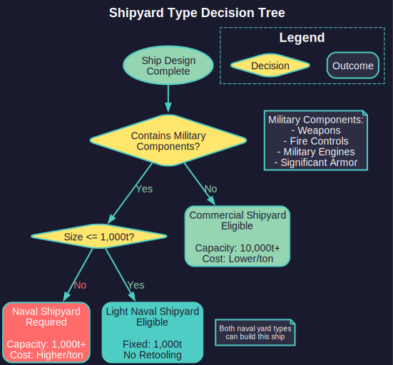
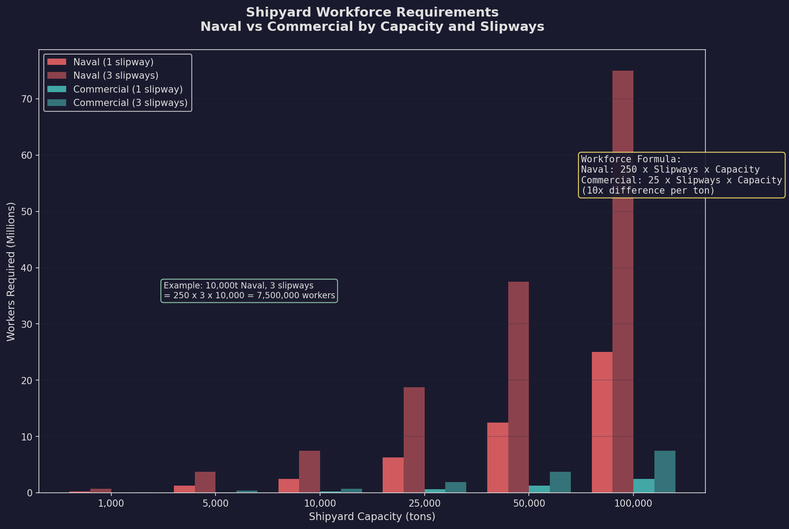
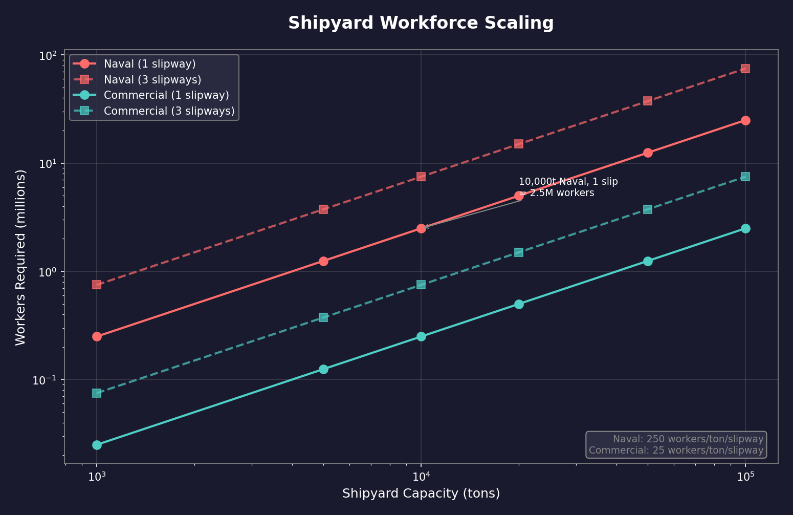
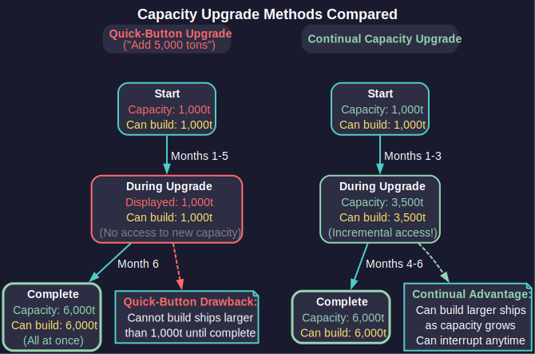

# 9.1 Shipyards

*Updated: v2026.01.30*


> **[Screenshot Pending — #844]** Shipyard Management window showing shipyard list, construction queue, capacity, and slipway information.

Shipyards are the industrial backbone of your space navy. Every warship, freighter, and colony vessel your empire fields must be constructed (see [Section 6.3 Construction](../6-economy-and-industry/6.3-construction.md) for ground-based construction) in a shipyard. Understanding shipyard mechanics is essential for maintaining a capable fleet without bankrupting your economy.

Shipyards are managed through the **Economics** window (F2), under the **Shipyard** tab. Each colony with shipyard complexes will display them here, along with their current tasks, capacity, and assigned ship classes.

## 9.1.1 Naval, Commercial, Light Naval, and Repair Shipyards

*Updated: v2026.01.30*



Aurora C# distinguishes between four types of shipyard:

**Naval Shipyards** build warships -- any vessel designed with military-grade components such as weapons, fire control systems, military-grade engines, or armor beyond the minimum. Naval shipyards can build military vessels of any size up to the yard's current capacity. They start with a base capacity of 1,000 tons \hyperlink{ref-9.1-1}{[1]} and are more expensive to expand. All shipyard types share the same base build rate: 400 BP/year per slipway \hyperlink{ref-9.1-2}{[2]} (upgradeable via [Section 7.4.2 Construction and Production](../7-research/7.4-tech-categories.md) research).

**Commercial Shipyards** build civilian and support vessels -- freighters, colony ships, fuel harvesters, terraformers, salvagers, and any other ship class that does not incorporate restricted military components. Commercial shipyards provide 10x the capacity of a naval shipyard for the same cost and workforce -- starting at 10,000 tons by default \hyperlink{ref-9.1-4}{[4]}. They are significantly cheaper to expand per ton of capacity added. However, commercial shipyards cannot build military vessels.

**Light Naval Shipyards** (v2.8.0) are a specialized fourth shipyard type designated "L" for building small warships of 1,000 tons or less. Key characteristics:

- Identical cost to Naval Shipyards
- Fixed capacity of 1,000 tons per slipway (capacity cannot be upgraded)
- Only "Add Slipway" and "SM Modification" upgrades are available
- No retooling required — can build any ship class of 1,000 tons or less without retooling
- Unlimited refit sizing between any two classes at or below 1,000 tons; size-difference cost still applies
- Pairs with the renamed **Light Naval Factories** (formerly Fighter Factories) which can build any ship of 1,000 tons or less

**Repair Yards** are a specialized shipyard type dedicated to restoring damaged vessels rather than constructing new ones. Repair yards have the same size and workforce requirements as commercial shipyards and begin with a baseline capacity of 10,000 tons. They cannot build new ships or perform refits, but can repair damaged vessels without requiring retooling for a specific class.

**Shipyard Relocation:** *(v2.6.0)* Orbital shipyards can be moved via tractor beam, but only when inactive. A shipyard is considered active if it has any ship currently under construction, refit, or overhaul. You must complete or cancel all current work before tractoring a shipyard to a new location. This prevents in-progress operations from being disrupted during relocation.

**Key Differences:**

| Feature | Naval Shipyard | Commercial Shipyard | Light Naval Shipyard | Repair Yard |
|---------|---------------|-------------------|---------------------|-------------|
| Starting Capacity | 1,000 tons \hyperlink{ref-9.1-1}{[1]} | 10,000 tons | 1,000 tons (fixed) | 10,000 tons |
| Expansion Cost | Higher per ton | Lower per ton | N/A (no expansion) | Same as commercial |
| Build Speed | 400 BP/year \hyperlink{ref-9.1-2}{[2]} | 400 BP/year \hyperlink{ref-9.1-2}{[2]} | 400 BP/year \hyperlink{ref-9.1-2}{[2]} | N/A (repair only) |
| Ship Types | Military vessels (any size) | Civilian/support vessels | Military <=1,000t | Any (repair only) |
| Retooling | Required per class | Required per class | Not required | N/A |
| Primary Role | Construction | Construction | Light Naval Construction | Repair |

**Determining Ship Type:** The game automatically classifies a ship design as military or commercial based on its components. If a design includes any explicitly military component (beam weapons, missile launchers, military engines, significant armor, etc.), it requires a naval shipyard. Otherwise, it can be built in a commercial yard.

> **Tip:** Some players build "Q-ships" -- ostensibly commercial vessels with hidden military components. These require naval shipyards despite their civilian appearance. Conversely, a sensor picket with only passive sensors and commercial engines can be built in a commercial yard.

## 9.1.2 Shipyard Capacity

*Updated: v2026.01.30*

Each shipyard has two critical capacity metrics: **tonnage capacity** and **number of slipways**.

**Tonnage Capacity** determines the maximum size of ship the yard can build. A yard with 10,000-ton capacity can build any ship class of 10,000 tons or smaller. You cannot begin construction of a ship larger than your yard's capacity -- the yard must first be expanded.

**Slipways** represent the number of ships a yard can build simultaneously. Each slipway can construct one vessel at a time. A yard with 3 slipways can have up to 3 ships under construction concurrently. Adding slipways is one of the most cost-effective ways to increase your fleet production rate.

**Build Points (BP):** Each slipway generates a fixed number of build points per year, determined by the shipyard's type and your empire's production modifiers. The base build rate is 400 BP per slipway per year \hyperlink{ref-9.1-2}{[2]} (upgradeable via Shipbuilding Rate research \hyperlink{ref-9.1-3}{[3]}). The total build points required for a ship equals its cost in build points (shown in the ship designer). Construction time equals total BP cost divided by BP generated per year per slipway.

**Starting Build Points:** A new player race in Aurora receives a number of Starting Build Points equal to two years of wealth. These can be used for instant construction at game start. When instant build points are available, an "Instant Build" section appears in the Class window's Miscellaneous tab, displaying the current point total alongside options to select a destination fleet and the quantity of ships to construct. As of v1.13.0, instant build includes an option to construct fighters directly into carrier hangars, eliminating the micromanagement of building fighters separately and then landing them. The same functionality is available on the Ground Unit Training tab of the Economics window for building ground formations. This instant build functionality also remains accessible in SM (Supervisor) Mode for scenario setup purposes.

**Workforce:** Shipyards require workers from the colony's population to function. Insufficient workforce reduces the effective build rate of the yard.



In C# Aurora, the shipyard workforce formula was redesigned from VB6 to scale proportionally with shipyard size rather than using a flat base requirement *(unverified — [#837](https://github.com/ErikEvenson/aurora-manual/issues/837) -- requires live testing)*:

```
Workers = Workers_Per_Ton x Slipways x Capacity_in_tons
```

- **Naval Shipyards:** Workers_Per_Ton = 250
- **Commercial Shipyards:** Workers_Per_Ton = 25
- **No base worker requirement** (unlike VB6 which required 1 million workers as a base)

**Examples:**

- A 10,000-ton naval shipyard with 1 slipway: 250 x 1 x 10,000 = 2,500,000 workers
- A 100,000-ton commercial shipyard with 1 slipway: 25 x 1 x 100,000 = 2,500,000 workers
- A 10,000-ton naval shipyard with 3 slipways: 250 x 3 x 10,000 = 7,500,000 workers

Adding slipways or expanding capacity multiplies the workforce requirement proportionally. The formula mirrors workforce requirements for construction factories, mines, and research facilities, where staffing directly corresponds to productive capacity.



> **Tip:** Early game, focus on adding slipways rather than expanding tonnage. Two slipways building 5,000-ton destroyers produces fleet tonnage faster than one slipway building 10,000-ton cruisers, and smaller ships are individually less costly to lose.

## 9.1.3 Expanding and Retooling

*Updated: v2026.01.30*

Shipyards can be modified in several ways through the Economics window:

**Adding Slipways:** Increases the number of ships that can be built simultaneously. This is a construction task that takes time and resources but does not interrupt any ships currently under construction in existing slipways. Each additional slipway costs a fixed amount of minerals. A new shipyard at base capacity (10,000 tons commercial or 1,000 tons naval \hyperlink{ref-9.1-1}{[1]}) takes approximately one year to add a second slipway *(unverified — [#837](https://github.com/ErikEvenson/aurora-manual/issues/837) -- requires live testing)*.

**Slipway Timing Optimization:** The time to add a slipway scales with the current capacity of the yard. Adding a slipway when the yard is at its lowest capacity results in the fastest completion time. If you want both additional slipways and expanded capacity, adding slipways first (at low capacity) then expanding gives you the second slipway sooner, enabling parallel construction during the capacity expansion phase. The total time for both operations is the same regardless of order, but slipway-first provides the earlier productivity benefit.

**Expanding Capacity:** Increases the maximum tonnage the yard can handle. Capacity expansion is incremental -- each expansion task adds a set number of tons (typically 1,000 for naval, 10,000 for commercial). Expansion tasks are queued and processed sequentially. The yard remains operational during expansion, but cannot begin construction of ships exceeding its current capacity until the expansion completes.

**Continual Capacity Upgrade Target:** When using the Continual Capacity Upgrade shipyard task, you can set a target capacity. The upgrade will automatically end when it reaches that target capacity. This prevents indefinite or wasteful upgrade cycles by establishing a defined endpoint, allowing resources to be allocated to other projects once the desired capacity is achieved.

**Capacity Upgrade Behavior -- Continual vs. Quick-Button:**



There is an important behavioral difference between the two capacity upgrade methods:

- **Quick-Button Upgrades** (e.g., "Add 5,000 tons"): The shipyard's displayed and usable capacity does not change until the entire upgrade completes. A 1,000-ton yard upgrading via "Add 5,000" remains at 1,000 tons throughout the process, then jumps to 6,000 tons upon completion. You cannot build ships larger than the original capacity during this upgrade.

- **Continual Capacity Upgrade**: Each iteration adds a small increment of capacity. The displayed and usable capacity increases incrementally as each iteration completes. You can interrupt the upgrade at any point and begin building ships up to the current (partially-upgraded) capacity.

> **Tip:** Use Continual Capacity Upgrade when you want flexibility to start building ships before the full target capacity is reached. Use quick-button upgrades when you need the full capacity increase and do not need intermediate access to the yard.

**Retooling:** When you assign a new ship class to a shipyard, the yard must retool to build that class. Retooling takes time proportional to the difference between the old and new designs. If the new class is similar to the old one (sharing many components), retooling is faster. A yard retooling from scratch (no previous assignment) takes the full retooling time.

**First Retool Free:** When a shipyard is first built and has no class assigned, the initial class assignment does not incur a retooling cost -- neither build points nor minerals are consumed. However, the retooling time still applies -- the yard must still spend the time period configuring for the new class before construction can begin. This "first retool free" mechanic only applies to the very first class assignment on a brand-new yard. All subsequent retooling to different classes incurs the normal retooling cost based on design differences.

Each shipyard can only be tooled to build one specific ship class at a time. To build a different class, you must either retool an existing yard or have another yard already tooled for that class.

**Building Secondary Classes Without Retooling (20% Refit Cost Rule):** *(v2.6.0)*

A shipyard can build any secondary class without retooling IF the refit cost from the primary (tooled) class to the secondary class is **less than 20% of the primary class's total build cost**. This is determined by component differences, not ship size alone.

**How it works:**

- The game calculates what it would cost to refit the primary class into the secondary class.
- If that refit cost is less than 20% of the primary class's build point cost, the secondary class is eligible for construction without retooling.
- Classes that exceed the 20% threshold require a full retool before construction can begin.

**Where to find eligible classes:**

- Open the **DAC/Rank/Info** tab in the Class window.
- Check the **Miscellaneous** tab for refit costs between classes.
- Eligible secondary classes appear in the shipyard build list alongside the primary class.

**Designing compatible ship variants:**

To maximize shipyard flexibility, design ship families that share expensive components:

- Use the same engine type and count across variants.
- Keep reactor and power plant configurations identical where possible.
- Vary only cheap components (cargo holds, troop bays, fuel tanks) between variants.
- Avoid swapping high-cost components between variants -- jump drives, large sensors, beam weapons, and missile launchers often push the refit cost over 20%.

> **Note:** A 6,000-ton destroyer tooled in a naval yard with a build cost of 2,000 BP can build any secondary class whose refit cost from the destroyer is under 400 BP (20% of 2,000). An escort variant that swaps two missile launchers for two gauss cannons might cost 300 BP to refit -- eligible. A variant that replaces the engine suite and adds a jump drive might cost 800 BP to refit -- not eligible, requires retooling.

> **Warning:** While you can build a secondary class in a yard tooled for a different primary class, the build time is calculated based on the tooled class's complexity (build points), not the actual class being built. A simpler variant that would normally take 9 months may take significantly longer if built in a yard tooled for a more complex primary class. This trade-off between retooling time and extended build time should factor into your production planning.

**Retooling Considerations:**

- Retooling a yard halts any ship construction in progress on that yard. However, retooling does **not** interrupt a continual capacity upgrade -- the yard continues gaining capacity while simultaneously retooling for the new class.
- The more different the new design is from the old, the longer retooling takes
- You can queue a retool order to begin after current construction completes
- Having multiple yards tooled for different classes provides strategic flexibility

**Shipyard Tasks Priority:** You can have multiple tasks queued for a single shipyard (e.g., expand capacity, then add slipway, then retool). Tasks are processed in the order assigned.

### 9.1.3.1 Repeat Shipyard Tasks (v2.8.0)

A numeric text field beside the Create Task button (default "1") allows you to queue multiple identical tasks in sequence. This applies to construction, refit, scrap, and repair tasks (but not auto-refit):

- **Construction:** Each repeat lays down an identical new ship, using the class naming theme for ship names
- **Refit:** Each repeat refits another ship of the original class to the target class
- **Scrap:** Each repeat scraps another ship of the same class
- **Repair:** Each repeat repairs another damaged ship of the same class

The task abandons if no suitable ship is available or if required alien components are lacking. The Completion Date reflects total multi-ship time, and the display shows remaining task count.

> **Tip:** Plan your shipyard infrastructure well in advance. A common strategy is to maintain one naval yard per major warship class (e.g., one for destroyers, one for cruisers) and retool only when a significantly improved design is ready. Retooling frequently wastes valuable production time.

> **Tip:** When starting a new game, immediately begin expanding your starting shipyard capacity and adding slipways. These investments pay dividends throughout the entire game as your fleet requirements grow.

## UI References and Screenshots

*Updated: v2026.01.25*

- [Shipyard Management Window Layout](../images/shipyard-window.md) — build queues, slipway management, refit interface

## Related Sections

- [Section 6.3 Construction](../6-economy-and-industry/6.3-construction.md) -- Construction factories and ground-based production
- [Section 6.1 Minerals](../6-economy-and-industry/6.1-minerals.md) -- Mineral resources consumed during ship construction
- [Section 8.1 Design Philosophy](../8-ship-design/8.1-design-philosophy.md) -- Ship design roles determining naval vs commercial yard use
- [Section 9.2 Construction and Refit](9.2-construction-and-refit.md) -- Detailed build, refit, and scrap mechanics
- [Section 7.4 Tech Categories](../7-research/7.4-tech-categories.md) -- Shipyard Construction Rate research
- [UI Reference: Shipyard Window](../images/shipyard-window.md) -- Annotated interface diagram

## References

\hypertarget{ref-9.1-1}{[1]} AuroraDB.db, FCT_Shipyard table schema: `"Capacity" Double DEFAULT 1000` confirms base shipyard capacity of 1,000 tons.

\hypertarget{ref-9.1-2}{[2]} AuroraDB.db, FCT_Race table: `ShipBuilding = 400.0` confirms base build rate of 400 BP/year per slipway.

\hypertarget{ref-9.1-3}{[3]} AuroraDB.db, FCT_TechSystem table: Shipbuilding Rate technologies progress from 560 to 8000 BP/year (TechSystemIDs 671, 680, 688, 696, 24598, 24875, 24884, 24893, 24902, 24911, 24920). Shipyard Operations technologies provide 5-50% time/cost savings (TechSystemIDs 26962-26968).

\hypertarget{ref-9.1-4}{[4]} AuroraDB.db, FCT_Shipyard table: SYType=2 (commercial) shipyards show default Capacity=10000; SYType=1 (naval) show Capacity=1000. Ratio confirms 10x commercial-to-naval starting capacity.
