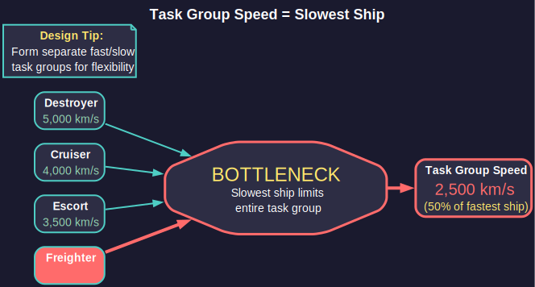
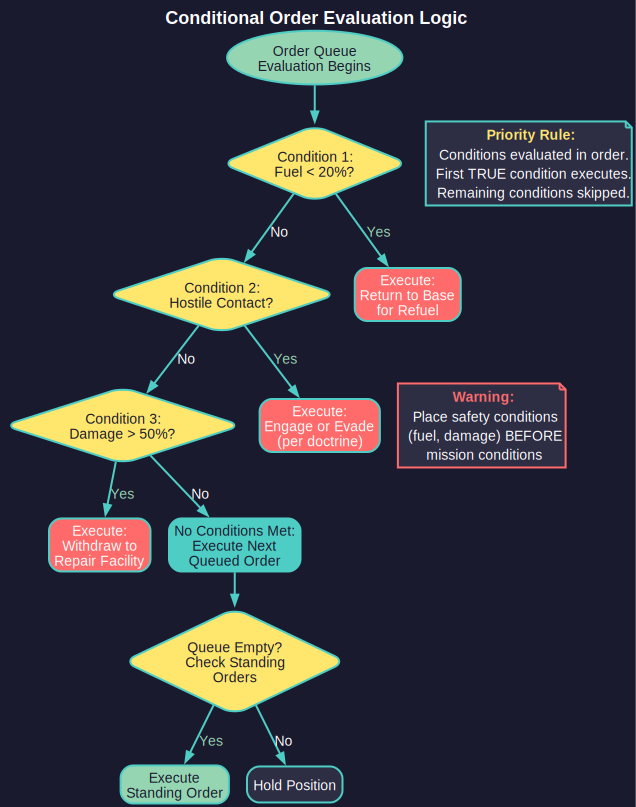

# 9.3 Task Groups

*Updated: v2026.01.30*

> **[Screenshot Pending — #842]** Task Group window showing ship roster, orders queue, and movement/speed settings.

Task Groups are the fundamental organizational unit for moving and commanding ships in Aurora C#. Every ship in space belongs to a task group, and all movement and standing orders are issued at the task group level, not to individual ships. Understanding task group mechanics is essential for effective fleet operations.

> **Note on terminology:** Aurora C# replaced the VB6 version's "Task Forces" and "Task Groups" with a hierarchical fleet organization system (see [Section 9.4.1 Fleet Hierarchy](9.4-fleet-organization.md)). However, the "Task Group" window name persists in the C# user interface. This section uses "task group" when referring to the UI window and its functions, and "fleet" when referring to the organizational unit in the Naval Organization hierarchy. In practice, many players use the terms interchangeably.

Task groups are managed through the **Naval Organization** window (F12) and the **Task Group** window, which is your primary interface for issuing orders.

## 9.3.1 Creating Task Groups

*Updated: v2026.01.30*

**Formation:** A new task group is created by selecting one or more ships and forming them into a group. This can be done from the Naval Organization window by:

1. Opening the Naval Organization window (F12)
2. Selecting the ships you want to group (from the available ships list or by detaching from existing groups)
3. Clicking "Create Task Group" and assigning a name

Alternatively, ships completing construction at a colony are automatically placed into a default task group (or can be assigned to an existing group in orbit).

**Composition Considerations:**

- Task groups can contain any mix of ship types and sizes
- There is no hard limit on the number of ships in a task group
- All ships in a task group share the same movement orders and destination
- Ships within a task group can have different combat orders (see [Section 9.5 Orders](9.5-orders.md))

**Commanders:** Each task group should have a commanding officer assigned (see [Section 16.1 Officer Generation](../16-commanders/16.1-officer-generation.md)). Several commander bonuses are relevant to task group operations \hyperlink{ref-9.3-1}{[1]}:

- **Reaction** -- Affects task group initiative and combat response timing
- **Crew Training** -- Improves crew grade over time (affects combat accuracy, transit shock, and morale)
- **Logistics** -- Affects efficiency of loading/unloading operations
- **Carrier Operations** -- Multiplies parasite fuel, MSP, and ordnance transfer rates (see [Section 9.6.4 Carrier Operations](9.6-light-naval-operations.md))

Officers are assigned from your officer pool through the Naval Organization window. For a complete list of all commander bonus types, see [Section 16.2 Skills and Bonuses](../16-commanders/16.2-skills-and-bonuses.md).

### 9.3.1.1 Task Group Initiative and Combat Turn Order

Task Group Initiative determines the movement sequence during combat. Fleets and fighter groups move in ascending order of initiative values -- lower initiative numbers act first, higher numbers act later.

**Setting Initiative:** The maximum initiative value a task group can use equals its commander's leadership level. Players set the desired initiative within this range.

**Strategic Tradeoffs:**

| Moving Earlier (Lower Initiative) | Moving Later (Higher Initiative) |
|---|---|
| Other fleets must respond to your movements | Can observe enemy movements before plotting courses |
| Useful for forcing engagement positions | Enables more accurate interception of actual positions |
| Commits you before observing the enemy | When fleeing, moving after enemies can allow escape from weapons range |

**Example Sequence:** A task group with initiative 100 moves first. Then a task group with initiative 110 observes the first group's new position and moves accordingly. Both groups then fire if able. The higher-initiative group benefits from seeing actual positions rather than predicting them.

**Tactical Implications:**

- **Aggressive pursuit:** Use higher initiative to react to enemy movement and close range
- **Kiting/standoff:** Use higher initiative to observe and maintain desired distance
- **Forcing engagement:** Use lower initiative to commit to a position the enemy must respond to
- **Escape:** Higher initiative allows you to see the pursuer's committed course and plot an optimal escape vector

**Standard Task Group Types:**

- **Combat Group** -- Warships organized for battle (escorts, capital ships)
- **Survey Group** -- Survey vessels assigned to explore systems
- **Transport Group** -- Freighters and colony ships moving cargo/population
- **Logistics Group** -- Tankers and supply ships supporting other groups
- **Patrol Group** -- Fast ships assigned to monitor an area

> **Tip:** Keep your combat task groups homogeneous in speed. A fast escort group paired with slow battleships creates a group that moves at battleship speed, negating the escorts' speed advantage. Form separate fast and slow groups that can coordinate tactically.

**Survey Fleet Splitting Workflow:** A common and efficient exploration pattern involves splitting a combined jump/survey fleet after arriving in a new system to enable parallel geological and gravitational surveys:

1. Jump into the new system with a combined fleet containing both a jump-capable grav survey ship and a geo survey ship
2. Once in-system, detach the geo survey ship into its own fleet via the Naval Organization window (F12)
3. Assign the detached geo survey ship "Investigate System Bodies" standing orders to survey planets, moons, and asteroids for minerals
4. The jump ship continues its gravitational survey standing orders to locate jump points
5. Both ships now operate in parallel -- the geo survey ship finds mineral deposits while the jump ship maps jump points

This parallel operation is significantly more efficient than keeping both ships in one fleet following a single order set. See [Section 17.1 Geological Survey](../17-exploration/17.1-geological-survey.md) and [Section 17.2 Gravitational Survey](../17-exploration/17.2-gravitational-survey.md) for survey mechanics.

> **Tip:** When splitting survey fleets, assign different areas to each survey ship (e.g., inner vs. outer system bodies) to prevent ships from hopscotching between the same targets, wasting fuel and time.

## 9.3.2 Task Group Speed

*Updated: v2026.01.30*



The speed of a task group is determined by its **slowest member** \hyperlink{ref-9.3-2}{[2]}. This is one of the most important constraints in fleet management.

**Speed Calculation:** Each ship's maximum speed is determined by its engine power divided by its total mass (see [Section 8.3.4 Speed Calculations](../8-ship-design/8.3-engines.md)). The task group's speed equals the minimum of all member ships' speeds.

**Implications:**

- Adding a single slow ship to a fast task group reduces the entire group's speed
- Cargo-laden freighters are typically much slower than warships
- Ships low on fuel weigh less and may actually be slightly faster (but risk running out of fuel)
- Damaged engines reduce a ship's speed, which can slow the entire group

**Speed and Fuel Consumption:** Ships in a task group all travel at the group's speed, not their individual maximum speeds. Ships capable of higher speeds that are throttled down to match the group consume less fuel per hour than at their maximum speed. Fuel consumption is measured in litres per engine power hour \hyperlink{ref-9.3-3}{[3]}, meaning it is time-based rather than distance-based. Ships traveling at reduced speed consume proportionally less fuel per hour, though for a fixed-distance transit total fuel used is roughly constant regardless of speed.

**Use Maximum Speed Checkbox:** Fleets have a checkbox option on the Naval Organization window titled "Use Maximum Speed." When enabled, the system automatically rechecks fleet velocity at the start of each movement sub-pulse and applies the maximum available speed. This is particularly useful when fleet composition changes mid-transit (e.g., a slow ship is detached or a damaged engine is repaired), allowing the fleet to immediately take advantage of the new maximum speed without requiring manual order updates.

**Maximum Speed Display:** The Task Group window displays both the task group's current maximum speed (limited by the slowest ship) and the speeds of individual members, allowing you to identify which ship is the bottleneck.

> **Tip:** If a damaged ship is slowing your combat group during a retreat, consider detaching it. One sacrificed cripple is better than losing the entire fleet because it could not outrun the enemy.

> **Tip:** Design your fleet with speed tiers in mind. If your destroyers do 5,000 km/s and your cruisers do 3,500 km/s, form separate task groups that can operate independently or combine at the slower speed when concentrated force is needed.

## 9.3.3 Conditional Orders

*Updated: v2026.01.30*



Conditional orders allow task groups to respond automatically to changing circumstances without player intervention. These are critical for managing a large empire where you cannot micromanage every fleet movement.

**Setting Conditional Orders:** In the Task Group window, the orders list supports conditional logic. You can set orders that trigger based on specific conditions:

**Available Conditions:**

- **Fuel Level** -- Execute order when fuel drops below a threshold (e.g., "if fuel < 25%, move to nearest fuel depot")
- **Ammunition** -- Execute order when ordnance is depleted or below a threshold
- **Shield Status** -- Respond to shield damage
- **Contacts** -- React to detected enemy contacts (requires sensors)
- **Order Completion** -- Chain orders sequentially (proceed to next order when current completes)
- **Target Destroyed** -- Move to next target after current is eliminated

**Standing Orders:** These are persistent instructions that remain in effect regardless of other orders:

- **Avoid Enemy Contacts** -- Task group will alter course to evade detected hostiles
- **Engage at Will** -- Task group will fire on detected enemies within range
- **Maintain Distance** -- Keep a specified distance from contacts

**Order Loops:** You can create patrol loops by setting a series of waypoint orders that cycle. When the final order completes, the group returns to the first order in the sequence, creating an indefinite patrol pattern.

**Sub-Pulse Order Processing:** Aurora C# processes orders within each time increment. Conditional orders are evaluated at each sub-pulse *(unverified — [#837](https://github.com/ErikEvenson/aurora-manual/issues/837) -- requires live testing)*, meaning a task group can detect a threat and respond within the same time increment.

> **Warning:** Always set a "low fuel" conditional order on your combat groups. A fleet that runs out of fuel in enemy territory is a dead fleet. Setting an automatic return-to-base at 20-30% fuel ensures you always have enough to get home.

> **Tip:** For survey ships, set conditional orders to return to base when fuel drops below 40-50% (they need margin for the survey process, which involves frequent course changes that consume extra fuel).

> **Tip:** Conditional orders are evaluated in priority order. Place safety-critical conditions (low fuel, enemy contact evasion) above routine orders so they take precedence.

## 9.3.4 Fleet Training

*Updated: v2026.01.30*

Fleet Training allows ships to improve their crew performance through intensive exercises. In Aurora C#, training is managed through the Admin Command system rather than individual ship orders.

**Training Admin Commands:** To train ships, you must have an Admin Command with the "Training" specialization. Attaching a fleet to a Training Admin Command starts training automatically; removing it ends training. Only military ships benefit from this system.

**Training Points Formula:** Each construction phase, ships gain Fleet Training Points based on \hyperlink{ref-9.3-4}{[4]}:

```
Training Points = Crew Training Bonus of Admin Command Commander x Ship Crew Grade x Ship Morale x (Construction Phase Length / One Year)
```
*(unverified formula — #837 -- requires live testing; the Fleet Training bonus (BonusID 37) exists as a distinct bonus type from Crew Training (BonusID 1) \hyperlink{ref-9.3-4}{[4]}; the formula may use Fleet Training rather than Crew Training)*

The commander assigned to the Training Admin Command must be of sufficient seniority for training to proceed effectively. As of v1.12.0, fleet training points persist when ships are transferred between task groups or fleets, preventing loss of accumulated training investment during fleet reorganization.

**Active Service Penalties:** Ships undergoing training remain operational but face significant restrictions and penalties:

- **Range Restriction:** The fleet must stay within range of the Training Admin Command
- **No Maintenance Access:** Ships cannot access maintenance facilities while training
- **No Recreation:** No benefit from Recreational Locations during training
- **Doubled Maintenance Failures:** Maintenance failure rate is doubled compared to normal operations *(unverified — [#837](https://github.com/ErikEvenson/aurora-manual/issues/837) -- requires live testing)*
- **Accelerated Wear:** Both maintenance clock and shore leave clock increase at 2x rate (unless the ship is stored in a military hangar)
- **Fuel Consumption:** Fuel is consumed as if engines are running at 10% power continuously, simulating training exercises *(unverified — [#837](https://github.com/ErikEvenson/aurora-manual/issues/837) -- requires live testing)*
- **Prerequisites:** Training requires adequate fuel reserves and a sufficiently senior Training Admin Command commander

**Overhaul Exception (v2.1.1):** Ships undergoing overhaul within a Training Command are exempt from training penalties -- they do not consume fuel or maintenance supplies for training purposes, and do not incur deployment penalties during the overhaul period. However, they also cease accumulating fleet training points until the overhaul completes. This allows ships to be overhauled without removing them from a Training Command's organizational structure.

**Key Distinction from VB6:** Unlike VB6 Aurora, training fleets in C# can perform normal duties simultaneously. The system simulates "intensive training during normal activities" while imposing the operational penalties listed above. This means your training ships are not completely sidelined -- they can patrol, escort, or perform other tasks while training, but they will wear out faster and cannot be properly maintained during the training period.

> **Tip:** Rotate ships through training commands rather than keeping them permanently attached. The accelerated wear means ships need maintenance periods between training cycles to avoid excessive breakdowns.

> **Tip:** Assign your best training officer to the Training Admin Command. Their Crew Training bonus directly multiplies training point accumulation, making a skilled instructor dramatically more effective than a mediocre one.

## 9.3.5 Squadrons and Sub-Fleets

*Updated: v2026.01.26*

Sub-fleets provide an internal organizational structure within a parent fleet. They allow you to group ships logically without creating independent fleets, maintaining cohesion while enabling tactical flexibility.

**Sub-Fleet Mechanics:**

- Sub-fleets organize ships within a parent fleet without independent movement capabilities
- All ships within the sub-fleet hierarchy move within the parent fleet
- Unlimited nesting of sub-fleets is allowed (sub-fleets within sub-fleets)
- As of v2.0.3, sub-fleets of sub-fleets are correctly saved and reloaded between game sessions
- Sub-fleets can be detached to become independent fleets when needed
- When a sub-fleet detaches, all its subordinate sub-fleets inherit the status of their new parent

**Join as Sub-Fleet Order:** A fleet can be ordered to "Join as Sub-Fleet" of another fleet. When executed, the joining fleet automatically forms a sub-fleet structure within the recipient fleet. This is useful for organizing reinforcements that arrive at a fleet's location -- they integrate into the fleet's structure for coordinated movement while remaining identifiable as a distinct unit for later detachment.

**Sub-Fleet Escort Settings:** Sub-fleets can retain independent formation and escort settings (see [Section 9.5 Orders](9.5-orders.md) for Escort Orders). These settings remain dormant while the sub-fleet is integrated but reactivate automatically if the sub-fleet is detached. This allows you to pre-configure escort behavior that activates the moment a sub-fleet becomes independent.

**Detach and Recall Controls:**

- **Detach Escorts:** Releases all sub-fleets that have anchor fleet settings configured, allowing them to take up their pre-configured escort positions
- **Recall Escorts:** Issues "Join As Sub-Fleet" orders to compatible escort fleets in the same system, bringing them back into the parent fleet's organization

**Commercial and Military Mixed Fleets:** When a fleet contains ships with both commercial and military engines, standard transits through jump points treat each engine type separately. Commercial-engined ships require adequately-sized commercial jump drives, and military-engined ships require adequately-sized military jump drives. Each engine type is evaluated independently. However, if any ship with either engine type cannot jump, the entire fleet fails to transit. Military jump drives can transit ships with either engine type \hyperlink{ref-9.3-5}{[5]}.

**Transfer Fleet to Alien Race (v2.0.0+):**

Players can transfer entire fleets to known alien races. For full details on the transfer process, NPR fleet classification, and tactical considerations, see [Section 9.4.5 Transfer Fleet to Alien Race](9.4-fleet-organization.md).

> **Tip:** Organize your escort ships as sub-fleets of your main battle fleet during transit. When you reach the operational area, use "Detach Escorts" to release them to their pre-configured escort positions around the main body.

> **Tip:** Plan your sub-fleet organization with detachment in mind. Group ships that will operate together after separation into the same sub-fleet, making the transition from transit formation to combat formation a single click.

## UI References

- [Fleet Window Layout](../images/fleet-window.md) — task group hierarchy, ship lists, and formation controls
- **Forum screenshots:**
  - [Automated Assignment](http://www.pentarch.org/steve/Screenshots/AutomatedAssignment001.PNG) — fleet automation interface

## Related Sections

- [Section 9.4 Fleet Organization](9.4-fleet-organization.md) -- Higher-level fleet hierarchy and admin commands
- [Section 9.5 Orders](9.5-orders.md) -- Detailed order types available to task groups
- [Section 16.1 Officer Generation](../16-commanders/16.1-officer-generation.md) -- Officer types and skills affecting task group performance
- [Section 16.2 Skills and Bonuses](../16-commanders/16.2-skills-and-bonuses.md) -- Commander bonus types and generation
- [Section 8.3 Engines](../8-ship-design/8.3-engines.md) -- Speed calculations and fleet speed implications
- [Section 12.1 Fire Controls](../12-combat/12.1-fire-controls.md) -- How initiative and movement affect combat
- [Section 3.2 System Map](../3-user-interface/3.2-system-map.md) -- Navigating task groups through systems
- [UI Reference: Fleet Window](../images/fleet-window.md) -- Annotated interface diagram

## References

\hypertarget{ref-9.3-1}{[1]} AuroraDB.db, DIM\_CommanderBonusType table: Naval commander bonus types include Reaction (BonusID=13), Crew Training (BonusID=1), Logistics (BonusID=24), Carrier Operations (BonusID=7), Tactical (BonusID=21), Survey (BonusID=2), Engineering (BonusID=28), and others. All are percentage-based bonuses.

\hypertarget{ref-9.3-2}{[2]} AuroraWiki "Fleet" page -- Task group speed equals the minimum speed of all member ships. Ship speed = Total Engine Power x 1000 / Ship Size in HS.

\hypertarget{ref-9.3-3}{[3]} AuroraDB.db, FCT\_TechSystem table: Fuel Consumption technology entries measured in "Litres per Engine Power Hour" units, confirming time-based fuel consumption model.

\hypertarget{ref-9.3-4}{[4]} AuroraDB.db, DIM\_CommanderBonusType table: Fleet Training (BonusID=37) exists as a distinct naval bonus type separate from Crew Training (BonusID=1). Both are percentage-based (Percentage=1).

\hypertarget{ref-9.3-5}{[5]} Aurora Wiki "Jump drive" page -- Military jump drives can transit ships with either military or commercial engines.
