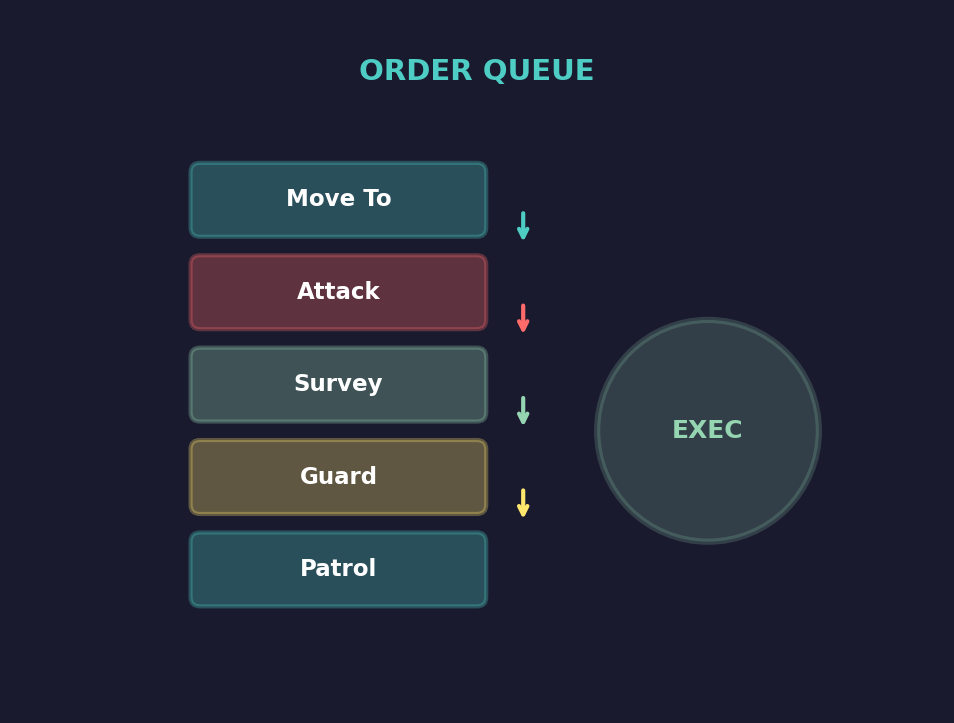
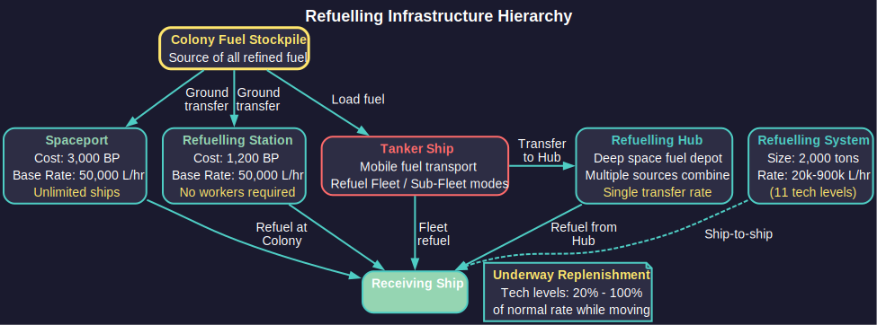

# 9.5 Orders

*Updated: v2026.01.30*

Orders are how you direct your fleets to accomplish objectives. Aurora C# provides a comprehensive order system ranging from simple movement commands to complex conditional behavior chains. Mastering the order system is key to running an efficient empire, especially as your navy grows beyond what you can manually direct each increment.

Orders are issued through the **Task Group** window (a legacy name -- see the [terminology note in Section 9.3](9.3-task-groups.md)), which displays the selected fleet's current order queue and provides controls for adding, removing, and reordering instructions.

## 9.5.1 Movement Orders

*Updated: v2026.01.30*

Movement orders direct a task group to travel to a specific location. These are the most commonly issued orders and form the backbone of all fleet operations.

**Move To:** The basic movement order. Directs the task group to travel in a straight line to a destination at its maximum speed. Destinations can include:

- A specific body (planet, moon, asteroid)
- A colony
- A jump point
- Another task group's current position
- A waypoint (see [Section 10.4 Waypoints](../10-navigation/10.4-waypoints.md))
- Specific coordinates in a star system

**Orbit:** Directs the task group to take up orbit around a celestial body. This is distinct from merely moving to the body's location -- orbiting establishes the group in a stable position relative to the body, which is required for certain operations like loading cargo at a colony or conducting orbital surveys.

**Patrol:** Establishes a repeating movement pattern between two or more waypoints. The task group moves to each waypoint in sequence, then loops back to the first. Patrol orders continue indefinitely until canceled or superseded by a conditional trigger.

**Follow:** Commands the task group to match position with another specified task group, maintaining formation as the lead group moves. Useful for logistics ships trailing a combat fleet or escorts shadowing a high-value target.

**Move to Contact:** Directs the group toward a detected sensor contact. The task group will continue to close with the contact, updating its course as the contact moves. Contacts can be active, thermal, EM, or sensor emission types. If the specific contact type being followed is lost but the target ship remains visible through a different contact type, the game automatically switches the movement order to the remaining contact -- the order is only cancelled if all contact with the target is lost entirely.

**Intercept:** A specialized movement order that calculates an intercept course with a moving target, plotting the shortest path to a meeting point rather than chasing directly. More fuel-efficient than "Move to Contact" when the target is moving at an angle.

### 9.5.1.1 Default Movement Actions

Default Movement Actions enable quick order creation by double-clicking destinations in the Naval Organization window's movement orders tab, eliminating the need to manually select order types each time. The feature can be toggled on or off using the "Use Default Movement Actions" checkbox.

**Default Actions by Destination Type:**

| Destination | Default Action |
|-------------|----------------|
| Jump point | Standard Transit |
| Population | Refuel and Resupply from Colony |
| Fleet | Join Fleet |
| Contact | Follow |
| Life Pod | Rescue Survivors |
| Wreck | Salvage Wreck |
| Survey Location | Gravitational Survey |
| System Body | Geological Survey |
| Waypoint | Move To |

### 9.5.1.2 Commercial Jump Mechanics

Military jump drives can transit vessels equipped with either military or commercial engines, provided the ship remains within the jump drive's normal size limitations. This applies to both standard and squadron jumps, allowing military-grade jump infrastructure to serve dual purposes supporting both combat vessels and commercial traffic.

> **Tip:** Use "Orbit" rather than "Move To" when you want ships to remain at a colony. "Move To" merely brings the group to the location; it does not establish the stable orbital relationship needed for cargo operations.

> **Tip:** When plotting movements across a system, remember that all movement is in straight lines. There is no pathfinding around obstacles. If a direct path takes your ships dangerously close to a hostile force, set intermediate waypoints to route around them.

## 9.5.2 Combat Orders

*Updated: v2026.01.30*

Combat orders govern how a task group behaves when engaging hostile forces. These orders can be set as standing doctrine or issued in response to specific tactical situations.

**Engage Target:** Directs the task group to attack a specific target or the nearest hostile contact. The group will close to weapons range and fire.

**Engage at Will:** A standing order that allows the task group to fire on any hostile contact within range without specific player direction. Essential for defensive groups that may encounter threats when you are not watching.

**Evade:** Directs the task group to flee from the nearest hostile contact at maximum speed. The group will attempt to open distance, changing course as needed to stay away from pursuers.

**Distance Settings:** You can specify engagement ranges:

- **Close to X km** -- Move within a specified distance before engaging
- **Maintain X km** -- Attempt to keep a specified distance while firing (stand-off engagement)
- **Open to X km** -- Disengage and open distance to at least X km

**Fire Control Assignment:** Within a task group, individual ships can be assigned specific fire control priorities:

- Target type priorities (prioritize military over civilian, or specific hull sizes)
- Weapon assignment (which weapons fire at which targets)
- Point defense settings (allocate some weapons to missile defense)

**Pursuit Orders:** Determines whether the task group will chase fleeing enemies:

- **Pursue** -- Follow retreating enemies until destroyed or out of sensor range
- **Do Not Pursue** -- Hold position after the enemy breaks contact
- **Pursue to X km** -- Chase enemies but stop at a maximum distance from the original position

**Formation:** Task groups can be set to maintain combat formation:

- Ships maintain relative positions during engagement
- Formation discipline affects how quickly the group can concentrate fire
- Faster ships in a mixed group can be set to screen ahead of slower capitals

> **Tip:** Set "Maintain Distance" orders for missile ships so they stay at standoff range rather than closing to point-blank. Beam ships should "Close to" their optimal range. This creates a layered engagement where missiles soften targets before beam ships close.

> **Tip:** Always set "Evade" as a conditional order triggered by shield/armor damage thresholds on valuable ships. An admiral who fights to the death is admirable in fiction but wasteful in Aurora.

## 9.5.3 Logistics Orders

*Updated: v2026.01.30*

Logistics orders handle the movement of cargo, fuel, troops, and colonists. These orders are essential for maintaining your empire's supply chains and expanding to new worlds.

**Load Cargo:** Directs the task group to load specific cargo types from the colony it is orbiting:

- Minerals (specific types or all available)
- Installations (factories, mines, infrastructure)
- Ground forces (army units)
- Population (for colony ships)

Loading takes time proportional to the amount loaded and the ship's cargo handling equipment. In C# Aurora, the wait period takes place first, then the cargo is loaded at the end of the timer. This means if a fleet abandons its orders before the loading period completes, no cargo transfer occurs.

**Load Installations Display:**

*Added: v2.6.0*

The Load Installations order displays the required number of cargo holds in parentheses after the installation type \hyperlink{ref-9.5-10}{[10]}. This allows players to verify transport capacity before issuing orders.

**Load Ground Units Display:**

*Added: v2.6.0*

The Load Ground Units order shows formation size in a dedicated tons column \hyperlink{ref-9.5-11}{[11]}. This helps verify transport capacity before loading ground forces and assists with logistics planning for military operations (see [Section 13.2 Training and Transport](../13-ground-forces/13.2-training-and-transport.md)).

**Load All Minerals Until Full:** Identical to the standard "Load All Minerals" order except that the order remains active until the fleet's cargo capacity is completely full. The system works as a repeating loop: when the loading timer runs down to zero, the order completes if cargo capacity is full. If not, the fleet movement ends for the sub-pulse and the loading clock resets. The cycle repeats until the cargo holds are full. This order respects existing mineral reserve settings at each population, preventing depletion of required stockpiles. This allows players to set up freighter runs to bring minerals from outlying colonies without micromanagement or fuel waste.

**Load Assigned Ground Templates:** Automates the loading of ground forces onto transport ships. When issued, each ship with assigned ground unit templates will automatically load compatible ground formations from the destination population. Formations are selected based on matching criteria: same original template design as the ship's assignment, identical size to the original template with no losses, and located at the destination population. All individual ground unit formations are chosen and loaded simultaneously when the loading period completes. The loading duration is calculated based on the maximum capacity of the transport ships involved. This order can be issued while ground units are still under construction or timed to arrive after the fleet, providing flexibility in military logistics planning.

**Unload Cargo:** The reverse of loading -- deposits cargo at the current colony. As with loading, the wait period occurs first and the cargo is unloaded at the end of the timer. If a fleet abandons its orders before the unloading period completes, no cargo transfer occurs.

**Load Ordnance:** Replenishes missile magazines and ammunition from the colony's ordnance stockpile (see [Section 6.3 Construction](../6-economy-and-industry/6.3-construction.md) for ordnance factory production and [Section 12.3 Missiles](../12-combat/12.3-missiles.md) for ordnance transfer mechanics). Critical for missile-heavy fleets that expend ammunition in combat.

**Auto-Route:** A powerful automation order for transport groups. When set, the task group will automatically shuttle between two colonies, loading at one and unloading at the other, based on the colonies' needs and available cargo.

**Colony Orders:** Specialized logistics orders for colony ships:

- **Load Colonists** -- Fill the colony ship with population from the current colony
- **Unload Colonists** -- Deposit colonists at the destination (establishes a new colony if none exists). Can also be configured as a standing order, enabling colony ships to autonomously deliver population to designated worlds on repeat cycles without manual intervention each trip.

**Load All Ship Components (v2.8.0):** Loads the maximum number of ship components from the destination population, prioritized in descending size order. Useful for logistics runs collecting prefabricated components for deployment elsewhere.

**Join Fleet and Begin Overhaul:** A combined order that moves the task group to the target fleet's location, joins it, and immediately begins maintenance overhaul. As of v2.8.0, this order is also available when targeting a fleet in orbit near a population with maintenance modules, and for deep space overhaul operations.

### 9.5.3.1 Infrastructure Transport Mechanics

Infrastructure is a common early-game cargo for colony development. Understanding the cargo math and order workflow prevents costly mistakes.

**Cargo Size:** Each infrastructure unit occupies 2,500 tons of cargo capacity \hyperlink{ref-9.5-1}{[1]} (displayed as "0.1" in the Load Installation interface, meaning 0.1 of a 25,000-ton cargo hold). A freighter with 25,000 tons of cargo capacity carries 10 infrastructure per trip. Two freighters in the same fleet carry 20 infrastructure per round trip.

**Capacity Rule of Thumb:** Each infrastructure unit supports approximately 5,000 population on a colony cost 1.0 body *(unverified — [#837](https://github.com/ErikEvenson/aurora-manual/issues/837) -- requires live testing)*. Twenty infrastructure supports roughly 100,000 population.

**Step-by-Step Transport Procedure:**

1. Select fleet in the Movement Orders tab.

2. Click source body (e.g., Earth) and add "Load Installation -- Infrastructure".

3. Click destination body (e.g., Luna) and add "Unload All Installations".

4. Use "Repeat Orders" to multiply the trip sequence (e.g., repeat to create 15 total trips).

5. Add a final "Go to [source] -- Refuel/Resupply" order after configuring repeats.

> **Warning:** "Repeat Orders" repeats everything currently in the queue. Repeating a 2-order queue makes 4; repeating 4 makes 8; repeating 8 makes 16. This exponential doubling means careless clicking can create excessive order queues. Add refuel/resupply orders after setting up repeats, not before, or they will be repeated as well.

**Other Installation Sizes:** Financial centers occupy a 1:1 ratio in cargo capacity (significantly larger than infrastructure per unit). Check the Load Installation display for the exact cargo fraction of each installation type.

**Standing Logistics Orders:**

- **Repeat Orders** -- Cycle through the order queue indefinitely (load, travel, unload, return, repeat)
- **Repeat Orders X Times** -- A text box next to the Repeat Orders button allows specifying how many times the order set should repeat. Entering 3 executes the orders four times total (the original plus three repeats). Values of 0 or negative numbers are treated as 1. Orders must start and finish in the same system to be valid for repeating.
- **Until Complete** -- Continue cycling until no more cargo is available to move
- **Single Run** -- Execute the order queue once, then stop

### 9.5.3.2 Mineral Transport Mechanics

Mineral transport via freighters has several important mechanics that affect automation and efficiency.

**Reserve Levels:**

Each colony can set a mineral reserve level per mineral type, representing the minimum stockpile that should be retained. Reserve levels are set by double-clicking the mineral row in the Mining tab of the Population and Production window. Mineral loading orders respect reserve levels -- a "Load All Minerals" order will only load minerals **above** the reserve level at the source colony. If a colony's stockpile is at or below its reserve level for every mineral, the freighter waits indefinitely until production creates a surplus.

**Sequential Loading Pitfall:**

The basic "Load All Minerals" order loads minerals **sequentially by type** until the cargo hold is full. This means one abundant mineral (typically Duranium) can fill the entire hold, leaving no room for scarcer minerals that may be more urgently needed at the destination.

**Solution -- Specify a Quantity:** When you add a quantity parameter to the "Load All Minerals" order, the behaviour changes: the freighter loads the specified amount of **each** mineral type rather than filling up on one. For example, "Load All Minerals" with a quantity of 500 loads up to 500 tons of each available mineral. Size the quantity to distribute your cargo capacity evenly across the mineral types you expect to transport.

**Recommended Mineral Run Setup:**

1. Select the freighter fleet and add "Load [specific mineral]" at the mining colony with a minimum amount of 1 ton. This acts as a gate -- the freighter waits at the colony until at least 1 ton of that mineral is available, preventing empty return trips.
2. Add "Load All Minerals" (with an optional quantity parameter for balanced loading).
3. Add movement to the destination colony.
4. Add "Unload All Cargo" at the destination.
5. Add movement back to the mining colony.
6. Enable "Cycle Orders" to repeat indefinitely.

**Cargo Weight:** One unit of minerals weighs two tons of cargo capacity, not one. A freighter with 25,000 tons of cargo capacity carries 12,500 mineral units. Account for this when planning loading quantities.

> **Warning:** If both the source and destination colonies have surplus of the same mineral, the freighter will load that mineral at the source (it is above reserve) and unload it at the destination (unload orders deposit cargo regardless of destination stockpile). On the return trip, the freighter loads the same mineral again. This creates a pointless cycle for that mineral type but does not prevent the freighter from operating -- it simply wastes cargo capacity. To avoid this, set reserve levels at the source colony high enough to retain minerals that do not need to be transported, or use specific mineral loading orders instead of "Load All Minerals."

> **Tip:** For colonies that produce many mineral types, use "Load All Minerals" with a quantity parameter to ensure balanced transport. For colonies that produce only one or two minerals in quantity, use specific "Load [Mineral]" orders instead.

> **Tip:** Mass drivers (see [Section 6.2 Mining](../6-economy-and-industry/6.2-mining.md)) provide a zero-fuel, zero-ship alternative for intra-system mineral transport. For inter-system transport, freighters are the only option.

### 9.5.3.3 Order Delay

As of v1.9.0, orders support a configurable delay before execution begins. When an order delay is set, the fleet waits for the specified duration before proceeding with the next order in the queue.

**Key Features:**

- Works with cycle orders, repeat orders, and move templates
- Allows synchronized fleet operations (e.g., multiple fleets departing at staggered intervals)
- The delay timer begins when the order becomes active in the queue
- Useful for coordinating logistics schedules and timed military operations

### 9.5.3.4 Combination Orders

Combination Orders allow multiple logistics functions to execute simultaneously on ships and fleets, significantly reducing the time required for complex resupply operations. When a combination order is issued, all specified activities happen in parallel, and the order completes when the activity with the greatest duration finishes.

**Available Combination Orders:**

- **Refuel, Resupply, Load Ordnance from Colony** -- Performs all three resupply actions simultaneously at a colony
- **Join, Refuel and Resupply Target Fleet** -- Moves to and joins the target fleet, then refuels and resupplies simultaneously
- **Join, Refuel, Resupply, Add Ordnance to Target Fleet** -- Moves to the target fleet, joins it, and performs all three resupply actions simultaneously

**Key Mechanic:** The completion time of a combination order is determined by whichever individual activity takes longest. For example, if refuelling takes 4 hours and resupply takes 6 hours, the combination order completes in 6 hours (not 10).

### 9.5.3.5 Launch Orders

**Launch All:** Appears in the Naval Organization window when a Fleet, Sub-Fleet, or Ship is selected and parasites are present. Launches all parasites from the selected ship, sub-fleet, or fleet into a single new fleet. If the parasites are attached to one or more squadrons, those squadrons and their attached parasites are created as sub-fleets within the new fleet. Empty squadrons are ignored. This enables bulk deployment of all carried fighters or other parasite units simultaneously while maintaining squadron organizational structure.

**Launch Ready Ordnance:** Can be executed at any movement destination, including waypoints. Any ordnance assigned to a missile launcher that is assigned to a fire control will be launched at that point. The fire control does not need to be set to "fire" -- the missile will be launched without an assigned target. Primary use cases include:

- **Buoy deployment** -- Establishing sensor networks across space
- **Mine laying** -- Creating defensive perimeters or chokepoint obstacles
- **Unguided launches** -- Deploying ordnance at predetermined locations when targets are unknown

### 9.5.3.6 Refuelling System

Refuelling in Aurora C# is no longer instantaneous. Ships require specialized equipment and can only refuel at specific locations and from specific sources. A dedicated technology line ("Refuelling Systems") provides ship-mounted refuelling components starting at 20,000 litres per hour and scaling through eleven technology tiers up to 900,000 litres per hour \hyperlink{ref-9.5-2}{[2]}. The base racial refuelling rate for colonies (used by spaceports and refuelling stations) starts at 50,000 litres per hour \hyperlink{ref-9.5-3}{[3]}.

**Refuelling Infrastructure:**

| Facility | BP Cost | Size | Notes |
|-----------|---------|------|-------|
| Spaceport | 3,000 \hyperlink{ref-9.5-4}{[4]} | 2x research fac. (1,000 ktons cargo) \hyperlink{ref-9.5-4}{[4]} | Unlimited ships; stationary; freighter-transportable |
| Refuelling Station | 1,200 \hyperlink{ref-9.5-5}{[5]} | 10 factories (250 ktons cargo) \hyperlink{ref-9.5-5}{[5]} | No workers; freighter-transportable |
| Refuelling System | 10-100 | 2,000t (component) \hyperlink{ref-9.5-6}{[6]} | Ship-mounted; single-ship refuelling from tanker |

**Underway Replenishment Technology:** Allows refuelling while both vessels are moving together. Starting at 20% of the normal refuelling rate \hyperlink{ref-9.5-7}{[7]} and advancing through five technology tiers (20%, 30%, 45%, 70%, 100%) to reach 100% of normal rate \hyperlink{ref-9.5-7}{[7]}. Without this technology, ships must be stationary to transfer fuel.

**Tanker Status Flags:** Tanker ships can be assigned one of three operational statuses:

- **None** -- No refuelling activity
- **Refuel Fleet** -- Continuously refuels all ships in the parent fleet during normal operations, keeping fuel tanks topped up
- **Refuel Sub-Fleet** -- Refuels only ships within the same sub-fleet hierarchy

**Refuelling Priority System:** When multiple ships need fuel, tankers refuel in descending order of priority:
1. Ship priority (higher numbers serviced first)
2. Class priority (higher numbers serviced first)

Each tanker class has a configurable minimum fuel threshold below which it ceases refuelling other ships (to preserve its own operational reserve). Tankers automatically move between multiple targets if time and fuel permit.

**Refuelling Orders:**

- **Refuel at Colony** -- Refuels from a colony's fuel stockpile; requires the colony to have a spaceport or refuelling station
- **Join & Refuel Fleet** -- The tanker's fleet joins the target fleet and activates "Refuel Fleet" status
- **Join & Refuel Sub-Fleet** -- The tanker's fleet becomes part of the target sub-fleet with "Refuel Sub-Fleet" status activated
- **Refuel from Refuelling Hub** -- Requires a destination fleet containing at least one Refuelling Hub; refuelling continues until tanks are full or hubs deplete; multiple hubs contribute fuel collectively but do not increase the transfer rate
- **Refuel from Colony** -- Available only at colonies with spaceports or refuelling stations; works identically to hub refuelling mechanically
- **Refuel from Stationary Tanker** -- Directs a fleet to refuel from a tanker that must remain stationary at a location. The order will not work if the target fleet is moving when the fleet arrives; both fleets must be stationary for the operation to succeed.
- **Refuel at Hub (Standing Order)** -- A standing order variant that directs a fleet to seek out and refuel from the nearest Refuelling Hub

**Resupply Orders:**

- **Resupply from Stationary Supply Ship** -- Functions like "Refuel from Stationary Tanker" but handles maintenance supplies instead of fuel. A designated supply ship must be positioned stationary at a location; the operation will not work if the target fleet is moving when the fleet arrives. Both fleets must be stationary for the supply transfer to succeed.
- **Non-Combat Resupply** -- Ground forces can resupply outside of combat when stationed at a population with available logistics units. For full details on non-combat resupply mechanics and the formation commander's logistics bonus, see [Section 13 Ground Forces](../13-ground-forces/13.2-training-and-transport.md).

**Fuel Transfer Orders (for tanker-designated ships):**

- **Transfer Fuel to Colony** -- Transfers fuel to colonies with spaceports or refuelling stations at the tanker's refuelling rate
- **Transfer Fuel to Refuelling Hub** -- Transfers fuel to any ship mounting a hub at the tanker's refuelling rate; multiple tankers can transfer simultaneously

> **Tip:** Set up automated "Repeat Orders" cargo runs early in the game for critical mineral routes. A pair of freighters on auto-repeat between your mining colony and your home world provides a steady mineral supply without requiring your attention every few days.

> **Tip:** Keep a dedicated tanker group near your main fleet's operating area. Combat ships with nearly empty tanks after a battle need rapid refueling, and waiting for a tanker to arrive from the home system could leave your fleet vulnerable.

> **Tip:** Use "Refuel Fleet" status on your tankers rather than issuing individual refuelling orders. This keeps the tanker continuously topping up all ships in the fleet, ensuring everyone stays fueled during extended operations without manual intervention.

> **Tip:** Design dedicated refuelling stations as deep-space fuel depots along major transit routes. Ships with Refuelling Hubs can serve as stationary fuel points, while tankers shuttle fuel from colonies to replenish them.

## 9.5.4 Standing Orders

*Updated: v2026.01.30*

Standing Orders are the C# equivalent of "Default Orders" from VB6. They represent automatic behavioral instructions that execute when a fleet has no active movement orders. Standing Orders provide persistent, autonomous behavior without requiring the player to queue specific commands.

**Activation Rules:** Standing orders are only checked if the time increment length is greater than one hour *(unverified — [#837](https://github.com/ErikEvenson/aurora-manual/issues/837) -- requires live testing)*. When a vessel has no active movement orders, it executes the Primary Standing Order. If that order is impossible to fulfil, it attempts the Secondary Standing Order.

**Order Scope Indicators:** Each standing order includes an **S** or **A** designation:

- **S (System):** Searches for potential destinations within the current system only
- **A (All Systems):** Searches across all known systems, using pathfinding that accounts for fleet settings

The pathfinding algorithm respects two fleet-level settings (set via the Movement Orders tab checkboxes):

- **Avoid Danger:** The fleet will not travel through any system where the danger rating exceeds the protection value of friendly warships
- **Avoid Alien Systems:** Systems flagged as alien-controlled become inaccessible to pathfinding

**Available Standing Order Types:**

| Order | Scope | Description |
|-------|-------|-------------|
| Land on Assigned Mothership | S | Executes when a common mothership exists |
| Move to System Requiring GeoSurvey | S/A | Targets systems without geo survey flag |
| Move to System Requiring GravSurvey | S/A | Targets systems needing grav surveys |
| Refuel at Hub | S/A | Navigates to nearest stationary Hub |
| Move to Closest Rendezvous Point | S/A | Goes to nearest Rendezvous waypoint |
| Investigate Closest POI | S/A | Visits temporary POI waypoints |
| Pickup Nearest Lifepod | S | Collects lifepods in-system (see below) |

**Pickup Nearest Lifepod details:** Multiple fleets coordinate pickups so two fleets do not attempt to collect the same lifepod. As of v1.12.0, a "Rescue Only" flag prevents lifepod pickup from triggering during unrelated transit orders; the fleet will only divert for lifepods when the standing order is the active order.

**Fleet Checking Order:**

*Added: v2.8.0*

When evaluating fleets for Trade, Contracts, and Standing Orders, the game checks fleets in order from newest to oldest \hyperlink{ref-9.5-9}{[9]}. This affects which fleet is assigned to a given contract or standing order when multiple fleets are eligible for the same task.

**Conditional Orders:** These are Standing Orders linked to specific trigger conditions. When the condition is met, the conditional order executes automatically. Secondary conditional orders will not execute if the fleet is already acting on the primary conditional order. This prevents conflicting automated behaviors.

**Points of Interest (POI):** POIs function as temporary waypoints that persist until a fleet arrives at the location or for six months \hyperlink{ref-9.5-8}{[8]}, whichever occurs first. Multiple fleets with the "Investigate Point of Interest" order will coordinate to avoid duplicate investigations. **Urgent Points of Interest** last one year \hyperlink{ref-9.5-8}{[8]} instead of six months and receive priority visitation over standard POIs from fleets with investigation standing orders.

### 9.5.4.1 Survey Standing Order Types and Exhaustion

Survey ships have several scope options for their standing orders, each targeting different body types:

| Standing Order | Targets |
|---|---|
| Survey planets or moons | Planets and moons only |
| Survey asteroids | Asteroids and asteroid belts only |
| Survey N system bodies | All body types (planets, moons, asteroids, comets) |

The numeric value in "Survey N system bodies" (e.g., 5) specifies how many bodies to survey per order cycle. The game groups nearby bodies for fuel efficiency within each cycle.

**Standing Order Exhaustion:** When all valid targets for a standing order type have been surveyed, the ship stops and generates a repeating error message: "Task Force N is unable to carry out its standing orders." This error fires every time increment until corrected.

**Common Exhaustion Scenario:** A ship with "Survey planets or moons" completes all planetary surveys but asteroids remain unsurveyed. The fix is to delete the exhausted standing order and replace it with "Survey N system bodies" (which covers all remaining body types) or "Survey asteroids" if only asteroids remain.

**Deployment-Related Exhaustion:** Ships at 95%+ deployment may also trigger the "unable to carry out standing orders" message due to mechanical reliability concerns. At this point, ships risk serious mechanical failures. The fix is to send the ship to a colony for refuel/resupply AND begin overhaul (overhaul specifically resets the deployment timer, separate from refuel/resupply which addresses fuel and maintenance supplies).

### 9.5.4.2 Deployment Timer and Overhaul Relationship

> **Note:** The authoritative reference for maintenance and overhaul mechanics is [Section 14.2 Maintenance](../14-logistics/14.2-maintenance.md). This subsection covers only how the deployment timer interacts with the order system and conditional orders.

The deployment timer and overhaul system are tightly coupled in Aurora C#. Understanding their interaction is critical for preventing mechanical failures and maintaining fleet readiness.

**Maintenance Clock Accumulation:**

Ships accumulate time on their maintenance clock (deployment timer) continuously while deployed away from recreational locations. This clock represents wear, crew fatigue, and deferred maintenance that builds up during active service. The deployment timer does not reset merely by refueling or resupplying -- only a full overhaul resets it.

**Intended Deployment Time:**

Each ship class has a designed "Intended Deployment Time" set during the ship design phase (see [Section 8.6.5 Deployment Time](../8-ship-design/8.6-other-components.md)). This value represents how long the ship can operate before requiring overhaul. When the deployment timer exceeds this threshold:

- Morale degrades proportionally (Morale = Intended Deployment Time / Current Deployment Clock)
- Mechanical failure risk increases significantly
- The "Deployment Exceeded" conditional order trigger activates
- Standing orders may cease functioning at 95%+ deployment

**Fleet Training Degradation:** *(unverified — [#868](https://github.com/ErikEvenson/aurora-manual/issues/868))*

Fleet training can drop to **negative values** when ships significantly exceed their deployment time. Observed cases show training reaching approximately -50% when deployment is severely exceeded (e.g., 26 months active duty on a ship designed for 7 months deployment).

**Timing mechanics:** Overhaul effects are calculated every 4 days, while the maintenance/deployment counter updates daily. This mismatch can cause unexpected degradation patterns.

**Workaround for training small craft:** Store fighters and FACs in hangars during training periods. Hangar storage freezes the deployment and maintenance clocks, allowing training without accumulating deployment time.

**Automatic Return for Overhaul:**

The "Intended Deployment Time" setting works with the "Deployment Exceeded" conditional trigger to automate overhaul returns:

1. Set a conditional order with the "Deployment Exceeded" condition
2. Pair it with either "Refuel, Resupply and Overhaul at Colony" or a movement order to the nearest maintenance-capable population
3. When the deployment timer exceeds the class's intended deployment time, the conditional order fires automatically
4. The ship proceeds to the designated colony and begins overhaul, which resets the deployment clock to zero

**Key Distinctions:**

- **Refuel/Resupply** addresses consumables (fuel and MSP) but does NOT reset the deployment timer
- **Overhaul** resets the deployment timer to zero and requires maintenance facilities at a population
- **Both are needed** for full fleet refresh -- a ship can have full fuel and MSP but still be dangerously over-deployed
- Overhaul duration depends on ship size and the colony's maintenance capacity

> **Tip:** Use "Survey N system bodies" as your default survey standing order to avoid premature exhaustion when only specific body types remain. Switch to narrower options only when you want to prioritize certain body types.

> **Tip:** Set "Move to System Requiring GeoSurvey" as a standing order on dedicated survey fleets. They will autonomously seek out and survey new systems without requiring manual orders each time they complete a survey.

> **Tip:** Use Rendezvous Points as fleet rally locations. Set the standing order on reinforcement ships so they automatically navigate to your fleet's operating area without manual intervention.

## 9.5.5 Conditional Orders

*Updated: v2026.01.30*

Conditional orders add intelligence to your fleets by allowing them to make decisions based on game state. They work in conjunction with Standing Orders to create sophisticated autonomous behavior.

**Order Structure:** Each order in the queue can have a condition attached. The basic structure is:

- **IF** [condition] **THEN** [execute this order]
- If the condition is not met, the order is skipped and the next order in the queue is evaluated

**Condition Types:**

*Resource Conditions:*

- Fuel percentage (above/below threshold)
- Ordnance percentage
- Cargo capacity (full/empty/percentage)
- Maintenance supplies

*Contact Conditions:*

- Hostile contact detected within X km
- No hostile contacts detected
- Specific contact type detected (military, civilian, unknown)
- Number of contacts exceeds threshold

*Status Conditions:*

- Ship damage above threshold
- Crew grade below threshold
- Shield percentage below threshold
- Speed reduced below threshold
- **Deployment Exceeded** -- Triggers as soon as a ship exceeds the planned deployment for its class. This enables automated responses to over-deployment situations, such as automatically proceeding to maintenance facilities for overhaul without manual intervention.

*Time/Location Conditions:*

- Arrived at destination
- Time elapsed since last order
- Within X km of specified location

**Complex Order Chains Example -- Combat Patrol:**

1. Move to Waypoint Alpha
2. IF hostile contact detected within 200M km: Move to contact
3. IF hostile contact detected within 200M km: Engage at will
4. IF fuel below 30%: Move to nearest colony with fuel
5. IF fuel below 30%: Refuel at colony
6. IF fuel below 30%: Return to Waypoint Alpha
7. Move to Waypoint Beta (loops back to order 1)

**Complex Order Chains Example -- Supply Run:**

1. Orbit colony Alpha
2. Load cargo (minerals)
3. IF cargo hold full OR no more cargo available: Move to colony Beta
4. Orbit colony Beta
5. Unload all cargo
6. IF cargo hold empty: Move to colony Alpha
7. (Repeat from order 1)

**Refuel, Resupply and Overhaul (Conditional Order):** A specialized conditional order that, when triggered, gives the fleet two sequential orders: first a combined refuel and resupply directive, followed by an overhaul order. Both orders target the same population where maintenance capacity exists. The destination check only verifies the existence of sufficient maintenance capacity, not the presence of fuel and supplies. This design prevents a scenario where depleted fuel reserves could block conditional maintenance operations from executing.

**Priority and Override:** When multiple conditions are true simultaneously, the highest-priority (earliest in the queue) matching condition takes effect. Place safety conditions before mission conditions to ensure fleet survival takes priority over mission completion.

**Default Orders:** If no conditions match, the fleet executes the first unconditional order in its queue. If the queue is empty or all orders are conditional with unmet conditions, the fleet holds position.

> **Warning:** Test your conditional order chains with small time increments before fast-forwarding. A logic error in a conditional chain can send your fleet on unexpected paths. Step through a few 5-day increments to verify the group behaves as intended.

> **Note:** Conditional orders only trigger if the group has the sensors to detect the condition. A group without active sensors cannot trigger "hostile contact detected" conditions based on its own detection -- it would need another group to relay the contact.

## 9.5.6 Fleet Order Templates

*Updated: v2026.01.30*

Fleet Order Templates allow you to save and reuse complex movement order sequences, eliminating the need to manually reconstruct frequently-used order chains.

**Creating Templates:**

1. Configure a fleet's movement orders exactly as desired.

2. Click the "Save Template" button in the Movement Orders tab.

3. Enter a descriptive name for the template.

4. The complete order sequence is saved for future use.

**Applying Templates:**

1. Select "Order Templates" from the Movement Orders tab.

2. The system displays all templates that start in the current fleet's system.

3. Select the desired template from the dropdown.

4. Click "Add Move" to apply all saved orders simultaneously.

**Managing Templates:**

- Templates are organized by their starting system -- only templates beginning in your fleet's current system appear in the dropdown
- The "Delete Template" button removes unwanted templates from the system
- Templates can be applied to any fleet in the appropriate starting system

**Practical Applications:**

- Repeated patrol routes that multiple fleets might execute
- Standard supply runs between established colonies
- Defensive patrol patterns for system picket forces
- Survey routes through newly discovered systems
- Convoy escort paths along trade lanes

### 9.5.6.1 Survey Ship Order Configuration

A typical autonomous survey ship uses a combination of conditional orders and a standing order to operate indefinitely without player intervention:

**Conditional Orders (evaluated in priority order):**

1. When fuel at 30% -> Replenish at Colony
2. When deployment exceeded -> Refuel, Resupply, and Overhaul at Colony
3. (Optional) When MSP runs low -> Replenish at Colony

**Standing Order:**

- "Survey system bodies and locations" -- the ship surveys a batch of locations at a time, grouping nearby targets for fuel efficiency. When the current batch completes, the standing order automatically reloads.

**Saving as a Template:**

After configuring one ship's conditional and standing orders, save the full order set as a template (e.g., "Sol Survey Template"). Load this template onto additional survey ships for identical autonomous behavior. Templates are system-specific -- only templates starting in the fleet's current system appear in the dropdown.

> **Tip:** Templates tend to become system-specific and may need replacement as your survey frontier expands. Consider them disposable convenience tools rather than permanent configurations.

> **Tip:** Assign two survey ships to work different areas of the same system (e.g., inner vs. outer bodies) to prevent them from hopscotching between the same targets, wasting fuel on redundant course changes.

> **Tip:** Create templates for your standard patrol routes early and name them clearly (e.g., "Sol-Alpha Centauri Patrol Loop"). When you build a new patrol ship, applying the template instantly configures its entire patrol sequence.

## 9.5.7 Auto-Route by System

*Updated: v2026.01.30*

The Auto-Route by System feature automates the generation of multi-jump movement orders between star systems. Instead of manually plotting each jump point transit, you select a destination system and the game generates all intermediate movement orders automatically.

**How Auto-Route Works:**

1. Enable the Auto-Route by System feature in the Movement Orders tab.

2. The normal destination list is replaced with a list of reachable systems.

3. Click on a destination system and click "Add Move".

4. The system generates all movement orders (including jump point transits) from the current system to the destination.

**Route Control Checkboxes:**

| Checkbox | Effect |
|----------|--------|
| Assume Fleet is Jump Capable | Assumes any JP is transitable (per-fleet as of v2.0.0) |
| Check Danger Rating | Avoids systems exceeding protection value |
| Exclude Alien-Controlled | Blocks alien-flagged systems from routing |

**Fleet Persistent Settings:** Two settings are saved on the fleet and affect both Auto-Route calculations and Standing/Conditional Orders:

- **Avoid Danger** -- Persists the "Check Danger Rating" preference
- **Avoid Alien Systems** -- Persists the "Exclude Alien-Controlled" preference

**System Blocking:** Individual systems can be flagged on the Galactic Map to exclude them from auto-route calculations entirely, forcing the algorithm to select alternative paths regardless of other settings.

**System Destination Prioritization:**

*Added: v2.6.0*

System destinations in the Auto-Route feature are organized by priority \hyperlink{ref-9.5-12}{[12]}:

1. Populated systems (highest priority)
2. Systems with automated mines
3. Systems with terraforming capability
4. Alphabetically by system name (lowest priority)

This prioritization helps players quickly locate important destinations without scrolling through extensive system lists.

**System List Display:** The destination system list color-codes entries for quick reference:

- **Light green** -- Systems with populated colonies
- **Dark green** -- Systems with other colonies (automated mines, terraformers, tracking stations, etc.)
- Additional display shows total population or the most important installation type

> **Tip:** Use "Check Danger Rating" when routing logistics ships through potentially hostile space. This ensures your freighters automatically avoid systems where they might encounter threats they cannot handle.

> **Tip:** Block systems on the Galactic Map when you want to permanently exclude them from routing, such as systems with known hostile presence or systems you are deliberately avoiding for strategic reasons.

## 9.5.8 Escort Orders

*Updated: v2026.01.30*

Escort Orders enable one fleet to maintain formation relative to another "Anchor Fleet" while responding to threats. This system allows sophisticated tactical positioning and automated escort management without manual micromanagement.

**Anchor Fleet System:** Each fleet can designate a friendly fleet as its Anchor Fleet and maintain a specified distance and bearing offset. For example:

- Two escort fleets positioned 30 degrees either side and ahead of the main fleet serve as sensor pickets
- Support ships following at 180 degrees (directly behind) stay protected while maintaining close support distance
- Screening destroyers at maximum sensor range ahead provide early warning

**Formation Settings:**

- **Distance** -- How far from the anchor fleet the escort maintains position (in km)
- **Bearing** -- The angular offset from the anchor fleet's heading (in degrees)
- These settings persist even when the fleet joins as a sub-fleet (dormant while integrated, reactivated on detachment)

**Threat Hierarchy:** Escort fleets use a descending priority system to identify and respond to threats:

1. **Specific Alien Ship** -- You designate a particular hostile vessel as the threat reference. This only activates if that specific ship appears on sensors in the same system.
2. **Nearest Hostile Warship** -- If the specific threat is destroyed or leaves sensor range, the fleet automatically targets the nearest hostile warship (defined as an alien vessel known to possess weapons per intelligence data).
3. **Nearest Hostile Contact** -- Without specific or warship threats, the fleet responds to any hostile contact.
4. **Anchor Fleet Destination** -- As a final fallback, the fleet uses the anchor fleet's destination as the threat reference point for positioning.

**Escort Management Controls:**

- **Detach Escorts** -- Releases all sub-fleets that have anchor fleet settings configured, allowing them to take up their pre-configured escort positions independently
- **Recall Escorts** -- Issues "Join As Sub-Fleet" orders to compatible escort fleets in the same system, bringing them back into formation

**Sub-Fleet Integration:** When a fleet joins another as a sub-fleet using "Join as Sub-Fleet," the subordinate fleet retains its formation settings. These settings remain dormant while integrated into the parent fleet but reactivate automatically if the sub-fleet is later detached. This enables a workflow where escort fleets travel as sub-fleets during transit (saving the player from managing multiple fleet movements) and then separate into their tactical escort positions when reaching the operational area.

> **Tip:** Configure your escort fleets with appropriate bearing and distance before integrating them as sub-fleets. When you arrive at the operational area, a single "Detach Escorts" click deploys all escorts to their pre-planned tactical positions.

> **Tip:** For carrier battle groups, position fast escorts at sensor range ahead (bearing 0 degrees) and ASW/point-defense ships close aboard at various bearings. This creates a layered defense that activates automatically on detachment.

## 9.5.9 Fleet Controls

*Updated: v2026.01.30*

The Naval Organization window provides several fleet-level control buttons for managing sensors, shields, and monitoring fleet status.

### 9.5.9.1 Fleet Active Sensor Button

A toggle button that controls active sensors across the entire fleet simultaneously:

- **When any ship has active sensors engaged**: The button reads "Active Off" and will turn off all active sensors in the fleet when clicked
- **When no active sensors are engaged**: The button reads "Active On" and will activate all active sensors in the fleet when clicked
- **Partial activation**: If a fleet has only some sensors active and you want all sensors on, press the button twice (first press turns all off, second press turns all on)

This mirrors the ship-level active sensor control but operates fleet-wide for convenience.

### 9.5.9.2 Fleet Raise/Lower Shields Button

A toggle button for centralized shield management across the fleet:

- **Raise Shields**: Appears when one or more ships have inactive shield generators; activates all inactive shields throughout the fleet
- **Lower Shields**: Appears when all ships with shield generators already have active shields; deactivates them all
- **Hidden**: The button does not appear if the fleet contains no ships equipped with shield generators
- **Mixed states**: If a fleet has only some shields active and you want them all off, press the button twice (first press raises remaining shields, second press lowers all)

### 9.5.9.3 Fleet Distance and Time Display

When a fleet is assigned movement orders, the Naval Organization window displays:

- **Distance to destination**: The total distance the fleet must travel
- **Time required**: The estimated arrival time based on current fleet speed
- **Military tonnage**: Total military tonnage in the fleet (useful for maintenance requirement calculations)
- **Total fleet cost**: Aggregate cost of all ships in the fleet

This information enables strategic logistics planning, providing transparent arrival estimates for supply line coordination and military operations.

## 9.5.10 Fleet Interception Interrupt

*Updated: v2026.01.30*

For time increments of one hour or longer, Aurora monitors ships moving toward hostile contacts or waypoints containing hostile vessels. When a moving ship would reach within 500,000 km *(unverified — [#837](https://github.com/ErikEvenson/aurora-manual/issues/837) -- requires live testing)* of its destination, the increment automatically reduces to the time needed to reach that distance, rounded down to the nearest valid sub-pulse length.

**Example Calculation:**
A one-day increment is selected. The moving fleet will reach 500,000 km from the target in 25,768 seconds. Increments between three and eight hours use 15-minute (900-second) sub-pulses, so the increment length is rounded down to approximately 7 hours.

**Sub-Pulse Lengths by Increment:**
The sub-pulse duration varies based on the selected increment length. The interception interrupt rounds down to the nearest valid sub-pulse boundary for the resulting increment.

**Overflow Prevention:**
To prevent endless cycling where pursuing fleets trigger repeated shortening indefinitely, a safeguard exists: after five shortened increments of the same length, another shortening of the same length will be ignored. This prevents infinite loops while still protecting players from dangerous surprise encounters at unrealistic close ranges.

## UI References

- [Fleet Window Layout](../images/fleet-window.md) — order type selector, target selector, order queue
- [System Map Window Layout](../images/system-map-window.md) — issuing orders from the tactical map

## Related Sections

- [Section 9.3 Task Groups](9.3-task-groups.md) -- Task group formation and conditional order basics
- [Section 9.4 Fleet Organization](9.4-fleet-organization.md) -- Fleet hierarchy and admin commands
- [Section 4.4 Jump Points](../4-systems-and-bodies/4.4-jump-points.md) -- Jump point transit mechanics referenced by movement orders
- [Section 10.4 Waypoints](../10-navigation/10.4-waypoints.md) -- Waypoints used as movement destinations and patrol points
- [Section 14.1 Fuel](../14-logistics/14.1-fuel.md) -- Logistics operations for resupply orders
- [Section 12.1 Fire Controls](../12-combat/12.1-fire-controls.md) -- Combat engagement mechanics for combat orders

## References

\hypertarget{ref-9.5-1}{[1]} AuroraDB.db, DIM\_PlanetaryInstallation table: Infrastructure CargoPoints=2500 confirms 2,500 tons per unit.

\hypertarget{ref-9.5-2}{[2]} AuroraDB.db, FCT\_ShipDesignComponents table: Refuelling System components range from "20,000 LPH" (ComponentValue=20000) to "900,000 LPH" (ComponentValue=900000), confirming 11 technology tiers. All components are Size=40 HS (2,000 tons).

\hypertarget{ref-9.5-3}{[3]} AuroraDB.db, FCT\_Race table: MaxRefuellingRate=50000 confirms base racial refuelling rate of 50,000 litres per hour.

\hypertarget{ref-9.5-4}{[4]} AuroraDB.db, DIM\_PlanetaryInstallation table: Spaceport Cost=3000.0, CargoPoints=1000000. Research Facility CargoPoints=500000. Spaceport is 2x research facility size.

\hypertarget{ref-9.5-5}{[5]} AuroraDB.db, DIM\_PlanetaryInstallation table: Refuelling Station Cost=1200.0, CargoPoints=250000. Construction Factory CargoPoints=25000. Refuelling Station is 10x factory size.

\hypertarget{ref-9.5-6}{[6]} AuroraDB.db, FCT\_ShipDesignComponents table: All Refuelling System components have Size=40 HS (2,000 tons). Cost ranges from 10.0 to 100.0 BP.

\hypertarget{ref-9.5-7}{[7]} AuroraDB.db, FCT\_TechSystem table: Underway Replenishment technologies progress through 20% (ID 65728), 30% (65730), 45% (65731), 70% (65732), and 100% (65734) of normal refuelling rate.

\hypertarget{ref-9.5-8}{[8]} AuroraWiki "C-Ship Movement" and "System Map" pages -- POI expires after six months or fleet arrival; Urgent POI expires after one year; fleets with "Investigate Point of Interest" standing order visit Urgent POIs before normal POIs.

\hypertarget{ref-9.5-9}{[9]} Aurora Forums, "v2.8.0 Changes List" -- Fleet checking prioritized newest to oldest for Trade/Contracts/Standing Orders

\hypertarget{ref-9.5-10}{[10]} Aurora Forums, "v2.6.0 Changes List" (aurora2.pentarch.org/index.php?topic=13463.0) -- Load Installations order displays required cargo holds in parentheses

\hypertarget{ref-9.5-11}{[11]} Aurora Forums, "v2.6.0 Changes List" (aurora2.pentarch.org/index.php?topic=13463.0) -- Load Ground Units order shows formation size in new tons column

\hypertarget{ref-9.5-12}{[12]} Aurora Forums, "v2.6.0 Changes List" (aurora2.pentarch.org/index.php?topic=13463.0) -- Auto Route Update: System destination prioritization organized by populated systems, automated mines, terraforming capability, and system name order
