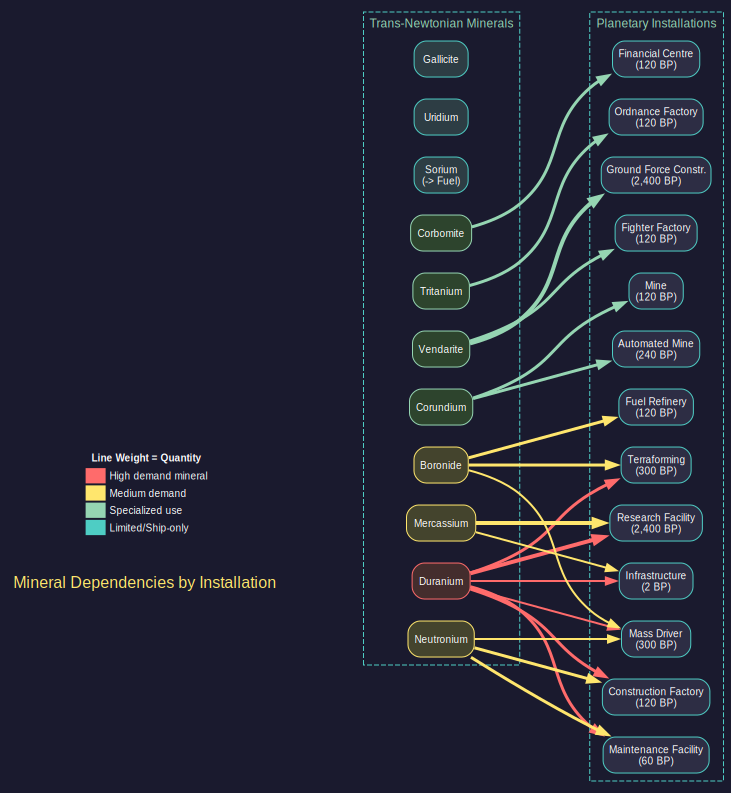
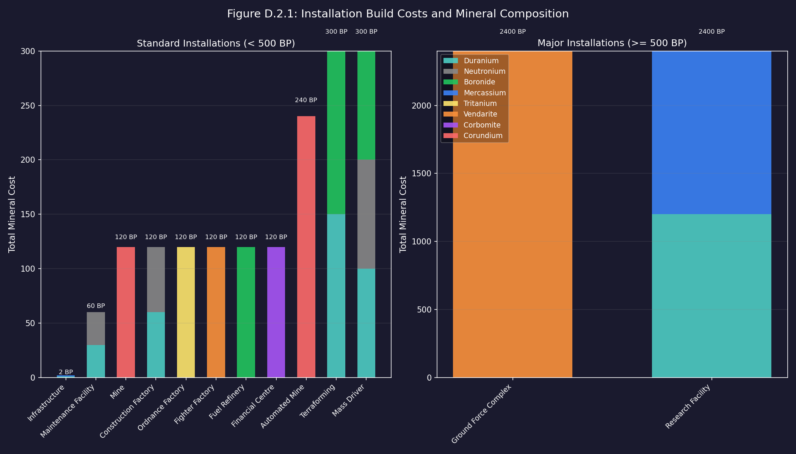
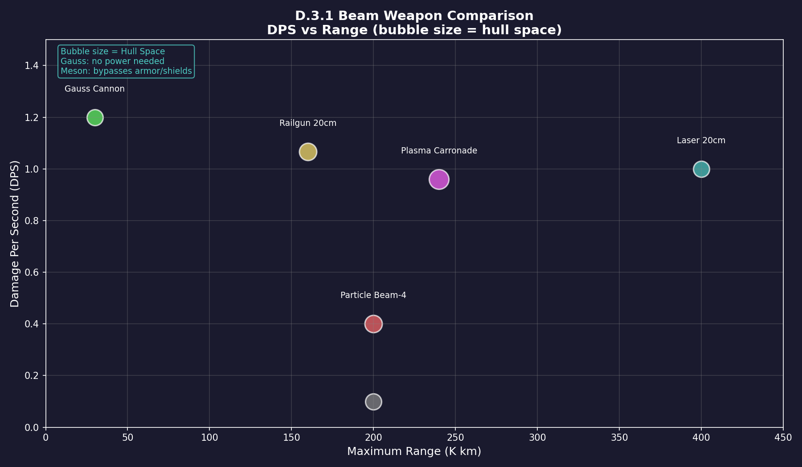

# Appendix D: Reference Tables

*Updated: v2026.01.30*

This appendix provides quick-reference data tables for minerals, installations, weapons, and technology progressions. Use these tables during ship design and colony planning to quickly look up costs, outputs, and key statistics.

## D.1 Trans-Newtonian Minerals

*Updated: v2026.01.30*

The eleven Trans-Newtonian minerals are the foundation of all advanced construction in Aurora (see [Section 6.1 Minerals](../6-economy-and-industry/6.1-minerals.md) for mining and exploitation). Each mineral has primary applications that determine where demand will be highest.

| Mineral | Primary Uses |
|---------|-------------|
| Duranium | Hull structure, basic construction, nearly everything |
| Neutronium | Shipyards, advanced armor, railguns |
| Corbomite | Shields, stealth systems, electronic warfare |
| Tritanium | Missile technologies, ordnance factories |
| Boronide | Power systems, capacitors, terraforming |
| Mercassium | Research labs, infrastructure, crew quarters |
| Vendarite | Gauss cannons, CIWS, ground forces |
| Sorium | Fuel (after refining), fuel harvesters |
| Uridium | Sensors, fire control systems |
| Corundium | Energy weapons, mining installations |
| Gallicite | Engines (primary mineral for all engine types) |

\hyperlink{ref-D-2}{[D-2]}

**Planning Notes:**

- Duranium is consumed by virtually every project; prioritize accessible deposits early.
- Gallicite becomes a bottleneck once you begin building fleets; secure multiple sources.
- Sorium must be refined into fuel before use; raw Sorium has no direct application.
- Corundium demand scales with the number of energy weapon platforms in your navy.
- Mercassium is consumed in bulk by research labs (1,200 per lab) \hyperlink{ref-D-3}{[D-3]}; plan ahead for research expansion.

## D.2 Installation Specifications

*Updated: v2026.01.30*

For installation placement and colony management, see [Section 5.1 Establishing Colonies](../5-colonies/5.1-establishing-colonies.md).

### D.2.1 Key Installation Build Costs

\hyperlink{ref-D-4}{[D-4]}



| Installation | BP Cost | Mineral Cost | Workers Required |
|-------------|---------|--------------|-----------------|
| Infrastructure | 2 | 1 Duranium + 1 Mercassium | 0 |
| Maintenance Facility | 60 | 30 Duranium + 30 Neutronium | 50,000 |
| Mine | 120 | 120 Corundium | 50,000 |
| Construction Factory | 120 | 60 Duranium + 60 Neutronium | 50,000 |
| Ordnance Factory | 120 | 120 Tritanium | 50,000 |
| Fighter Factory | 120 | 120 Vendarite | 50,000 |
| Fuel Refinery | 120 | 120 Boronide | 50,000 |
| Financial Centre | 120 | 120 Corbomite | 50,000 |
| Automated Mine | 240 | 240 Corundium | 0 |
| Terraforming Installation | 300 | 150 Duranium + 150 Boronide | 125,000 |
| Mass Driver | 300 | 100 Duranium + 100 Neutronium + 100 Boronide | 0 |
| Ground Force Construction Complex | 2,400 | 2,400 Vendarite | 1,000,000 |
| Research Facility | 2,400 | 1,200 Duranium + 1,200 Mercassium | 1,000,000 |



**Understanding Mineral Composition:** The mineral requirements for each installation reflect its functional complexity and purpose. Simple extraction installations like Mines require only Corundium (a hard, durable mineral suited to drilling equipment), while Research Facilities demand both Duranium (structural framework) and Mercassium (precision electronics and sensor components). Military-adjacent installations such as Construction Factories need Neutronium for its advanced structural properties alongside Duranium. Terraforming Installations combine Duranium (structural) with Boronide (atmospheric processing and energy systems). In general, installations requiring multiple minerals represent more sophisticated technology that draws on different material properties -- structural integrity, energy conductance, precision manufacturing, or chemical reactivity -- to fulfill their role.

### D.2.2 Installation Output Summary

\hyperlink{ref-D-5}{[D-5]}

| Installation | Base Output per Unit |
|-------------|---------------------|
| Mine | 10 tons/year per accessibility point |
| Automated Mine | 10 tons/year per accessibility point (no workers needed) |
| Construction Factory | 10 BP/year |
| Ordnance Factory | 10 BP/year (missiles only) |
| Fuel Refinery | 40,000 litres/year |
| Research Lab | 200 RP/year (base racial rate, modified by scientist bonus and Research Rate tech) |

### D.2.3 Terraforming Installation Notes

\hyperlink{ref-D-6}{[D-6]}

- Mass: 50,000 tons per installation (2x standard installation size)
- Worker requirement: 125,000 per installation
- Base terraform rate: 0.00025 atm/year per installation (starting racial tech)
- Rate modified by planet size: The effective terraforming rate scales inversely with planet surface area relative to Earth. The formula is:
  ```
  Effective Rate = Base Rate * (Earth Radius / Planet Radius)^2
  ```
  Since surface area is proportional to radius squared, this simplifies to: `Effective Rate = Base Rate * (Earth Surface Area / Planet Surface Area)`. Smaller planets terraform faster because there is less atmosphere to modify; larger planets take proportionally longer. For example, a planet with twice Earth's radius would terraform at one-quarter the base rate.
- Tech progression: 0.00032, 0.0004, 0.00048, 0.0006, 0.00075, 0.00096, 0.0012, 0.0015, 0.0019, 0.0024, 0.003, 0.00375

## D.3 Beam Weapon Quick Reference

*Updated: v2026.01.30*

**When to use this table:** Consult this section when designing combat vessels and deciding which weapon systems to mount. The comparison table helps you evaluate trade-offs between damage output, range, power requirements, and hull space -- critical decisions that define your fleet doctrine.

**Gameplay significance:** Beam weapons are your primary tools for sustained combat at various ranges. Your choice of weapon type determines whether you fight at long range (lasers, particle beams) or close range (plasma carronades), whether you can bypass enemy defenses (meson cannons), and how much power infrastructure each ship needs. The damage-per-second, range, and power cost of each weapon directly influence ship design tonnage and combat effectiveness.

For combat usage and tactical considerations, see [Section 12.2 Beam Weapons](../12-combat/12.2-beam-weapons.md).

### D.3.1 Beam Weapon Comparison Table

| Weapon | Example Config | Damage | ROF | Range | Size (HS) | Power | Cost (BP) | Key Mineral |
|--------|---------------|--------|-----|-------|-----------|-------|-----------|-------------|
| Laser | 20cm C5 UV | 10 | 10s | 400K km | 6 | 10 | 63 | Corundium |
| Railgun | 20cm V4/C4 | 4x4 | 15s | 160K km | 7 | 12 | 55 | Neutronium |
| Particle Beam | PB-4 | 4 | 10s | 200K km | 7 | 10 | 70 | Corundium |
| Meson Cannon | R20/C5 | 1* | 10s | 200K km | 6 | 10 | 20 | Corundium |
| Gauss Cannon | R3-100 | 1 | 3/5s | 30K km | 6 | 0 | 36 | Vendarite |
| Plasma Carronade | 30cm C5 | 24 | 25s | 240K km | 9 | 24 | 48 | Corundium |
| HPM | R20/C5 | 1 (3+) | 10s | 200K km | 6 | 10 | 126 | Corundium |
| CIWS | CIWS-160 | 1 | 6/5s | 10K km | 7.4 | 0 | 34 | Vendarite |



### D.3.2 Weapon Notes

- **Meson Cannon** (*): Bypasses both shields and armor entirely; damage is applied directly to internal components. Low damage per hit but extremely difficult to defend against.
- **Railgun** (4x4): Fires 4 shots per volley, each dealing 4 damage. Each shot ignores armor layers equal to its damage value.
- **HPM** (+): Deals 3 damage against shields but only 1 damage against armor/internals. Effective for shield-stripping roles.
- **Gauss Cannon**: Requires no power plant capacity. Rate of fire listed as shots-per-increment/increment-length (e.g., 3 shots per 5-second increment).
- **CIWS**: Self-contained point defense system with integrated sensor. Does not require a separate fire control or power plant.
- **Plasma Carronade**: Highest single-hit damage of any beam weapon but limited by short effective range.
- **Laser**: The most flexible beam weapon; scales well with focal size and capacitor technology.
- **Particle Beam**: No damage falloff at any range within maximum; good against heavily armored targets.

### D.3.3 Beam Weapon Scaling

All beam weapons scale with two key technologies:

1. **Calibre (Size)**: Larger weapons deal more damage but consume more hull space and power.
2. **Capacitor Recharge Rate**: Faster recharge reduces time between shots, increasing sustained DPS.

Focal size (for lasers) and velocity (for railguns) affect maximum range. Higher values extend range at the cost of increased component size.

## D.4 Technology Progression Tables

*Updated: v2026.01.30*

**When to use these tables:** Reference these progressions when prioritizing research projects. Each table shows the full technology chain, research point costs, and capability improvements at each tier -- essential for planning your research queue and understanding how far you are from key capability thresholds.

**Gameplay significance:** Research prioritization is one of Aurora's most consequential strategic decisions. These tables reveal which technologies offer the largest capability jumps per RP spent, where diminishing returns set in, and what synergies exist between related tech lines (e.g., engine type + fuel efficiency + power modifier). Use them to identify high-value targets for your research focus.

### D.4.1 Engine Technology Progression

**When to use:** Consult this table when planning propulsion research or designing ships that need specific speed capabilities.

**Gameplay impact:** Engine technology directly determines fleet speed, which affects everything from tactical positioning in combat to transit times between systems. Higher engine tech unlocks faster ships, but the research costs escalate significantly -- knowing the power-per-HS at each tier helps you decide whether the next engine generation is worth the investment versus improving other aspects like fuel efficiency.

Engine power determines ship speed. The engine type sets base power per HS, while the power modifier controls the maximum multiplier available in the engine design window. See [Section 8.1 Design Philosophy](../8-ship-design/8.1-design-philosophy.md) for practical applications.

#### D.4.1.1 Engine Types (Base Power per HS)

\hyperlink{ref-D-7}{[D-7]}

| Tech Level | Engine Type | Power/HS | Research Cost (RP) |
|-----------|------------|----------|-------------------|
| Conventional | Conventional Engine | 1.0 | 500 |
| 1 | Nuclear Radioisotope Engine | 5.0 | 1,000 |
| 2 | Nuclear Thermal Engine | 6.4 | 2,000 |
| 3 | Nuclear Pulse Engine | 8.0 | 4,000 |
| 4 | Nuclear Gas-Core Engine | 10.0 | 6,000 |
| 5 | Ion Drive | 12.5 | 10,000 |
| 6 | Magneto-plasma Drive | 16.0 | 20,000 |
| 7 | Magnetic Confinement Fusion Drive | 20.0 | 40,000 |
| 8 | Inertial Confinement Fusion Drive | 25.0 | 80,000 |
| 9 | Solid Core Anti-matter Drive | 32.0 | 150,000 |
| 10 | Gas Core Anti-matter Drive | 40.0 | 300,000 |
| 11 | Plasma Core Anti-matter Drive | 50.0 | 600,000 |
| 12 | Beam Core Anti-matter Drive | 64.0 | 1,250,000 |
| 13 | Photonic Drive | 80.0 | 2,500,000 |
| 14 | Quantum Singularity Drive | 100.0 | 5,000,000 |

#### D.4.1.2 Maximum Engine Power Modifier

\hyperlink{ref-D-8}{[D-8]}

This technology unlocks higher power multipliers in the engine designer. Higher multipliers increase power output but also fuel consumption (roughly proportional to the square of the multiplier).

| Tech Level | Max Modifier | Research Cost (RP) |
|-----------|-------------|-------------------|
| Base | x1 | 1 |
| 1 | x1.25 | 500 |
| 2 | x1.5 | 1,000 |
| 3 | x1.75 | 2,000 |
| 4 | x2 | 4,000 |
| 5 | x2.5 | 8,000 |
| 6 | x3 | 15,000 |

#### D.4.1.3 Minimum Engine Power Modifier

\hyperlink{ref-D-9}{[D-9]}

This technology unlocks lower power multipliers, allowing more fuel-efficient engines at the cost of reduced power output.

| Tech Level | Min Modifier | Research Cost (RP) |
|-----------|-------------|-------------------|
| Base | x0.5 | 2 |
| 1 | x0.4 | 1,000 |
| 2 | x0.3 | 2,000 |
| 3 | x0.25 | 4,000 |
| 4 | x0.2 | 8,000 |
| 5 | x0.15 | 15,000 |
| 6 | x0.1 | 30,000 |

### D.4.2 Fuel Consumption Technology

**When to use:** Reference this table when your ships are running out of fuel before completing missions or when tanker logistics are becoming a bottleneck.

**Gameplay impact:** Fuel efficiency is often the difference between reaching distant targets and being stranded mid-voyage. This technology line offers compounding returns: halving consumption doubles range without increasing fuel tank size. For exploration fleets and distant operations, fuel efficiency research often provides more practical benefit than raw engine speed.

Lower fuel consumption rates drastically extend operational range. This is one of the highest-impact research areas for fleet logistics.

\hyperlink{ref-D-10}{[D-10]}

| Tech Level | Consumption (L/EPH) | Research Cost (RP) | Notes |
|-----------|---------------------|-------------------|-------|
| Base | 1.0 | 1 | Starting technology |
| 1 | 0.9 | 1,000 | |
| 2 | 0.8 | 2,000 | |
| 3 | 0.7 | 4,000 | |
| 4 | 0.6 | 8,000 | |
| 5 | 0.5 | 15,000 | Half starting consumption |
| 6 | 0.4 | 30,000 | |
| 7 | 0.3 | 60,000 | |
| 8 | 0.25 | 120,000 | |
| 9 | 0.2 | 250,000 | One-fifth starting |
| 10 | 0.16 | 500,000 | |
| 11 | 0.125 | 1,000,000 | |
| 12 | 0.1 | 2,000,000 | One-tenth starting |

### D.4.3 Armour Technology

**When to use:** Consult this table when designing warships to determine how much protection you can achieve within a given tonnage budget.

**Gameplay impact:** Armour tech determines survivability in beam combat. Higher-strength armour means your ships can mount the same protection in less hull space -- freeing tonnage for weapons, engines, or additional armour layers. The column depth value also gates how many armour layers you can add, directly affecting how long your ships survive under fire.

Higher armour technology provides more protection per layer of armour, reducing the total hull space needed for equivalent protection. The strength value represents armour hit points per hull space of armour.

\hyperlink{ref-D-11}{[D-11]}

| Tech Level | Armour Type | Strength/HS | Column Depth | Research Cost (RP) |
|-----------|------------|------------|-------------|-------------------|
| Conventional 1 | Conventional Steel Armour | 1 | -- | 125 |
| Conventional 2 | Conventional Composite Armour | 2 | -- | 250 |
| Conventional 3 | Conventional Advanced Composite | 3 | -- | 375 |
| 1 | Duranium Armour | 4 | 1 | 500 |
| 2 | High Density Duranium Armour | 6 | 2 | 2,500 |
| 3 | Composite Armour | 8 | 3 | 5,000 |
| 4 | Ceramic Composite Armour | 10 | 4 | 10,000 |
| 5 | Laminate Composite Armour | 12 | 5 | 20,000 |
| 6 | Compressed Carbon Armour | 15 | 6 | 40,000 |
| 7 | Biphase Carbide Armour | 18 | 7 | 80,000 |
| 8 | Crystalline Composite Armour | 21 | 8 | 150,000 |
| 9 | Superdense Armour | 25 | 9 | 300,000 |
| 10 | Bonded Superdense Armour | 30 | 10 | 600,000 |
| 11 | Coherent Superdense Armour | 36 | 11 | 1,250,000 |
| 12 | Collapsium Armour | 45 | 12 | 2,500,000 |

**Note:** Column Depth (AdditionalInfo2) represents the maximum armour depth that technology allows. Higher-tech armour is also denser (more HP per layer), so fewer layers are needed.

### D.4.4 Shield Technology

**When to use:** Reference this table when designing ships that will face sustained combat or missile salvos where regenerating protection provides tactical advantage.

**Gameplay impact:** Shields regenerate during combat, making them valuable against enemies that deal steady rather than burst damage. However, active shields broadcast an EM signature, making shielded ships easier to detect. The trade-off between shield strength (damage absorbed) and regeneration rate (recovery speed) shapes whether shields serve as primary defense or a secondary buffer behind armour.

Shields provide regenerating protection that absorbs damage before it reaches armour. Shield strength is per HS of shield generator. Active shields produce an EM signature.

#### D.4.4.1 Shield Strength

\hyperlink{ref-D-12}{[D-12]}

| Tech Level | Shield Type | Strength/HS | Research Cost (RP) |
|-----------|------------|------------|-------------------|
| 1 | Alpha Shields | 1.0 | 1,000 |
| 2 | Beta Shields | 1.5 | 2,000 |
| 3 | Gamma Shields | 2.0 | 4,000 |
| 4 | Delta Shields | 2.5 | 8,000 |
| 5 | Epsilon Shields | 3.0 | 15,000 |
| 6 | Theta Shields | 4.0 | 30,000 |
| 7 | Xi Shields | 5.0 | 60,000 |
| 8 | Omicron Shields | 6.0 | 120,000 |
| 9 | Sigma Shields | 8.0 | 250,000 |
| 10 | Tau Shields | 10.0 | 500,000 |
| 11 | Psi Shields | 12.0 | 1,000,000 |
| 12 | Omega Shields | 15.0 | 2,000,000 |

#### D.4.4.2 Shield Regeneration Rate

\hyperlink{ref-D-13}{[D-13]}

The regeneration rate determines how much shield strength is restored per 5-second combat increment, as a percentage of total shield capacity.

| Tech Level | Regen Rate | Research Cost (RP) |
|-----------|-----------|-------------------|
| 1 | 1.0 | 1,000 |
| 2 | 1.5 | 2,000 |
| 3 | 2.0 | 4,000 |
| 4 | 2.5 | 8,000 |
| 5 | 3.0 | 15,000 |
| 6 | 4.0 | 30,000 |
| 7 | 5.0 | 60,000 |
| 8 | 6.0 | 125,000 |
| 9 | 8.0 | 250,000 |
| 10 | 10.0 | 500,000 |
| 11 | 12.0 | 1,000,000 |
| 12 | 15.0 | 2,000,000 |

### D.4.5 Sensor Technology

**When to use:** Consult these tables when designing scouts, survey ships, or combat vessels that need to detect enemies before being detected themselves.

**Gameplay impact:** Detection range determines who sees whom first -- a critical advantage in both tactical combat and strategic reconnaissance. Passive sensors (thermal and EM) let you observe without revealing your presence, while active sensors provide targeting data at the cost of broadcasting your location. The sensitivity/strength values directly set detection ranges via the formulas in [Section D.5](#d5-key-design-formulas-quick-reference).

Sensors are critical for detection and targeting. Passive sensors (thermal and EM) detect emissions without revealing the detecting ship. Active sensors provide precise tracking but broadcast the sensor ship's location.

#### D.4.5.1 Thermal Sensor Sensitivity

\hyperlink{ref-D-14}{[D-14]}

Thermal sensors detect engine heat signatures. Higher sensitivity detects smaller or more distant thermal sources.

| Tech Level | Sensitivity | Research Cost (RP) |
|-----------|------------|-------------------|
| 1 | 5 | 1,000 |
| 2 | 6 | 2,000 |
| 3 | 8 | 4,000 |
| 4 | 11 | 8,000 |
| 5 | 14 | 15,000 |
| 6 | 18 | 30,000 |
| 7 | 24 | 60,000 |
| 8 | 32 | 120,000 |
| 9 | 40 | 250,000 |
| 10 | 50 | 500,000 |
| 11 | 60 | 1,000,000 |
| 12 | 75 | 2,000,000 |

#### D.4.5.2 EM Sensor Sensitivity

\hyperlink{ref-D-15}{[D-15]}

EM sensors detect active emissions (shields, active sensors, etc.). The progression mirrors thermal sensors exactly.

| Tech Level | Sensitivity | Research Cost (RP) |
|-----------|------------|-------------------|
| 1 | 5 | 1,000 |
| 2 | 6 | 2,000 |
| 3 | 8 | 4,000 |
| 4 | 11 | 8,000 |
| 5 | 14 | 15,000 |
| 6 | 18 | 30,000 |
| 7 | 24 | 60,000 |
| 8 | 32 | 120,000 |
| 9 | 40 | 250,000 |
| 10 | 50 | 500,000 |
| 11 | 60 | 1,000,000 |
| 12 | 75 | 2,000,000 |

#### D.4.5.3 Active Gravitational Sensor Strength

\hyperlink{ref-D-16}{[D-16]}

Active sensors detect ships based on cross-section (size). Higher strength provides longer detection range but generates a detectable EM signature.

| Tech Level | Strength | Research Cost (RP) |
|-----------|---------|-------------------|
| Conventional | 2 | 500 |
| 1 | 10 | 1,000 |
| 2 | 12 | 2,000 |
| 3 | 16 | 4,000 |
| 4 | 21 | 8,000 |
| 5 | 28 | 15,000 |
| 6 | 36 | 30,000 |
| 7 | 48 | 60,000 |
| 8 | 60 | 125,000 |
| 9 | 80 | 250,000 |
| 10 | 100 | 500,000 |
| 11 | 135 | 1,000,000 |
| 12 | 180 | 2,000,000 |

### D.4.6 Missile Technology

**When to use:** Reference these tables when designing missile-armed ships, planning ordnance production, or evaluating whether to invest in missile versus beam weapon doctrines.

**Gameplay impact:** Missiles enable alpha-strike tactics -- delivering massive damage in a single salvo from beyond beam weapon range. Warhead strength determines damage per missile, while reload rate affects sustained fire capability. These technologies shape whether you build glass-cannon strikers (large salvos, few reloads) or sustained-fire platforms (smaller salvos, rapid reloading).

Missiles are the primary standoff weapon system. Their effectiveness depends on warhead strength, launcher size, and reload rate technologies.

#### D.4.6.1 Warhead Strength

\hyperlink{ref-D-17}{[D-17]}

Warhead strength determines damage per MSP of warhead devoted to the explosive payload. Larger warheads deal proportionally more damage.

| Tech Level | Warhead Type | Strength/MSP | Research Cost (RP) |
|-----------|-------------|-------------|-------------------|
| 1 | Gun-Type Fission | 2 | 1,000 |
| 2 | Implosion Fission | 3 | 2,000 |
| 3 | Levitated-Pit Implosion | 4 | 4,000 |
| 4 | Fusion-boosted Fission | 5 | 8,000 |
| 5 | Two-stage Thermonuclear | 6 | 15,000 |
| 6 | Three-stage Thermonuclear | 8 | 30,000 |
| 7 | Cobalt | 10 | 60,000 |
| 8 | Tri-Cobalt | 12 | 125,000 |
| 9 | Antimatter Catalysed Cobalt | 16 | 250,000 |
| 10 | Antimatter | 20 | 500,000 |
| 11 | Advanced Antimatter | 24 | 1,000,000 |
| 12 | Gravatonic | 30 | 2,000,000 |

#### D.4.6.2 Missile Launcher Reload Rate

\hyperlink{ref-D-18}{[D-18]}

Higher reload rates reduce the time between missile salvos. The rate value is a multiplier applied to the base reload time.

| Tech Level | Reload Rate | Research Cost (RP) |
|-----------|------------|-------------------|
| Base | 1 | 1 |
| 1 | 2 | 2,000 |
| 2 | 3 | 4,000 |
| 3 | 4 | 8,000 |
| 4 | 5 | 15,000 |
| 5 | 6 | 30,000 |
| 6 | 7 | 60,000 |
| 7 | 8 | 125,000 |
| 8 | 9 | 250,000 |
| 9 | 10 | 500,000 |
| 10 | 11 | 1,000,000 |
| 11 | 12 | 2,000,000 |

### D.4.7 Power Plant Technology

**When to use:** Consult this table when designing beam weapon ships or any vessel with significant power requirements (shields, active sensors, jump drives).

**Gameplay impact:** Power plant efficiency determines how much of your ship's tonnage goes to generating energy versus using it. Higher power-per-HS means more weapons or shields in the same hull. The boost option offers a trade-off: more power now, but increased explosion risk if the reactor is hit in combat. This choice is particularly consequential for front-line warships versus support vessels.

Power plants provide the energy needed by beam weapons, shields, and active sensors. The power output value represents energy per HS of power plant.

#### D.4.7.1 Power Plant Types (Power Output per HS)

\hyperlink{ref-D-19}{[D-19]}

| Tech Level | Power Plant Type | Power/HS | Research Cost (RP) |
|-----------|-----------------|---------|-------------------|
| Conventional | Conventional Reactor | 0.5 | 150 |
| 1 | Radioisotope Thermal Generator | 2.0 | 600 |
| 2 | Pressurised Water Reactor | 2.5 | 1,200 |
| 3 | Pebble Bed Reactor | 3.2 | 2,400 |
| 4 | Gaseous Fission Reactor | 4.0 | 3,600 |
| 5 | Magnetic Mirror Fusion Reactor | 5.0 | 6,000 |
| 6 | Stellarator Fusion Reactor | 6.4 | 12,000 |
| 7 | Tokamak Fusion Reactor | 8.0 | 24,000 |
| 8 | Inertial Confinement Fusion Reactor | 10.0 | 45,000 |
| 9 | Solid-core Anti-matter Power Plant | 12.8 | 90,000 |
| 10 | Gas-core Anti-matter Power Plant | 16.0 | 180,000 |
| 11 | Plasma-core Anti-matter Power Plant | 20.0 | 375,000 |
| 12 | Beam Core Anti-matter Power Plant | 24.0 | 750,000 |
| 13 | Vacuum Energy Power Plant | 32.0 | 1,500,000 |
| 14 | Quantum Singularity Power Plant | 40.0 | 3,000,000 |

#### D.4.7.2 Power Plant Boost

\hyperlink{ref-D-20}{[D-20]}

Boosting a power plant increases output but adds an explosion risk when the component is hit in combat.

| Tech Level | Boost | Explosion Risk | Research Cost (RP) |
|-----------|-------|---------------|-------------------|
| Base | None (x1.0) | 5% | 250 |
| 1 | +10% (x1.1) | 7% | 500 |
| 2 | +20% (x1.2) | 10% | 1,000 |
| 3 | +30% (x1.3) | 15% | 2,000 |
| 4 | +40% (x1.4) | 20% | 4,000 |
| 5 | +60% (x1.6) | 30% | 8,000 |
| 6 | +80% (x1.8) | 40% | 15,000 |
| 7 | +100% (x2.0) | 50% | 30,000 |

### D.4.8 Beam Weapon Calibre Technologies

**When to use:** Reference these tables when deciding which weapon sizes to research and which calibres to mount on your ships.

**Gameplay impact:** Larger calibres deal more damage but consume more hull space and power. The damage-to-size ratio varies by weapon type, so these tables help identify sweet spots where you get good damage per HS invested. For lasers, focal size also affects range; for railguns, calibre determines shots per volley. Matching calibre research to your hull sizes ensures you can mount appropriately-scaled weapons.

Weapon focal size determines damage, range, and hull space requirements. Larger weapons deal more damage but consume more space and power.

#### D.4.8.1 Laser Focal Size

\hyperlink{ref-D-21}{[D-21]}

| Focal Size | Damage | Research Cost (RP) |
|-----------|--------|-------------------|
| 10cm | 3 | 1,000 |
| 12cm | 4 | 2,000 |
| 15cm | 6 | 4,000 |
| 20cm | 10 | 8,000 |
| 25cm | 16 | 15,000 |
| 30cm | 24 | 30,000 |
| 35cm | 32 | 60,000 |
| 40cm | 40 | 125,000 |
| 50cm | 64 | 250,000 |
| 60cm | 96 | 500,000 |
| 70cm | 128 | 1,000,000 |
| 80cm | 168 | 2,000,000 |

**Note:** The AdditionalInfo value for lasers represents the base damage before capacitor/wavelength modifiers are applied. Actual damage in the weapon designer will vary based on selected wavelength and capacitor technology.

#### D.4.8.2 Meson Focal Size

\hyperlink{ref-D-22}{[D-22]}

Meson cannons bypass both shields and armour, dealing damage directly to internal components. The accuracy reduction (AR) percentage limits their hit chance.

| Focal Size | Power Req | Accuracy Reduction | Research Cost (RP) |
|-----------|----------|-------------------|-------------------|
| 10cm | 3 | 40% | 1,000 |
| 12cm | 4 | 32% | 2,000 |
| 15cm | 6 | 25% | 4,000 |
| 20cm | 10 | 20% | 8,000 |
| 25cm | 16 | 16% | 15,000 |
| 30cm | 24 | 12.5% | 30,000 |
| 35cm | 32 | 10% | 60,000 |
| 40cm | 40 | 8% | 125,000 |
| 50cm | 64 | 6.4% | 250,000 |
| 60cm | 96 | 5% | 500,000 |
| 70cm | 128 | 4% | 1,000,000 |
| 80cm | 168 | 3.2% | 2,000,000 |

#### D.4.8.3 Microwave Focal Size

\hyperlink{ref-D-23}{[D-23]}

Microwave weapons (HPMs) deal bonus damage against shields (3x) but only 1 damage against armour/internals. They also have a chance to destroy electronics.

| Focal Size | Power Req | Research Cost (RP) |
|-----------|----------|-------------------|
| 10cm | 3 | 1,000 |
| 12cm | 4 | 2,000 |
| 15cm | 6 | 4,000 |
| 20cm | 10 | 8,000 |
| 25cm | 16 | 15,000 |
| 30cm | 24 | 30,000 |
| 35cm | 32 | 60,000 |
| 40cm | 40 | 125,000 |
| 50cm | 64 | 250,000 |
| 60cm | 96 | 500,000 |
| 70cm | 128 | 1,000,000 |
| 80cm | 168 | 2,000,000 |

#### D.4.8.4 Railgun Calibre

\hyperlink{ref-D-24}{[D-24]}

Railguns fire multiple shots per volley, each ignoring armour layers equal to its damage value.

| Calibre | Shots/Volley | Research Cost (RP) |
|---------|-------------|-------------------|
| 10cm | 1 | 1,000 |
| 12cm | 2 | 2,500 |
| 15cm | 3 | 5,000 |
| 20cm | 4 | 7,500 |
| 25cm | 5 | 10,000 |
| 30cm | 7 | 20,000 |
| 35cm | 9 | 40,000 |
| 40cm | 12 | 60,000 |
| 45cm | 16 | 120,000 |
| 50cm | 20 | 240,000 |

#### D.4.8.5 Railgun Launch Velocity

\hyperlink{ref-D-25}{[D-25]}

Higher velocity extends railgun range.

| Velocity (km/s) | Research Cost (RP) |
|-----------------|-------------------|
| 10,000 | 1,000 |
| 20,000 | 2,500 |
| 30,000 | 5,000 |
| 40,000 | 7,500 |
| 50,000 | 10,000 |
| 60,000 | 20,000 |
| 70,000 | 40,000 |
| 80,000 | 120,000 |
| 90,000 | 240,000 |

#### D.4.8.6 Gauss Cannon Rate of Fire

\hyperlink{ref-D-26}{[D-26]}

Gauss cannons are the primary point defense weapon. Higher rate of fire increases shots per increment.

| Tech Level | Shots/Increment | Research Cost (RP) |
|-----------|----------------|-------------------|
| Base | 1 | -- |
| 1 | 2 | 1,500 |
| 2 | 3 | 5,000 |
| 3 | 4 | 15,000 |
| 4 | 5 | 45,000 |
| 5 | 6 | 135,000 |
| 6 | 8 | 750,000 |

#### D.4.8.7 Gauss Cannon Launch Velocity

\hyperlink{ref-D-27}{[D-27]}

Higher velocity extends gauss cannon range for point defense intercepts.

| Velocity (km/s) | Research Cost (RP) |
|-----------------|-------------------|
| 10,000 | 500 |
| 20,000 | 1,500 |
| 30,000 | 5,000 |
| 40,000 | 15,000 |
| 50,000 | 45,000 |
| 60,000 | 135,000 |

### D.4.9 Capacitor Recharge Rate

**When to use:** Consult this table when prioritizing beam weapon research -- capacitor technology is often more cost-effective than larger calibres for increasing damage output.

**Gameplay impact:** Capacitor recharge rate is a force multiplier for your entire beam weapon arsenal. Unlike calibre upgrades that benefit only one weapon type, capacitor improvements boost the fire rate of all beam weapons. A rate of 4 means your lasers fire four times as fast as baseline, effectively quadrupling sustained damage. This technology often offers the best RP-to-combat-power conversion in the game.

Capacitor technology reduces the time between beam weapon shots. Higher values allow faster sustained fire. This is one of the most impactful beam weapon technologies.

\hyperlink{ref-D-28}{[D-28]}

| Rate | Research Cost (RP) | Rate | Research Cost (RP) |
|------|-------------------|------|-------------------|
| 1 | 1,000 | 7 | 45,000 |
| 1.25 | 1,250 | 8 | 60,000 |
| 1.5 | 1,500 | 9 | 92,500 |
| 1.75 | 1,750 | 10 | 125,000 |
| 2 | 2,000 | 11 | 187,500 |
| 2.25 | 2,250 | 12 | 250,000 |
| 2.5 | 2,500 | 13 | 312,500 |
| 2.75 | 2,750 | 14 | 375,000 |
| 3 | 4,000 | 15 | 437,500 |
| 3.25 | 5,000 | 16 | 500,000 |
| 3.5 | 6,000 | 20 | 1,000,000 |
| 3.75 | 7,000 | 25 | 2,000,000 |
| 4 | 8,000 | | |
| 4.5 | 11,750 | | |
| 5 | 15,000 | | |
| 5.5 | 22,500 | | |
| 6 | 30,000 | | |

### D.4.10 Maintenance Capacity per Facility

**When to use:** Reference this table when your fleet tonnage is growing and you need to plan maintenance infrastructure expansion.

**Gameplay impact:** Each maintenance facility can support a limited tonnage of ships. When your fleet exceeds available maintenance capacity, ships begin to suffer reliability degradation. Higher tech levels mean each facility supports more tonnage, reducing the number of facilities (and their associated population and mineral costs) needed to keep your fleet operational.

\hyperlink{ref-D-29}{[D-29]}

| Tech Level | Capacity (tons/facility) | Research Cost (RP) |
|-----------|-------------------------|-------------------|
| 1 | 1,000 | 1,000 |
| 2 | 1,250 | 2,000 |
| 3 | 1,600 | 4,000 |
| 4 | 2,000 | 8,000 |
| 5 | 2,500 | 16,000 |
| 6 | 3,200 | 30,000 |
| 7 | 4,000 | 60,000 |
| 8 | 5,000 | 120,000 |
| 9 | 6,250 | 250,000 |

### D.4.11 MSP Production per Facility

**When to use:** Consult this table when your ships are spending excessive time in overhaul or when MSP shortages are limiting fleet operations.

**Gameplay impact:** Maintenance Supply Points (MSP) are consumed during overhauls and repairs. If production cannot keep pace with consumption, your ships accumulate maintenance failures. Higher production tech reduces the number of maintenance facilities needed to sustain a given fleet, freeing industrial capacity for other priorities.

\hyperlink{ref-D-30}{[D-30]}

| Tech Level | MSP/Year | Research Cost (RP) |
|-----------|----------|-------------------|
| 1 (Starting) | 20 | 3,000 |
| 2 | 24 | 5,000 |
| 3 | 30 | 10,000 |
| 4 | 36 | 20,000 |
| 5 | 42 | 40,000 |
| 6 | 50 | 80,000 |
| 7 | 60 | 150,000 |
| 8 | 72 | 300,000 |
| 9 | 85 | 600,000 |
| 10 | 100 | 1,200,000 |

### D.4.12 Construction Rate (BP per Factory per Year)

**When to use:** Reference this table when planning industrial expansion or when ship production is bottlenecking your fleet growth.

**Gameplay impact:** Construction rate determines how quickly your factories convert minerals into ships, installations, and components. Each tech level increases output per factory, compounding your industrial capacity without requiring more factories or workers. This is a high-leverage research investment for empires focused on rapid expansion or fleet buildup.

\hyperlink{ref-D-31}{[D-31]}

| Tech Level | BP/Factory/Year | Research Cost (RP) |
|-----------|----------------|-------------------|
| Base | 10 | -- |
| 1 | 12 | 3,000 |
| 2 | 14 | 5,000 |
| 3 | 16 | 10,000 |
| 4 | 20 | 20,000 |
| 5 | 25 | 40,000 |
| 6 | 30 | 80,000 |
| 7 | 36 | 150,000 |
| 8 | 42 | 300,000 |
| 9 | 50 | 600,000 |
| 10 | 60 | 1,250,000 |
| 11 | 70 | 2,500,000 |

### D.4.13 Mining Production (Tons per Mine per Year)

**When to use:** Consult this table when mineral stockpiles are limiting your construction or when you're deciding whether to build more mines versus researching better mining technology.

**Gameplay impact:** Mining production directly controls your mineral income. Higher tech means each mine extracts more from the same deposit, extending the life of your mineral reserves and reducing the number of mines (and mining infrastructure) needed to sustain your economy. This compounds especially well with high-accessibility deposits.

\hyperlink{ref-D-32}{[D-32]}

| Tech Level | Tons/Mine/Year | Research Cost (RP) |
|-----------|---------------|-------------------|
| Base | 10 | -- |
| 1 | 12 | 3,000 |
| 2 | 14 | 5,000 |
| 3 | 16 | 10,000 |
| 4 | 20 | 20,000 |
| 5 | 25 | 40,000 |
| 6 | 30 | 80,000 |
| 7 | 36 | 150,000 |
| 8 | 42 | 300,000 |
| 9 | 50 | 600,000 |
| 10 | 60 | 1,250,000 |
| 11 | 70 | 2,500,000 |

Output is further multiplied by the deposit's accessibility value.

### D.4.14 Fuel Refinery Output

**When to use:** Reference this table when fuel production is not keeping pace with fleet consumption or when you're planning fuel logistics for distant operations.

**Gameplay impact:** Fuel is the lifeblood of space operations -- without it, ships cannot move. Higher refinery output means fewer refineries needed to sustain your fleet, reducing the worker and Boronide investment in fuel infrastructure. For empires with active exploration or military campaigns, fuel production tech often pays for itself quickly.

\hyperlink{ref-D-33}{[D-33]}

| Tech Level | Output (litres/year/refinery) | Research Cost (RP) |
|-----------|------------------------------|-------------------|
| Base | 40,000 | -- |
| 1 | 48,000 | 3,000 |
| 2 | 56,000 | 5,000 |
| 3 | 64,000 | 10,000 |
| 4 | 80,000 | 20,000 |
| 5 | 100,000 | 40,000 |
| 6 | 120,000 | 80,000 |
| 7 | 144,000 | 150,000 |
| 8 | 168,000 | 300,000 |
| 9 | 200,000 | 600,000 |
| 10 | 240,000 | 1,250,000 |
| 11 | 280,000 | 2,500,000 |

## D.5 Key Design Formulas Quick Reference

*Updated: v2026.01.30*

**When to use this section:** Keep this open during ship design. These formulas let you calculate detection ranges, magazine requirements, engine performance, and unit conversions without leaving the design screen or hunting through multiple appendices.

**Gameplay significance:** Understanding these formulas transforms ship design from trial-and-error into informed engineering. You can predict whether a sensor will detect a target at a given range, calculate how many missiles your magazines will hold, and optimize engine-to-fuel ratios before committing to a design. This is essential knowledge for min-maxing ship performance within tonnage constraints.

This section condenses the most frequently-referenced formulas from [Appendix A: Formulas](../appendices/A-formulas.md) into a single lookup table for use during ship design (see [Section 8.1 Design Philosophy](../8-ship-design/8.1-design-philosophy.md)).

### D.5.1 Sensor Detection Ranges

| Sensor Type | Formula | Key Variable |
|------------|---------|--------------|
| Thermal (Passive) | sqrt(Sensitivity x Target\_Thermal) x 250,000 km | Target engine power |
| EM (Passive) | sqrt(Sensitivity x Target\_EM) x 250,000 km | Target active emissions |
| Active | sqrt(Strength x Cross\_Section) x 250,000 km | Target size vs resolution |

\hyperlink{ref-D-1}{[D-1]}

**Active sensor effective range against off-resolution targets:**
```
Effective_Range = Base_Range x sqrt(Target_HS / Sensor_Resolution)
```

### D.5.2 Magazine Capacity

```
Magazine_Size (MSP) = Component_HS x 20 MSP per HS
Missiles_Stored = Magazine_MSP / Missile_MSP_Size
```

\hyperlink{ref-D-34}{[D-34]}

Each missile's MSP size is determined in the Missile Design window. Magazines are vulnerable to explosion if hit while loaded; consider:

- Spreading magazines across multiple components
- Using armored magazines (reduced capacity, +1 HTK)
- Accepting the risk on smaller ships where space is at a premium

### D.5.3 Shield Types

| Shield Type | Strength/Emitter | Fuel Consumption | EM Signature |
|------------|-----------------|-----------------|-------------|
| Standard | 1x tech level | High | High |
| Thermal Reduction | 1x tech level | High | Reduced |
| Absorption | 1x tech level | None while inactive | High when active |

**Shield regeneration:**
```
Regen_per_5s = Total_Shield_Strength x Regen_Rate_Tech
```

Shields must be active to regenerate. Active shields generate EM signature detectable by passive sensors.

### D.5.4 Engine Calculations

| Parameter | Formula |
|-----------|---------|
| Speed | Total_EP * 1000 / Ship_Size_HS (or Total_EP * 50000 / Mass_tons) |
| Engine Power | Size (HS) x Power_per_HS x Boost_Modifier |
| Fuel/Hour | Total_EP x Consumption_Rate x Boost_Penalty |
| Range | Fuel_Capacity / Fuel_per_Hour x 3,600 x Speed |
| Boost Penalty | Approximately Boost^2 (1.5x = 2.25, 2x = 4, 3x = 9) |

**Practical design tip:** A 1.25x boost provides 25% more power with a moderate fuel consumption increase -- often the best efficiency trade-off for military vessels. The exact fuel penalty depends on the boost formula: (4\^Boost\_Modifier)/4, where the x1.25 penalty factor is approximately 1.41x the x1.0 baseline.

### D.5.5 Quick Conversion Reference

| Unit | Equivalence |
|------|------------|
| 1 HS | 50 tons |
| 1 MSP (missile) | 0.25 HS = 12.5 tons |
| 1 BP | 1 unit of production capacity |
| Speed 1 km/s | 1 EP per 1000 HS (or 0.02 EP per ton) |
| Magazine 1 HS | 20 MSP storage capacity |

\hyperlink{ref-D-35}{[D-35]}

## Related Sections

- [Section 6.1 Minerals](../6-economy-and-industry/6.1-minerals.md) -- Mineral extraction, production chains, and installation management
- [Section 7.1 Technology Tree](../7-research/7.1-technology-tree.md) -- Technology progression and research costs
- [Section 8.1 Design Philosophy](../8-ship-design/8.1-design-philosophy.md) -- Using these tables for ship component selection and optimization
- [Section 12.1 Fire Controls](../12-combat/12.1-fire-controls.md) -- Weapon damage, armor penetration, and shield mechanics in practice
- [Appendix A: Formulas](../appendices/A-formulas.md) -- Full mathematical derivations behind these reference values

---

## References

\hypertarget{ref-D-1}{[D-1]} Aurora Wiki, "Thermal Sensor" -- C# passive sensor formula: range = sqrt(Sensitivity x Signature) x 250,000 km. Corrected from erroneous 10,000 km multiplier (which was the VB6 formula). [aurorawiki2.pentarch.org](https://aurorawiki2.pentarch.org/index.php?title=Thermal_Sensor)

\hypertarget{ref-D-2}{[D-2]} Aurora C# game database (AuroraDB.db v2.7.1) -- DIM\_PlanetaryInstallation mineral columns (Duranium through Gallicite) cross-referenced with FCT\_ShipDesignComponents mineral requirements for ship components.

\hypertarget{ref-D-3}{[D-3]} Aurora C# game database (AuroraDB.db v2.7.1) -- DIM\_PlanetaryInstallation: Research Facility requires Mercassium=1200.0 and Duranium=1200.0.

\hypertarget{ref-D-4}{[D-4]} Aurora C# game database (AuroraDB.db v2.7.1) -- DIM\_PlanetaryInstallation table: Cost, mineral columns (Duranium through Gallicite), and Workers columns for all 13 installation types verified.

\hypertarget{ref-D-5}{[D-5]} Aurora C# game database (AuroraDB.db v2.7.1) -- DIM\_PlanetaryInstallation: ConstructionValue, MiningProductionValue, RefineryProductionValue columns confirm base output values. ResearchValue=1.0 is a multiplier on the racial research rate (FCT\_Race.Research=200), yielding 200 RP/year per lab at base. First researchable upgrade: Research Rate 240 RP (TechTypeID=29, 5,000 RP cost).

\hypertarget{ref-D-6}{[D-6]} Aurora C# game database (AuroraDB.db v2.7.1) -- DIM\_PlanetaryInstallation: Terraforming Installation CargoPoints=50000 (mass in tons), Workers=0.125 (125,000), TerraformValue=1.0.

\hypertarget{ref-D-7}{[D-7]} Aurora C# game database (AuroraDB.db v2.7.1) -- FCT\_TechSystem TechTypeID=40 (Engine Technology): 15 engine types from Conventional (1.0/HS, 500 RP) through Quantum Singularity (100.0/HS, 5,000,000 RP). All names, power/HS, and RP costs verified.

\hypertarget{ref-D-8}{[D-8]} Aurora C# game database (AuroraDB.db v2.7.1) -- FCT\_TechSystem TechTypeID=130 (Max Engine Power Modifier): 7 levels from x1 (1 RP) through x3 (15,000 RP). All values verified.

\hypertarget{ref-D-9}{[D-9]} Aurora C# game database (AuroraDB.db v2.7.1) -- FCT\_TechSystem TechTypeID=198 (Min Engine Power Modifier): 7 levels from x0.5 (2 RP) through x0.1 (30,000 RP). All values verified.

\hypertarget{ref-D-10}{[D-10]} Aurora C# game database (AuroraDB.db v2.7.1) -- FCT\_TechSystem TechTypeID=65 (Fuel Consumption): 13 levels from 1.0 L/EPH (1 RP) through 0.1 L/EPH (2,000,000 RP). All values verified.

\hypertarget{ref-D-11}{[D-11]} Aurora C# game database (AuroraDB.db v2.7.1) -- FCT\_TechSystem TechTypeID=84 (Armour): 16 types from Structural Shell (0/HS) through Collapsium (45/HS, depth 12, 2,500,000 RP). AdditionalInfo=strength, AdditionalInfo2=column depth.

\hypertarget{ref-D-12}{[D-12]} Aurora C# game database (AuroraDB.db v2.7.1) -- FCT\_TechSystem TechTypeID=16 (Shield Type): 12 types from Alpha (1.0/HS, 1,000 RP) through Omega (15.0/HS, 2,000,000 RP). All values verified.

\hypertarget{ref-D-13}{[D-13]} Aurora C# game database (AuroraDB.db v2.7.1) -- FCT\_TechSystem TechTypeID=14 (Shield Regeneration Rate): 12 levels from 1.0 (1,000 RP) through 15.0 (2,000,000 RP). All values verified.

\hypertarget{ref-D-14}{[D-14]} Aurora C# game database (AuroraDB.db v2.7.1) -- FCT\_TechSystem TechTypeID=19 (Thermal Sensor Sensitivity): 12 levels from 5 (1,000 RP) through 75 (2,000,000 RP). All values verified.

\hypertarget{ref-D-15}{[D-15]} Aurora C# game database (AuroraDB.db v2.7.1) -- FCT\_TechSystem TechTypeID=125 (EM Sensor Sensitivity): 12 levels identical to thermal sensors. All values verified.

\hypertarget{ref-D-16}{[D-16]} Aurora C# game database (AuroraDB.db v2.7.1) -- FCT\_TechSystem TechTypeID=20 (Active Sensor Strength): 13 levels from Conventional 2 (500 RP) through 180 (2,000,000 RP). All values verified.

\hypertarget{ref-D-17}{[D-17]} Aurora C# game database (AuroraDB.db v2.7.1) -- FCT\_TechSystem TechTypeID=12 (Missile Warhead Strength): 12 types from Gun-Type Fission 2/MSP (1,000 RP) through Gravatonic 30/MSP (2,000,000 RP). All values verified.

\hypertarget{ref-D-18}{[D-18]} Aurora C# game database (AuroraDB.db v2.7.1) -- FCT\_TechSystem TechTypeID=13 (Missile Launcher Reload Rate): 12 levels from Rate 1 (1 RP) through Rate 12 (2,000,000 RP). All values verified.

\hypertarget{ref-D-19}{[D-19]} Aurora C# game database (AuroraDB.db v2.7.1) -- FCT\_TechSystem TechTypeID=41 (Power Plant Technology): 15 types from Conventional Reactor (0.5/HS, 150 RP) through Quantum Singularity (40.0/HS, 3,000,000 RP). All values verified.

\hypertarget{ref-D-20}{[D-20]} Aurora C# game database (AuroraDB.db v2.7.1) -- FCT\_TechSystem TechTypeID=42 (Power vs Efficiency): 8 levels. AdditionalInfo=boost multiplier, AdditionalInfo2=explosion percentage. All values verified.

\hypertarget{ref-D-21}{[D-21]} Aurora C# game database (AuroraDB.db v2.7.1) -- FCT\_TechSystem TechTypeID=15 (Laser Focal Size): 12 sizes from 10cm (1,000 RP) through 80cm (2,000,000 RP). Damage values derived from focal size power scaling.

\hypertarget{ref-D-22}{[D-22]} Aurora C# game database (AuroraDB.db v2.7.1) -- FCT\_TechSystem TechTypeID=72 (Meson Focal Size): 12 sizes. AdditionalInfo=power requirement, AdditionalInfo2=focal size, AdditionalInfo4=accuracy reduction fraction. All values verified.

\hypertarget{ref-D-23}{[D-23]} Aurora C# game database (AuroraDB.db v2.7.1) -- FCT\_TechSystem TechTypeID=136 (Microwave Focal Size): 12 sizes from 10cm (1,000 RP) through 80cm (2,000,000 RP). Power requirements match laser focal sizes.

\hypertarget{ref-D-24}{[D-24]} Aurora C# game database (AuroraDB.db v2.7.1) -- FCT\_TechSystem TechTypeID=76 (Railgun Type): 10 calibres from 10cm/1 shot (1,000 RP) through 50cm/20 shots (240,000 RP). All values verified.

\hypertarget{ref-D-25}{[D-25]} Aurora C# game database (AuroraDB.db v2.7.1) -- FCT\_TechSystem TechTypeID=77 (Railgun Velocity): 9 levels from 10,000 km/s (1,000 RP) through 90,000 km/s (240,000 RP). All values verified.

\hypertarget{ref-D-26}{[D-26]} Aurora C# game database (AuroraDB.db v2.7.1) -- FCT\_TechSystem TechTypeID=141 (Gauss Cannon Rate of Fire): 6 levels from ROF 2 (1,500 RP) through ROF 8 (750,000 RP). Base ROF 1 is starting tech (no research cost in DB).

\hypertarget{ref-D-27}{[D-27]} Aurora C# game database (AuroraDB.db v2.7.1) -- FCT\_TechSystem TechTypeID=144 (Gauss Cannon Velocity): 6 levels from 10,000 km/s (500 RP) through 60,000 km/s (135,000 RP). All values verified.

\hypertarget{ref-D-28}{[D-28]} Aurora C# game database (AuroraDB.db v2.7.1) -- FCT\_TechSystem TechTypeID=1 (Capacitor Recharge Rate): 29 levels from Rate 1 (1,000 RP) through Rate 25 (2,000,000 RP). All values verified.

\hypertarget{ref-D-29}{[D-29]} Aurora C# game database (AuroraDB.db v2.7.1) -- FCT\_TechSystem TechTypeID=210 (Maintenance Capacity Per Facility): 9 levels from 1,000 tons (1,000 RP) through 6,250 tons (250,000 RP). All values verified.

\hypertarget{ref-D-30}{[D-30]} Aurora C# game database (AuroraDB.db v2.7.1) -- FCT\_TechSystem TechTypeID=209 (MSP Production Rate): 10 levels from 20 MSP/year (3,000 RP) through 100 MSP/year (1,200,000 RP). All values verified.

\hypertarget{ref-D-31}{[D-31]} Aurora C# game database (AuroraDB.db v2.7.1) -- FCT\_TechSystem TechTypeID=25 (Improved Construction Rate): 11 levels from 12 BP (3,000 RP) through 70 BP (2,500,000 RP). Duplicates Appendix A table; see \hyperlink{ref-A-6}{[A-6]}.

\hypertarget{ref-D-32}{[D-32]} Aurora C# game database (AuroraDB.db v2.7.1) -- FCT\_TechSystem TechTypeID=26 (Improved Mining Production): 11 levels from 12 tons (3,000 RP) through 70 tons (2,500,000 RP). Duplicates Appendix A table; see \hyperlink{ref-A-7}{[A-7]}.

\hypertarget{ref-D-33}{[D-33]} Aurora C# game database (AuroraDB.db v2.7.1) -- FCT\_TechSystem TechTypeID=32 (Improved Fuel Production): 11 levels from 48,000 litres (3,000 RP) through 280,000 litres (2,500,000 RP). Duplicates Appendix A table; see \hyperlink{ref-A-8}{[A-8]}.

\hypertarget{ref-D-34}{[D-34]} Aurora C# game database (AuroraDB.db v2.7.1) -- Magazine capacity of 20 MSP per HS is a core game constant confirmed by ship designer component specifications.

\hypertarget{ref-D-35}{[D-35]} Aurora C# game database (AuroraDB.db v2.7.1) -- Core unit conversions: 1 HS = 50 tons; 1 MSP (missile) = 0.25 HS = 12.5 tons; Speed = EP x 1000 / HS.
